# 如何用 5 个步骤创建索引

> 原文：<https://moralis.io/how-to-create-a-dex-in-5-steps/>

**熟悉加密货币领域的人都知道** **dApp 开发者和加密投资者积极寻求扩大和推进他们在区块链的项目。一种流行的做法是在各种 dex 或分散交易所推出新的代币。通过这些令牌，用户能够与不同网络上的许多 dex 和 dApps 进行交互。此外，在某些情况下，不同的资产需要与各种链和** [**dApps**](https://moralis.io/decentralized-applications-explained-what-are-dapps/) **(分散的应用)进行交互。使用 DEX 是获取令牌的常见方式。有一个名副其实的过剩指数在市场上，与 Moralis，你甚至可以创建自己的指数！因此，我们将解释如何使用**[**Moralis**](https://moralis.io/)**在五个步骤中创建索引。**

构建 DEX 一直是一项繁琐的任务。由于需要大量的后端开发，这既耗费资源又耗费时间。然而，通过使用 Moralis 可以避免大部分问题，因为该平台提供了一个高性能的现有后端基础设施。因此，有可能大大缩短所有区块链项目的开发过程。

此外，Moralis 提供了一系列优秀的开发工具，允许您开发和部署 dApps。几个例子是 [Moralis Speedy Nodes](https://moralis.io/speedy-nodes/) 、 [Moralis 的 NFT API](https://moralis.io/announcing-the-moralis-nft-api/) 、对 [IPFS 的本地支持](https://moralis.io/what-is-ipfs-interplanetary-file-system/)以及 [Moralis Price API](https://moralis.io/introducing-the-moralis-price-api/) 。然而，这些只是 Moralis 提供的众多好处中的一部分，完整的 [Moralis SDK](https://moralis.io/exploring-moralis-sdk-the-ultimate-web3-sdk/) 还有更多值得探索的地方。要了解更多，请务必访问[Moralis 博客](https://moralis.io/blog/)。比如你知不知道 Moralis 有[完全支持雪崩](https://moralis.io/moralis-announces-full-support-for-avalanche/)，想学 [NFT 编程](https://moralis.io/nft-programming-for-beginners/)或者[以太坊开发](https://moralis.io/ethereum-development-for-beginners/)？

Moralis 平台不仅在创建 DEX 时非常棒，对于所有 Web3 开发项目也是如此。所以，如果你想开发 dApps，那就马上和 Moralis 签约吧！

## 什么是 DEX(分散交换)？

当使用传统的金融系统在两个账户之间转移货币时，通常需要一个中间人来促进交易。此外，这些平台通常被称为集中式交易所，因为它们基于集中式系统。相比之下，分散式交换机(或 DEX)模拟了集中式交换机的功能，但基于分散式系统。这基本上意味着这些交易所的后台存在于区块链上。

以区块链这样的分散系统为基础的 DEX 有很多好处，其中之一就是有可能消除中介机构。因此，在将资金转移到另一个人或账户之前，没有必要由中间人保管资金。这意味着代币/货币的交易或交换直接发生在两个人之间。

然而，在一个集中的交易系统中，你存放你的资金，无论是法定货币还是密码，无论何时你将密码存入系统，你就放弃了对资产的控制，或者至少从技术的角度来看。但是，您仍然有能力提取或交易资产。这意味着，你作为一个用户，将放弃对你的资产私钥的控制，每当你执行一个动作，你就要求平台代表你签署一个交易。

然而，DEX 通过使用[智能合约](https://moralis.io/smart-contracts-explained-what-are-smart-contracts/)避免了这个问题，智能合约允许用户在进行交易之前保持对其资产的完全控制。因此，dex 是一种更安全的加密交易方式，因为我们可以避免集中化的一些缺陷，如单点故障。

# 如何用 5 个步骤创建 Moralis 指数

对什么是 DEX 有了更好的理解，我们可以继续讨论本文的主题:“如何用 5 个步骤创建一个 DEX”。开发任何类型 dApp 的最佳方式是利用首要的 [Web3](https://moralis.io/the-ultimate-guide-to-web3-what-is-web3/) 开发平台 Moralis。我们将从头开始制作一个 DEX，允许用户使用[元掩码](https://moralis.io/metamask-explained-what-is-metamask/)登录并交易加密货币对。dApp 的用户界面(UI)将模仿 Uniswap 的用户界面，一旦最终确定，看起来将如下所示:

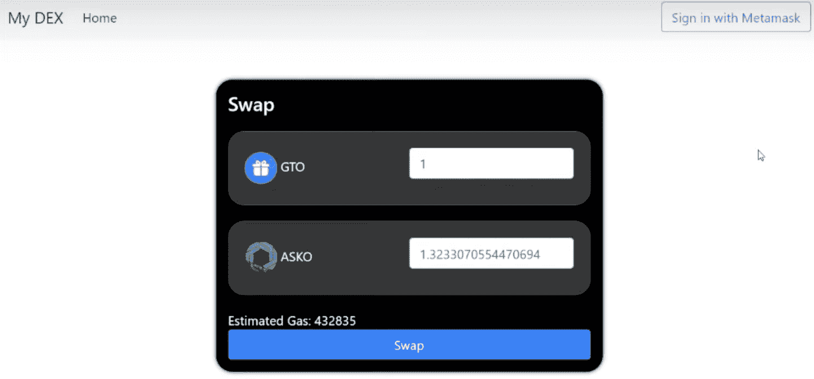

我们将使用 [Visual Studio 代码](https://code.visualstudio.com/)作为我们的代码编辑器来构建 dApp，并且由于我们使用了 Moralis，我们将能够在仅仅五个步骤中创建一个 DEX:

1.  设置 Moralis 服务器。
2.  安装 1 英寸 DEX 插件。
3.  创建 HTML 文件。
4.  创建 JavaScript 文件。
5.  为每个事件分配功能。

此外，还有一个额外的任务，那就是使用 CSS 来设计应用程序的样式。然而，在本文中，我们将只关注 HTML 元素和 JavaScript 逻辑。这是因为页面样式是主观的，取决于开发人员的个人偏好。但是，如果你想查看我们即将创建的演示 dApp 的完整代码，请随意访问 [Moralis 的 GitHub 页面](https://github.com/MoralisWeb3/demo-apps/tree/main/dex-tutorial)。此外，如果你想看如何创建索引的视频教程，那么看看下面来自 [Moralis 的 YouTube 频道](https://www.youtube.com/channel/UCgWS9Q3P5AxCWyQLT2kQhBw)的指南。在这里，您可以找到该过程的完整演示，包括如何使用 CSS 样式化字段和按钮:

https://www.youtube.com/watch?v=XOvtnDx1m5c

现在，让我们开始本教程的第一步，创建我们自己的 Moralis 服务器！

## 步骤 1:如何创建 DEX——设置 Moralis 服务器

如果你还没有，你需要做的第一件事就是注册 Moralis。登录到您的帐户后，我们可以通过按管理面板右上角的“+创建新服务器”按钮来启动创建服务器的过程。这将提供一个包含三个不同选项的下拉菜单，对于本教程，我们选择了“Mainnet Server”选项。

如果选择了任一选项，将出现一个新窗口，您需要在其中输入名称，选择一个区域，然后添加所需的网络。在我们的例子中，我们只选择了 ETH:

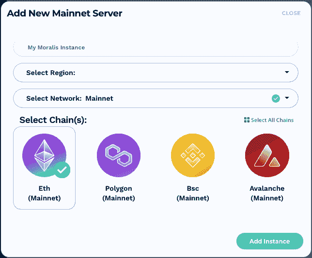

一旦您对您的选项感到满意，您可以简单地单击“添加实例”按钮来启动服务器。创建服务器可能需要一段时间；但是，服务器将很快启动并运行。

## 步骤 2:如何创建索引—安装 1 英寸索引插件

服务器启动并运行后，流程的下一步是将 [1inch DEX 插件](https://moralis.io/plugins/1inch/)添加到服务器。为此，我们需要访问 [Moralis 插件商店](https://moralis.io/plugins/)，我们可以通过点击服务器上的“插件”按钮，然后点击“转到插件商店”找到它。

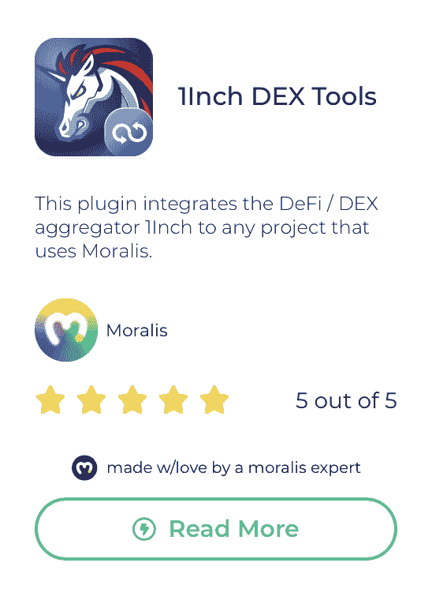

安装插件相对简单，我们需要做的就是点击“阅读更多”按钮找到正确的插件，然后点击“安装”按钮。在这里，您必须选择正确的服务器，它应该是您在上一节中设置的服务器。插件的安装可能需要一段时间，一旦完成，服务器也必须重新启动。但是，服务器很快就会恢复在线，然后我们可以继续学习如何创建 DEX。

## 步骤 3:如何创建索引——创建 HTML 文件

这篇文章的第三步是建立一个 HTML 文件。在这种情况下，我们将文件命名为“[index.html](https://github.com/MoralisWeb3/demo-apps/blob/main/dex-tutorial/index.html)”，你可以通过点击文件名找到完整的代码。该文件将分为四个不同的部分:

*   基本进口品。
*   导航栏。
*   一个容器。
*   一个模态。

在我们进一步进入本文的第四步之前，让我们浏览一下上面提到的部分，以便为您提供对代码更清晰的理解。

### 基本进口

我们首先需要在代码中实现一些重要的导入。这些对于我们的应用程序正常工作至关重要，例如，我们包括“web3.js”和“moralis.js”。实现这些要点很容易，你需要做的就是从 Moralis 的 GitHub 页面获取一些[样板代码](https://github.com/MoralisWeb3/demo-apps/tree/main/moralis-sign-in-boilerplate)。

我们继续复制和粘贴代码，然后进行一些调整。例如，我们更改了标题，删除了所有与“超大屏幕”相关的内容。因此，这是修改后的最终结果:

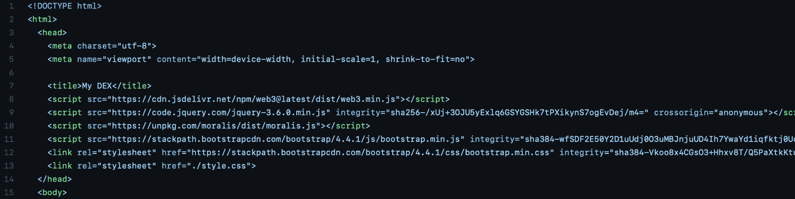

### 导航栏

如果您回头看看我们之前展示的 UI，您可能会注意到一个导航栏。在我们的 HTML 代码中添加导航栏很简单；我们所需要的就是从 Bootstrap 中获取一个[模板，并将其实现到我们的代码中。我们选择了引导页面上提供的第一个模板，并进行了一些调整。我们主要删除了一些不必要的元素，因此，我们代码的最终产品如下所示:](https://getbootstrap.com/docs/4.0/components/navbar/)

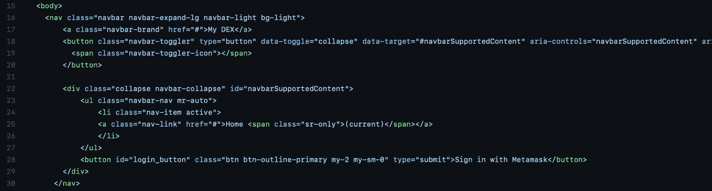

### 集装箱等级

接下来，我们将添加“div”容器，它将包含 DEX 的 UI 的所有内容。这一部分将有一些基本的元素，比如应用程序的字段和按钮的代码。完整的“div”容器如下所示:

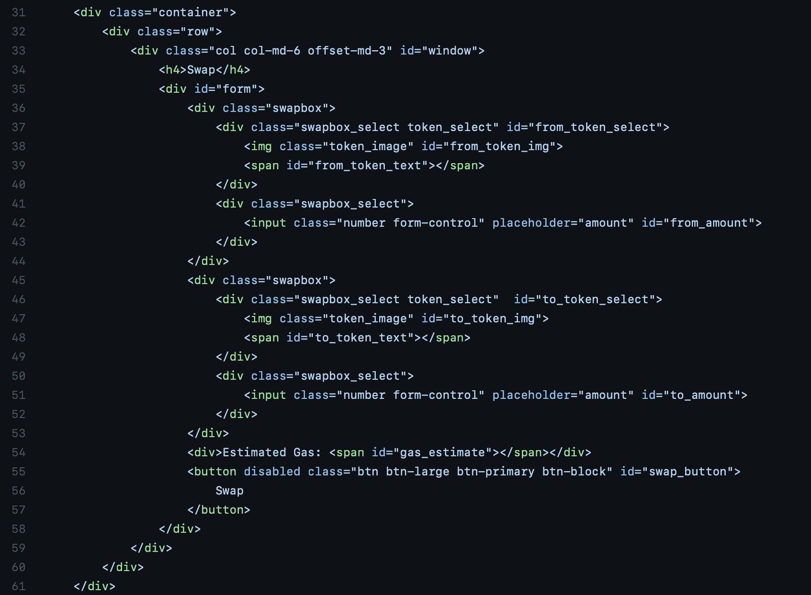

完整的“div”容器包含几个其他的“div ”,比如带有“swapbox”类的那些。有两个“swapbox 类”,它们包括用于选择令牌的 HTML 代码，以及允许用户指定数量的输入字段。具有“swapbox”类的“div”之一显示用户想要交易的令牌；同时，另一个指示用户希望在交易后收到哪个令牌作为回报。

在这两个元素之后，还有一个“div ”,用于显示估计的天然气价格，还有一个按钮，用于执行交换本身。然而，重要的是要注意，您可以修改所有的 HTML 代码来适应您自己的偏好。这意味着内容不必以这种方式组织。

### 情态的

每当 DEX 的用户与 dApp 交互并想要选择令牌时，将会打开包含所有可用选项的单独菜单。因此，我们还需要一个 HTML 元素来显示标记，这就是模态“div”的用武之地。为了创建这个“div ”,我们再次获取一个[引导模板](https://getbootstrap.com/docs/4.0/components/modal/),并做一些修改。完整的模态“div”如下所示:

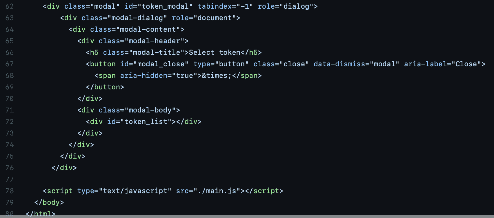

这个“div”的一部分是一个按钮，用于在打开模式时关闭它。这个按钮有一个“modal _ close”ID，我们稍后将把它与一个关闭 modal 的函数联系起来。在模态体中，有一个用于标记列表的“div ”,我们将在向 DEX 用户显示标记列表时使用它。然而，当我们讨论 dApp 的功能时，我们将回到这个问题。

现在，这就是 HTML 代码！但是，如果您决定简单地使用 GitHub 页面中的相同代码，web 应用程序看起来会很混乱。原因是我们需要用 [CSS](https://moralis.io/cascading-style-sheets-what-is-css/) 来设计应用程序的样式。我们不会进入这个过程，因为这取决于你的喜好和你希望的界面外观。因此，我们将简单地链接到“ [style.css](https://github.com/MoralisWeb3/demo-apps/blob/main/dex-tutorial/style.css) ”文件，让你仔细看看，也许会得到一些灵感。

## 步骤 4:如何创建索引——创建 JavaScript 文件

因此，现在我们已经为应用程序准备好了字段和按钮，我们可以继续进行第四步，即向我们的 dApp 添加一些功能和逻辑。然而，在我们创建交易所的功能之前，我们需要初始化 Moralis。为此，您需要从之前创建的服务器获取服务器 URL 和应用程序 ID。您可以通过单击相关服务器的“查看详细信息”按钮找到此信息。然后，您可以继续复制这些信息，并按以下方式将其粘贴到代码中:

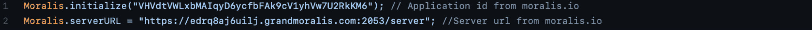

初始化 Moralis 后，我们还将添加三个全局变量。第一个代表当前交易，第二个代表当前选择的一方，最后一个代表代币。然而，我们稍后将解释为什么这些全局变量会派上用场。但这是它们在代码中的样子:

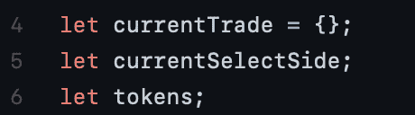

现在，初始化了 Moralis，并添加了全局变量，我们可以继续进行 dApp 的第一个函数了。我们将把这个函数称为“init()”，一旦 dApp 启动，它就会运行。

### “init()”函数

“init()”函数很重要，因为它负责用户启动 dApp 时的一些初始任务。下面是整个函数的图像:

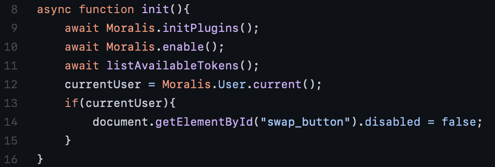

该函数的前两行非常重要；一个确保来自服务器的插件可用，另一个初始化 [Moralis 的 SDK](https://moralis.io/exploring-moralis-sdk-the-ultimate-web3-sdk/) 。该函数的第三行运行“listAvailableTokes()”函数。这个函数获取所有可用的令牌，并在应用程序启动时直接加载这些信息。这样做的原因是效率，这意味着当用户要进行交易时，他们不需要等待 dApp 来获取替代品。

最后，我们还检查用户是否通过了身份验证并使用元掩码登录。如果是，那么我们启用“交换”按钮。

### “login()”函数

我们要仔细研究的第二个函数是“login()”函数。这个函数非常简单，看起来像这样:

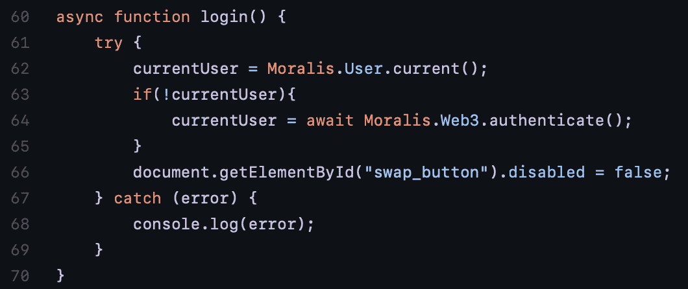

该函数检查是否有用户登录。如果用户没有登录，那么我们可以用元掩码对用户进行[认证。如果用户已经登录，那么该功能只需启用“交换”按钮。](https://moralis.io/how-to-authenticate-with-metamask/)

### “openModal()”和“closeModal()”函数

以下两个函数是不言自明的；一个打开模态，另一个关闭模态。此外，从下图可以看出，“openModal()”函数采用“side”形式的参数。dApp 根据用户选择的模式来指示这一点。因此，根据他们是选择“from_token_select”选项还是“to_token_select”选项，该变量会发生变化。有了这些信息，该函数还会更改全局变量“currentSelectSide”的状态，向 dApp 指示未来应该在哪里进行更改。

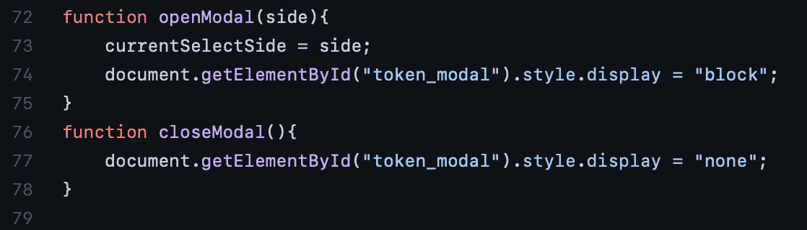

### “listAvailableTokens()”函数

接下来，我们有“listAvailableTokes()”函数，它是我们通过“init()”函数调用的。这个函数做了很多事情，其中之一是通过 Moralis 的“getSupportedTokens()”函数获取可用的令牌，然后将它们存储在一个列表中:

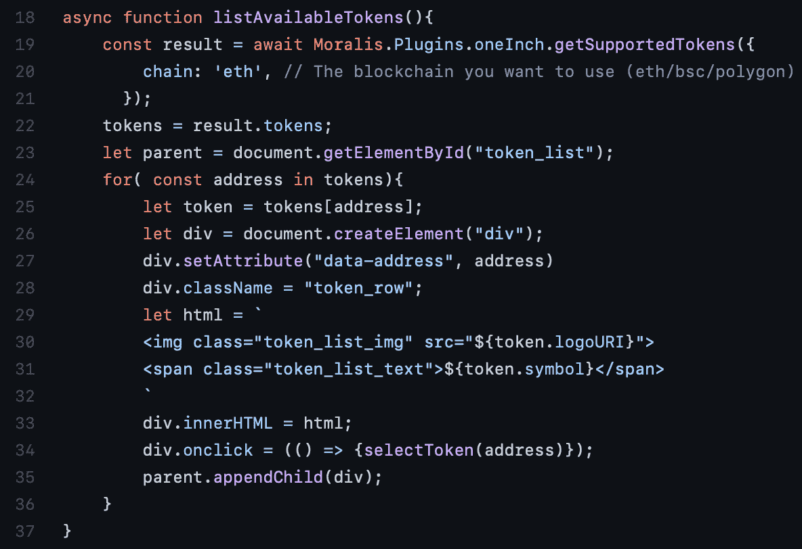

利用获得的关于代币的信息，我们可以访问许多东西，例如代币的小数、图像 URI 和代币符号。然后，我们可以使用“for”循环遍历每个对象，并使用这些信息填充一个列表，使我们能够通过 HTML 代码中的模式向用户显示图像和令牌的符号。

此外，在“for”循环中，我们还为每个令牌添加了一个“onclick”事件。这意味着一旦用户点击列表中的任何选项，就会触发“selectToken()”函数。然而，我们还没有创建这个函数，所以我们将在下一节中创建它。

### “selectToken()”函数

在这一节中，我们将简要地看一下“selectToken()”函数，每当用户从模态中选择一个标记时，都会调用这个函数。一旦被触发，该函数将地址作为参数传递，然后关闭模态。

在调用“closeModal()”后，该函数还将选择添加到全局对象“currentTrade”中。这种情况会发生两次，第一次是当用户决定他们想要交易哪个令牌时，第二次是当用户决定他们想要收到哪个令牌作为回报时。

最后，该函数调用两个额外的函数:“renderInterface()”和“getQuote()”，我们将在接下来的两个部分中研究这两个函数。

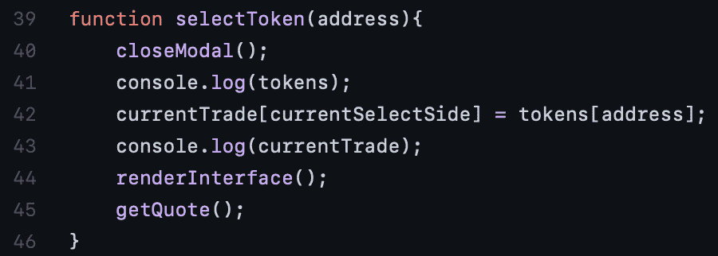

### “renderInterface()”函数

一旦用户选择了令牌,“renderInterface”函数就呈现令牌图像和符号。如图所示，它根据用户交互的对象，对“from_token_select”和“to_token_select”元素都这样做。这个函数看起来是这样的:

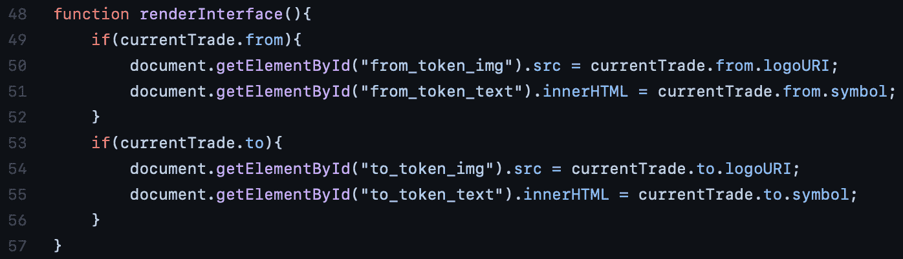

### “getQuote()”函数

接下来，我们将实现“getQuote()”函数。该功能旨在获取代币的报价，并自动显示用户在进行交易时将获得的金额。这是函数的样子，我们将讨论最关键的元素:

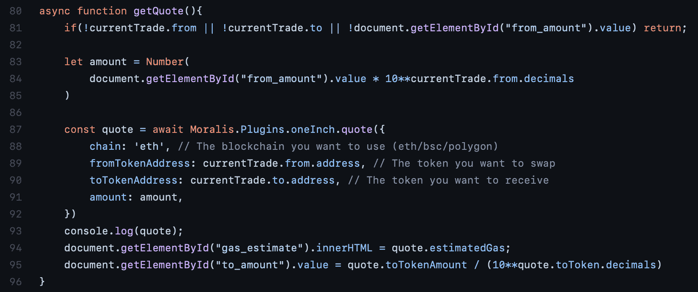

首先，该函数检查用户是否选择了他们想要交易和接收的首选令牌，以及“from_amount”值是否存在。如果缺少这些元素中的任何一个，那么函数将返回，直到用户输入所有内容。

如果用户已经输入了所有信息，则创建一个名为“amount”的新变量，该变量根据所选令牌的小数来转换输入的金额。有了适当的金额，该函数接着调用 1inch "quote()"函数。可以从插件库中获取这个函数。然后，我们分配适当的地址以及先前转换的“数量”变量。

有了报价，该函数就可以设置估计的天然气价格和“to_amount”。因此，这将自动显示天然气价格和用户将从交易中获得的金额。

### “trySwap()”函数

要发送令牌，1inch 插件必须收到智能合约的许可，以便进行交换。因此，“trySwap()”函数在调用“doSwap()”函数之前会检查用户是否提供了津贴。此外，函数看起来是这样的:

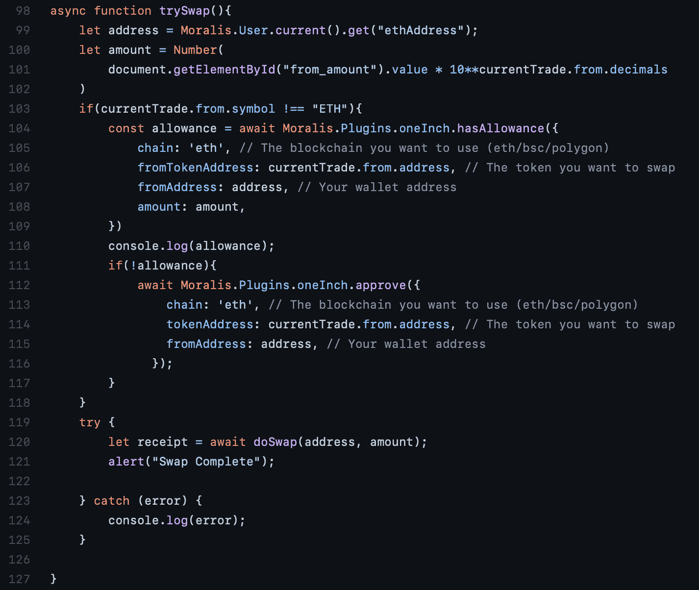

该函数做的第一件事是获取用户的钱包地址并转换输入的金额(就像前面的函数一样)。如果用户想要交易 ETH，则不需要津贴。因此，该函数随后检查货币符号是否等于“ETH”。如果不是，那么该函数检查用户是否提供了津贴，这是通过调用“hasAllowance()”函数来完成的。该函数将返回一个布尔值，该值为真或假。

如果用户没有提供津贴，则调用“approve()”函数，该函数从用户处获取津贴，从而实现交换。从图中可以看出，需要提供令牌和用户的钱包地址。

### “doSwap()”函数

最后，我们有“doSwap()”函数，它执行实际的传输。从“trySwap()”函数中可以看出，一旦用户给了津贴，这个函数就会执行。下面是函数:

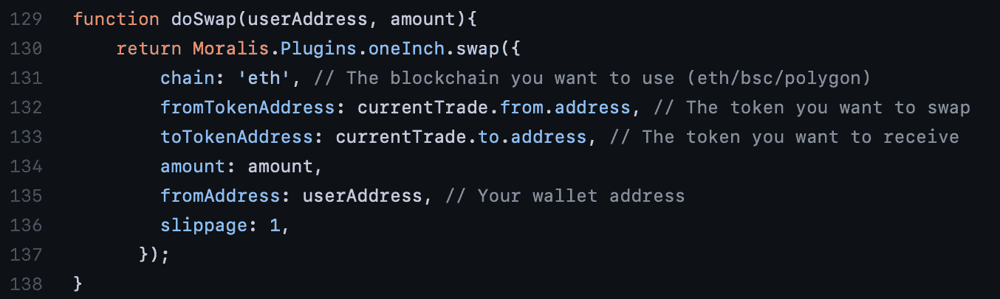

这里我们简单地调用带有几个参数的 1 inch Moralis“swap()”函数。当调用“doSwap()”函数时，用户地址和金额作为参数传递，其他信息从所选的令牌中提取。

此外，这里还有一个新的性质，就是滑移。在上面的代码中，它被设置为 1%，这是通常的标准。最后，一旦交换完成，用户将通过“trySwap()”函数得到警告。

## 步骤 5:如何创建索引——为每个事件分配函数

既然按钮/字段和功能都已完成，我们还需要将所有东西结合在一起。因此，我们将为字段和按钮添加几个“onclick”事件和一个“onblur”事件。我们可以通过简单地给每个事件分配一个函数来做到这一点；因此，这就是我们的 [JavaScript](https://moralis.io/javascript-explained-what-is-javascript/) 文件的最后几行:

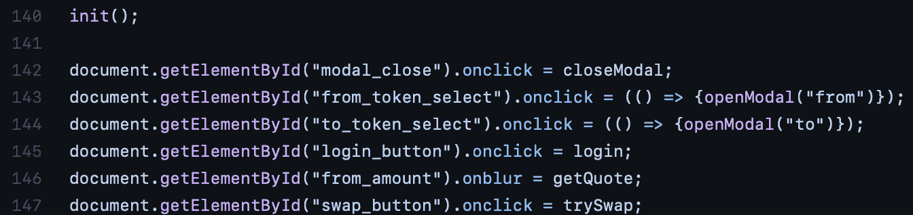

“onclick”事件非常简单；点击一个按钮，就会执行一个功能。另一方面，“onblur”事件可能更难理解。该事件意味着一旦用户将焦点从“from_amount”字段移开，就会触发“getQuote()”函数。因此，一旦他们键入金额并将焦点从该输入字段移开，报价将显示在“to_amount”字段中。

现在，这涵盖了如何创建 DEX 的所有基本元素；剩下的工作就是使用 CSS 根据自己的喜好来设计 dApp。

## 如何创建索引摘要

由于我们在本教程中一直使用 Moralis，我们已经展示了该平台的强大功能，因为我们只需五个简单的步骤就可以创建一个 DEX:

1.  设置 Moralis 服务器。
2.  安装 1 英寸 DEX 插件。
3.  创建 HTML 文件。
4.  创建 JavaScript 文件。
5.  为每个事件分配功能。

这清楚地展示了 Moralis 的力量，在整个编码过程中，我们使用了一些通过 1inch DEX 插件提供的现成功能。通过使用该平台的工具，我们已经显著缩短了该 DEX 的开发时间。因此，您知道如何通过五个步骤从头开始创建索引！

此外，创建 DEX 只是 Moralis 平台派上用场的众多实例之一。该平台提供了各种优秀的开发工具以及已经管理好的后端基础设施，使得 Moralis 成为了 Web3 开发的终极中间件。

此外，如果你想了解更多与 Moralis 合作的潜力，那就去看看 Moralis 的博客吧。在这里，您可以找到展示使用该平台的强大功能的精彩文章。例如，有关于[如何给 dApps](https://moralis.io/how-to-add-fiat-gateway-to-dapps/) 添加菲亚特网关和[如何创建自己的 NFT 游戏](https://moralis.io/how-to-create-your-own-nft-in-5-steps/)的指南。

有了这些好处，注册 Moralis 公司是显而易见的。加入该平台是完全免费的，只需要几秒钟，所以不要犹豫！