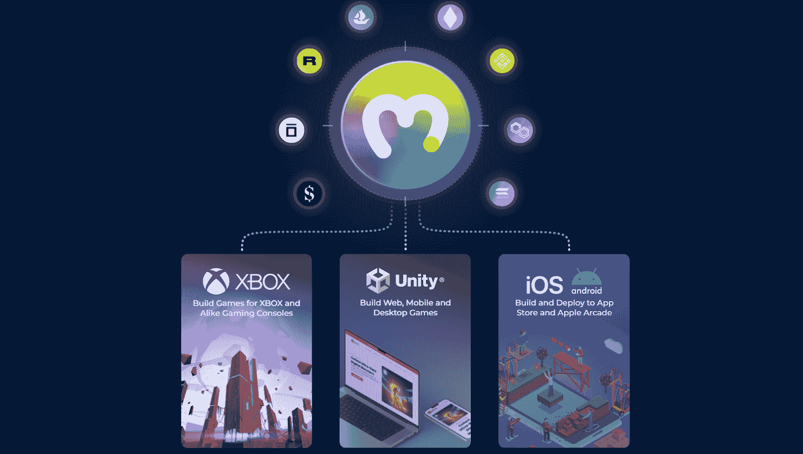
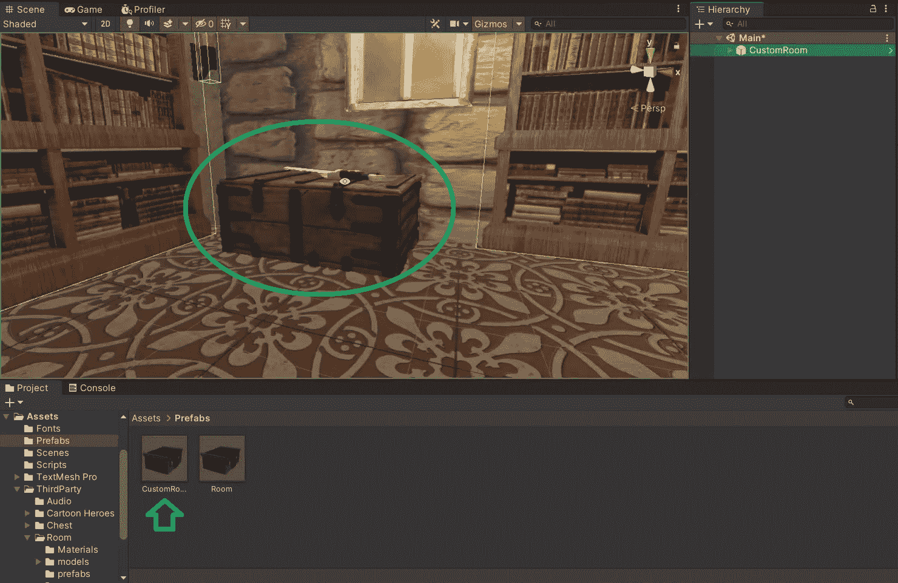
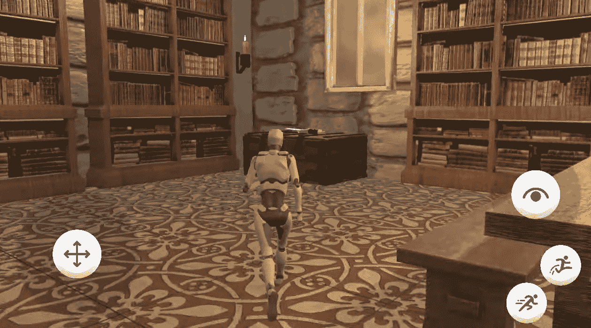
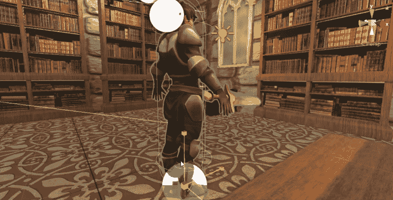
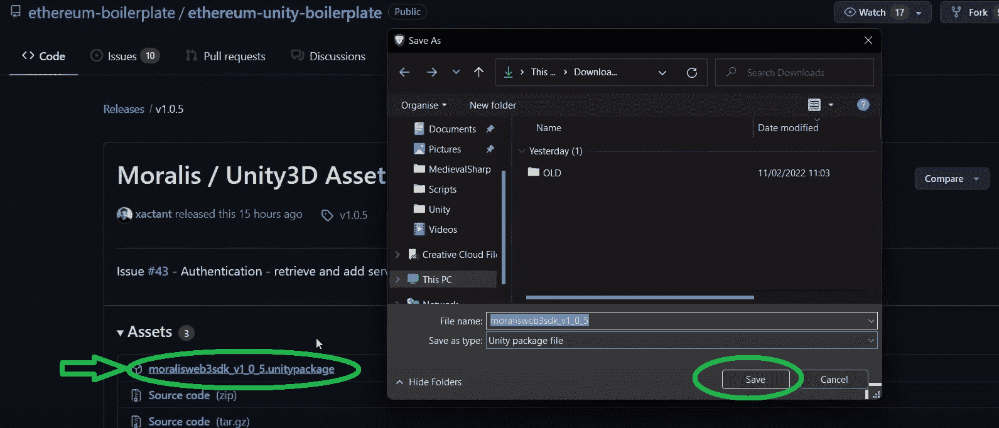
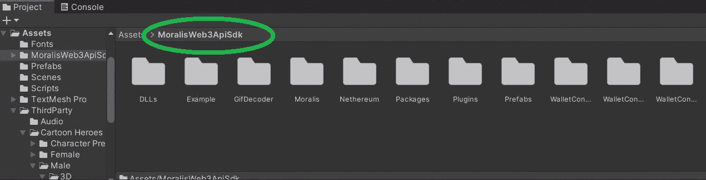
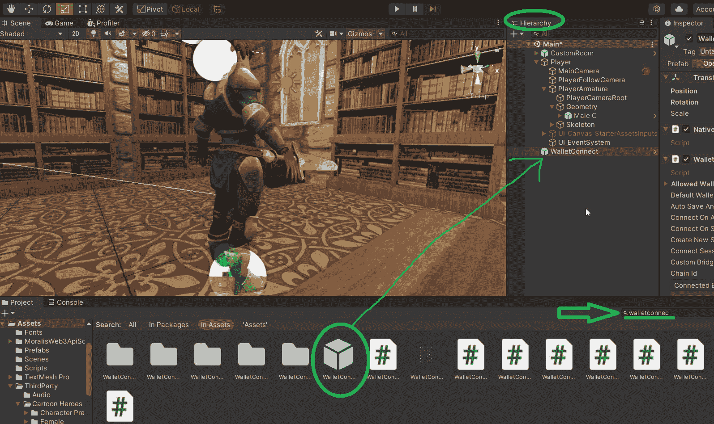
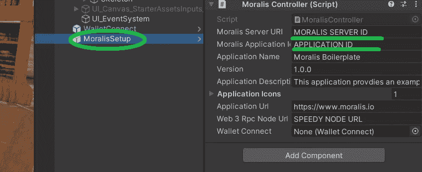
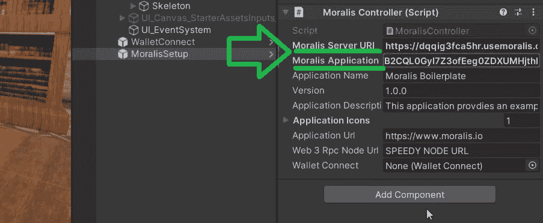
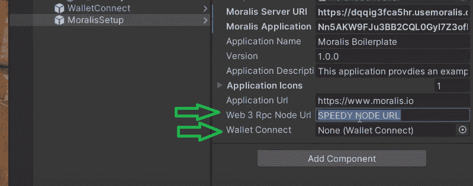

# 如何创建一个团结的元宇宙 dApp

> 原文：<https://moralis.io/how-to-create-a-metaverse-dapp-with-unity/>

学习如何用 Unity 创建元宇宙 dApp 是每个开发人员目前的想法。这并不奇怪，因为区块链技术、NFTs 和游戏内资产在 Web3 领域越来越受欢迎。尽管如此，我们需要记住，以其最真实的形式，元宇宙仍然是一个概念。因此，目前有一些 Web3 应用程序包含了类似元宇宙的元素。然而，只有时间才能告诉我们是否/何时能够创造一个真正的、完全沉浸式的元宇宙。但是现在，我们必须解决什么是可能的。因此，我们可以创建含有元宇宙样元素的 dApps。此外，这些可以是各种游戏、虚拟社交网络和虚拟事件。因此，如果创建一个元宇宙 Web3 应用程序听起来很有趣，请跟随我们在本文中发现如何用 Unity 创建一个元宇宙 dApp。

随着我们的发展，你将学会如何使用终极的 [Web3](https://moralis.io/the-ultimate-guide-to-web3-what-is-web3/) 开发平台、 [Moralis](https://moralis.io/) 。这个“ [Firebase for crypto](https://moralis.io/firebase-for-crypto-the-best-blockchain-firebase-alternative/) ”平台可以满足你所有与区块链相关的后端需求。有了 Moralis [元宇宙 SDK](https://moralis.io/metaverse/) ，你可以用短短的代码片段来包含加密功能。此外，当谈到解决“如何创建一个元宇宙”时，Moralis 的[终极 NFT API](https://moralis.io/ultimate-nft-api-exploring-moralis-nft-api/) 也会有所帮助。因此，通过加入我们，我们建立了一个团结的元宇宙 dApp，你有机会使用 Moralis。你所需要做的就是[创建你的免费 Moralis 账户](https://admin.moralis.io/register)并完成初始设置，我们会指导你完成。当然，熟悉 Unity 会让事情变得更简单。然而，我们在这里将要进行的示例项目相当简单。因此，即使是完全的初学者，用 Unity 构建元宇宙 dApp 也没有问题。

## 如何创建元宇宙 dApp 一个示例项目

在接下来的部分中，我们将直接进入我们的示例项目。现在，为了建立一个团结的元宇宙 dApp，我们将走几条捷径。我们将严重依赖 Unity 的资产商店，它将为我们提供用于构建 3D 空间和角色的元素。此外，为了让事情变得更简单，您有机会在 [GitHub](https://github.com/MoralisWeb3/youtube-tutorials/tree/main/unity-metaverse) 访问我们的完整代码。然而，在我们真正向您展示如何创建元宇宙之前，让我们对我们的示例 dApp 做一个简单的预览。

### 用 Unity 构建元宇宙 dApp–预览

*注* *:如果你更多的是一个视频人，我们建议查看本文末尾 0:51 开始的视频。在那里，Unity and Moralis 专家将向您展示我们的示例 dApp 的细节。*

下面是用户登录前我们的示例元宇宙的屏幕截图:

看上面的图片，你可以看到我们的 3D 世界的例子——一个中世纪的图书馆。此外，你可以看到一个二维码，这是我们元宇宙的门户。此外，就在代码上方有一个清晰的说明，告诉用户该做什么。

然而，一旦用户扫描二维码并确认登录，他们就可以控制头像。此外，现在头像上方显示了用户的 [Web3 钱包](https://moralis.io/what-is-a-web3-wallet-web3-wallets-explained/)地址:

上面两张截图是我们的示例 dApp 的要点。如你所见，我们尽可能保持事情简单。然而，我们希望你能看到我们的例子的潜力。通过扩展 3D 世界(添加房间、建筑、地图等。)和添加多个字符，你可以有自己一个适当的元宇宙。有了预览，让我们向你展示如何创建一个团结和 Moralis 的元宇宙 dApp。

*如果你觉得在继续前进之前需要温习一下你的元宇宙知识，请务必阅读我们的文章，回答问题“* [*什么是元宇宙？*](https://moralis.io/what-is-the-metaverse-full-guide/) *”。*

## 如何创建一个团结和 Moralis 的元宇宙民主行动党

以下是我们在“如何打造元宇宙”探索过程中需要完成的主要步骤:

1.  创造一个 3D 世界。
2.  创建一个第三人称角色(头像)。
3.  使用简洁的二维码选项添加 Web3 钱包登录。

我们将使用 Unity 完成前两步。如上所述，通过使用 Unity 资产商店提供的免费资产，我们将使我们的工作更加简单。*您可以在 GitHub 上的“* [*资产*](https://github.com/MoralisWeb3/youtube-tutorials/tree/main/unity-metaverse/Assets) *”文件夹中找到所有使用过的资产。*

尽管如此，在最后一步，我们将使用最好的 [Web3 后端平台](https://moralis.io/exploring-the-best-web3-backend-platform/)。此外，这也是使用户能够输入我们的示例元宇宙的步骤。此外，让我们指出 [Web3 认证](https://moralis.io/web3-authentication-the-full-guide/)或 [Web3 登录](https://moralis.io/how-to-build-a-web3-login-in-5-steps/)是所有 dApps 的必要组成部分。幸运的是，有许多可靠和用户友好的选项可用。例如，当以精通加密的用户为目标时，[元掩码](https://moralis.io/metamask-explained-what-is-metamask/)和 [WalletConnect](https://moralis.io/what-is-walletconnect-the-ultimate-walletconnect-guide/) 身份验证是一条可行之路。然而，当 Web3 用户入门侧重于更传统的用户时， [Web3 社交登录](https://moralis.io/web3-social-login-sign-in-dapp-users-with-google-email-or-twitter/)和[通过电子邮件进行 Web3 认证](https://moralis.io/how-to-do-web3-authentication-via-email/)甚至是更好的选择。因此，在创建 dApps 或 metaverses 时，一定要知道你的目标受众是谁。

此外，这是第三步，您将体验到 [Moralis SDK](https://moralis.io/exploring-moralis-sdk-the-ultimate-web3-sdk/) 的强大功能。因此，您可以一窥为什么 Moralis 为开发人员节省了超过 87%的开发时间。此外，通过使用 Moralis，您可以避免 RPC 节点的所有[限制。此外，由于 Moralis 的跨链互操作性，您的 dApps 不局限于单链。反过来，你的工作是“经得起未来考验的”。除了出色的 API，Moralis 还为您提供了 Moralis 服务器、Moralis 仪表板(数据库)和 Moralis“同步”功能。这些工具的组合使您能够](https://moralis.io/exploring-the-limitations-of-rpc-nodes-and-the-solution-to-them/)[同步和索引智能合约事件](https://moralis.io/sync-and-index-smart-contract-events-full-guide/)和[索引区块链](https://moralis.io/how-to-index-the-blockchain-the-ultimate-guide/)。

### 用 Unity 打造元宇宙 dApp 创造 3D 世界

使用下面的视频(从 3:57 开始)，Moralis 专家将指导您创建一个 3D 世界的步骤。如果你想有创造力，请随意使用不同的资源。你将开始创建一个新场景。然后，您将学习如何整齐地排列和分组资产文件，以便可以轻松地浏览文件夹。实际上，他将使用“CustomRoom”文件，其中包含一个顶部有一把剑的箱子:

### 用 Unity 建立一个元宇宙 dApp 增加一个第三人称角色

一旦你的 3D 世界准备好了，你就可以添加第三人称角色了。幸运的是，您可以使用免费资产来避免从头开始构建角色。有关如何添加头像的更多详细指导，请观看 5:30 的视频。在那里，专家将向您展示如何找到“NestedParentArmature”(“玩家”)，您可以将它用作您的角色的基础:

此外，您将学习如何在房间中添加网格碰撞器，以便角色可以在地板上行走。这将已经为你提供了一个功能齐全的头像；然而，在机器人出现时:

然后，你将学习如何改变化身的甲胄。对于这个例子，我们选择了“[男性 C](https://github.com/MoralisWeb3/youtube-tutorials/blob/main/unity-metaverse/Assets/ThirdParty/Cartoon%20Heroes/Character%20Prefabs/Male/Male%20C.prefab) ”选项。只需简单的点击几下，你就可以拥有一个很酷的头像供你使用。此外，由于角色的初始大小有点小，您还将学习如何放大它:

完成以上步骤后，你应该已经准备好你的 3D 世界和第三人称角色了。这意味着是时候添加区块链功能了。如上所述，这就是 Moralis 让事情变得尽可能简单的地方。

### 如何创建元宇宙 dApp 加密集成

如果你想依靠下面的视频，跳到 8:25。在那里，您会看到您甚至可以使用谷歌来访问 Moralis 元宇宙 SDK。但是，您可以使用前面提到的链接。进入 Moralis 元宇宙 SDK 页面后，向下滚动一点，然后单击“立即开始”按钮:

这将把你带到在 GitHub 等待你的以太坊统一样板文件。接下来，单击“版本”部分访问最新版本:

然后，保存*。unitypackage* 文件到您的计算机:

接下来，回到 Unity，你需要将上面下载的文件夹拖放到 Unity 的界面上。此外，你还需要确认进口。导入完成后，您将在 Unity 中看到“MoralisWeb3ApiSdk”文件夹:

对于我们的示例项目，我们只需要“WalletConnect”和“MoralisSetup”。为了加快速度，请使用搜索按钮来查找这两个组件。然后，只需将它们拖放到您的“层级”选项卡中:

添加 WalletConnect 组件后，您需要调整一些设置(10:00)。“Moralis 设置”也是如此(10:17)。这也是您需要 Moralis 服务器详细信息的地方:

因此，这是创建 Moralis 服务器的提示。为此，您需要完成初始的 Moralis 设置。

#### 初始 Moralis 系统设置-第 1 部分

无论你是想用 Unity 构建一个元宇宙 dApp，还是仅仅使用终极[以太坊 dApp 样板](https://moralis.io/ethereum-dapp-boilerplate-full-ethereum-react-boilerplate-tutorial/)构建一个简单的 dApp，你都需要创建你的 Moralis 服务器。以下步骤将帮助您做到这一点:

1.  **登录您的 Moralis 账户**–此时，您可能已经拥有一个有效的 Moralis 账户；这样的话，只要[登陆](https://admin.moralis.io/login)就可以了。*不过，如果你还没有一个 Moralis 家账号，就在这里* [*注册*](https://admin.moralis.io/register) *。然后，输入您的电子邮件，创建您的密码，并通过单击确认链接(检查您的电子邮件收件箱)来完成该过程。*

2.  [**创建 Moralis 服务器**](https://docs.moralis.io/moralis-server/getting-started/create-a-moralis-server)–登录后，点击“+创建新服务器”按钮(位于“服务器”选项卡的右上角)。接下来，选择最适合您项目的网络类型(见下面的截图)。*在示例项目的情况下或测试 dApps 时，“Testnet 服务器”或“本地 Devchain 服务器”应该是你的重点。然而，当你想上线时，你需要点击“Mainnet 服务器”。*

然后，您将看到一个弹出窗口，询问您的服务器详细信息。您需要输入您的服务器名称(可以是您想要的任何名称)，然后选择您的地区、网络类型和链。要启动服务器，请单击“添加实例”:

3.  **访问服务器详细信息**–一旦您的服务器启动并运行，您可以通过单击“查看详细信息”按钮来访问其详细信息:

将出现另一个包含所有详细信息的窗口。这使您有机会通过单击复制图标来复制服务器的 URL 和应用程序 ID:

4.  **填充 Unity***–*现在，您需要将上面复制的服务器详细信息粘贴到 Unity 中:

#### 初始 Moralis 标准设置-第 2 部分

Moralis 设置的另一部分要求您添加一个 Moralis [Speedy Node](https://moralis.io/speedy-nodes/) URL(见上图)。幸运的是，创建了你的 Moralis 账户后，Moralis 的快速节点也在你的支配之下。因此，返回到您的 Moralis 管理区，并选择“快速节点”标签。然后，单击您为服务器选择的网络下的“端点”按钮:

如果我们假设你的服务器在以太坊主网上，那么你需要点击“以太网”下的“端点”。从弹出窗口中，您需要复制 mainnet URL 地址(同样的原则适用于其他 mainnet 或[testnet](https://moralis.io/ethereum-testnet-guide-connect-to-ethereum-testnets/)):

现在，返回 Unity，将复制的 URL 粘贴到“ *Web 3 Rpc 节点 Url* ”选项旁边，如下所示:

此外，不要忘记通过从“层次结构”选项卡中拖放“WalletConnect”来链接您的 WalletConnect(更多详细信息，请观看 11:50 的视频)。

通过完成上面的设置，您已经准备好向我们的元宇宙 dApp 示例添加最终的特性了。如果您还记得我们的预览，我们仍然需要二维码和显示的钱包地址。有关如何添加这两个功能的详细信息，请使用下面的视频。二维码实现从 11:56 开始，头像上方显示的地址是 13:47。最后，Moralis 专家还将从 15:00 开始指导您完成代码脚本。

https://www.youtube.com/watch?v=wjqDSH29ZKk

## 如何使用 Unity 创建元宇宙 dApp–总结

如果你已经按照我们的指导和上面的视频教程，你现在知道如何创建一个元宇宙(它的开始)。您已经学习了如何通过创建一个 3D 世界，添加一个第三人称角色，并为 Web3 后端设置使用 Moralis 来构建一个元宇宙 dApp。

因此，在这一点上，你可能会非常兴奋，渴望把事情带到下一个层次。然而，如果你需要首先增强你的信心，获得一些想法，或者关注区块链领域的其他方面，我们建议你探索和学习 Web3 的其他方面。因此，你可以通过探索[Moralis 的 YouTube 频道](https://www.youtube.com/c/MoralisWeb3)和[Moralis 的博客](https://moralis.io/blog/)继续你的免费加密教育。在那里你可以找到大量有价值的内容。例如，我们的一些最新主题涵盖了[如何建立币安智能链钱包](https://moralis.io/bsc-wallet-guide-how-to-set-up-a-binance-smart-chain-wallet/)、[治理令牌](https://moralis.io/what-are-governance-tokens-full-guide/)、[可重入智能合约示例](https://moralis.io/what-is-reentrancy-reentrancy-smart-contract-example/)、 [React Native Web3](https://moralis.io/react-native-web3-full-react-native-web3-dev-guide/) ，以及 [Web3 游戏化](https://moralis.io/web3-gamification-creating-a-coinmarketcap-diamonds-dapp/)。

如果你想尽快成为全职加密员，那么你可能要采取更专业的方法。因此，报名参加 Moralis 学院可能是正确的道路。因此，你将获得广泛的专业[区块链发展课程](https://academy.moralis.io/all-courses)。

