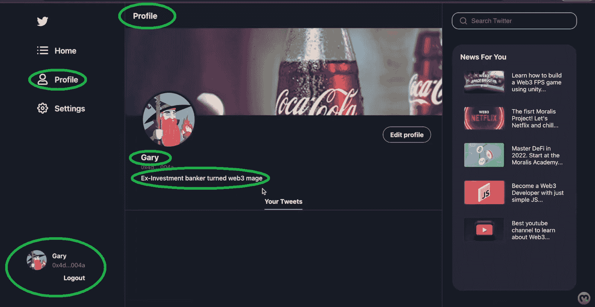
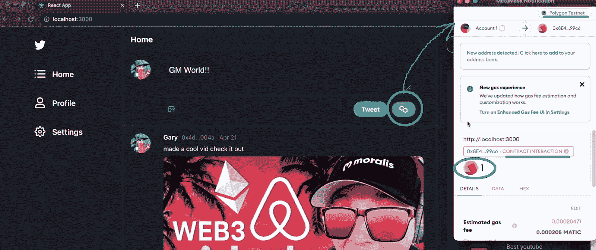
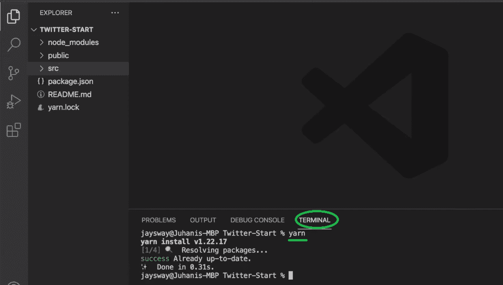
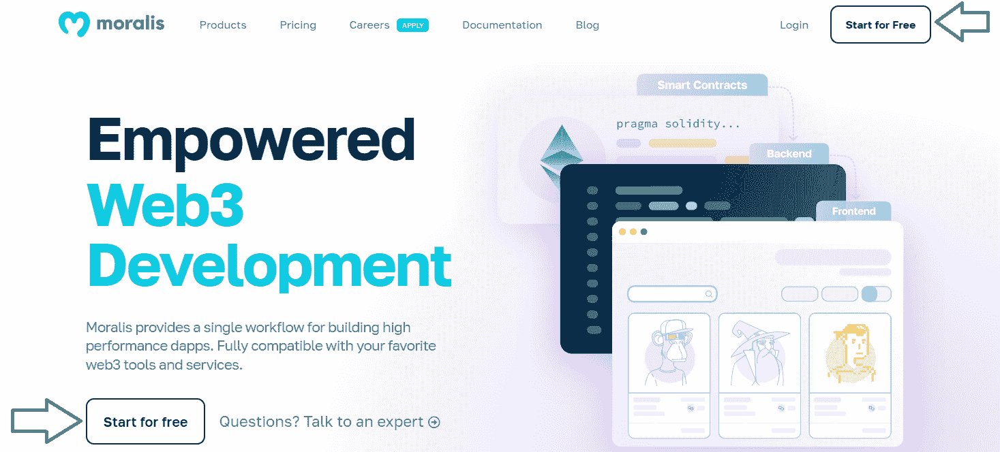
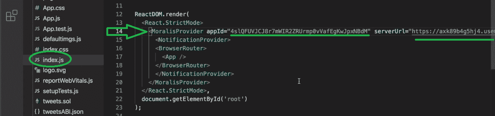
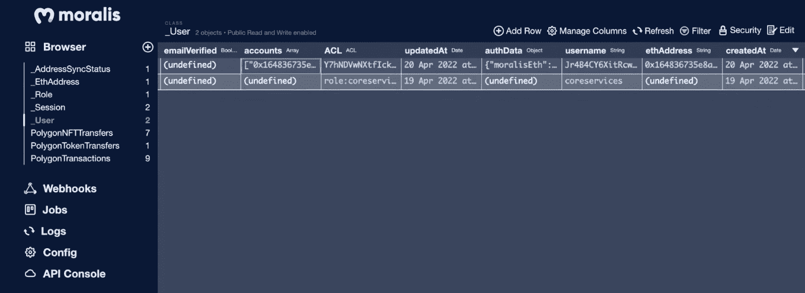
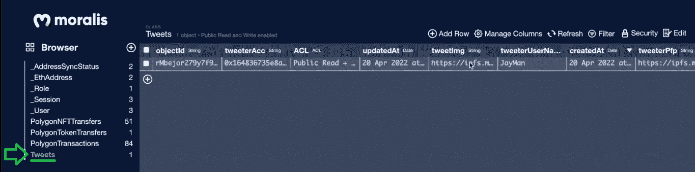

# 如何创建社交媒体 Dapp

> 原文：<https://moralis.io/how-to-create-a-social-media-dapp/>

社交媒体已经改变了我们在线互动的方式，并成为我们日常生活中必不可少的工具。然而，由于当前社交媒体渠道和应用程序的集中性质，诸如数据泄露、审查、ghost banning 等问题。不幸的是，这种现象非常普遍，对全世界的用户和内容创作者产生了负面影响。幸运的是，随着我们慢慢地从 web 2[**过渡到 Web3**](https://moralis.io/what-is-web2-and-web3-explaining-web3/) **，开发者有机会通过创建分散的替代方案来解决这些集中的社交媒体问题。你想开发一个分散的社交媒体应用程序吗？如果是这样，请密切关注这里的内容，因为我们创建了 Twitter 的社交媒体 dapp 克隆。现在，不要惊慌；** [**构建一个去中心化的 Twitter**](https://moralis.io/2022-guide-to-building-a-decentralized-twitter/) **并没有听起来那么有挑战性。事实上，使用** [**最好的 Web3 技术堆栈**](https://moralis.io/exploring-the-web3-tech-stack-full-guide/) **，你可以在不到 90 分钟的时间内轻松创建一个 Web3 Twitter 之类的社交媒体 dapp！**

在接下来的章节中，您将学习如何利用 [React](https://moralis.io/react-explained-what-is-react/) 、 [Remix](https://moralis.io/remix-explained-what-is-remix/) 和 [Moralis](https://moralis.io/) 来毫不费力地构建[分散式应用程序](https://moralis.io/decentralized-applications-explained-what-are-dapps/) (dapps)。React 将使你能够运用你的 [JavaScript](https://moralis.io/javascript-explained-what-is-javascript/) 熟练程度并覆盖前端。有了 Remix，你将轻松地编译和部署一个[智能契约](https://moralis.io/smart-contracts-explained-what-are-smart-contracts/)来支持你的社交媒体 dapp。此外，有了 Moralis(又称为加密的[Firebase](https://moralis.io/firebase-for-crypto-the-best-blockchain-firebase-alternative/))，你就可以把所有的事情联系在一起。有了这个终极的 [Web3 后端平台](https://moralis.io/exploring-the-best-web3-backend-platform/)，你将轻松实现所有必要的 [Web3](https://moralis.io/the-ultimate-guide-to-web3-what-is-web3/) 特性，从 [Web3 认证](https://moralis.io/web3-authentication-the-full-guide/)开始。多亏了 [Moralis SDK](https://moralis.io/exploring-moralis-sdk-the-ultimate-web3-sdk/) ，你将能够[索引区块链](https://moralis.io/how-to-index-the-blockchain-the-ultimate-guide/)并处理[离线数据](https://moralis.io/how-to-store-off-chain-data-unity-web3-database/)和[在线数据](https://moralis.io/web3-data-science-importing-on-chain-events/)。因此，确保[创建你的免费 Moralis 账户](https://admin.moralis.io/register)来使用这个强大的工具集。然而，在我们向您展示如何构建您自己的社交媒体 dapp 实例之前，让我们快速演示一下我们的 Web3 Twitter 克隆。

## 我们社交媒体 Dapp 的演示

就像大多数 dapp 一样，我们的社交媒体 dapp 从 [Web3 登录](https://moralis.io/how-to-build-a-web3-login-in-5-steps/)开始:

查看上面的截图，您可以看到用户使用 [Web3 钱包](https://moralis.io/what-is-a-web3-wallet-web3-wallets-explained/)完成他们的 Web3 认证。点击“连接钱包”后，用户可以在几个选项中进行选择:

然而，在本演示中，我们将考虑一个决定使用元掩码进行[身份验证的示例用户。他首先点击](https://moralis.io/how-to-authenticate-with-metamask/)[元掩码](https://moralis.io/metamask-explained-what-is-metamask/)图标，这触发这个加密钱包的扩展弹出。后者请求数字签名(确认)。因此，用户需要点击“Sign”进入我们的社交媒体 dapp 主页:

在我们的例子中，这个用户第一次登录，我们的 dapp 设置默认的用户图标。当用户登录时，用户可以立即看到 tweets 提要。通过选择“个人资料”选项卡，他可以通过“编辑个人资料”按钮个性化他的帐户:

在个人资料设置中，用户可以输入他们的名字和简历。他们还可以使用存储在联网钱包中的 NFT([不可替换令牌](https://moralis.io/non-fungible-tokens-explained-what-are-nfts/))作为个人资料图像。尽管如此，那些希望这样做的人也可以通过上传图像来个性化他们的横幅。为此，他们只需点击“个人资料横幅”部分下方的灰色区域:

一旦用户输入他们所有的详细信息，他们只需要点击“保存”来完成他们的帐户的个性化。以下是我们名为 Gary 的示例用户的结果:

### 如何用我们的社交媒体 Dapp 发微博

现在让我们来看看用户如何使用我们的社交媒体 dapp 发推文。首先，要访问此功能，他们需要在“主页”选项卡上:

其次，他们需要点击输入字段(显示“GM World”)并输入一些文本。此外，他们可以通过左侧文本下方的“图片”图标在推文中添加图片。一旦他们准备好了文本(和图像)，我们的 dapp 会给他们两个选择。他们可以通过点击“tweet”按钮来进行常规的 Tweet。然而，如果他们点击“多边形图标”(链)，他们就可以在区块链上保存他们的推文。

#### 常规推文演示

如果用户点击“tweet ”,他的新 tweet 基本上会立即出现在输入框下方的 Tweet 线程中:

用户还可以在“您的推文”部分查看他们的推文(在他们的个人资料选项卡内):

#### 链上推文演示

决定在区块链上发布推文的用户将点击“多边形图标”按钮:

这一操作触发了他们的 Web3 钱包，提示他们确认与在区块链上存储他们的推文相关的交易。因此，用户必须点击“确认”并支付燃气费:

一旦处理了上述事务，用户的链上 tweet 也会出现在 tweet 线程中:

由于上述事务是链上事件，我们可以使用区块链浏览器(在我们的例子中是 PolygonScan [Mumbai testnet])来确认上述 tweet 确实存储在 Mumbai 链上:

我们可以选择“事件”选项卡了解更多详细信息。在这里，我们需要将示例事务的“Hex”转换为“Text ”,以查看上面示例 tweet 的内容:

## 使用 React、Remix 和 Moralis 构建您的社交媒体 Dapp

如果上面的演示给你留下了深刻的印象，卷起你的袖子，跟随我们的领导。在这里，您将学习如何创建一个社交媒体 dapp。您将看到如何创建社交媒体 dapp 智能合同，设置前端(侧栏、主页、个人资料页面、设置页面)，以及集成 Moralis 仪表板。除了我们的指导，你还可以在本文末尾观看详细的视频教程。这是我们将在以下部分中使用时间戳引用的视频。

此外，我们在 GitHub 上发布了这个示例项目的[起始代码](https://github.com/MoralisWeb3/youtube-tutorials/tree/main/Twitter-Starter)和[最终代码](https://github.com/MoralisWeb3/youtube-tutorials/tree/main/Twitter-Start)。我们强烈建议您克隆起始代码并自己实现代码。这就是我们的教程假设你会走的路。但是，如果您很着急，您也可以克隆最终代码，并使用我们的教程作为代码演练。现在，事不宜迟，让我们通过研究如何创建社交媒体 dapp 智能合同来开始我们的旅程。

## 社交媒体 Dapp 智能合约

如你所知，每个连锁交易背后都有智能合约。由于我们的 dapp 的链上 tweets 需要链上交易，我们需要一个智能合约。因此，让我们创建智能合约(下面的视频，从 4:42 开始)。从打开 Remix 开始。然后创建一个新文件，并将其命名为“ [tweets.sol](https://github.com/MoralisWeb3/youtube-tutorials/blob/main/Twitter-Start/src/tweets.sol) ”:

*注* *:如果你对学习* [*扎实*](https://moralis.io/solidity-explained-what-is-solidity/) *基础知识不感兴趣，你可以直接复制我们智能合约的代码，粘贴到 Remix 里。*

在新创建的文件的顶部，您必须首先输入“pragma”行。然后，您可以开始添加您的合同细节。确保使用下面的视频教程，以确保正确输入代码行。准备好智能合约后，您需要在部署之前编译它。幸运的是，当使用 Remix (15:51)时，这两个步骤都很容易:

一旦您编制了智能合同，就该部署它了:

如上面的屏幕截图所示，确保导航到右边的选项卡。然后，确保您选择了“Injected Web3”环境，并将您的 MetaMask 扩展连接到 Mumbai testnet。

*注:* *如果这是你第一次使用 MetaMask 连接孟买的 testnet，你必须先添加那个网络。此外，使用* [*孟买测试网龙头*](https://moralis.io/mumbai-testnet-faucet-how-to-get-free-testnet-matic-tokens/) *给你的钱包添加一些“播放”MATIC。*

满足上述所有先决条件后，您可以部署您的合同。一旦你完成这个过程，你就可以在 PolygonScan 上看到你的智能合同。只需复制“已部署合同”下的地址:

## 我们社交媒体 Dapp 的前端

当谈到 [Web3 UI](https://moralis.io/web3-ui-how-to-create-a-great-dapp-ui/) 方面时，目标是让它对用户来说更直观。此外， [Web3 前端](https://moralis.io/web3-frontend-everything-you-need-to-learn-about-building-dapp-frontends/)必须与用户理解的非常相似。这就是为什么你在开发时使用与 Web2 相同的工具。因此，在我们的例子中，我们将集中使用 React。此外，您将学习使用 Moralis 的 [web3uikit](https://moralis.io/web3ui-kit-the-ultimate-web3-user-interface-kit/) ，这进一步简化了事情。因此，请务必观看下面的视频，从 20:15 开始，并跟随我们的内部专家。您将从完成初始设置开始:

一旦你克隆了代码并安装了所有的依赖项，你就可以构建你的社交媒体 dapp 的边栏了(22:41)。在这里，您将学习如何利用“侧边栏”组件并节省大量时间。最终，准备好两边的工具条不会超过 10 分钟:

接下来，您将开始构建“Home.js”文件，这将是您的 dapp 的主页(31:44)。这是我们的专家将向您展示如何利用 web3uikit 的地方。这将使您能够毫不费力地添加文本输入区域、图标和按钮。此外，您将了解如何整合无缝上传图像的选项。一旦你完成了“推文”区域，你将开始建立你的社交媒体 dapp 的推文提要。接下来，您将添加“个人资料”页面(46:41)。最后，为了结束这个示例项目的前端部分，您将处理“设置”页面(49:53)。

## 我们社交媒体 Dapp 的后端

智能合约和前端就绪后，是时候(视频如下，从 57:29 开始)处理 Web3 功能了。在这里，您可以使用 Moralis 的力量来避免处理 RPC 节点的[限制。在这一点上，你可能已经准备好了你的免费 Moralis 账户；于是，](https://moralis.io/exploring-the-limitations-of-rpc-nodes-and-the-solution-to-them/)[登录](https://admin.moralis.io/login)。如果不是这样，请使用本指南开头所述的“创建您的免费 Moralis 账户”。

*注:* *Moralis 最近更新了它的 UI。因此，你目前在 Moralis 管理面板中看到的内容很可能与下面的视频教程不符。所以，你有两个选择。你可以按照下面的截图使用新的用户界面。或者，您可以切换到传统 UI:*

首先，您需要在 Moralis 管理面板中创建一个新的 dapp(57:46):

接下来，选择您的环境——当处理示例项目时，testnet 是最合适的选择:

然后，选择“多边形孟买”并点击“继续”:

然后选择离您最近的城市:

最后，命名您的 dapp 并点击“创建您的 Dapp”按钮完成整个过程:

现在您的 dapp 已经启动并运行，您可以获得它的详细信息(URL 和 ID):

接下来，复制您的 dapp URL 和 ID:

最后，将上面复制的详细信息粘贴到“index.js”文件中:

通过完成以上步骤，您现在可以随意使用 Web3 功能了。因此，您可以使用“App.js”文件将 Web3 身份验证添加到您的社交媒体 dapp 中。此外，由于 web3uikit，您将能够很快拥有一个干净而有吸引力的“连接钱包”按钮。此外，您将开始用“isAuthenticated”方法揭示 Moralis 的 SDK 的无限威力。

### 链上和链下数据由您处理

从 1:00:59 开始，您将开始利用 Moralis 数据库轻松存储链上和链下数据。这是您使用新 UI 访问 dapp 数据库的地方:

下面是实际的数据库:

要添加类，您需要让数据库为您的社交媒体 dapp 正常工作，您将使用“Settings.js”。这个文件还可以让你[上传到 IPFS](https://moralis.io/full-guide-how-to-upload-to-ipfs/) ，这是分散保存图像文件的最简洁的方式之一。然后，你的 dapp 的用户将能够使用这个功能来发布图片。接下来，您将利用“useMoralis”并创建“saveEdits”异步函数，该函数将在用户点击其帐户设置页面上的“保存”按钮时触发。使用“useMoralisWeb3Api”，您将创建“useEffect”来通过“getNFTs”获取用户的 NFTs。这将使用户能够将他们的 NFT 设置为他们的个人资料图片。最后，你想给你的社交媒体 dapp 的用户一个在区块链(1:12:40)上保存推文的方法。为了完成这一壮举，您将再次使用您的 Moralis 数据库——“Tweets”类:

这是我们在“用 React、Remix 和 Moralis 构建你的社交媒体 Dapp”部分一直引用的视频:

https://www.youtube.com/watch?v=HrlpTJD_CF0

## 如何创建社交媒体 Dapp–总结

如果你跟随我们的领导，你现在有你自己的社交媒体 dapp 了。希望您克隆了我们的起始代码，并使用上面的指南实现了必要的代码。然而，即使您克隆了我们的最终代码，您仍然需要部署您的智能契约并将您的 Moralis 帐户与您的 React 应用程序连接起来。因此，无论您实际采取了哪种方法，您现在都知道如何使用 Remix 来编译和部署智能合约。更重要的是，你知道如何使用 [Moralis Web3 API](https://docs.moralis.io/moralis-dapp/web3-api) 和 Moralis 数据库来满足你的 Web3 后端需求。

如果你喜欢创建这个社交媒体 dapp，你可能会对我们的其他“克隆”项目感兴趣。如果是这样，您可以在以下示例项目中进行选择:

*   [Uniswap DEX 克隆](https://moralis.io/build-a-uniswap-dex-clone-with-html-css-javascript-moralis-on-the-ethereum-network/)
*   [Web3 埃尔登环克隆](https://moralis.io/moralis-projects-web3-elden-ring-clone/)
*   [网站 3 的 Reddit 克隆](https://moralis.io/create-a-reddit-clone-for-web3-step-by-step-guide/)
*   [Web3 Spotify 克隆版](https://moralis.io/how-to-build-a-web3-spotify-clone/)
*   [比特币基地克隆](https://moralis.io/cloning-coinbase-wallet-how-to-create-a-coinbase-clone/)
*   [Web3 网飞克隆](https://moralis.io/how-to-develop-a-web3-netflix-clone/)
*   [OpenSea 克隆](https://moralis.io/create-an-opensea-clone-build-an-nft-marketplace-like-opensea/)

然而，如果你觉得这些项目太广泛，不合你的口味，我们鼓励你去探索[Moralis 博客](https://moralis.io/blog/)和[Moralis YouTube 频道](https://www.youtube.com/c/MoralisWeb3)。那里的一些最新话题涵盖了[以太坊合并](https://moralis.io/ethereum-merge-what-is-ethereum-2-0-and-the-merge/)，一个[以太坊 NFT API](https://moralis.io/what-is-an-ethereum-nft-api-ethereum-nft-apis-explained/) ，一个[多边形 NFT API](https://moralis.io/what-is-a-polygon-nft-api-polygon-nft-apis-explained/) ，[币安 NFT API](https://moralis.io/binance-nft-api-what-is-it-and-how-does-it-work/) ，[索拉纳 NFT API](https://moralis.io/solana-nft-api-exploring-the-ultimate-nft-api-for-solana/) ，如何[获得索拉纳 NFT 元数据](https://moralis.io/how-to-get-solana-nft-metadata/)，如何[铸造数千个 NFT 游戏资产](https://moralis.io/how-to-mint-thousands-of-nft-game-assets/)，[上传 Web3 Unity 元数据](https://moralis.io/uploading-web3-unity-metadata/)，以及更多。此外，如果你使用得当，这两个途径可以帮助你[成为一名 Web3 开发者](https://moralis.io/how-to-become-a-web3-developer-full-guide/)。然而，采取更专业的方法可以使旅程更加顺利。因此，一定要考虑报名参加[Moralis 学院](https://academy.moralis.io/)。