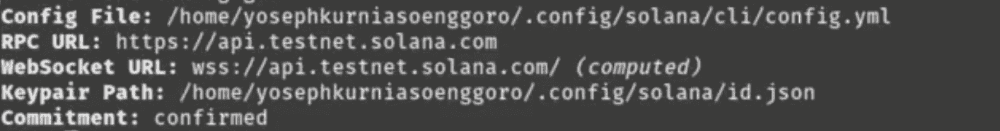
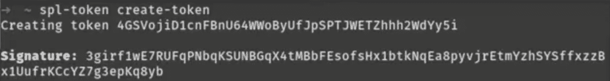
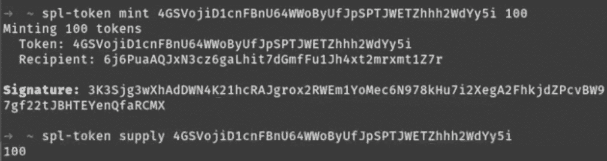
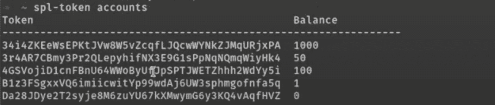
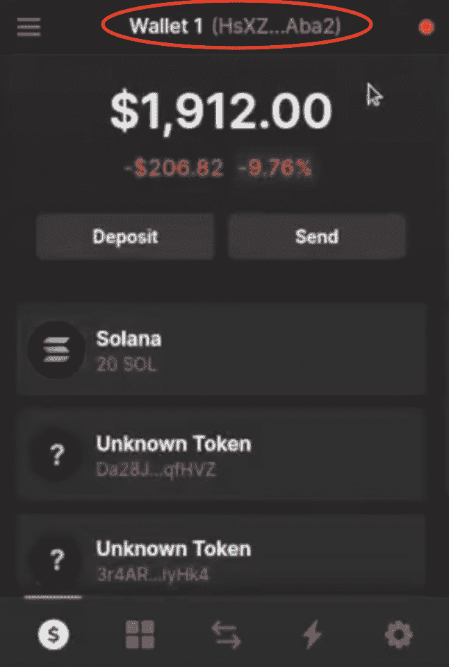

# 如何在 5 个步骤中创建一个索拉纳令牌

> 原文：<https://moralis.io/how-to-create-a-solana-token-in-5-steps/>

在本文中，我们将通过五个步骤引导您完成如何创建 Solana 令牌的过程。随着对过程本身的深入研究，我们还将发现更多关于索拉纳区块链和 SPL 令牌。现在，如果您想直接进入创建令牌的文档，请查看以下链接:

**全文档——**[**【https://github.com/YosephKS/solana-spl-tutorial】**](https://github.com/YosephKS/solana-spl-tutorial)

如果你是这里的回头客，你可能会偶然发现关于如何创建以太坊令牌的文章，或者如何创建多边形令牌的文章。然而，在这篇文章中，我们将把注意力转移到别处，仔细看看最令人兴奋的区块链之一:索拉纳。Solana 在 2021 年期间迅速发展，并正在成为以太坊和其他 [EVM](https://moralis.io/evm-explained-what-is-ethereum-virtual-machine/) 兼容连锁店的最大竞争对手之一。该平台专注于速度和可扩展性，解决了竞争对手的一些重大问题。因此，在本文中，我们将进一步了解 SPL 令牌以及如何使用 Moralis 操作系统创建 Solana 令牌的过程。

Moralis 为所有用户提供了无限可扩展的后端基础设施和丰富的工具箱。例如，在这些工具中，你会发现 [Moralis Speedy Nodes](https://moralis.io/speedy-nodes/) 、 [NFT API](https://moralis.io/ultimate-nft-api-exploring-moralis-nft-api/) 、 [Web3UI kit](https://moralis.io/web3ui-kit-the-ultimate-web3-user-interface-kit/) 、 [Price API](https://moralis.io/introducing-the-moralis-price-api/) 等等。这些特性以及后端基础设施提供了市场上最好的开发人员体验。这可以让你大大减少所有未来区块链项目的开发时间，并使 [Web3 开发](https://moralis.io/how-to-build-decentralized-apps-dapps-quickly-and-easily/)更容易实现。

所以，如果你想成为一名区块链开发者，最快捷、最容易的途径就是与 Moralis 合作。注册该平台是免费的，你很快就能创建你的第一个区块链项目！

### 索拉纳是什么？

Solana 是一个分散的区块链，在 2021 年取得了巨大的增长，并正在成为以太坊网络最突出的竞争对手之一。因此，许多开发人员想要学习如何创建 Solana 令牌就不足为奇了。而且，索拉纳就像以太坊一样，是智能合约兼容的。这意味着可以在 Solana 网络上构建 [dApps](https://moralis.io/decentralized-applications-explained-what-are-dapps/) 、令牌和其他 Web3 项目。


然而，以太坊和索拉纳生态系统之间的一个重要区别是术语可能不同。例如，“[智能合约](https://moralis.io/smart-contracts-explained-what-are-smart-contracts/)”在 Solana 生态系统中被称为“程序”。因此，如果你更熟悉以太坊和[可靠性](https://moralis.io/solidity-explained-what-is-solidity/)编程，本指南中的术语可能会有点混乱。但是不要担心，我们会尽量让它简单明了。

区块链最重要的发展项目以太坊的一个主要缺点是网络拥挤。随着越来越多的人采用区块链和加密技术，网络无法处理越来越多的交易。这推高了天然气价格，使得在以太网上进行交易在经济上不可行。

出于这个原因，索拉纳着手创建一个强调交易速度和降低成本的区块链。事实上，该连锁店每秒处理近 3000 笔交易，每笔交易的平均成本为 0.00025 美元。因此，Solana 设法解决了以太坊区块链的一些缺点，使其成为一个强有力的竞争者。那么，索拉纳是如何实现这一吞吐量的呢？

### 索拉纳共识机制——历史证明(PoH)

区块链行业内通常有两种主要的共识机制，工作证明(PoW)和利益证明(PoS)。以太坊和比特币目前利用电力。这使得网络中的节点能够就信息状态达成一致，并防止经济攻击和其他问题，如重复支出。这保证了网络的安全；但是，这使得它相对较慢。另一方面，Solana 利用 PoS 和历史证明(PoH)的组合。


在其他区块链上，一般来说，需要链中的验证器相互通信以形成块。然而，PoH 可以绕过这一点，因为共识机制会创建一个历史记录，证明某个事件在特定时刻发生。由于这个原因，可以实现更高的可扩展性，因为可以更容易地形成块。

最后，一条额外的重要信息是要注意，你没有利用 Solidity 在 Solana 区块链上构建程序(智能合约)，而是使用了另一种叫做 Rust 的区块链编程语言。因此，如果你想为茄属生态系统开发 dApps，精通 Rust 是有益的。

### 什么是 SPL 代币？

索拉纳生态系统的另一个重要组成部分是它的天然溶胶标记。SOL 是在索拉纳区块链上运行的加密货币，它也充当治理令牌。因此，SOL 的持有者有可能对区块链的未来进行投票，并帮助管理网络。如果您想加深关于这些令牌的知识，请查看我们的"[什么是治理令牌？](https://moralis.io/what-are-governance-tokens-full-guide/)”篇。


此外，SOL 是一个所谓的 SPL 令牌，在这一节中，我们将探讨什么是 SPL 令牌。SPL 代币之于索拉纳什么 [ERC-20](https://moralis.io/erc20-exploring-the-erc-20-token-standard/) 、 [ERC-721](https://moralis.io/erc721-contract-exploring-erc721-smart-contracts/) 、 [ERC-1155](https://moralis.io/erc1155-exploring-the-erc-1155-token-standard/) 代币之于以太坊网络。因此，SPL 可以被视为索拉纳区块链的象征性标准。

但是，如果您熟悉以太坊的令牌标准，那么您会知道 ERC-20 标准管理可替换令牌、ERC-721 NFT 和 ERC-1155 半可替换令牌。在 Solana 生态系统中，只有一个程序定义了可替换令牌和 NFT 的通用实现。因此，本质上有一个规范两种令牌类型的令牌标准。

这使得索拉纳令牌的开发非常简单，这也是为什么我们在接下来的章节中会发现如何创建可替换和不可替换的索拉纳 SPL 令牌。

## 如何在 5 个步骤中创建一个索拉纳令牌

对索拉纳区块链和什么是 SPL 令牌有了更好的理解后，我们可以进入本文的中心部分:如何创建索拉纳令牌。创建一个 SPL 令牌，无论是可替换的还是不可替换的，都非常容易。现在，为了使这个过程更容易理解，我们将把这个过程分成以下五个步骤:

1.  安装索拉纳和 SPL CLI(命令行界面)。
2.  创建钱包并获取 testnet SOL。
3.  制造可替换的代币。
4.  创造一个 NFT。
5.  将代币添加到您的虚拟钱包中。

这些步骤很容易遵循；然而，如果你更喜欢观看整个过程的视频教程，那么一定要看看来自 [Moralis YouTube](https://www.youtube.com/channel/UCgWS9Q3P5AxCWyQLT2kQhBw) 频道的以下视频:

https://www.youtube.com/watch?v=IsTFNOedPkk

所以，事不宜迟，让我们开始并仔细看看下载索拉纳和 SPL CLI，我们需要创建令牌！

### 步骤 1:如何创建索拉纳令牌—安装索拉纳和 SPL CLI

在本教程的第一步中，我们将安装 Solana CLI。这样做很简单；但是，命令是不同的，根据您使用的操作系统，您可能还需要添加一些环境变量。尽管如此，以下是安装 Solana CLI 的命令:

**MacOS & Linux:**

```js
sh -c "$(curl -sSfL https://release.solana.com/v1.9.5/install)"
```

**视窗:**

```js
curl https://release.solana.com/v1.9.5/solana-install-init-x86_64-pc-windows-msvc.exe --output C:\solana-install-tmp\solana-install-init.exe --create-dirs
```

有了 Solana CLI，第一步的下一步是安装 SPL CLI。要安装 CLI，您可以使用以下输入:

```js
cargo install spl-token-cli
```

正如您从上面的命令中看到的，我们正在使用“cargo ”,您可能会觉得不熟悉。这本质上是 Rust 的“npm”或“yarn”版本，要使用它，您可能需要安装一些 Rust 工具。

然而，安装了 SPL CLI 后，我们可以继续前进到该过程的第二步，我们将生成一个 wallet 并获取一些 testnet SOL。

### 步骤 2:如何创建一个 Solana 令牌——创建一个钱包并获取 Testnet SOL

创建 Solana 令牌的第二步包括生成一个“文件系统钱包”并获取一些 testnet SOL。我们需要这个来支付网络交易。让我们从创建一个钱包开始，这是通过以下命令完成的:

```js
solana-keygen new --no-outfile
```

现在您有了一个钱包，您可以通过检查钱包的 SOL 余额来确保一切正常:

```js
solana balance
```

最初，由于您刚刚创建了您的钱包，余额应该等于零。但是，我们将改变这一点，因为我们将获得一些 testnet SOL。然而，在获得 SOL 之前，我们还需要确保我们在 testnet 集群上:

```js
solana config get
```

输入该命令将提供以下输出:



如你所见，我们现在在测试网上。现在，如果您不在正确的集群或网络上，那么您需要对此进行配置。我们可以很容易地做到这一点，只需使用以下输入进入正确的网络:

```js
solana config set --url https://api.devnet.solana.com
```

如果你和 EVM 一起工作，这基本上等同于交换链条。然后，您可以使用与前面相同的命令来检查您是否在正确的集群上，如果是，只需通过以下命令获取 testnet SOL:

```js
solana airdrop 1
```

### 步骤 3:如何创建 Solana 令牌—创建可替换令牌

现在我们有了钱包和 testnet SOL，我们可以继续本教程的中心部分，在这里我们将创建 Solana 令牌本身。因为我们有索拉纳和 SPL CLI，这个过程变得相对容易，我们可以用几个简单的命令轻松地创建一个可替换的令牌。一旦我们完成了可替换令牌，我们将继续下面的步骤，仔细看看如何创建一个 NFT。

因此，我们需要做的第一件事是用以下输入创建令牌本身:

```js
spl-token create-token
```

一旦交易完成，我们将得到以下输出:



正如您在上面的截图中看到的，我们收到了一个令牌 ID 和一个签名。然后，我们可以利用令牌 ID 来检查特定令牌的余额:

```js
spl-token supply <token-identifier>
```

初始供应量应该为零，因为我们没有向令牌添加任何东西。但是，不要担心，我们会告诉你如何添加你想要的数量。然而，在实际创建供应之前，我们确实需要为程序创建一个帐户。手动添加的原因是，默认情况下，索拉纳区块链上的程序通常没有任何存储空间。因此，我们需要自己添加帐户:

```js
spl-token create-account <token-identifier>
```

使用为我们的令牌创建的帐户，我们可以通过以下命令简单地铸造指定数量的令牌:

```js
 spl-token mint <token-identifier> <token-amount>
```

这将自动将令牌存入文件系统钱包。然后，您可以通过使用我们之前使用的相同命令来检查余额，从而确保一切正常。



就是这样！这就是创造一个可替换的 SPL 代币是多么容易。接下来，我们要创造一个索拉纳 Next！

### 步骤 4:如何创建 Solana 令牌–创建不可替换令牌(NFT)

现在，如果你不打算创建一个索拉纳 NFT，你可以跳过这一步，进入本教程的第五部分，也是最后一部分。否则，跟随并学习如何创建一个索拉纳 NFT。如果您遵循了前面的步骤，那么您已经有了所有的基本信息，只有一些次要的细节需要我们解决。

因此，您需要做的第一件事是，再次创建一个新令牌。然而，这一次，由于这是一个 NFT，您将需要指定小数等于“0”。因此，创建 NFT 的命令如下所示:

```js
spl-token create-token --decimals 0
```

创建了 NFT 后，下一步类似于创建可替换令牌，您需要为该程序创建一个帐户。这是以完全相同的方式完成的:

```js
spl-token create-account <token-identifier>
```

有了这个账户，你就可以开始铸造代币了。然而，由于这是一个 NFT，您将简单地铸造一个令牌，因为他们打算是完全独特的。因此，您可以输入以下内容，并将令牌 ID 和帐户替换为您的值:

```js
spl-token mint <token-identifier> 1 <token-account>
```

令牌生成后，最后一部分只是禁用未来的生成，因为我们只希望这些令牌中的一个存在。这可以通过以下命令完成:

```js
spl-token authorize <token-identifier> mint --disable
```

### 步骤 5:如何创建一个索拉纳令牌-将令牌添加到您的钱包

现在，如果您决定创建可替换、不可替换或两者都创建的令牌，您可以通过输入以下命令来检查钱包的余额:

```js
spl-token accounts
```

这将为您提供类似于以下内容的内容:



这是您钱包中所有代币的列表，您在本教程中创建的代币应该会显示在这里。但是，现在代币已经创建，您还需要将它们转移到您的常规钱包中。在本教程中，我们将使用一个虚拟钱包；然而，如果你使用任何其他的替代方法，这个过程不会有很大的偏差。

由于我们在本教程中创建了 testnet 令牌，您需要做的第一件事是将您的虚拟钱包的网络更改为 testnet。选择合适的网络后，转移令牌就变得相对容易了。事实上，您所需要做的就是输入以下命令并更改参数以满足您的需求:

```js
spl-token transfer <token-identifier> <token-amount> <wallet-address> --fund-recipient
```

如您所见，我们需要令牌 ID、您要转账的具体金额以及钱包地址。你可以从你的幻影钱包界面的顶部复制钱包地址。输入正确的信息后，您需要做的就是运行命令，令牌应该会转移。



为了确保一切正常，您可以使用“spl-token accounts”命令检查您的虚拟钱包或本地钱包。然而，当你检查你的虚拟钱包时，你会注意到代币没有名字，没有符号，也没有图标。要添加这个，您可以访问 [GitHub 页面](https://github.com/solana-labs/token-list)并发出一个 pull 请求。从 19:40 开始，观看前面提到的视频了解更多信息。

### 如何创建 Solana 令牌—摘要

在本教程中，我们能够通过以下五个步骤创建一个 Solana 令牌:

1.  安装索拉纳和 SPL CLI(命令行界面)。
2.  创建钱包并获取 testnet SOL。
3.  制造可替换的代币。
4.  创造一个 NFT。
5.  将代币添加到您的虚拟钱包中。

该指南演示了如何轻松创建可替换令牌和[NFT](https://moralis.io/non-fungible-tokens-explained-what-are-nfts/)，我们能够在几分钟内完成。因此，如果您遵循上面列出的步骤，您应该能够轻松地创建一个 Solana 令牌。此外，如果你通读了整篇文章，你也会对索拉纳区块链和它的母语 SOL token 有基本的了解。

如果你想了解更多关于代币开发和整个区块链行业的信息，那么一定要去看看 [Moralis 博客](https://moralis.io/blog/)。您可以了解更多关于区块链开发的[最佳语言](https://moralis.io/best-languages-for-blockchain-development-full-tutorial/)、[如何创建以太坊 dApp](https://moralis.io/how-to-create-an-ethereum-dapp-instantly/) 、[元掩码](https://moralis.io/metamask-explained-what-is-metamask/)、[元宇宙](https://moralis.io/what-is-the-metaverse-full-guide/)等等。

所以，如果你对区块链的发展感兴趣，一定要去 Moralis 学院注册。创建一个帐户是免费的，只需要几秒钟！