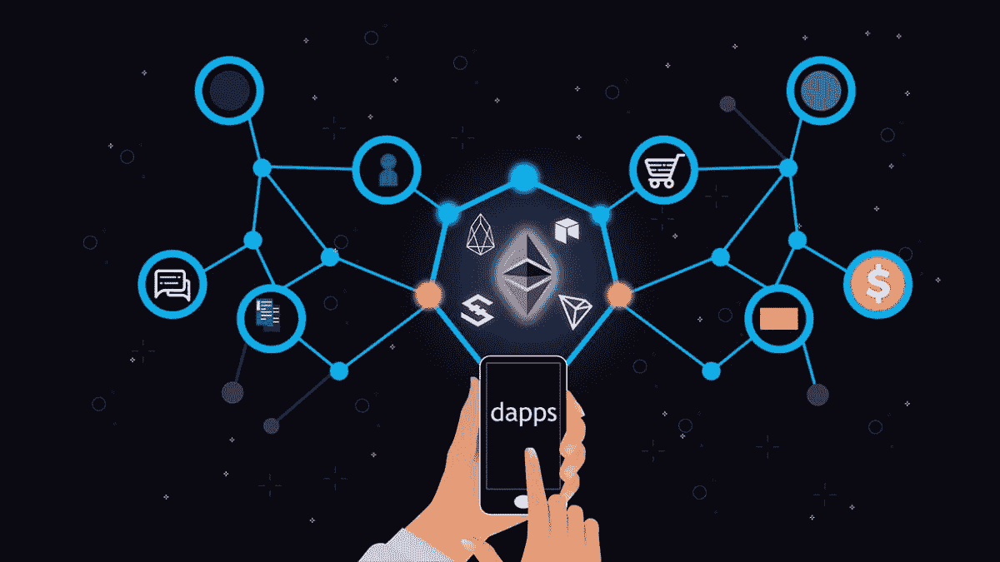
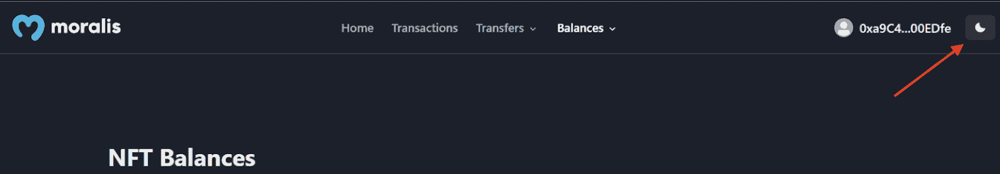
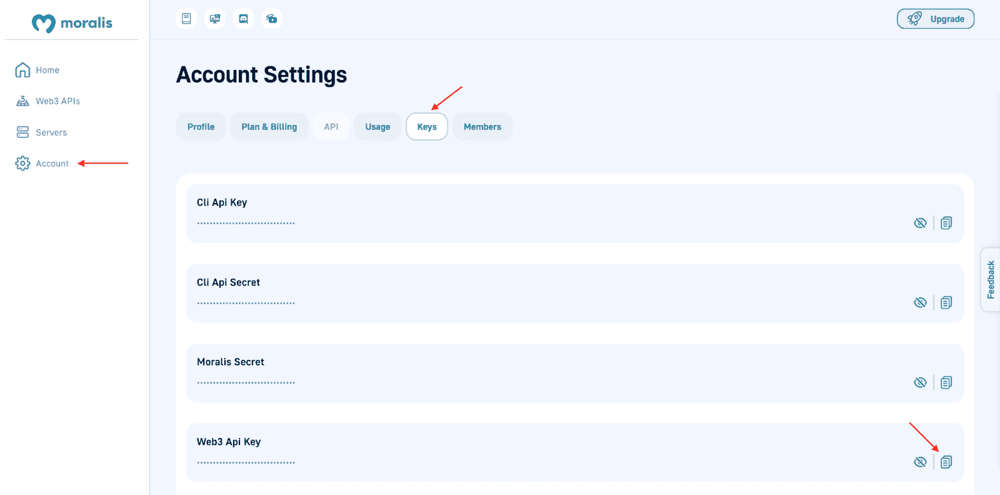

# 如何通过 3 个步骤创建 Web3 Dapp

> 原文：<https://moralis.io/how-to-create-a-web3-dapp-in-3-steps/>

Web3 行业在不断发展，开发者经常在各种链上推出新的、有趣的项目。此外，越来越多的人对区块链行业表现出兴趣，这使其成为进入市场的诱人时机。此外，您知道创建 Web3 dapp(去中心化应用程序)最简单的方法是使用 [Moralis](https://moralis.io/) 吗？如果你想了解更多，请跟随本教程，我们将向你展示如何通过三个步骤创建一个 Web3 dapp！

**以太坊样板文档—**[**https://github . com/以太坊-样板/以太坊-样板**](https://github.com/ethereum-boilerplate/ethereum-boilerplate)

如果您对跟随我们分解三个步骤来创建 Web3 dapp 不感兴趣，您可以使用上面的链接并直接进入代码。否则，请随时加入我们，学习从头创建 Web3 dapp 所需的一切。此外，大多数可访问性源于 Moralis 的以太坊样板，允许您立即创建 dapps！

然而，以太坊样板是与 Moralis 合作的众多优势之一。此外，Moralis 还提供领先的企业级 API。因此，Moralis 提供了一个更引人注目的开发体验，让您可以提高效率。一个这样的工具是 Moralis 的 web 3 Streams API。有了这个 API，你可以很容易地将[链上数据](https://moralis.io/on-chain-data-the-ultimate-guide-to-understanding-and-accessing-on-chain-data/)流式传输到你所有的 Web3 项目中，这是 Web3 dapps 的必要组件。

所以，如果你想创建一个 Web3 dapp，就和 Moralis 签约吧。您可以立即访问该平台的所有工具，并且创建帐户是免费的！

## Web3 Dapps 解释道

在向您展示如何创建 Web3 dapp 之前，简要回顾一下基础知识并探索什么是 web 3 dapp 可能会有所帮助。因此，这一部分将回答“什么是 Web3 dapp？”。所以，如果你已经熟悉了 dapps，请随意向下滚动，直接进入如何创建 Web3 dapp 的教程！



Web3 dapps(分散式应用程序)与传统的 Web2 应用程序并没有太大的不同。他们有相同的目的，但最显著的区别是 Web3 dapps 是基于区块链的。此外，Web3 dapps 因此配备了区块链和 Web3 功能，提供了优于传统应用的一些显著优势。这里有几个例子:

*   **开源**–许多 dapps 都是开源的，这对整个 Web3 生态系统来说是极好的。它鼓励发展，推动创新。
*   **区块链技术**–由于 Web3 dapps 基于区块链，因此很容易将加密货币集成到这种新一代应用的功能中。
*   **抗审查**–dapp 通常没有单点故障。因此，实体或中央机构很难感测网络。

许多这些有利的特点或好处往往来自 dapps 的一个中心特点:权力下放。由于 Web3 dapps 是分散的，所以它们不在中央机构的管辖范围内。因此，它消除了单点故障，这提供了抗审查的好处。

现在，您已经对 dapps 及其好处有了一个简单的了解，是时候探索 Moralis 的以太坊样板了。在我们解释如何创建 Web3 dapp 之前，这会让你更好地理解你的目标。

## Moralis 的以太坊样板–创建一个 Web3 Dapp

一旦有人启动你要创建的 Web3 dapp 他们将到达以下登录页面:


首先，用户必须使用右边的“连接钱包”按钮来验证他们的 Web3 身份:


这允许用户使用他们的元掩码钱包登录。但是，元掩码只是默认选项，您可以轻松地添加其他身份验证机制。例如，由于 Moralis 的 [Auth API](https://docs.moralis.io/reference/auth-api-overview) ，使得 [Web3 认证](https://moralis.io/authentication/)易于访问，你可以[快速添加比特币基地钱包登录功能](https://moralis.io/how-to-add-coinbase-wallet-login-functionality/)。

然而，一旦通过身份验证，Web3 dapp 将填充有关用户 Web3 钱包的信息。这将我们带到用户可以在 dapp 界面顶部找到的另外四个选项卡。例如，如果他们点击“交易”,就会显示钱包以前的交易:


此外，“转账”和“余额”选项卡有下拉菜单。现在，如果用户点击这些选项，他们可以在“ERC-20”或“NFTs”之间进行选择。这意味着可以在这两种令牌类型之间进行筛选。然而，它看起来是这样的:


例如，如果为“余额”选项卡选择了“NFTs”选项，它将显示钱包中包含的所有 NFTs:


最后，以太坊样板还具有暗/亮模式。因此，用户可以使用右上角的按钮在这两个选项之间切换:



既然您对 Moralis 的以太坊样板文件已经比较熟悉，那么是时候探索本文的中心部分了。在接下来的几节中，我们将向您展示如何通过三个步骤创建 Web3 dapp！

## 如何创建 web 3 Dapp–三步分解

在本节中，我们将介绍创建 Web3 dapp 所需的所有必要步骤。因为我们将使用 Moralis 的以太坊样板文件，所以只需三个步骤就可以创建一个 Web3 dapp:

1.  克隆 Moralis 的以太坊样板
2.  配置变量
3.  启动 Web3 Dapp


遵循这些步骤将会产生一个 Web3 dapp，就像我们在上一节中检查的那样。此外，一旦有了模板，就要由您来定制样板文件，使其符合客户的需求。

此外，如果您还没有，您必须创建一个 Moralis 帐户，因为这是本教程第二步的要求。此外，创建一个帐户是免费的，你可以点击 Moralis 网页顶部的“免费开始”按钮:


### 步骤 1:克隆 Moralis 的以太坊样板

首先，您必须将以太坊样板文件克隆到您的本地目录。要启动创建 Web3 dapp 的过程，您可以打开您最喜欢的 IDE(集成开发环境)。在我们的例子中，我们将利用 VSC (Visual Studio 代码)；然而，请随意使用任何其他替代方案。请注意，如果您没有使用 VSC，有些步骤可能会略有不同。

在 IDE 打开的情况下，您可以通过设置新文件夹来继续。我们称我们的为“样板”，但是你可以随便叫你的名字。接下来，您需要打开以太坊样板文件的 GitHub 存储库。你可以在简介中找到相关链接。在那里，点击“代码”和“复制”按钮获取 URL:


接下来，导航回您的 IDE 并打开一个新的终端。如果你像我们一样使用 VSC，你可以通过按顶部的“终端”然后点击“新终端”来打开一个终端:


接下来，您需要使用之前的 repo URL 并运行以下命令(确保您位于之前创建的文件夹的位置):

```js
git clone “BOILERPLATE_URL”
```

就是这样；现在，您应该可以随意使用该项目了。此外，使用以下命令跳转到正确的文件夹:

```js
cd ethereum-boilerplate
```

如果您在正确的位置遵循并执行了正确的命令，那么您现在应该在本地目录中有一个与此类似的结构:


### 步骤 2:配置变量

对于这个简短教程的第二步，我们将配置一些环境变量。因此，您可以找到位于 IDE 中的“. env.local.example”文件:


总共有五个变量，您将需要配置其中的三个，这取决于您计划在哪个链上启动 dapp。所以，让我们从第一个变量开始吧，“ *APP_CHAIN_ID* ”，目前设置为“*0x 1*”*。**0x 1*值引用以太坊链。现在，如果你想为另一个网络创建一个 Web3 dapp，这需要修改。然而，在我们的情况下，我们将保持原样。

您需要考虑的第二个变量是“ *MORALIS_API_KEY* ”。您需要在这里添加一个值。此外，要获得价值，您需要一个 Moralis 账户。因此，如果您以前没有，现在是时候创建您的帐户了。登录后，你可以点击“账户”获取密钥，然后导航到顶部的“密钥”。然后，复制“Moralis Api Key”并粘贴到代码中。



最后，你需要一个 *NEXTAUTH_SECRET* 的密钥。如果您需要生成值的帮助，您可以使用以下链接:“[https://generate-secret.now.sh/32](https://generate-secret.now.sh/32)”。现在变量就到此为止！

可以让“ *NEXTAUTH_URL* ”变量等于“ [http://localhost:3000](http://localhost:3000/) ”。这样做将允许您安全可靠地测试 Web3 dapp。然而，一旦您计划启动 dapp，您就需要修改这个变量，并将其设置为等于 dapp 的 URL。

最重要的是，您必须将文件名改为“. env.local”。下面是最终代码的样子:

```js
APP_CHAIN_ID=0x1
APP_DOMAIN=ethereum.boilerplate 
MORALIS_API_KEY= "YOUR_API_KEY"
NEXTAUTH_SECRET= b8e786967d7bcbc0f920d35bcc3f891c
NEXTAUTH_URL=http://localhost:3000
```

### 步骤 3:启动 Web3 Dapp

本教程的最后一步是探索如何创建 Web3 dapp，围绕着启动 dapp。然而，在实际启动 dapp 之前，您需要安装依赖项。因此，根据您使用的是" *npm"* 还是" *yarn"* "，您可以向终端输入以下命令之一:

```js
npm i
yarn
```

接下来，您可以使用以下命令在本地主机上启动 dapp:

```js
npm run dev
yarn run dev
```

一旦 dapp 启动，您就可以通过之前指定的 URL 来访问 dapp:“[http://localhost:3000](http://localhost:3000/)”。所以，如果你按照所有的步骤，点击这个链接，它应该会打开你的 dapp，就是这样！您现在知道如何使用 Moralis 和以太坊样板创建 Web3 dapp。

如果您对这个过程有任何问题，您可以从 GitHub 资源库中查看以太坊样板文档。此外，你可以看看之前的视频，这可能会澄清一些事情。

此外，假设您觉得这篇文章很有趣，并且想为其他网络开发 dapps。在这种情况下，我们推荐两篇文章，解释如何[构建 Cronos dapp](https://moralis.io/how-to-build-a-cronos-dapp-in-5-steps/) 和[构建多边形 dapp](https://moralis.io/how-to-build-a-polygon-dapp-in-3-steps/) 。此外，您还可以从[官方文件](https://docs.moralis.io/reference/evm-api-overview)中了解更多关于 Moralis 支持的连锁店的信息。

## 创建 web 3 Dapp–摘要

通过跟随本文，您使用 Moralis Ethereum 样板文件从头开始创建了一个 Web3 dapp。此外，该模板允许任何人只通过三个步骤创建 Web3 dapp，并且只需要几分钟:

1.  克隆 Moralis 的以太坊样板
2.  配置变量
3.  启动 Web3 Dapp

这些步骤相对简单，允许你创建一个 Web3 dapp，用户可以用他们的 [Web3 钱包](https://moralis.io/what-is-a-web3-wallet-web3-wallets-explained/)登录。一旦他们验证了自己的身份，应用程序就用关于用户钱包详细信息的信息填充 UI。这包括从当前余额到交易历史的所有内容。

如果你觉得这个教程有帮助，请随意进一步探索 Moralis 的 Web3 博客。在博客上，你会发现令人兴奋的新鲜内容，帮助你成为一个更好的 Web3 开发者。例如，你可以看看我们关于如何[建立一个索拉纳·NFT 探索者](https://moralis.io/how-to-build-a-solana-nft-explorer/)或[建立一个分散的社交媒体档案](https://moralis.io/how-to-build-a-decentralized-social-media-profile/)的文章。

此外，为了进一步磨练您的 Web3 开发技能并获得区块链认证，您还可以选择参加[Moralis 学院](https://academy.moralis.io/)。该学院为新手和更有经验的开发人员提供优秀的区块链相关课程。例如，通过“[以太坊 101](https://academy.moralis.io/courses/ethereum-101) ”课程学习以太坊区块链的基础知识，它与比特币的区别，以及什么是智能合约。

所以，如果你想快速简单地创建一个 Web3 dapp，[注册 Moralis](https://admin.moralis.io/register) 。你可以免费创建你的账户，只需要几秒钟。您不会有任何损失，并且可以立即成为一名更杰出的 Web3 开发人员！