# 如何创建 Web3 视频流服务

> 原文：<https://moralis.io/how-to-create-a-web3-video-streaming-service/>

为什么有人想创建一个 Web3 视频流服务？为什么不呢？随着泄露隐私数据的激增，Web2 平台的缺陷显而易见，这一切都归结于流行的流媒体服务的本质:集中化。因此，Web3 在大众中变得越来越有吸引力，因为去中心化方面提供了一种改革许多行业的方法。因此，为基于视频的内容创建一个分散的 [**Web3**](https://moralis.io/the-ultimate-guide-to-web3-what-is-web3/) **流媒体服务是你应该具备的技能。如果这听起来很有趣，请跟随我们演示如何在一个多小时内创建一个 Web3 视频流服务。**

接下来，我们将接手一个示例项目，目标是[开发一个 Web3 网飞](https://moralis.io/how-to-develop-a-web3-netflix-clone/)克隆。使用一些优秀的工具，我们将证明 Web3 开发比你想象的要简单得多。事实上，有了[最好的 Web3 后端平台](https://moralis.io/exploring-the-best-web3-backend-platform/)、 [Moralis](https://moralis.io/) ，你就可以马上开始创建 dapps ( [去中心化应用](https://moralis.io/decentralized-applications-explained-what-are-dapps/))。只要你精通 JavaScript 并知道如何使用 React，你就万事俱备了。此外，有了 Moralis(又名 [Firebase for crypto](https://moralis.io/firebase-for-crypto-the-best-blockchain-firebase-alternative/) )，你可以毫不费力地满足你与区块链相关的后端需求。此外，这个当前 [Web3 技术栈的巅峰](https://moralis.io/exploring-the-web3-tech-stack-full-guide/)为你提供了一个令人印象深刻的 [Web3UI 套件](https://moralis.io/web3ui-kit-the-ultimate-web3-user-interface-kit/)来轻松交付一个[伟大的 Web3 UI](https://moralis.io/web3-ui-how-to-create-a-great-dapp-ui/) 。尽管如此，Moralis 是跨链和跨平台可互操作的，这意味着您拥有最大的灵活性和潜在的影响力。所以，[创建你的免费 Moralis 账户](https://admin.moralis.io/register)，让我们一起打造一个非凡的 Web3 视频流服务！

## 我们的 Web3 视频流服务演示

我们相信，如果你先看到最终结果，你会更容易决定是否要创建你的 Web3 视频流服务。因此，我们想先快速演示一下我们完成的 dapp。因此，让我们来看看下面的截图，它抓住了我们的 Web3 视频流服务的本质:

聚焦于上图的左上角，你可以看到“网飞”的标志。选择后者似乎是合适的，因为它是最受欢迎的视频流提供商。移至右侧，我们看到顶部菜单，其中包括“电影”、“系列”和“我的列表”链接。此外，一直到右手边，我们有“通知”图标和“连接钱包”按钮。后者负责 [Web3 认证](https://moralis.io/web3-authentication-the-full-guide/)过程。选择“电影”页面后，我们进入了我们的 Web3 视频流媒体服务 dapp 的主页。因此，您可以看到一个简洁的电影示例，包括横幅图像和“播放”和“添加到我的列表”按钮。在我们的例子中，我们选择了“泰坦尼克号”。再往下，我们有各种电影的缩略图。用户可以通过点击缩略图来选择这些电影。这里有一个例子:

上面的截图向你展示了如果用户点击“蜘蛛侠”的缩略图会看到什么。所选电影的详细信息将出现在弹出窗口中。细节包括电影的上映年份，长度，基本情节，流派，演员。在“详细信息”部分的上方，有一个带有电影标题、“播放”按钮和“添加到我的列表”按钮的图像。

### Web3 视频流 Dapp 和认证

我们必须指出，上面提到的按钮对尚未登录的用户不起作用。因此，如果用户试图点击两个按钮中的任何一个，而这两个按钮没有通过 MetaMask 或其他 [Web3 wallet](https://moralis.io/what-is-a-web3-wallet-web3-wallets-explained/) 的认证，他将会收到以下通知:

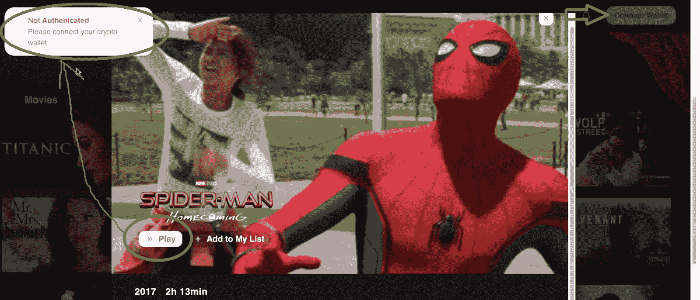

现在很明显，想要使用我们的 Web3 视频流媒体服务 dapp 的用户需要首先登录。幸运的是，Moralis 让 Web3 认证变得超级简单。用户只需点击“连接钱包”按钮，并选择他们首选的 [Web3 登录](https://moralis.io/how-to-build-a-web3-login-in-5-steps/)方式。要访问该按钮，用户需要关闭弹出窗口:

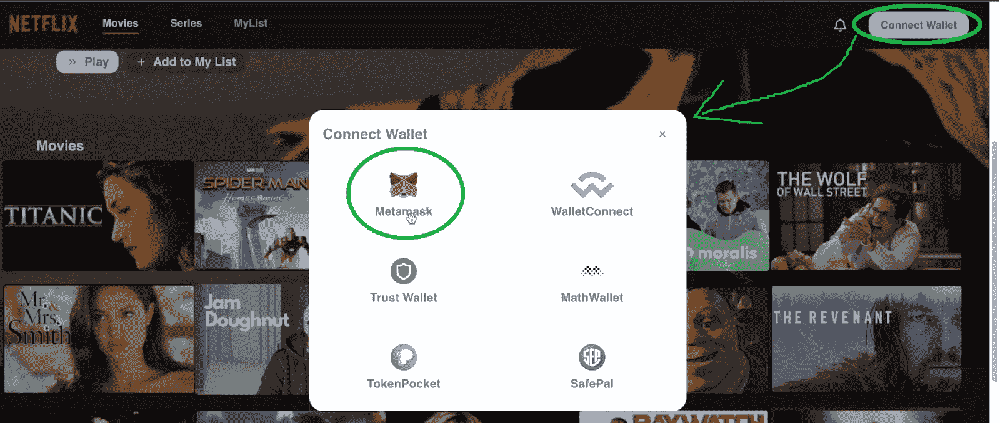

在选择了首选的 Web3 钱包后，用户通常需要确认他们的操作。例如，在[元掩码](https://moralis.io/metamask-explained-what-is-metamask/)的情况下，用户需要点击“签名”按钮来完成认证:

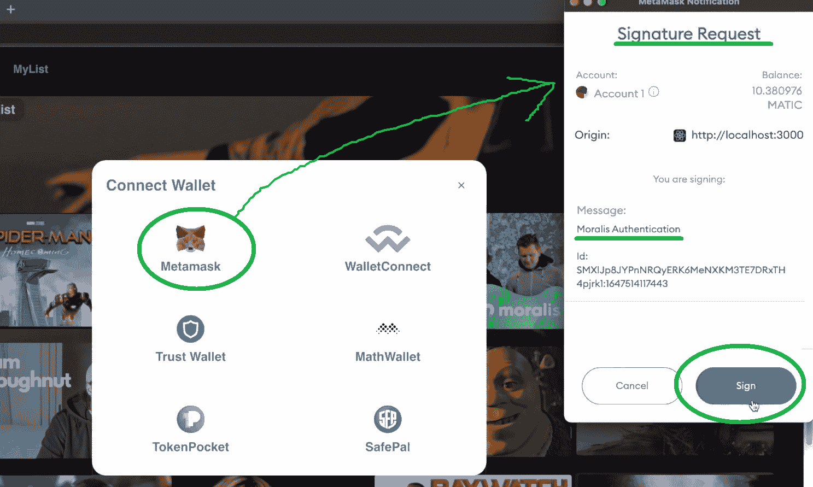

登录成功后，用户可以在右上角看到他们的余额和钱包地址:

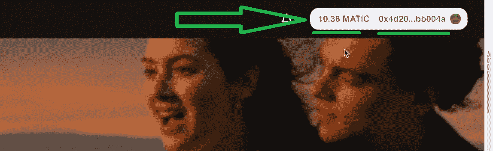

### 使用我们的 Web3 视频流 Dapp 观看电影

现在用户已经用他们的加密钱包连接到我们的 Web3 视频流服务，他们可以看电影了。如果他们现在通过点击缩略图选择任何电影，他们可以点击“播放”按钮。通过这样做，我们的示例 dapp 将在电影播放器中打开电影:

我们整合的电影播放器包括所有标准功能，如下所示:

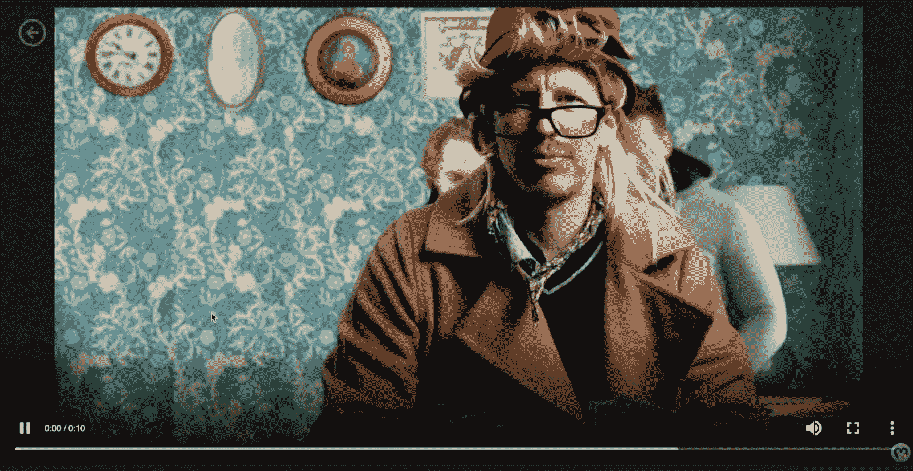

看上面的截图，你可以在底部看到电影播放器包含的所有标准命令。而且，如果用户想退出电影播放器，需要点击左上角的“返回”箭头。尽管如此，用户现在也可以将电影添加到他们的“我的列表”页面:

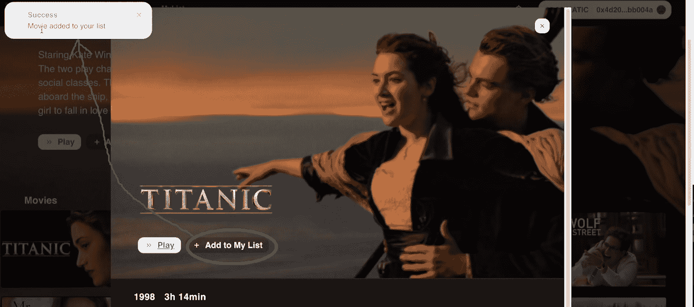

要查看添加的电影，用户需要点击顶部菜单中的“我的列表”链接:

用户“我的列表”页面上的缩略图与“电影”页面上的缩略图工作方式相同。因此，要访问电影的细节和“播放”按钮，用户必须点击缩略图。

我们相信上述结果给你留下了深刻的印象，足以让你有兴趣卷起袖子开始编码。我们现在邀请你加入我们，创建一个 Web3 视频流服务 dapp。但是，如果您想先看看我们演示的视频版本，请查看本文末尾的视频，从 0:40 开始。

## 使用 Moralis 创建 Web3 视频流服务

正如介绍中提到的，我们将使用 [Moralis SDK](https://moralis.io/exploring-moralis-sdk-the-ultimate-web3-sdk/) 和 ReactJS 来创建一个简洁的 Web3 视频流服务 dapp。下面几节将首先帮助您了解项目的设置步骤。此外，你会明白为了到达终点，你需要完成哪些步骤。但是，为了获得更详细的指导，我们将向您介绍一个视频教程。

接下来，我们将首先完成初始项目设置，在这里我们将使用 GitHub 上的代码和我们选择的 IDE——Visual Studio Code(VSC)。接下来，我们将创建应用程序的顶部横幅，然后是主页。然后，我们将为缩略图添加模态，并跟踪点击事件，以确保弹出窗口包含所选电影的详细信息。对于前端的最后一部分，我们将确保我们的 Web3 视频流服务包括一个电影播放器。

接下来，我们将开始介绍后端功能。这就是我们要依靠 Moralis 的地方。因此，我们将创建一个 Moralis 服务器，并将其与我们的应用程序连接。我们将首先使用 Moralis 的 Web3UI 工具包来轻松实现 Web3 身份验证。然后，我们将为未经身份验证的用户添加上面演示的弹出通知。接下来，我们将使用 Moralis 仪表板(数据库)和云功能来部分覆盖逻辑。此外，我们将在“我的列表”中添加内容。在本教程的最后阶段，你将学习如何[上传到 IPFS](https://moralis.io/full-guide-how-to-upload-to-ipfs/) 使用 Moralis 的 [IPFS](https://moralis.io/what-is-ipfs-interplanetary-file-system/) 集成。

虽然在 GitHub 上可以获得[结束代码](https://github.com/MoralisWeb3/youtube-tutorials/tree/main/Netflix-Decentralized)，但是我们建议使用我们的[开始代码](https://github.com/MoralisWeb3/youtube-tutorials/tree/main/Netflix-Starter)(“网飞-开始”)。这样，您将从这个示例项目中获得最大收益。因此，以下说明是为那些从“网飞启动器”代码开始的人设计的。

### 初始设置

首先，从 GitHub 复制启动代码并打开 VSC。然后打开你的 VSC 终端，输入“git clone”命令。此外，粘贴代码库的 URL 并点击 enter:

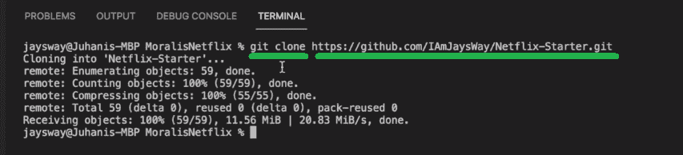

要瞄准正确的文件夹，将“cd”放入“网飞-启动器”。此外，您还需要安装所有依赖项:

通过完成上述步骤，您可以访问“src”文件夹。这是您可以找到初始编码文件的地方:

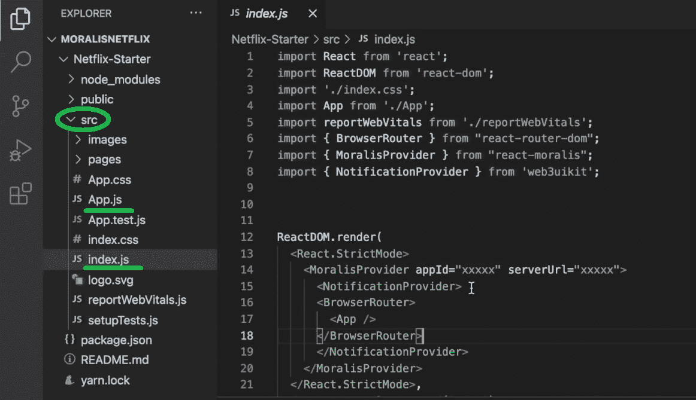

“index.js”和“App.js”文件将涵盖我们的“Web3 视频流服务”任务的核心。此外，到时候，您将在“index.js”文件中粘贴您的 Moralis 服务器的详细信息:

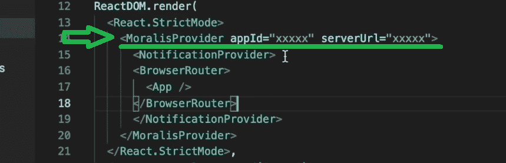

就“App.js”而言，它包括两条初始路径——一条到“玩家”页面，一条到“主页”页面:

此外，在“pages”文件夹中，还有“Home.js”和“Player.js”文件。我们将使用这两个文件来构建这两个页面。然而，目前他们只是将两个页面链接在一起:

因此，你的清白记录已经准备好了。然而，你可以看看你是从什么开始的。如果你感兴趣，输入“纱线开始”命令:

通过输入上面的命令，您将看到两个互相链接的空白页:

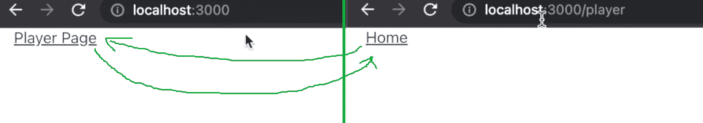

### 创建 Web3 视频流服务-前端

Moralis 专家将在 04:03 开始的视频中向您展示如何创建顶部横幅。因此，你会发现如何设置适当的标志，并添加其他顶级菜单元素。在此过程中，您将可以使用“图像”文件夹的内容。这也是你可以找到“Netflix.js”文件的地方。尽管如此，您还将看到“home.css”如何确保一个有吸引力的设计:

至于“连接钱包”按钮，您将使用 Moralis 的 Web3UI 套件:

接下来，您将为“电影”页面(主页)添加内容。因此，您将创建“library.js”文件，在该文件中，您将正确编写缩略图、描述和其他电影细节的链接。正如您将看到的，电影文件是唯一应该以分散方式存储的东西。这就是 Moralis 的 IPFS 整合发挥作用的地方。本质上，您将把电影的详细信息从“library.js”拖到“home.js”:

一旦你完成了主页，你需要给缩略图添加一个模态(19:57)。如果您还记得，您希望当用户单击缩略图时出现一个弹出窗口。此外，弹出窗口中的内容必须与单击的缩略图相匹配。您将通过创建点击事件来实现这一点。此外，您还需要让“播放”按钮正常工作。因此，你需要将它链接到“玩家”页面(27:13)。

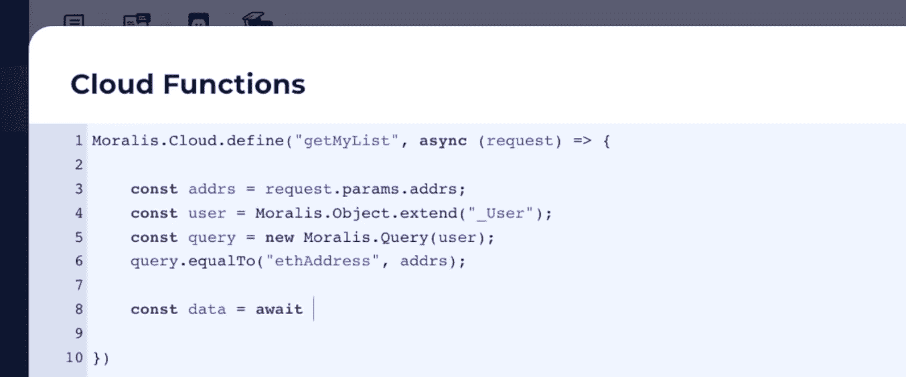

### 创建 Web3 视频流 Dapp–后端

从下面视频中的 32:18 开始，您将学习如何创建一个 Moralis 服务器。通过完成这些步骤，您将获得服务器 URL 和应用程序 ID。您将使用这些细节来连接到最终的 Web3 SDK。在这个过程中，您还将为“身份验证”设置弹出通知。然而，可能最伟大的“啊哈”时刻在 39:51 等着你。在这里，您将访问您的 Moralis 仪表板，并了解如何使用云功能。为了完成示例 Web3 视频流服务的功能，您还需要将内容添加到“我的列表”页面(49:30)。为了结束这个示例项目，您将学习从 56:56 开始正确地将文件上传到 IPFS。

这是上面所有时间戳引用的视频教程:

https://www.youtube.com/watch?v=cPjnjxmLS5k

## 如何创建 Web3 视频流服务–摘要

在这篇文章中，我们已经涉及了相当多的内容。有了我们的指导和上面的视频教程，你有机会创建自己的 Web3 视频流服务。最令人印象深刻的是，你可以在 65 分钟左右完成。在这一点上，你知道这样快速的结果是可能的，感谢 Moralis 的 SDK。当然，我们的代码库也是一条捷径。在这个过程中，您学习了如何使用 React 来满足您的前端需求，以及如何使用 Moralis 的特性(如 Moralis dashboard 和云功能)来满足您的后端需求。尽管如此，您还学习了如何将文件上传到 IPFS。

如果你喜欢这个教程，你还可以学习如何[创建一个比特币基地克隆](https://moralis.io/cloning-coinbase-wallet-how-to-create-a-coinbase-clone/)，一个用于 Web3 的 [Reddit 克隆](https://moralis.io/create-a-reddit-clone-for-web3-step-by-step-guide/)，一个 [OpenSea 克隆](https://moralis.io/create-an-opensea-clone-build-an-nft-marketplace-like-opensea/)，以及一个 [Web3 Spotify 克隆](https://moralis.io/how-to-build-a-web3-spotify-clone/)。然而，随着游戏开发风靡一时，学习 Web3 Unity 编程提供了无数的机会。因此，你应该学会如何在几分钟内构建一个 [Web3 MMORPG](https://moralis.io/build-a-web3-mmorpg-with-unity-in-10-minutes/) 或[中世纪元宇宙游戏](https://moralis.io/how-to-build-a-medieval-metaverse-game/)。此外，一定要在 [Moralis 博客](https://moralis.io/blog/)和 [Moralis YouTube 频道](https://www.youtube.com/c/MoralisWeb3)上探索其他区块链发展话题。一些最新的话题集中在 Web3 游戏的好处上。此外，它还回答了“[为什么 Web3 对](https://moralis.io/why-is-web3-important-a-beginners-guide/)很重要？”提问并探索如何[与 Web3 数据库](https://moralis.io/how-to-communicate-with-a-web3-database-from-unity/)通信，如何[构建元宇宙游戏](https://moralis.io/how-to-build-a-metaverse-game-in-25-minutes/)， [DeFi staking](https://moralis.io/what-is-defi-staking-full-guide/) ， [Web3 元宇宙](https://moralis.io/web3-metaverse-how-do-web3-and-the-metaverse-fit-together/)，以及如何[创建多链钱包](https://moralis.io/how-to-build-a-multi-chain-wallet-in-5-steps/)或 [ETH 钱包](https://moralis.io/how-to-create-an-eth-wallet-full-guide/)，以及更多。所有这些有价值的内容使得上述两个渠道成为免费持续加密教育的重要来源。

然而，如果你渴望[更快地成为 Web3 开发者](https://moralis.io/how-to-become-a-web3-developer-full-guide/)，你应该考虑采取更专业的方法。因此，报名参加[Moralis 学院](https://academy.moralis.io/)可能是你的道路！