# 如何创建一个 AR 元宇宙 NFT 神秘盒子

> 原文：<https://moralis.io/how-to-create-an-ar-metaverse-nft-mystery-box/>

增强现实(AR)提供了一种让娱乐、商业甚至教育变得更加有趣的方式。此外，如果我们将区块链添加到图片中，那么 AR 元宇宙 NFT 应用程序可以达到一个全新的交互水平。此外，由于 AR，用户可以进入一个激动人心的沉浸式元宇宙体验，Web3 和区块链的主流采用几乎就在这里。而且，既然我们还处于[【web 3】](https://moralis.io/the-ultimate-guide-to-web3-what-is-web3/)**的早期阶段，那么现在就是详细了解****和 NFTs (** [不可替代代币](https://moralis.io/non-fungible-tokens-explained-what-are-nfts/) **)的最佳时机。通过这样做，我们可以使用获得的知识来构建杀手级应用程序(****)并包含诸如 AR 元宇宙 NFT 神秘盒子之类的元素。虽然这听起来可能是一个漫长而乏味的过程，但它比您想象的要简单得多。感谢** [Moralis 家](https://moralis.io/) **，你的** [JavaScript](https://moralis.io/javascript-explained-what-is-javascript/) **或者 Unity 技能都是你需要的！**

在本文中，您将有机会了解这个" [Firebase for crypto](https://moralis.io/firebase-for-crypto-the-best-blockchain-firebase-alternative/) "平台如何满足您所有与 Web3 相关的后端需求。除了 Moralis，你还将学习如何使用[安全帽](https://moralis.io/hardhat-explained-what-is-hardhat/)来毫不费力地部署智能合同。此外，团结，安全帽和 Moralis 是你需要在不到 70 分钟内创建一个 AR 元宇宙 NFT dapp 的工具。简而言之，下面是我们将讨论的六个前进阶段:

1.  完成项目的初始设置，并满足使用 Unity 构建 [Web3 增强现实](https://moralis.io/how-to-build-a-web3-augmented-reality-nft-loot-box/) dapp 的要求。
2.  涵盖初始 Moralis 设置流程——您进入 [Unity Web3 编程](https://moralis.io/unity-web3-beginners-guide-to-unity-web3-programming/)的途径。
3.  执行我们的示例项目概述。
4.  通过从 [IPFS](https://moralis.io/what-is-ipfs-interplanetary-file-system/) 加载数据来创建元宇宙项目(一种分散存储解决方案)。
5.  使用 Hardhat 部署我们的示例 [Web3 契约](https://moralis.io/what-are-web3-contracts-exploring-smart-contracts/)。
6.  使用户能够从 AR 元宇宙 NFT 神秘盒子中[铸造游戏资产](https://moralis.io/how-to-mint-game-assets-as-nfts/)。

现在，请务必[创建您的免费 Moralis 账户](https://admin.moralis.io/register),并加入我们来应对本文的挑战！

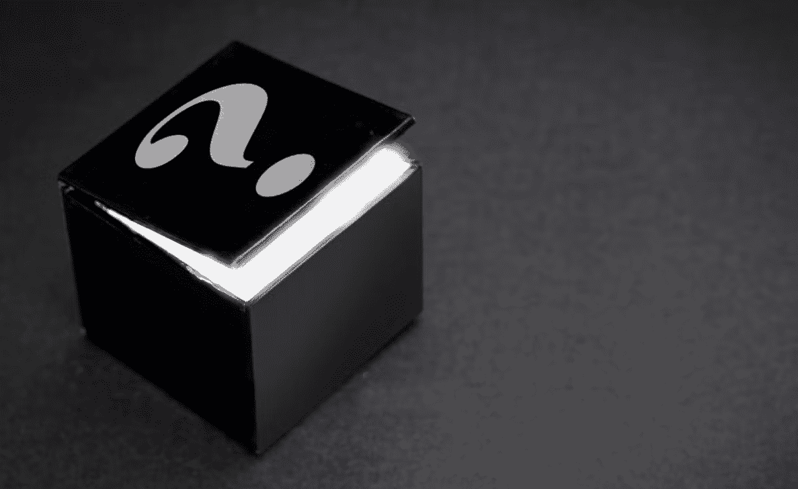

## 我们的 AR 元宇宙 NFT 神秘盒子演示–第 1 部分

我们不希望你盲目跟随我们，建造一些你无法完全预见的东西。因此，在我们给你机会动手之前，我们将快速演示一下我们的例子 AR 元宇宙 NFT dapp。

我们 dapp 的初始屏幕显示“连接”按钮:


如果用户想继续，他们需要点击上面的按钮。这样做将启动 [Web3 认证](https://moralis.io/web3-authentication-the-full-guide/)。因此，我们的示例 dapp 自动将用户连接到他们的 [Web3 钱包](https://moralis.io/what-is-a-web3-wallet-web3-wallets-explained/)。我们示例中的用户想要用元掩码对[进行认证。因此，用户确认](https://moralis.io/how-to-authenticate-with-metamask/)[元掩码](https://moralis.io/metamask-explained-what-is-metamask/)内的连接:

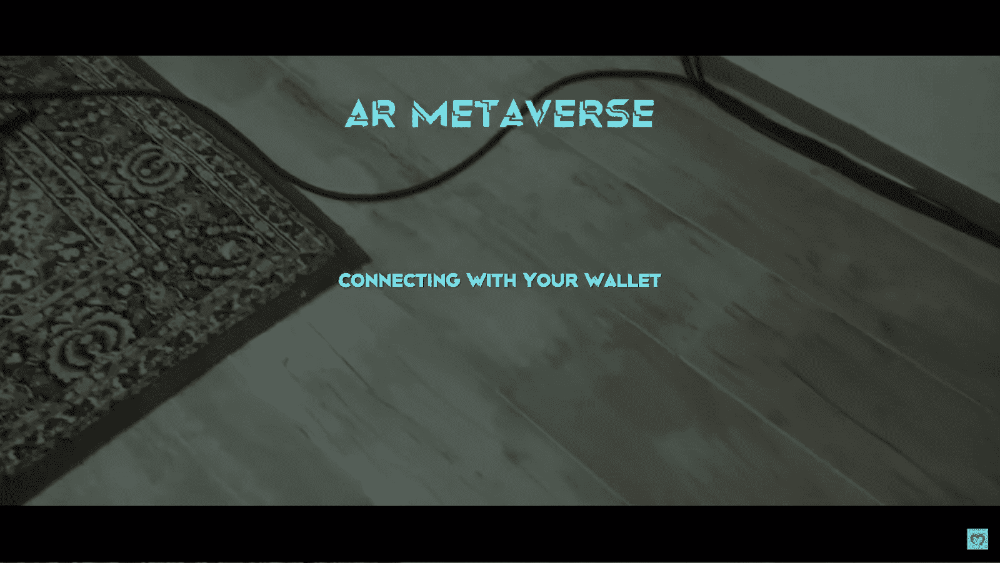

一旦用户完成他们的 [Web3 登录](https://moralis.io/how-to-build-a-web3-login-in-5-steps/)，我们的应用程序就开始通过用户的智能手机摄像头扫描环境:


看上面的截图，“移动你的设备”信息通知用户扫描周围的表面。只要我们的 AR 元宇宙 NFT dapp 检测到一个平面，就会出现“点击放置物体”消息:

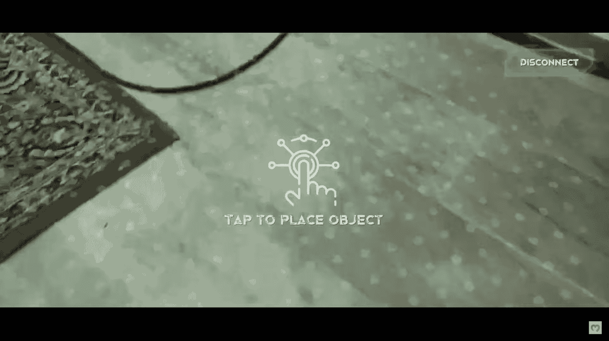

因此，用户可以点击智能手机的屏幕，将 AR 元宇宙 NFT 神秘盒子放在检测到的表面上。一旦用户点击屏幕，神秘框就会出现:


正如你在上面的截图中看到的，这个盒子的顶部有一个蓝色的灯。此灯指示用户需要击中的目标，以便打开神秘盒子:

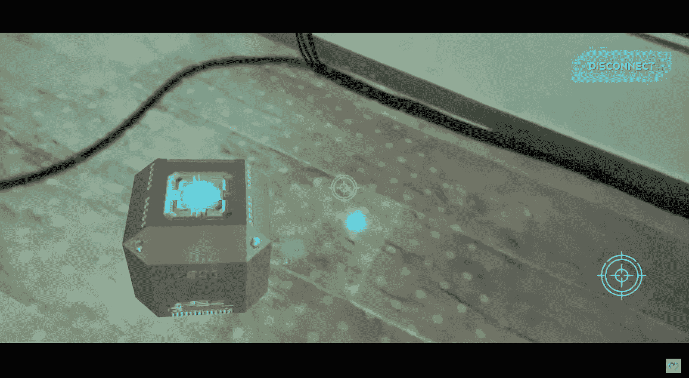

此外，右下角还有一个十字准线图标，表示用户处于“拍摄模式”。因此，这是用户需要点击来拍摄的地方。此外，如上图所示，十字准线固定在屏幕中央。因此，用户可以通过移动设备来瞄准目标:


一旦用户点击神秘盒子顶部的蓝光，它就会打开，并出现一个 AR 元宇宙 NFT:

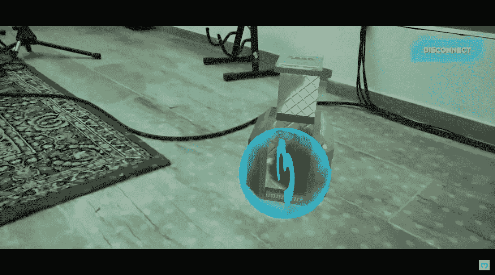

### 演示:如何铸造一个 AR 元宇宙 NFT-第 2 部分

除了 Web3 登录，到目前为止，用户还没有真正与区块链互动。然而，如果他们想收集的 AR 元宇宙 NFT 出来的盒子，他们将需要薄荷。要做到这一点，玩家必须点击发光的项目。通过这样做，将出现以下选项:


上面的菜单只提供了一个选项:点击“铸造”按钮铸造 AR 元宇宙 NFT。接下来，我们的 dapp 通知他们确认交易:

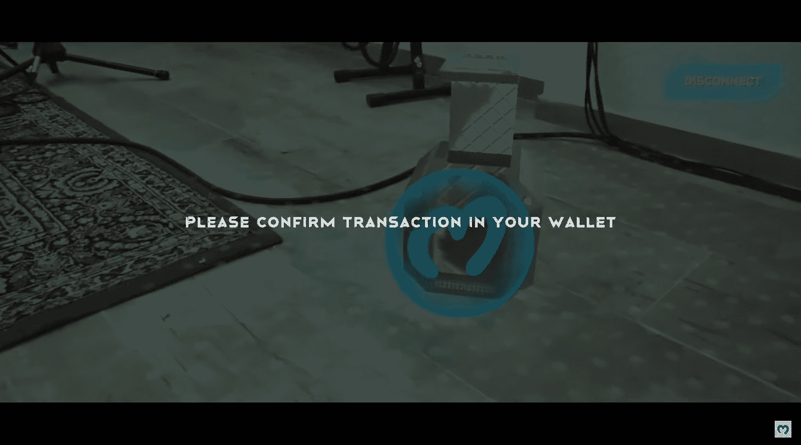

实际上，dapp 会提示用户的钱包:


要继续，用户需要点击“确认”，这将启动铸造交易。一旦交易完成，用户还可以将铸造的 NFT 导入他们的 Web3 钱包。为此，他们需要再次点击发光的项目:


这一次，用户必须点击“地址”按钮，而不是点击“薄荷”。这会复制 NFT 地址并提示他们的元掩码钱包。在那里，他们将有机会粘贴复制的地址:


要完成 AR 元宇宙 NFT 导入，用户必须返回到 dapp 的屏幕:


回到 AR dapp，用户必须对令牌 id 重复上述步骤，从点击“id”按钮开始。此外，在填充了“地址”和“ID”字段后，用户只需点击“导入”:


通过完成上述步骤，用户能够在其元蒙版中查看他们的新 AR 元宇宙 NFT:


*注* *:要想更动态地演示我们的 AR dapp，请观看本文末尾的视频。*

## 用团结，安全帽和 Moralis 创造一个 AR 元宇宙 NFT 神秘盒子

看过上面的演示后，你可能渴望卷起袖子，创建自己的 AR 元宇宙 NFT 神秘盒子实例。幸运的是，你不需要从零开始。正如我们通常所做的那样，我们将包括所有资产在内的整个代码放在了 GitHub 上。如果你还没有这样做，现在将是一个伟大的时间来创建您的免费 Moralis 帐户。毕竟，Moralis 是[最终的 Web3 后端平台](https://moralis.io/exploring-the-best-web3-backend-platform/)，让你在大约一个小时内准备好你的 AR dapp。

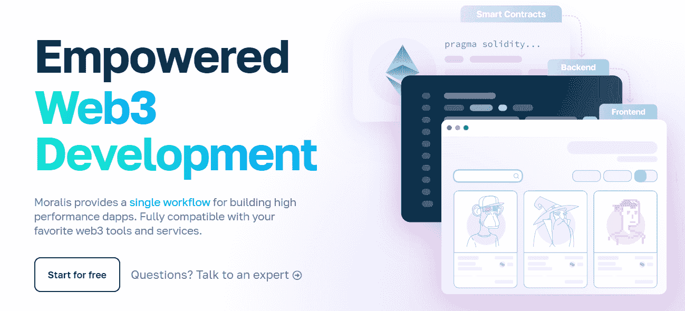

此外，让我们提醒您我们将在以下章节中涵盖的六个阶段:

1.  使用 Unity 构建 AR dapp 的项目设置和要求
2.  初始 Moralis 设置
3.  项目结构概述
4.  创建元宇宙项目
5.  部署一份 [ERC-721 合同](https://moralis.io/erc721-contract-exploring-erc721-smart-contracts/)
6.  使用户能够铸造一个 AR 元宇宙 NFT

在继续之前，我们还必须指出，我们将把我们的示例项目集中在 Polygon testnet (Mumbai)上。然而，由于 Moralis 完全是关于跨链互操作性的，所以您可以很容易地将相同的代码(稍作调整)用于其他受支持的区块链。此外，我们将创建一个 Android dapp，不过您也将学习如何创建一个 iOS dapp。尽管如此，请务必使用本文末尾的视频来更深入地了解代码和具体步骤。

## 使用 Unity 构建 AR Dapp 的项目设置和要求

要使用 Unity 创建 AR 应用，需要 Unity 的 AR 基础框架。后者包括 Unity 的 AR 核心和 AR 套件，允许你为 Android 和 iOS 设备构建。因此，我们的示例项目包含了所有必需的包。但是，您仍然应该使用 Unity Hub 来检查您的安装(7:38 的视频):

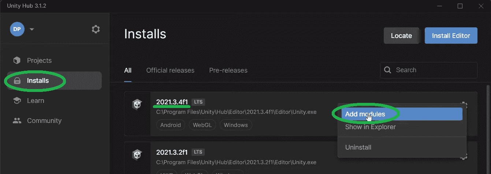

*注意* *:我们建议安装如上图所示的相同版本，以避免任何潜在的兼容性问题。*

点击“添加模块”后，确保您安装了“Android 构建支持”:

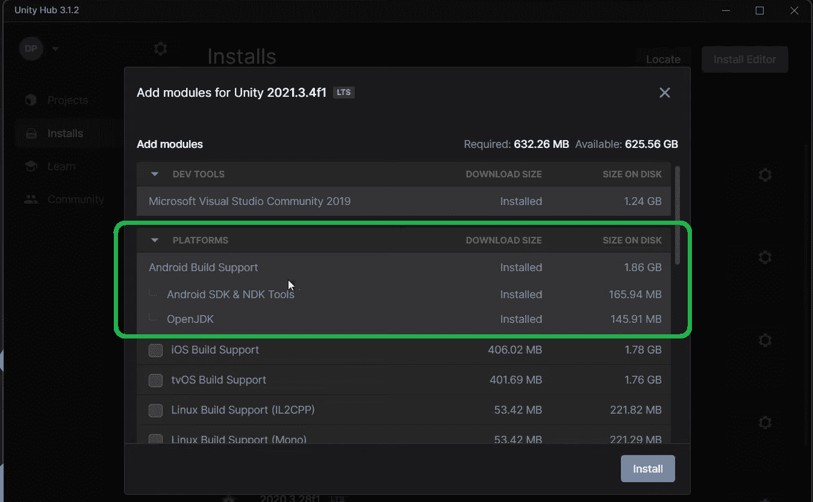

*注意* *:如果你优先考虑 iOS AR 应用，你需要安装 iOS 构建支持。*

此外，请注意，我们从 Unity 的 AR 模板开始构建我们的 AR 元宇宙 NFT dapp:


“AR”模板包括所有必需的包和依赖项:


现在你已经确保了你的设置与上面的相匹配，你可以打开“unity-web 3-sample-ar-元宇宙”项目了:

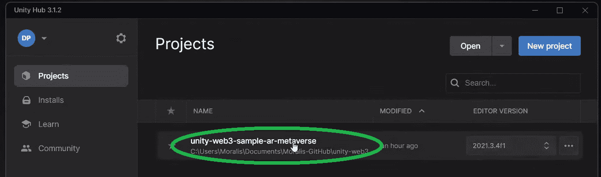

## 初始 Moralis 设置

如果您遵循视频教程，您必须首先重新打开“Moralis Web3 设置”窗口:


您在此阶段的任务是获取您的 dapp URL 和 ID:

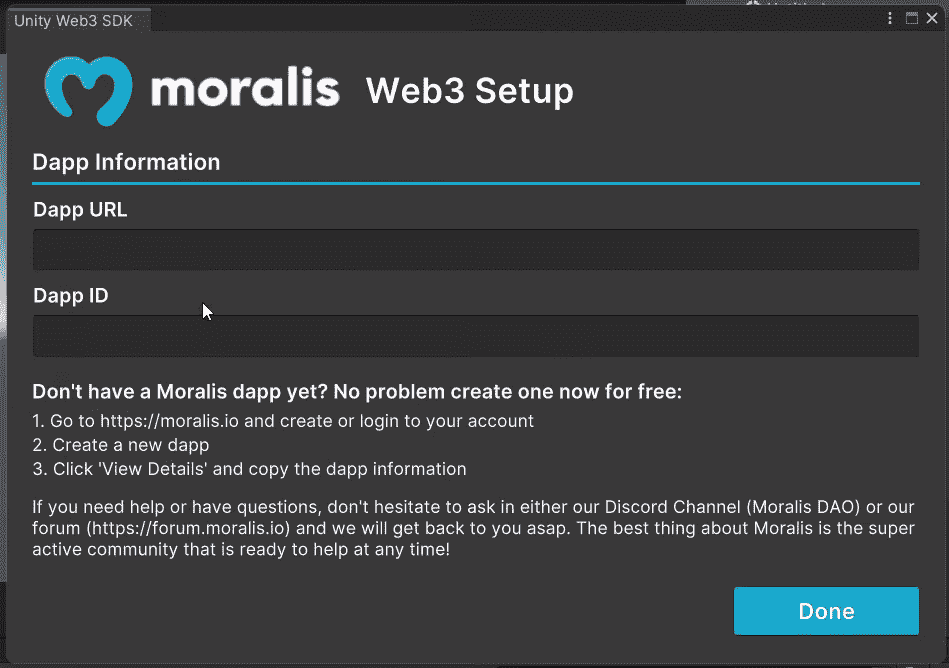

上面的截图包括简化的说明。然而，如果这是你第一次与 Moralis 进行竞技，下面的截图将对你有很大的帮助。当然，你也可以使用下面的视频，从 9:17 开始:

1.  此时，您很可能已经准备好了您的 Moralis 账户。如此，只需[登录](https://admin.moralis.io/login)即可。如果没有，现在就创建您的免费帐户:


2.  使用“创建新的 Dapp”按钮:


3.  选择“测试网”环境:


4.  选择“Polygon Mumbai”并点击“继续”:

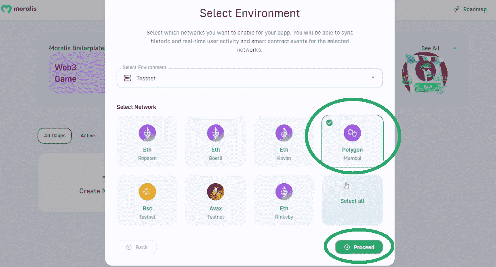

5.  选择离您最近的城市，然后点击“继续”按钮:

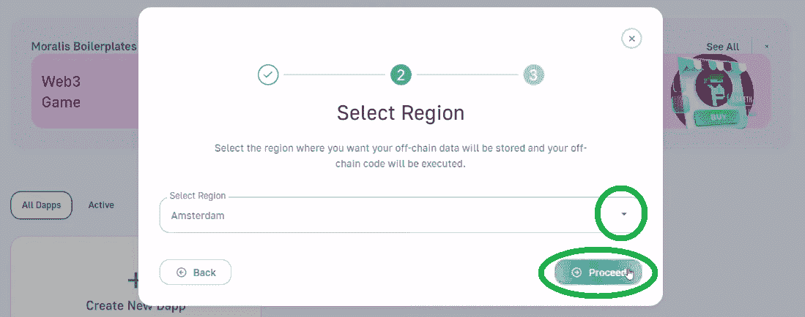

6.  命名您的 dapp 并点击“创建您的 Dapp”按钮运行它:


7.  点击新 dapp 上的“设置”按钮:


8.  复制 dapp URL 和应用程序 ID:


9.  将上面复制的凭证粘贴到 Unity 中，然后单击“完成按钮”:


## 项目结构概述–我们的 AR 元宇宙 NFT 神秘盒子 Dapp

打开我们 AR dapp 的“主”场景:


这意味着您应该在“层次”窗口中看到“主”场景:

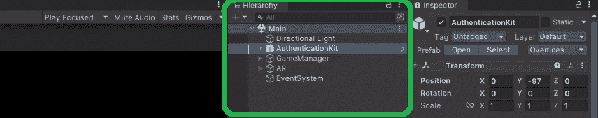

场景已经包含了运行应用程序所需的一切。例如，“AuthenticationKit”负责 Web3 登录。然而,“GameManager”状态机才是我们要关注的。后者使用多种状态来确保我们的 AR dapp 功能如前所述:


正如你在上面的截图中看到的，我们给这些州命名是为了清楚地表明它们的目的。因此，每个状态都使用代码(脚本)，代码执行适当的操作。使用下面的视频(12:25)，你可以仔细看看每个州。

## 创建元宇宙项目

创建元宇宙项目包括多个移动部件。因此，使用视频教程可以简化事情。因此，请务必跳到 18:47，在这里您将首先关注“开场”脚本。后者涵盖了创建元宇宙项目的要点。然而，理解 dapp 如何达到这种状态是很有帮助的。因此，视频将向您展示导致“打开”状态的“扫描”和“拍摄”脚本的详细信息。接下来，您将仔细查看“MetaverseItem”预设(24:40):


“MetaverseItem”脚本非常关键，因为它使用 IPFS URL 来提取图像 URL。使用后者，“MetaverseItem”脚本创建 sprite。然后，从 31:40 开始，你将专注于“观看”脚本。后者负责当用户点击从我们的 AR 元宇宙 NFT 神秘盒子中出来的发光物品时做出反应。一旦检测到该事件，它将激活“正在检查”状态:


## 部署 ERC-721 合同

为了能够将神秘盒子中的一件物品铸造成 NFT，您需要部署自己的智能契约。当然，你可以复制[我们的智能合约的代码](https://github.com/MoralisWeb3/unity-web3-sample-ar-metaverse/blob/main/Assets/_Project/SmartContract/MetaverseAR.txt)。这样做，你将获得你的 ERC-721 合同的地址和 ABI。您需要将这些细节粘贴到“游戏管理器”脚本中:

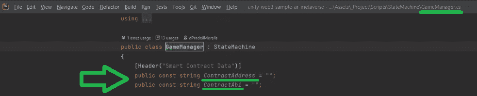

此外，在这里您将学习如何使用 Hardhat (36:39)来编译、部署和验证智能合约。如需更多支持，请确保使用我们详细的分步[安全帽说明](https://github.com/MoralisWeb3/unity-web3-sample-ar-metaverse/blob/main/Assets/_Project/SmartContract/INSTRUCTIONS.txt)。

*注意* *:除了安全帽，你还可以使用* [Remix](https://moralis.io/remix-explained-what-is-remix/) *来部署你的智能合约。无论哪种情况，您都需要将孟买网络添加到元掩码中。同样，你必须使用* [*孟买龙头*](https://moralis.io/mumbai-testnet-faucet-how-to-get-free-testnet-matic-tokens/) *来获得一些“播放”MATIC。*

## 使用户能够铸造一个 AR 元宇宙 NFT

随着你的智能合约的部署及其细节被粘贴到“游戏经理”脚本中，你已经准备好进入本教程的最后阶段。因此，从 57:00 开始，我们的内部专家将展示“铸造”脚本的细节。这也是你会看到 Moralis 令人印象深刻的力量的地方。如下面的代码行所示,“ExecuteMinting”函数完成了这个任务。它接受元数据 URL 作为参数:

```js
string resp = await Moralis.ExecuteContractFunction(GameManager.ContractAddress, GameManager.ContractAbi, "mintItem", parameters, value, gas, gasPrice);
```

```js
最后，这也是我们在整篇文章中引用的视频教程:https://www.youtube.com/watch?v=Ne33FSVnMzw 如何创建 AR 元宇宙 NFT 神秘盒子–总结通过将本文与上述视频教程结合使用，您有机会创建自己的 AR 元宇宙 NFT dapp。因为我们为您提供了完整的代码和所有必需的资产，所以您只需要完成初始的 Moralis 设置就可以获得所需的凭证。一旦您将 Unity 与 Web3 功能连接，您还必须部署您自己的智能合约实例。当然，我们通过仔细查看重要的游戏状态和相应的脚本，为您提供了额外的上下文。最终，你现在知道如何使用 Unity 来创建交互式 AR Web3 游戏和 dapps。如果您想进一步拓展您的 Unity Web3 技能，我们鼓励您关注我们的其他 [Unity 教程](https://www.youtube.com/watch?v=rZSPIyB-0R4&list=PLFPZ8ai7J-iQcI05EXqRUPK2VXDQaAPIr)。比如可以学习[上传 Web3 Unity 元数据](https://moralis.io/uploading-web3-unity-metadata/)，如何[上传 Unity 资产到 IPFS](https://moralis.io/how-to-upload-unity-assets-to-ipfs/) ，[存储链外数据](https://moralis.io/how-to-store-off-chain-data-unity-web3-database/)，用 Unity 做[区块链游戏交易](https://moralis.io/how-to-do-blockchain-game-transactions-with-unity/)，搭建 [Web3 MMORPG](https://moralis.io/build-a-web3-mmorpg-with-unity-in-10-minutes/) 。另一方面，你可以使用 [Moralis YouTube 频道](https://www.youtube.com/c/MoralisWeb3)和 [Moralis 博客](https://moralis.io/blog/)来探索区块链发展的其他方面。一些最新的文章涵盖了一个[以太坊 dapp API](https://moralis.io/what-is-an-ethereum-dapp-api-build-ethereum-dapps-easily/) ，一个[多边形 dapp API](https://moralis.io/polygon-dapp-api-how-to-efficiently-create-polygon-dapps/) ，[币安 dapp API](https://moralis.io/binance-dapp-api-how-to-easily-build-projects-on-binance/) ，[以太坊合并](https://moralis.io/ethereum-merge-what-is-ethereum-2-0-and-the-merge/)，创建一个 [Web3 博客 dapp](https://moralis.io/guide-to-creating-a-web3-blog-dapp/) (一个 [Web3 媒体](https://moralis.io/how-to-build-a-web3-medium-clone/)克隆)，构建一个 [Web3 角色扮演游戏](https://moralis.io/how-to-build-a-web3-action-role-playing-game/)，创建一个[社交媒体 dapp](https://moralis.io/how-to-create-a-social-media-dapp/) 等等。另外，如果你想满怀信心地[成为一名 Web3 开发者](https://moralis.io/how-to-become-a-web3-developer-full-guide/)，你应该考虑报读[Moralis 学院](https://academy.moralis.io/)。除了获得专业的[区块链发展课程](https://academy.moralis.io/all-courses/)，您还将获得个性化的学习路径和专家指导。然而，可能最大的价值等待着你成为一个最惊人的加密社区的成员！    

```