# 如何用 4 个步骤创建雪崩 dApp

> 原文：<https://moralis.io/how-to-create-an-avalanche-dapp-in-4-steps/>

区块链产业发展迅速，每天都有新的****(去中心化应用)在区块链的各个生态系统中涌现。最著名的区块链开发平台是** [**以太坊**](https://moralis.io/full-guide-what-is-ethereum/) **，这里是众多创新平台的聚集地。然而，以太坊远不是适合** [**Web3 开发**](https://moralis.io/how-to-build-decentralized-apps-dapps-quickly-and-easily/) **的唯一平台。其他示例包括 Polygon、BSC(币安智能链)和 Avalanche。事实上，** [**Moralis 家**](https://moralis.io/) **上周刚刚宣布** [**全力支持雪崩**](https://moralis.io/moralis-announces-full-support-for-avalanche/) **。因此，我们将仔细看看如何使用 Moralis 通过四个步骤创建雪崩 dApp。****

**如果这不是你第一次访问 [Moralis 的博客](https://moralis.io/blog/)，那么你可能会偶然发现其他教程，比如学习[构建 ETH dApps](https://moralis.io/how-to-build-eth-dapps-quickly/) ，或者[如何构建多边形 dApps](https://moralis.io/how-to-build-polygon-dapps-easily/) 。此外，这篇文章将展开同样的主题，但雪崩链。**

**对于本教程，我们将利用 Moralis 及其最终的 Web3 开发平台。Moralis 提供了一系列有价值的优秀开发工具，以及已经开发的后端基础设施。因为我们将利用 Moralis，所以有可能显著缩短开发过程，允许开发人员节省宝贵的时间和资源。这是由于 Moralis 的原生跨链兼容性，这使得学习[如何构建以太坊 dApp](https://moralis.io/ultimate-guide-how-to-build-ethereum-dapps/)和 [NFT 编程](https://moralis.io/nft-programming-for-beginners/)就像雪崩 dApp 开发一样简单！**

**所以，如果你还没有，你应该抓住机会，马上和 Moralis 签约。这是完全免费的，你将立即获得工具，如[Moralis 快速节点](https://moralis.io/speedy-nodes/)、 [NFT API](https://moralis.io/announcing-the-moralis-nft-api/) 、[价格 API](https://moralis.io/introducing-the-moralis-price-api/) 等等！**

### **什么是雪崩？**

**Avalanche 于 2020 年由艾娃实验室组织首次推出，Avalanche 是一个开放的可编程智能合约平台。当谈到 Web3 开发时，最紧迫的问题之一是拥挤的网络，例如以太坊所经历的。这使得天然气价格上涨到了荒谬的程度，需要一个解决方案。此外，这正是艾娃实验室通过创立 Avalanche 来解决的问题。因此，Avalanche 平台的要点是向其他连锁店提供可扩展的选项。**

**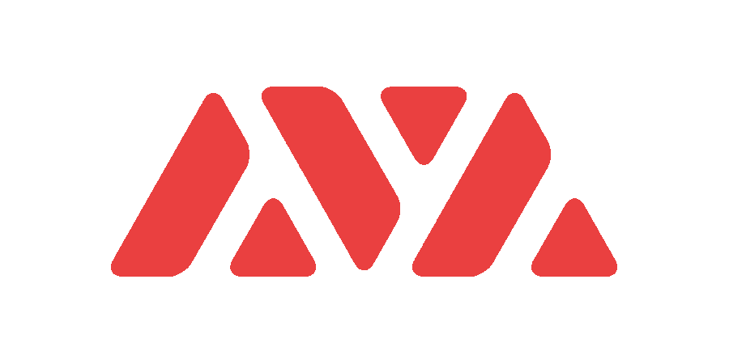

根据他们的官方网站，Avalanche 将自己标榜为基于时间终结的加密市场上最快的智能合约平台。此外，与其他利害关系证明(PoS)替代方案相比，该平台拥有最活跃的验证器来保护链的活动。

有了 Avalanche，就有可能构建低成本、快速、[可靠、](https://moralis.io/solidity-explained-what-is-solidity/)兼容的 dApps，它可以即时确认交易，并优于当今任何分散的区块链平台。此外，该平台还支持完全符合 dApps 需求和规格的定制区块链。因此，您可以构建自己的虚拟机，并决定区块链应该如何运行。

这意味着 Avalanche 平台提供了一些出色的功能和特性，为该链带来了一些竞争优势。本质上，Avalanche 着手解决三个主要问题:

1.  可扩展性。
2.  互操作性。
3.  交易费用。

如果您有兴趣了解更多关于 Avalanche 是什么的信息，那么请随时查看他们的[官方网站](https://www.avax.network/)以获得关于该平台如何工作以及为什么您应该在未来开发 dApps 时使用它的更多深入信息。

# 如何用 4 个步骤创建一个雪崩钱包追踪器 dApp

现在，我们对什么是 Avalanche 有了更好的了解，我们可以进入文章的主题，更深入地研究构建 Avalanche dApp 的过程。我们将创建一个钱包追踪器 dApp，由于我们将使用 Moralis，这一切都可以通过四个简单的步骤实现:

1.  创建 Moralis 服务器。
2.  建立项目。
3.  创建应用程序组件。
4.  显示余额。

这些步骤非常简单；然而，我们将通过所有必要的代码来完成这个过程，使跟踪器按预期工作。因此，如果您跟随我们创建 Avalanche dApp，一旦最终完成，界面看起来会像这样:

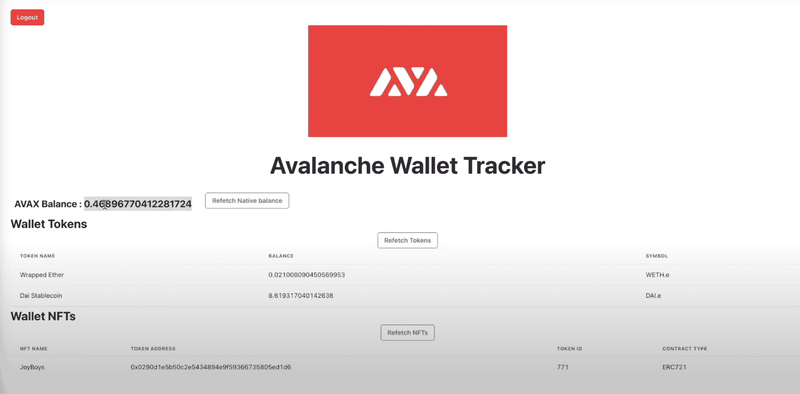

然而，我们不会遍历所有的代码，比如用 [CSS](https://moralis.io/cascading-style-sheets-what-is-css/) 来设计 dApp，相反，我们只是在这里用完整的代码链接 [GitHub 页面](https://github.com/abdulmalik97/avalanche-wallet-react)。尽管如此，让我们通过创建一个新的 Moralis 服务器开始本教程吧！

## 步骤 1:如何创建 Avalanche dApp —创建 Moralis 服务器

为了创建一个 Moralis 服务器，你需要注册这个平台。所以，如果你还没有，那么我们建议你马上加入这个平台。

一旦您有了帐户并登录，我们就可以继续创建我们自己的服务器。在 Moralis 管理页面，点击右上角的“+创建一个新服务器”按钮开始这个过程。当您单击此按钮时，会出现一个包含三个不同选项的下拉菜单，在本例中，我们选择了“Mainnet Server”选项。

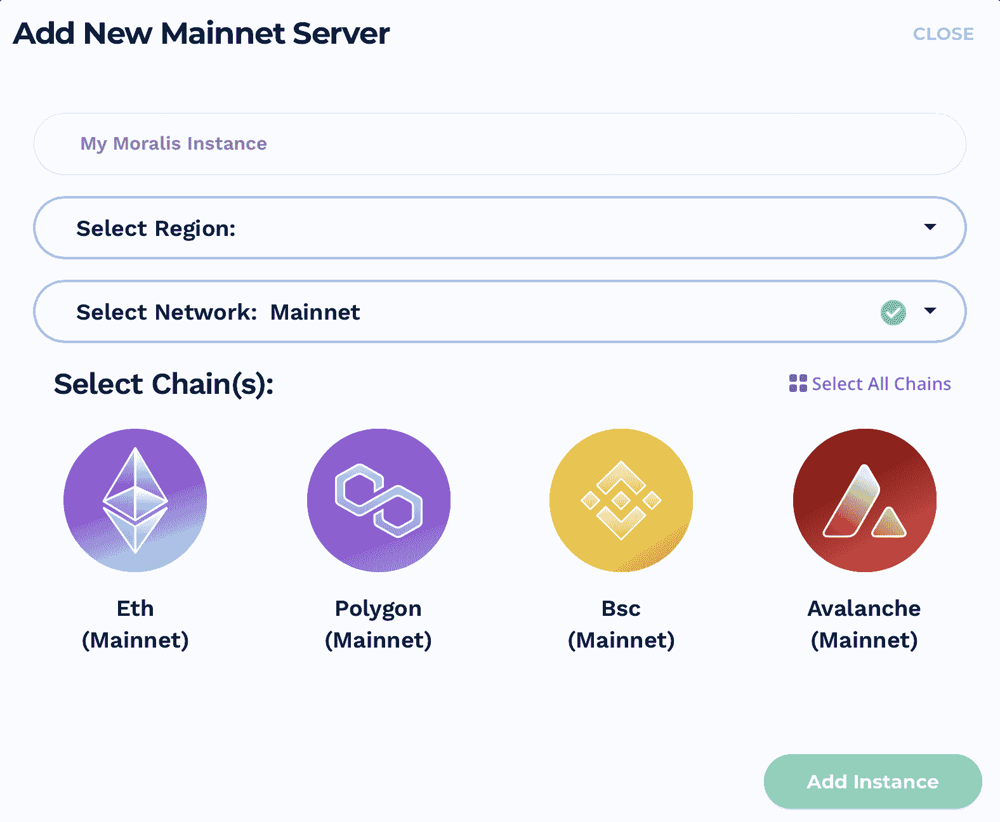

然而，一旦点击了其中一个选项，就会打开一个新窗口，您需要在其中输入一些信息。您首先需要选择的是服务器的名称。在此之后，您还需要选择适当的区域，并选择一个或多个链。由于我们正在创建一个雪崩 dApp，雪崩是我们要选择的链。

现在，有了所有适当的信息，您可以通过单击屏幕右下角的“添加实例”按钮来启动服务器。服务器有一段很短的设置时间来联机；但是，实例将很快启动并运行。

## 步骤 2:如何创建启动 dapp —设置项目

对于我们的雪崩钱包追踪器 dApp，我们将建立一个基本的 React 项目，其中我们使用已经开发的 [React 应用程序模板](https://create-react-app.dev/docs/getting-started/)。该模板为我们提供了一个已经开发好的 dApp 结构，使得设置过程非常简单。然而，这只是我们的 dApp 的“框架”,还需要一些改动。

首先，我们将向" [package.json](https://github.com/abdulmalik97/avalanche-wallet-react/blob/main/package.json) "文件添加几个包。我们需要添加的 NPM 包有“moralis”、“react-moralis”和“@chakra-ui/react”。然而，在构建 dApp 的 UI 时，后者是个人偏好，如果您愿意，您可以选择更适合您偏好的东西。

接下来，我们还需要导航到" [index.js](https://github.com/abdulmalik97/avalanche-wallet-react/blob/main/src/index.js) "文件，这是一个 [JavaScript](https://moralis.io/javascript-explained-what-is-javascript/) 文件，在这里我们需要初始化 Moralis。为此，您需要从我们之前在第一步中创建的服务器获取应用程序 ID 和服务器 URL。你需要回到 Moralis 管理面板，并进入“服务器”标签来获取这些信息。然后，您需要单击有问题的服务器的“查看详细信息”按钮。这将提供各种信息，您可以简单地将这些信息复制并粘贴到 JavaScript 文件中。因此，这将是它的样子:

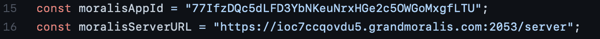

这意味着我们添加了两个带有信息的常量，然后我们将它们提供给 Moralis 提供者。此外，我们随后将应用程序包装在它的周围。代码本身看起来是这样的:

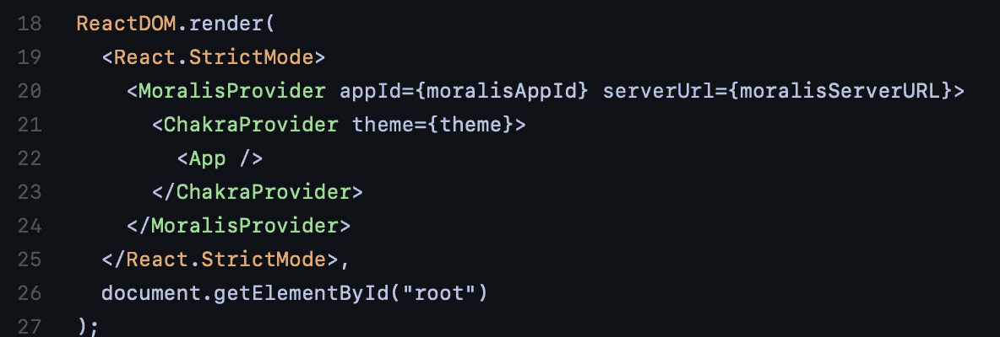

因此，我们现在已经初始化了 Moralis，使我们能够使用平台提供的所有功能。

## 步骤 3:如何创建 Avalanche dApp —创建 App 组件

dApp 开发流程的下一步是创建 App 组件本身。该组件包含实时获取链上数据并将其显示给 dApp 用户所需的各种不同的调用和函数。

### 三个电话

app 组件的第一部分由三个对我们可用的 Web3 API 的不同主调用组成:

1.  " getNativeBalance()"
2.  " getTokenBalance()"。
3.  " getNFTs()"

每个调用直接从区块链节点获取三种不同类型令牌的实时数据。顾名思义，第一个函数获取关于帐户的本地余额的数据。在这种情况下，因为我们从 Avalanche 链中获取数据，所以界面中显示的是本地货币 AVAX。

下一个调用获取账户中所有 ERC 20 代币的余额。因此，这将获取用户钱包中可用的 ETH 数量等信息。最后，我们对用户拥有的所有[NFT](https://moralis.io/non-fungible-tokens-explained-what-are-nfts/)也有一个类似的调用。因此，代码中的调用如下所示:

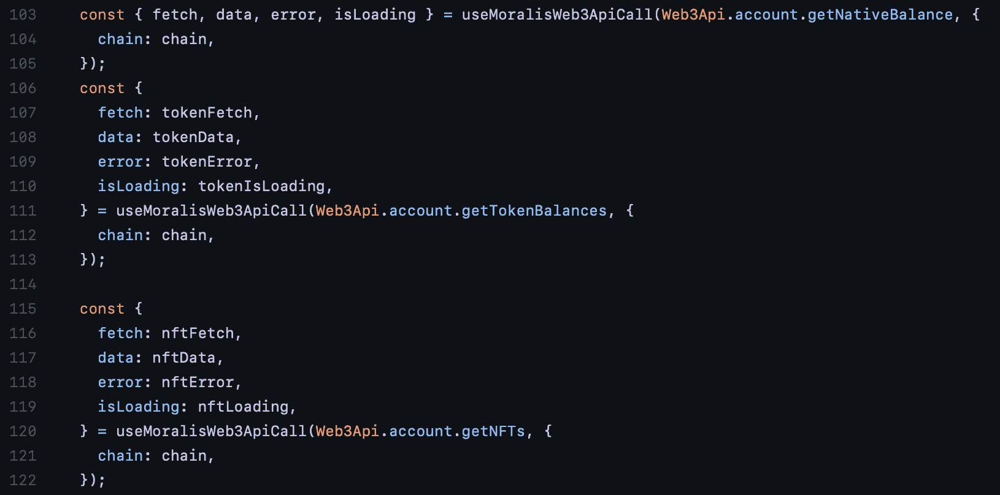

在这之后，我们还实现了一个“useEffect()”函数，该函数每隔五秒钟连续执行一次调用。这允许 dApp 频繁地更新关于各种类型的令牌的数据，然后将这些数据显示给应用程序的用户。这个函数看起来是这样的:

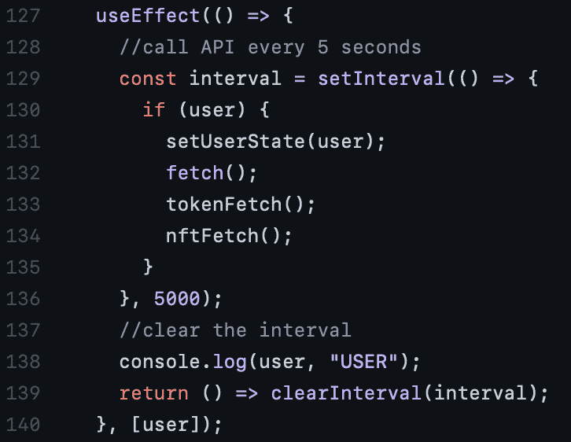

### “onChainChanged()”函数和用户认证

在这三个调用和“useEffect()”函数之后，我们有了“onChainChanged()”函数。这个调用看起来像这样:

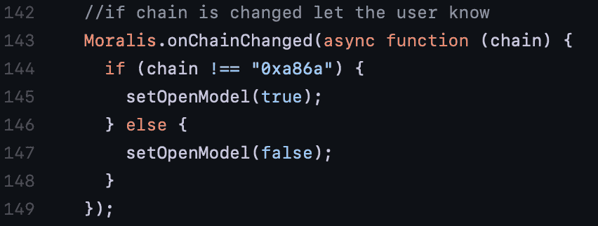

如果链从雪崩变为任何其他链，这将通知 dApp 的用户。

此外，在“onChainChanged()”下面，代码检查用户是否经过身份验证。使用 Moralis，可以实现使用各种选项(如 WalletConnect)对用户进行身份验证的功能。然而，默认情况下，Moralis 验证函数使用[元掩码](https://moralis.io/metamask-explained-what-is-metamask/)。在这种情况下，如果用户没有通过身份验证，他们将被要求使用元掩码登录。
有关如何使用元掩码认证用户的更多信息，请查看 Moralis 博客中的以下文章:“[如何使用元掩码认证](https://moralis.io/how-to-authenticate-with-metamask/)”。

## 步骤 4:如何创建启动 dapp —显示余额

第四步是简单地向用户显示代币余额。因此，身份验证部分后面的代码会处理这个问题。这里的第一个组件是原生余额组件，我们获取原生余额并显示给用户。这是组件的外观:

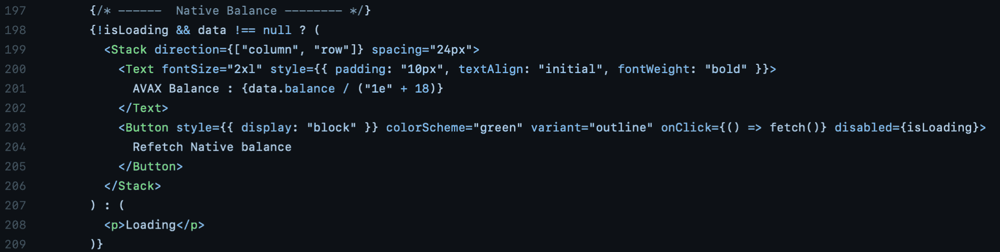

在原生余额组件之后，我们有一个类似的 ERC-20 代币。一旦获取了关于令牌的信息，我们就在一个表中显示数据。我们有一个简单的表，表中有几行，我们将关于令牌的信息映射到这些行。令牌组件的代码和表的代码如下所示:

**令牌组件**:

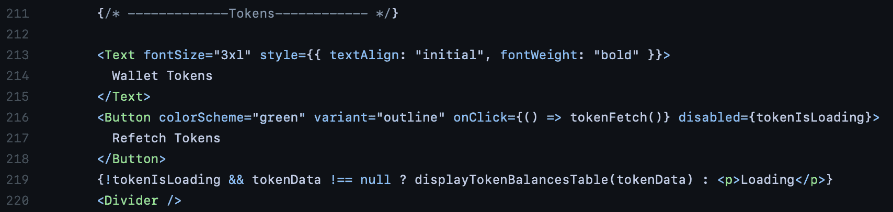

**表**:

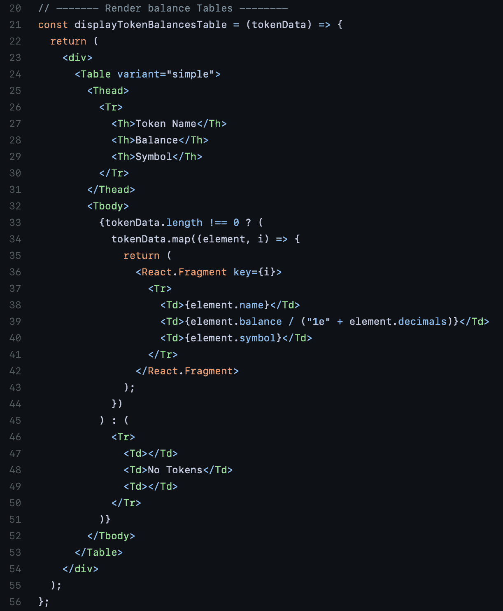

最后，我们还有一个类似的 NFTs 组件。因此，我们只需获取关于不可替换令牌的数据，并用这些信息填充表。此外，代码看起来类似于令牌组件的代码，但是这里有两个图像，可以让您的教程更加简单明了:

**NFT 组件**:

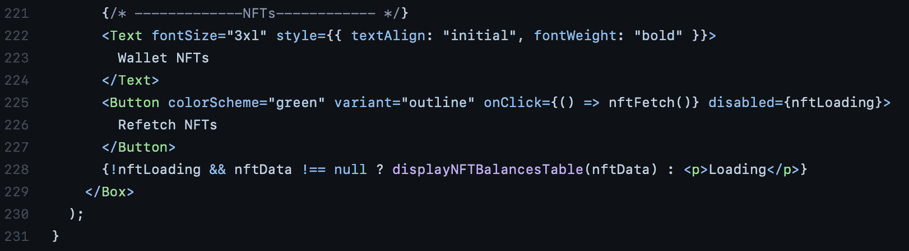

**表**:

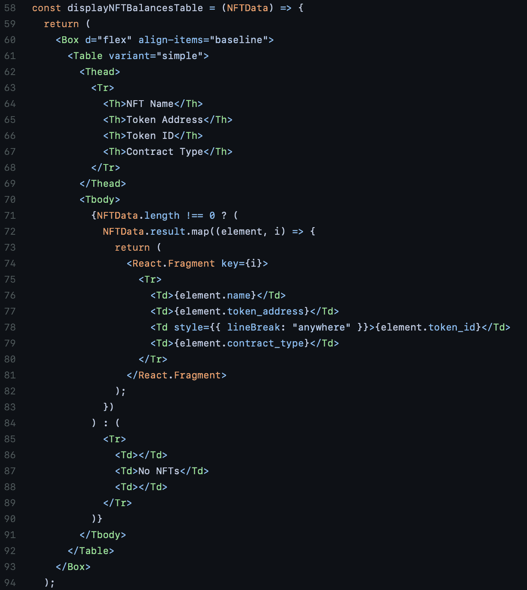

现在，这基本上是完整的应用程序。然而，如果你想查看完整的代码，那么你可以访问链接的 [GitHub 页面](https://github.com/abdulmalik97/avalanche-wallet-react/tree/main/src)。

此外，如果你想看一个视频教程来更详细地解释这个过程，那么看看下面这个来自 [Moralis 的 YouTube 频道](https://www.youtube.com/channel/UCgWS9Q3P5AxCWyQLT2kQhBw)的视频。该视频展示了 dApp 的工作原理，并对其所有功能进行了清晰的解释:

https://www.youtube.com/watch?v=YVCnxL_Cq94

## 如何通过 4 个步骤创建雪崩 dApp 总结

通过使用 Moralis 平台，我们可以在几分钟内创建一个雪崩 dApp。这种效率主要归功于 Moralis 为其用户提供的工具和无限可扩展的后端基础设施。从传统的角度来看，后端开发一直是 [Web3](https://moralis.io/the-ultimate-guide-to-web3-what-is-web3/) 开发中乏味且具有挑战性的部分。然而，这是可以避免的，因为我们可以大大减少开发时间。

因此，我们能够通过以下四个步骤创建雪崩钱包追踪器 dApp:

1.  创建 Moralis 服务器。
2.  建立项目。
3.  创建应用程序组件。
4.  显示余额。

然而，这还远远没有达到 Moralis 的极限，未来的任何区块链项目都有可能利用这个平台。例如，Moralis 已经成为顶级的 Infura 备选方案之一，并且是领先的 T2 BSC 测试网络提供商。此外，该平台的工具将使 Web3 开发变得更加容易。因此，加入 Moralis 平台应该是显而易见的。所以，如果你想成为一名 dApp 开发者，那么[现在就和 Moralis](https://admin.moralis.io/register) 签约吧！它是完全免费的，例如，你可以使用该平台[创建一个 DEX，](https://moralis.io/how-to-create-a-dex-in-5-steps/) [用一行代码](https://moralis.io/how-to-send-eth-with-one-line-of-code/)发送 ETH，等等！**