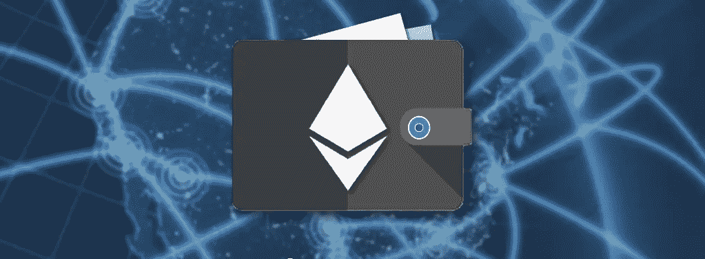
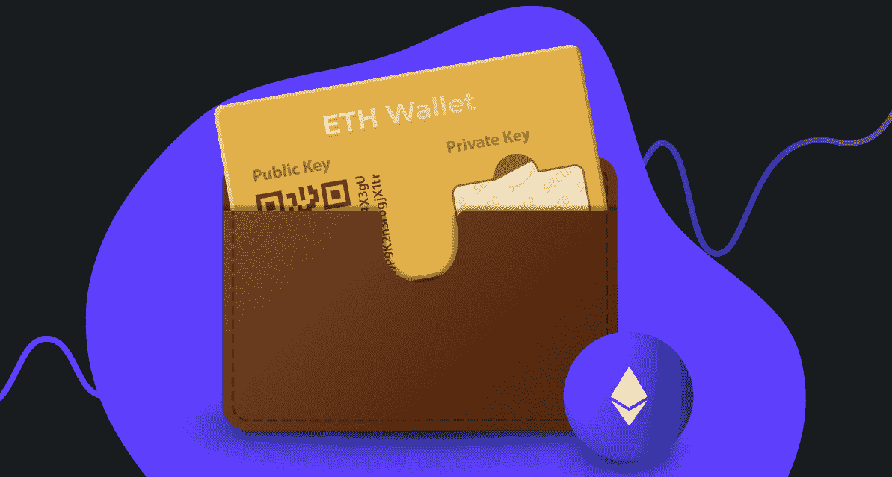
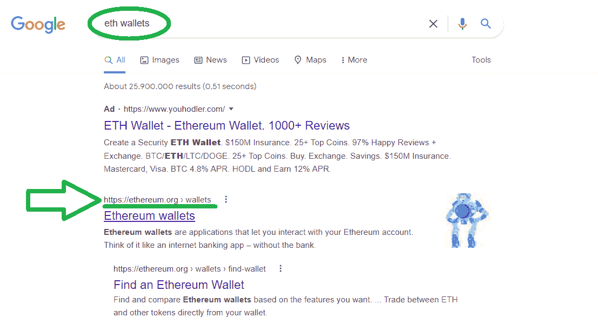
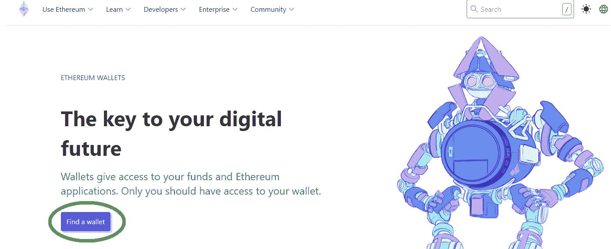
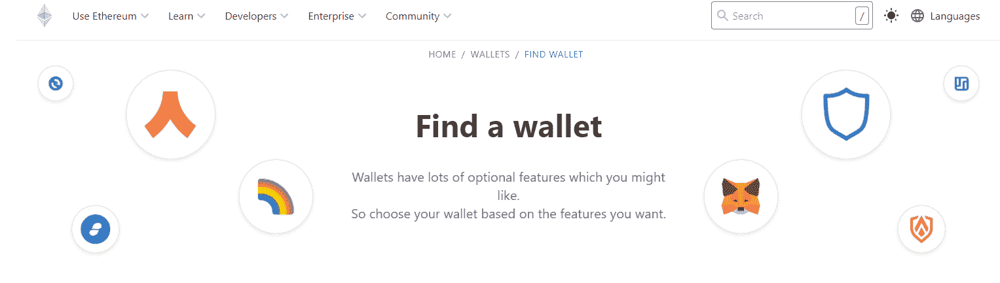
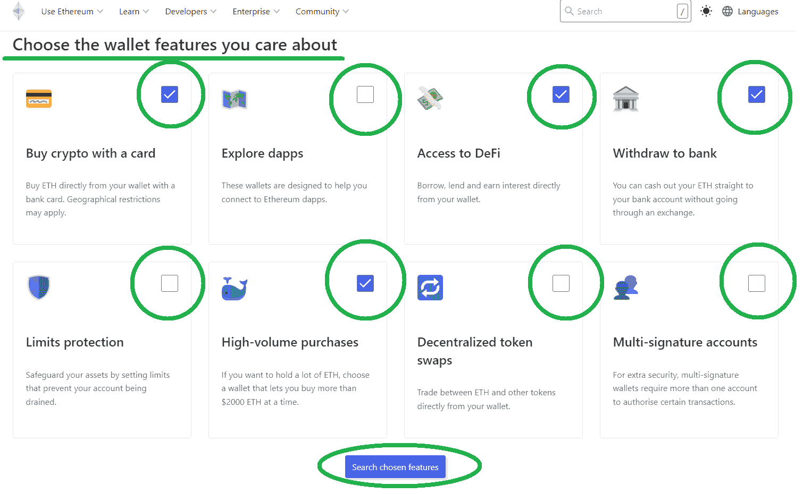
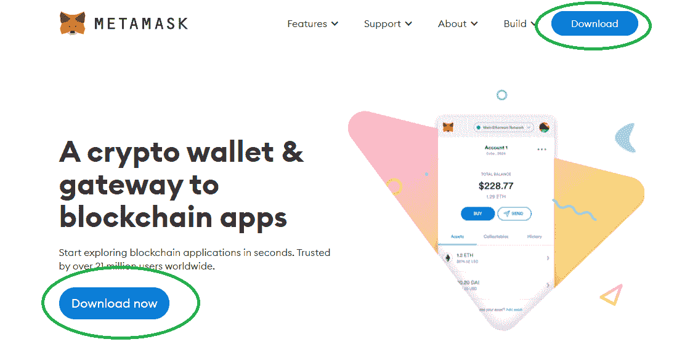
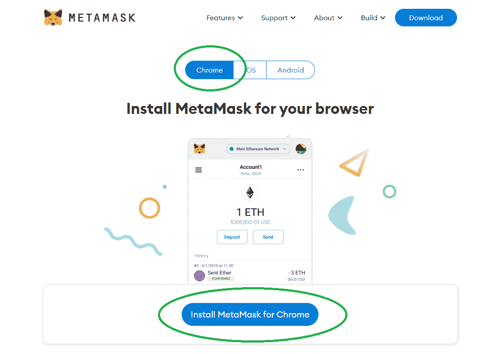
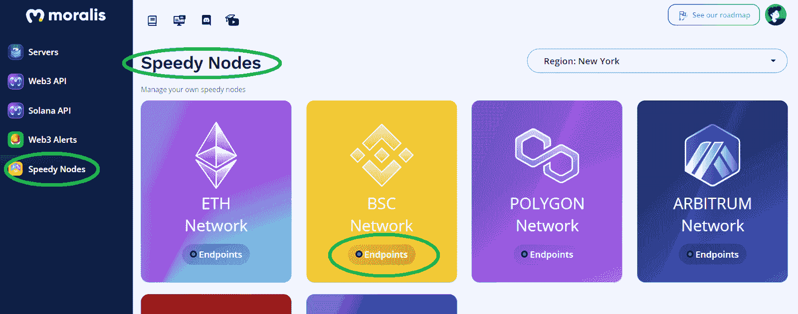
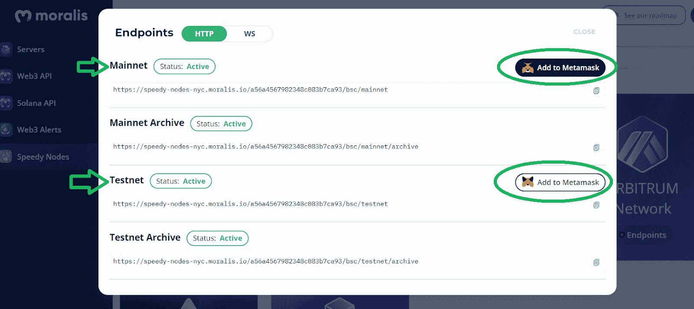

# 如何创建 ETH 钱包——完整指南

> 原文：<https://moralis.io/how-to-create-an-eth-wallet-full-guide/>

随着快速发展的去中心化 [**Web3**](https://moralis.io/the-ultimate-guide-to-web3-what-is-web3/) **互联网和传统货币通胀率的飙升，我们看到越来越多的人觉得 Web3 有利。举个例子，当分析** [**Web3 钱包**](https://moralis.io/what-is-a-web3-wallet-web3-wallets-explained/) **的活跃用户数时，数字激增！此外，随着** [**以太坊**](https://moralis.io/full-guide-what-is-ethereum/) **成为可编程区块链的庞然大物，我们意识到拥有一个 ETH 钱包将是各种可用选项中更有益的选择之一。有了 ETH 钱包，我们可以进入元宇宙，与 dapps(******)进行我们从未想象过的互动。如果你已经决定创建一个 ETH 钱包来利用这无尽的机会，请跟随这篇文章，我们将解释如何快速创建一个 ETH 钱包！如果你是密码领域的新手，不要担心；这篇文章不仅适合有经验的人，也可以作为创建 ETH 钱包的“初学者指南”。****

**在这里，您将首先了解以太坊钱包的相关基础知识。此外，我们将快速概述一些重要的工具。然而，我们将主要关注如何创建一个最适合网络用户的 ETH 钱包。因此，[成为 Web3 开发者](https://moralis.io/how-to-become-a-web3-developer-full-guide/)也是一个“必须具备”的条件。如果你想的是[超屏蔽](https://moralis.io/metamask-explained-what-is-metamask/)，那你就对了。这款著名的热门加密钱包易于创建，并且本身支持 ETH。此外，您还可以轻松地将其他兼容 [EVM](https://moralis.io/evm-explained-what-is-ethereum-virtual-machine/) 的区块链网络添加到 MetaMask 中。因此，它支持广泛的加密货币和 dapps。此外，由于[Moralis](https://moralis.io/)meta mask 集成，您的 [JavaScript](https://moralis.io/javascript-explained-what-is-javascript/) 或 Unity 技能可以用来创建非凡的 dapps。所以，如果你想进入 Web3，那么“开发者的元掩码”应该在你的考虑范围之内。如果您已经准备好了元蒙版，[创建您的免费 Moralis 账户](https://admin.moralis.io/register)并开始构建！**

**

## 什么是 ETH 钱包？

如前所述，我们将首先介绍一些基础知识，让您快速掌握。然而，在我们回答“什么是 ETH 钱包”之前我们需要确保你们都知道 ETH 是什么。那么，ETH 是什么？ETH 是“以太”的缩写，是以太坊区块链的本地加密货币。它是一枚硬币或一个本地令牌，用于在这个最流行的可编程链上进行交易。它还为网络提供安全性。本质上，ETH 是数字化的全球货币，是以太坊的货币。此外，按市值计算，ETH 是第二大加密货币。如果您是加密新手，以下是 ETH 和传统货币之间的一些主要区别:

*   你真正拥有它。一旦您创建了 ETH 钱包，ETH 就能让您成为自己的银行。不需要第三方。

*   尽管有许多批评，但数字货币相当安全(当然，并非所有加密货币都是如此)。然而，ETH 是由相当先进和成熟的加密技术保护的。后者保护你的钱包和交易。

*   ETH 支持点对点(P2P)支付。发送您的 ETH 不需要中介服务(如银行)。在某种程度上，这就像给另一个人现金，但方式更实际、更安全。只要你有网络连接，你就可以随时随地发送电子邮件。

*   既然以太坊是去中心化、全球化的，ETH 也是。因此，没有集中控制。因此，没有银行或公司可以突然决定印刷更多的 ETH 或改变他们的使用条款。

既然知道了什么是 ETH，那么就很容易理解什么是 ETH 钱包了。任何能够存储 ETH 并与您的以太坊帐户交互的 Web3 钱包(热[主动]或冷[被动])本质上都是 ETH 钱包。

## 轻松创建 ETH 钱包

如前所述，我们相信 MetaMask 对于 web 用户和 Web3 开发者来说是最好的 ETH 钱包。因此，我们将在下面详细介绍如何使用元掩码创建 ETH 钱包。然而，你应该知道，你可以自己探索许多其他著名的选择。此外，还有一些工具可以帮助您根据自己的需求选择合适的 ETH 钱包。在我们看来，一个非常突出的工具是“以太坊”的“寻找钱包”页面。因此，让我们快速向您展示如何使用该工具找到并创建适合您的 ETH 钱包。

### 找到并创建一个适合您的 ETH 钱包

你可以通过在谷歌搜索栏输入“eth wallets”进入“ethereum.org”的“寻找钱包”页面。潜在广告下面的第一个结果应该是正确的(确保 URL 是正确的):

进入“以太坊钱包”页面后，点击“查找钱包”按钮:

如果你已经按照上面的说明，你现在应该在“寻找钱包”页面:

在那里你有几个选择。例如，你可以向下滚动到“以太坊钱包”部分，浏览所有选项。在那里，您可以使用“更多信息”按钮查看相关钱包的主要功能:

而且，你还可以点击“Go”按钮，进入那个 ETH 钱包的官网。从那里，你可以很容易地创建一个 ETH 钱包。

然而，为了避免毫无头绪地浏览以太坊钱包,“寻找钱包”页面提供了一个简洁的功能。可以选择自己关心的钱包功能。然后，页面将使用您的选择作为过滤器，只显示合适的 ETH 钱包。要使用这些过滤器，请在选择您的首选功能后，单击“搜索选择的功能”按钮:

## 使用元掩码创建以太网钱包

现在，你已经知道我们对 MetaMask 的看法了。因此，是时候向您展示如何使用这个强大的工具来创建一个 ETH 钱包了。在接下来的几节中，我们将介绍您需要完成的所有步骤，以获得一个新的以太坊钱包。在此过程中，我们将指导您下载 MetaMask，安装它，并设置您的新 ETH 钱包。尽管如此，我们也将向您展示如何添加其他流行的可编程链，如 BNB 链，雪崩，多边形。

### 下载并安装元掩码

1.  虽然我们推荐使用谷歌 Chrome，但是打开你最喜欢的浏览器，在搜索栏中输入“MetaMask”。接下来，点击 MetaMask 官方网站:

2.  登陆 MetaMask 官网后，点击“下载”按钮。您可以在顶部菜单和“加密钱包&区块链应用网关”部分找到它:

3.  现在你应该在“下载”页面。在那里，你需要在“Chrome”、“iOS”和“Android”之间做出选择。*因为我们假设你也计划用元蒙版* *构建 dapp*[*，我们将关注“Chrome”选项。*相应地，选择“Chrome”选项并点击“为 Chrome 安装 MetaMask”:](https://moralis.io/building-dapps-with-metamask/)

4.  完成上一步后，你将被重定向到谷歌浏览器的网络商店。在那里你只需要点击“添加到 Chrome”:

5.  接下来，会出现一个要求您确认的弹出窗口。您需要点击“添加扩展”按钮才能继续:

6.  通过完成前面的所有步骤，您现在应该会看到 MetaMask 的欢迎消息。这样，元掩码扩展的下载和安装过程就结束了。尽管如此，由于您可能渴望创建一个 ETH 钱包，请务必点击“开始”:

### 使用元掩码创建 ETH Wallet

上面的“开始”按钮将带你到一个屏幕，在那里你可以选择创建一个新的钱包或导入一个现有的钱包。如果您已经有一个有效的 ETH 钱包，您可以使用您的秘密恢复密码来访问它。因此，点击“导入钱包”按钮。但是，我们将重点介绍“创建钱包”选项，因为这是使用元掩码创建 ETH 钱包的方法:

1.  点击“创建钱包”按钮:

2.  然后，您需要创建您的密码，并通过重新输入相同的字符组合进行确认。此外，选中“使用条款”框以激活“创建”按钮:

3.  在某些地区,《元蒙版设置指南》包括一个教学视频。如果你是这种情况，我们鼓励你观看它。现在，下一个重要步骤围绕着您应该安全存储的秘密恢复短语。要查看该短语，请点击“点击此处揭示秘密词汇”:

4.  随着你的秘密话语的泄露，抄下或写下它们。确保按照正确的顺序来写——单词的顺序很重要。最重要的是，把你的副本或笔记存放在安全的地方。在一张纸上手写短语可能是最安全的做法。但是，一定要仔细检查你的拼写。花点时间完成这重要的一步，把事情做好。如果您当前的设备重置，您将使用您的机密恢复短语从任何其他设备访问您的钱包或恢复您的帐户。现在您已经安全地存储了您的密码，请单击“下一步”。

5.  按照正确的顺序输入上一步中短语的单词。这样，您将激活“确认”按钮，从而完成该过程:

### 向元掩码添加其他链

使用以上说明，您已经成功创建了您的 ETH 钱包。此外，你的新 ETH 地址可以作为以太坊测试网和主网的钱包。这些是 MetaMask 默认支持的网络。但是，您可以轻松添加其他 EVM 兼容链。

将其他区块链网络添加到元掩码时，您有两种选择:

1.  可以手动做**。*因为这是一种更安全的方法，所以我们推荐这种方法。***
2.  或者，你可以自动完成**。*在这种情况下，你使用一个信誉良好的网站，在那里你* ***点击正确的按钮*** *，这将问题链添加到你的元掩码中。如果你决定使用自动选项，你需要小心。绝对是比较快的方法；然而，它有潜在的危险。如果您信任该网站，请仅使用此方法。当然，有许多有效的网站提供这种捷径。然而，这些网站不在我们的控制之下；因此，我们不能保证他们中的任何一个。我们可以担保的唯一具有该选项的平台是 Moralis(通过*[*Moralis Speedy Nodes*](https://moralis.io/speedy-nodes/)*)。***

#### **如何手动将其他链添加到元掩码**

***   首先打开元掩码扩展。接下来，单击“帐户”图标。如下图所示，从下拉菜单中选择“设置”。**

**

2.  接下来，点击“设置”菜单中的“网络”选项:

3.  要手动添加 EVM 兼容的区块链，请点击右上角的“添加网络”按钮。

4.  最后，您需要输入(复制并粘贴)所需的详细信息，然后单击“保存”按钮。以下是一些流行的 EVM 兼容网络所需的详细信息(可在区块链的文档中找到):

1.  详情**添加 BNB 连锁的主网**:

*   *网络名称:智能链*
*   *新的 RPC URL:https://bsc-dataseed.binance.org/*
*   *链条 ID: 56(如果 56 不行，试试 0x38)*
*   *符号:BNB*
*   *区块浏览器网址:https://bscscan.com*

2.  详情到**添加 BNB 链的测试网**:

*   *网络名称:智能链-测试网*
*   *新的 RPC URL:https://data-seed-prebsc-1-s1.binance.org:8545/*
*   *链 ID: 97(如果 97 不行，试试 0x61)*
*   *符号:BNB*
*   *区块浏览器网址:https://testnet.bscscan.com*

3.  **添加多边形的 mainnet** 的细节:

*   *网络名称:多边形 Mainnet*
*   *新的 RPC URL:https://polygon-rpc.com/*
*   *链条 ID: 137*
*   *符号:MATIC*
*   *区块浏览器网址:https://polygonscan.com/*

4.  详情见**添加多边形的测试网(孟买)**:

*   *网络名称:Matic Mumbai*
*   *新的 RPC URL:https://rpc-mumbai.maticvigil.com/*
*   *链条 ID: 80001*
*   *符号:MATIC*
*   *区块浏览器网址:https://mumbai.polygonscan.com/*

5.  详情到**添加雪崩的 mainnet** :

*   *网络名称:雪崩网络*
*   *新建 RPC URL:https://API . avax . network/ext/BC/C/RPC*
*   *链条 ID: 43114*
*   *符号:AVAX*
*   *区块浏览器网址:https://snowtrace.io/*

6.  详情到**添加雪崩的测试网(富士)**:

*   *网络名称:雪崩富士 C 链*
*   *新建 RPC URL:https://API . avax-test . network/ext/BC/C/RPC*
*   *链条 ID: 43113*
*   *符号:AVAX*
*   *区块浏览器网址:https://testnet.snowtrace.io/*

#### 如何自动向元掩码添加其他链

为了使用 Moralis 满足您的后端需求，您需要创建您的免费 Moralis 帐户。这样做，你就可以进入你的 Moralis 管理区。此外，在这里你可以通过点击一个按钮来访问 Moralis Speedy Nodes 并添加某些网络。例如，以下是 BNB 链条公司(原 BSC)需要遵循的步骤:

1.  点击侧面菜单标签中的“快速节点”:

2.  单击“BSC 网络”下的“端点”按钮(见上图)。

3.  使用“添加到元掩码”按钮添加 mainnet 或 testnet:

4.  您还需要确认元掩码中的网络切换:

## 如何创建以太网钱包-摘要

您现在对 ETH 和 ETH wallets 有了正确的理解。此外，您知道创建 ETH 钱包的几种方法。此外，您还学会了如何使用实用工具来帮助您选择最合适的以太坊钱包。然而，因为我们想帮助你[成为区块链开发者](https://moralis.io/how-to-become-a-blockchain-developer/)，我们已经向你展示了如何使用 MetaMask 创建一个 ETH 钱包。此外，为了进一步增强您的能力，我们为您提供了将一些最流行的可编程链添加到元掩码所需的详细信息。因此，你可以把你的 ETH 钱包变成一个 [BSC 钱包](https://moralis.io/bsc-wallet-guide-how-to-set-up-a-binance-smart-chain-wallet/) (BNB)，多边形钱包，或者雪崩钱包。尽管如此，一路走来，你也读到了 Moralis(又名[密码](https://moralis.io/firebase-for-crypto-the-best-blockchain-firebase-alternative/)的 Firebase)。这是当前 [Web3 技术栈](https://moralis.io/exploring-the-web3-tech-stack-full-guide/)的顶峰，也是你创建优秀 Web3 应用程序的终极捷径。

学习如何使用 Moralis 的最好方法是参与一些有趣的示例项目。你可以在[Moralis 的 YouTube 频道](https://www.youtube.com/c/MoralisWeb3)或者[的 Moralis 博客](https://moralis.io/blog/)上挑选。一些最新的话题集中在如何整合 [NFT 的能量](https://moralis.io/develop-a-web3-game-with-nft-power-ups-in-9-minutes/)、 [DeFi staking](https://moralis.io/what-is-defi-staking-full-guide/) ，如何[构建一个元宇宙游戏](https://moralis.io/how-to-build-a-metaverse-game-in-25-minutes/)，如何[降低固体气体成本](https://moralis.io/how-to-reduce-solidity-gas-costs-full-guide/)，如何[与来自 Unity 的 Web3 数据库](https://moralis.io/how-to-communicate-with-a-web3-database-from-unity/)通信，如何[创建一个以太坊 NFT](https://moralis.io/how-to-create-an-ethereum-nft-full-guide/) 、[为什么 Web3 很重要](https://moralis.io/why-is-web3-important-a-beginners-guide/)，如何构建一个 [2D Web3 游戏](https://moralis.io/how-to-build-a-2d-web3-game-full-guide%ef%bf%bc/)此外，这两个出口都是免费持续加密教育的伟大资源。

然而，你可能渴望尽快成为全职加密员。如果是这样，你可能需要采取更专业的方法。因此，[Moralis 学院](https://academy.moralis.io/)可能正是你所需要的。顶级的[区块链发展课程](https://academy.moralis.io/all-courses)，个性化的学习路径，专业的导师，以及赋权的社区在另一边等着你！****