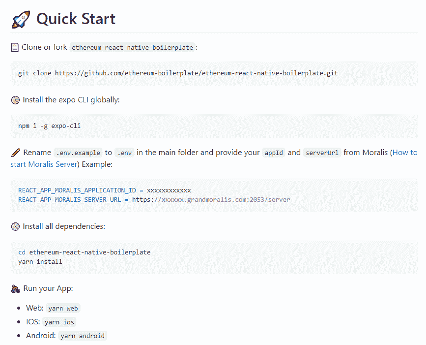
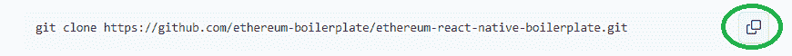
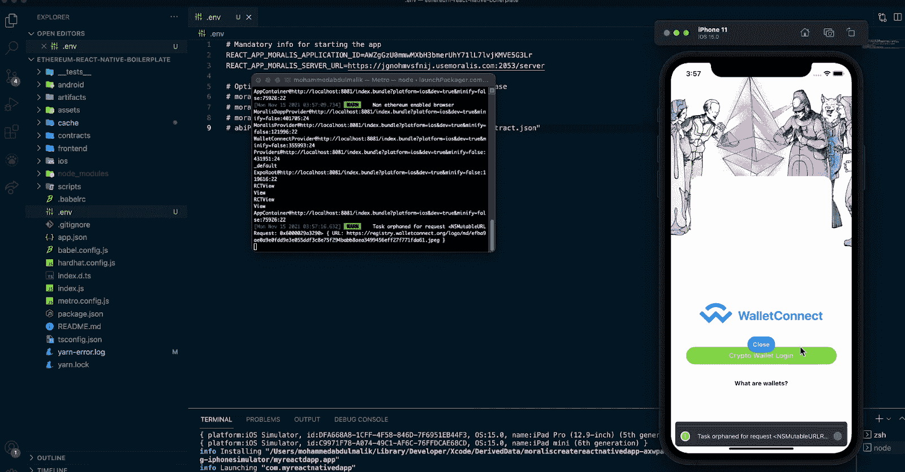
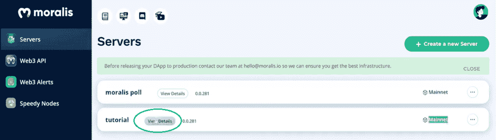
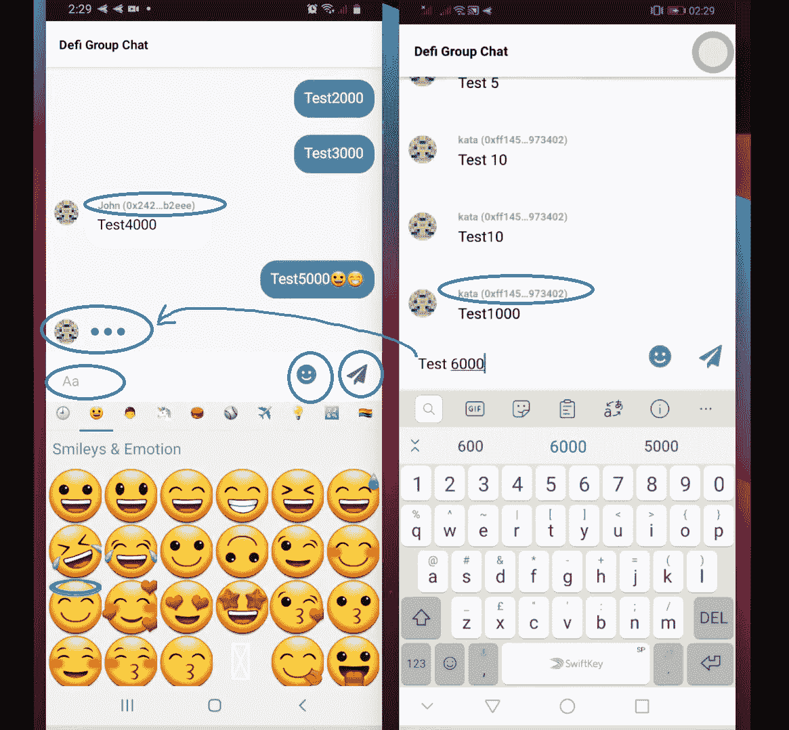
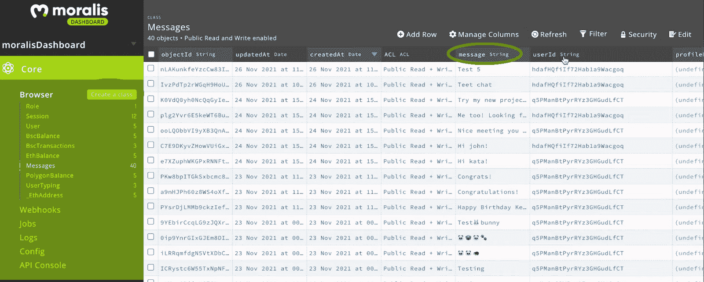
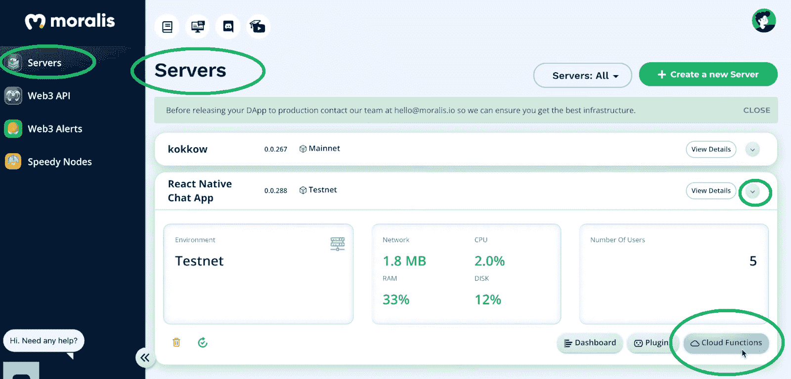
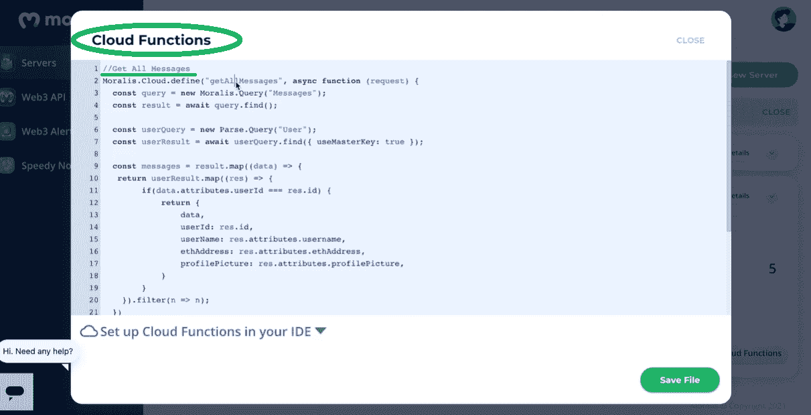
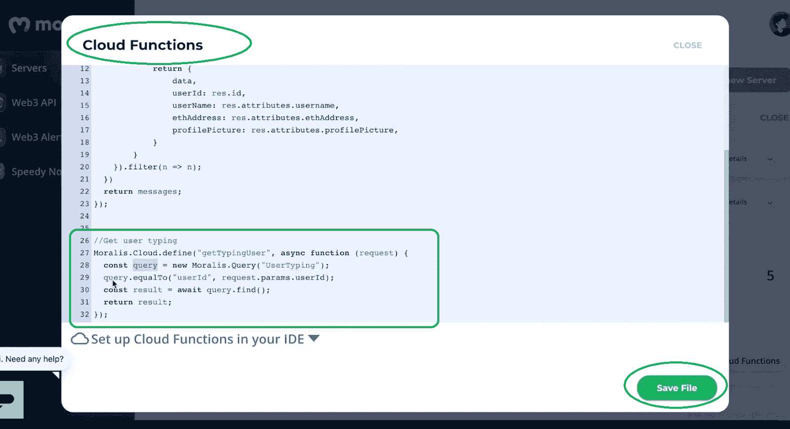

# 如何创建以太坊聊天应用程序

> 原文：<https://moralis.io/how-to-create-an-ethereum-chat-app/>

在过去的十年里，世界上大多数人已经习惯了社交媒体和聊天应用。此时，大多数人无法想象没有这些有用工具的生活。然而，与此同时，那些利用用户数据的应用背后的科技巨头的意识也在快速增长。因此，许多用户关心隐私问题。因此，对于[**【web 3】**](https://moralis.io/the-ultimate-guide-to-web3-what-is-web3/)**和去中心化成为主流来说，这是前所未有的好时机。幸运的是，有几个著名的、经过良好测试的可编程区块链可供开发人员构建 dApps。不过，** [**以太坊**](https://moralis.io/full-guide-what-is-ethereum/) **依然是首选。因此，我们想通过这篇文章向你展示如何创建一个以太坊聊天应用。**

尽管第一个可编程区块链(以太坊)已经存在了六年多，一些开发者仍然专注于集中式解决方案。因此，对于精通 JavaScript 的个人来说，机会再好不过了。此外，与几年前不同，当时构建的唯一方法是直接在 [RPC 节点](https://moralis.io/ethereum-rpc-nodes-what-they-are-and-why-you-shouldnt-use-them/)之上，现在有先进的工具可用，使您能够克服 RPC 节点的所有[限制。此外，打破所有范式的代价是 Moralis。这个终极的 Web3 开发平台，也被称为“](https://moralis.io/exploring-the-limitations-of-rpc-nodes-and-the-solution-to-them/) [Firebase for crypto](https://moralis.io/firebase-for-crypto-the-best-blockchain-firebase-alternative/) ”，它提供了在尽可能短的时间内创建各种 Web3 和移动友好的[分散式应用](https://moralis.io/decentralized-applications-explained-what-are-dapps/) (dApps)所需的一切。通过使用 [Moralis 的 SDK](https://moralis.io/exploring-moralis-sdk-the-ultimate-web3-sdk/) ，你可以很容易地用简短的代码片段覆盖区块链相关的后端编码。因此，您需要专注于提供最好的前端。

在接下来的章节中，你将学习如何使用 Moralis 和终极[以太坊移动样板](https://moralis.io/ethereum-mobile-boilerplate-full-guide-to-ethereum-for-mobile/)来创建一个优秀的以太坊聊天应用。当然，为了充分利用这篇文章，我们邀请你跟随并创建你自己版本的以太坊聊天应用程序。


## 使用 Moralis 创建以太坊聊天应用程序

在本文中，我们将进行一个示例项目，在该项目中，我们将使用以太坊移动样板并添加必要的功能来创建一个以太坊聊天应用程序。然而，我们必须首先处理一些基本的设置步骤，包括创建一个 Moralis 服务器，以便我们可以正确地使用这些强大的工具。因此，在继续我们的“以太坊聊天应用”探索之前，请确保遵循以下两组步骤。此外，Moralis 和 Ethereum mobile 样板文件的另一个优点是，它们使您能够同时创建 Android 和 iOS 应用程序。正是后者让它们成为终极[以太坊 iOS 开发套件](https://moralis.io/the-ultimate-ethereum-ios-dev-kit/)。

### 以太坊聊天应用–移动样板快速入门

Moralis 和以太坊移动样板都是关于简单和速度。因此，开始使用这些工具非常简单。要使用以太坊移动样板，请完成以下步骤:



大多数人完成这些步骤应该没有任何问题；但是，让我们指导您完成这个过程，以避免任何混淆。

1.  从克隆或派生以太坊移动样板开始。因此，在样板文件的 GitHub 页面上，单击 GitHub URL 旁边的复制图标:



2.  然后，打开您的代码编辑器(我们使用 Visual Studio 代码[VSC])，并将复制的 URL 粘贴到代码编辑器的终端中:


3.  接下来，是时候全球安装“expo CLI”了。为此，在代码编辑器的终端中键入“***”NPM I-g Expo-CLI***”。您也可以从 GitHub 复制代码，然后粘贴到终端中:


4.  将“. env.example”文件重命名为“”。env ”,并用您的 Moralis 服务器 URL 和应用程序 ID(从 Moralis 设置部分获得——按照下面小节中的说明)填充它:


5.  将 Moralis 服务器的详细信息插入到。env”和“Providers.tsx”文件，您需要安装所有依赖项。然而，由于您很可能已经在该文件夹中，您可以跳过"*CD ether eum-react-native-boilerplate*"命令。因此，您可以继续下一个命令——在 VSC 的终端中键入或粘贴“*yarn install”*:


6.  剩下的就是运行你的 dApp。请注意，用于此目的的实际命令取决于您使用的操作系统:

*   **网**:纱网
*   **iOS** :纱线 iOS
*   **安卓**:纱安卓

*出于“以太坊聊天 app”项目的目的，我们将重点关注 Android。因此，我们将使用“yarn android”命令运行我们的 dApp。*



#### 创建 Moralis 服务器

要获得以太坊移动样板的功能，您需要[创建一个 Moralis 服务器](https://docs.moralis.io/moralis-server/getting-started/create-a-moralis-server)。以下是您需要完成的步骤:

1.  [**创建一个免费的 Moralis 账户**](https://admin.moralis.io/register)–点击链接，通过输入您的电子邮件和创建您的密码来创建您的账户(不要忘记点击确认电子邮件中的确认链接来确认您的账户)。如果你已经准备好了你的 Moralis 账户，只需[登录](https://admin.moralis.io/login)。

2.**创建您的 Moralis 服务器**–登录后，访问您的 Moralis 管理区域的“服务器”选项卡(如下图所示)。在那里，单击右上角的“+创建新服务器”按钮，并从下拉菜单中选择网络类型。例如项目，我们建议选择“Testnet 服务器”选项(查看我们的[以太坊 testnet](https://moralis.io/ethereum-testnet-guide-connect-to-ethereum-testnets/) 指南)。但是，当您希望您的移动 dApps 上线时，您需要选择“Mainnet 服务器”。


在出现的弹出窗口中，输入您的服务器名称(可以是您想要的任何名称)并选择区域、网络和链。通过单击“添加实例”完成此步骤。 *T2】*


3.  **访问服务器详细信息**–服务器启动后，您可以通过单击服务器名称旁边的“查看详细信息”来访问其详细信息:



您的服务器详细信息将显示在新窗口中。在其中，您将看到您的应用程序 ID 和服务器 URL:


4.**初始化 Moralis 规范**–按照上一节(第四步)中的说明，您需要填充您的”。env "文件(以及" Providers.tsx "文件)和服务器的详细信息。通过这样做，您将获得由 Moralis 的 SDK 提供的全部后端功能。


*注意**:Do****NOT****使用上图中的细节；相反，粘贴特定服务器的详细信息。*

## 以太坊聊天应用预览

如果您已经完成了上面提供的两组步骤，那么您现在已经有了一个样板 dApp。把这当作你的起点。接下来，我们将应用必要的更改来获得以太坊聊天应用程序。然而，在我们仔细研究代码之前，让我们先预览一下我们完成的以太坊聊天应用程序。

如前所述，我们将尽可能保持简单。为了让用户使用我们的以太坊聊天应用程序，他们需要登录。我们用一个很棒的[以太坊认证](https://moralis.io/ethereum-authentication-full-tutorial-to-ethereum-login-programming/)解决方案覆盖了这个特性，特别是针对移动设备的 [WalletConnect](https://moralis.io/what-is-walletconnect-the-ultimate-walletconnect-guide/) 。


一旦用户登录，他们就可以发送文本和表情符号。有一个表情符号图标和一个纸飞机图标，用户需要点击它来发送他们选择的内容。而且，看看下面两个移动设备的截图，你可以看到我们的以太坊聊天应用程序也可以检测和模拟其他用户在打字的时候(三个闪烁的点)。此外，在发送的消息旁边，您可以看到用户的姓名和他们的钱包地址(用于验证)。



这或多或少是我们 app 的主旨。事实上，这通常是大多数聊天应用的核心。此外，既然您对我们将要创建的内容有了一个清晰的认识，那么是时候更仔细地研究一下使之成为可能的代码了。

## 以太坊聊天应用–代码演练

如前所述，我们建议您使用我们的以太坊移动样板 dApp 作为起点，然后应用调整和额外的代码来获得上面介绍的以太坊聊天应用程序。然而，为了让事情变得更简单，我们在 [GitHub](https://github.com/ethereum-boilerplate/web3-chat-app-react-native) 提供了以太坊聊天应用的完整代码。因此，我们把探索细节和应用于样板 dApp 的变化留给你，这些细节和变化导致了以太坊聊天应用的完成。然而，我们认为代码中有一些特殊的部分值得特别注意。

### 以太坊聊天应用程序的代码演练——“App . tsx”文件

“ [App.tsx](https://github.com/ethereum-boilerplate/web3-chat-app-react-native/blob/master/frontend/App.tsx) ”文件是编写应用程序结构代码的地方。这就是我们必须创建一个合适的导航容器的地方:

```js
function App(): JSX.Element {
  const connector = useWalletConnect();
  const {
    authenticate,
    authError,
    isAuthenticating,
    isAuthenticated,
    logout,
    Moralis,
  } = useMoralis();

  return (
    <NavigationContainer>
      <Stack.Navigator initialRouteName="SplashScreen">
        {/* SplashScreen which will come once for 5 Seconds */}
        <Stack.Screen
          name="SplashScreen"
          component={SplashScreen}
          // Hiding header for Splash Screen
          options={{ headerShown: false }}
        />
          <Stack.Screen
            name="Auth"
            component={CryptoAuth}
            options={{ headerShown: false }}
          />
          <Stack.Screen
            name="Home"
            component={Home}
            options={{ headerTitle: (props) => <Header /> }}
          />
      </Stack.Navigator>
    </NavigationContainer>
  );
}
```

### 以太坊聊天应用程序的代码演练——“cryptoauth . js”文件

另一个重要的文件是“ [CryptoAuth.js](https://github.com/ethereum-boilerplate/web3-chat-app-react-native/blob/master/frontend/Components/CryptoAuth.js) ”。在其他细节中，它包含“handleCryptoLogin”功能，我们确保聊天窗口在用户登录后显示。下面是涵盖这一方面的部分代码:

```js
  const handleCryptoLogin = () => {
    authenticate({ connector })
      .then(() => {
        if (authError) {
          setErrortext(authError.message);
          setVisible(true);
        } else {
          if (isAuthenticated) {
            navigation.replace("Home");
          }
        }
      })
      .catch(() => {});
  };

  useEffect(() => {
    isAuthenticated && navigation.replace("Home");
  },[isAuthenticated])
```

### 以太坊聊天应用程序的代码演练——“Chat . js”文件

“ [Chat.js](https://github.com/ethereum-boilerplate/web3-chat-app-react-native/blob/master/frontend/Components/Chat/Chat.js) ”文件是我们涵盖以太坊聊天应用程序所有上述功能的地方。这包括输入文本、发送消息、向所有用户显示这些消息，以及显示“输入”动画。为了处理这些信息，我们使用了每个 Moralis 服务器自带的 Moralis 数据库:


为了存储消息，我们创建了一个新的类“messages”:



通过使用 Moralis 和构造 Moralis 函数，我们可以正确地处理消息:

```js
  const newMessage = new Moralis.Object("Messages");
  const newUserTyping = new Moralis.Object("UserTyping");
```

我们将上述内容与“sendMessage”函数结合使用，确保消息保存在 Moralis 服务器数据库中“messages”类的右栏中:

```js
  const sendMessage = () => {
    newMessage.set('userId', currentUserId);
    newMessage.set('message', message);
    newMessage.save();
  }
```

接下来，我们需要确保它们也显示在我们的以太坊聊天应用程序中。我们通过使用 Moralis 的云功能选项来实现这一点。后者也适用于每个 Moralis 服务器:



设置好上述云功能后，我们可以通过对所有上述云功能使用“getAllMessages”功能在以太坊聊天应用程序中显示消息:

```js
  const getAllMessages = async () => {
    const result = await Moralis.Cloud.run("getAllMessages");
    setMessages(result)
  }
```

此外，为了确保应用程序中显示的所有消息都是实时更新的，我们使用了“订阅消息”功能:

```js
  const subscribeToMessages = async () => {
    let query = new Moralis.Query('Messages');
    let subscription = await query.subscribe();
    subscription.on('create', notifyOnCreate);
  }

  const notifyOnCreate = (result) => {
    setUpdated(result)
  }
```

上面的函数为我们订阅了 Moralis 数据库(上面创建的)中的“Messages”类。

#### 以太坊聊天应用程序的代码演练——“Chat . js”文件和“UserTyping”类

为了让我们的应用程序更上一层楼，让我们也加入一个额外的功能，跟踪用户的输入，并在聊天中制作动画。为了实现这一功能，我们再次使用 Moralis 的数据库。因此，让我们创建一个名为“UserTyping”的新类:


此外，与之前一样，我们创建了另一个云函数来帮助我们填充数据库:



此外，在“subscribeToMessages”示例之后，我们创建了“subscribeToTyping”函数，该函数将确保在数据库中正确跟踪和标记该操作:

```js
const subscribeToTyping = async () => {
    let query = new Moralis.Query('UserTyping');
    let subscription = await query.subscribe();
    subscription.on('create', notifyOnType);
    subscription.on('update', notifyOnType);
  }

  const notifyOnType = async (result) => {
    setOtherUserTyping(result)
  }
```

除了“subscribeToTyping”函数之外，我们还创建了“onChangeText”和“Type”函数来获得我们所追求的功能:

```js
  const onChangeText = (message) => {
    setMessage(message);
    Type(currentUserId);
  }

  const Type = async (userId) => {
    const params = { userId: userId };
    const result = await Moralis.Cloud.run("getTypingUser", params);

    if (result.length > 0) {
      result[0].set('isTyping', true);
      result[0].save();
    } else {
      newUserTyping.set('userId', userId);
      newUserTyping.set('isTyping', true);
      newUserTyping.save();
    }
  }
```

此外，我们还需要“stopTyping”功能来检测用户何时停止键入:

```js
  const stopTyping = () => {
    if (otherUserTyping && otherUserTyping.attributes.isTyping) {
      otherUserTyping.set('isTyping', false);
      otherUserTyping.save();
    }
  }

  useEffect(() => {
    setTimeout(() => {
      stopTyping();
    }, 5000)
  }, [otherUserTyping]);
```

*注意* *:为了清楚地理解上面介绍的函数，请务必查看“Chat.js”文件的完整代码。*

如果你更喜欢视频，并且想看看 Moralis 的一位专家如何应对创建上述以太坊聊天应用程序的挑战，请务必观看以下视频:

https://www.youtube.com/watch?v=5HIsa26LnYY

## 如何创建以太坊聊天应用——总结

在这篇文章中，我们已经涉及了相当多的内容。此时，您应该知道如何使用终极以太坊移动样板和 Moralis 在几分钟内设置一个功能齐全的移动 dApp。后者是我们用来创建以太坊聊天应用程序的起点。在 Moralis 服务器的帮助下，我们已经建立了完整的后端功能，并获得了对一个令人印象深刻的数据库的访问，在那里我们添加了两个新的类。此外，我们已经建立了两个云函数来利用这两个新类。因此，我们的以太坊聊天应用程序可以正确地显示消息，并跟踪任何用户是否在打字。总而言之，这包含了这个示例项目的核心功能。

此外，请记住，这个示例项目的主要目的是向您展示使用 Moralis 和我们的以太坊移动样板的可能性。现在，你可以利用这里获得的信息，创建自己独特的以太坊聊天应用程序。

此外，我们鼓励您访问 [Moralis YouTube 频道](https://www.youtube.com/c/MoralisWeb3)和 [Moralis 博客](https://moralis.io/blog/)以获得额外的免费教育和灵感。这两个渠道涵盖了广泛的区块链发展主题，包括许多其他示例项目。我们的一些最新文章涵盖了 [Web3 样板文件](https://moralis.io/web3-boilerplate-beginners-guide-to-web3/)，如何[为 Web3](https://moralis.io/create-a-reddit-clone-for-web3-step-by-step-guide/) 创建 Reddit 克隆，如何用一行代码发送[以太坊，如何](https://moralis.io/ethereum-send-transaction-basics-send-ethereum-with-one-line-of-code/)[懒惰薄荷 NFT](https://moralis.io/how-to-lazy-mint-nfts/)，如何[立即创建以太坊 dApp](https://moralis.io/how-to-create-an-ethereum-dapp-instantly/)，如何[生成数千个 NFT](https://moralis.io/how-to-generate-thousands-of-nfts/)，以及[Solidity 智能合约的用例](https://moralis.io/use-cases-for-solidity-smart-contracts/)。

