# 如何立即创建以太坊 dApp

> 原文：<https://moralis.io/how-to-create-an-ethereum-dapp-instantly/>

[**以太坊开发**](https://moralis.io/ethereum-development-for-beginners/) **是目前程序员中最抢手的职业之一。此外，当程序员想要在以太坊** **上构建 dApps 时，他们想要快速开发**[**web 3**](https://moralis.io/the-ultimate-guide-to-web3-what-is-web3/)**应用程序，甚至更快。然而，这似乎是一个利基的“海洋”，区块链产业中有许多领域值得关注，如**[**DeFi**](https://moralis.io/how-to-create-a-defi-dashboard-in-5-steps/)**[**NFT 游戏**](https://moralis.io/what-are-nft-games-and-how-to-make-nft-games/) **，数码艺术等。人们可能会认为，在以太坊上立即创建 dApp 几乎是不可能的任务。此外，有些人甚至认为跨链互操作性会是一个问题，因为他们希望在多个区块链上开发各种**[**dapp**](https://moralis.io/decentralized-applications-explained-what-are-dapps/)**。反过来，这阻碍了许多人开始开发过程。****

**幸运的是，使用 Moralis 内置跨链功能的终极 Web3 开发平台，新的和有经验的开发人员都可以经历一个简单而快速的开发过程。因此，在本文中，我们将探讨如何使用 Moralis 立即创建以太坊 dApp。然后你会发现它的平台如何让区块链的发展变得轻而易举！**

**虽然开发新区块链可能是一项极具挑战性的任务，但创建跨链互操作的 Web3 应用程序却并非如此。当然，您可以通过直接在 [RPC 节点](https://moralis.io/ethereum-rpc-nodes-what-they-are-and-why-you-shouldnt-use-them/)上构建来使您的生活变得困难。然而，有一种方法可以通过使用[Moralis](https://moralis.io/)来克服 RPC 节点的所有[限制。这个终极的 Web3 开发平台可以让你不费吹灰之力就创建一个以太坊 dApp。此外，Moralis 允许您通过在其他受支持的链上构建](https://moralis.io/exploring-the-limitations-of-rpc-nodes-and-the-solution-to-them/)[分散应用](https://moralis.io/decentralized-applications-explained-what-are-dapps/) (dApps)，包括币安智能链( [BSC](https://moralis.io/bsc-programming-guide-intro-to-binance-smart-chain-development-in-10-minutes/) )、[雪崩](https://moralis.io/how-to-build-avalanche-dapps-in-minutes/)、[多边形](https://moralis.io/how-to-build-polygon-dapps-easily/)、[仲裁](https://moralis.io/how-to-create-an-arbitrum-token-in-6-steps/)和 Fantom。此外，还有其他著名的连锁店，如索拉纳和埃尔隆德，已经在筹备中。考虑到这一点，我们希望你很兴奋，并准备好学习如何立即创建一个以太坊 dApp。**

**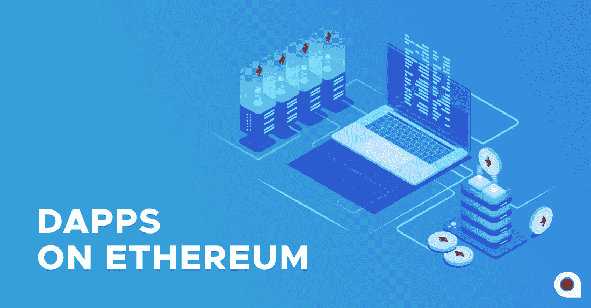

## 使用终极 dApp 样板立即创建一个以太坊 dApp

我们花了相当多的时间和精力寻找一个可靠的以太坊 dApp 样板文件,却发现根本没有。因此，我们卷起袖子，自己创造了一个。此外，根据我们让尽可能多的开发者工具免费可用的使命，我们在 GitHub 上提供了样板文件。因此，结合 Moralis，这个工具可以让你立即创建一个以太坊 dApp。事实上，Moralis 甚至提供了一个[以太坊移动样板](https://moralis.io/ethereum-mobile-boilerplate-full-guide-to-ethereum-for-mobile/)，用于 React 本地驱动的“以太坊移动”开发。

此外，为了给你提供尽可能多的指导，我们将从头到尾经历所有的步骤，并一起创建一个以太坊 dApp。我们邀请您在我们前进的过程中实施相同的步骤，以充分利用本指南。此外，由于我们将使用 Moralis，又名 [Firebase for crypto](https://moralis.io/firebase-for-crypto-the-best-blockchain-firebase-alternative/) ，以满足我们所有与区块链相关的后端需求，我们建议您[在继续之前创建您的免费 Moralis 帐户](https://admin.moralis.io/register)。

## 如何立即创建以太坊 dApp–样板文件设置

如果你想使用最好的以太坊 dApp 样板文件，你需要遵循这些简单的步骤:

1.  访问 GitHub 上的终极以太坊 dApp 样板网页:[https://GitHub . com/以太坊-样板/以太坊-样板](https://github.com/ethereum-boilerplate/ethereum-boilerplate)。

2.  使用“***git clone https://github . com/ether eum-boilerplate/ether eum-boilerplate . git***”克隆或派生“以太坊-样板”存放库。当然，您可以使用复制按钮，如下所示:

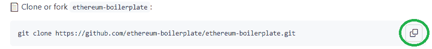

然后，移动到您的代码编辑器(我们使用 Visual Studio 代码[VSC])并将上述地址粘贴到 VSC 的终端中:

3.  接下来，您需要使用代码编辑器的终端安装所有依赖项:
    1.  ***cd 以太坊-样板***
    2.  ***纱装***

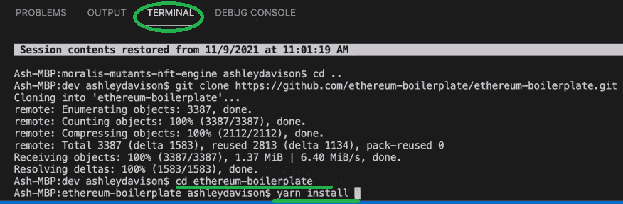

4.  将“以太坊-样板”文件夹添加到代码编辑器中:

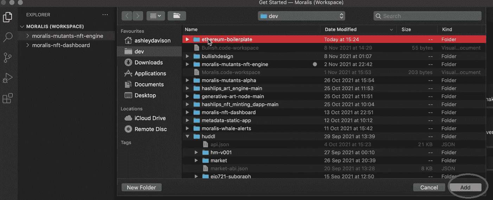

5.  将“. env.example”文件重命名为“”。env”:

6.  要访问 Moralis 的全部功能，您需要在刚刚重命名的文件中提供您的 Moralis 服务器的“appId”和“serverUrl”。env "):

为了获得这些细节，我们在下面的“Moralis 服务器设置”一节中准备了一套单独的说明。一旦您获得了 Moralis 服务器的详细信息，请将其复制并粘贴到。env "文件:

7.  最后，通过在代码编辑器的终端中键入或粘贴“ ***yarn start*** ”来运行应用程序:

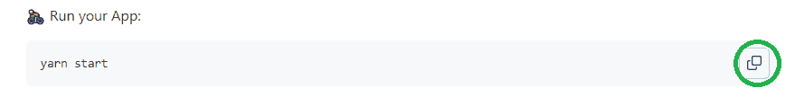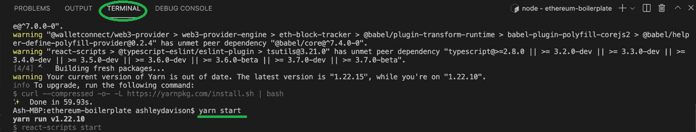

*注* *:你也可以不使用“yarn”而使用“npm 包管理器”。*

如果您已经成功完成了上述所有步骤，现在您应该有一个可用的功能性 dApp。因此，你已经意识到你可以轻松地立即创建一个以太坊 dApp。当然，你需要记住这是一个通用的 dApp。因此，最好把它当作一个极好的起点。然后通过应用一些简单的调整来制作独特的 dApps。然而，以太坊 dApp 样板已经为您提供了一系列令人印象深刻的功能。

### Moralis 服务器设置

无论您是想立即创建一个以太坊 dApp，还是使用 Moralis 的力量创建任何其他项目，您都必须完成以下步骤:

1.  **登录你的 Moralis 利斯账户**–*此时，你很可能已经准备好了你的 Moralis 利斯账户。因此，只需[登录](https://admin.moralis.io/login)进入你的管理区。然而，如果你还没有创建你的免费 Moralis 账户，请确保现在就创建。*

***创建一个新服务器**–进入 Moralis 管理区域后，点击导航选项卡左侧的“服务器”选项。然后，单击右上角的“+创建新服务器”按钮。将出现一个下拉菜单，您应该在其中选择最适合您需求的网络类型(见下图)。*使用“Testnet 服务器”选项是创建示例项目的最佳选择(* [*连接到以太网测试网*](https://moralis.io/ethereum-testnet-guide-connect-to-ethereum-testnets/) *)。**

**

*接下来，将出现一个弹出窗口，要求输入服务器名称(可以是您想要的任何名称)、地区、网络和链:*

*

通过输入这些信息并单击“Add Instance ”,您将创建您的服务器。服务器启动需要一些时间，请耐心等待。

3.  **访问服务器详细信息**–创建服务器后，您可以通过服务器名称旁边的“查看详细信息”按钮访问其详细信息:

点击“查看详情”按钮后，将出现一个包含您需要的所有信息的弹出窗口:

您可以通过单击复制图标来复制详细信息。

4.  **初始化 Moralis 规范**–剩下的就是填充你的”。env”文件，其中包含 Moralis 服务器的详细信息(应用程序 ID 和服务器 URL ),以获得 Moralis 涵盖的所需后端功能:

*注意**:Do****NOT****使用上图中的服务器细节。相反，请确保使用您的特定服务器的详细信息。*

## 立即创建以太坊 dApp 一个极好的起点

查看您使用以太坊 dApp 样板立即创建的 dApp 的一个好方法是将它视为您想要塑造的最适合您的需求和目标的一块粘土。因此，让我们仔细看看在使用 Moralis 时，您会得到哪些功能。查看下图，您会发现您的 dApp 还包含一个“快速启动”部分:

此外，它会自动连接到您的[元掩码](https://moralis.io/metamask-explained-what-is-metamask/)，这是使用 Moralis 时的另一个重要工具。如果你不熟悉这个流行的加密钱包，看看[如何用元掩码](https://moralis.io/building-dapps-with-metamask/)构建 dApps 来简化事情。

此外，您可以看到样板文件为您提供了一个包含许多功能的 dApp(请看上图中的菜单栏)。后者包括一个钱包，显示用户的余额、过去的转账、NFTs、选择多个链的选项、以美元和本地货币显示本地硬币余额，以及“认证”按钮，使您能够通过用户的加密钱包地址登录用户。此外，还有一个 DEX(去中心化交换)标签，需要安装 [1inch 插件](https://moralis.io/plugins/1inch/)(你可以在下面找到说明)。

这组功能非常广泛，涵盖了大多数 dApps 应该包含的所有方面。然而，不用花费数周或数月来构建后端以包含所有这些，您只需几分钟就可以获得开箱即用的产品。

向前看，你有两个选择:

*   为了获得最快的结果，请使用样板文件的组件。
*   另一方面，如果您想要构建自己独特的 UI，请确保更深入地探索样板文件的钩子。

### 立即创建以太坊 dApp–包括 DEX 功能

按照前两个部分中的步骤操作，上面介绍的所有组件都将自动发挥全部功能。然而，要使" **< DEX / >** 组件工作，您还需要安装从 [Moralis](https://moralis.io/plugins/) 到[程序令牌交换](https://moralis.io/how-to-program-token-swaps-with-1inch-plugin/)的 [1inch 插件](https://moralis.io/plugins/1inch/)。幸运的是，这可以通过几次点击来完成，尤其是现在您已经准备好了您的 Moralis 服务器。

首先导航到 Moralis 管理区的“服务器”选项卡。接下来，点按服务器名称旁边的三个点以查看更多选项。你会看到“插件”选项，你应该点击它。在弹出的窗口中，点击“转到插件商店！”按钮。

要最终安装 1 英寸插件，首先，点击 Moralis 1 英寸插件上的“阅读更多”按钮，选择该插件:

这将带您进入下一页，在这里您可以选择通过点击“安装插件”按钮来安装插件:

完成安装后，您应该能够看到在“插件”选项中列出的 1 英寸插件:

后者也意味着您的 dApp 现在启用了 DEX 功能。

## 应用调整

我们将根据你的想象、你的用户或客户(你将为他们构建 dApp)的需求来塑造这个“粘土块”以获得一个独特的 dApp。然而，为了让您知道如何去做，让我们使用一个现有的组件(**<【address input/>**)并以一种能让我们更接近添加“观看鲸鱼”功能的方式来使用它。

样板文件的所有组件(我们会不断添加新组件)目前都在“src”文件夹中:

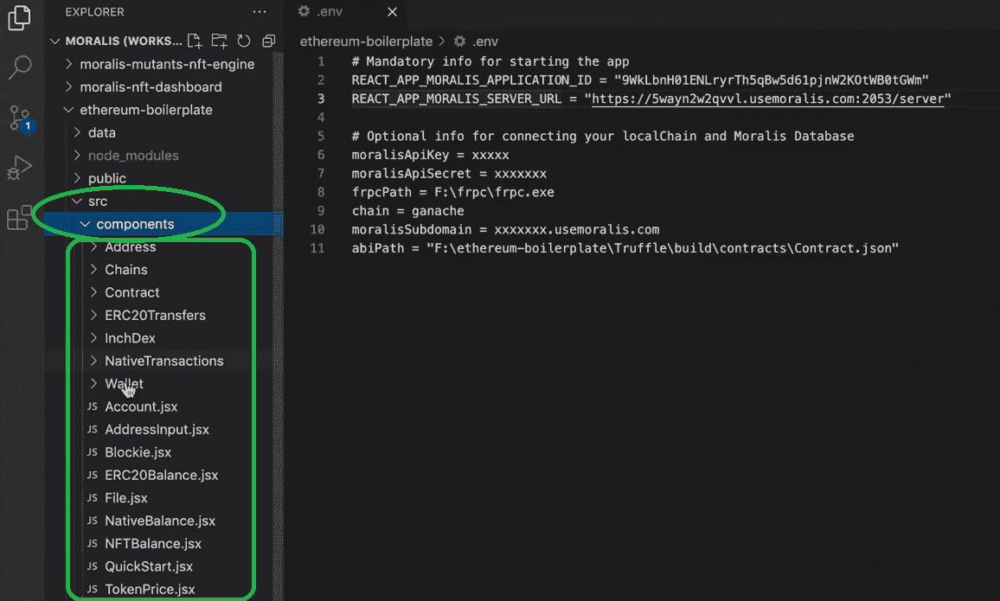

而且“App.jsx”是主要的 App 文件。在这里您可以看到菜单和所有默认组件:

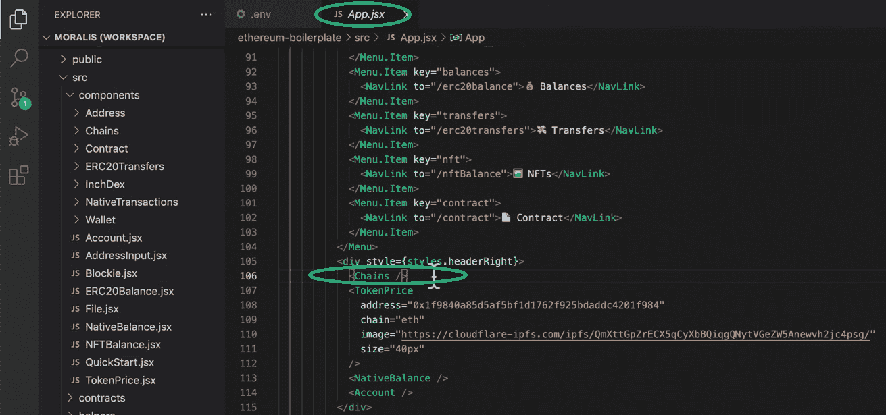

例如，你可以看到，仅仅通过使用一小段代码“**<【Chains/>**”，我们就可以在我们的 dApp 中包含一个多链选择选项，这真是令人难以置信:

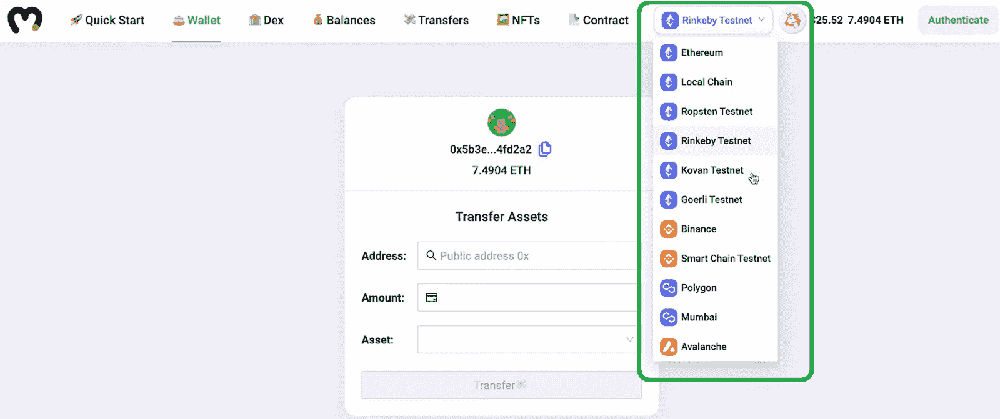

因此，如果我们从实际出发，想要将可用的组件用于观鲸选项，最合适的起点应该是“钱包”组件。因此，让我们相应地更改菜单(在“App.jsx”文件中)以适应我们的特殊调整:

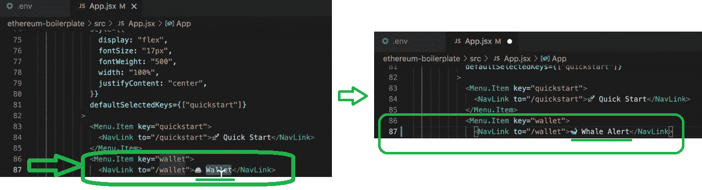

接下来，我们需要转到“Wallet.jsx”文件，并在那里进行必要的调整:

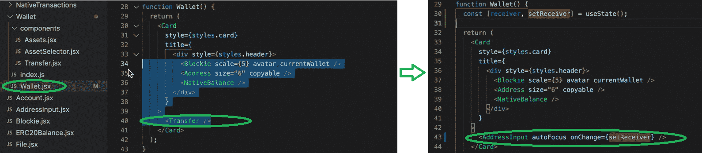

然后，这是我们得到的结果:

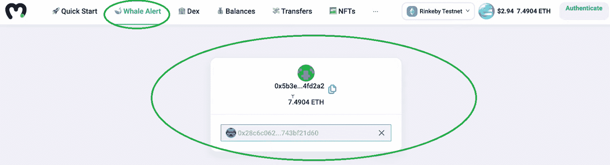

在我们之前有“钱包”选项的地方，我们现在有“[鲸鱼警报](https://www.youtube.com/watch?v=-M1GR45GykQ)选项。此外，我们现在有一个地址捕获选项，而不是钱包的功能，而不是显示连接的钱包的资产。

### 给你的 dApp 一个独特的用户界面

上面的例子应该让你知道如何调整样板文件来添加你独特的特性。此外，如果你精通 JavaScript，你可以通过使用“钩子”更上一层楼。具体来说，您可以围绕它们构建自己独特的 UI。探索各种钩子的最好方法是深入研究 [Moralis 的文档](https://docs.moralis.io/)。

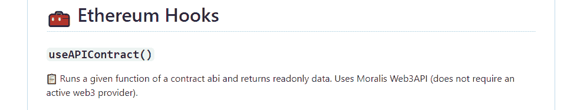

如果你更喜欢视频，我们推荐你看看下面的视频。具体来说，这表明我们的一位 Moralis 专家涵盖了之前的所有步骤:

https://www.youtube.com/watch?v=gc0kEjjWobc

## 如何立即创建以太坊 dApp–总结

如何瞬间打造一个以太坊 dApp？使用终极以太坊 dApp 样板和 Moralis 的力量。因此，你可以在几分钟之内建立并运行一个令人印象深刻的 dApp。此外，以下是您需要完成的步骤:

1.  请访问 GitHub 上的 Etherreum dApp 样板页面。
2.  使用您选择的代码编辑器克隆或派生样板文件。
3.  创建您的 Moralis 服务器，并将其详细信息复制到“env”中。文件来获得完整的后端功能。
4.  运行你的 dApp。

当然，我们建议进一步调整样板文件，从而添加更多独特的功能。此外，如果您想创建一个独特的用户界面，请确保探索样板文件的钩子。

我们鼓励你利用你目前获得的动力，参与我们在 [Moralis 的 YouTube 频道](https://www.youtube.com/c/MoralisWeb3)和 [Moralis 的博客](https://moralis.io/blog/)上报道的其他有趣的示例项目。例如，学习[如何启动 NFT 市场](https://moralis.io/how-to-launch-an-nft-marketplace/)、[创建数以千计的 NFT](https://moralis.io/how-to-generate-thousands-of-nfts/)，或者学习使用[以太坊移动样板](https://moralis.io/ethereum-mobile-boilerplate-full-guide-to-ethereum-for-mobile/)为移动用户提供最佳服务。此外，请务必通过探索 Solidity smart contracts 的[用例](https://moralis.io/use-cases-for-solidity-smart-contracts/)，查看 [ultimate WalletConnect 指南](https://moralis.io/what-is-walletconnect-the-ultimate-walletconnect-guide/)，并探索“[什么是 OpenZeppelin？以及它如何显著加快您的编程过程。](https://moralis.io/what-is-openzeppelin-the-ultimate-guide/)

如果你还不知道 JavaScript，我们建议你报名参加 [2021 区块链开发者 JavaScript 编程](https://academy.moralis.io/courses/javascript-programming-for-blockchain-developers)课程。此外，如果你真的想让[成为一名区块链开发者](https://moralis.io/how-to-become-a-blockchain-developer/)并成为全职加密员，一定要去看看[Moralis 学院](https://academy.moralis.io/)其他令人难以置信的课程。

***