# 如何创建一个以太坊 NFT-完整指南

> 原文：<https://moralis.io/how-to-create-an-ethereum-nft-full-guide/>

随着不可替代令牌的使用案例在元宇宙和现实世界中不断增长，各行各业的人都想涉足这一领域。此外，由于媒体更喜欢聚焦巨额****售价，许多人希望购买一辆 NFT，然后卖掉获利。然而，真正最有影响力的收益来自那些知道如何创造 NFT 的人。此外，由于以太坊仍然是领导者，学习如何创建以太坊 NFT 是有意义的。所以，无论你是一个有经验的开发者还是刚刚开始** [**NFT 编程**](https://moralis.io/nft-programming-for-beginners/) **，这篇文章将通过学习如何创建一个以太坊 NFT 来演示你如何能够** [**在 2022 年进入 web 3**](https://moralis.io/how-to-get-into-web3-in-2022/)**的正确方法！****

**在这里，你会发现一切你需要知道加入 NFT 时代。利用本文中获得的知识和技能，您将能够[创建自己的 NFT](https://moralis.io/how-to-create-your-own-nft-in-5-steps/) 或向您的客户提供这项服务。我们将首先介绍一些基础知识，帮助大家快速掌握。然后，我们将向您展示如何使用集中的 [NFT 市场](https://moralis.io/how-to-launch-an-nft-marketplace/)创建 NFT。最后，我们将指导您创建自己的分散式 NFT 明廷 dapp ( [分散式应用](https://moralis.io/decentralized-applications-explained-what-are-dapps/))。使用后者，你将能够轻松地创建一个以太坊 NFT。然而，创建这个 dapp 的基本工具是[Moralis](https://moralis.io/)——终极 [Web3](https://moralis.io/the-ultimate-guide-to-web3-what-is-web3/) 开发平台。因此，[现在就创建你的免费 Moralis 账户](https://admin.moralis.io/register)。通过这样做，你将能够按照我们的指示完成你自己的 [NFT 铸造页面](https://moralis.io/how-to-launch-an-nft-minting-page-full-walkthrough/)。**

**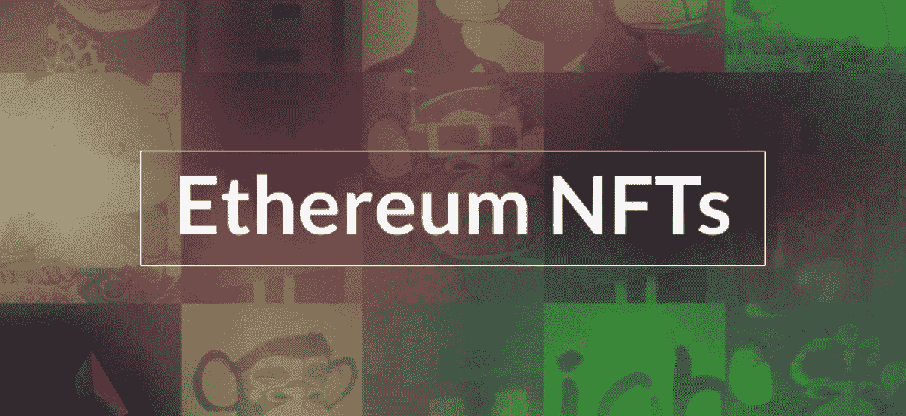

## 以太坊 NFTs–基础

如果你熟悉基础知识，并渴望创建一个以太坊 NFT，请随意跳过这一部分。虽然，快速复习从来没有伤害任何人。那么，让我们开始研究以太坊 NFT 是什么。正如“以太坊”和“NFT”的组合词所暗示的，以太坊 NFT 是[以太坊](https://moralis.io/full-guide-what-is-ethereum/)链上不可替换的令牌。后者是最受欢迎的可编程区块链，是 2015 年推出的首款此类产品。现在，有许多其他著名的可编程链，其中许多是与 [EVM](https://moralis.io/evm-explained-what-is-ethereum-virtual-machine/) 兼容的。然而，尽管有时煤气费过高，以太坊仍然是最受 NFTs 欢迎的网络。

此外，通过遵循本指南并学习如何创建一个 NFT 以太博物馆，您也可以很容易地将这些知识应用于其他链上的薄荷 NFT。这之所以成为可能，是因为 Moralis 已经将跨链互操作性集成到了它的基础中。因此，您可以使用它的后端基础设施，用相同的代码到达所有支持的区块链。

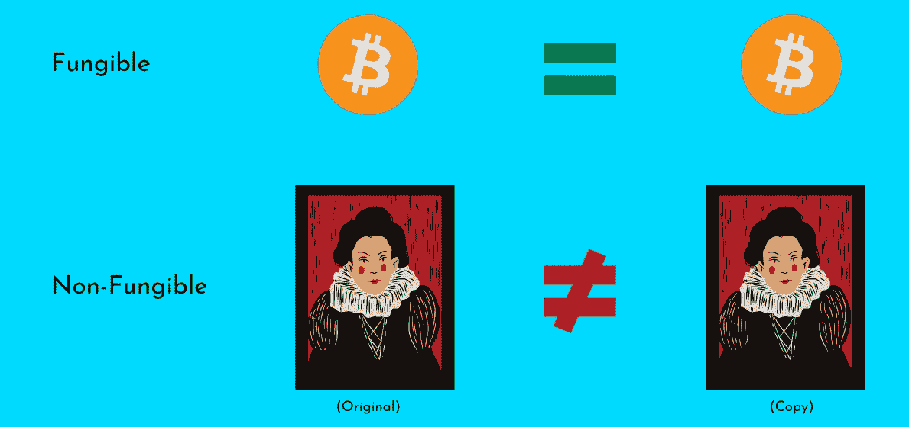

现在你至少对以太坊有了一个基本的概念，让我们也确保你知道什么是 NFT。顾名思义，不可替换令牌(与可替换令牌不同)具有独特的属性。这意味着每个 NFT 都不同于其他 NFT。此外，即使两个或更多的 NFT 表示相同的数字文件，它们也具有唯一的链上数据。因此，NFT 非常适合数字艺术、数字收藏品以及数字和现实生活资产的所有权表示。

### 创建与新建 NFT

因为我们将在下面向你展示如何创建一个以太坊 NFT，我们也想弄清楚“创建”的部分。您可能知道，非文件格式由数字文件组成(例如，PNG、JPG、MP3、PDF、MP4 等。)和元数据。然而，当谈到创建 NFT 时，可能会有很多困惑。创建图像、歌曲、视频或其他数字文档被认为是“创建”NFTs 的艺术部分。然而，从区块链发展的角度来看，NFT 的创造就是“铸造”。铸造指的是执行链上事务，获取数字文件和元数据，并将其转换为 NFT。

所以，作为一个区块链开发者，你应该关注 NFT 创造的铸造部分。幸运的是，你可以在一系列外包平台上轻松外包艺术部分。另一方面，你也可以联系已经有追随者的艺术家，并与他们合作。因此，他们提供数字文件，你创建，或者我们应该说，铸造成非功能性文件。

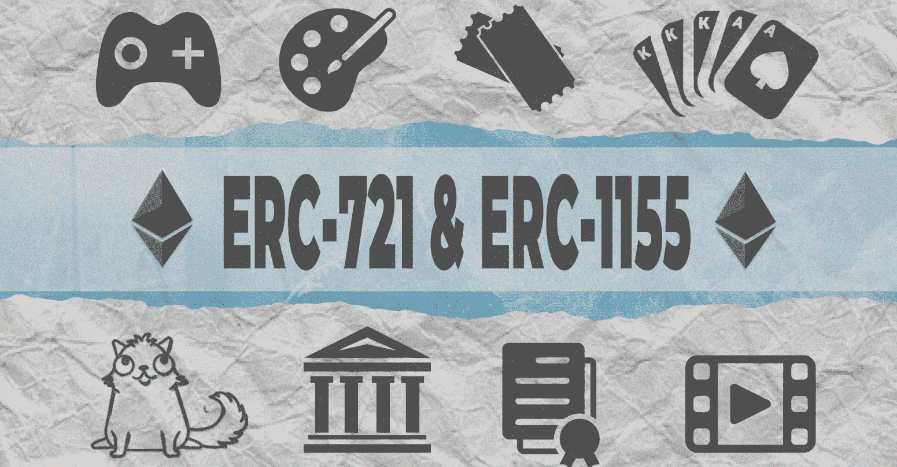

### 使用正确的标准创建以太坊 NFT

让我们通过触及令牌标准的基础来结束这个快速的“以太坊 NFT 基础”讲座。如你所知，区块链是关于透明和不变性的。因此，必须制定适当的规则和准则。此外，它们通常以标准的形式出现。对于可替换的以太币，我们有 [ERC-20](https://moralis.io/erc20-exploring-the-erc-20-token-standard/) 标准。另一方面，我们有 [ERC-721](https://moralis.io/erc-721-token-standard-how-to-transfer-erc721-tokens/) 和 [ERC-1155](https://moralis.io/erc1155-exploring-the-erc-1155-token-standard/) 以太坊 NFT 标准。*我们建议使用上一句中的链接来了解关于这两种令牌标准的更多信息。*此外，在创建单个 NFT(如数字艺术表现)时，您需要关注 ERC-721 智能合约。随意使用我们的教程[如何创建一个 ERC-721 NFT](https://moralis.io/how-to-create-an-erc-721-nft/) 。然而，当需要你[生成数千个 NFT](https://moralis.io/how-to-generate-thousands-of-nfts/)([批量铸造](https://moralis.io/how-to-bulk-mint-nfts-batch-minting-guide/))的收藏品有问题时，ERC-1155 应该是你的重点。

## 以集中与分散的方式创建以太坊 NFT

在这一节中，我们将向您展示如何以集中的方式和分散的方式创建以太坊 NFT。我们将从前者开始。你可能已经知道，这些天来，已经有许多 NFT 市场供你支配。当然，不是所有的都同样受欢迎，也不是同样集中。因此，我们让您探索可用的选项，并决定哪一个是您最喜欢的。然而，在本文中，我们将关注最受欢迎的 NFT 市场——OpenSea。

### 如何用 OpenSea 创建以太坊 NFT

如果你不关心集权或分权的程度，并且想快速创建以太坊 NFT，那么使用 OpenSea 可能是你最好的选择。因此，请确保您已经准备好了您的[元掩码](https://moralis.io/metamask-explained-what-is-metamask/)浏览器扩展。然后，上 OpenSea 官网。在那里，您将立即看到“创建”按钮:

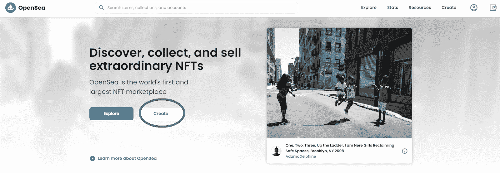

点击上面的按钮后，会要求你连接你的 [Web3 钱包](https://moralis.io/what-is-a-web3-wallet-web3-wallets-explained/)。虽然您有几种不同的选择，但我们建议您按照前面的说明使用元掩码:

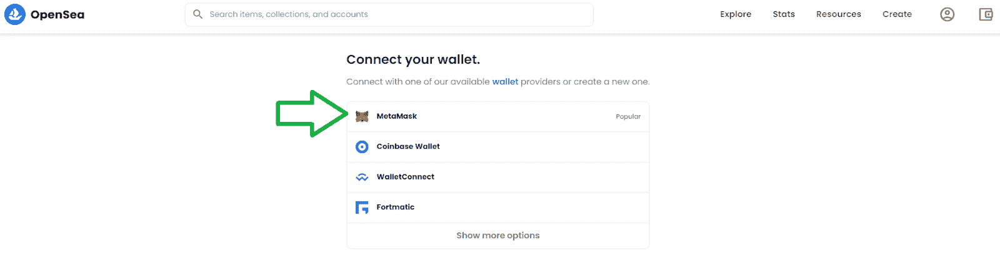

单击“元掩码”后，元掩码扩展将提示您签署签名请求:

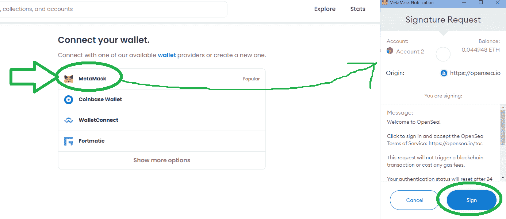

点击如上所示的“签名”按钮后，你将进入一个页面，在这里你可以创建一个以太坊 NFT。请注意，有一些可选字段和一些必填字段。此外，您需要上传想要转换为 NFT 的数字文件。你还需要给你的 NFT 一个名字:

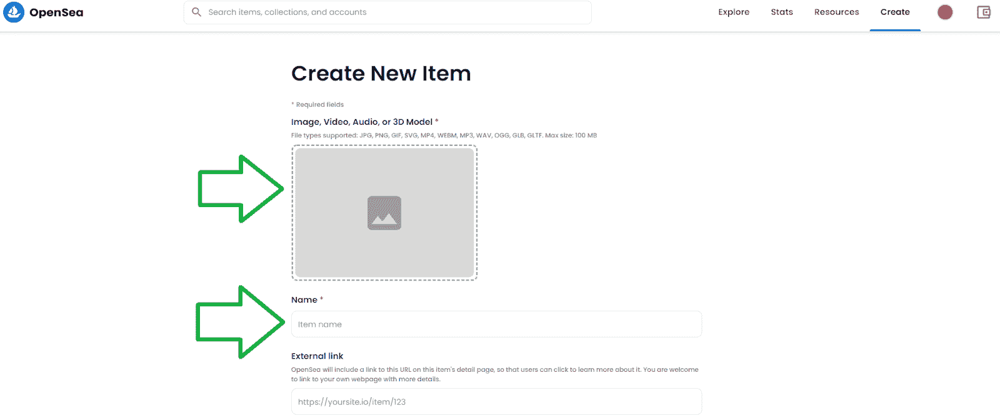

您可以包括外部链接和描述。此外，您可以选择是否要将您的 NFT 添加到特定收藏中。此外，您可以选择向 NFT 添加文本和数字特征。你可以通过添加属性、等级和统计来实现。但是，在您点击页面底部的“创建”按钮之前，请确保您已经正确输入了所有内容。此外，我们建议您查看当前以太坊燃气费用。这样，你就可以通过推迟执行死刑来避免支付一大笔铸造 NFT 的钱。

尽管如此，还要注意的是，OpenSea 已经开始实施[NFT 的铸造和交易，不收取天然气费](https://moralis.io/how-opensea-trades-nfts-without-gas-fees/)。当然，这也是你可以在自己的铸造 dapps 中加入的东西。

## 如何用 Moralis 创造一个以太坊 NFT

在我们在下面的视频教程中把你交给 Moralis 的专家之前，我们想向你展示我们完成的例子 dapp。它遵循与 OpenSea 应用程序相对相似的步骤；然而，它是用 Moralis 家的 [IPFS 的](https://moralis.io/what-is-ipfs-interplanetary-file-system/)整合的。因此，这种分散式存储解决方案确保我们忠实于区块链技术的核心愿景。当用户首次登陆我们的示例 dapp 时，他们需要使用 MetaMask 钱包进行[认证:](https://moralis.io/how-to-authenticate-with-metamask/)

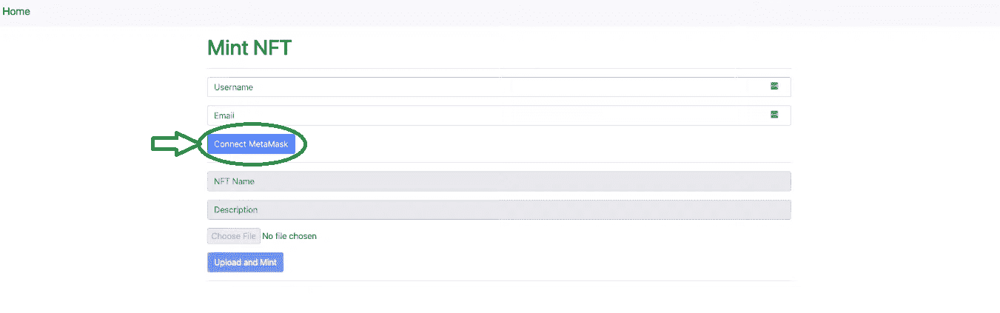

一旦用户输入用户名和电子邮件地址，他们就可以使用 MetaMask 进行连接。然后，他们准备创建一个以太坊 NFT。因此，他们可以输入他们的 NFT 的名称和描述。此外，他们需要使用“选择文件”按钮选择一个文件。最后，他们可以通过点击“上传并创建”按钮来上传并创建他们的文件:

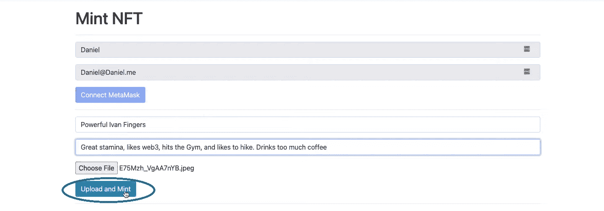

当然，用户必须通过点击元掩码中的“确认”按钮来确认铸造交易:

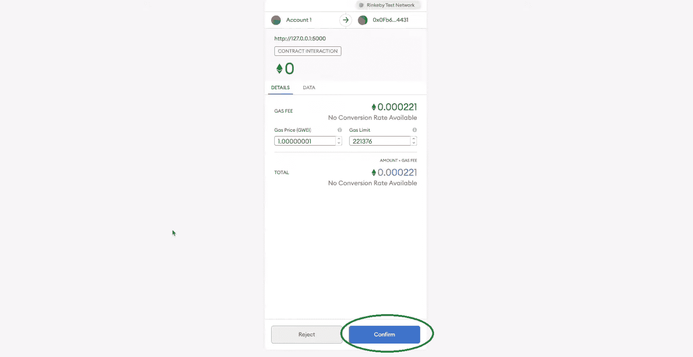

确认上述交易后，dapp 会显示一条包含交易哈希的消息:

现在你知道我们的例子 NFT·明廷·戴普长什么样了。这意味着是时候仔细看看如何自己创造它了。

### 创建一个以太坊 NFT 铸造 Dapp 代码演练

如前所述，是时候让我们把你交给一位 Moralis 专家的得力助手了(下面的视频从 3:41 开始)。他将向你展示如何创建上述 minter dapp。您将首先创建一个 [Python](https://moralis.io/python-explained-what-is-python/) flask 应用程序，它将触发相关的代码。而且，代码的核心部分在“[index.html](https://github.com/DanielMoralisSamples/19_MINTNFT/blob/master/app/templates/index.html)”和“ [logic.js](https://github.com/DanielMoralisSamples/19_MINTNFT/blob/master/app/static/js/logic.js) ”文件中，这两个文件都可以在 [GitHub](https://github.com/DanielMoralisSamples/19_MINTNFT) 上找到。

我们 dapp 的外观和结构在“[index.html](https://github.com/DanielMoralisSamples/19_MINTNFT/blob/master/app/templates/index.html)”和“ [base_template.html](https://github.com/DanielMoralisSamples/19_MINTNFT/blob/master/app/templates/templates/base_template.html) ”文件中有所涉及(后者说明我们使用的是 Bootstrap)。因此，它可以作为一个基本的 [Web3 UI](https://moralis.io/web3-ui-how-to-create-a-great-dapp-ui/) 。然而，就我们 dapp 的功能而言，“logic.js”可以完成任务。此外，这也是我们插入 Moralis 服务器的详细信息以激活 [Moralis 的 SDK](https://moralis.io/exploring-moralis-sdk-the-ultimate-web3-sdk/) 并访问其[终极 NFT API](https://moralis.io/ultimate-nft-api-exploring-moralis-nft-api/) 的地方。至此，我们可以简单地从 [Moralis 的文档](https://docs.moralis.io/)中复制简短的代码片段。因此，我们轻松地包含了所有的后端功能。这也是我们如何能够只用 71 行代码就涵盖我们的 dapp 的逻辑。

尽管如此，您需要记住，铸造是通过与[智能合约](https://moralis.io/smart-contracts-explained-what-are-smart-contracts/)的交互来完成的。然而，下面的视频(10:17)将向您展示一条避免处理智能合约的捷径。虽然用的是 [OpenZeppelin](https://moralis.io/what-is-openzeppelin-the-ultimate-guide/) 和 [Remix](https://moralis.io/remix-explained-what-is-remix/) ，但是不需要深刻理解[扎实度](https://moralis.io/solidity-explained-what-is-solidity/)也可以准备好自己的智能合约。

最后，这是我们上面提到的视频教程:

https://www.youtube.com/watch?v=WdQHnb_5m5Q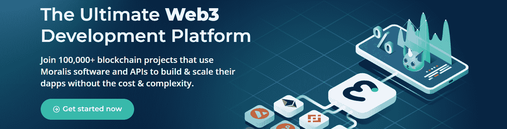

#### 初始 Moralis 设置

如上所述，你需要你的 Moralis 服务器的详细信息来创建一个以太坊 NFT 铸造与 Moralis dapp。因此，您需要完成初始的 Moralis 设置。这意味着你需要创建一个免费的 Moralis 账户或者[登录](https://admin.moralis.io/login)现有的账户。然后，您可以[创建一个 Moralis 服务器](https://docs.moralis.io/moralis-server/getting-started/create-a-moralis-server)，复制它的细节，并粘贴到您的“logic.js”文件中。

## 如何创建以太坊 NFT——总结

至此，你知道如何创建一个以太坊 NFT 了。此外，您知道如何以集中或分散的方式实现这一点。此外，你知道使用信誉良好的 NFT 市场是最快的方式，但也有其缺点。另一方面，创造你自己的铸造 dapp，毫无疑问，更有力量。这是一项有价值的技能，因为非功能性测试正在成为主流。因此，我们鼓励您使用所有可用的资源来升级您的 [NFT 代币开发](https://moralis.io/nft-token-development-the-ultimate-guide/)技能。

开始的好地方是 YouTube 上的 Moralis 伦理频道和 T2 的 Moralis 伦理博客。在这两个网站上，你可以找到大量的 NFT 教程。此外，他们将向你展示[如何铸造游戏中的 NFT 角色](https://moralis.io/nft-game-characters-how-to-mint-in-game-nft-characters/)，如何[推出一个白色标签的 NFT 市场](https://moralis.io/how-to-launch-a-white-label-nft-marketplace/)，[如何开发一个 NFT 稀有度排名 dapp](https://moralis.io/how-to-develop-an-nft-rarity-ranking-dapp/) ，[如何懒惰铸造 NFT](https://moralis.io/how-to-lazy-mint-nfts/)等等。当然，这两个场馆也覆盖了区块链的其他开发区。一些最新的话题包括[气体优化的顶级技巧](https://moralis.io/gas-optimizations-in-solidity-top-tips/)，如何[构建 2D Web3 游戏](https://moralis.io/how-to-build-a-2d-web3-game-full-guide%ef%bf%bc/)，如何[创建 GameFi 游戏](https://moralis.io/gamefi-tutorial-how-to-create-a-gamefi-game/)， [Web3 Firebase 认证](https://moralis.io/web3-firebase-authentication-create-a-web3-sign-in-with-moralis/)，以及如何创建 [Web3 音乐平台](https://moralis.io/web3-music-platform-create-a-web3-music-streaming-service/)。因此，这两个出口是继续免费区块链教育的完美选择。

但是，如果你决心以更专业的方式进入 Web3，可以考虑报读 [Moralis Academy](https://academy.moralis.io/) 。一旦注册，你将获得高质量的[区块链发展课程](https://academy.moralis.io/all-courses)，一个令人惊叹的社区和专家指导。因此，你马上就会拥有[成为 Web3 开发者](https://moralis.io/how-to-become-a-web3-developer-full-guide/)所需的一切。

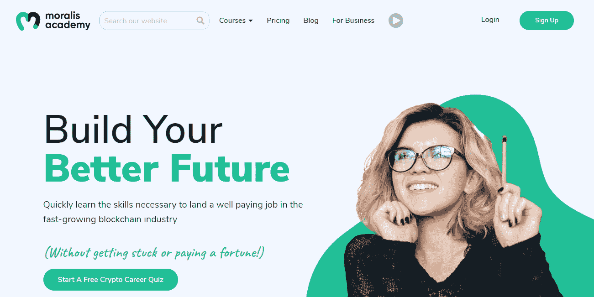**