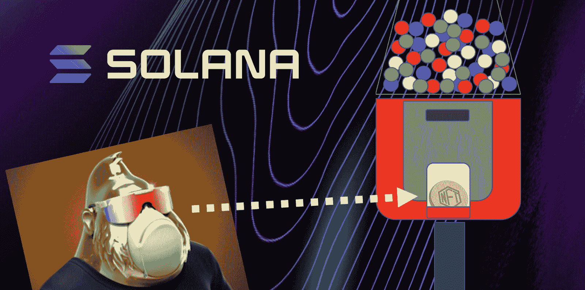
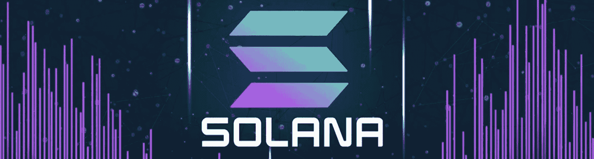
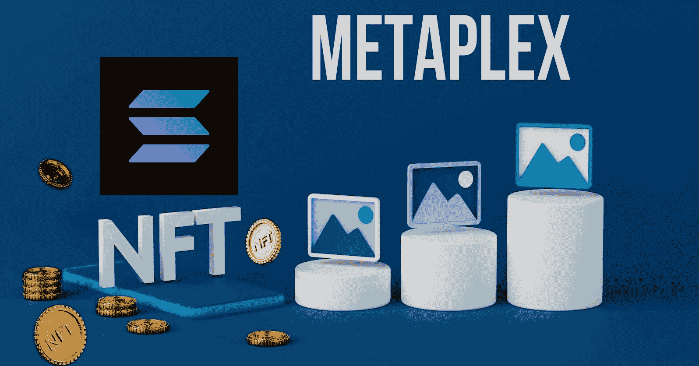
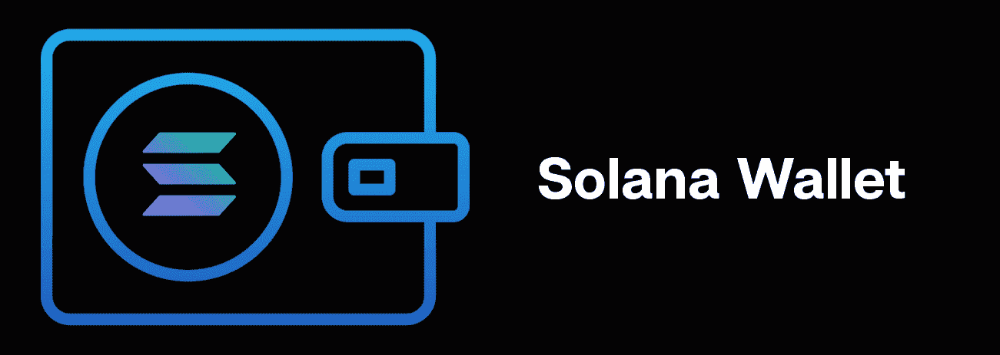
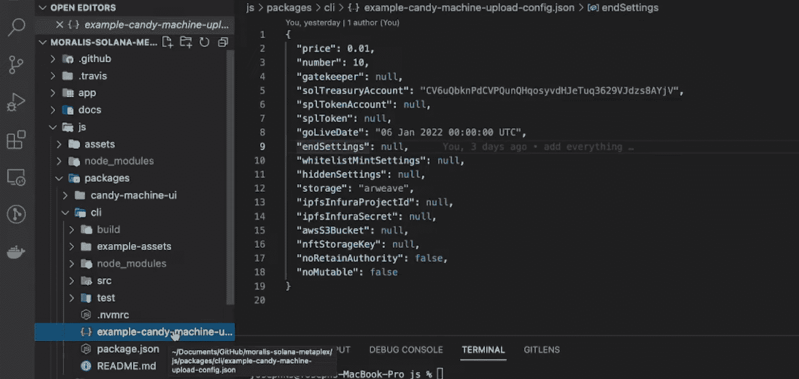
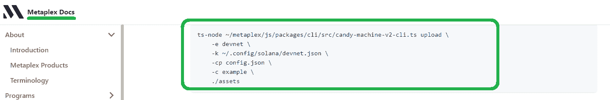
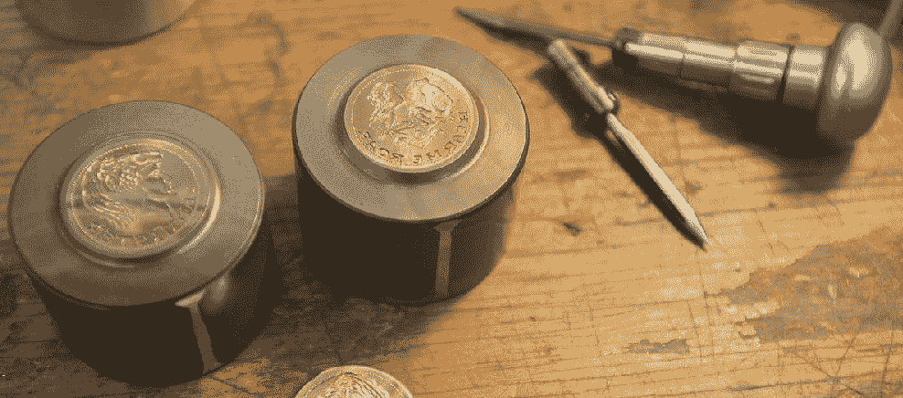

# 如何创建一个 NFT 糖果机

> 原文：<https://moralis.io/how-to-create-an-nft-candy-machine/>

随着 NFTs 改变游戏行业，如何利用认证等。，不可替代的令牌是迄今为止最有影响力的区块链用例。因此，区块链领域的先驱们已经开发并推出了使用户能够轻松制造 NFT 的产品。这些产品之一是 Metaplex 的 NFT 糖果机。这款 NFT 糖果机允许用户在索拉纳区块链上轻松制作 NFT 并建立数字艺术收藏。然而，虽然 Candy Machine v1 有一些漏洞，Candy Machine v2 解决了其中的许多问题。现在，如果你想做一个 v2 NFT 糖果机，你来对地方了！

我们将首先介绍一些基础知识，以便大家在前进的过程中快速掌握。然后，我们将进行一个示例项目，我们将使用 Metaplex 的 NFT 糖果机来制作一个简单的 NFT 系列。因此，我们将带您经历以下几个阶段:

1.  完成糖果机 v2 的初始设置。
2.  演示如何在本地计算机上创建一个 Solana 钱包。
3.  向您介绍糖果机 v2 配置。
4.  向您展示如何准备资产(图像和元数据)。
5.  创建 Metaplex 的 NFT 糖果机实例，并将资产上传到 Arweave。
6.  我们将利用我们的 NFT 糖果机创建一个 NFT 收集的例子。
7.  我们将向您展示如何验证资产是否被正确上传。
8.  最后，我们将铸造我们的索拉纳 NFT 代币。

## 使用 NFT 糖果机的先决条件

使用 NFT 糖果机之前了解基本知识是非常重要的。这包括了解什么是 Solana NFTs，什么是 Metaplex。让我们首先指出，索拉纳是一个受欢迎的可编程区块链。它是“以太坊杀手”之一，正如许多人喜欢称呼其他可编程链一样。此外，索拉纳不是 EVM 兼容的；因此，它依靠自己的工具，从 Web3 钱包开始。此外，这种可编程链有自己的智能合约，称为“链上程序”。

这些程序确保事情顺利运行，例如根据预定义的规则执行自动操作。此外，这些程序也是我们用来在索拉纳上制造 NFT 的。此外，还值得指出的是，索拉纳有其令牌标准(SPL 标准)。后者包括可替换和不可替换的令牌。 [救救我们*什么是索拉纳？*](https://moralis.io/what-is-solana-the-full-2022-guide/) *、* [*SPL vs ERC20 代币*](https://moralis.io/spl-vs-erc20-tokens-comparing-solana-and-ethereum-tokens/) *”的文章，以备后读！*

还值得一提的是，不可替换令牌(NFT)是特殊类型的加密资产。NFT 具有一系列独特的属性，使其适合于数字收藏品和数字艺术表现。此外， [NFT 公用事业](https://moralis.io/nft-utility-exploring-nft-use-cases-in-2022/)在数字和现实世界中提供了无数的机会。

另一方面，Metaplex 是一个受欢迎的 NFT 市场、游戏、艺术和收藏品生态系统。Metaplex 协议一直在提供支持 NFT 开发的标准和工具。在其他解决方案中，Metaplex 使开发人员能够以分散的方式创建 NFT。本质上，Metaplex 是智能契约和工具的组合，这使得创建和启动 NFTs 更加简单。后者目前有两种形式:Metaplex 店面和 NFT 糖果机。后者是一个 NFT 造币工具，我们将在这里使用它来铸造茄碱 NFT。

## 用 Metaplex 创建一个 NFT 糖果机

现在您已经了解了基础知识，可以开始关注本文的示例项目了。正如引言中提到的，我们分八个阶段来解决这个问题。因此，即使你是密码领域的新手，你也很容易理解。

在第一阶段，我们将向您展示如何完成 NFT 糖果机 v2 的初始设置。为了进一步简化您的工作，我们还在 [GitHub](https://github.com/YosephKS/moralis-solana-metaplex) 上发布了我们的代码。在下一阶段，您将看到如何设置本地 Solana 钱包。然后，我们再仔细看看糖果机 v2 的配置。第五阶段是准备资产，并将这些资产上传到 Arweave。接下来，您将了解如何创建糖果机集合。您还将学习如何验证上传。最后但同样重要的是，我们将向您展示如何使用 NFT 糖果机薄荷索拉纳 NFTs。

*注* *:为了帮助我们更详细地了解所有阶段，我们还会参考一个视频教程，你可以在本文末尾找到它。*

### V2 NFT 糖果机的初始设置

以下是使用 NFT 糖果机 v2 所需的工具:

*   饭桶
*   节点. js
*   纱线(包装经理)
*   Ts 节点

您需要 Git 来克隆存储库，需要 Node.js 作为 JavaScript 运行时，需要 Yarn 来安装所需的依赖项，需要 TypeScript node (ts-node)作为执行环境。

*注* *:如果使用的是苹果 M1 芯片，安装额外的依赖项(“brew Install pkg-config cairo pango libpng JPEG gif lib librsvg”)。*

一旦您准备好了上述工具，就可以继续克隆和安装 Metaplex 了。您可以使用 Metaplex 文档提供的 URL 但是，我们建议您使用我们的代码。后者在某种程度上进行了修改，以帮助您理解本教程。它还包括来自 Moralis 的特定代码，这将使您能够将事情带到下一个级别。因此，点击上面的“GitHub”链接，克隆我们的代码:

### 你当地的索拉纳钱包

在上面的“使用 NFT 糖果机的先决条件”一节中，你了解到 NFT 糖果机在索拉纳区块链上运行。这意味着你需要一个 SOL 钱包，里面有足够的 SOL(sola 上的本地加密货币)来支付交易费用。毕竟，如您所知，要部署链上程序，您需要执行链上事务。幸运的是，您可以使用 Solana 收费套件功能轻松创建本地钱包。

*注意* *:记住本地钱包不太安全这一点很重要。因此，只将它们用于发展目的，而不是储存更多的资金。*

创建本地 Solana 钱包需要完成以下步骤:

1.  在终端上输入“*Solana–version*”命令。
2.  使用您的终端并输入“*索拉纳地址*”命令。
3.  最后，输入“*索拉纳平衡*命令。

注意 *:如果你还没有你的 Solana 地址，你可以设置你的新 devnet 钱包。在这种情况下，请使用 Metaplex 文档作为指南。*

如上所述，你的 SOL 钱包里也必须有足够的 SOL。因为我们关注的是 Solana devnet，所以你可以免费获得 SOL。因此，只需输入“ *solana airdrop 2* ”命令。后者将确保你的钱包里有两个 SOL 代币。

注: *一旦你决定把你的 NFT 糖果机带到索拉纳主网，你将需要真正的索尔。因此，你需要使用一个有信誉的交易所来购买它，然后把它转移到你的钱包里。*

### 配置你的 NFT 糖果机 V2

首先，在您喜欢的代码编辑器中打开上面克隆的项目。由于我们使用的是 Visual Studio 代码(VSC ),如果您使用相同的 IDE，跟随我们可能是最容易的。您可以在"*example-candy-machine-upload-config . JSON*"文件中找到配置:

正如简介中提到的，上面的截图表明我们将使用 Arweave 来存储我们的资产。但是，这一选择并不是一成不变的。相应地，你可以探索其他有信誉的替代品(下面的视频从 4:39 开始)。

### 准备资产–图像和元数据

我们在上面介绍了 NFTs 的基础知识；但是，我们并没有指出，NFT 不可能凭空产生。相反，您需要一个文件(例如，一个图像)和元数据。前者代表 NFTs 的有形部分，而后者提供铸造时也使用的细节。此外，最常见的文件类型是图像(例如，png)。另一方面，元数据以 JSON 文件的形式出现。但是，由于准备资产不是本教程的核心，我们鼓励您在练习中使用我们的示例资产:

上图显示了“*示例-资产*”文件夹中的十对文件。因此，我们可以铸造十个索拉纳 NFT 代币。此外，您可以在图片的右侧看到我们的一个 JSON 文件的细节。*使用下面的视频，从 7:52 开始，获得更详细的指导。这样，您还将学习如何处理可选但推荐的资产验证。*

### 创建您的 NFT 糖果机并上传您的资产

使用下面的视频，从 12:27 开始，详细指导如何执行“上传”命令。后者会将你的资产上传到 Arweave(或者你选择的其他云服务)。实际上，您只需要复制 Metaplex 文档提供的命令，并编辑路径以匹配该项目:

上面的命令行表明您将在 Solana devnet 上部署您的 NFT 糖果机。因此，在应用所有必要的调整后，点击“回车”。这样，您的代码将上传所有资产，并创建 NFT 糖果机程序的实例。

### 糖果机和 NFT 收藏

随着您的资产上传和 NFT 糖果机程序的创建，您可以创建您的 NFT 收集。具体可以参考下面的视频，从 15:35 开始。但是，基本上，您只需要从 Metaplex 文档中复制命令行。当然，您还需要实现必要的调整来匹配您的项目:

运行上述命令后，您将为您的资产准备一个集合。然后，您可以在创建过程中将这个集合设置为 NFTs 细节的一部分。

#### 验证资产上传

验证资产上传是另一个可选但推荐的步骤。这是确保您的所有资产正确上传的一种方式:

*使用下面的视频(17:23)或访问 Metaplex 文档，了解有关“验证资产上传”步骤的详细说明。*

## 铸造茄果类

通过完成前面的所有阶段，你最终可以铸造索拉纳 NFTs (18:18)。就像上述所有步骤一样，Metaplex 使铸造变得非常简单。因此，您将再次从 Metaplex 文档中复制正确的命令。但是，在运行该命令之前，您需要进行必要的调整以匹配您的文件路径。尽管如此，值得指出的是，您有两种采矿选择。一方面，你可以单独铸造索拉纳 NFT。另一方面，您可以进行批处理或批量铸造，这使您能够在一个事务中铸造多个 NFT。

铸造过程把你的资产转化成非功能性资产。因此，您现在可以使用 Solana explorer 来查看这些 NFT 的详细信息。不要忘记切换到 devnet:

### 超越 NFT 糖果机——创建 NFT 仪表板

现在你知道如何创建一个 NFT 糖果机，你可能有兴趣把事情带到下一个层次。因此，我们想向您展示如何创建一个 NFT 仪表板。幸运的是，另一个强大的 Web3 工具使这变得简单多了。通过使用最好的 Web3 后端平台 Moralis，您可以专注于前端。以下是索拉纳·NFT 投资组合跟踪 dapp 的一个例子:

它使您能够[使用幻影钱包](https://moralis.io/how-to-authenticate-solana-users-with-the-phantom-wallet/)验证 Solana 用户，并整齐地显示 NFTs:

要了解如何使用 Moralis 的 SDK 与终极[索拉纳 NFT API](https://moralis.io/solana-nft-api-exploring-the-ultimate-nft-api-for-solana/) 一起工作，并轻松获取用户的 NFT，请使用下面的视频(24:50)。您将首先学习如何覆盖初始的 Moralis 设置，这是您的 dapp 开发的起点。

https://www.youtube.com/watch?v=BPQXek6lMUE

## 如何制作 NFT 糖果机——总结

我们在文章中谈了相当多的内容。首先，我们学习了基础知识，您了解了什么是 Solana NFTs，什么是 Metaplex，包括 Metaplex 通过其 NFT 糖果机简化了 NFT 的铸造。接下来，你有机会跟随我们的领导，完成所有八个阶段，最终铸造你的 Solana NFTs。在此过程中，您完成了最初的 NFT 糖果机设置，并了解了更多关于构成 NFT 的资产。最后，如果你按照我们的说明，你现在知道如何使用糖果机 v2 来单独和批量制造茄尼茶。尽管如此，您还有机会使用 Moralis 创建一个 NFT 仪表板。

为了提高你的信心和技能，我们鼓励你访问[Moralis 博客](https://moralis.io/blog/)和[Moralis YouTube 频道](https://www.youtube.com/c/MoralisWeb3)。在这些网站上，你可以学到很多关于 Solana 编程的知识，以及 Moralis 如何帮助你更快地提高编程技能。然而，索拉纳开发只是这两个渠道覆盖的一小部分。毕竟，Moralis 是关于跨链互操作性的。因此，通过完成我们的教程，你可以免费学习成为一名 Web3 开发者。然而，你可能有兴趣成为区块链认证。在这种情况下，[Moralis 学院](https://academy.moralis.io/)就是你要去的地方。