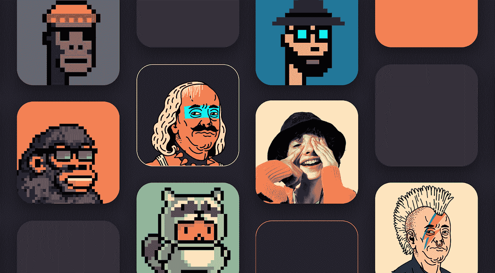
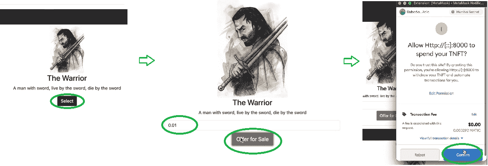
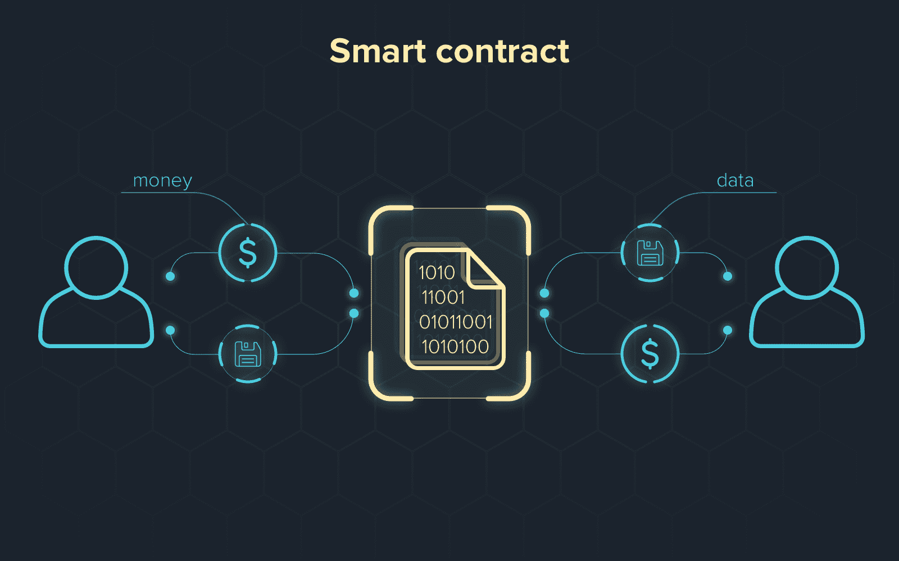

# 如何创建 NFT 市场

> 原文：<https://moralis.io/how-to-create-an-nft-marketplace/>

通过 NFT(不可替代的代币)市场，创作者可以向大众展示他们的 NFT 艺术。此外，通过向市场列出 NFT，代币获得大量曝光，因为 NFT 的市场由于 NFT 的流行度增加而驱动大量流量。因此，NFT 的创造者不需要太担心拍卖和出售他们的 NFT 代币。然而，对 NFTs 感兴趣的不仅仅是密码爱好者，还有大公司。正因如此，现在正是开始学习 [**NFT 令牌开发**](https://moralis.io/nft-token-development-the-ultimate-guide/) **的绝佳时机。具体来说，知道如何创建一个 NFT 市场是一项非常受欢迎的技能，每个程序员都应该知道如何做。因此，我们将在本文中探索如何使用 Moralis 及其终极** [**Web3**](https://moralis.io/the-ultimate-guide-to-web3-what-is-web3/) **开发平台创建 NFT 市场的开发过程。**

由于我们在 NFT 及其用例方面仍处于早期阶段，谁知道呢，任何渴望成为区块链开发者的开发者都有可能成为下一个被大众接受的大 NFT 市场的创造者。当然，总会有主要的 NFT 市场，但每个 NFT 的发布或系列都有自己的 NFT 市场是有意义的。此外，你可能会得到下一个机会，为一家大型区块链公司开发一个致力于 NFTs 的市场。因此，能够创建一个 NFT 市场是一项可以让你的职业生涯经得起未来考验的技能，在[Moralis 家](https://moralis.io/)的帮助下，这是一项你可以轻松掌握的技能。


## 什么是 NFT 市场？

在我们接手一个将教你如何以最少的努力和创纪录的时间创建一个 NFT 市场的例子项目之前，我们需要确保你知道所有的基本知识。NFT 市场本质上是任何一个围绕买卖任何一种不可替代的令牌(NFT)的 Web3 应用程序。因此，可以有许多种 NFT 市场，例如向公众开放的市场，在那里任何有加密钱包的人都可以购买和列出他们自己的 NFT。另一方面，NFT 也有不对公众开放的市场。具体来说，这些只允许特定的公司或品牌销售他们的 NFT，不允许用户列出他们的 NFT。

此外，使用 NFTs 元数据，您可以设置不同类型的函数来提供特定的功能。

如果您还不熟悉非功能性测试，我们建议您查看我们过去的一些文章，这些文章讨论的主题包括"[什么是非功能性测试？](https://moralis.io/non-fungible-tokens-explained-what-are-nfts/)、[如何铸造 NFTs](https://moralis.io/how-to-mint-nfts-full-tutorial-to-minting-an-nft/) ，仔细看看两个最流行的 NFT 令牌标准——[ERC-721 令牌标准](https://moralis.io/erc-721-token-standard-how-to-transfer-erc721-tokens/)和 [ERC-1155 令牌标准](https://moralis.io/erc1155-exploring-the-erc-1155-token-standard/)。

## **为什么你应该学习创建一个 NFT 市场**

关于 NFT 及其用例有无数的机会，例如 [NFT 游戏](https://moralis.io/what-are-nft-games-and-how-to-make-nft-games/)，收藏品，NFT 艺术品等。然而，虽然使用现有的 NFT 市场看起来是个好主意，但大多数都有一些限制。在大多数情况下，它们不是真正去中心化的，它们的跨链互操作性往往非常差。此外，大多数 NFT 市场仍然将用户限制在区块链的[以太坊](https://moralis.io/full-guide-what-is-ethereum/)，并且他们倾向于收取自己的费用。这些只是一些市场的一些主要不利因素。但是，有没有克服这些缺点的解决方案呢？是–创建您自己的 NFT 市场。然而，如果你没有受众，不要气馁，你最终会在营销上投入大量资金，使其成为下一个主要市场；既然我们还处于游戏的早期，一切皆有可能！



你可以很容易地提议为无数其他企业、艺术家和名人创建一个 NFT 市场。当然，你已经可以帮助他们[创建 NFT](https://moralis.io/how-to-create-nfts-and-upload-to-opensea/)；然而，这是有意义的，不仅仅是对他们，而是对所有想出售他们的非专利技术以拥有他们自己的 NFT 市场的人。为什么？嗯，你控制着市场，你按照特定的规范设计 UI(用户界面)。此外，你不容易受到平台操纵的影响，而且你可以排除在已经很贵的汽油费之外向你收取费用的可能的中介。

此外，您可以决定和实现 dApp 的特定功能。这样，您就可以提供其他平台无法提供的功能。因此，为用户提供一个 NFT 市场，确保他们不用离开这个特定的平台就能解决他们所有的需求，这是非常有意义的。因此，知道如何创建一个 NFT 市场为开发者提供了无限的机会。

## **如何创建 NFT 市场——示例项目**

在 Moralis，我们相信通过立即采取行动来学习。因此，我们将在这里进行一个简单的示例项目，您可以跟着做。因此，我们将在以下部分创建一个 NFT 市场。当然，我们将使用 [Moralis 的 SDK](https://moralis.io/exploring-moralis-sdk-the-ultimate-web3-sdk/) ，包括它的终极 [NFT API](https://moralis.io/ultimate-nft-api-exploring-moralis-nft-api/) ，来最大限度地轻松完成我们的任务。

### **NFT 市场预览**

在我们开始编码部分之前，我们希望您对我们将要构建的内容有一个清晰的了解。查看下图，您可以看到我们的示例 NFT 市场将为用户提供多种选项和功能，包括:

*   在顶部显示用户的本机令牌余额。
*   “出售”部分，显示了我们市场上当前可用的非功能性食物。
*   “购买/出售”部分显示用户决定采取行动(购买或出售)的 NFT。
*   “您的 NFTs”部分将显示登录用户持有的收藏。


目前在“出售”和“购买/出售”部分没有 NFT，因为在我们的示例 NFT 市场上没有我们或任何其他用户正在出售的 NFT。

### **我们的 NFT 市场示例——NFT 上市**

如果我们选择了一个 NFT，它将出现在“购买/销售”部分。接下来，我们可以选择输入价格，并通过单击“出售要约”按钮出售有问题的 NFT。然后，我们需要通过点击[元掩码](https://moralis.io/metamask-explained-what-is-metamask/)弹出窗口中的“确认”按钮来批准交易。该窗口将自动提示。



一旦我们确认了交易及其流程，我们将能够在“打折”部分看到 NFT。


### **我们的 NFT 市场示例——购买一辆 NFT**

当然，我们不能买我们自己的 NFT；但是，如果另一个帐户登录，它可以购买该 NFT。因此，在下图中，您可以看到另一个帐户将如何购买我们上面列出的 NFT。所以，它首先点击了“特价”区 NFT 旁边的“选择”按钮。然后点击 NFT 的“购买”按钮，现在可以在“购买/出售”部分。点击此按钮，MetaMask 将开始确认交易。


购买 NFT 后，它将不再出现在“打折”区。相反，它显示在帐户的“您的 NFTs”部分(请记住，完成交易可能需要一段时间):


一旦交易完成，新主人就可以卖掉那幅 NFT。

## **如何用 Moralis 创造 NFT 市场**

既然我们已经知道了我们将构建什么，现在是时候列出后端特性和组件了，这些特性和组件是使功能显示与我们在上一节中介绍的一致所必需的。这些措施如下:

*   允许我们的用户登录我们的 dApp 的用户认证。
*   我们需要能够实时跟踪我们用户的余额。
*   我们需要能够在我们的 dApp 中跟踪智能合同事件。*我们依赖于* [*智能合约*](https://moralis.io/smart-contracts-explained-what-are-smart-contracts/) *，它们是我们的市场和其他智能合约的运营商，包括那些用于创造非功能性交易的智能合约。*

如果我们要通过直接在一个 [RPC 节点](https://moralis.io/ethereum-rpc-nodes-what-they-are-and-why-you-shouldnt-use-them/)之上构建来实现上述所有后端功能，将是极具挑战性的。然而，当我们使用 Moralis 时，我们可以通过简单地复制和粘贴来自 [Moralis 文档](https://docs.moralis.io/)的代码片段来覆盖我们 dApp 的整个后端。因此，Moralis 让创建 NFT 市场变得简单明了。此外，您节省了大量时间，这意味着您可以完全专注于前端，并提供最佳的用户体验。

## Moralis——创建 NFT 市场的终极捷径

当你[创建你的免费 Moralis 账户](https://admin.moralis.io/register)时，你进入[创建 Moralis 服务器](https://docs.moralis.io/moralis-server/getting-started/create-a-moralis-server)，这是你[用 Moralis 构建 dApps](https://moralis.io/ultimate-guide-how-to-build-ethereum-dapps/) 的起点。一旦你有了一个活动的服务器，你就可以在所有其他工具中使用[以太坊 API](https://moralis.io/ethereum-api-develop-ethereum-dapps-with-moralis/) 。


此外，Moralis 服务器提供了许多附加选项，包括创建同步事件。对于我们示例中使用的服务器，我们将创建两个侦听器来检测特定的智能合约事件。一个监听器用于检测新报价何时发出(卖出)，另一个监听器用于检测报价何时结束(买入):


此外，Moralis 还为您提供了一个完整的数据库，其中包含有关您的用户的实时详细信息，这些信息可在您的 Moralis 仪表板中找到。这些包括代币余额、交易历史、未决交易、NFT 等等。这也是关于我们的听众的数据(用绿线下划线标出)可用的地方:


既然我们已经得到了链上数据，我们只需要代码片段来正确地使用这些数据。

## **如何创建 NFT 市场——代码概述**

创建 NFT 市场所需的代码有两个主要方面。首先，我们需要创建一个 dApp，作为市场的授权合约运营商。同时，我们需要使用智能合约来确保所有交易正常进行。我们先来看后者。

*注:* *我们的* [*商场*](https://github.com/DanielMoralisSamples/25_NFT_MARKET_PLACE/blob/master/contracts/market_place.sol) *合同的全部代码可在*[*GitHub*](https://github.com/DanielMoralisSamples/25_NFT_MARKET_PLACE/blob/master/contracts/market_place.sol)*上获得。*



我们示例中使用的智能合约的要点可以通过查看它所涵盖的事件来了解:

```js
contract MarketPlace{
    event OfferingPlaced(bytes32 indexed offeringId, address indexed hostContract, address indexed offerer,  uint tokenId, uint price, string uri);
    event OfferingClosed(bytes32 indexed offeringId, address indexed buyer);
    event BalanceWithdrawn (address indexed beneficiary, uint amount);
    event OperatorChanged (address previousOperator, address newOperator);
}
```

智能合约代码的其余部分明确定义了特定的功能，以确保上述四个事件得到适当的涵盖。通过这种方式，用户只能出售他们拥有的 NFT，而买家只能购买列出的 NFT。此外，代码确保价格被附加到有问题的令牌上。

### **如何创建 NFT 市场 dApp 部分**

这可能是你最感兴趣的部分。这是我们确保用户看到并使用我们的 NFT 市场的地方。出于示例项目的目的，我们创建了三个文件:“ [logic.js](https://github.com/DanielMoralisSamples/25_NFT_MARKET_PLACE/blob/master/static/logic.js) ”、“ [cloudCode.js](https://github.com/DanielMoralisSamples/25_NFT_MARKET_PLACE/blob/master/moralis_cloud_code/cloudCode.js) ”和“【index.html】T5”。每个文件的完整代码也可以从 [GitHub](https://github.com/DanielMoralisSamples/25_NFT_MARKET_PLACE) 获得。我们用“ *logic.js* ”文件来确保我们的 dApp 的主要功能。因此，它值得特别关注。这也是 Moralis 的全部力量付诸行动的地方。此外，要初始化 Moralis，您需要粘贴您的 Moralis 服务器 URL 和应用程序 ID:

```js
Moralis.initialize(""); // Application ID from moralis.io
Moralis.serverURL = ""; // Server URL from moralis.io
```

继续，通过查看下面的代码行，您可以看到我们的 dApp 的主要目的。“Moralis.authenticate()”确保在对用户进行身份验证时执行正确的功能:

```js
Moralis.authenticate().then(function(){
    populateNFTs();
    populateOfferings();
    populateBalance();
    subscribeOfferings();
    subscribeBuys();
    subscribeUpdateNFTs();
});
```

剩下的代码确保“populate”和“subscribe”函数获得正确的数据。此外，这意味着确保所有东西都整齐地展示给我们的用户。Moralis 通过使用从“moralisDashboard”数据库获取数据的代码片段来完成所有繁重的后端工作。这些代码片段包括:

*   ***Moralis 家。*** 查询(" PlacedOfferings ")
*   ***Moralis 家。*** 查询(" ClosedOfferings ")
*   ***Moralis 家。*** 查询(" PolygonNFTOwners ")
*   ***Moralis 家。Cloud.run("getBalance "，params)*T3】**
*   ***Moralis 家。units . from Wei(present balance)*T3】**
*   ***Moralis 家。cloud . run(" place offing "，params)*T3】**
*   ***Moralis 家。***


#### 确保 NFT 市场的安全

在上面所有的代码片段中，“ *Moralis。Cloud.run("placeOffering "，params)* "具有额外的意义。它使我们能够确保我们的 dApp 在幕后签署交易，并保护我们的 dApp 的私钥。这也是“cloudCode.js”文件发挥作用的地方。在其中，我们添加了与您正在使用的特定以太坊地址相对应的私钥。

如果你想要创建一个 NFT 市场，请观看下面的视频。请随意跳到 6:35，代码演练从这里开始。

https://youtu.be/EMOYpgl5S1w

## **如何创建 NFT 市场——总结**

通过介绍本文的细节，每个对学习创建 NFT 市场感兴趣的人都步入了正轨。就目前的情况来看，这似乎是一项可以让你成为一名[区块链开发者](https://moralis.io/how-to-become-a-blockchain-developer/)的技能。幸运的是，有了 Moralis 和 MetaMask，创建 NFT 市场相当简单。当然，你还是需要做一些编码；但是，你的 [JavaScript](https://moralis.io/javascript-explained-what-is-javascript/) 熟练程度足以覆盖前端。就后端而言，Moralis 支持你。此外，您可以通过利用 OpenZeppelin、Chakra、Bootstrap 等开源平台来进一步加快您的过程。

此外，请记住，Moralis 涵盖了您所有的 Web3 开发需求。凭借 [Moralis Speedy Nodes](https://moralis.io/speedy-nodes/) ，Moralis 成为目前可用的最佳[节点提供商](https://moralis.io/infura-alternatives-and-blockchain-node-providers/)之一，也是 BSC 的最佳[Infura](https://moralis.io/infura-bsc-alternatives-the-best-alternative-to-infura-for-bsc/)和雪崩的最佳[Infura](https://moralis.io/infura-for-avalanche-exploring-infura-avalanche-alternatives/)替代品。它还集成了最流行的分散式文件存储解决方案—[IPFS](https://moralis.io/what-is-ipfs-interplanetary-file-system/)。后者还能让你[上传文件夹到 IPFS](https://moralis.io/how-to-upload-folders-to-ipfs/) ，这是你想[批量创建 NFT](https://moralis.io/how-to-bulk-mint-nfts-batch-minting-guide/)时必不可少的一部分。更多关于区块链发展的有用内容，包括无数的范例项目，请访问 [Moralis 的博客](https://moralis.io/blog/)和 [Moralis 的 YouTube 频道](https://www.youtube.com/c/MoralisWeb3)。例如，Moralis 博客展示了一个直观的 [React dApp 模板](https://moralis.io/react-dapp-template-how-to-build-a-react-dapp/)或者如何[用 Moralis 的](https://moralis.io/create-mobile-ethereum-dapp-with-react-native-template/) [React Native](https://moralis.io/moralis-introduces-react-native-support/) 支持创建移动以太坊应用。