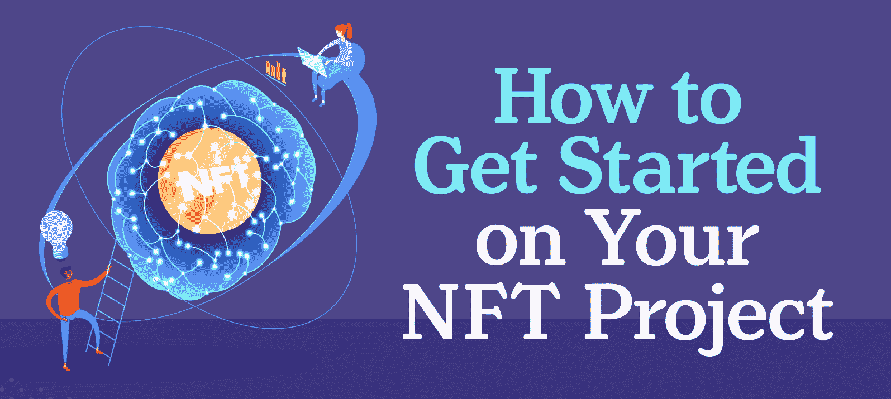
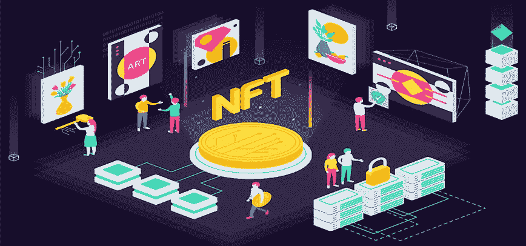
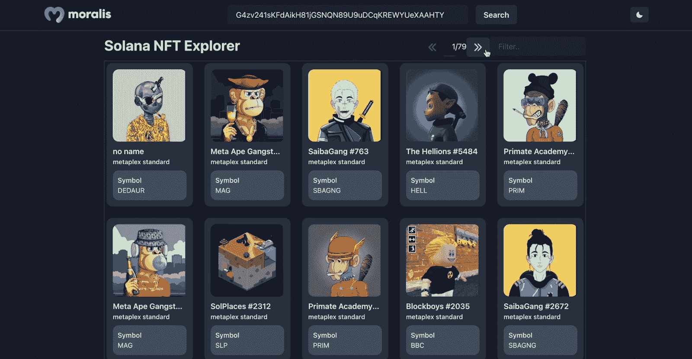
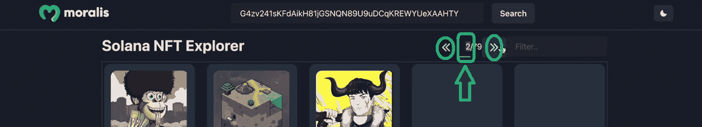
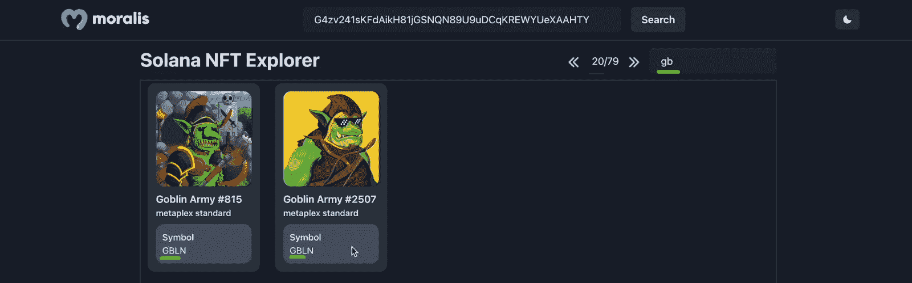
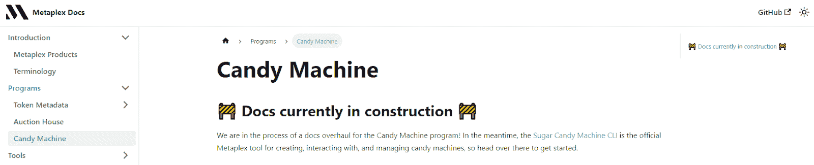

# 如何创建 NFT 项目——开始并成功启动

> 原文：<https://moralis.io/how-to-create-an-nft-project-get-started-and-launch-successfully/>

无论是为你自己还是为你的客户，知道如何创建一个 NFT 项目都会带来无数的机会。然而，这个过程不仅仅是“创建”一个关注不可替换令牌的项目。不幸的是，承担这样一个项目并轻率地去做可能会导致失败，这是很常见的。但是，有了完善的计划、合适的工具和专家的指导，您可以开始并成功启动您的 NFT 项目。听起来很有趣？如果是这样，那么这个指南就是给你的！

今天的指南将集中在索拉纳，一个受欢迎的非 EVM 连锁店。然而，类似的原则也适用于以太坊和 EVM 兼容链。此外，使创建 NFT 项目的过程尽可能简单的工具是 Moralis，它是一个跨链兼容的企业级 Web3 API 提供者。

随着我们向前推进，我们将带您完成创建 NFT 项目的必要步骤，从计划概述开始。一旦我们概述了您需要考虑的步骤，我们还会通知您各种必要的工具。这就是索拉纳和 EVM 相容链之间的不同之处。但是，您可以使用 Moralis 的 Web3 API 在所有实例中获取链上数据。此外，如果你决定创造一些有用的 NFT 公用事业，Moralis 将帮助你创造一个杀手 NFT dapp。此外，您可以使用 Moralis 的 Auth API 轻松实现 [Web3 认证](https://moralis.io/authentication/)。此外，如果你想创建一个 NFT 项目，将提供 NFT 铸造功能，你会想与智能合同互动。如果是这样，使用 Moralis 流 API 是最好的选择。也就是说，让我们开始探索如何创建一个 NFT 项目！

## NFT 项目计划-如何开始

创建 NFT 项目始于适当的思考过程和决策。毕竟，你对 NFT 项目的目标越清楚，实施过程就越顺利。因此，在关注本指南的主题之前，让我们先来看看你必须涵盖的一些重要方面。

*   确定您是想围绕现有的 NFT 构建您的 NFT 项目，还是想创建您自己的 NFT。 已经有很多现存的 NFT。因此，您可以创建 NFT 浏览器、NFT 画廊等等，而无需实际创建自己的 NFT。

*   决定你是想专注于索拉纳还是 EVM 兼容链。如果你的 NFT 项目是 NFT 浏览器，你将能够在索拉纳和 EVM 兼容链之间切换。然而，如果您想创建自己的 NFT，您将使用不同的工具。

*   **如果你决定创建你的 NFT，考虑他们的******【NFT 实用程序】。**此外，您是否希望专注于数字收藏品、艺术、NFT 博彩、门控等。？这也将有助于您确定是开始单独铸造还是批量铸造。此外，它将帮助您决定是要提前铸造所有的 NFT 还是实现懒惰铸造。后者意味着你的用户可以制造 NFT。

    *   您的 NFT 是否包含可视部分(PNGs、JPEGs、MP4 等)。)?您会自己创作图形，还是想与艺术家合作或外包？
    *   你将如何营销你的 NFT 项目？ Web3 仍处于起步阶段，而“*在建，他们会来的*”比 Web2 更常见。然而，在大多数情况下，你需要一个合适的营销策略来取得成功。例如，创建一个强大的社区会非常有影响力。** 

**[**Join Moralis Magazine**](https://moralis.io/joindiscord/)

### 不要过多考虑你的 NFT 项目的细节

以上的指导方针和问题涵盖了“如何创建 NFT 项目”的一些最重要的方面。当然，在处理上述指导方针时，会出现各种各样的子问题。给你一个建议，在上线之前，你需要解决其中的大部分问题。

但是，你不想成为“分析麻痹”的受害者。请记住，无论如何，您将首先关注 testnet/devnet。此外，请记住，大多数成功人士都同意，最好的学习方法是通过犯错误。此外，为您的项目创建一个白皮书可能会帮助您涵盖所有的基本问题。

### 基本项目工具

NFT 项目可以有多种形式。同样，基本的 NFT 项目工具也各不相同。例如，如果你专注于围绕现有的 NFTs 构建一个 dapp，你将需要一个前端应用程序、一个后端应用程序和一个可靠的、高质量的 [NFT API](https://moralis.io/nft-api/) 。至于前端和后端，您可以使用遗留工具。例如，如果您精通 JavaScript，React 和 NextJS 都可以帮助您创建前端，您也可以使用 NodeJS 处理后端。幸运的是，有许多框架和编程语言可供您使用。

然而，当添加与 Web3 相关的后端功能时，最终的 Web3 API 提供者 Moralis 是首选工具。你只需要你的 Moralis Web3 API 密匙，它可以通过一个免费的 Moralis 账户获得。然后，您可以通过简单地复制和粘贴代码片段到您的后端来使用所有种类的 API 端点。

因此，当您对创建一个不涉及创建 NFT 的 NFT 项目感兴趣时，您可以使用遗留的开发工具和 Moralis 规范。

另一方面，如果您想要创建新的 NFT，您需要稍微扩展一下您的工具箱，尤其是如果您想要自己创建 NFT 的可视部分。那样的话，Photoshop 之类的软件就派上用场了。尽管如此，您也可以探索更集中的解决方案，比如 OpenSea。毕竟，许多 NFT 市场也能让你铸造代币。然而，如果你想认真对待一个 NFT 项目，你就要远离这些平台，或者只在 NFT 交易中使用它们。如果是这样，你必须熟悉智能合约(链上程序)和工具，如 Remix、Hardhat 和 Metaplex。

#### 你需要什么？

在下面的列表中，我们将看看您在创建 NFT 项目时想要使用的工具。

**构建和测试 NFT Dapps:**

*   传统开发工具
*   Moralis
*   Web3 钱包(例如元掩码和幻影)

**创建 NFT:**

*   NFTs **的可视部分**
    *   照片编辑和视频编辑软件

**文件和元数据存储:**

*   分散存储解决方案(如 IPFS)

**NFT 明廷(EVM):**

*   Web3 钱包
*   Solidity 或 Viper 创建与 EVM 兼容的智能合约
*   OpenZeppelin 获取经过验证的智能合同模板
*   重新混合 IDE 和 Hardhat 来编译、部署和验证智能合约

**NFT·明廷(索拉纳):**

*   Metaplex 的糖果机
*   可能需要独特的链上索拉纳程序的项目生锈
*   索拉纳钱包

此外，还需要营销和社区创建/管理策略和工具。有了这些工具，让我们看看如何使你的项目成功！

## 如何使 NFT 项目成功？

如果你衡量成功的非功能性销售和获得的利润，你可能只需要一些实际的非功能性销售和炒作创造营销策略。然而，我们相信成功来自于为 Web3 增值，最重要的是，为最终用户增值。因此，你需要一个好的计划，有趣的 NFT 效用，可靠的营销，以及大量的毅力和意志力来为你的用户提供价值。当然，即使你具备所有这些方面，也不能保证成功。因此，不要害怕冒险，把注意力放在你一路上学到的东西上。也许你的第一个项目失败了；然而，这会给你的第二个项目带来更大的成功机会。确保你的主要精力放在增加价值和学习上。通过这样做，你将有一个成功的 NFT 项目启动早而不是晚。

也就是说，我们建议你先熟悉上面列出的工具，然后开始研究你的 NFT 创意。开始练习你的 dapp 开发和铸造技能。一旦你建立了一个坚实的基础，你可以开始创建一个初步的 NFT 项目。此外，如果您想测试您的技能，您可以使用以下部分创建一个关于 Solana 链的项目。或者，你可以访问 Moralis 的资源和处理其他 NFT 相关的教程。例如，你可以学习如何在 Django 创建一个 NFT 门户网站。

## 如何创建 NFT 项目

在接下来的小节中，您将做两个快速概述，并观看两个详细的视频教程，这些视频教程是关于一些 Solana 示例项目的，重点是不可替换的令牌。在第一个中，我们将向你展示如何[建造一个索拉纳 NFT 探索者](https://moralis.io/how-to-build-a-solana-nft-explorer/) dapp。通过构建一个索拉纳 NFT 资源管理器 dapp，你将学会如何使用 Moralis 的索拉纳 API。在第二部中，你将有机会学习如何[创造你自己的索拉纳·NFT](https://moralis.io/solana-nft-mint-tools-create-your-own-solana-nft/)。通过创建您自己的索拉纳 NFT，您将熟悉索拉纳 NFT 薄荷工具 Metaplex 的糖果机 v2。

### 示例 1: NFT 探索者项目

如果你决定使用下面的视频，你将有机会学习如何创建一个 NFT 项目来获取索拉纳的 NFT 数据。为了帮助你决定是否要接这个项目，让我们来看看我们完成的例子 dapp。正如您在下面的屏幕截图中看到的，我们的示例 dapp 最初是空的:

然而，一旦我们将一个特定的索拉纳 NFT 项目地址粘贴到输入字段中，并点击“搜索”按钮，您就会看到我们的浏览器的强大功能:

如您所见，我们的 dapp 整齐地将 NFT 显示为两行。对于每个 NFT，dapp 在顶部显示其图像。在图像下方，我们可以看到它的名字，然后是底部的符号。此外，显示结果后，会出现一个页面导航器和一个用于“过滤”的输入字段:

此外，过滤器使您能够按符号搜索 NFT:

下面的视频教程向你展示了如何创建上面演示的索拉纳·NFT 探索者项目。

[https://www.youtube.com/embed/EvxSq0MJnMI?feature=oembed](https://www.youtube.com/embed/EvxSq0MJnMI?feature=oembed)

在 1:30 时间戳，您将看到如何获得您的 Moralis Web3 API 密钥，这是以简单的方式创建项目的途径:

### 例 2:索拉纳 NFT 铸币项目

如果您完成了上面的示例项目，那么您现在应该知道如何在 Solana 上创建一个侧重于显示 NFT 的 NFT 项目。因此，你也准备好学习如何铸造茄汁。幸运的是，当使用 Metaplex 的糖果机 v2 时，这非常简单。本质上，您只需要从 Metaplex 文档中复制代码。

如果你决定铸造自己的索拉纳 NFTs，下面的视频教程将告诉你如何做。一旦您创建了您的 NFT，您将能够使用 Solana Explorer 查看它们:

所以，这里有一个视频教程，详细介绍了如何创建一个 NFT 项目，其中包括铸造 NFT:

[https://www.youtube.com/embed/BPQXek6lMUE?feature=oembed](https://www.youtube.com/embed/BPQXek6lMUE?feature=oembed)

## 如何创建 NFT 项目-摘要

在今天的指南中，您有机会了解开始创建 NFT 项目所需的所有知识。在创建项目时，您探索了最重要的方面。因此，你现在知道适当的规划是必不可少的一部分。您还知道确切的工具会根据您想要创建的 NFT 项目的类型而有所不同。毕竟，您不必创建自己的 NFT 来构建 NFT dapp。但是，如果您想要生成自己的 NFT，您需要特定的工具来创建和存储 NFT 文件，并铸造实际的令牌。

此外，你有机会完成两个索拉纳 NFT 项目。因此，您学习了如何创建一个关注现有令牌或创造新的 NFT 的 NFT 项目。

如果你喜欢今天的指南和两个示例项目，请务必访问 [Moralis 文档](https://docs.moralis.io/)、 [Moralis YouTube 频道](https://www.youtube.com/c/MoralisWeb3)和 [Moralis 博客](https://moralis.io/blog/)。这三个资源可以帮助你立刻免费成为 NFT 和 dapp 开发者。除了 NFT 开发之外，这些渠道还处理各种各样的 Web3 开发主题。例如，一些最新的文章解释了如何使用 [Firebase 作为 Web3](https://moralis.io/how-to-use-firebase-as-a-proxy-api-for-web3/) 的代理 API，如何集成[基于区块链的认证](https://moralis.io/blockchain-based-authentication-how-to-integrate/)，如何[使用 NodeJS Web3 示例](https://moralis.io/nodejs-web3-tutorial-create-dapps-using-a-nodejs-web3-example/)创建 dapps，如何编写 [Solana 智能合同](https://moralis.io/how-to-write-a-solana-smart-contract/)等等。

最后但同样重要的是，你可能有兴趣得到一份很棒的加密工作。在这种情况下，成为区块链认证大大提高了你的机会。因此，一定要考虑报名参加[Moralis 学院](https://academy.moralis.io/)。此外，如果你是一个加密新手，可以从“[初学者加密](https://academy.moralis.io/courses/crypto-for-beginners)课程开始。**