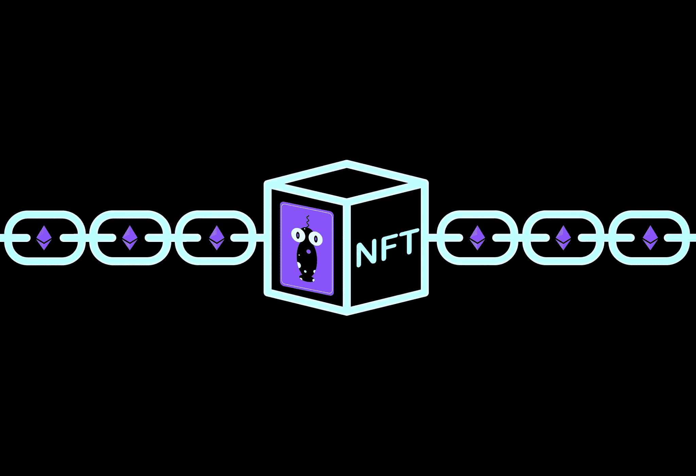
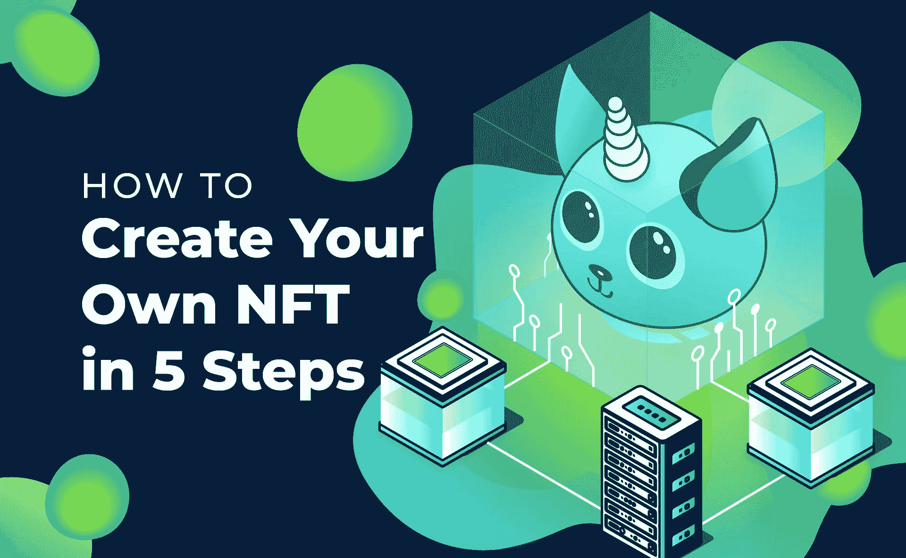
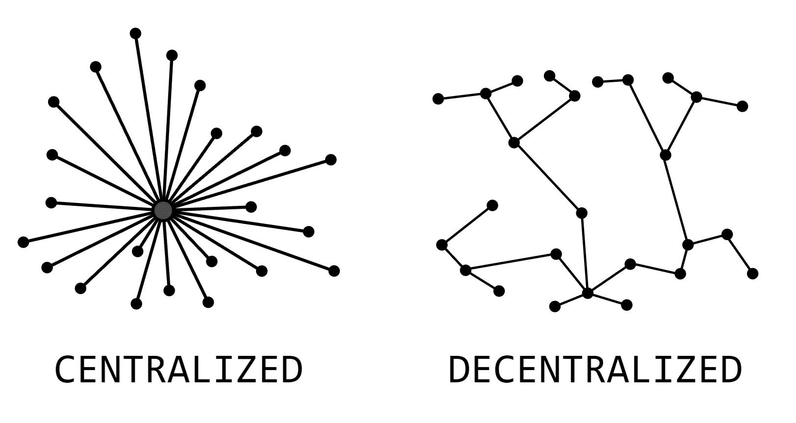
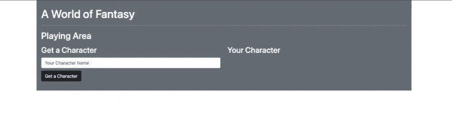
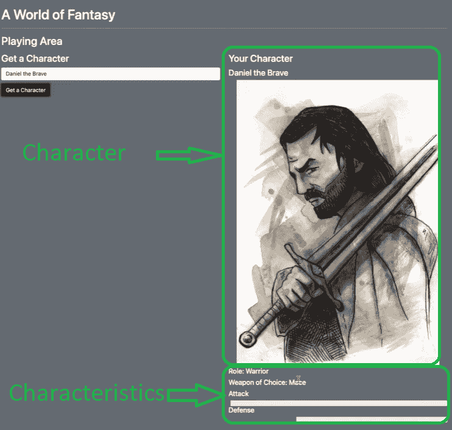
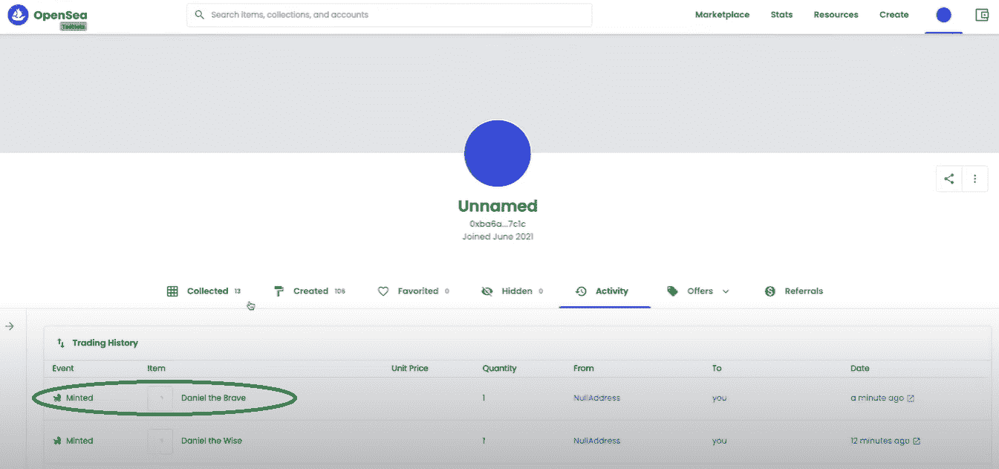
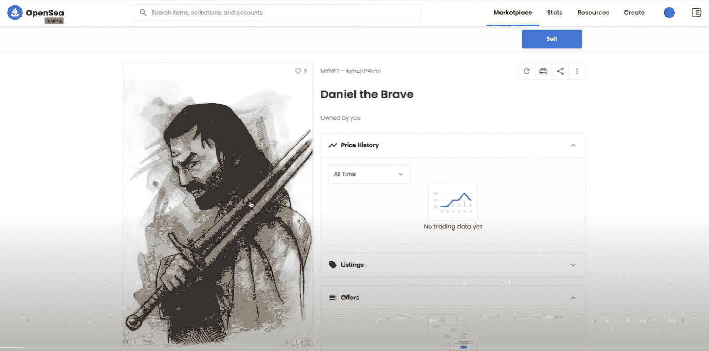
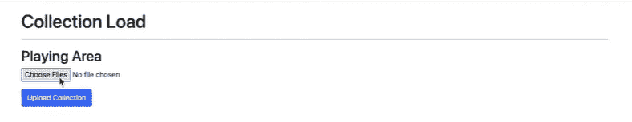

# 如何创建 NFTs 并上传到 OpenSea

> 原文：<https://moralis.io/how-to-create-nfts-and-upload-to-opensea/>

即使你没有深入参与加密领域，你肯定已经注意到 NFT(不可替代的令牌)是最流行的区块链技术用例之一。具体来说，非功能性股票如今风靡一时，NFT 市场估值过高。更重要的是，不可替代的代币才刚刚开始发现它们的用途。这既包括数字领域，也包括现实生活中的领域，如证书、房地产和其他类型的所有权。因此，这无疑是学习如何 [**创建 NFT**](https://moralis.io/how-to-create-your-own-nft-in-5-steps/)**的最佳时机。此外，虽然新的知名连锁店和 NFT 市场每天都在涌现，但以太坊和 OpenSea 市场仍然是最受欢迎的选择。因此，您还应该知道如何将 NFT 上传到 OpenSea，在那里您可以轻松地展示、拍卖或出售它们。**

如标题所示，您将能够学习如何创建 NFT 并将它们上传到 OpenSea。虽然有多种方法可以做到这一点(尤其是如果你不局限于以太坊的区块链)，但我们将采用一个特殊的示例项目，并构建一个能够生成 NFT 的 [Web3](https://moralis.io/the-ultimate-guide-to-web3-what-is-web3/) 应用程序。此外，我们将使用[Moralis 规范](https://moralis.io/)使整个过程尽可能简单。通过完全访问 Moralis 的终极 [Web3 SDK](https://moralis.io/exploring-moralis-sdk-the-ultimate-web3-sdk/) ，我们将能够完全专注于我们的 [dApp](https://moralis.io/decentralized-applications-explained-what-are-dapps/) 的前端部分，而让 Moralis 负责后端。

如果您还没有，请确保现在创建一个免费的 Moralis 帐户。这样，一旦我们开始我们的示例项目，您将能够很容易地理解。此外，虽然 OpenSea 可能有其缺陷，缺乏分散性，但它仍然是最受欢迎的 NFT 市场。因此，我们将把 NFTs 上传到 OpenSea 来展示这个方面。当然，这使用了 Moralis 的同类最佳 [NFT API](https://moralis.io/ultimate-nft-api-exploring-moralis-nft-api/) 。



## 什么是 NFT？

不可替换令牌(NFT)是区块链最流行的用例之一。正如单词“不可替换”所暗示的，不可替换的令牌具有独特的特征，这意味着没有两个或更多的 NFT 是相同的。这使得 NFTs 非常适合数字艺术和收藏品。此外，它还提供了一种将所有权分配给已经存在的数字文件，甚至分配给实际资产(如所有权文件、证书、协议等)的方法。).基本上，任何类型的文件(MP3，MP4，JPEG，PDF 等。)可以转换成 into 因此，我们可以为它们分配独特的属性，这些属性将存储在区块链上。这意味着它们不能被篡改。*如果你想更深入地了解和发现更多关于非功能性令牌的信息，请查阅我们在下面文章中关于这个主题的详细指南:“* [*不可替换令牌解释——什么是非功能性令牌？*](https://moralis.io/non-fungible-tokens-explained-what-are-nfts/) *。*

# **如何创建 NFT**

当您听到人们谈论创建 NFT 时，它可以有多种含义。首先，它可以指从零开始的整个过程。这包括创建一个实际的数字文件，比如说 JPEG，然后铸造该文件以创建 NFT。然而，它也可以指单独的铸造过程。这意味着我们已经创建了数字文件，我们只想为它们分配某些属性，然后通过完成一个事务(称为“铸造”)将它们存储在区块链上。



由于大多数可用的 NFT 是数字艺术作品，这种 NFT 的创建过程通常涉及实际的艺术家。因此，作为开发人员，我们在讨论如何创建 NFT 时主要关注铸造部分。因此，通过完成下面的示例项目，您将基本学会如何制造 NFT。幸运的是，Moralis 提供了最好的 API 来制造 NFT。

此外，您需要注意一些 NFT 甚至有由计算机代码创建的文件部分。对于 JPEGs，代码可以接受各种 png(背景透明的图像)来生成不同的字符组合(比如 CryptoPunks)。因此，一个额外的随机因素可以纳入 NFT 收藏。此外，我们将纳入这种类型的 NFT 创作的某一方面；我们将赋予不同的特征，而不是图像。如果我们想在 [NFT 游戏](https://moralis.io/what-are-nft-games-and-how-to-make-nft-games/)中使用这些 NFT，或者使用 [NFT 编程](https://moralis.io/nft-programming-for-beginners/)构建的其他类型的 dApps，那么后者会很有用。

## **如何以分散的方式创建 NFTs】**

在我们进一步讨论之前，您需要知道有各种方法可以创建 NFT。这完全取决于您感兴趣创建的 NFT 的类型以及您对去中心化的重视程度。例如，你可以使用一个流行的平台，比如 OpenSea，来制造一个 NFT。事实上，这是最简单快捷的方法。但是，它不是一种分散的方式。此外，NFT 平台或市场提供了有限的选项和功能，关于你可以分配给你的非功能性交易。因此，它们可能不会为您提供将特定属性分配给您想要的 NFT 的选项。



也就是说，构建您自己的 Web3 应用程序，使您能够以分散的方式创建 NFT，完全符合您的愿景，这是我们想要关注的。虽然这听起来可能是一项艰巨的任务，但我们向您保证，通过使用 Moralis 的终极 Web3 开发平台，我们可以比您预期的更快地完成这项任务。

此外，请记住，您不必使用 OpenSea 创建 NFT 来显示它们。你可以以分散的方式创建 NFT，然后仍然将 NFT 上传到 OpenSea，这正是我们将要做的。

## **如何创建 NFTs 并上传到 open sea——示例项目**

本节将为您提供详细的指导，您可以自己实现，从而学习如何创建 NFT 并轻松快速地将它们上传到 OpenSea。我们还在 [Moralis 的 YouTube 频道](https://www.youtube.com/channel/UCgWS9Q3P5AxCWyQLT2kQhBw)上为那些喜欢观看视频指导的人提供了一段视频。在这个视频中，你可以看到 Moralis 的一位专家正在进行同一个项目:

https://www.youtube.com/watch?v=M5eCg_udGIA

*注* *:由于上面的视频将使编程任务的某些部分更容易理解，我们将在下面提供的说明中引用视频中的具体时间。*

此外，随着我们的继续，我们将只为您提供最重要的代码片段。要访问与这个示例项目相关的完整代码，请访问相关的 [GitHub](https://github.com/DanielMoralisSamples/24_RandomNFTFantasyGame/commit/ecf5ffcfc1346898f5f49c600c856a9fd991d086) 页面。

在我们仔细研究如何创建 NFT 的详细步骤之前，我们需要设置一个 Moralis 服务器。此外，我们还需要确保您对我们将要构建的内容有一个相对清晰的愿景。因此，设想我们的 Web3 应用程序完成后的样子会使事情变得更容易。

### **如何使用 Moralis 创建 NFTs】**

为了使用 Moralis 学习如何创建 NFT 并将 NFT 上传到 OpenSea，您需要完成一组简单的步骤。这基本上是 Moralis 的初始设置，当你想使用 Moralis 的 Web3 API 时，它包含了基本上每个项目的关键步骤。

#### **Moralis 设置**

1.  **创建您的 Moralis 帐户**–如果您还没有 Moralis 帐户，请确保现在就创建一个。它不会花费你任何东西，而且不超过一分钟。只需访问 [Moralis 的免费账户注册页面](https://admin.moralis.io/register)，输入您的电子邮件地址并创建您的密码。接下来，确认您的电子邮件地址(Moralis 的系统将向您发送一封带有确认链接的电子邮件)。另一方面，如果你已经有一个有效的 Moralis 账户，只需[登录](https://admin.moralis.io/login)。
2.  **创建新的服务器**–进入 Moralis 仪表板后，点击左侧菜单中的“服务器”选项卡。然后点击右上角的“+创建新服务器”按钮创建一个新服务器。接下来，将出现一个下拉菜单，提供不同类型的服务器(见下图)。我们建议从“Testnet 服务器”选项开始。


然后，将显示一个弹出窗口，您需要在其中输入所需的详细信息。其中包括服务器名称(可以是您想要的任何名称)，选择区域、网络、链(您可以选择一个或多个链)，然后单击“添加实例”按钮。如果你以前用过 Moralis，你可以使用你现有的任何服务器。


3.  **访问服务器详细信息**–成功创建服务器后，您最终可以获得服务器的详细信息(将在您的”内部使用)。html“或”。js”文件)，方法是单击服务器名称旁边的“查看详细信息”。在弹出窗口中，您将能够看到您的服务器的 URL 和 ID。
4.  **初始化 Moralis**–将上一步获得的详细信息复制并粘贴到您的项目中。html“或”。js "文件来获得所需的后端功能，如下图所示:


*注意:确保使用您的特定服务器的详细信息，而不是从上图中复制服务器的详细信息。*

### **如何创建 NFTs 从目标开始**

我们将在这里进行的帮助我们学习如何创建 NFTs 的项目将产生一个生成角色的 dApp。这个角色将代表一个融合了一些独特特征的 NFT。这是我们完成的 Web3 应用程序界面的图像:



正如你所看到的，看上面的图片，用户可以输入他的角色的名字，然后点击“获取角色”按钮。点击按钮后，用户必须使用[元掩码](https://moralis.io/metamask-explained-what-is-metamask/)确认交易。此操作将启动代码，该代码将根据我们将在代码中确定的一组属性(特征)来创建 NFT(见下图)。使用 [JavaScript 的](https://moralis.io/javascript-explained-what-is-javascript/)随机数生成器将随机选择角色和一组特殊特征。



此外，生成 NFT 后，您还可以将 NFT 上传到 OpenSea:



## **如何创建 NFTs 并上传到 open sea——实际步骤**

现在您已经设置了 Moralis，并且知道我们将要构建什么，您已经准备好查看完成上面介绍的 NFT 生成 dApp 所需的确切步骤。

### **第一步:上传图像**

我们将从上传图像开始，这些图像将作为我们的 NFTs 的视觉部分，然后进行所需的编码，以确保事情顺利进行。

为了上传我们的图像文件，我们将使用一个特殊的 Web3 应用程序，我们也将在下面的步骤中创建它。下面是它的样子:



通过点击“选择文件”，我们选择我们想要使用的图像。我们通过点击“上传收藏”按钮完成上传过程。当然，这意味着你必须准备好你的收藏(图片)。

如果你还记得，我们正在以分散的方式创建 NFTs 因此，我们 dApp 的“上传”部分需要将图像上传到 [IPFS](https://moralis.io/what-is-ipfs-interplanetary-file-system/) ，这是一个领先的分散存储解决方案。幸运的是，Moralis 提供了与 IPFS 的完全兼容性。

此外，使用 console 视图，我们将收集由“collection load”页面提供的详细信息。我们将把这些细节复制到“ipfsCollection.json”文件中。这就是我们在使用随机 NFT 发生器时参考这些图像的方式。从 2:09 开始，上面提供的视频介绍了这些步骤。

#### **创建图片上传页面**

为了创建能够上传图像的页面(如前一步所做的)，我们将使用简单的 HTML 和 JavaScript (JS)编码。为了让页面看起来漂亮，我们将使用 Bootstrap。此外，我们将使用 Moralis 来代表我们覆盖后端方面。查看上面视频中 4:06 的时间戳，了解更多详情。

HTML 代码的“脚本”部分(“config.html”文件)是一个关键方面:

```js
 <!-- Scripts -->
        <script src="https://cdn.jsdelivr.net/npm/[email protected]/dist/js/bootstrap.bundle.min.js" integrity="sha384-U1DAWAznBHeqEIlVSCgzq+c9gqGAJn5c/t99JyeKa9xxaYpSvHU5awsuZVVFIhvj" crossorigin="anonymous"></script>
        <script src="https://cdn.jsdelivr.net/npm/[email protected]/dist/web3.min.js"></script>
        <script src="https://unpkg.com/moralis/dist/moralis.js"></script>
        <script src="static/uploadCollection.js"></script>
    </body>
```

至于 JavaScript 代码，我们将创建“uploadCollection.js ”,它将在单击“上传收藏”按钮后启动。这也是我们将使用 Moralis 服务器详细信息的地方:

```js
Moralis.initialize("JzMDtI9JeuUMAtiJalAqQbenxGpU5QVH6dCUaxK6"); // Application ID from moralis.io
Moralis.serverURL = "https://axsxr6qx1ncv.moralishost.com:2053/server"; // Server URL from moralis.io
Moralis.authenticate()
```

此外，这是我们使用 Moralis 的力量来创建关于 IPFS 的新文件的代码部分(这大大简化了过程):

```js
 ***让 imageFile = new Moralis。File(data.name，data)；*T3】**

```
*注意* *:请记住，对于大型收藏，上传图像可能需要一段时间。***步骤 2:创建 NFT**这是我们项目中直接解决“如何创建 NFTs”方面的部分。它获取我们在上一步中上传的集合文件，并生成随机的 NFT。除了使用图像作为输入值，它还包含随机选择的特征(基于我们提供的集合)。*观看以上视频了解更多详情，从 7:55 开始。*遵循与上一步相同的路径，我们使用一个 HTML 文件(“index.html”)来为我们的用户创建一个网页(一个界面)，并使用一个 JavaScript 文件(“logic.js”)来添加功能。HTML 代码的“脚本”部分(“index.html”)再次扮演了重要角色，因为它导入了我们完成工作所需的所有内容:

```js
    <!-- Scripts -->
        <script src="https://cdn.jsdelivr.net/npm/[email protected]/dist/js/bootstrap.bundle.min.js" integrity="sha384-U1DAWAznBHeqEIlVSCgzq+c9gqGAJn5c/t99JyeKa9xxaYpSvHU5awsuZVVFIhvj" crossorigin="anonymous"></script>
        <script src="https://cdn.jsdelivr.net/npm/[email protected]/dist/web3.min.js"></script>
        <script src="https://unpkg.com/moralis/dist/moralis.js"></script>
        <script src="static/logic.js"></script>
```

**我们 dApp 的逻辑部分**至于我们 dApp 的逻辑部分，我们将其分为三个部分: 1.  **初始化 web 3-***(显示在 9:57 开始的视频中。)我们用 Moralis 来完成这件事。* 2.  **生成角色——***(显示在 11:00 开始的视频中。)这里我们使用了一组简单的函数，包括“getRandomValues()”和我们之前上传的集合图像(我们已经准备好了“ipfsCollections.json”文件)。* 3.  **将生成的角色铸造成 NFT——***(显示在 19:54 开始的视频中。)为了创建 NFTs，我们需要一个* [ *智能契约* ](https://moralis.io/smart-contracts-explained-what-are-smart-contracts/) *和一个我们为此创建的函数。*为了访问 Moralis 的能力，我们再次使用服务器细节。此外，如上所述，要创建 NFT，我们需要使用智能契约。 [*创建智能契约*](https://moralis.io/how-to-create-smart-contracts/) *超出了本示例项目的范围，因此我们为您提供了一个您可以使用的智能契约(来自“logic.js”的一行代码):****const NFT _ contract _ address = " 0x 0 FB 6 ef 3505 b 9 c 52 ed 39595433 a 21 af 9 b 5 FCC 4431 "****//NFT 明廷合约使用这一个:“含电池”，这个合约的代码在 GitHub 资源库“contract_base”下，供您参考。*此外，这是我们的 mint 函数的代码:

```js
async function mintToken(_uri){
  const encodedFunction = web3.eth.abi.encodeFunctionCall({
    name: "mintToken",
    type: "function",
    inputs: [{
      type: 'string',
      name: 'tokenURI'
      }]
  }, [_uri]);

  const transactionParameters = {
    to: nft_contract_address,
    from: ethereum.selectedAddress,
    data: encodedFunction
  };
  const txt = await ethereum.request({
    method: 'eth_sendTransaction',
    params: [transactionParameters]
  });
  return txt
}
```

**第三步:上传 NFTs 到 OpenSea** 在创建 NFT 之后，它们将被添加到代码中提供的地址。如果您有相同的地址连接到您的 OpenSea 帐户，NFTs 将自动上传到那里(您不需要手动上传 NFTs 到 OpenSea)。此外，请注意你使用的网络。如果你在 testnet 上创建你的 NFT，你需要连接并上传 NFT 到 OpenSea 的 testnet([https://testnets.opensea.io/](https://testnets.opensea.io/))。与 mainnet 一样，如果您创建自己的帐户并使用相同的地址，上传过程将自动执行。**上传 NFTs 到 OpenSea** 说到使用 OpenSea，请记住这不是一个完全去中心化的平台。此外，甚至有报道称，一名 OpenSea 员工利用该平台进行某种内幕交易。也就是说，我们建议以分散的方式制造 NFT(其中一种方式已经在本文中讨论过)。然而，由于 OpenSea 仍然提供最受欢迎的 NFT 市场之一，您可能仍然希望将 NFTs 上传到 OpenSea。请记住，您的 OpenSea 帐户只是您的加密钱包的一个窗口，显示里面所有的 NFT。因此，如果您没有看到您的 NFTs，您的 MetaMask 钱包很可能没有正确连接到 OpenSea。以下是 OpenSea 帮助中心提供的两个最常见的原因:**如何创建 NFTs 并上传到 open sea–摘要**如果您对区块链开发很认真，学习如何创建 NFT 是一项强烈推荐掌握的技能。为什么？就目前的情况来看，NFT 将会继续存在，对任何知道如何以分散的方式创建 NFT 的人的需求预计在未来几年将会上升。因此，我们希望你能很好地利用从这里获得的宝贵知识。您现在知道，在 Moralis 的帮助下，您可以相当容易地编写一个简单的 dApp，它可以生成随机的 NFT。您还了解到显示或列出您在 OpenSea 帐户上创建的 NFT 非常简单。只要您连接到同一个钱包，您就不必手动将 NFTs 上传到 OpenSea。但是，您需要确保您在同一个网络上(mainnet 或 testnet)。有了适当的指导和强大的工具，如 Moralis，您就拥有了提升区块链开发水平的一切。如果你需要更多的灵感，请务必查看我们在 [Moralis 的 YouTube 频道](https://www.youtube.com/c/MoralisWeb3)和 [Moralis 的博客](https://moralis.io/blog/)上的丰富内容。例如，Moralis 的博客讲述了 [NFT 令牌开发](https://moralis.io/nft-token-development-the-ultimate-guide/)、[如何成为区块链开发者](https://moralis.io/how-to-become-a-blockchain-developer/)、[构建以太坊 dApps](https://moralis.io/how-to-build-decentralized-apps-dapps-quickly-and-easily/) 。    

```js

```