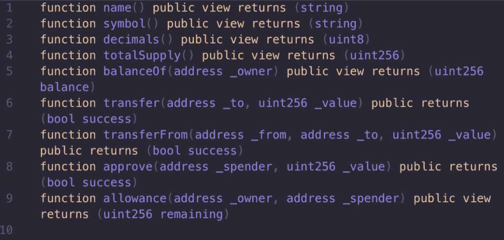
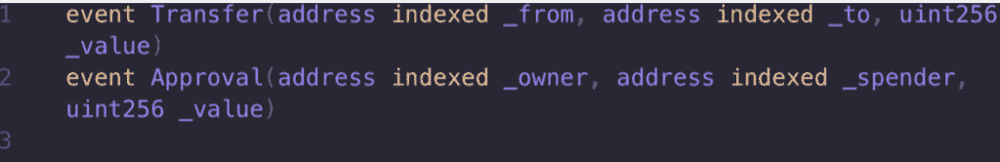
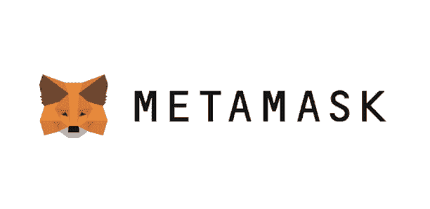
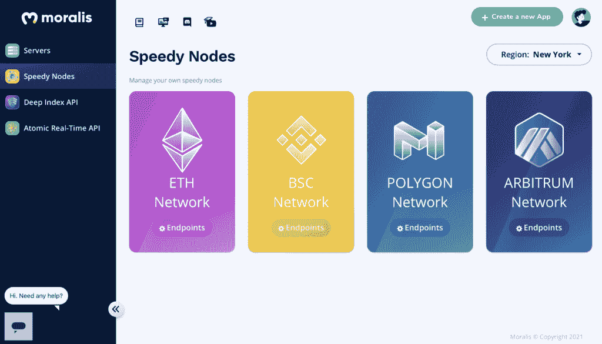
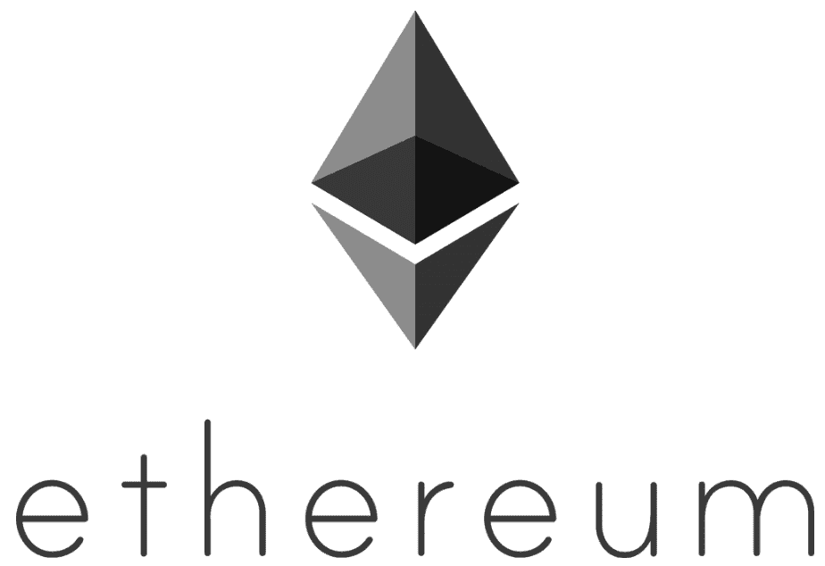
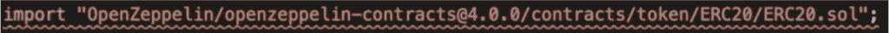
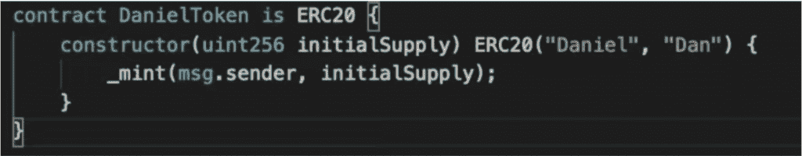
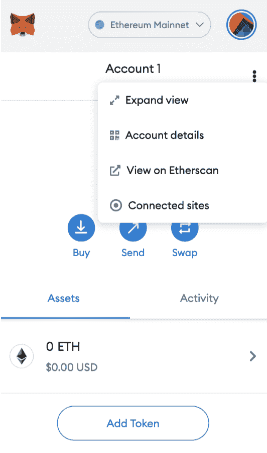
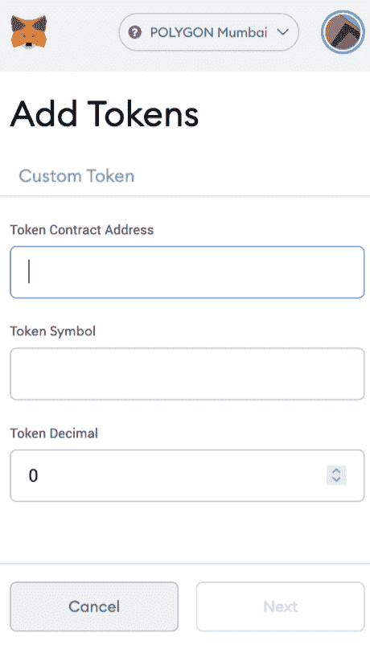

# 如何在 10 分钟内创建自己的 ERC-20 代币

> 原文：<https://moralis.io/how-to-create-your-own-erc-20-token-in-10-minutes/>

从市值角度来看，比特币是最大的加密货币，而“区块链”的概念通常与比特币联系在一起。然而，即使比特币是市值最大的加密货币，以太坊在 dApp 开发中也胜过它。以太坊无疑是最大的支持智能合约的区块链，并且托管着一个由[**【dApps】**](https://moralis.io/decentralized-applications-explained-what-are-dapps/)**(去中心化应用)组成的庞大生态系统。这些 dApps 和 DeFi 项目通常运行在基于以太坊的 ERC-20 令牌上。再者，以太坊是** [**EVM**](https://moralis.io/evm-explained-what-is-ethereum-virtual-machine/) **(以太坊虚拟机)的起源，现在被 Polygon 等其他流行链广泛使用。因此，许多连锁店也将以太坊 ERC-20 令牌标准应用于自己的网络。因此，我们将在 10 分钟内详细了解如何创建自己的 ERC-20 令牌。**

现在你可能会问自己“在 10 分钟内创造你自己的 ERC-20 代币？这是什么巫术？”。事实上，它既不是巫术也不是魔法——它只是 [Moralis](https://moralis.io/) 。创建 ERC-20 令牌并不困难，只要有合适的工具。这项工作的最佳工具和平台是 Moralis，它会为您完成所有繁重的后端工作。您将很快发现为什么 Moralis 成为首要的 [Web3 开发](https://moralis.io/how-to-build-decentralized-apps-dapps-quickly-and-easily/) 平台，因为它为开发和部署您自己的 dApps 和令牌提供了一切。因此，在本文中，我们将使用 Moralis 来创建 ERC-20 令牌。

此外，Moralis 还提供了大量其他强大的工具供开发过程中使用。一个例子是 [Moralis 斯快速节点](https://moralis.io/speedy-nodes/) ，我们将使用它来开发我们的 ERC-20 令牌。此外，Moralis 提供了一个完全托管的后端基础设施，允许您作为开发人员专注于前端。因此，无论您是开发 dApps 还是创建令牌，Moralis 都可以提供帮助。免费加入 Moralis，立即开始使用该平台的工具！

### 什么是 ERC 20 代币？

对于以太坊区块链和 dApps 来说，代币是最重要的特征之一。在以太坊生态系统中，ERC-20 代币能够代表几乎任何东西。一些例子是彩票、在线平台上的点数、游戏中角色的技能、法定货币等。这个功能相当强大，需要一个标准来规范，这就是 ERC-20 存在的原因。

ERC-20 标准确保令牌具有相同的属性。这进一步意味着令牌共享相同的类型和值，使它们可以互换。因此，ERC-20 是可替代的代币，使我们能够衡量代币的价值并将其与另一个进行比较。但是这对代币本身到底意味着什么呢？

ERC-20 标准为带有智能合约的令牌实现了一个 API。该 API 提供功能，使开发人员能够设置总的令牌供应，从帐户中获取令牌余额，并将令牌从一个帐户转移到另一个帐户。然而，这些只是 ERC-20 代币的一些特征。对于作为 ERC-20 有效的令牌，令牌需要实现以下方法和事件:

**方法** :

**事件** :

## 如何创建 ERC-20 令牌

正如我们在简介中提到的，成为以太坊令牌开发者的最终方法是使用 Moralis。作为一个 Moralis 用户，可以将开发时间减到最少，并使开发过程变得毫不费力。然而，在我们深入研究如何开发自己的 ERC-20 令牌之前，有一些准备工作要做:

1.  **元掩码** —首先，我们需要建立一个元掩码账户。
2.  **节点** —第二，我们还需要为正在讨论的网络找到一个功能齐全的区块链节点。
3.  **获取** **代币**——第三，我们需要获取代币。获得哪些代币取决于我们用来开发 ERC-20 代币的区块链。 我们需要这样做，以便支付将令牌部署到区块链的适当费用。

因此，让我们从设置 MetaMask 帐户的过程开始吧。

### 设置元掩码帐户

[MetaMask](https://moralis.io/metamask-explained-what-is-metamask/) 是市场上最受欢迎的加密货币钱包之一，拥有超过 100 万用户。除了作为一个广泛使用的钱包，该平台还充当了去中心化网络的网关，为用户提供了一种安全的方式来访问 dApps 的广泛以太坊生态系统。此外，MetaMask 还有其他几个用例，其中一个用于获取和查看我们将在本文中创建的令牌。此外，我们还需要一个元掩码帐户来保存令牌，我们将使用它来支付令牌的部署费用。

创建元掩码账户很简单，只需几分钟。要访问元掩码，我们必须下载浏览器扩展或移动应用程序。此外，在开发 dApps 时，Moralis 自带了对使用元掩码 认证用户的 [原生支持。](https://moralis.io/how-to-authenticate-with-metamask/)

### 获取一个区块链节点

下一步是为我们要部署令牌的网络获取一个功能完整的区块链节点。节点是必不可少的，因为这是我们的项目如何与区块链互动和沟通。因此，节点至关重要，因为它们允许我们将令牌部署到区块链。

Moralis 是目前最快的 [区块链节点提供商](https://moralis.io/infura-alternatives-and-blockchain-node-providers/) 。通过注册 Moralis，访问节点的过程简单明了。Moralis 提供一项名为 Speedy Nodes 的服务，在这项服务中，你可以访问市场上一些最快、最可靠的节点。此外，Moralis 的快速节点目前支持四种不同的网络:以太坊、多边形、BSC 和 Arbitrum。因此，你也可以使用 Moralis，例如， [分 6 步创建一个仲裁令牌](https://moralis.io/how-to-create-an-arbitrum-token-in-6-steps/) ，或者 [以闪电般的速度创建一个 BSC 令牌](https://moralis.io/how-to-create-a-bsc-token-in-5-steps/) ！

T2】

一旦你有了一个账户，你需要做的就是导航到 Moralis 界面左侧的栏目，在那里你会找到“Speedy Nodes”标签。单击此选项将为您提供四个不同的网络。所有网络都有一个“端点”按钮。如果你点击其中一个端点按钮，你会得到不同的网址。这些 URL 基本上是区块链节点，我们可以使用它们来使我们的项目与各种区块链进行通信。

### 获取代币

实际开发我们的令牌之前的最后一部分是获取我们计划使用的区块链的本机令牌。所以，如果我们要 [创建一个多边形令牌](https://moralis.io/how-to-create-a-polygon-token/) ，我们必须先获取 MATIC 令牌。然而，由于我们将创建一个 ERC-20 令牌，我们需要获得以太坊的本地令牌，即以太。

我们有几种不同的方法可以获得乙醚。一个例子就是通过等平台用法定货币购买。另一个例子是使用诸如[uni swap](https://uniswap.org/)的分散交换或 DEX 来将一个令牌交换给另一个令牌。

然而，我们还可以通过其他方式获得代币。例如，如果我们计划将一个令牌部署到 Mumbai Testnet of Polygon，我们不想获得 real MATIC。相反，我们希望为 testnet 获取令牌，这使我们能够将 ERC-20 令牌部署到特定的区块链。这可以通过在以下链接中输入我们的加密钱包地址来实现:[https://水龙头. matic.network](https://faucet.matic.network/) 。然而，在这样做之前，我们还需要通过 Moralis Speedy 节点将我们的元掩码网络更改为 Mumbai Testnet。

现在我们已经有了元掩码帐户、快速节点和我们选择的区块链的本机令牌，我们可以继续这篇文章的主题:“如何在 10 分钟内创建您自己的 ERC-20 令牌”。

# 如何在 10 分钟内制作自己的 ERC-20 代币

使用 Moralis 创建 ERC-20 令牌可以通过四个不同的步骤完成:

1.  设置速度节点。
2.  导入 OpenZeppelin 包/添加 pragma 行。
3.  创建一个象征性合同。
4.  测试合同是否正常工作。

完整的过程相对容易；然而，我们将带您完成这四个步骤，以使其尽可能简单。

此外，对于这个例子，我们将使用开发环境 Brownie 来创建我们的以太坊令牌。然而，如果你使用的是另一个 IDE，比如 Remix，基本原理是一样的；主要区别在于令牌的编译和部署过程。所以，如果你对布朗尼不熟悉，我们推荐我们细分的 [布朗尼](https://moralis.io/eth-brownie-explained-what-is-brownie/) 了解更多信息。

### 步骤 1 —设置快速节点

首先，将框架连接到我们选择的网络。在这个例子中，我们将使用 Ropsten 以太坊测试网。您需要登录 moralis.io。然后，导航到 moralis 界面上的 Speedy Nodes 选项卡。

点击此选项卡将为我们提供四个网络。因为我们将使用 Ropsten，所以我们想为以太网按下“端点”按钮。然后我们想要复制 testnet 的 URL，并保存它以备后用。

有了这个 URL，我们可以回到 Brownie，用下面的代码行实现这个网络:

如你所见，我们需要提供一些东西。我们需要网络名称、主机、链 ID 和浏览器。从上图可以看到，网络的名字是“ropsten_test”，主机会等于 Speedy 节点 URL，链 ID 是 3，explorer 就是你的 EtherScan。

为了确保我们成功地建立了 Brownie 和 Ropsten 之间的连接，我们可以使用“brownie networks list”命令进行检查。如果我们正确地执行了所有操作，Ropsten 网络应该出现在提供的列表中。

### 步骤 2 —添加 Pragma 行并导入 OpenZeppelin 包

随着我们项目与区块链罗普斯滕公司的沟通手段的建立，我们可以为我们的合同打下基础。我们需要做三件事:首先，我们需要添加一个许可证标识符，然后添加 pragma 行，最后，导入适当的 OpenZeppelin 包。

1.  **许可证标识符** —许可证标识符将决定并指示我们令牌的许可状态。在这个例子中，我们将使用麻省理工学院的许可证，这是开源和免费的。为了确定我们的许可证，我们可以将下面一行代码输入到我们的项目文件中:
2.  **Pragma** **行** —在许可证标识符下面，我们可以添加 Pragma 行。这将表明我们在编译令牌契约时将使用哪个版本。这是非常基本的，在下面的例子中，我们表示任何大于 0.8.0 的[实度](https://moralis.io/solidity-explained-what-is-solidity/)版本都有效:
    

3.  **导入** **OpenZeppelin** **包** —最后，为了完成进入合同本身之前的准备工作，我们还必须导入适当的 OpenZeppelin 包。如果这不是你第一次用 Brownie 开发，你可以通过输入下面的命令来检查这个包是否已经被安装了。该命令列出了所有已安装的软件包。如果这个包没有安装，我们可以通过输入“brownie pm install xxx”来安装它，这里的 x:es 被替换为正确的 OpenZeppelin 版本。

安装好软件包后，我们需要做的就是将 OpenZeppelin 导入到我们的代码中。这可能看起来像这样:

### 步骤 3 —创建以太坊令牌合同

鉴于我们已经添加了许可证标识符、pragma 行并导入了 OpenZeppelin 包，我们可以继续创建令牌本身了。正如我们前面提到的，我们将创建一个以太坊契约，在这个例子中，我们称它为“DanielToken”。因此，我们的令牌看起来像这样:

创建这样的令牌非常简单，不需要任何开发技能。在 [OpenZeppelin 网站](https://openzeppelin.com/) 上提供了所有不同类型令牌的模板，让我们可以毫不费力地创建令牌。

然而，在上面的例子中，契约的名称被设置为“DanielToken”，这是我们可以更改的。此外，令牌的名称是在构造函数中与货币符号一起指定的。因此，名称设置为“丹尼尔”，符号设置为“丹”。而且，在构造函数的花括号内，有一个名为“initialSupply”的变量。“initialSupply”的值是在我们部署令牌时确定的。

恭喜你！这就是您创建自己的 ERC 20 兼容令牌所需的全部内容。剩下的工作就是检查令牌是否正常工作。

### 步骤 4 —测试以太坊令牌合同

为了检查契约是否有效，我们需要做的就是编译令牌。在部署到 Ropsten 网络之前，我们必须这样做。要编译合同，请输入以下命令:“brownie console”。如果 Brownie 成功地编译了合同，那么一切都运行正常。

因此，随着契约完全发挥作用，我们可以将契约部署到所需的区块链上。

## 如何创建自己的 ERC-20 令牌——部署以太坊令牌

现在，我们的令牌已经完成，我们可以继续将合同部署到区块链了。由于我们使用的是 Brownie，部署过程的第一部分包括创建一个 Brownie 帐户。要创建一个帐户，我们只需输入“brownie accounts new XXX ”, x:es 替换为您希望您的帐户的名称。

一旦命令被执行，Brownie 将向我们查询我们帐户的私钥。我们可以通过单击元掩码界面中的“帐户详细信息”按钮从我们的元掩码帐户获取此密钥。为了最终创建我们的帐户，我们需要做的就是将密钥输入到 Brownie 中，点击 enter，然后按照说明进行操作。

一旦我们有了一个帐户，我们需要通过编写以下命令来连接到网络:“brownie -network ropsten_test”。一旦命令被执行，项目将在 Ropsten Testnet 上启动。

当项目启动时，我们需要通过输入以下命令来登录我们的帐户:“account = accounts . load(' accountName ')”，其中“account name”替换为我们刚刚创建的帐户的名称。之后，布朗尼会询问您之前设置的密码。

当我们登录到我们的 Brownie 帐户时，我们可以继续使用以下命令部署合同:“tokenName.deploy(initialSupply，{'from':account})”。这里，“tokenName”应该替换为我们的合同名称。此外，“initialSupply”应该替换为我们希望的初始供应量。

完成后，我们可以点击回车。除了部署合同，我们还将获得令牌的地址。这个地址对于将来查看我们的代币很重要。至此，您基本上已经完成了如何创建自己的 ERC-20 令牌的指南！

## 如何创建自己的 ERC-20 代币–查看以太坊代币

通过在区块链上部署我们的令牌，我们还可以将令牌添加到我们的元掩码钱包中。为此，我们需要复制部署合同时提供给我们的地址。然后，我们需要将元掩码帐户更改为正确的区块链，这可以通过单击元掩码界面顶部的“网络”选项卡来完成。

例如，如果您决定在 Mumbai Testnet 上发布令牌，您需要添加网络，因为默认情况下它不会出现在列表中。这很简单，你需要做的就是将元掩码安装到你的浏览器中，移动到 Moralis 上的 Speedy Nodes 选项卡，单击所需网络的“端点”按钮，然后单击“添加到元掩码”，这应该会出现在 URL 旁边。

选择正确的网络后，我们可以转到“assets”选项卡，点击“Add Token”。我们需要输入合同地址，然后 MetaMask 应该会自动填充其他两个字段。最后，我们可以点击“下一步”来添加令牌。

这是创建、编译、测试和将合同部署到区块链的完整过程。如果有人问你，你现在将知道如何在 10 分钟内使用 Moralis 创建自己的 ERC-20 令牌的四个简单步骤！如果你对这个过程还有疑问，我们推荐你从 [Moralis YouTube 频道](https://www.youtube.com/channel/UCgWS9Q3P5AxCWyQLT2kQhBw) : 查看这个视频

[https://www.youtube.com/embed/KNBneUpFaGo?feature=oembed](https://www.youtube.com/embed/KNBneUpFaGo?feature=oembed)

## 如何在 10 分钟内制作自己的 ERC-20 代币——摘要

创造你自己的 ERC-20 代币并不困难，尤其是在使用 Moralis 的时候。有了 Moralis，按照这个“如何做”指南，你可以在 10 分钟内制作出自己的 ERC-20 代币。你需要做的只是做一些准备，然后遵循以下四个简单的步骤:

1.  建立一个 Moralis 迅速的节点。
2.  添加一个 pragma 行，同时导入适当的 OpenZeppelin 包。
3.  创建以太坊令牌契约本身。
4.  测试合同。

完成这些步骤后，剩下的工作就是部署合同并将新创建的令牌添加到我们的元掩码钱包中。有了 Moralis，这个过程变得又快又简单，因为平台会为您完成大部分繁重的工作。简而言之，“如何在 10 分钟内创建自己的 ERC-20 代币”这个问题的答案很简单 **莫拉斯** 。

此外，Moralis 平台不仅有助于创建以太坊代币。有了 Moralis 提供的全面管理的后端基础设施，就有可能缩短所有区块链项目的上市时间。除此之外，该网站还提供了大量优秀的指南。这里只是众多例子中的两个:“ [如何在几分钟内搭建一个 NFT 游戏 App](https://moralis.io/nft-game-development-how-to-build-an-nft-game-app-in-minutes/)”或者“ [如何用 WalletConnect](https://moralis.io/how-to-connect-users-with-walletconnect/) 认证用户”。

因此，如果您希望提高开发区块链项目的效率，我们强烈推荐您今天就与 Moralis 家 签约 [！您可以免费这样做，这将使您能够访问该平台的所有服务，比如本文中使用的 Speedy Nodes。](https://admin.moralis.io/register)