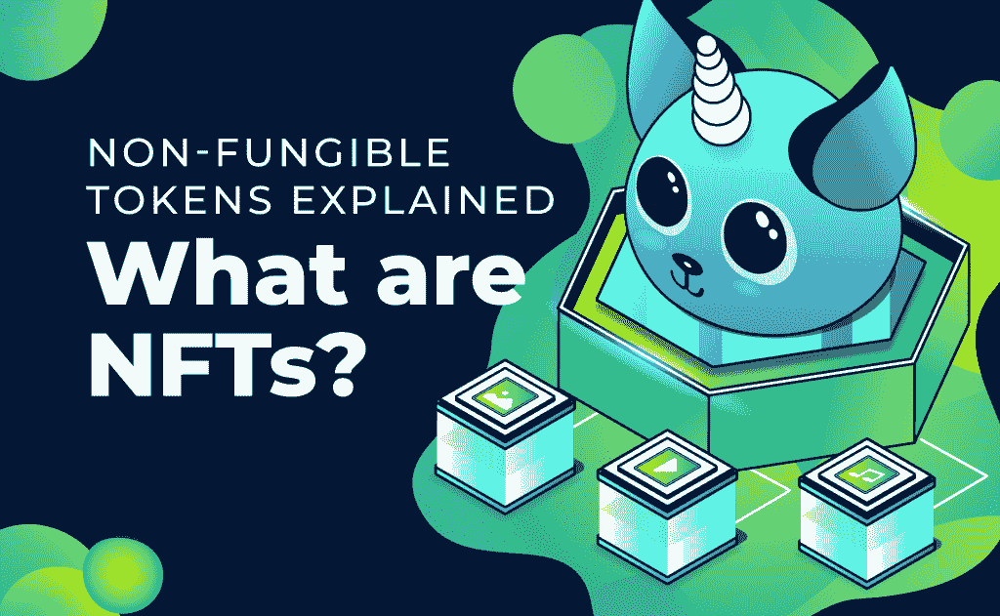
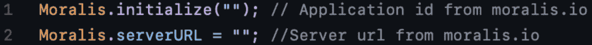
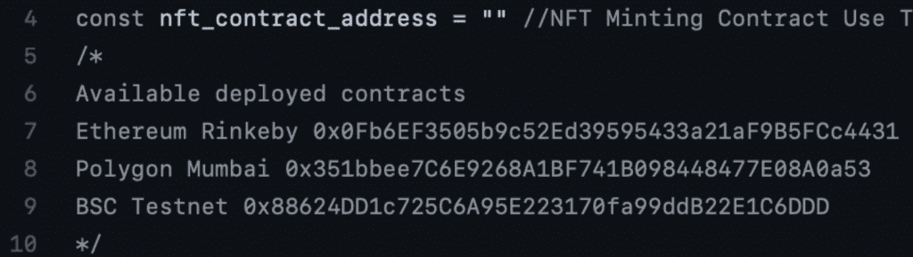
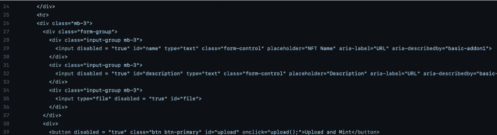
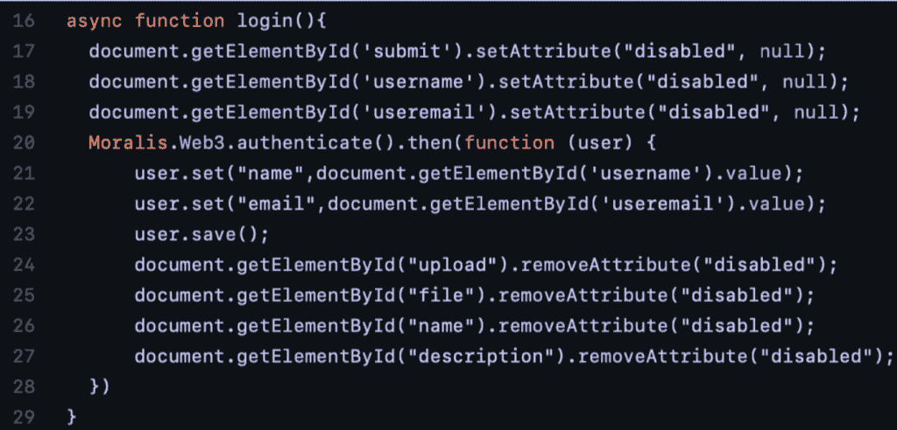
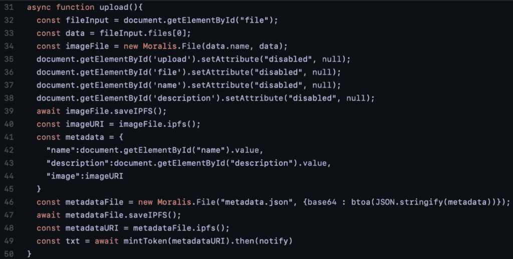
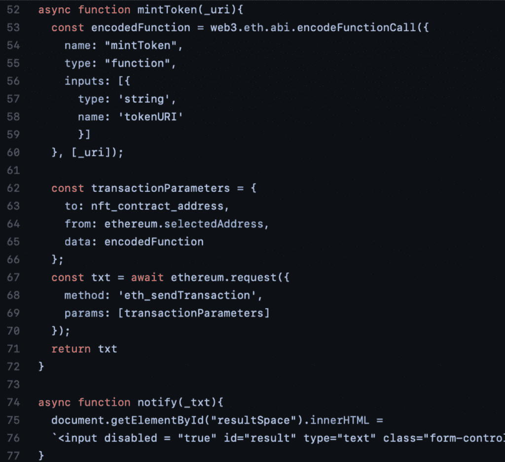

# 如何在 5 个步骤中创建自己的 NFT

> 原文：<https://moralis.io/how-to-create-your-own-nft-in-5-steps/>

NFT，或不可替代的代币，最近大受欢迎。此外，随着 NFT 的概念越来越多地进入主流，NFT 甚至在加密领域之外也获得了发展。从艺术、音乐到迷因，一切都在成为数字资产，以高价出售，在某些情况下，价格高得离谱。使用 Moralis，你甚至可以在五个步骤中创建自己的 NFT！这篇文章将介绍什么是 NFT，以及如何创建一个。这些问题将在本文中得到解答，我们将展示如何通过简单的五个步骤创建自己的 NFT。

[web 3 开发](https://moralis.io/how-to-build-decentralized-apps-dapps-quickly-and-easily/) 可能看起来过于繁琐，而且历来也很复杂。原因是 Web3 开发领域还不完整，因为这个行业缺少一些基本的开发工具。随着我们看到每天都有新的平台和解决方案开发出来，这种情况已经不再存在。然而，首要的 [Web3](https://moralis.io/the-ultimate-guide-to-web3-what-is-web3/) 开发工具是 Moralis。Moralis 是 Web3 开发的头号中间件，该平台为用户提供了完全托管的后端基础设施。此外，Moralis 还具有强大的工具，如[Moralis NFT API](https://moralis.io/announcing-the-moralis-nft-api/)[价格 API](https://moralis.io/introducing-the-moralis-price-api/)[Moralis 快速节点](https://moralis.io/speedy-nodes/) 。

如果你是 Moralis 的老读者，你可能会偶然发现其他文章，如:“ [如何在 10 分钟内创建自己的 ERC-20 令牌](https://moralis.io/how-to-create-your-own-erc-20-token-in-10-minutes/) ”和“ [如何在 5 个步骤中创建 BSC 令牌](https://moralis.io/how-to-create-a-bsc-token-in-5-steps/) ”。然而，在这篇文章中，我们将探索用 Moralis 创造你自己的 NFT 是多么容易。因此，注册 Moralis 是开始你的 Web3 和 NFT 发展之旅的一个很好的方式。您可以免费加入并立即使用该平台的工具！

### 什么是 NFT(不可替换令牌)？

考虑到本节的标题，您现在可能已经明白了“”中的三个字母是“不可替换令牌”的缩写。为了理解它们是什么，一个很好的起点是分析单词。

“不可替代”是一个经济术语，用来描述具有独特属性的物品和商品。例如，在区块链产业中不可替代的普通商品可以是原创歌曲或独特的交易卡。这些是不可互换的物品，因为它们有特殊的属性。因此，NFT 是由其属性而不是其值定义的令牌。

从艺术到迷因，NFT 几乎可以代表任何东西，因为它们是不可替代的，所以完全是独一无二的。为了更清楚地说明这一点，我们可以将 NFT 与可替换令牌进行比较。可替代代币的一些例子是比特币或任何使用 ERC-20 标准的代币。因此，将一个比特币换成另一个比特币是可能的，它们具有完全相同的属性和价值。

从传统的角度来看，数字资产很难确保稀缺性和独特性。然而，有了 Web3 和区块链技术，保持它们的独特性是可能的。此外，使用区块链，还可以确保 NFT 只有一个所有者，并提供所有权证明。

# 如何通过 5 个步骤创建自己的 NFT

要创建一个 NFT，我们先构建一个[【dApp】](https://moralis.io/decentralized-applications-explained-what-are-dapps/)(分散应用)。我们建立的 dApp 将允许任何人通过简单的点击来创建他们自己的 NFT。此外，dApp 将允许用户通过简单地输入姓名和电子邮件地址来创建个人资料。但是，要添加配置文件，应用程序要求用户 [使用元掩码](https://moralis.io/how-to-authenticate-with-metamask/) 进行身份验证。当用户拥有帐户并通过身份验证后，他们就可以开始创建自己的 NFT 了。

要创建 NFT，用户需要输入一个名称、描述并选择一个文件。一旦他们完成了选择，剩下的就是点击“上传并制作”按钮。这将在后台触发一个上传功能，将 NFT 铸造并上传到区块链。在我们的例子中，我们将使用 Ropsten Testnet，但同样的原则也适用于大多数其他区块链。

此外，一旦 NFT 完成并上传，dApp 会将交易 ID 返回给用户。要查看他们的 NFT，他们需要做的就是登录[【OpenSea】](https://opensea.io/)找到他们添加到钱包中的 NFT。这是应用程序的界面外观:

那么，如何创建这样一个 dApp 呢？这个过程可能相当繁重；然而，有了 Moralis，许多功能和简洁的工具唾手可得，这将使这个过程变得快速而简单。我们只需要大约 70 行代码。

我们可以通过以下五个步骤来实现这个目标:

1.  初始化 Moralis，找到智能合约。
2.  创建一个 HTML 索引文件。
3.  做一个简单的登录功能。
4.  创建上传功能。
5.  构建薄荷函数。

为了进一步简化，我们将带您一起仔细观察每一步。

## 步骤 1:如何创建自己的 NFT——初始化 Moralis 并找到智能合同

我们需要做的第一件事是初始化 Moralis。为此，我们需要一个 Moralis 服务器，您可以通过 [登录 moralis.io 的平台](https://admin.moralis.io/login) 并点击界面右上角的“+创建新应用”按钮来设置。选择“Testnet 服务器”选项。现在你必须输入一个名字，选择一个地区，然后选择 Ropsten Testnet。完成后，您需要通过单击服务器的“查看详细信息”按钮找到“应用程序 ID”和“服务器 URL”。

有了这些信息，我们可以用下面的方式初始化 Moralis:

要使我们的 NFT 明廷 dApp 发挥作用，我们需要一个 [智能合约](https://moralis.io/smart-contracts-explained-what-are-smart-contracts/) 。然而，在本文中，我们不打算关注创建智能合约。然而，我们决定为您提供一个已经开发好的智能契约，让您可以简单地在代码中实现。为此，您需要输入以下内容:

如果你想仔细看看智能合约本身，那么它就在 [GitHub 资源库](https://github.com/DanielMoralisSamples/19_MINTNFT) 中。此外，如果你想了解更多关于智能合约的知识，我们建议你看看 Moralis 博客上的这篇文章，这篇文章解释了如何创建智能合约。

## 步骤 2:如何创建自己的 NFT——创建一个 HTML 索引文件

一旦我们初始化了 Moralis 并在代码中实现了智能契约，我们就可以创建一个 HTML 索引文件了。这个文件包含了我们网页上所有字段和按钮的代码。例如，创建一个交互按钮，允许用户使用元掩码登录。此外，我们还需要添加输入用户名，电子邮件地址等字段。

然而，没有必要在这里列出所有的代码和按钮。相反，我们建议您仔细看看 GitHub 的完整文件，这会让您更好地理解代码。但是，这里有一个简短的示例供您立即查看:

这里值得一提的是上图中的最后一行代码，因为它对 dApp 的功能至关重要。正如您所看到的,“Upload and Mint”按钮触发了“Upload()”函数，该函数执行创建和上传 NFT 到区块链的逻辑。

HTML 索引文件完成后，我们可以继续深入了解该应用程序的逻辑，以了解该平台实际上是如何工作的。

## 第三步:如何创建自己的 NFT —登录功能

对于我们流程中的第三步，我们可以返回到[JavaScript](https://moralis.io/web3-and-javascript-what-is-javascript-and-web3-js/)文件，在这里我们初始化了 Moralis 并实现了智能契约。这里，我们将创建一个函数，使我们的用户能够登录并验证自己。这是一个简单的功能，由点击“连接元掩码”按钮的人触发。一旦函数完成，它将看起来像这样:

在点击 dApp 界面中的按钮之前，用户需要输入用户名和电子邮件。如代码所示，一旦调用该函数，这两个字段以及按钮本身都会被禁用。这确保用户不能更改用户名和电子邮件或再次按下按钮。

一旦字段和按钮被禁用，就会触发认证功能。这使用户能够通过 MetaMask 识别自己，meta mask 是 Moralis 中默认启用的功能。当用户通过身份验证后，该函数获取用户名和用户，以添加一个新的用户配置文件，并保存到 Moralis 数据库中。

最后，登录功能还删除了页面其他元素的“禁用”属性，允许用户进行交互并创建自己的 NFT。

## 第四步:如何创建自己的 NFT——上传功能

接下来，我们需要创建上传功能。这就是我们之前提到的函数，当点击 dApp 的“上传和造币”按钮时调用。从整体上看，该函数将如下所示:

该函数的第一部分连接用户上传的文件，并将其捕获到一个数组中。出于这个原因，我们还必须引用这个数组中的第一个元素，这是在第二行代码中完成的。最后，第三行创建一个新的 Moralis 文件对象，这是执行其余函数所必需的。

文件一经创建，用户就不再需要与网页上的按钮和字段进行交互，因此它们通过代码被禁用。

### 与 IPFS 一起保存

现在函数已经创建了文件的 Moralis 对象，可以用(星际文件系统)保存。要保存文件，我们需要做的就是使用下面的命令，它是上面函数的一部分:

这展示了 Moralis 的威力，因为上传文件到 IPFS 只需要一行代码。如果你没有使用 Moralis，上传一个文件到 IPFS 将会非常麻烦，而且是一个非常耗时的过程。

一旦文件被保存到 IPFS，Moralis 将向我们提供文件的散列和 URI 地址(相当于 URL)。因此，可以用两个简单的 Moralis 命令来获取这两者。在上面的例子中，在上传到 IPFS 的那一行下面，我们获取了文件的 URI。

有了文件的 URI，我们可以创建一个包含名称、描述和 URI 的元数据文件，它指的是用户上传的文件。有了这个元数据文件，我们可以创建一个新的 Moralis 对象文件来存储在 IPFS 中。然而，在这种情况下，我们将把对象保存为 JSON 文件。一旦它作为 JSON 文件存储到 IPFS，我们就可以获取元数据 URI，然后在调用“mintToken”函数时使用它。

## 第五步:如何创建自己的 NFT-薄荷函数

创建 NFT 铸币 dApp 的最后一步是创建铸币功能本身。这个函数做的第一件事是创建一个包含编码函数调用的新对象。这样做的原因是，当我们执行智能合约的事务时，有必要包含这样一个函数调用。

一旦建立了编码函数，它将与我们在第一步中添加的智能契约的地址一起被添加到“transactionParameters”对象中。

函数的最后一部分将交易发送到区块链，后者将返回一个交易散列。此外，确认 NFT 已经被打印的交易 ID 被返回给用户。完整的函数大概是这样的:

因此，通过遵循这五个简单的步骤，我们已经能够创建一个 dApp，它可以用来在几秒钟内创建你自己的 NFT。但是，请注意，每次应用程序用于铸造 NFT，我们将被收取少量费用来完成交易。

如果您对本教程仍有疑问，我们推荐您观看以下来自 [Moralis YouTube 频道](https://www.youtube.com/channel/UCgWS9Q3P5AxCWyQLT2kQhBw) 的视频，该视频详细解释了这一过程:

[https://www.youtube.com/embed/WdQHnb_5m5Q?feature=oembed](https://www.youtube.com/embed/WdQHnb_5m5Q?feature=oembed)

## 如何创建自己的 NFT —摘要

NFT 比以往任何时候都更受欢迎，主流媒体也对此产生了兴趣。这并不奇怪，因为其中一些代币已经卖到了数百万美元。然而，即使随着受欢迎程度的增加，许多人仍然不知道这些 NFT 是如何制作的。此外，从传统的角度来看，开发 NFT 是一件非常麻烦的事情，但现在已经不是这样了。

使用 Moralis，创建自己的 NFT 的过程非常简单，我们可以在几分钟内创建一个简单的 NFT minting dApp。该过程由五个步骤组成:

1.  初始化 Moralis，找到智能合约。
2.  创建一个 HTML 索引文件。
3.  制作登录功能。
4.  创建上传功能。
5.  建立你的薄荷功能。

通过遵循这五个步骤，我们可以创建一个 dApp 来根据命令创建我们自己的 NFT。用户需要用元掩码验证自己，并输入名称、描述和文件。一旦完成，剩下的就是上传和制作 NFT，然后可以在 OpenSea 上观看。

然而，创建一个 NFT 印刷 dApp 只是 Moralis 的众多用例之一。例如，如果您正在寻找开发其他 dapp，我们强烈推荐查看这两篇文章:“ [如何创建以太坊 dapp](https://moralis.io/how-to-create-ethereum-dapps/)”和“ [如何轻松构建多边形 dapp](https://moralis.io/how-to-build-polygon-dapps-easily/)”。

此外，既然您已经知道如何创建自己的 NFT，您可能想知道如何利用它们。下面这篇关于“[【NFT 游戏开发](https://moralis.io/nft-game-development-how-to-build-an-nft-game-app-in-minutes/) ”的文章展示了一个很好的例子。因此，如果你想开发 NFT、可替换令牌或 dApps，这并不重要。最快最简单的方法就是通过 [加入今天的](https://admin.moralis.io/register) ！