# 如何开发一个 Web3 网飞克隆

> 原文：<https://moralis.io/how-to-develop-a-web3-netflix-clone/>

在今天的数字时代，VHS 和 DVD 格式早已被遗忘，至少在某种程度上是这样。如今，网飞等在线流媒体服务已成为新的规范。随着网飞成为全球主要和最成功的流媒体服务之一，我们认为说明如何开发 Web3 网飞克隆版将是有益的。你可能已经注意到，创建一个 Web3 网飞克隆是第一个 Moralis 项目的例子。这个网飞的 Web3 克隆版只是你可以接受的许多挑战中的第一个，因为 [**Moralis 工程**](https://moralis.io/projects/) **每周都有新的任务。因此，请务必按照前面的链接注册。然而，现在让我们更深入地研究我们的文章，并发现如何用 Moralis 开发一个 Web3 网飞克隆！**

一个常见的误解是，区块链的发展具有挑战性；但是，不一定很难。当然，仍然有许多开发人员落入了直接在 [RPC 节点](https://moralis.io/ethereum-rpc-nodes-what-they-are-and-why-you-shouldnt-use-them/)之上构建的陷阱。通过这样做，他们面临 RPC 节点的[限制。因此，他们花费大量时间处理后端。然而，与此同时，我们既有初学者也有](https://moralis.io/exploring-the-limitations-of-rpc-nodes-and-the-solution-to-them/)[JavaScript](https://moralis.io/javascript-explained-what-is-javascript/)——精通 Web3 基础知识的程序员可以在几个小时内毫不费力地完成工作。这怎么可能呢？这要感谢[Moralis](https://moralis.io/)——终极 [Web3 后端平台](https://moralis.io/exploring-the-best-web3-backend-platform/)。这个“ [Firebase for crypto](https://moralis.io/firebase-for-crypto-the-best-blockchain-firebase-alternative/) 平台是当前 [Web3 技术栈](https://moralis.io/exploring-the-web3-tech-stack-full-guide/)的巅峰。因此，它解决了您所有与区块链相关的后端需求。因此，如果你想毫不费力地开发一个 Web3 网飞替代品，[创建你的免费 Moralis 账户](https://admin.moralis.io/register)并开始使用。结合我们的指导和“代码”视频，你将在 65 分钟内到达终点。

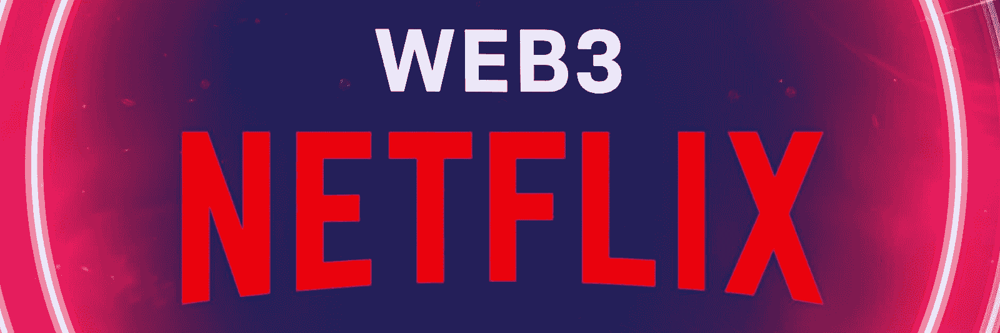

## 用 Moralis 开发 Web3 网飞克隆

使用 [Web3UI 套件](https://moralis.io/web3ui-kit-the-ultimate-web3-user-interface-kit/)、 [React](https://moralis.io/react-explained-what-is-react/) 和 Moralis，我们将开发一个 Web3 网飞克隆，并一步一步地指导你。为了帮助你提前看到大图，我们将从我们完成的 Web3 网飞克隆的快速演示开始。然后，我们将负责初始设置。我们将使用 GitHub 上可用的代码和我们最喜欢的代码编辑器 Visual Studio Code (VSC)做好准备。然后，我们将开始开发一个网飞克隆和实施 Web3。我们将首先专注于为我们的 dapp 创建一个顶部横幅。接下来，我们将重点设置主页。接下来，我们将为带有点击事件的缩略图创建一个模式。作为我们的 Web2 功能的最后一步，我们将为我们的网飞克隆配备一个电影播放器。

随着我们的应用程序基本就绪，是时候添加 Web3 功能了。因此，我们将首先完成[初始 Moralis 设置](https://docs.moralis.io/moralis-dapp/getting-started/create-a-moralis-dapp)。这将使我们能够访问[Moralis SDK](https://moralis.io/exploring-moralis-sdk-the-ultimate-web3-sdk/) 。我们的第一个 Web3 相关的任务将围绕 [Web3 认证](https://moralis.io/web3-authentication-the-full-guide/)。因此，我们将使用 [Moralis 的 Web3 API](https://docs.moralis.io/moralis-server/web3-sdk/intro) 来轻松添加 [Web3 登录](https://moralis.io/how-to-build-a-web3-login-in-5-steps/)。我们还将添加一个用于身份验证的弹出通知。接下来，我们将关注 Moralis 仪表板(数据库)和云功能。此外，我们将创建“我的列表”页面，以确保我们开发一个带有一些很酷的附加功能的 Web3 网飞克隆。对于我们探索的最后阶段，我们将使用 Moralis 的 [IPFS](https://moralis.io/what-is-ipfs-interplanetary-file-system/) 集成，并向您展示如何[上传到 IPFS](https://moralis.io/full-guide-how-to-upload-to-ipfs/) 。所以，如果你还没有创建你的免费 Moralis 账户，现在就创建吧，因为我们将会讲到 Web3 的功能。

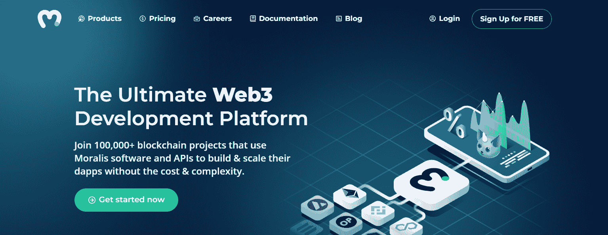

## 开发一个 Web3 网飞克隆–演示

如上所述，让我们来看看我们的 Web3 网飞克隆的演示。我们的示例 dapp 的要点可以在这个屏幕截图中看到:

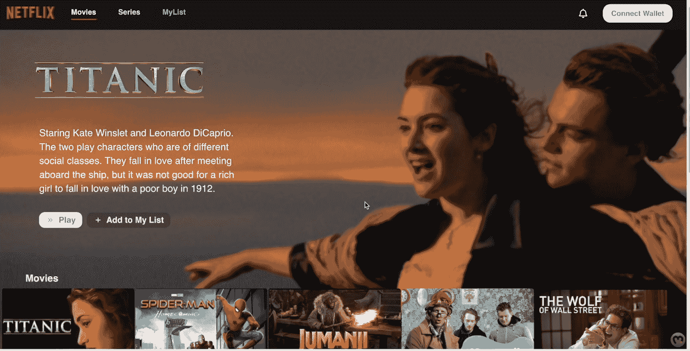

正如你所看到的，我们有“网飞”的标志，然后是顶部的菜单栏。在右上角，我们有“连接钱包”按钮，它负责 Web3 认证过程。在顶部的横幅下面，我们有一个关于可爱的杰克和罗斯的电影的简单例子。此外，我们在底部显示了其他电影的缩略图。当然，潜在用户可以通过点击缩略图来选择这些电影。举个例子，假设他们选择了蜘蛛侠:

从上面的截图可以看到，点击缩略图后会出现相关电影的弹出窗口。在底部，它包含有关电影的详细信息。在中间，有一个带有电影标题的图像。还有“播放”和“添加到我的列表”按钮。然而，我们确保“播放”按钮只对经过认证的用户有效。因此，如果未登录的用户单击该按钮，他们会收到一条通知:

### Web3 网飞用户验证演示

因此，想要使用我们的网飞克隆的用户需要首先登录。幸运的是，他们可以使用他们最喜欢的 [Web3 钱包](https://moralis.io/what-is-a-web3-wallet-web3-wallets-explained/)轻松做到这一点。他们需要关闭上述弹出窗口，然后点击“连接钱包”按钮:

接下来，他们需要选择他们喜欢的加密钱包。让我们假设他们使用[元掩码](https://moralis.io/metamask-explained-what-is-metamask/)。因此，他们的元掩码扩展将提示他们通过单击“签名”按钮来确认登录:

作为用户现在登录的指示，他们将看到他们的余额和地址显示在“连接钱包”按钮之前的位置:

### Web3 网飞电影播放演示

一旦用户通过认证，他们就可以看电影了。如上所示，他们需要通过点击缩略图来选择电影。然后，他们需要点击“播放”按钮，打开电影播放器:

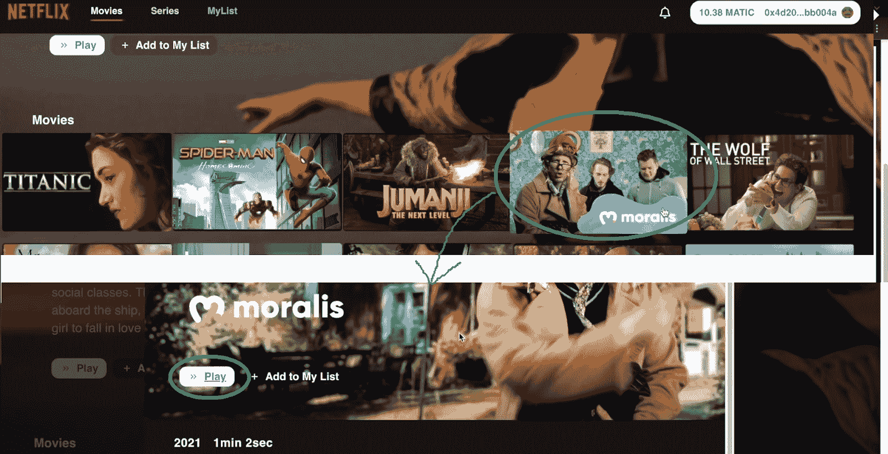

这是我们的电影播放器的样子:

正如你在上面的截图中看到的，底部有一个时间线和其他标准命令。要退出播放器，用户可以使用左上角的“后退”箭头。此外，现在用户已经登录，他们还可以将电影添加到“我的列表”中:

当然，用户可以查看他们添加到列表中的所有电影。他们可以通过点击顶部菜单中的“我的列表”选项来完成:

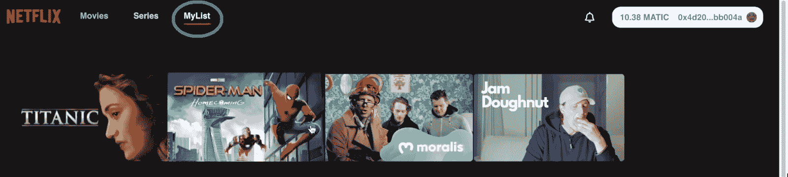

通过点击“我的列表”中电影的缩略图，用户可以进入包含电影详细信息的弹出窗口。

我们的 Web3 网飞克隆演示到此结束。我们希望你对结果留下深刻印象，并兴奋地卷起袖子，学习开发自己的 Web3 网飞克隆。尽管如此，如果你更喜欢视频，请确保使用本文末尾的视频(0:40)。

## 开发 Web3 网飞克隆版——继续跟进

为了充分利用这个示例项目，我们建议使用我们的[启动代码](https://github.com/MoralisWeb3/youtube-tutorials/tree/main/Netflix-Starter)(“网飞启动”)。通过这样做，你将需要实现必要的代码，按照我们的领导。不过，如果你想要一个额外的快捷方式，你也可以访问 GitHub 上的[完成代码](https://github.com/MoralisWeb3/youtube-tutorials/tree/main/Netflix-Decentralized)。

*注意* *:下面的指令假设你是从“网飞-启动器”代码开始的。*

### 开发一个网飞 Web3 克隆-示例项目的初始设置

我们将从克隆启动代码(来自 GitHub)并打开 VSC 开始。在 VSC 内部，输入“git clone”命令，后跟代码库的 URL:

然后，您希望将“cd”放入“网飞-Starter”文件夹并安装所有依赖项:

现在，您已经可以访问“src”文件夹了，所有的初始编码文件都在那里等着您:

您有“index.js”和“App.js”文件，其中包含了从头开始所需的一切。例如，“index.js”包含 React 路由器和通知提供者。此外，这也是您需要粘贴 Moralis 服务器详细信息的地方:

在“App.js”中，我们有两个初始路径——“主页”和“玩家”页面:

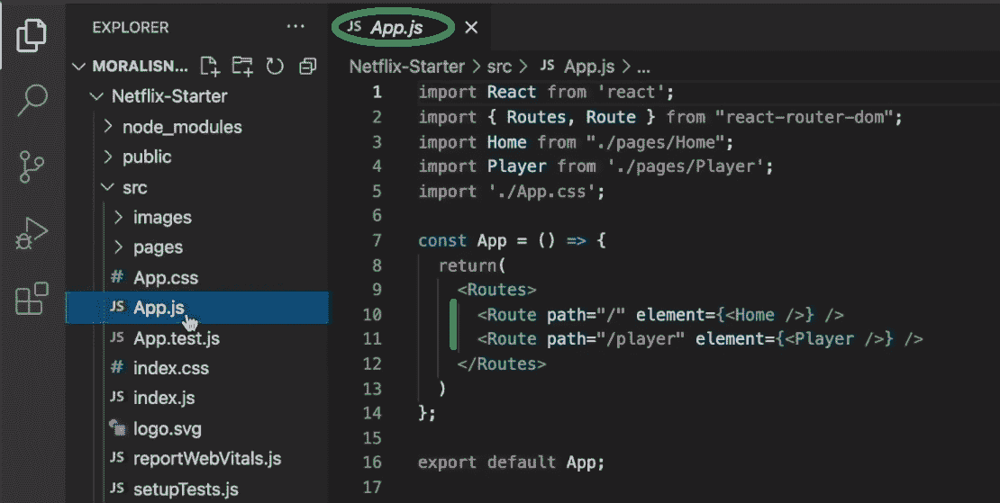

此外，在“pages”文件夹中，您可以找到“Home.js”和“Player.js”文件。它们对应于上面的两个页面，并将它们链接在一起:

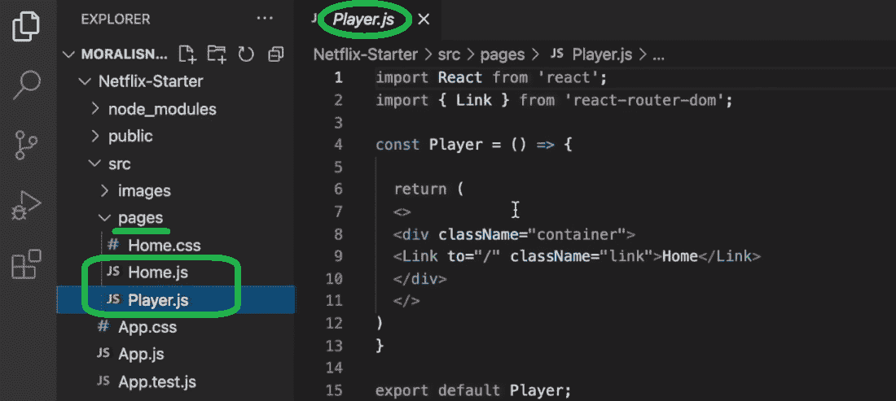

尽管如此，如果你想看看你的空白画布是什么样子，使用“纱线开始”命令:

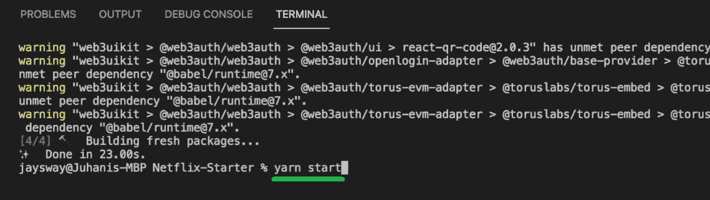

如您所见，您有两个交叉链接的空白页:

这就完成了初始项目设置。现在你已经准备好卷起袖子开发一个 Web3 网飞克隆版了。当然，在下面的视频中，会有一位 Moralis 专家指导你。有相当多的内容需要介绍，所以我们决定利用接下来的部分来快速预览这些步骤。当然，我们强烈建议您使用视频教程进行更深入的研究。

### 打造 Web3 网飞克隆版的顶级旗帜

从 04:03 开始，您将开始为我们的示例项目创建顶部横幅。这是网飞标志和顶部菜单将被包括在内(按照上述演示)。在这里，您将依赖于“images”文件夹，其中也有“Netflix.js”文件。您将首先导入徽标，并开始使用提供的“home.css”文件进行漂亮的设计:

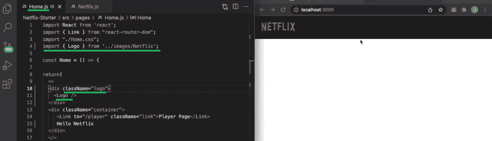

接下来，您将添加“连接钱包”按钮和其他顶部菜单选项。这就是你依赖 Moralis 的 Web3UI 套件的地方:

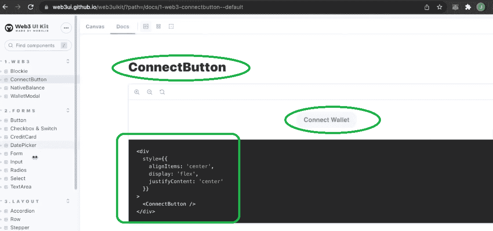

### 创建 Web3 网飞主页

在下面视频的 10:31，你将开始为主页构建内容。这包括缩略图、描述和其他详细信息。为此，您将创建“library.js”文件，该文件将包含除电影之外的所有内容。它们将以分散的方式存储在 IPFS 上。准备好“library.js”文件后，您就可以将具体细节拖到“home.js”中，并在主页上显示相关内容:

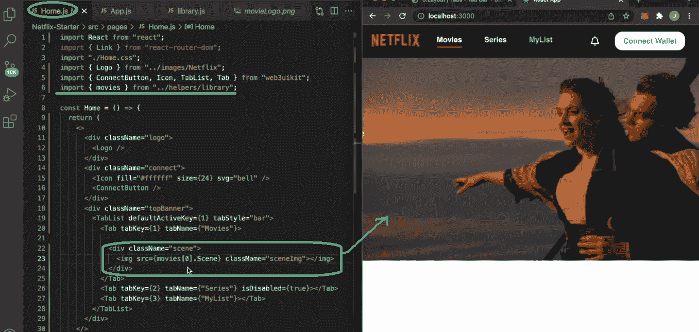

按照下面视频中的详细说明，你很快就能准备好自己的主页:

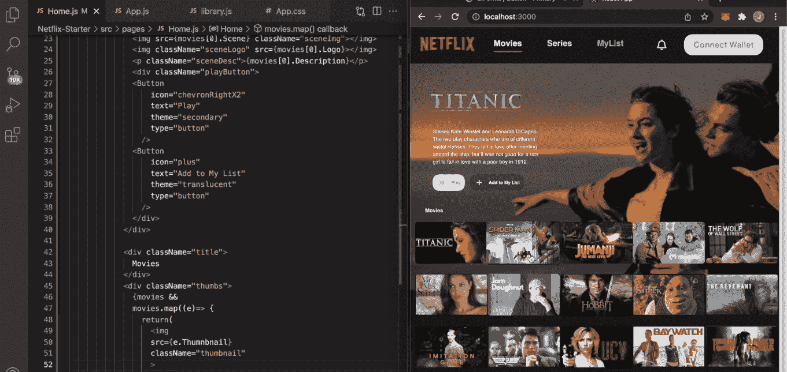

### 添加模式和电影播放器

如果你还记得上面的演示，你就知道要正确开发一个 Web3 网飞克隆，我们还需要跟踪哪个缩略图被点击了。因此，我们需要创建一个单击缩略图后出现的模态。此外，模态中显示的内容需要与单击的缩略图相对应。因此，您将创建点击事件。为了深入了解我们示例项目的这一部分，请使用下面从 19:57 开始的视频。

此外，模态设置就绪后，您需要确保“Play”按钮正常工作。因此，您会希望它链接到“播放器”页面，并确保电影自动开始播放。详细指导在视频 27:13 等你。

### 开发一个 Web3 网飞克隆——后端

32:18，视频将向您展示如何创建 Moralis 服务器。因此，您将能够连接到最终的 Web3 SDK。然后，您将设置用于身份验证目的的弹出通知。此外，您还将学习如何访问 Moralis 仪表板以及如何使用云功能(39:51)。然后，在 49:30，您将被引导向“我的列表”页面添加内容。最后，同样重要的是，您将学习如何上传文件到 IPFS (56:56)。

这是我们在整篇文章中引用的视频教程:

https://www.youtube.com/watch?v=cPjnjxmLS5k

## 如何开发 Web3 网飞克隆版–总结

至此，您已经知道如何在一个多小时内开发一个 Web3 网飞克隆。您知道，通过使用我们的模板代码，您可以轻松到达终点。如果你自己承担了我们的示例项目，你会在这个过程中学到很多。除了完成初始设置，您现在已经清楚地了解了 React 应用程序的功能。此外，您知道如何使用 Moralis 添加 Web3 功能，进而将应用程序转变为 dapps。最终，你手上也有了一个真正的 Web3 网飞克隆版。我们鼓励你把这个项目做得更好。例如，你可以添加订阅计划到你的 Web3 网飞克隆版。当然，订阅应该以加密方式支付。使用 Moralis 的 SDK 可以轻松添加这一特性和许多其他特性。

如果您喜欢这个示例项目，请务必查看我们的其他教程。例如，你可以学习[如何构建 Web3 Spotify 克隆](https://moralis.io/how-to-build-a-web3-spotify-clone/)，如何[创建比特币基地克隆](https://moralis.io/cloning-coinbase-wallet-how-to-create-a-coinbase-clone/)，如何[为 Web3 创建 Reddit 克隆](https://moralis.io/create-a-reddit-clone-for-web3-step-by-step-guide/)，以及如何[创建 OpenSea 克隆](https://moralis.io/create-an-opensea-clone-build-an-nft-marketplace-like-opensea/)。此外， [Moralis YouTube 频道](https://www.youtube.com/c/MoralisWeb3)和 [Moralis 博客](https://moralis.io/blog/)包含其他优秀的教程和各种加密概念的解释。一些最新的话题包括 Web3 游戏的[好处](https://moralis.io/benefits-of-web3-gaming-full-breakdown/)，如何[创建一个 ETH 钱包](https://moralis.io/how-to-create-an-eth-wallet-full-guide/)或[多链钱包](https://moralis.io/how-to-build-a-multi-chain-wallet-in-5-steps/)， [Web3 元宇宙](https://moralis.io/web3-metaverse-how-do-web3-and-the-metaverse-fit-together/)， [NFT 加电](https://moralis.io/develop-a-web3-game-with-nft-power-ups-in-9-minutes/)，[定义赌注](https://moralis.io/what-is-defi-staking-full-guide/)，构建一个[元宇宙游戏](https://moralis.io/how-to-build-a-metaverse-game-in-25-minutes/)，[与 Web3 数据库通信](https://moralis.io/how-to-communicate-with-a-web3-database-from-unity/)，[为什么 Web3 很重要](https://moralis.io/why-is-web3-important-a-beginners-guide/)

这两个出口都可以作为你的免费继续加密教育。然而，如果你想[成为一名 Web3 开发者](https://moralis.io/how-to-become-a-web3-developer-full-guide/)并且尽快成为全职加密员，你应该考虑一种更专业的方法。因此，你可能想报名参加[Moralis 学院](https://academy.moralis.io/)。