# 如何开发 NFT 稀有等级 dApp

> 原文：<https://moralis.io/how-to-develop-an-nft-rarity-ranking-dapp/>

**如果说 2021 年密码领域有一个特别的领域最耀眼，那肯定是******。不可替代的代币已经像疯了一样起飞，似乎没有停止 NFT 炒作。尽管如此，我们仍然处于游戏的早期，今天是在 NFT 真正成为主流应用之前了解更多的好时机。然而，球正在滚下山，越来越多的公司和有影响力的人开始注意到这一点。因此，在未来几年，我们可以期待与非功能性测试相关的无数机会。此外，有一种特殊类型的 NFTs 往往会吸引人们的注意力 NFTs 收藏品。此外，后者有一个特殊的性质，我们将在这里讨论-NFT 稀有。****

**以 NFT 最受欢迎的收藏品之一 Bored Ape Yacht Club 为例，我们将向您展示如何[创建一个 NFT 市场](https://moralis.io/how-to-create-an-nft-marketplace/)，根据 NFT 的稀有程度对特定收藏品中的 NFT 进行排名。为了完成我们的壮举，我们将严重依赖最终的 Web3 开发平台 [Moralis](https://moralis.io/) (又名 [Firebase for crypto](https://moralis.io/firebase-for-crypto-the-best-blockchain-firebase-alternative/) )。后者将让我们访问 [ultimate Web3 SDK](https://moralis.io/exploring-moralis-sdk-the-ultimate-web3-sdk/) ，包括 [NFT API](https://moralis.io/ultimate-nft-api-exploring-moralis-nft-api/) ，这将使我们能够使用简短的代码片段来覆盖与区块链相关的后端编程。关于 Moralis 最好的一点是，任何精通 JavaScript 并且知道如何使用元掩码的人都可以毫不费力地成为区块链开发者。也就是说，我们邀请你跟随我们的领导，亲自参与我们的示例项目，从这篇文章中获得最大收益，从而确保你学会正确地使用 NFT 稀有元素。**

**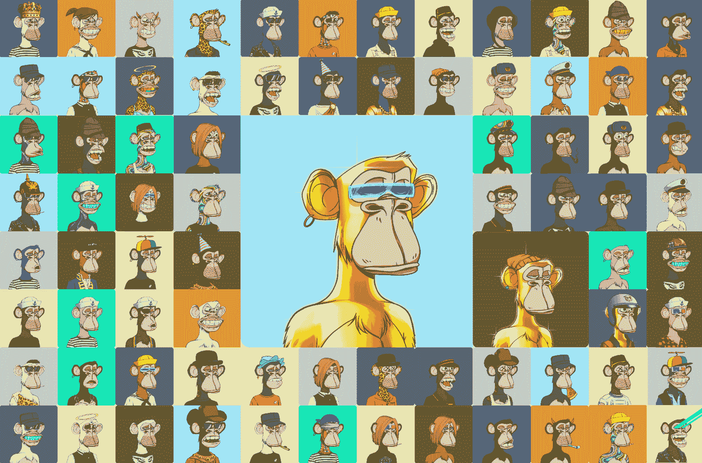

## 什么是 NFT 稀罕物？

NFT 有许多使用案例和类型，在某些情况下，稀有性并不适用。例如，当独一无二的 NFT 艺术品受到质疑，而只有一件 NFT 创作的复制品时，那种和平是完全独一无二的。然而，如果我们把重点放在可收集的 NFT 上，特别是通过使用特定物品或特征(以 PNG 层的形式)来创建这些层的随机组合而产生的那种集合，NFT 稀有性就相当重要了。某一层的组合或外观越罕见，NFT 的稀有程度就越高。

接下来，我们将进行一个示例项目，您将有机会创建自己的 NFT 稀有度排名 [dApp](https://moralis.io/decentralized-applications-explained-what-are-dapps/) (分散式应用)。为此，我们创建了自己的稀有度计算公式。而且，通过仔细观察这个等式，你会对 NFT 稀有度以及如何使用它有一个清晰的理解。

# 我们的 NFT 稀有度排名 dApp 预览

在我们深入研究 NFT 稀有度计算公式和这个例子 dApp 的创建之前，让我们先来预览一下我们完成的稀有度排名器。看下面的截图，你可以看到我们的 NFT 稀有度排名 dApp。正如上面所承诺的，它专注于 Bored Ape Yacht Club NFT 系列，该系列总共包括 10，000 个 NFT，它对所有 NFT 进行排名，然后将它们从最稀有(稀有度最高的一个)到最不稀有(稀有度最低的一个)进行排列。

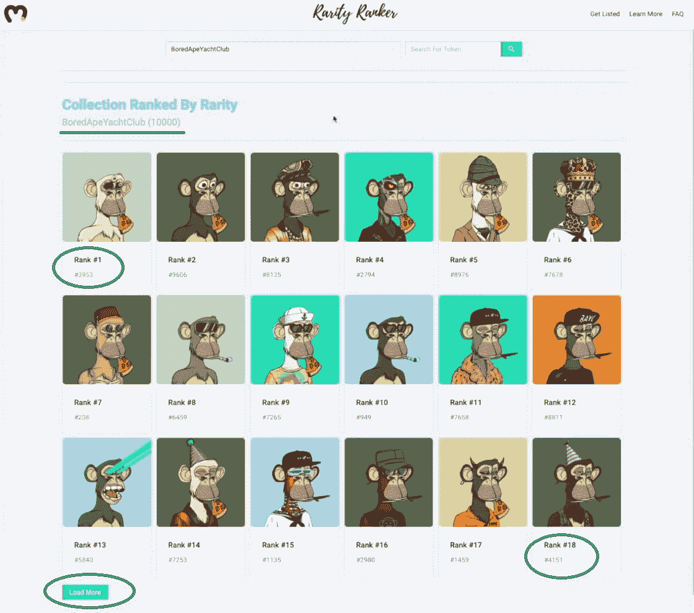

此外，我们的示例 dApp 还带有“加载更多”按钮，可以加载更多的 NFT。此外，它还允许用户选择其他 NFT 集合(只要一个集合遵循提供其组件所有细节的适当元数据结构)，并使用搜索栏快速访问特定的 NFT。此外，要查看 NFT 稀有度的详细信息，用户需要点击任意一个 NFT:

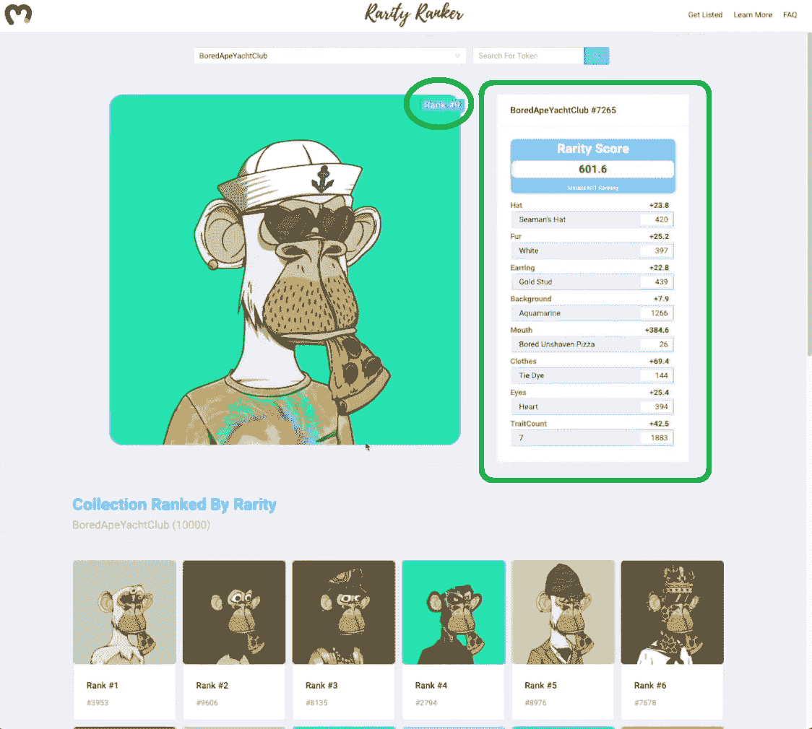

如你所见，稀有分数的详细信息显示在有问题的 NFT 旁边。对整体稀有度得分有贡献的每个因素本质上都是最终结果图像的特定层。每一层的分数是根据我们的等式(如下所示)计算的，而该层的每个特定属性旁边的数字显示了总共 10，000 个 NFT 中有多少个拥有该属性。

下面是另一个截图示例，我们选择了不同的 NFT 系列。它遵循与上述相同的原则。

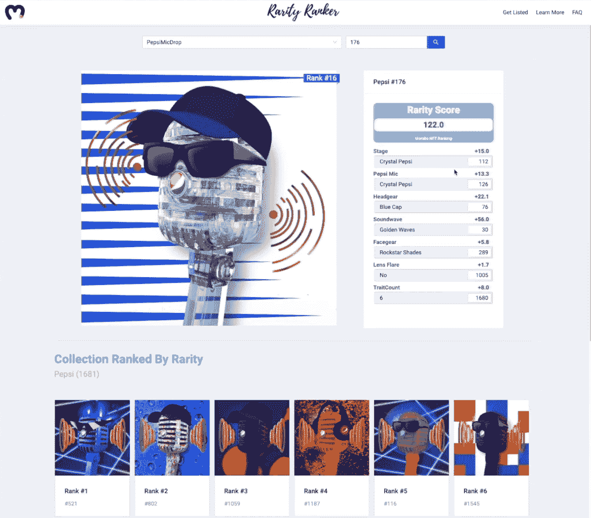

## 如何计算 NFT 的稀有度？

如前所述，有许多不同的选项来计算 NFT 稀有度。只要你始终如一，就可以用对你最有意义的方程。然而，我们相信你将在这里学到的方法非常有效。首先，它确保了最稀有的 NFT 得到最高分，而且也非常简单。

无论何时你想计算 NFT 稀有度，你都需要知道一个特定收藏的细节。你需要知道不同特征(层次)的数量，集合中非功能性物品的总数，以及有多少非功能性物品拥有特定的特征或属性(背景的颜色，毛皮的类型，帽子的类型，嘴的形状，眼睛或眼镜的类型，等等)。).在我们的示例中，我们关注 Bored Ape Yacht Club (BAYC ),它总共有 10，000 个 NFT，所有这些 NFT 都是使用七层随机创建的(有些 NFT 的某些顶层是空的)。为了确保你们都清楚地了解 NFT 稀有的概念，让我们来看看 BAYC 系列中的一件特别的 NFT:

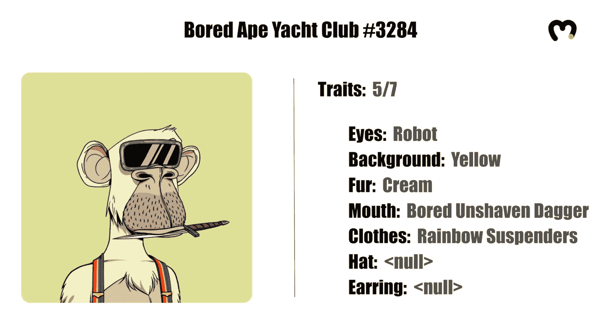

正如你在上面的图片中看到的，这只特殊的 NFT (#3284)有七种特征中的五种(层次)。正是 NFT 的元数据为我们提供了这些细节。此外，元数据也是总共有多少个非功能性测试拥有特定属性(例如:机器人眼睛)的细节。

### 我们的 NFT 稀有方程

接下来，我们在示例项目中计算 NFT 稀有度的要点如下:

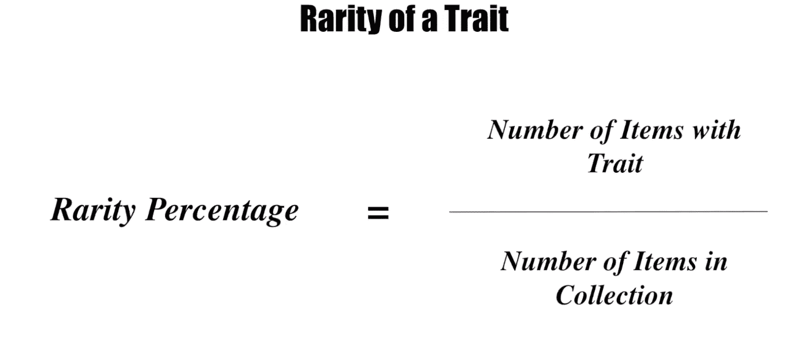

上面的等式为我们提供了七个特征中每一个的稀有百分比。因为这给我们提供了一个线性的结果，每个个体特征的权重是不合适的。幸运的是，我们可以通过使用相反的值来解决这个问题:

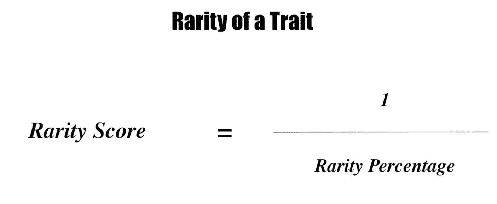

通过这种方式，我们可以得到稀有性分数和稀有性百分比之间的反比关系，从而确保稀有性状得到适当更高的稀有性分数:

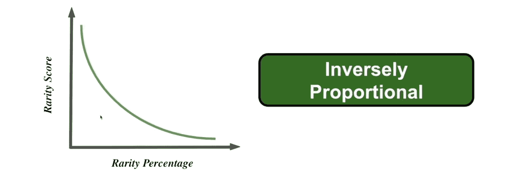

让我们将这个等式用于上面的 NFT:

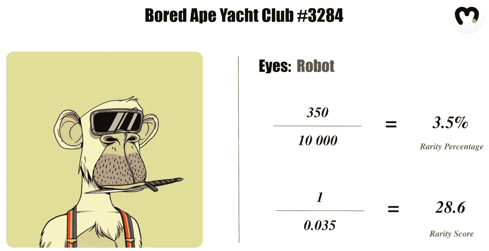

由于在 BAYC 系列中总共有 350 个有机器眼的 NFT，这个特殊属性得到 3.5 %的稀有百分比，这导致稀有分数为 28.6。当然，要得到总分，我们需要把所有的特征放在一起:

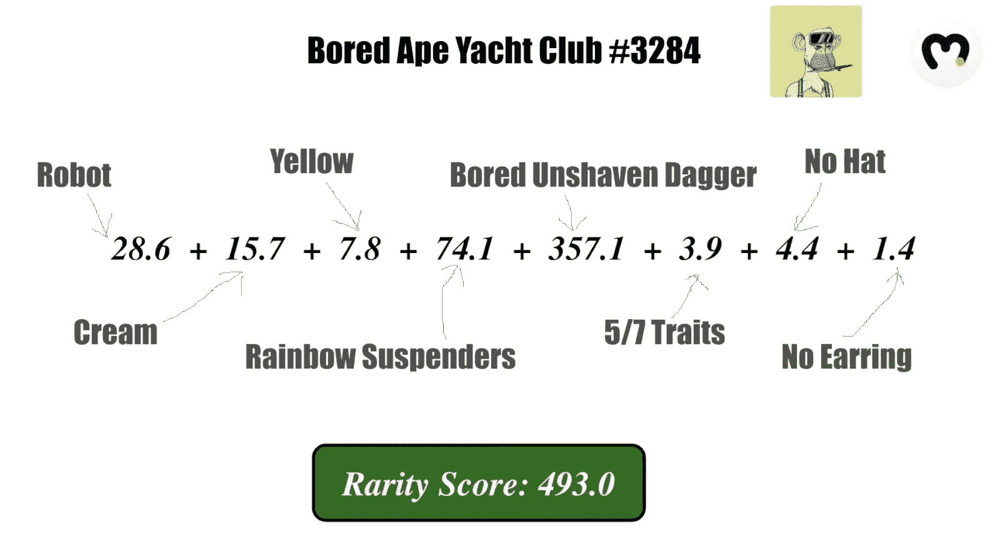

看着上面的图片，你可以看到我们甚至考虑了它的特征数量，结果发现许多 BAYC NFTs 有 7 个特征中的 5 个。此外，他们中的许多人没有帽子或耳环，因此我们的例子 NFT 得到了这些属性的低稀有分数。为了得到最终的 NFT 稀有度分数，我们只需将每个特征的稀有度分数相加。

## 与 Moralis 家一起开发 NFT 稀有等级 dApp

既然您已经清楚地了解了如何计算 NFT 稀有度，以及我们将要构建什么，那么是时候卷起袖子开始编码了。你可以跟随我们的领导，从头开始，或者你可以使用我们在 [GitHub](https://github.com/IAmJaysWay/Rarity-Ranking-NFT) 上提供的代码。正如上面所承诺的，我们将使用 Moralis 来极大地加速这个过程。此外，Moralis 在其核心中内置了跨链互操作性，这意味着您可以在多个链上轻松部署 dApps。当然，在 NFTs 的情况下，你需要把重点放在作为特定集合的家的链上(BAYC 集合基于[以太坊](https://moralis.io/full-guide-what-is-ethereum/))。要使用 Moralis 的 SDK，您需要创建您的免费帐户和一个 Moralis 服务器。要完成这个简单的设置，请遵循下面小节中提供的说明。

### 初始设置–创建 Moralis 服务器

无论你是想使用 Moralis 来开发 NFT 稀有等级 dApp 还是其他任何 dApp，你都需要从创建一个 Moralis 服务器开始。要正确做到这一点，您应该遵循以下步骤:

1.  [**创建您的免费 Moralis 账户**](https://admin.moralis.io/register)–点击链接进入注册页面，在这里您需要输入您的电子邮件地址并创建您的密码。此外，不要忘记点击确认链接，这将发送到您的电子邮件。另一方面，如果你已经有一个 Moralis 账户，只需[登录](https://admin.moralis.io/login)到你的管理区。

2.  [**创建一个 Moralis 服务器**](https://docs.moralis.io/moralis-server/getting-started/create-a-moralis-server)–登录到您的 Moralis 管理区域后，进入“服务器”选项卡(导航选项卡的左侧)。进入该选项卡后，单击右上角的“+创建新服务器”按钮。然后从下拉菜单中选择最适合您需求的网络类型(见下图)。*在示例项目的情况下，我们建议选择“Testnet 服务器”选项(* [*连接到以太坊 Testnet*](https://moralis.io/ethereum-testnet-guide-connect-to-ethereum-testnets/)*)。但是，由于 BAYC 是以太坊 mainnet 上的一个活动项目，所以选择“Mainnet 服务器”。*

在出现的弹出窗口中，输入服务器名称(可以是您想要的任何名称)，选择您所在的地区，选择网络类型、链，并通过单击“添加实例”按钮启动您的服务器:

3.  **访问服务器详细信息**–创建好服务器后，您可以通过点击“查看详细信息”按钮来访问其详细信息:

这样，你需要的所有信息都会显示在一个新窗口中。然后，您可以通过单击复制图标来复制这些详细信息(一个接一个):

4.  **初始化 Moralis** *(在您克隆我们的 GitHub 代码或创建您自己的文件后执行此操作)*–使用 Moralis 服务器详细信息(应用程序 ID 和服务器 URL)填充您的编码文件:

### 代码走查

既然已经设置好了 Moralis 的服务器，就可以开始编码了。我们需要做的第一件事是获得 NFT 系列(BAYC)的所有连锁信息。为此，请务必在 7:30 开始观看下面的视频，在那里，Moralis 专家将带领您完成所有步骤。他将使用我们选择的代码编辑器，Visual Studio Code(VSC)；但是，请随意使用最适合您的产品。

首先，他将创建“main.js”文件并安装所有必需的依赖项。然后，他将相应地插入我们的 Moralis 服务器的详细信息(按照上面第 4 步的指示)。请记住，您需要使用服务器的详细信息。接下来，他将向您展示如何提供 BAYC NFT 系列的地址以及如何创造稀有性。后者将包括获取集合中所有不可替换的令牌，在这里，您已经可以通过使用“getAllTokenIds()”代码片段看到 Moralis 的强大功能。

接下来(下面 15:30 的视频)，您将能够看到如何使用上面获得的 NFT 收藏的元数据来创建 NFT 稀缺性生成器。通过使用简单的“for”循环和上面提到的 NFT 稀有方程，可以得到很多解。在 36:12，你将了解到使用 Moralis 的仪表板(数据库)存储现在排名的 NFT 收藏是多么容易。然后，您将了解如何在 39:15 使用终极 [Web3 样板](https://moralis.io/web3-boilerplate-beginners-guide-to-web3/)在几分钟内创建 UI。为了进一步研究你的 NFT 稀有度 dApp，Moralis 专家也会用 rarity.tools (42:00)做一个快速比较。

https://www.youtube.com/watch?v=TXpfRRHwjak

## 如何开发 NFT 稀有度排名 dApp 总结

我们今天已经讨论了相当多的内容，如果你自己也参与了这个示例项目，现在你就有了自己的 NFT 稀有度排名 dApp。您还学习了如何计算 NFT 稀有度，以及如何使用 Moralis 来满足与区块链相关的后端编程需求。因此，您现在知道如何设置 Moralis 服务器，这是您快速轻松地进行 dApp 开发的通行证。您还知道如何使用 Moralis 的 NFT API 和 Moralis 数据库轻松处理实时链上数据。

此外，如果您喜欢这个示例项目，我们建议您查看一下 [Moralis 的 YouTube 频道](https://www.youtube.com/c/MoralisWeb3)和 [Moralis 的博客](https://moralis.io/blog/)，在那里我们涵盖了许多其他 [NFT 令牌开发](https://moralis.io/nft-token-development-the-ultimate-guide/)项目，包括如何[构建 NFT 交易界面](https://moralis.io/build-an-nft-trading-interface-full-guide/)，如何使用 [OpenSea API 替代方案](https://moralis.io/opensea-api-alternative-list-nfts-with-this-opensea-plugin/)，如何[生成不可替换的令牌](https://moralis.io/nft-generate-and-mint-how-to-generate-non-fungible-tokens/)，关于 [NFT 游戏开发](https://moralis.io/nft-game-development-how-to-build-an-nft-game-app-in-minutes/)的详细信息，等等。然而，如果你刚刚开始，你可能会对[初学者 NFT 编程](https://moralis.io/nft-programming-for-beginners/)最感兴趣。此外，我们还涵盖了区块链发展的其他方面。例如，我们最新的主题向您展示如何[在 Angular](https://moralis.io/how-to-build-ethereum-dapps-in-angular/) 中构建以太坊 dApp，解释[闪贷如何工作](https://moralis.io/how-do-flash-loans-work-full-walkthrough/)，教您如何在以太坊上进行[无气体交易，如何](https://moralis.io/how-to-do-gasless-transactions-on-ethereum/)[构建跨链桥](https://moralis.io/how-to-build-a-cross-chain-bridge/)，如何[构建预测市场 dApp](https://moralis.io/how-to-build-a-prediction-market-dapp/) ，如何[在几分钟内创建 DAO](https://moralis.io/how-to-create-a-dao-in-10-minutes/) ，如何[使用 MetaMask 启动 Web3 应用](https://moralis.io/metamask-for-developers-how-to-launch-web3-apps-with-metamask/)

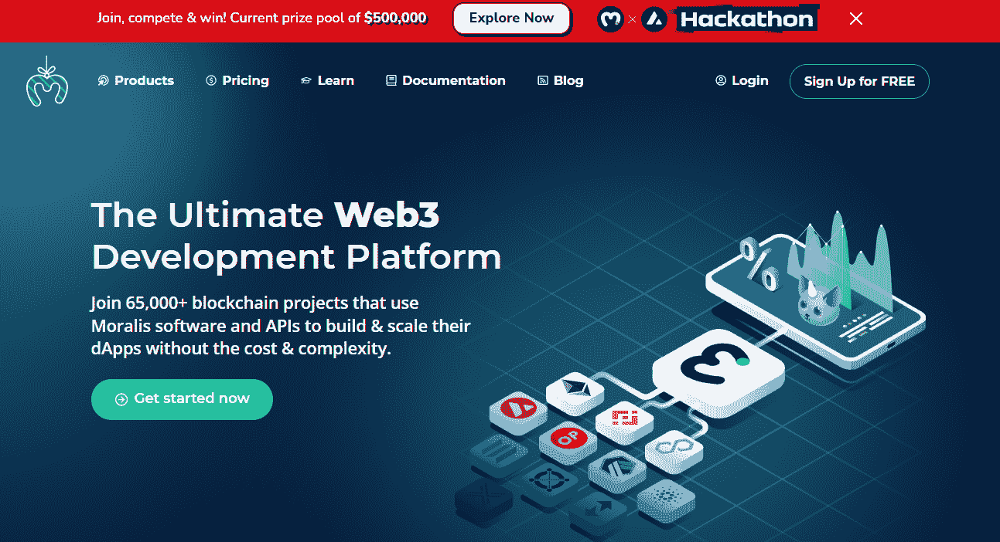**