# 如何用 Unity 做区块链游戏交易

> 原文：<https://moralis.io/how-to-do-blockchain-game-transactions-with-unity/>

Web3 游戏是一个巨大的行业，其用户群每天都在增长。[**【web 3】**](https://moralis.io/the-ultimate-guide-to-web3-what-is-web3/)**和参与区块链游戏的玩家相对于“常规”Web2 游戏的指数增长可能是由于区块链游戏的分散方面和盈利潜力。另外，拥有游戏中的资产并把它们转换成现金也是非常有益的。然而，执行区块链游戏事务的特性是开发者发现在他们的项目中实现具有挑战性的东西，例如在**[**web 3**](https://moralis.io/build-a-web3-mmorpg-with-unity-in-10-minutes/)**游戏中。幸运的是，当使用正确的**[**Web3 tech stack**](https://moralis.io/exploring-the-web3-tech-stack-full-guide/)**工具时，用 Unity 实现 web 3 事务变成了一个简单的过程。多亏了** [**【Moralis 家】的元宇宙 SDK**](https://moralis.io/metaverse/) **，你只需点击几下鼠标和一些基本的设置就能覆盖区块链的游戏交易。**

接下来，您将看到如何在几分钟内用 Unity 实现 Web3 事务。我们将使用我们现有的项目之一，一个简单的 MMORPG，并添加这个额外的功能。然而，即使你还没有完成过去的例子项目，你也不会有任何问题。我们将向您展示如何使用 GitHub 访问您需要的代码和文件。此外，您还将学习如何完成初始的[Moralis 规范](https://moralis.io/)设置。这样，你就可以获得这个“ [Firebase for crypto](https://moralis.io/firebase-for-crypto-the-best-blockchain-firebase-alternative/) ”平台的全部能力。

此外，为了这个例子，我们将把重点放在 WebGL 平台上。因此，我们将使用适当的 [Web3 认证](https://moralis.io/web3-authentication-the-full-guide/)方法。尽管如此，我们强烈建议您不仅通读这篇文章，还要采取行动。自己实现这里的步骤！这样，你将从这次经历中获得最大的收获，并学会设置区块链游戏交易。

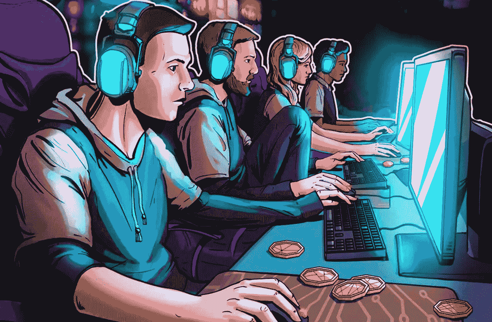

## Unity 让区块链游戏交易变得简单

在接下来的章节中，我们将详细介绍将区块链游戏交易添加到 Web3 MMORPG 游戏中所需要知道的一切。因为你可以使用我们的代码，所以你可以在大约十五分钟内完成。在此过程中，您还将学习如何完成 Moralis 和 Photon 的必要设置。前者将涵盖你所有与区块链相关的后端需求，后者将是你的多人游戏解决方案。然而，在我们进入 Unity 内部的设置和调整之前，让我们快速预览一下我们的 Web3 游戏示例。

## 区块链游戏交易活动–Unity dApp 预览示例

这是用户首先看到的登录屏幕:

在上面的截图中，你可以看到我们的游戏例子是从登录用户开始的。虽然有各种各样的方法可以做到这一点，但我们决定用元掩码对[进行认证。后者是网络用户的最佳选择。为了进行身份验证，用户需要点击“登录”按钮，然后使用他们的](https://moralis.io/how-to-authenticate-with-metamask/) [Web3 钱包](https://moralis.io/what-is-a-web3-wallet-web3-wallets-explained/)确认他们的 [Web3 登录](https://moralis.io/how-to-build-a-web3-login-in-5-steps/)。

*另一种简洁的方式是创建一个二维码登录码，来实现* [*Web3 用户登录*](https://moralis.io/how-to-boost-web3-user-onboarding-success-rates/) *。这样，用户可以使用他们的设备简单地扫描代码。幸运的是，所有这些选项都是由* [*Moralis 的 SDK*](https://moralis.io/exploring-moralis-sdk-the-ultimate-web3-sdk/) *及其集成提供的。* [*元掩码*](https://moralis.io/metamask-explained-what-is-metamask/) *是网络用户的最佳解决方案，而*[*wallet connect*](https://moralis.io/what-is-walletconnect-the-ultimate-walletconnect-guide/)*最适合移动用户。不过，值得注意的是，用户可能更喜欢熟悉的 Web2 登录方法。由此，Moralis 也使得* [*Web3 认证通过*](https://moralis.io/how-to-do-web3-authentication-via-email/) *和* [*Web3 社交登录*](https://moralis.io/web3-social-login-sign-in-dapp-users-with-google-email-or-twitter/) *成为可能。*

继续我们的演示；一旦新用户登录，他们就有机会通过点击“加入房间”按钮加入游戏:

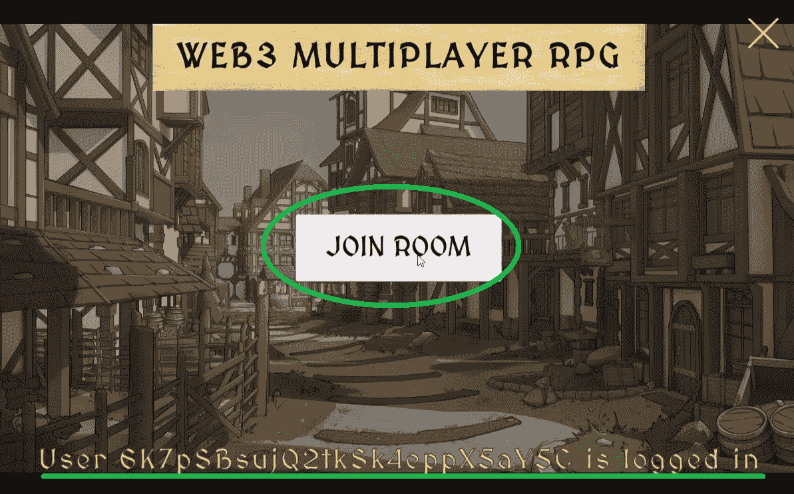

看上面的图像，你还可以在屏幕底部看到一条消息。后者通知用户，他们登录成功，他们的钱包地址现在已连接到游戏。因此，他们可以加入游戏。一旦用户点击“加入房间”按钮，“游戏”场景加载:

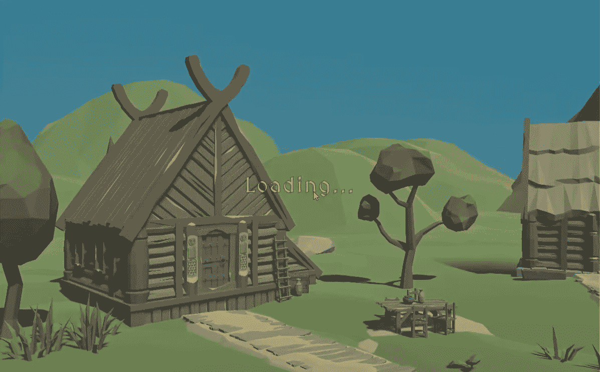

此外，游戏还为用户随机分配角色，这些角色将被放入场景中:

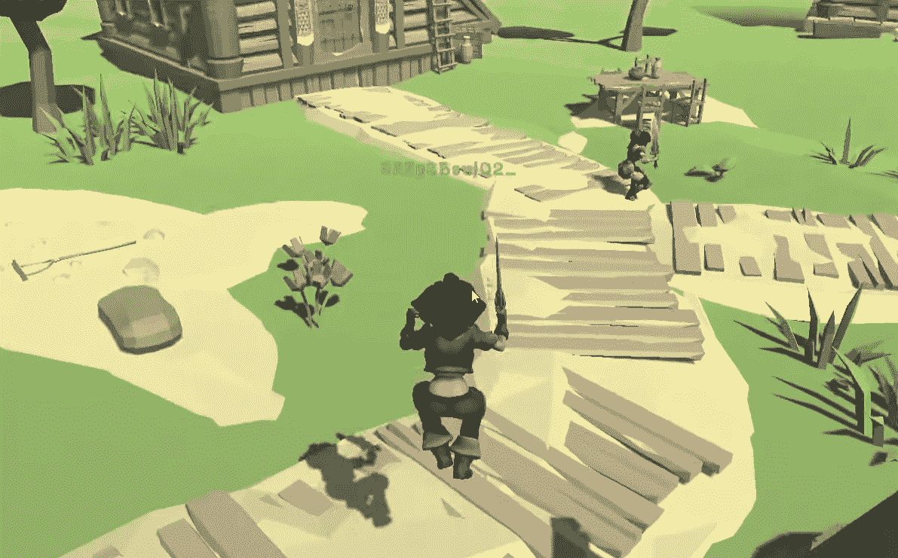

### 使用 Unity 的 Web3 事务是如何工作的？

加载场景并添加用户角色后，用户可以四处移动他们的角色。此外，正如您在下面的截图中看到的，字符上方还显示了部分用户地址:

此外，就角色之间的互动而言，我们决定坚持基本原则。然而，这足以做区块链游戏交易。当玩家接近其他角色时，他们可以点击它们。这显示了他们的用户名和钱包地址:

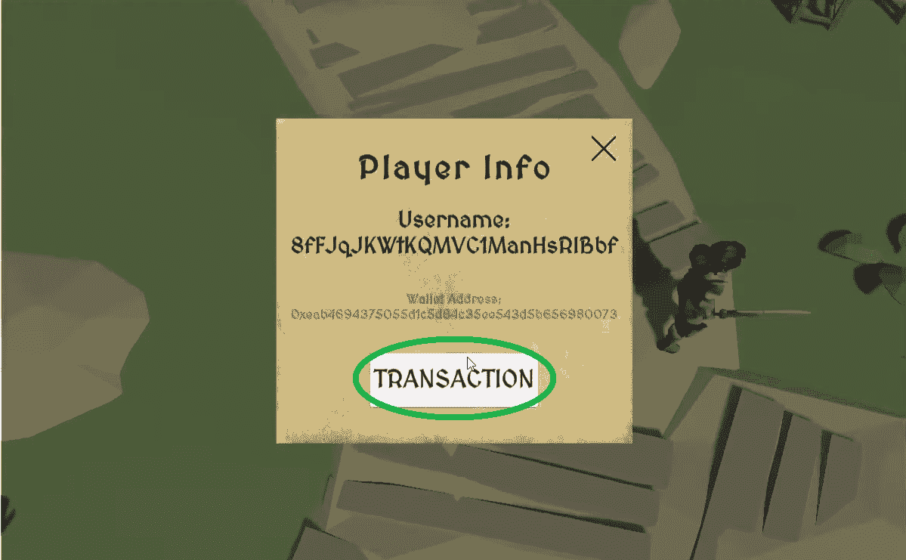

如上图所示，除了用户的用户名和地址，还有“交易”按钮。因此，点击该按钮使用户能够进行区块链游戏交易:

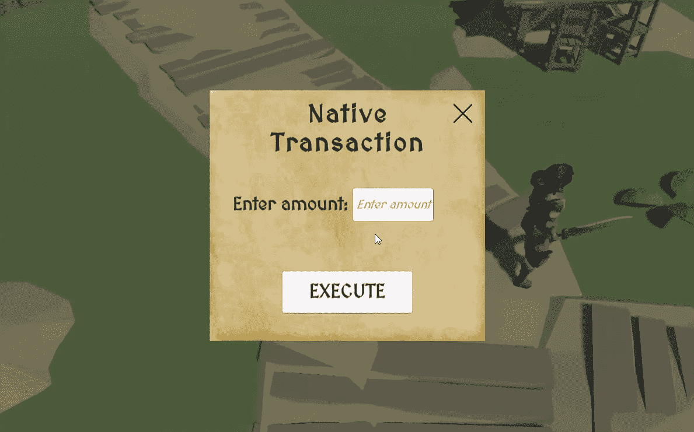

正如“原生交易”的标题所暗示的，这些种类的带有 Unity 的 Web3 交易支持原生代币或硬币。通过输入用户想要发送的金额并点击“执行”按钮，MetaMask 会要求确认:

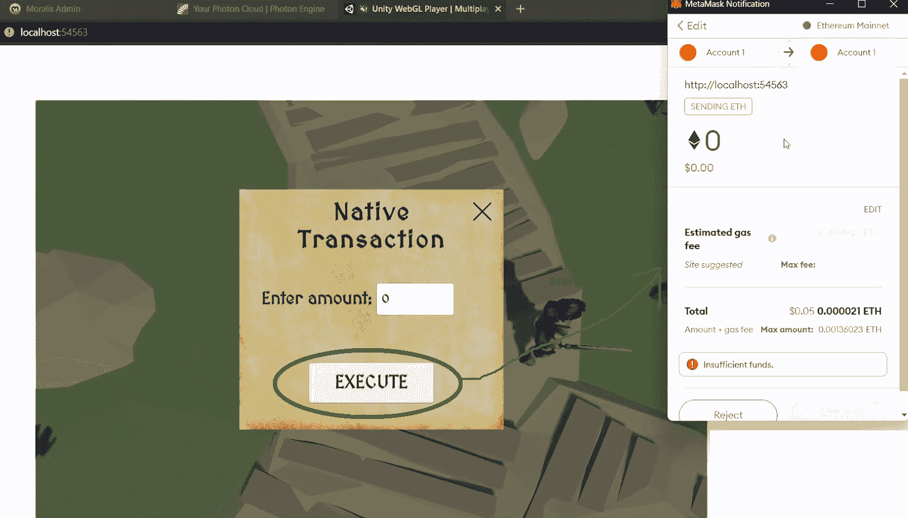

另一个很棒的特性是 Moralis 的跨链互操作性。后者使你能够在其他链上进行上述区块链游戏交易。为此，用户只需使用元掩码扩展切换到另一个网络:

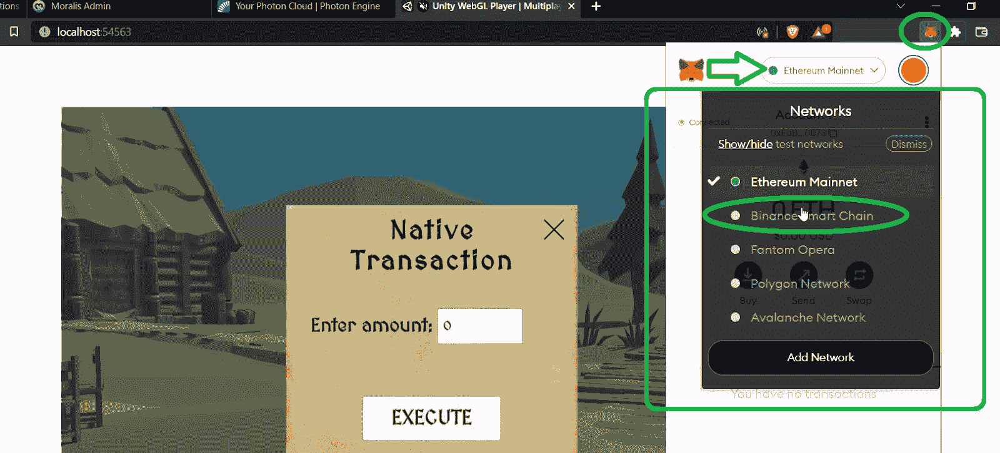

如果他们现在再次重复上述步骤，他们将能够发送 BNB(只要 BNB 链网络已经添加到 MetaMask)而不是 ETH:

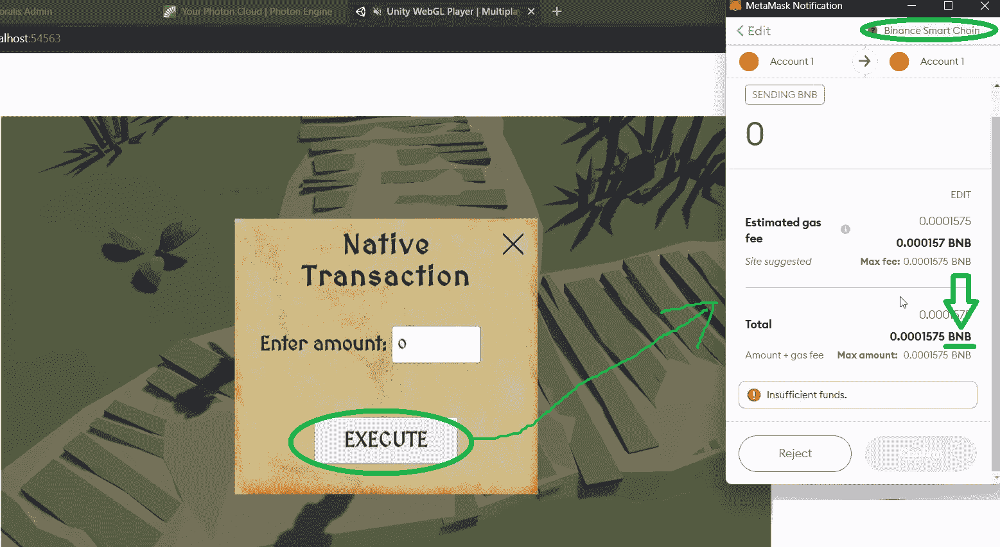

## Unity 和 Moralis 的区块链游戏交易

Moralis 是最终的 Web3 开发平台。因此，它是使 Web3 交易具有统一性的工具。然而，要自己创建上述示例游戏，您还需要光子和元遮罩。虽然光子将照顾我们的多人游戏需求，但 Moralis 将使区块链游戏交易成为可能。这个最好的 [Web3 后端平台](https://moralis.io/exploring-the-best-web3-backend-platform/)使得创建 dapp([分散应用](https://moralis.io/decentralized-applications-explained-what-are-dapps/))变得更加简单。总而言之，Moralis 能让你节省 87%的开发时间。此外，如前所述，Moralis 是跨链互操作的。因此，您可以轻松地跨多个可编程链部署 dApps。此外，这个非凡的 Web3 工具可以让您克服 RPC 节点的所有[限制。通过节省后端开发的时间和金钱，您可以将最大的注意力放在前端。因此，你很可能会创造出一个优秀的 Web3 UI。](https://moralis.io/exploring-the-limitations-of-rpc-nodes-and-the-solution-to-them/)

幸运的是，Moralis 的免费版本为您提供了入门所需的一切。通过创建您的免费 Moralis 帐户，您可以创建您的 Moralis 服务器并访问其数据库(Moralis dashboard)。如果您将您的 Moralis 仪表板与 Moralis 的“同步”功能相结合，您可以轻松地[同步和索引智能合同事件](https://moralis.io/sync-and-index-smart-contract-events-full-guide/)。这也使得 Moralis 成为毫不费力地索引区块链的最佳工具。尽管如此，如果你还没有这样做，请确保在继续之前[创建你的免费 Moralis 账户](https://admin.moralis.io/register)。

### 下载我们的 Unity 示例项目

如前所述，我们在 [GitHub](https://github.com/MoralisWeb3/youtube-tutorials/tree/main/unity-mmorpg-transactions) 发布了之前 MMORPG 展示的 Web3 的全部代码。由于这是我们用 Unity 实现 Web3 交易的基础，我们建议您遵循以下步骤。实际上，最好的方法是下载我们的[示例项目的 ZIP 文件](https://github.com/MoralisWeb3/youtube-tutorials/releases/tag/v1.0.0-unity-mmorpg-transactions):

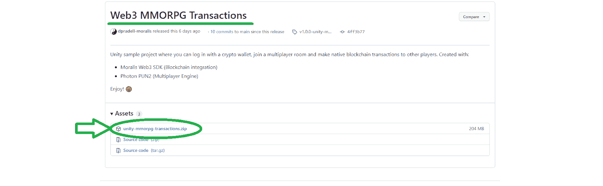

下载完 ZIP 文件后，解压，用 Unity 打开。然后，您将能够看到 Moralis SDK 已经导入到项目中:

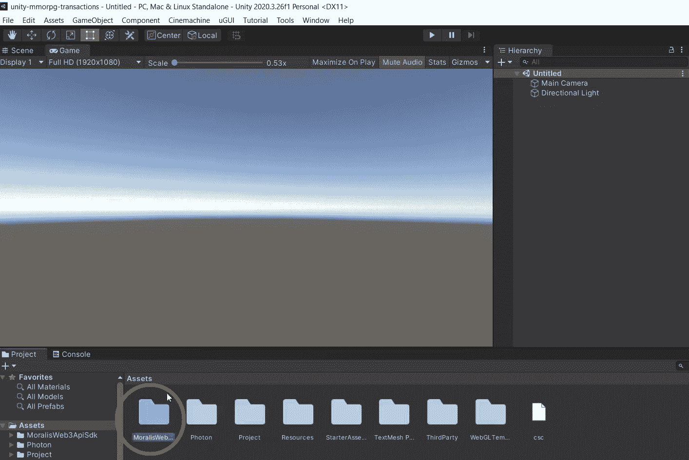

然而，为了这个示例项目，我们想把重点放在“项目”文件夹上。在后者里面，你会发现“场景”文件夹，其中包含“游戏”和“登录”场景。我们将从后者开始:

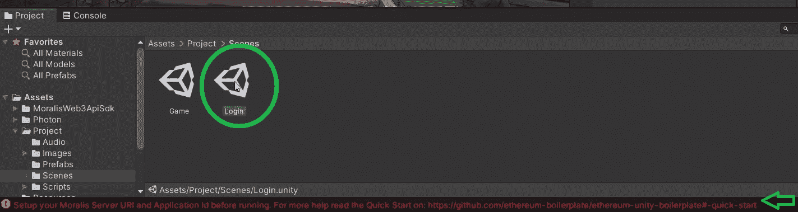

## 使用 Unity 实现 Web3 交易——“登录”场景

随着“登录”场景的打开，我们可以访问层级中的“Moralis 设置”预设。此外，通过选择预置，我们登陆到“Moralis 控制器”。在这里，您需要输入您的 Moralis 服务器的详细信息，以获得您需要的后端支持:

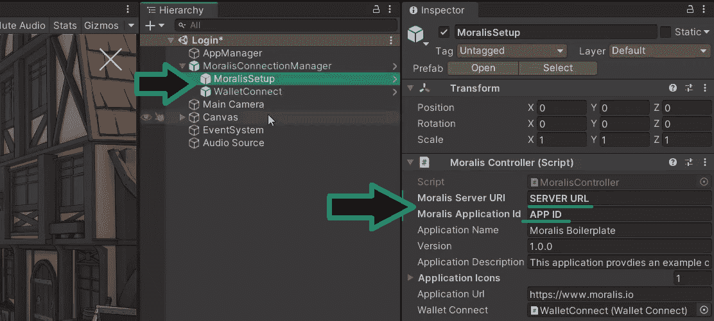

上面的图像清楚地显示了“Moralis 设置”预设的细节。您可以看到您需要您的 Moralis 服务器 URL 和应用程序 ID。因此，这是您创建自己的 Moralis 服务器并获取其详细信息的提示。

### 初始 Moralis 设置

无论你是对用 Unity 还是其他 dApps 创建 Web3 游戏感兴趣，你都必须从初始的 Moralis 设置开始。以下是轻松做到这一点的步骤:

1.  **登录您的 Moralis 账户**–此时，您很可能已经拥有一个有效的 Moralis 账户；这样，只需[登录](https://admin.moralis.io/login)。*然而，如果你还没有一个 Moralis 帐户，使用上面的“创建你的免费 Moralis 帐户”链接，它将带你到注册页面。在那里，输入您的电子邮件，创建您的密码，并通过单击将发送到您的电子邮件的链接来确认您的帐户。*

2.  [**创建一个 Moralis 服务器**](https://docs.moralis.io/moralis-server/getting-started/create-a-moralis-server)–在您的 Moralis 管理区，您会看到位于“服务器”选项卡右上角的“+创建新服务器”按钮。作为新用户，您可以按照页面上的教程进行操作:

接下来，你需要选择合适的网络类型(见下面的截图)。当处理示例项目或测试 dApps 时，“Testnet 服务器”或“本地 Devchain 服务器”是最好的选择。然而，一旦到了上线的时候，你需要使用“Mainnet 服务器”选项。

然后，您将看到一个弹出窗口，询问您的服务器详细信息。因此，输入您的服务器名称，然后选择您的地区、网络类型和链。最后，通过单击“添加实例”运行您的服务器:

3.  **访问您服务器的详细信息**–一旦您的服务器启动并运行，您可以通过“查看详细信息”按钮访问其详细信息:

这样，您将在一个新窗口中看到详细信息。通过使用右侧的复制图标，您可以复制服务器的 URL 和应用程序 ID:

4.  **填充 Unity***–*现在剩下要做的就是将上面复制的详细信息粘贴到 Unity 中的适当字段:

### WebGL 上的区块链游戏交易

为了完成这个项目，我们需要对设置进行一些初步的调整。默认情况下，你可以通过 WalletConnect 连接用户，这对于 Android 和 iOS 设备来说非常好。然而，在我们的例子中，我们想把重点放在 web 用户上。所以，进入“文件”>“构建设置”，选择“WebGL”，点击“切换平台”按钮:

然后让团结做它的事情。接下来，点击位于“构建设置”窗口左下角的“播放器设置”按钮(见上图)。在“项目设置”窗口中，从侧面菜单中选择“播放器”。然后，在“解析和演示”下选择“Moralis WebGL”模板:

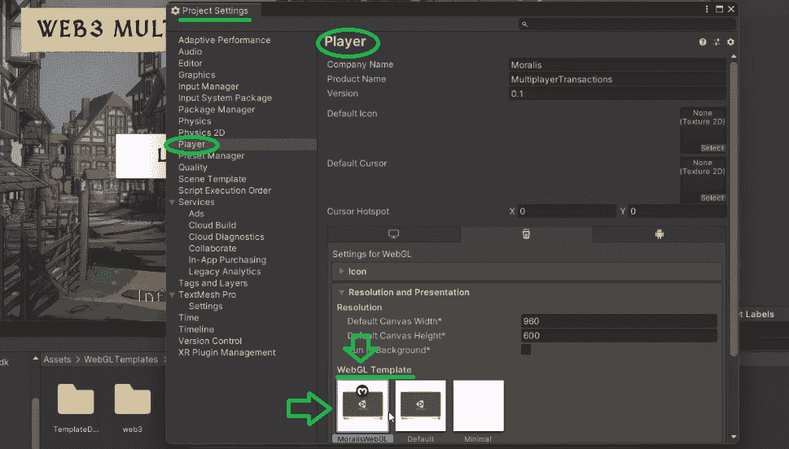

### 具有 Unity 和多人需求基础的 Web3 交易

正如到目前为止提到的几次，我们的示例 Web3 游戏是一个 MMORPG。因此，我们需要确保多人游戏的特性被适当地覆盖。这就是为什么我们要用光子。你所需要的只是你的 Photon 应用 ID，稍后你可以将它粘贴到 Unity 的“Photon 服务器设置”中。但是你首先需要创建你的光子账户。可以用谷歌搜索“光子引擎”。然后，点击链接到它的主页，并创建您的帐户。现在您已经登录，您需要导航到您的仪表板:

这是您访问光子应用程序 ID 的地方。但是，如果这是您第一次使用 Photon，您必须首先创建一个新的应用程序:

然后，选择“光子类型”下的“双关”:

其他细节可以是你想要的任何东西。最后，单击“创建”按钮。创建新应用后，您可以复制其 ID 并粘贴到 Unity 中:

因此，使用 Unity 的搜索工具并输入“设置”。在提供的结果中，打开“PhotonSer…”:

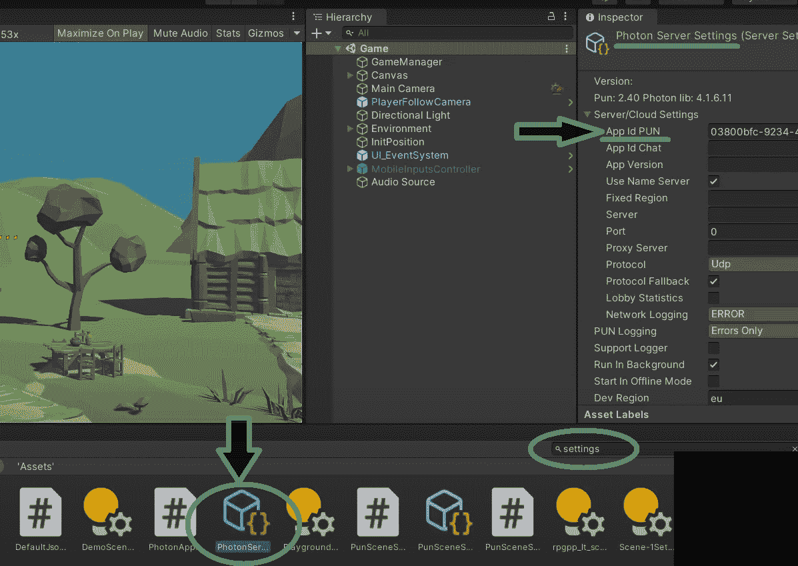

要测试运行您的示例 Web3 游戏版本，请确保将“登录”和“游戏”场景添加到“构建设置”中。因此，从“文件”菜单中打开“构建设置”。然后将两个场景拖放到“构建中的场景”下的框架中:

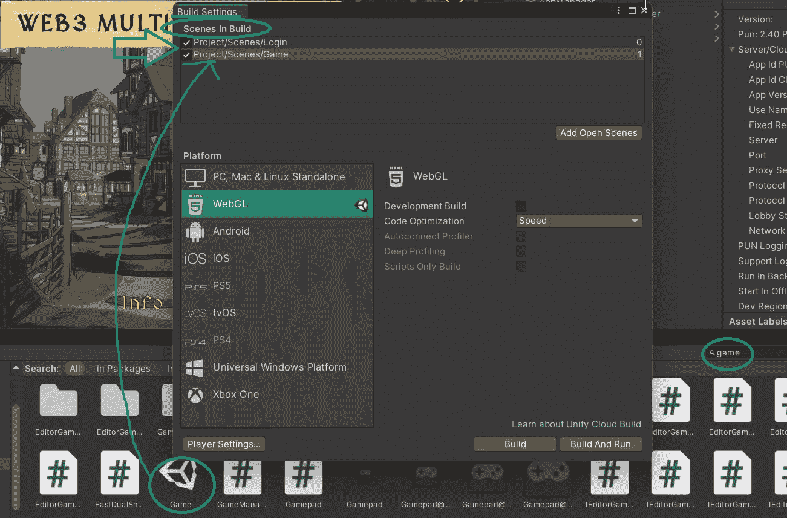

*注* *:要想了解更多关于如何运行你的 Web3 游戏的细节，请观看下面 08:14 开始的视频。*

## 用 Unity 实现 Web3 交易——“游戏”场景

现在是关注如何实现区块链游戏交易的时候了。我们在“游戏”场景中这样做。因此，从打开这个场景开始。在“画布”预设下，您会看到三个面板:

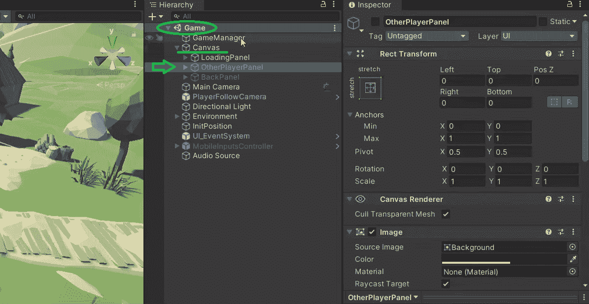

当我们点击另一个播放器时，激活的是“OtherPlayerPanel”(还记得文章开头的演示)。因此，请确保选中“其他播放器面板”框:

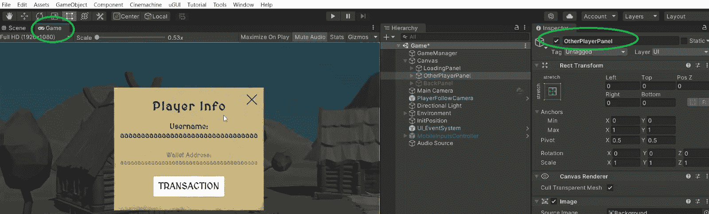

接下来，我们单击“TRANSACTION”按钮，并选中“TransactionPanel”预设中“TransactionPanel”旁边的框。这将打开“交易”面板:

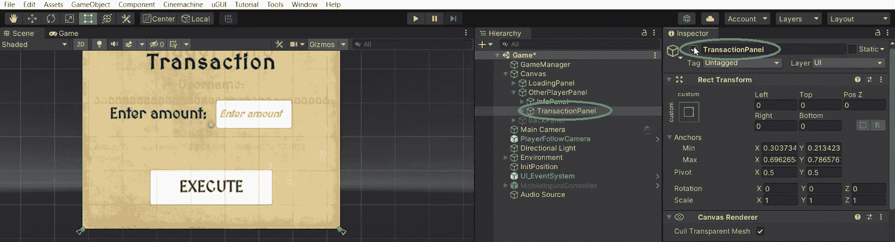

您现在可以取消选中“TransactionPanel”和“OtherPlayerPanel”框。以上的目的是向你展示面板是如何被激活的。此外，您现在知道所有这些都是在“OtherPlayerPanel”中管理的。尽管如此，如果您有兴趣了解关于实现这一点的代码的更多细节，请务必观看下面 10:33 的视频。在该视频中，Moralis 专家将仔细研究“OtherPlayerPanel”脚本。在这里，您将了解“MoralisInterface”方法和几个实用的 Moralis SDK 端点，包括“SendTransactionAsync”。最后但同样重要的是，要查看最终结果，请使用 12:29 的视频指令。

*这是我们在整篇文章中引用的视频:*

https://www.youtube.com/watch?v=ggDEoBB0eP0

## 如何用 Unity 做区块链游戏交易——总结

在这篇文章中，我们已经涉及了相当多的内容。您已经学习了如何使用 Unity 轻松进行区块链游戏交易。此外，您已经有机会使用我们的模板，通过完成 Moralis 和 Photon 的初始设置，在几分钟内创建一个示例 Web3 游戏。此外，如果你跟随我们的领导到这一点，你已经能够在你的终端上启动游戏，甚至用 Unity 执行 Web3 交易。

我们希望这个例子能启发你，并向你展示 Moralis 的元宇宙 SDK 的潜力。因此，现在是时候让事情更上一层楼，开始将你的 Web3 游戏创意付诸实践了。然而，如果你想学习其他 Unity Web3 的例子，我们建议你学习如何[创建一个元宇宙 dApp](https://moralis.io/how-to-create-a-metaverse-dapp-with-unity/) 。或者，也许[建造一个中世纪的元宇宙游戏](https://moralis.io/how-to-build-a-medieval-metaverse-game/)。另一方面，你可能对区块链发展的其他方面感兴趣。如果是这样，一定要去看看[Moralis 家 YouTube 频道](https://www.youtube.com/c/MoralisWeb3)和[Moralis 家博客](https://moralis.io/blog/)。这两个渠道都提供高质量的解释和指南。例如，一些最新的话题涵盖了如何创建一个 [Web3 音乐平台](https://moralis.io/web3-music-platform-create-a-web3-music-streaming-service/)、[无汽油元宇宙互动](https://moralis.io/gasless-metaverse-interactions-exploring-zero-fee-dapps/)、如何[创建一个 ERC-721 NFT](https://moralis.io/how-to-create-an-erc-721-nft/) 、如何[白标 NFT 市场](https://moralis.io/how-to-launch-a-white-label-nft-marketplace/)以及[元宇宙智能合约](https://moralis.io/metaverse-smart-contract-how-to-build-a-metaverse-game-smart-contract/)的例子。

但是，如果你想在尽可能短的时间内成为一名 Web3 开发者，你可能需要采取更专业的方法。在这种情况下，报名参加[Moralis 学院](https://academy.moralis.io/)可能正是你的正确道路。除了顶尖的[课程](https://academy.moralis.io/all-courses)，你还将成为高级社区的一员，获得个性化的学习路径，并接受专家指导。