# 如何通过地址 API 获取 NFT——探索 NFT API

> 原文：<https://moralis.io/how-to-fetch-an-nft-by-address-api-exploring-the-nft-api/>

到目前为止，数字艺术和收藏品是 NFTs 的主要使用案例。然而，这些代币的效用远远超出了仅仅作为收藏家的物品放在市场上。NFT 已经扰乱了多个行业，包括那些处理证书和所有权证明的行业。也就是说，正确地了解如何使用不可替换的令牌、[**【NFT 元数据】**](https://moralis.io/how-to-add-attributes-to-nft-metadata/) **等。，对 Web3 开发者来说至关重要。此外，除非你想经历手动处理智能合同以及分析和格式化数据的麻烦，否则使用 Moralis 的 NFT API 是正确的选择。此外，如果您想要一个允许您通过地址获取 NFT 的 API，这应该是您的首选工具！**

只使用一行代码，Moralis 的按地址获取 API 就可以让你从众多的区块链中获得关于不可替换令牌的各种细节！它涵盖了一切，从最新的交易和所有者到 NFT 合约的最低价。除了通过地址 API 获取 NFT，Moralis 还提供了优秀的 [Web3 认证](https://moralis.io/authentication/)解决方案、 [Web3 同步](https://moralis.io/syncs/)以及许多其他 Web3 APIs。要开始，您只需要完成初始的 Moralis 设置。

接下来，我们将进一步了解 Moralis 如何使您能够通过地址 API 获取 NFT。因此，您将会看到这是一个多么不可或缺的工具。然而，在深入研究 Moralis 的这个工具之前，让我们确保你们都知道为什么应该通过地址 API 获取 NFT。如果您准备好开始构建，请[创建您的免费 Moralis 帐户](https://admin.moralis.io/register)并开始游戏！

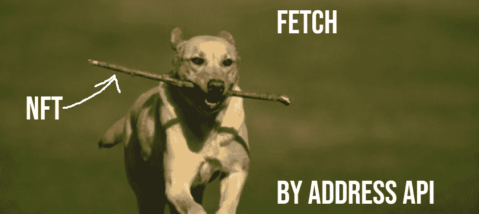

## 为什么要通过地址获取 NFT？

如你所知，NFT 的合同地址是公开的。因此，您可以很容易地获得这条信息，并使用它来获取 NFT。您可以显示 NFT，还可以获得与这些 NFT 相关的各种链上数据和元数据。本质上，能够通过地址 API 获取 NFT 使您能够围绕 NFTs 构建各种用例。例如，您可以创建一个 NFT 浏览器，让用户轻松获取甚至比较 NFT 的详细信息。或者，你可以创建一个令人惊叹的 NFT 画廊。此外，有了 NFTs 的元数据，您可以在所有类型的 Web3 游戏中实现这些令牌。

*注意:* *如果您对 NFTs 相对陌生，我们鼓励您在我们最近的一些博客文章中* [更深入地探索不可替代的令牌](https://moralis.io/non-fungible-tokens-explained-what-are-nfts/) *和* [发现 NFT 实用工具](https://moralis.io/nft-utility-exploring-nft-use-cases-in-2022/) *！*

本质上，如果您想构建围绕 NFTs 的 dapps(分散式应用程序),使用按地址提取 NFT API 是一个不错的选择。这就是你如何节省高达 80%的开发时间。此外，高质量的 NFT API 同时支持标准化的(ERC-721 和 ERC-1155)和非标准化的 NFT(例如 crypto 朋克)。您还应该知道，一个合适的 NFT API 会自动解析元数据。尽管如此，它完全兼容虚幻和统一等游戏引擎。

既然您知道了为什么要使用这个通过地址获取 API，那么让我们更仔细地看看如何毫不费力地使用它。

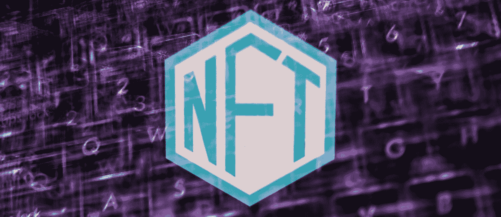

## 如何通过地址 API 获取 NFT

至此，您已经知道通过地址 API 获取 NFT 的最简单方法是通过 Moralis。特别是通过 Moralis 的终极 NFT API。这个先进的工具使您能够彻底改变您的 NFT dapp 开发。通过使用公开可用的合同地址，您可以获取实时 NFT 元数据、所有权详细信息、NFT 转让数据、NFT 价格等等。它只需要一行代码。因此，不需要对不规则的数据集进行排序，不需要清理和拼接，不需要查询节点以获取元数据，不需要解析单个智能合约，也不需要十多次调用来获取您需要的 NFT 元数据。

当您使用 Moralis 通过地址 API 获取 NFT 时，您只需要一次调用就可以在整个集合中检索 NFT 所有权。最终，Moralis NFT API 就像“NFTs 的谷歌”，你可以免费使用它。此外，你不必是一个网络 3 专家来创造杀手 NFT dapps。因为 Moralis 是关于跨链互操作性的，所以您可以使用相同的代码跨多个链部署 dapps。目前，Moralis 支持以太坊、BNB 连锁店、Polygon、Avalanche、Solana、Fantom 和 Cronos，还有其他几家连锁店正在筹备中。它还支持上面列出的所有链的测试网。

那么，如何通过地址 API 获取 NFT 呢？使用 Moralis 的终极 NFT API。为此，您需要完成初始的 Moralis 设置，您可以在下面找到如何完成的分步说明。此外，学习如何通过地址 API 获取 NFT 的最好方法是参加一些示例项目。然而，让我们首先更仔细地看看 Moralis NFT API 和 Moralis 端点提供的具体优势。

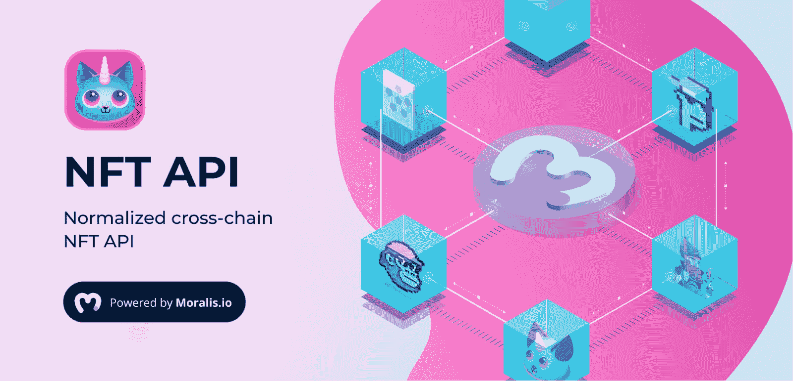

## Moralis 家 NFT API 的主旨

简而言之，这些是 Moralis 的 NFT API 为您提供的关键内容:

*   **所有权数据**–获取关于哪些地址拥有哪些 NFT 的详细信息。
*   **传输数据**–查询哪些地址发送或接收哪些 NFT。
*   **元数据**–当您通过地址 API 获取 NFT 时，您将始终获得已解析的元数据。
*   **价格数据**–轻松获取您感兴趣的 NFT 的最低价格。

在构建 NFT dapps 时，关键方面仍然是用户体验。因此，能够依靠像 Moralis 这样强大的工具来完成后端的所有繁重工作是无价的。因此，您可以将所有的精力和资源集中在创建最好的 UI 上。本质上，您可以更智能地工作，而不是更辛苦，只需几次点击，就可以将 NFT 事务和元数据推送到您的应用程序中。因此，您可以过滤链上帐户、智能合同、特定集合等，而无需在您这一端做任何艰苦的工作。因此，您可以节省大量时间，平均而言，将 dapps 推向市场的速度可以加快 87%。

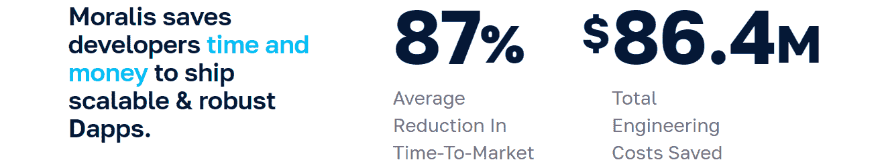

### 通过地址获取 API 获取完全解析的元数据

如果您曾经艰难地获取过 NFT，您就会知道手动解析单个智能契约是非常耗时的。然而，使用 Moralis 的 NFT API，您可以永远忘记手动解析单个 Web3 契约。Moralis 的 NFT 获取 API 使数据正常化。因此，您只需查询它。此外，由于上述跨链兼容性和搜索端点，您可以轻松地在元数据中创建搜索，并再次接收完全解析的元数据。

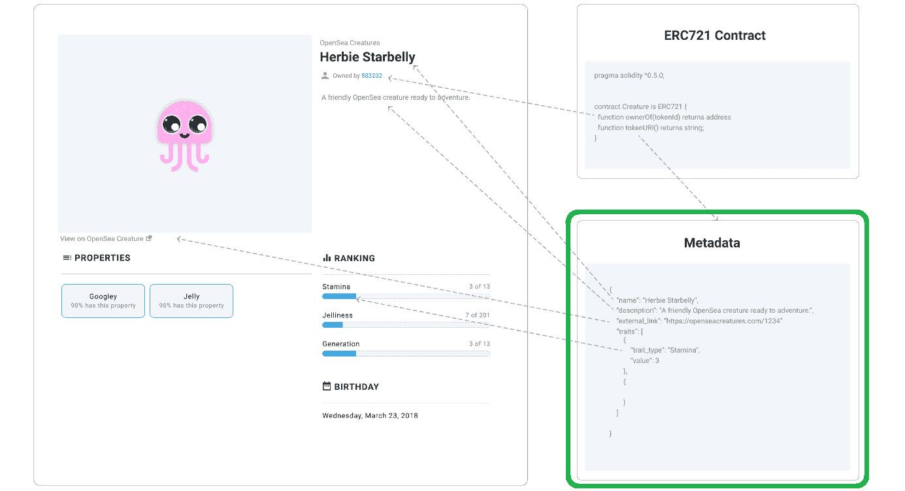

### NFT 所有权和转让数据

使用 Moralis NFT API 时，你不需要担心的另一件事是编码或甚至创建一个额外的基础设施来跟踪 NFT 在区块链的移动。相反，你只需点击几下鼠标，就能获得任何 NFT 甚至整个 NFT 收藏的准确历史数据。因此，你可以很容易地让你的客户“令牌门”他们的内容，并帮助他们在新兴的 Web3 环境中茁壮成长。此外，通过 Moralis，您可以在所有支持的链上实时跟踪 NFT 运动。此外，您只需点击一下鼠标，就可以搜索某个特定号码的所有转账。然而，关注特定的钱包地址和联系地址是最常见的做法。让我们来看看 Moralis 的端点，它们使您能够通过地址 API 获取 NFT。

## 探索 Moralis NFT API 端点

要查看详细信息并使用允许您通过地址 API 获取 NFT 的端点，您必须完成初始 Moralis 设置(如下说明)。进入 Moralis 管理区域后，您必须选择“Web3 APIs”页面。这样，您将进入 EVM API 选项卡。在那里，向下滚动到“令牌”部分，您将看到所有 NFT 端点:

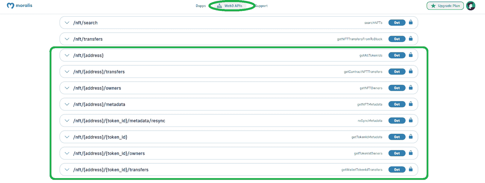

如您所见，目前有八个端点接收 NFT 地址，我们称之为“地址 API”:

*   */nft/{address}*
*   */NFT/{地址}/传输*
*   */NFT/{ address }/所有者*
*   */NFT/{ address }/元数据*
*   */NFT/{ address }/{ token _ id }/元数据/resync*
*   */NFT/{地址}/{令牌标识}*
*   */NFT/{ address }/{ token _ id }/所有者*
*   */NFT/{地址}/{令牌标识}/传输*

查看 NFT API 端点列表，不难发现每个端点的用途。但是，我们鼓励您通过单击最左侧的箭头来了解每个端点的详细信息:

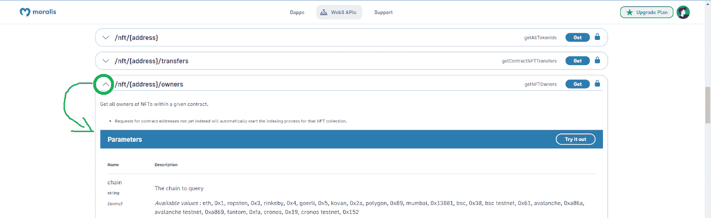

尽管如此，也请务必查看 Moralis NFT API 文档页面。在那里你可以看到几种流行的编程语言的代码:

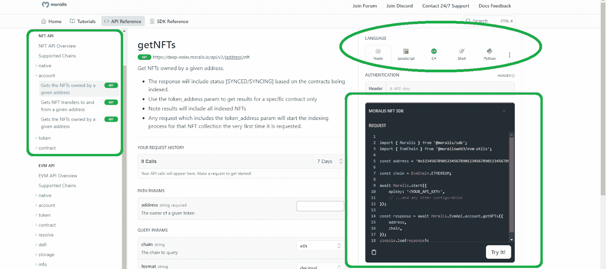

### Moralis 2.0 设置-逐步说明

如上所述，要通过地址 API 获取 NFT，您需要完成以下步骤:

1.  使用开头提到的“创建您的免费 Moralis 帐户”链接或访问 Moralis 的主页来创建您的帐户:

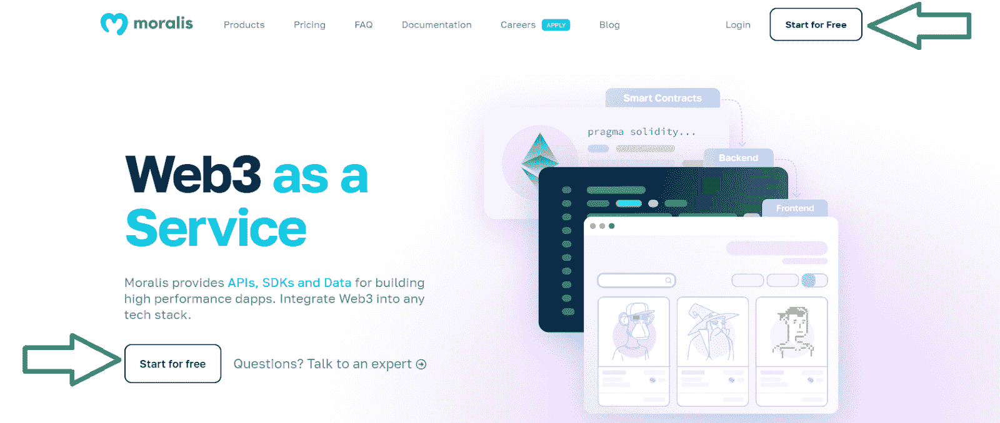

2.  然后，您就可以访问您的 Moralis 管理区域。可以点击“Web3 APIs”按钮:

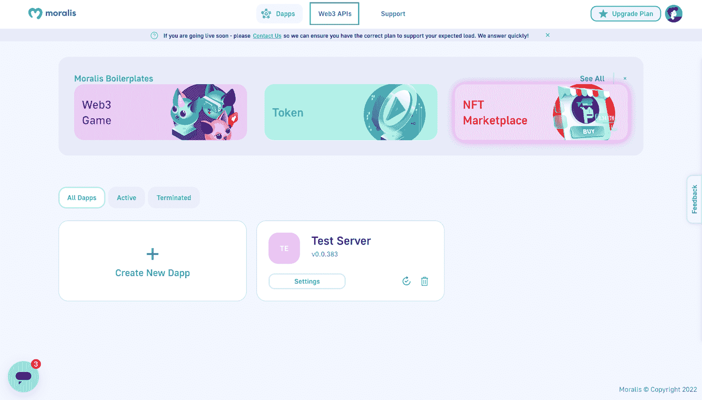

3.  上述按钮会将您重定向到 Web3 API 页面。在这里，您可以单击“获取 API 密钥”按钮:

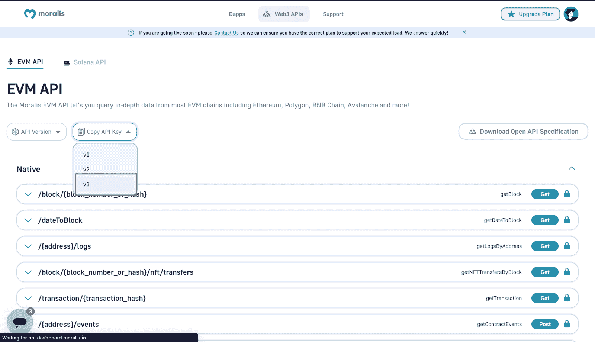

4.  复制 API 密钥后，在本地创建一个“index.js”文件，并粘贴以下代码，然后将复制的 API 密钥粘贴到您的脚本中。

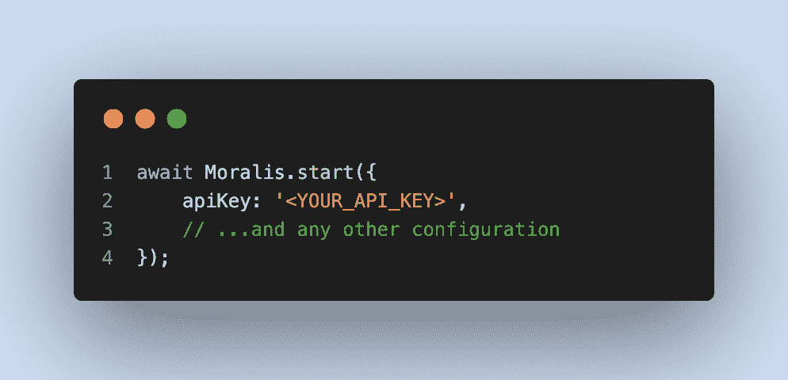

有了初步的 Moralis 规范，你就可以通过关注我们的示例项目来处理自己的想法或开始实践。

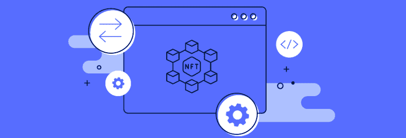

#### 学会毫不费力地获取 NFT——Moralis 示例项目

就像生活中的大多数事情一样，学会按地址取 NFT 的最好方法是采取行动。如果你有技能和一些很酷的想法，无论如何，从那里开始。然而，如果你想先建立自信，我们的教程可能是最好的起点。只需访问 Moralis YouTube 频道和 Moralis 博客，并使用搜索选项查找与 NFT 相关的示例项目:

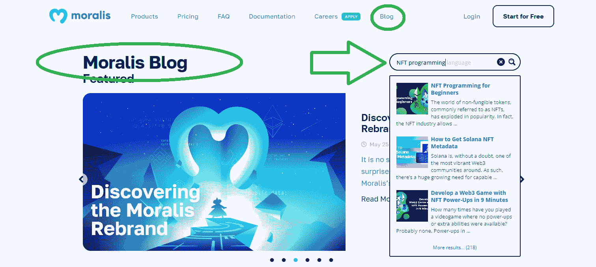

一些推荐的教程包括:

*   初学者 NFT 编程
*   在 9 分钟内开发一个带有 NFT 电源的 Web3 游戏
*   如何开发 NFT 稀有等级 Dapp
*   NFT 连锁分析——如何探索 NFT 钱包
*   如何在游戏中购买 NFT 装备
*   建立一个市场来购买游戏中的 NFTs
*   如何制造一台 [NFT 糖果机](https://moralis.io/how-to-create-an-nft-candy-machine/)

快乐“建筑”！

## 如何通过地址获取 NFT API–探索 NFT API–摘要

在本文中，您了解了通过地址 API 获取 NFT 的最简单方法是使用 Moralis NFT API。您还有机会近距离了解这个终极 NFT API 的关键特性，以及如何访问它的端点。尽管如此，您还学习了如何完成初始的 Moralis 设置。后者是您通过地址 API 轻松获取 NFT 的门户。最后但同样重要的是，你了解到免费练习你的 NFT 开发技能的最好地方是[Moralis YouTube 频道](https://www.youtube.com/c/MoralisWeb3)和[Moralis 博客](https://moralis.io/blog/)。因此，现在轮到你了。所以，你能否进球完全取决于你自己。

然而，除了上面列出的资源之外，我们还可以帮助您进一步提高实际“进球”的机会。如果你的目标是尽快成为全职加密员，那么报名参加[Moralis 学院](https://academy.moralis.io/)可能是适合你的道路。在那里，你将获得无数顶尖的区块链开发课程和密码专家的专业指导。此外，您将获得个性化的学习路径，并成为业内最先进社区之一的会员。