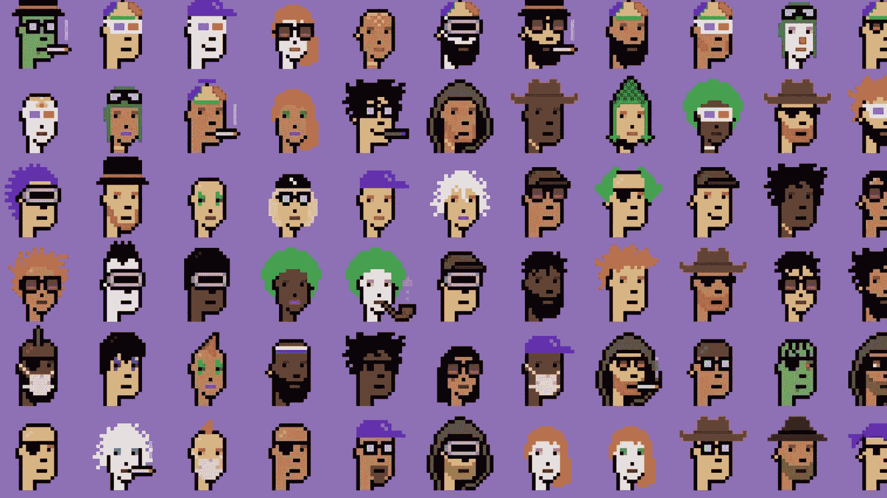
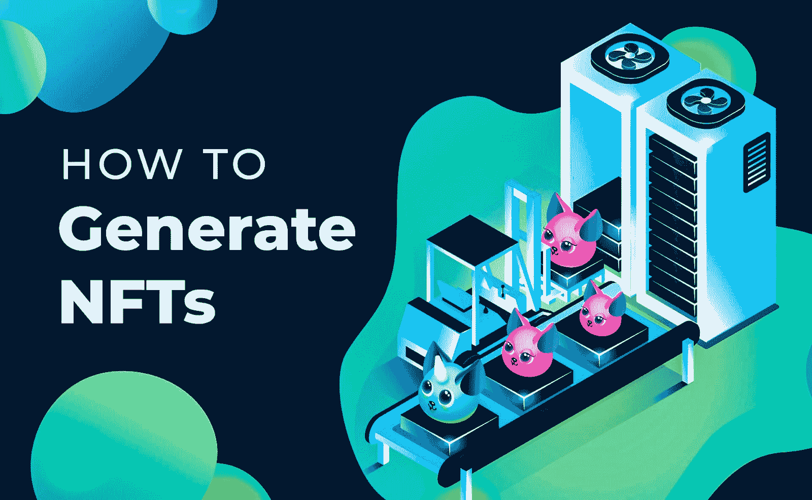
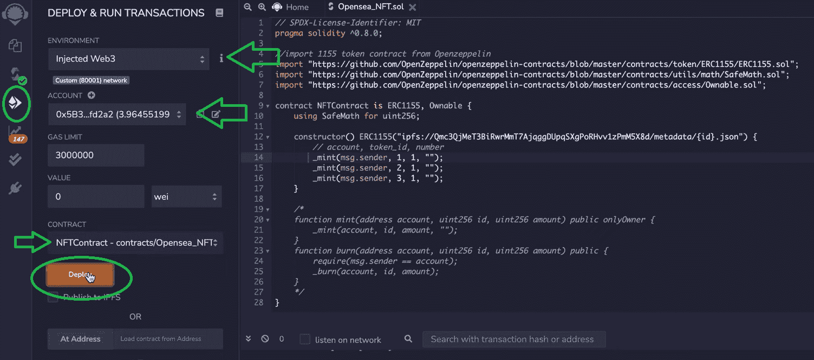
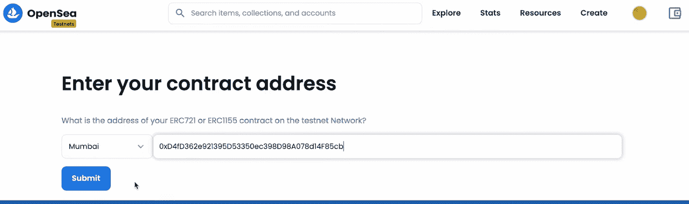

# 如何生成成千上万的 NFT

> 原文：<https://moralis.io/how-to-generate-thousands-of-nfts/>

**可以清楚地看到，**[](https://moralis.io/non-fungible-tokens-explained-what-are-nfts/)****板块才刚刚起步。正因如此，这可能是学习** [**NFT 令牌开发**](https://moralis.io/nft-token-development-the-ultimate-guide/) **的最佳时机。具体来说，学习如何生成成千上万的 NFT 对于一个** [**区块链开发者**](https://moralis.io/how-to-become-a-blockchain-developer/) **来说是非常有用的。有了这种技能，你可以很容易地** [**创造自己的 NFT**](https://moralis.io/how-to-create-your-own-nft-in-5-steps/) **系列，或者与艺术家或公司合作，采用这种改变世界的技术，为他们创造 1000 件 NFT。幸运的是，有强大且易于使用的工具可以简化 NFT 生成过程。此外，使用 Moralis 的 Web3 开发平台，您可以用简单的编程代码生成数千个 NFT。****

**不久前，我们在 Moralis 的博客上发布了一篇文章，在文章中我们展示了如何使用 [Moralis](https://moralis.io/) 及其 [IPFS](https://moralis.io/what-is-ipfs-interplanetary-file-system/) 集成来创建计算机生成的 NFT。然而，在那篇文章中，我们只创建了大约十个 NFT，并且我们只关注于创建表示 NFT 的文件，而没有实际创建它们。因此，我们从读者那里收到了许多关于如何创建数千个 NFT 的请求。因此，我们将在此讨论该主题。到本文结束时，您应该已经准备好自己创建 1000 个 NFT 了。要快速轻松地完成这一步，你需要 Moralis，所以请确保现在就[创建你的免费 Moralis 账户](https://admin.moralis.io/register)！**

**

## 创建 vs 生成数千个 NFT

不可替代令牌(NFT)是目前最流行的区块链用例之一。此外，它们的创作者主要专注于将它们用于数字艺术和收藏品的事实与此有很大关系。为什么？嗯，人们总是喜欢令人兴奋和有趣的东西，这正是许多非物质文化遗产所能提供的。无论是令人难以置信的数字艺术、酷炫的收藏品，还是“玩到赚到”的游戏，NFT 都有吸引大众的方式。另一方面，请记住，这种类型的加密资产也已经有许多重要的用例。后者包括各种所有权、证明、认购证明等。因此，我们敢有把握地说，非正规金融机构将继续存在。

此外，创建 NFT 有几个方面:创建、执行/创建和生成。因此，让我们仔细看看这些方面:

*   一方面，我们有**创建**一个数字文件(JPG、PNG、PDF、MP3、MP4 等)的过程。)这将是 NFT 的精髓。
*   另一方面，我们有一个使用[智能合约](https://moralis.io/smart-contracts-explained-what-are-smart-contracts/)执行交易的过程，该交易会将数字文件(及其详细信息【元数据】)转换为 NFT。那个过程就是所谓的“**造币”** ( *学* [*如何造币 NFTs*](https://moralis.io/how-to-mint-nfts-full-tutorial-to-minting-an-nft/) *)。*
*   此外，在计算机生成的可收集的 NFTs 的情况下，还有一部分创建代码，该代码将获取特定的 PNG 文件(最终图像的层或组件)并以适当的顺序随机组合它们。因此，对于这种类型的 NFT 创作来说，更合适的动词是“**生成**”。



## 为什么要学习如何生成成千上万的 NFT

作为一名开发人员，您通常会对铸造过程更感兴趣；然而，当创建如此大量的 NFT 时，您的编程技能也必须用于该部分。与大多数数字艺术不同，艺术家通常只创作一幅 NFT 作品，NFT 收藏团队倾向于创作 1000 幅非数字艺术作品。

此外，两个最受欢迎的 NFT 收藏，CryptoPunks 和 Bored Ape Yacht Club 是很好的例子，因为这两个收藏都有 10，000 件收藏品。此外，许多其他项目以他们为榜样，也创造了 1000 个非功能性测试。此外，这些类型的非功能性文件通常是由计算机通过随机组合特定的 PNG 文件(基于预先定义的稀有度)而生成的。后者必须适当分层才能得到我们想要的结果。综上所述，难怪开发人员会问自己如何生成成千上万的 NFT。


## 如何用 Moralis 生成成千上万的 NFT

如前所述，我们有一篇单独的文章(链接如上)详细介绍了如何使用 Moralis 以分散的方式生成 NFT。除了 Moralis，我们还使用了代码编辑器(Visual Studio 代码)、Adobe Photoshop、 [MetaMask](https://moralis.io/metamask-explained-what-is-metamask/) 和 [Remix](https://moralis.io/remix-explained-what-is-remix/) 。此外，Moralis(又名 [Firebase for crypto](https://moralis.io/firebase-for-crypto-the-best-blockchain-firebase-alternative/) )帮助我们涵盖了所有与区块链相关的后端方面。通过使用它的终极 [Web3 SDK](https://moralis.io/exploring-moralis-sdk-the-ultimate-web3-sdk/) 和终极 [NFT API](https://moralis.io/ultimate-nft-api-exploring-moralis-nft-api/) ，我们可以在几分钟内实现原本需要几天甚至几周才能完成的功能。

此外，让我们强调当您想要创建任何类型的 NFT 时，在头脑中有一个目标的重要性。当“如何生成数以千计的 NFT”成为问题时，这一点甚至更加重要。具体来说，我们需要更独特的组件或层。此外，生成这么多的 NFT 可能需要相当长的时间，(特别是如果我们的目标是大尺寸的图像)。因此，如果你想避免错误和浪费时间，适当的准备是必不可少的。


如果要生成 10 个唯一的 NFT，显然需要更少的唯一层和这些层的组件。然而，当您的目标是创建 1000 个 NFT 时，您需要确保层和组件足以拥有唯一的 NFT，这通常是目标。当然，您也可以决定让某些 NFT 重复它们自己(它们的元数据是唯一的，但是它们的可视部分是相同的)，在这种情况下，您将减少所需的层和组件的数量。

## 创建 1000 个 NFT–层和组件

手动创建 1000 个 NFT 将花费大量时间。此外，用户似乎很欣赏 NFTs 的艺术部分由计算机代码生成这一事实。因此，你必须准备组件。有了适当的准备，你将决定哪种层次对你的 NFT 系列有意义。这可能是背景、身体、衣服、眼睛、嘴巴、鼻子、配饰(帽子、眼镜等)。)，不一而足。

你可以使用 Photoshop 等软件自己创建这些组件。然而，如果你在任何方面都不艺术，你可以很容易地外包这一部分。像 Fiverr 这样的平台是寻找自由职业者的好地方，他们会以可承受的价格照顾艺术部分。


也就是说，让我们转到编码部分，这将使您能够通过生成文件将组件组合在一起，这些文件稍后将被铸造成 NFT。

## 如何用 Moralis 生成数千个 NFTs 编码部分

由于一个视频胜过千言万语，我们决定让 Moralis 的一位专家用两个视频教程来介绍编码部分。通过观看下面的两个视频，您将清楚地了解从零开始实际生成您的 NFT 需要什么，甚至可以在 OpenSea 上列出它们。你会看到，通过使用我们为你准备的代码模板，结合 Moralis，这一切都可以在不到一个小时内完成。

* * *

*如何生成 NFTs 视频–第一部分:*

https://www.youtube.com/watch?v=KBV4FrCv4ps

*如何生成 NFTs 视频–第二部分:*

https://www.youtube.com/watch?v=FcH7qXnOgzs

* * *

### 如何生成数千个 NFT–第 1 部分

第一个视频(第一部分)还涵盖了用 Photoshop 创建艺术部分并将每个层导出为单独的 PNG 文件的所有细节(见 2:14)。然后，它继续向您展示如何使用我们在 GitHub 上为 VSC 提供的代码(4:48)。基本上，它会引导您完成配置自己的 NFT 生成引擎的过程，该引擎将获取艺术组件(PNG 文件)并生成独特而完整的图像。

此外，在视频的 6:00，它向您展示了如何创建 Moralis 服务器，这基本上是您获得完整的 Moralis 后端支持的门票。在 6:28，视频地址编辑大小，这是你可以定义的唯一图像的总数。因此，如果您想创建 1000 个 NFT，您可以在这里输入您的目标数字。这是在“config.js”文件中包含“const editionSize”的行中完成的:


*注意* *:请记住，NFT 的总量越大，您需要的能够满足您的目标数量并保持唯一性的组件就越多。此外，NFT 的总数越大，生成它们所需的时间就越长。*

#### 创建 1000 个 NFT 的引擎

接下来，在视频的 6:53，您将了解 NFT 生成引擎最关键的部分，即层的正确排列以及它们如何插入到数组中:


代码上面的部分(上图中高亮显示的部分)是你图像的底层。此外，在 7:38 的视频中，Moralis 专家介绍了“index.js”文件的详细信息。后者本质上是引擎本身，我们在其中编译所有的层——创建最终的 PNG 文件和元数据文件(JSON 文件)。此外，这也是确保这些文件以分散的方式上传的代码部分(9:13)。通过使用 Moralis 与 IPFS 的集成以及 Moralis 的 dashboard(数据库),一个简单的代码片段就涵盖了这项原本冗长的任务:


要生成文件并上传到 IPFS，在 VSC 的终端输入“node index.js”。感谢 Moralis 让我们能够[将文件夹上传到 IPFS](https://moralis.io/how-to-upload-folders-to-ipfs/) (批量上传)，我们能够获得符合 [ERC-1155 令牌标准](https://moralis.io/erc1155-exploring-the-erc-1155-token-standard/)要求的文件路径。

### 如何生成数千个 NFT–第 2 部分

通过完成上述步骤，您的图像和相应的元数据生成并上传到 IPFS。虽然这意味着您已经准备好了所有的文件，但是您仍然没有真正生成 NFT。因此，在这一节中，我们将讨论如何生成数千个 NFT。此外，如果你已经失去了我们探索的大画面，请确保在 0:20 查看第二部分视频。


如前所述，制造非功能性交易需要使用智能合约。如果你是初学者，创建自己的智能合同听起来可能是一项艰巨的任务，但让我们向你保证，没有什么可担心的。通过使用可用的模板和混合，铸造过程变得非常简单。

而且，可以随意跳过视频中 1:41 到 7:24 之间的部分。在这里，Moralis 专家重复了第一部分中的一些步骤(创建一个本地代码实例，Moralis 服务器，并运行我们的 NFT 文件生成引擎)。然而，在这种情况下，他表明他使用了 Polygon 的 testnet(2:06–7:24)。当然，他也可以使用 [*以太坊测试网*](https://moralis.io/ethereum-testnet-guide-connect-to-ethereum-testnets/) *中的一个，因为 Moralis 是跨链可操作的，并且使得选择不同的支持链变得简单。*

#### 如何生成数千个 NFTs 铸造部分

所以，你学习如何生成成千上万个 NFT 的最后一步从 7:24 开始。此外，对于铸造部分，您将需要 MetaMask。是的，除了成为最受欢迎的热门钱包，开发者们也在用元掩码 *构建 dapp*[*。由于我们正在 Polygon 的 Mumbai testnet 上工作，我们需要将该网络添加到我们的元掩码中(如视频中 7:42 所示)。接下来，您需要获得一些“play”MATIC 资产来覆盖 testnet 上的事务(观看 8:04 的视频):*](https://moralis.io/building-dapps-with-metamask/)


然后，你去混音，在那里你可以最终铸造你的 NFTs (8:54)。在 GitHub ( [NFT 合约)](https://github.com/ashbeech/moralis-mutants-nft-engine/blob/main/NFTContract.sol)可以获得本质上是你的智能合约的代码。因此，只需将代码复制并粘贴到 Remix 中，并将“INSERT_YOUR_CID_METAHASH”部分替换为上传文件夹的 CID(可在 Moralis 仪表板中找到)。此外，这个模板被设置为只创建三个 NFT。因此，要创建 1000 个 NFT，您需要用一个覆盖所有 PNG 和 JSON 文件的循环替换下面的代码。

```js
    {
        // account, token_id, number
        _mint(msg.sender, 1, 1, "");
        _mint(msg.sender, 2, 1, "");
        _mint(msg.sender, 3, 1, "");
    }
```

一旦你的代码准备好了，你就可以编译你的智能合同了(12:00)。在您的合同成功编译后，您可以部署它并创建您的 NFTs (12:15):



现在剩下要做的就是在 OpenSea (12:57)上显示你的 NFT，其他人将能够查看和购买它们(如果你决定列出它们)。



## 如何生成数千个 NFT–摘要

在今天的文章中，我们已经涉及了相当多的内容。至此，您应该知道如何生成成千上万的 NFT。按照上面两个视频中提供的详细步骤，结合 Moralis、VSC、MetaMask 和 Remix 的力量，你可以在几分钟内创建 1000 个 NFT。

此外，你还学到了在真正卷起袖子准备编码之前的思考过程也是至关重要的。当创建计算机生成的 NFT 时，您通常使用多个组件。因此，它包括适当地安排层以形成用于 NFTs 的图像。所以，无论你是自己创造这些组件还是外包给艺术家，你都需要知道你在追求什么。此外，我们还在本文底部放了另一个视频，回答了与 NFT 一代相关的所有最常见的问题。

此外，我们邀请您查看 [Moralis YouTube 频道](https://www.youtube.com/c/MoralisWeb3)和 [Moralis 博客](https://moralis.io/blog/)，那里有大量有价值的内容可供那些对提升他们的加密游戏感兴趣的人使用。例如，你甚至可以学习[如何启动 NFT 市场](https://moralis.io/how-to-launch-an-nft-marketplace/)。此外，在这里您可以了解更多关于终极[以太坊 dApp 样板](https://moralis.io/ethereum-dapp-boilerplate-full-ethereum-react-boilerplate-tutorial/)和以太坊移动样板的信息。此外，我们还将介绍如何使用各种强大的工具，如 [WalletConnect](https://moralis.io/what-is-walletconnect-the-ultimate-walletconnect-guide/) 和 [OpenZeppelin](https://moralis.io/what-is-openzeppelin-the-ultimate-guide/) 。因此，请确保充分利用这些免费资源。

*生成 NFTs Q & A:*

https://www.youtube.com/watch?v=32LHYSyv6Ko**