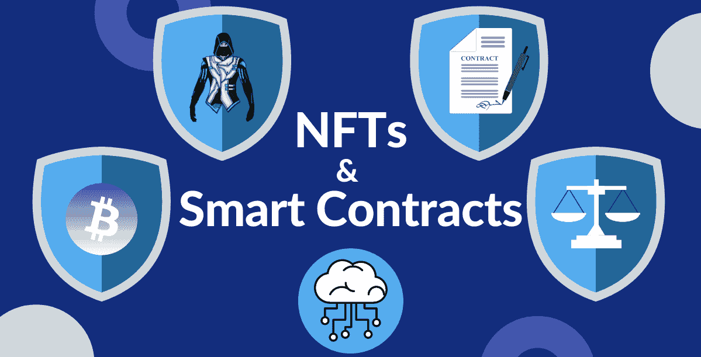
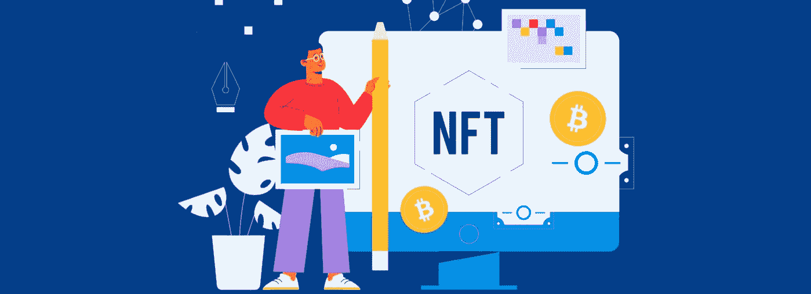
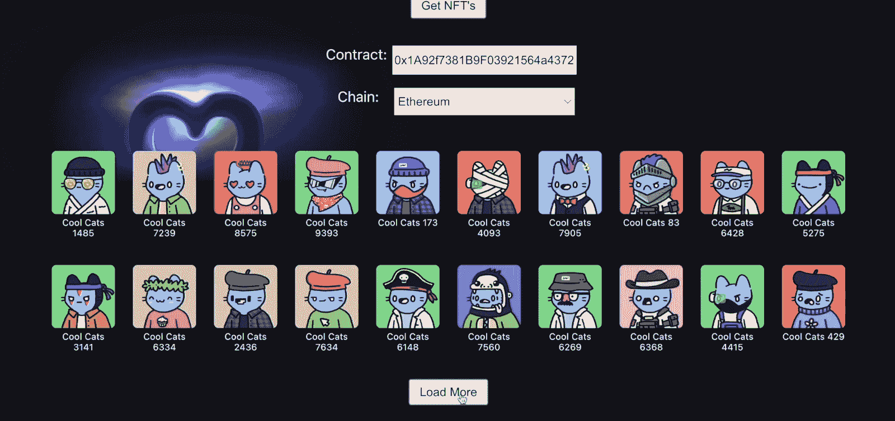
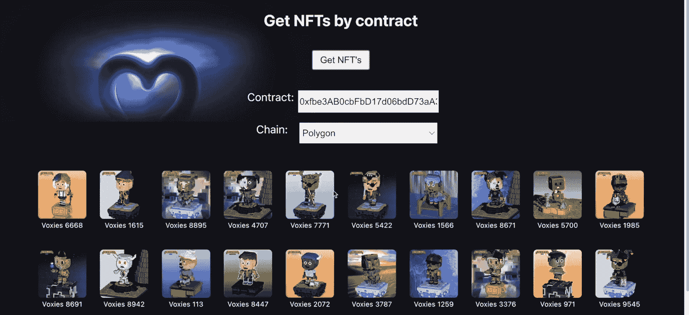

# 如何从合同中获取所有非功能性交易

> 原文：<https://moralis.io/how-to-get-all-nfts-from-a-contract/>

从合同中提取 NFT 并将其呈现给用户是开发人员必须知道如何做的一项基本而重要的任务。使用 Moralis 的以下端点，开发人员可以很容易地从 contract 中获得所有的 NFT:

```js
const response = await Moralis.EvmApi.nft.getContractNFTs({
```

使用上面的端点，您将获得给定契约地址的不可替换的令牌，包括所有可用 NFT 的元数据。如果你是一个有经验的开发人员，想要马上开始，首先确保注册 Moralis，然后你可以访问[文档页面](https://docs.moralis.io/reference/getcontractnfts)并马上开始！但是，如果您想看到实现和完成上述代码片段的整个文件的一步一步的过程，请继续阅读！

[**Sign Up with Moralis**](https://admin.moralis.io/register)

### 概观

在上一轮牛市中，出现了许多与 NFT 相关的项目，包括 NFT 门户网站、市场等。现在，开发人员已经为这些令牌发现了越来越多的用例以及各种实用功能。因此，现在是学习如何围绕这些令牌轻松构建各种分散式应用程序(dapps)的最佳时机。也就是说，一个很好的起点是一个整洁的 NFT 浏览器——一个 dapp，使您能够从合同中获得所有的 NFT。虽然这项任务听起来很有挑战性，但如果使用正确的工具，这是一个非常简单的过程。

多亏了 Moralis 的终极 [NFT API](https://moralis.io/nft-api/) 和它的“ *getContractNFTs* ”端点，您可以在几分钟内启动并运行一个全功能的 NFT 浏览器，这正是您将在今天文章的最后阶段学到的。然而，在我们重点向您展示如何以最简单的方式从 contract 获得所有 NFT 之前，我们需要了解一些基础知识。因此，我们将首先确保您知道什么是 NFTs 和智能合同，以及它们之间的关系。接下来，我们将仔细看看最重要的 NFT 开发工具。最后，在邀请您卷起袖子之前，我们还将确保您熟悉 Moralis 的" *getContractNFTs* "端点。毕竟，如果你决定完成本教程，后者将在后端为你做所有的艰苦工作。此外，在这种情况下，你还需要你的[免费 Moralis 账户](https://admin.moralis.io/register)。



## 探索非功能性交易和智能合约

不可替换令牌(NFT)是一种独特的加密资产。正如“不可替换”一词所表明的，这些令牌是不可互换的。毕竟，每个 NFT 都有唯一的加密(链上签名)。因此，这个属性使得 NFTs 非常适合所有涉及惟一性的用例。此外，这也是为什么数字艺术和数字收藏品是不可替代代币最明显的应用。然而，NFT 有更大的潜力——它们可以帮助创造一个更加透明、公正和不可信的未来。毕竟，NFT 非常适合各种所有权证明和认证。因此，如果实施得当，它们可以彻底改变数字和现实世界。

与可替换令牌一样，智能合约在创建(铸造)NFT 中也发挥着至关重要的作用。这些具有预定义条件和动作的软件是拼图的重要组成部分。因此，每个 NFT 背后都有一份精明的合同。当然，这取决于 NFT 的类型以及有多少非功能性交易实际上由特定的智能合约管理。例如，在以太坊网络和其他 EVM 兼容的连锁店，ERC-721 和 ERC-1155 NFT 智能合同运行显示。

智能合同还包括关于 NFT 的基本和可选细节。这些细节以元数据的形式出现。此外，链接到 NFT 文件(如 PNGs，JPEGs，MP3，pdf 等。)也包含在元数据文件中。

最后，一旦部署了 NFT 智能合约，它们可以自动启动非功能性交易的铸造过程，或者提供“冷”铸造功能。后者能够在以后进行铸造。*要了解更多有关不同 NFT 标准和采矿流程的信息，请务必浏览* [*Moralis 博客*](https://moralis.io/blog/) *。*



## NFT 开发工具

如上所述，数字文件，如图像，是由 NFTs 表示的文件。重要的是要记住，文件本身与任何其他文件没有什么不同。NFT 的真正价值在于它们的加密，隐藏在后端。因此，当我们谈论 NFT 开发工具时，我们关注的是铸造过程和支持 NFT dapp 开发的工具。

因此，如果您要创建自己的 NFT，您需要准备好“代表 NFT”的文件和相应的元数据文件(JSON)。此外，您可以随时使用 NFT 开发工具，利用现有的 NFT 来构建 dapps。也就是说，当你想要[创建一个 NFT 项目](https://moralis.io/how-to-create-an-nft-project-get-started-and-launch-successfully/)时，创建一个合适的计划是很重要的。

以下是最必要的 NFT 开发工具，可以帮助您处理各种 NFT 项目:

*   **构建和测试 NFT Dapps:**
    *   传统开发工具
    *   moralis(web 3 API，包括 NFT API)——这是从契约中获取所有 NFT 的最简单的方法
    *   Web3 钱包

*   **NFT 文件和元数据存储:**
    *   分散存储解决方案(如 IPFS)

*   **NFT 在兼容 EVM 的链条上铸造:**
    *   兼容 EVM 的 Web3 钱包
    *   Solidity 或 Viper 创建与 EVM 兼容的智能合约
    *   OpenZeppelin 获取经过验证的智能合同模板
    *   用于编译、部署和验证智能合约的 Remix IDE 和 Hardhat 平台

*   **NFT 对索拉纳的造币:**
    *   Metaplex 的糖果机
    *   可能需要独特的链上索拉纳程序的项目生锈
    *   索拉纳钱包(如幻影)

## 从契约中获取所有 NFT——“getContractNFTs”端点

在下一节中，您将有机会尝试创建自己的 NFT 探险家 dapp。因为 Moralis 的" *getContractNFTs* "端点将扮演主要角色，所以在实际使用它之前，您必须对它有更多的了解。此外，此端点使您能够从契约中获取所有 NFT，包括给定智能契约的所有 NFT 的元数据。此外，由于端点被限制为每页显示 100 个结果，您需要使用 cursor 参数来获得 100 个以上的 NFT。


上面的屏幕截图显示了“通过合同获取 NFTs”文档页面。在这里，您可以探索这个端点的详细信息，甚至复制您需要的代码。此外，“ *getContractNFTs* ”端点接受以下参数:

*   ****地址******——这里需要提供一个 NFT 智能合约地址。这是唯一必需的参数(所有其他参数都是可选的)。****
*   ******链******——你可以决定专注于哪个可编程链(Moralis 支持所有领先的 Web3 网络)。******
*   ***"* ***格式****"***–您可以确定想要使用哪种类型的令牌 ID 格式。****
*   ******限制******–您可以设置想要的结果页面大小。******
*   ***"****total range****"***–您可以决定将结果拆分成多少个子范围。****
*   ******范围******——您可以设置想要查询的子范围。******
*   ******光标******–此参数使您能够进入下一页。******

**

## 如何从合同中获得所有非功能性交易–分步指南

在今天的教程中，我们将重点关注 NodeJS 的使用。因此，我们将创建一个简单的 NodeJS 后端 dapp，它将使用" *getContractNFTs* "端点从 contract 获取所有 NFT。然而，在我们看代码之前，让我们向您展示一下您将构建什么。

#### 使您能够从合同中获得所有非功能性交易的 Dapp 示例–演示

如果你看上面的图像，你可以看到我们的例子 NFT 浏览器 dapp 提供的所有输入字段。因此，您可以看到，为了使用“Get NFTs”按钮，我们需要提供一个智能契约地址并选择匹配的链。以下是我们在以太坊上看到的一个 NFT 收藏的例子(“酷猫”):



看上面的截图，可以看到“获取 NFTs”按钮返回二十个 NFTs。然而，我们的 dapp 还包括“加载更多”按钮，每当我们点击它时，就会加载额外的 20 个 NFT。

此外，这里还有另一个不同链(多边形)上的示例(“体素”NFTs):



如果您想构建自己的这样一个伟大的 NFT 探险家 dapp 的实例，请遵循以下步骤。

### 步骤 1:创建 NodeJS 后端 Dapp

*注意:如果这是您第一次创建 NodeJS 应用程序，请确保使用 Moralis 文档中的“* [*使用 NodeJS*](https://docs.moralis.io/docs/nodejs-dapp-from-scratch) *”页面。在这里，您将学习如何安装所需的依赖项，并设置和运行一个将启动“index.js”文件的 Express 服务器。*

此时，您应该已经准备好了一个基本的 NodeJS 应用程序，并且正在 Express 服务器上运行。因此，您可以专注于创建一个合适的“index.js”脚本来完成后端的繁重工作。因此，首先在文件顶部定义所需的常量:

```js
const express = require("express");
const Moralis = require("moralis").default;
const app = express();
const cors = require("cors");
const port = 3000;
```

接下来，添加这两行代码以使用“ *cors* 和“ *express* ”:

```js
app.use(cors());
app.use(express.json());
```

最后，您要为所有的 NFT 创建" *get* "端点，在这里您将使用" *getContractNFTs* "端点从契约中获取所有的 NFT。最后，这些代码行还将检查 cursor 参数，以防用户想要加载更多的 NFT:

```js
app.get("/allNft", async (req, res) => {
  try {
    const { query } = req;

    let NFTs;

    if (query.cursor) {
      NFTs = await Moralis.EvmApi.nft.getContractNFTs({
        address: query.address,
        chain: query.chain,
        cursor: query.cursor,
        limit: 20,
      });
    } else {
      NFTs = await Moralis.EvmApi.nft.getContractNFTs({
        address: query.address,
        chain: query.chain,
        limit: 20,
      });
    }

    const result = NFTs.raw;

    return res.status(200).json({ result });
  } catch (e) {

    console.log(e);
    console.log("something went wrong");
    return res.status(400).json();

  }
});
```

如您所见，上面几行代码还确保了" *getContractNFTs* "端点从客户端获取其参数(如前所述)。至于光标，后者将连接到“加载更多”按钮。

### 步骤 2:获取您的 Moralis API 密钥

每次运行“index.js”文件时，您都希望启动 dapp。然而，在此之前，你要启动 Moralis。这些代码行会解决这个问题:

```js
Moralis.start({
  apiKey: "MORALIS_API_KEY",
}).then(() => {
  app.listen(port, () => {
    console.log(`Listening for API Calls`);
  });
});
```

通过查看上面的代码行，您可以看到“ *MORALIS_API_KEY* ”占位符。您需要用实际的 Moralis Web3 API 密钥替换后者。因此，登录到您的 Moralis 帐户访问您的管理区。从那里，您将转到“Web3 APIs”页面并复制您的 API 密钥:


通过粘贴您的 Web3 API 密钥，您应该已经准备好了您的后端:


尽管如此，您可以在 GitHub 上访问完整的" [index.js](https://github.com/MoralisWeb3/youtube-tutorials/blob/main/GetAllNfts/api/index.js) "脚本。

### 步骤 3:创建一个 ReactJS 前端 Dapp

因为您可能有一些创建 JavaScript 应用程序的经验，所以创建上面演示的前端应该没有任何问题。然而，为了确保你做得正确，我们在 [GitHub](https://github.com/MoralisWeb3/youtube-tutorials/tree/main/GetAllNfts/ap) 上提供了所需的脚本。因此，使用我们的回购让您的前端在创纪录的时间内准备好。然后，您将能够探索“ [App.js](https://github.com/MoralisWeb3/youtube-tutorials/blob/main/GetAllNfts/ap/src/App.js) ”文件的细节，这是我们 dapp 客户端的核心。此外，函数“ *fetchNFTs* ”获取输入的智能合同地址和选择的链:

```js
  async function fetchNFTs() {
    let res;
    if (cursor) {
      res = await axios.get(`http://localhost:3000/allNft`, {
        params: { address: address, chain: chain, cursor: cursor },
      });
    } else {
      res = await axios.get(`http://localhost:3000/allNft`, {
        params: { address: address, chain: chain },
      });
    }
```

最后但同样重要的是，在下面的视频中，从 4:10 开始，您可以进一步了解我们的示例 dapp 的代码和功能。这是我们的内部专家第一次介绍后端的要点。然后，从 5:51 开始，您可以查看“App.js”文件。尽管如此，您还可以看到如何使用浏览器的控制台来探索您完成的 dapp 的功能(7:02)。最后，从 9:24 开始，您可以学习如何毫不费力地改变每个查询显示的 NFT 数量。

[https://www.youtube.com/embed/3oUb9QGTXEU?feature=oembed](https://www.youtube.com/embed/3oUb9QGTXEU?feature=oembed)

## 如何从合同中获取所有非功能性交易–摘要

在今天的文章中，您有机会了解了 NFTs 和智能合约的基础知识。因此，你现在知道智能合约负责制造非功能性交易。我们还讨论了主要的 NFT 开发工具。然后，您了解了 Moralis 的" *getContractNFTs* "端点的威力。最后，你有机会卷起袖子，跟随我们的领导建立一个 NFT 探险家 dapp 的例子。因此，您现在知道如何轻松地从 contract 中获取所有 NFT。

如果你喜欢今天的教程，我们鼓励你使用 [Moralis 文档](https://docs.moralis.io/docs)并处理其他示例项目。如果您想继续您的 NFT 编程之旅，您应该关注“NFT API”部分。另一方面，您可以探索 Moralis Web3 API 提供的其他可能性。此外，确保使用[Moralis YouTube 频道](https://www.youtube.com/c/MoralisWeb3)和我们的博客来扩展您的区块链发展知识。我们的一些最新文章围绕着什么是 [Web3 提供商](https://moralis.io/web3-provider-why-blockchain-developers-should-use-one/)，如何[商业 web 3](https://moralis.io/web3-for-business-how-and-why-you-can-integrate-web3-into-your-enterprise/)工作，一个 [Web3 JS 教程](https://moralis.io/web3-js-tutorial-for-blockchain-developers/)的演示，构建一个 [Web3 Unity 多人游戏](https://moralis.io/how-to-build-a-web3-multiplayer-game-using-unity-multiplayer/)等等。

此外，你可能有兴趣在密码部门找到一份令人难以置信的工作。如果是这样，成为区块链认证可以大大提高你的胜算。这就是 Moralis 学院进入画面的地方。在那里你可以找到许多区块链发展课程，包括教你如何[建立一个 NFT 市场的课程。此外，Moralis 学院也是获得专家指导的地方，个性化的学习路径，并成为行业最先进的社区之一的成员。](https://academy.moralis.io/courses/ethereum-dapp-programming)**