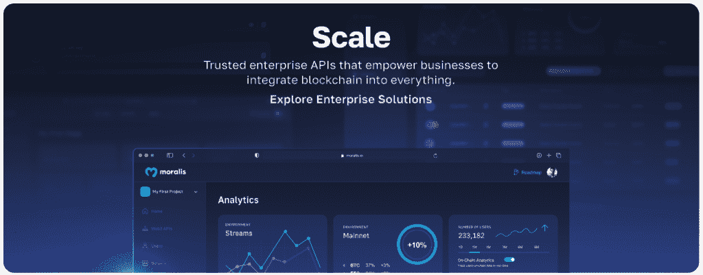
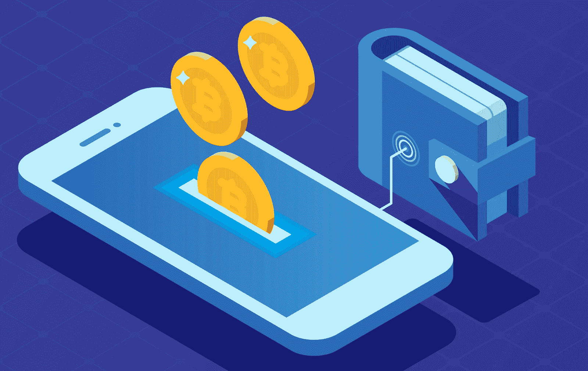
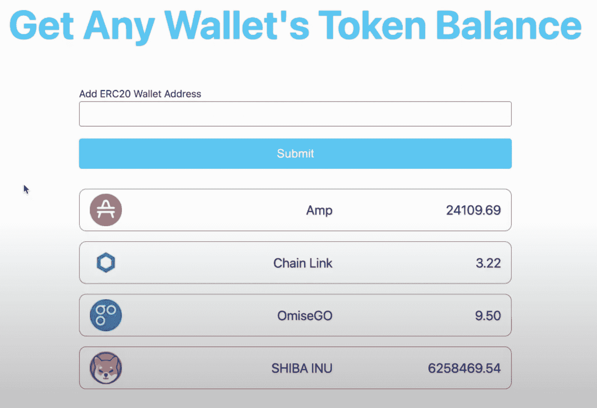
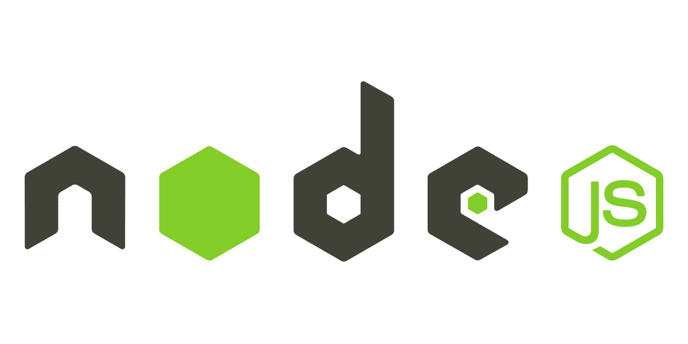
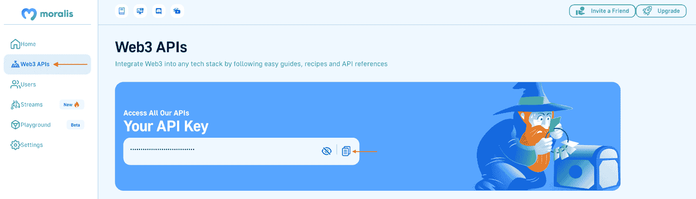
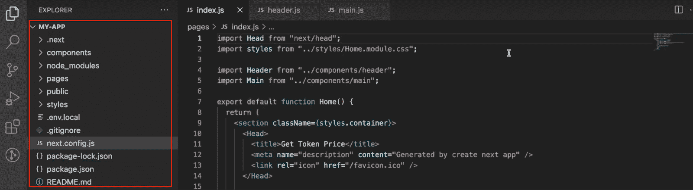

# 如何在 5 个步骤中获得钱包拥有的所有代币

> 原文：<https://moralis.io/how-to-get-all-tokens-owned-by-a-wallet-in-5-steps/>

**你想知道如何获得一个钱包拥有的所有代币吗？如果是这样，你就来对地方了，因为本教程演示了如何使用**[](https://moralis.io)****！多亏了 Moralis 的 Token API，您可以通过五个简单的步骤获得钱包拥有的所有令牌:****

***   创建项目*   通过在终端中运行以下命令来安装 Moralis:**

```js
npm install moralis @moralisweb3/common-evm-utils
```

***   建立一个新文件*   输入以下内容(添加 Moralis API 密钥、地址和所需的链):**

```js
const Moralis = require('moralis').default;
const { EvmChain } = require('@moralisweb3/common-evm-utils');

const runApp = async () => {
  await Moralis.start({
    apiKey: "YOUR_API_KEY",
    // ...and any other configuration
  });

  const address = '0xBf6521AF44F5D56813A93dCE548E6594Daa00794';

  const chain = EvmChain.ETHEREUM;

  const response = await Moralis.EvmApi.token.getWalletTokenBalances({
    address,
    chain,
  });

  console.log(response.toJSON());
}

runApp();
```

***   通过使用以下终端命令运行程序，调用" *getWalletTokenBalances* "端点:**

```js
node “FILE_NAME”
```

**执行程序后，您会收到一个响应，其中包含指定钱包拥有的所有令牌。它应该是这样的:**

```js
{
    "token_address": "0xff20817765cb7f73d4bde2e66e067e58d11095c2",
    "name": "Amp",
    "symbol": "AMP",
    "logo": "https://cdn.moralis.io/eth/0xff20817765cb7f73d4bde2e66e067e58d11095c2.png",
    "thumbnail": "https://cdn.moralis.io/eth/0xff20817765cb7f73d4bde2e66e067e58d11095c2_thumb.png",
    "decimals": 18,
    "balance": "24109691515670000000000"
  }
```

**如需更多信息，请查看官方的[端点文档，通过钱包获取余额！](https://docs.moralis.io/reference/getwallettokenbalances)**

### **概观**

**开发分散应用程序(dapps)和其他 Web3 项目需要相关的链上数据。因此，Web3 开发者迫切需要一种快速有效的方法来查询区块链网络，这就是 Moralis 要考虑的问题。通过 Moralis 的[web 3 API](https://moralis.io/web3-apis-exploring-the-top-5-blockchain-apis/)，你可以无缝地查询任何区块链的数据并接收实时响应。为了演示 Moralis 的可访问性，我们将在本文中向您展示如何使用令牌 API 来获取钱包拥有的所有令牌。如果这听起来很有趣，请加入我们的教程，因为我们将从头到尾涵盖这个过程！**

**为了向您展示 Moralis 的令牌 API 在实践中是如何工作的，本文演示了如何构建一个应用程序，用户可以在其中输入一个地址，然后单击一个按钮来查询钱包的令牌余额。然而，在深入中心部分之前，文章简要概述了什么是代币钱包。因此，如果您已经熟悉代币钱包，可以直接跳到“*应用演示*部分。**

**此外，Token API 只是 Moralis 提供的众多工具之一。还有其他几个突出的特性可以发现，如果你真的想进入 Web3 开发，我们建议你这样做。例如，检查一下 [Auth API](https://moralis.io/authentication/) ，它允许您将[基于区块链的认证](https://moralis.io/blockchain-based-authentication-how-to-integrate/)无缝集成到您的项目中，只需单行代码。如果这听起来很有趣，你可以，例如，学习如何[用 RainbowKit](https://moralis.io/how-to-add-a-sign-in-with-rainbowkit-to-your-project-in-5-steps/) 添加一个标志！**

**然而，无论你从事什么样的区块链开发工作，现在就和 Moralis 签约，充分利用区块链技术的潜力吧！**

**[**Sign Up with Moralis**](https://admin.moralis.io/register)

## 什么是代币钱包？

如果你想进入 Web3 领域，第一步是获得一个令牌钱包。人们使用代币钱包来存储数字资产，如可替代和不可替代代币(NFT)。结合持有资产的能力，代币钱包通常还具有附加功能。其中，这包括发送、购买、销售和交换资产。反过来，您可以通过令牌钱包全面管理您的数字资产。



除了提供一个简单的方法来管理你的资产，代币钱包打开了区块链王国的大门。因此，钱包是通往 Web3 生态系统的门户，使任何人都能与各种区块链网络上的 dapps 和平台进行交互。因此，代币钱包在区块链扮演着重要的角色！

以下是您可以考虑的一些著名的令牌钱包提供商示例:

*   MetaMask
*   比特币基地钱包
*   幽灵
*   阿尔根特
*   信任钱包

更重要的是，如果你想了解更多关于代币钱包的信息，请查看我们在 Web3 博客上的指南，探索 Web3 钱包！

尽管如此，现在你对代币钱包已经比较熟悉了，是时候深入本教程的中心部分了。但是，在此之前，我们提供了一个应用程序的快速演示，您将在本文中学习创建该应用程序！

## 获取钱包拥有的所有代币–应用程序演示

本教程将教您如何创建一个简单的 NextJS 应用程序，用户可以从中获得钱包拥有的所有令牌。也就是说，在进入教程之前，本节提供了一个快速的应用程序演示。通过覆盖应用程序的复杂性，你可以更好地理解你正在努力的方向！

不过，你可以在下面找到这个应用程序的登陆页面截图:


该应用程序有三个主要组件:一个标题、一个输入字段和一个“提交”按钮。该字段将 Web3 wallet 地址作为输入，一旦您单击“提交”按钮，它将返回一个表格，显示指定 wallet 拥有的所有令牌:



如上图所示，该应用程序返回钱包中所有代币的缩略图、名称和美元余额。然而，Moralis 的令牌 API 提供了额外的信息，比如每个令牌的地址和符号。(我们刚刚决定不在应用程序的用户界面上显示这些信息)。

如果您想了解如何构建这个应用程序，请加入我们下面的部分，我们将向您展示如何通过五个简单的步骤获得钱包拥有的所有令牌！

## 5 步分解–如何获得钱包拥有的所有代币

随着对你正在努力的目标有了更深刻的理解，是时候向你展示如何获得钱包所拥有的所有代币了。此外，为了做到这一点，下面几节将教您如何创建一个简单的 NextJS 应用程序，您可以在其中输入一个地址并从指定的钱包中获取所有令牌作为回报。此外，由于 Moralis 的 [Token API](https://moralis.io/token-api/) ，您将能够只通过五个简单的步骤来创建这个应用程序:

1.  完成先决条件并设置 Moralis 账户
2.  获取您的 Moralis API 密钥
3.  项目设置
4.  代码分解:“index.js”和“header.js”
5.  代码分解:“main.js”

通过完成上述步骤，您将了解 Moralis 的令牌 API 如何工作，以及如何获得钱包拥有的所有令牌。在本教程结束时，您将具备在未来的 dapps 中添加类似功能的知识！


然而，事不宜迟，让我们直接进入第一步，并涵盖所需的先决条件！

### 步骤 1:完成先决条件并设置 Moralis 帐户

首先，在第一步中，您首先需要处理几个先决条件。具体来说，您需要确保已经安装了 NodeJS 和 npm。你可以通过访问 [NodeJS 网站](https://nodejs.org/en/)并安装最新版本来获得这两个组件。



除了 NodeJS 和 npm，你还必须[向 Moralis](https://admin.moralis.io/register) 注册。如果你还没有，现在就创建一个 Moralis 账户。建立一个帐户只需要几分钟，而且完全免费！

### 步骤 2:获取您的 Moralis API 密钥

您需要注册 Moralis 的主要原因是您需要访问 API 密钥。正如我们前面提到的，您将使用 Moralis 的令牌 API 来获取钱包拥有的所有令牌。但是，为了与这个 API 的各种端点进行交互，您需要一个 Moralis Web3 API 密钥。那么，你能在哪里得到一个？

一旦你有了自己的账户，登录 Moralis 管理面板。单击“Web3 APIs”选项卡并找到您的 API 密钥。此外，点击“复制”按钮复制 API 密钥，因为下一步需要这个密钥:



### 步骤 3:项目设置

在第三步中，是时候设置应用程序了。为了使本教程尽可能容易理解，我们将使用一个已经预先制作好的项目。您可以在下面的 GitHub 资源库中找到完整的应用程序代码:

**获取钱包回购拥有的所有代币—**[**https://github . com/moralis web 3/YouTube-tutorials/tree/main/Get-any-wallets-token-balance**](https://github.com/MoralisWeb3/youtube-tutorials/tree/main/get-any-wallets-token-balance)

您可以打开存储库并将项目克隆到您的本地目录中。这样做应该会为您提供代码的本地副本，并且您应该会发现自己具有类似于下图中的文件结构:



从这里，打开一个新的终端，将 *cd* 放入项目的根文件夹，并运行下面的命令来安装 Moralis SDK:

```js
npm install moralis @moralisweb3/common-evm-utils
```

接下来，创建一个名为“. env.local”的新文件，并为您的 Moralis API 键添加一个环境变量。它应该是这样的(用实际的键替换" *YOUR_API_KEY* ):

```js
NEXT_PUBLIC_MORALIS_API_KEY=”YOUR_API_KEY”
```

这涵盖了使应用程序可操作的必要步骤。然而，我们还没有解释应用程序是如何工作的，或者你如何获得所有的令牌。因此，我们将代码分解为以下两个步骤，并进一步详细研究应用程序逻辑。这提供了对 Moralis 的 Token API 如何工作的洞察，允许您对任何未来的 Web3 项目使用相同的基本原则！

### 步骤 4:代码分解:“index.js”和“header.js”

有了项目的本地副本和所有必要的配置，我们将在接下来的章节中研究两个文件:“index.js”和“header.js”。因此，让我们从深入研究“index.js”文件的代码开始吧！

*   **“index . js”**—“index . js”文件中包含的代码负责渲染应用的主页。该文件的内容相对简单，如下所示:

```js
import Head from "next/head";
import styles from "../styles/Home.module.css";

import Header from "../components/header";
import Main from "../components/main";

export default function Home() {
  return (
    <section className={styles.container}>
      <Head>
        <title>Get Token Price</title>
        <meta name="description" content="Generated by create next app" />
        <link rel="icon" href="/favicon.ico" />
      </Head>

      <main className={styles.main}>
        <Header />
        <Main />
      </main>
    </section>
  );
}
```

在该文件的底部，您会发现负责呈现两个组件的代码:“ *Header* 和“ *Main* ”，这两个组件构成了我们将深入研究的两个附加文件。那么，让我们通过简单地看一下“header.js”来进行讨论。

*   **" header . js "**-" header . js "文件的代码非常简单，并且只负责 UI 上显示的应用程序标题和徽标:

```js
import Image from "next/image";
import styles from "../styles/Home.module.css";

import Logo from "../public/assets/Moralis_logo.png";

export default function Header() {
  return (
    <section className={styles.header}>
      <Image src={Logo} alt="Logo image" width="102" height="82" />
      <h1 className={styles.title}>Get Any Wallet's Token Balance</h1>
    </section>
  );
}
```

下一步，我们将深入“main.js ”,这是我们找到应用程序逻辑的地方！

### 第五步:代码分解:“main.js”

“main.js”文件包含应用程序的逻辑和代码，使我们能够获得钱包拥有的所有令牌。如果我们将它与我们在上一步中看到的其他文件进行比较，这个文件是相当大的。因此，我们将把文件分成更小的部分，集中在核心部分，这样更容易理解。因此，首先，让我们简要介绍一下文件的前四行:

```js
import { useState } from "react";
const Moralis = require("moralis").default;
const { EvmChain } = require("@moralisweb3/common-evm-utils");
import styles from "../styles/Home.module.css";
```

这些初始线路负责必要的进口。这也是安装 Moralis 和 EVM 实用程序的地方。在导入之后，代码的剩余部分是" *header()* "函数。反过来，该函数的特点是“ *handleSubmit()* ，包含获取钱包所拥有的令牌的逻辑:

```js
const handleSubmit = async () => {
    address = document.querySelector("#walletAddress").value;
    const chain = EvmChain.ETHEREUM;

    await Moralis.start({
      apiKey: process.env.NEXT_PUBLIC_MORALIS_API_KEY,
    });

    const response = await Moralis.EvmApi.token.getWalletTokenBalances({
      address,
      chain,
    });

    console.log(response.toJSON());
    setResult(response.toJSON());
    setShowResult(true);
    document.querySelector("#walletAddress").value = "";
  };
```

在" *handleSubmit()* "函数的第一部分中，您从 UI 获取钱包地址，我们将它存储在"*地址*变量中。接下来，指定“*链*“变量等于” *evmChain 的代码。以太坊*"表示你想查询以太坊网络上的一个地址。

从那里，代码使用" *Moralis.start()* "函数初始化 Moralis，将 API 键作为参数传递。最后，通过“*getWalletTokenBalances()”*函数，调用 Moralis Token API 端点，并将结果存储在“ *response* ”变量中。

其余代码呈现应用程序的 UI 元素，并决定向用户显示哪些数据:

```js
return (
    <section className={styles.main}>
      <form
        className={styles.getTokenForm}
        name="create-profile-form"
        method="POST"
        action="#"
      >
        <label className={styles.label} htmlFor="walletAddress">
          Add ERC20 Wallet Address
        </label>
        <input
          className={styles.walletAddress}
          type="text"
          id="walletAddress"
          name="walletAddress"
          maxLength="120"
          required
        />
      </form>
      <button className={styles.form_btn} onClick={handleSubmit}>
        Submit
      </button>
      <section className={styles.result}>
        {showResult &&
          result.map((token) => {
            return (
              <section
                className={styles.tokenContainer}
                key={result.indexOf(token)}
              >
                
                <p className={styles.name}>{token.name}</p>
                <p className={styles.amount}>
                  {(token.balance / 10 ** token.decimals).toFixed(2)}
                </p>
              </section>
            );
          })}
      </section>
    </section>
  );
```

这涵盖了应用程序代码的核心部分！更详细的分析，请看下面来自[Moralis YouTube](https://www.youtube.com/channel/UCgWS9Q3P5AxCWyQLT2kQhBw)频道的视频。在本视频中，您将看到一个视频教程，详细介绍了整个过程:

[https://www.youtube.com/embed/VdnMRiMYibA?start=295&feature=oembed](https://www.youtube.com/embed/VdnMRiMYibA?start=295&feature=oembed)

此外，查看[官方的“getWalletTokenBalances”端点文档](https://docs.moralis.io/reference/getwallettokenbalances)和完整的[令牌 API 文档](https://docs.moralis.io/docs/token-api)，以获得关于本教程中使用的令牌 API 和端点的更多信息！

## 获取钱包拥有的所有代币-摘要

在本文中，您看到了如何获得钱包拥有的所有令牌，这要感谢 Moralis 的令牌 API。为了展示这个 API，本文演示了如何创建一个简单的 NextJS dapp，允许任何人根据地址查询钱包的令牌余额。此外，由于 Moralis 的可访问性，您只需五个步骤就能创建此应用程序:

1.  完成先决条件并设置 Moralis 账户
2.  获取您的 Moralis API 密钥
3.  项目设置
4.  代码分解:“index.js”和“header.js”
5.  代码分解:“main.js”

如果你觉得这篇文章有帮助，你可以在 Moralis 的 [Web3 博客](https://moralis.io/blog/)上查看其他令人兴奋的指南。例如，探索错综复杂的[以太坊网钩](https://moralis.io/ethereum-webhooks-what-they-are-and-how-to-use-webhooks-for-ethereum/)或学习如何[使用 Python](https://moralis.io/how-to-get-nft-collections-using-python-and-react/) 获得 NFT 收藏！此外，如果您对以太坊开发最感兴趣，请查看我们的文章，探索如何为 dapp 开发获得 ERC20 令牌的[平衡、](https://moralis.io/balance-of-erc20-how-to-get-balance-of-an-erc20-token-from-address/)[终极 ERC20 令牌 API](https://moralis.io/exploring-the-ultimate-erc20-token-api/) 和[最佳 ERC20 令牌平衡 API](https://moralis.io/the-best-erc20-token-balance-api-for-dapp-development/) ！

尽管如此，如果你想充分利用区块链的力量，请立即与 Moralis 家签约。您可以免费设置您的帐户，而且只需几秒钟，因此您不会有任何损失！**