# 如何获取区块链短信通知

> 原文：<https://moralis.io/how-to-get-blockchain-sms-notifications/>

电子邮件和短信通知是几乎每个行业都使用的流行沟通方式。今天，人们可以收到任何内容的短信，比如购买后的交易确认。随着区块链交易变得越来越受欢迎，如果用户可以获得区块链短信通知，那不是很好吗？幸运的是，我们可以在我们的 Web3 应用中轻松实现这一功能，而且只需几个步骤:

1.  **部署你的** [**智能契约**](https://moralis.io/smart-contracts-explained-what-are-smart-contracts/) **与** [**混搭**](https://moralis.io/remix-explained-what-is-remix/) **。**
2.  **创建你的******服务器。****
***   **使用 Moralis 的“同步”功能对** [**同步并索引智能合约事件**](https://moralis.io/sync-and-index-smart-contract-events-full-guide/) **。***   **完成 Twilio 和 OneSignal 的初始设置。***   使用 Moralis 的云功能建立智能合约事件和 OneSignal 之间的通信。**

**我们鼓励你加入我们这个“如何获得区块链短信通知”的探索，因为我们采取了一个例子项目。通过这样做，你将学会获得区块链短信通知来跟踪连锁事件。后者可由开发团队使用，或用于通知用户 Web3 应用程序。在这个过程中，你将学会如何使用一些非凡的工具。其中包括 Twilio、OneSignal、Remix 和 Moralis。**

**第一个将使我们能够获得一个电话号码发送区块链短信通知。第二个工具将用于发送推送请求。有了 Remix，我们将能够编辑和部署我们的 [Web3 契约](https://moralis.io/what-are-web3-contracts-exploring-smart-contracts/)。最后但同样重要的是，我们将使用 Moralis——当前 [Web3 技术栈](https://moralis.io/exploring-the-web3-tech-stack-full-guide/)的顶峰——将所有这些结合在一起。幸运的是，这个“ [Firebase for crypto](https://moralis.io/firebase-for-crypto-the-best-blockchain-firebase-alternative/) ”平台提供了处理所有 Web3 后端需求的简洁方法。其中，它可以让你毫不费力地[索引区块链](https://moralis.io/how-to-index-the-blockchain-the-ultimate-guide/)。此外，有了这个终极的 [Web3 后端平台](https://moralis.io/exploring-the-best-web3-backend-platform/)，您就拥有了跨链和跨平台的互操作性。因此，[创建您的免费 Moralis 账户](https://admin.moralis.io/register)现在就开始吧！**

**

## 如何获得区块链短信通知–示例项目

随着我们向前推进，我们将首先对我们的示例项目做一个快速演示，以查看区块链 SMS 通知的运行情况。这将为你提供一个清晰的画面，从我们的“如何获得区块链短信通知”教程期待什么。在这次预览之后，我们将开放 Remix 并部署我们的“捐赠”智能合约。然后，我们将确保你学会如何完成初始 Moralis 设置。后者将是你进入 [Moralis 的 SDK](https://moralis.io/exploring-moralis-sdk-the-ultimate-web3-sdk/) 和所有上述 Moralis 特性的门户。接下来，我们将向您展示如何使用 Moralis 的同步功能和数据库，这在发送区块链短信通知中起着至关重要的作用。然后，我们将把您交给 Moralis 的一位专家，他将通过视频教程指导您完成“如何获得区块链短信通知”之旅的剩余步骤(第四步和第五步)。

### 链上事件的区块链短信通知–演示

我们先来看下面的截图。在该截图中，您将看到我们使用“PolygonScan”来查看我们的智能合同。此外，右边是我们手机显示屏的预览:

使用 PolygonScan 的界面，我们可以输入想要捐赠的金额。要确认我们的捐赠，我们需要点击“写”按钮。通过这样做，接口触发了我们的[元掩码](https://moralis.io/metamask-explained-what-is-metamask/)扩展，它提示我们确认我们的事务:

我们通过点击“确认”按钮执行代表我们捐赠的交易。因此，当这个连锁事件发生时，我们收到一条短信:

## 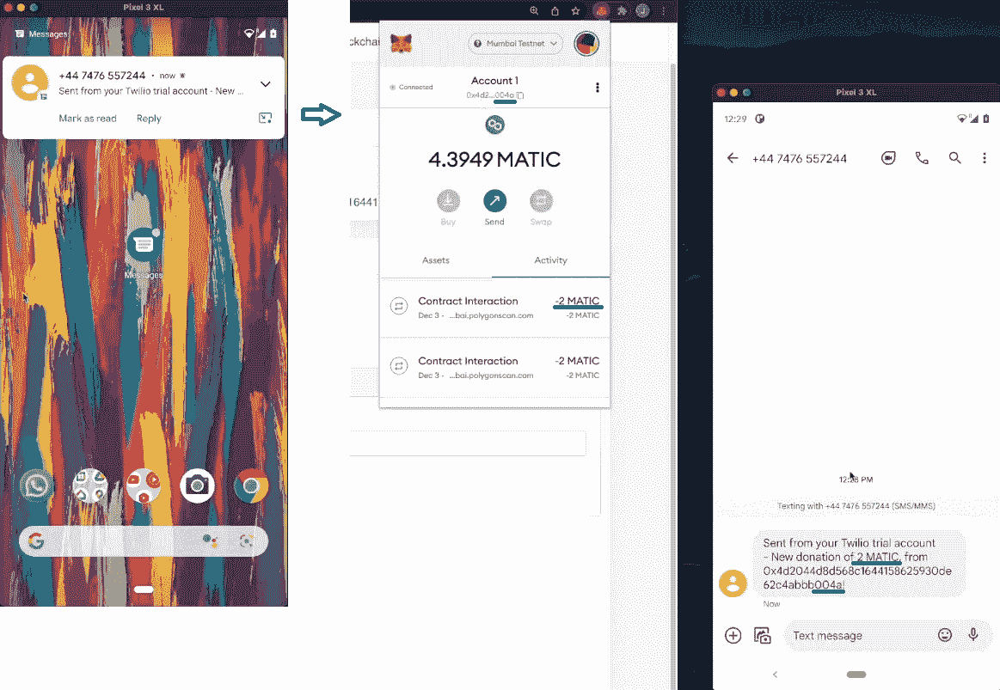

因此，我们可以确认我们的区块链短信通知功能正常。

*注意* *:与我们的示例项目相关的全部代码在* [*GitHub*](https://github.com/IAmJaysWay/Moralis-Blockchain-Notifications) *等着你。*

## 区块链短信通知和智能合约

除非你一直生活在岩石下，否则你很可能听说过[以太坊](https://moralis.io/full-guide-what-is-ethereum/)。因此，你知道它是可编程区块链的领导者。然而，许多其他 [EVM](https://moralis.io/evm-explained-what-is-ethereum-virtual-machine/) 兼容(例如，雪崩，多边形，BNB 链等。)和非 EVM(如索拉纳、特拉等。)备选方案可用。所有可编程区块链使开发者能够在其网络之上创建[分散应用](https://moralis.io/decentralized-applications-explained-what-are-dapps/) (dapps)。此外，智能合约使 dapps 能够根据协议运行，并正确执行自动化操作。此外，他们是 dapps 的骨干。您还应该记住，每当智能合约做一些有意义的事情时，它们都会发出事件。因此，我们讨论智能合约事件。此外，我们使用 [Solidity](https://moralis.io/solidity-explained-what-is-solidity/) 编程语言为 EVM 兼容的链编写合同。

如果我们再次关注我们的项目，智能合同事件将触发我们的区块链短信通知。基于上面的演示，您知道我们的示例项目围绕着捐赠。此外，我们正在 Polygon 的 testnet(孟买)上执行捐赠交易。因此，这是我们将重点关注的链。事不宜迟，让我们开始“如何获得区块链短信通知”之旅的第一步吧！

### 步骤 1–使用 Remix 部署您的智能合约

我们创建的契约名为“[examplesonationcontract . sol](https://github.com/IAmJaysWay/Moralis-Blockchain-Notifications/blob/main/ExampleDonationContract.sol)”，在 GitHub 上也有。您可以将整个代码复制到 Remix 中。在那里，您还可以部署它。

查看上面的截图，您可以在 Remix 中看到我们的示例智能合约的详细信息。我们标记了将要跟踪的“捐赠”事件和“新捐赠”功能。我们的合同还包括一个代表捐款人的地址。还有“constructor()”，它确保消息值被发送给所有者。此外，您可以看到“捐赠”事件给出了捐赠者的地址和捐赠的金额。尽管如此,“newDonation”函数发出了“Donate”事件。

准备好部署智能合同后，单击“部署”。确保以我们为榜样，使用孟买测试网。你可以使用本文末尾的视频了解更多详情。

#### 区块链短信通知和 Moralis

在这篇“如何获得区块链短信通知”文章的开头，你已经了解了 Moralis 以及它如何满足你的区块链相关的后端需求。您还了解了必须创建一个 Moralis 服务器来利用该平台的能力。因此，我们将把注意力集中在这一步上。然后，我们将能够使用同步和云功能特性。

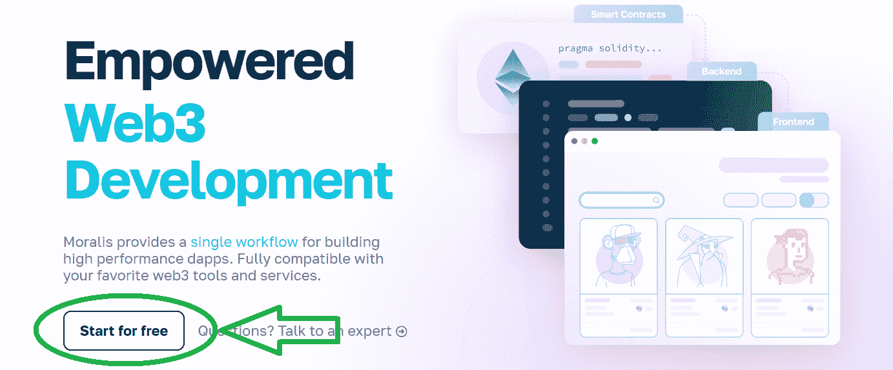

### 步骤 2–创建您的 Moralis 服务器

在“如何获得区块链短信通知”的第二部分，让我们看看如何创建一个 Moralis 服务器。

1.  **登录您的 Moralis 账户**–此时，您可能已经准备好了您的 Moralis 账户。因此，[只需登录](https://admin.moralis.io/login)。然而，如果不是这样，请使用本指南开头所述的“创建您的免费 Moralis 账户”链接。

2.  **创建 Moralis 服务器**–在您的 Moralis 管理区域(“服务器”选项卡)，点击“+ [创建新服务器](https://docs.moralis.io/moralis-dapp/getting-started/create-a-moralis-dapp#2.-create-a-moralis-server)”:

接下来，从下拉菜单中选择“Testnet 服务器”。然后，您需要输入服务器的详细信息。确保选择 Polygon 的 testnet 并点击“添加实例”来启动你的服务器:

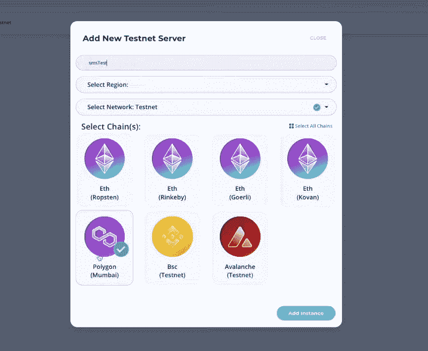

### 步骤 3–使用 Moralis 的同步功能同步和索引智能合同事件

服务器启动并运行后，您可以通过“查看详细信息”按钮访问同步功能:

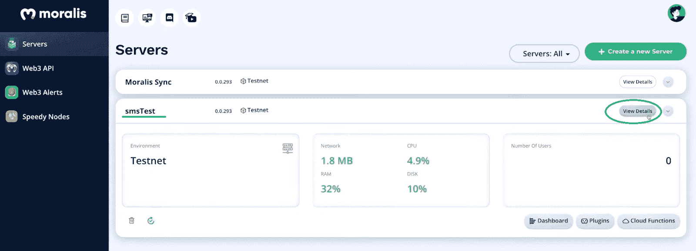

当你看到你的服务器的详细信息时，你需要切换到“同步”标签:

在“同步”标签里，你会注意到“没有安装同步服务”的信息。后者表示您正在使用一个尚未设置同步服务的新服务器。要继续，请单击“添加新同步”按钮:

点击按钮后，您将有两个选项:

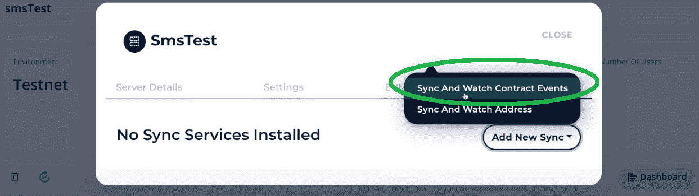

选择下拉菜单顶部的“同步和观察合同事件”选项。选择正确的同步选项后，您将开始配置您的同步并观看智能合约事件。这非常简单，尤其是因为您已经部署了智能合约。你只需要从 Remix 中复制并粘贴智能合同细节，我们将在下面进一步讨论。

#### 同步并收听智能合同事件–链 Id、描述、同步历史记录和主题

为了确保您做得正确，我们将指导您完成新“同步”的所有输入字段。首先，选择正确的网络(孟买测试网)。此外，单击它会得到一个绿色的勾号(见下图)。

*注意:如果孟买是您在创建 Moralis 服务器时选择的唯一网络，它将是唯一可用的选项。*

就“描述”而言，您可以键入您想要的任何内容，但请随时跟随我们的领导，使用“新捐赠观察”。接下来，取消选中(单击方块)默认启用的“同步历史”数据选项。对于我们的示例项目，我们对过去的链上数据不感兴趣。此外，要正确填写“主题”输入字段，您需要从智能合同中获取以下详细信息:

将上面选择的行粘贴到输入字段后，不要忘记删除变量名。您应该只保留变量类型，即“地址”和“uint256”:

#### 同步并收听智能合同事件–ABI、地址和表名

有了“主题”，是时候获得您的智能合同的 ABI 了。一旦你编译了你的智能合同，这些细节也可以在 Remix 里面找到。此外，确保你在 Remix 的第二个标签上，你会看到“复制 ABI”。后者在“编译细节”按钮下:

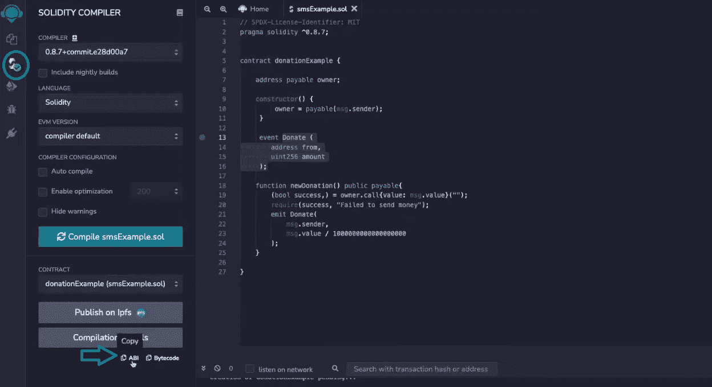

点击上述按钮后，您可以直接将智能合约的 ABI 粘贴到“同步”设置中“Abi”旁边的输入字段中。然而，ABI 有些地方你并不需要。因此，应用必要的调整，直到您剩下以下内容:

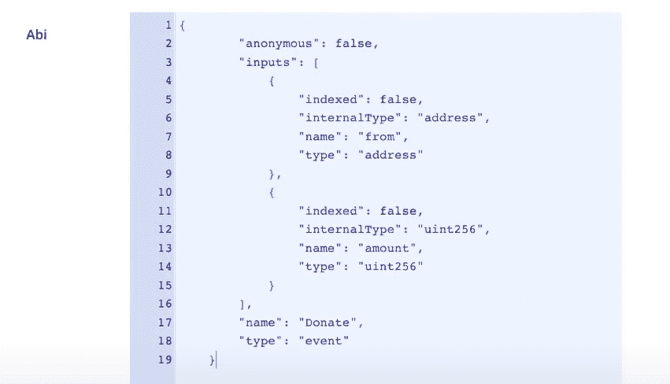

接下来,“同步”设置需要您的智能合约的地址，这在 Remix 中也有提供。因此，返回到您部署合同的地方:

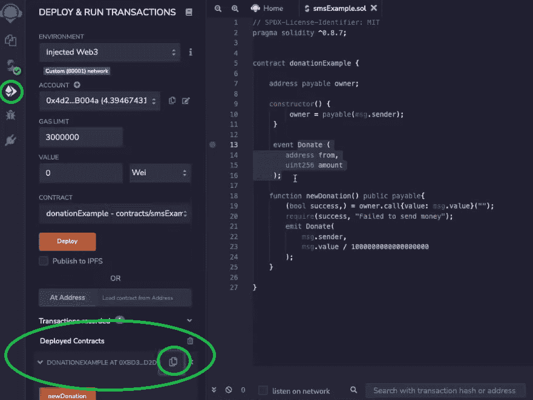

在“已部署的合同”部分，您将看到您的智能合同的名称和右侧的“复制”图标。使用它，然后将地址粘贴到“同步”设置中“地址”旁边的输入栏中:

至于“TableName”输入字段，您可以使用您想要的任何内容，或者按照我们的指示输入“new contributions”。现在，您已经输入了所有的详细信息，您最终可以通过单击“确认”按钮来创建您的同步。这样，您将使用新的同步信息替换“未安装同步服务”消息:

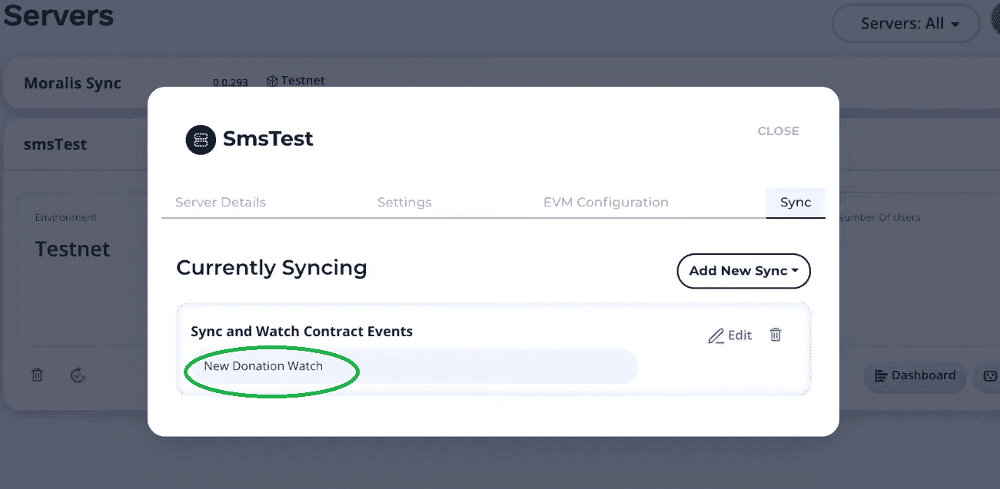

### 将 Moralis Dashboard 用于区块链短信通知

Moralis dashboard 本质上是一个数据库，可用于索引区块链。此外，每台 Moralis 服务器都配有它。要访问它并查看所有跟踪的事件，您需要首先关闭上面的窗口。然后，单击“查看详细信息”按钮旁边的箭头。最后，点击“仪表板”按钮:

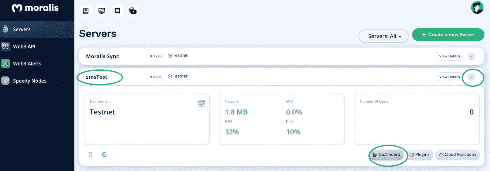

*注意:本文基于下面的视频教程，其中一位 Moralis 专家使用了旧版本的仪表板界面。但是，新仪表板的功能是相同的。*

在 Moralis 仪表板的左侧，您会看到几个类。一个“新捐赠”类也应该是可用的(见下面的截图)。根据它的名字，您可以看到这个类是根据我们的“TableName”条目自动创建的。此外，在这个类中，我们的“捐赠”智能合同的事件将被索引。然后，我们将使用这些索引事件来触发区块链短信通知。

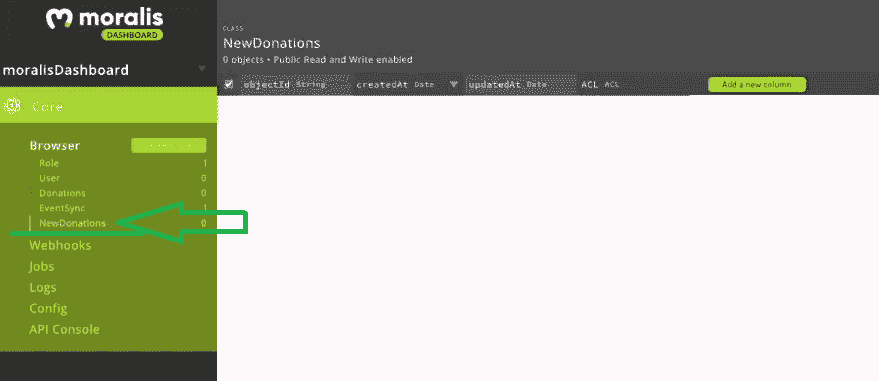

### 步骤 4 和 5–Twilio、OneSignal 和 Moralis 的云功能

如上所述，是时候把你的手交给 Moralis 专家了。从下面视频的 5:27 开始，他会指导你完成剩下的步骤。首先，他将向您展示如何创建一个合适的云函数(" [CloudFunction.js](https://github.com/IAmJaysWay/Moralis-Blockchain-Notifications/blob/main/CloudFunction.js) ")。此外，您将学习如何在 7:21 使用谷歌电子表格跟踪捐款总额。

接下来，您将了解更多实用的消息工具——Twilio(9:21)和 OneSignal (10:18)。此外，他还将指导您完成这两个工具的初始设置。因此，您可以使用它们来获得区块链短信通知。这两个工具将发挥重要作用；但是，他们需要一些东西将他们与我们的智能合同“联系”起来。在这里，您将学习如何使用云函数来实现这一目的(11:53)。这封信还将使您能够定制您的区块链短信通知的内容。

https://www.youtube.com/watch?v=PEILxU53-Zs

*注意:你也可以使用上面的视频(从 21:56 开始)来了解如何获得区块链电子邮件通知。在这种情况下，你也会想学习如何使用 SendGrid(上面 8:48 的视频)。后者处理电子邮件的方式和 Twilio 处理短信的方式一样。*

## 如何获得区块链短信通知–摘要

通过结合我们的说明和上面的视频教程，你有机会在你的 Web3 应用中实现区块链短信通知。我们希望您已经接手了这个示例项目，并学会了如何部署智能合同、使用 Moralis 以及使用其他优秀的工具，如 Twilio 和 OneSignal。此外，如果你喜欢这个示例项目，我们鼓励你访问[Moralis 的 YouTube 频道](https://www.youtube.com/c/MoralisWeb3)和[Moralis 的博客](https://moralis.io/blog/)。在那里，你会找到大量其他有用的教程和加密主题。

一些最新的文章演示了如何在你的网站上添加一个 [Web3 连接钱包按钮](https://moralis.io/how-to-add-a-web3-connect-wallet-button-to-your-website/)，[创建一个玩赚游戏](https://moralis.io/how-to-build-a-play-to-earn-p2e-game/)，使用[孟买测试网龙头](https://moralis.io/mumbai-testnet-faucet-how-to-get-free-testnet-matic-tokens/)，[宣称一个游戏内 NFT](https://moralis.io/how-to-claim-an-in-game-nft-full-guide/) ，以及创建一个[币安 NFT](https://moralis.io/how-to-create-a-binance-nft-in-5-steps/) 。还有，它教你需要知道的关于 [Web3 的一切没有元掩码](https://moralis.io/web3-without-metamask-web3-authentication-alternatives/)，[以太坊名称服务](https://moralis.io/what-is-ethereum-name-service-full-ens-guide/) (ENS)，它回答了“[什么是 Web2 和 Web3](https://moralis.io/what-is-web2-and-web3-explaining-web3/) ？”问题！

无论你是想[打造你的第一个 dapp](https://moralis.io/build-your-first-dapp-ethereum-tutorial/) 、[打造你自己的 ERC-20 token](https://moralis.io/how-to-create-your-own-erc-20-token-in-10-minutes/) ，还是一头扎进 [Unity Web3](https://moralis.io/unity-web3-beginners-guide-to-unity-web3-programming/) ，以上两个出口都有你涵盖。而且，你可以利用这两个平台[成为 Web3 开发者](https://moralis.io/how-to-become-a-web3-developer-full-guide/)。但是，如果你渴望尽快成为全职加密员，你应该采取更专业的方法。在这种情况下，考虑报名参加[Moralis 学院](https://academy.moralis.io/)，那里顶尖的[区块链发展课程](https://academy.moralis.io/all-courses)等着你。除了高质量的在线课程，您还将获得个性化的学习路径、专家指导以及业内最不可思议的社区之一的会员资格。有了这些，Moralis Academy 能让你[快速自信地成为一名区块链开发者](https://moralis.io/how-to-become-a-blockchain-developer/)。

**