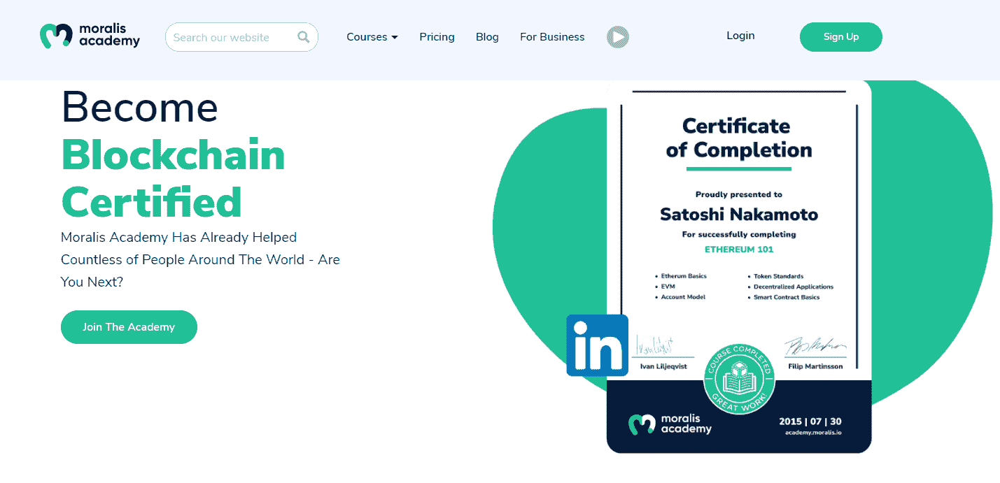
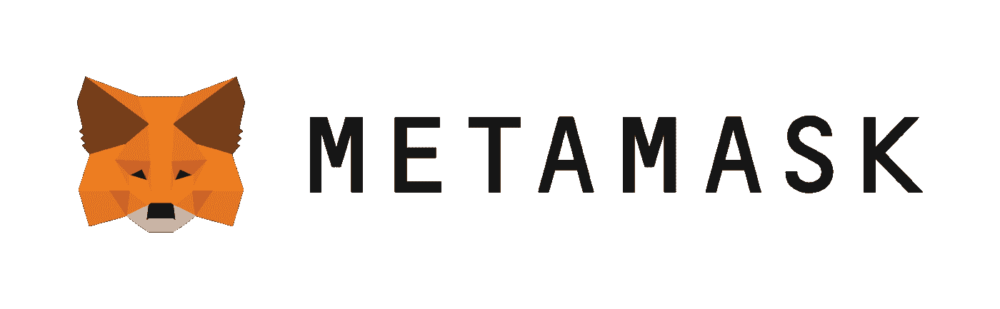
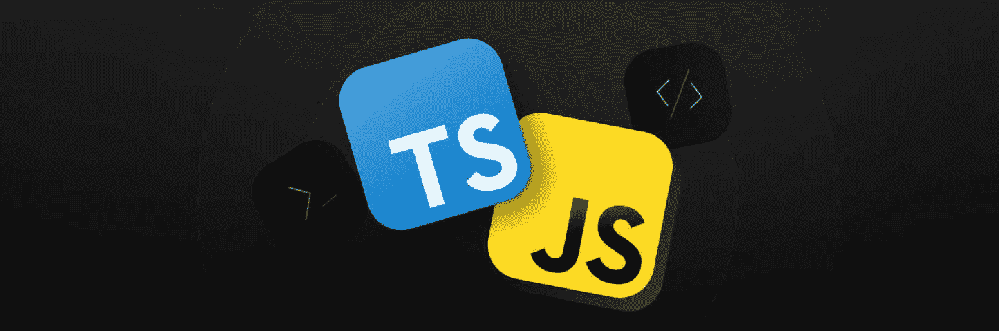
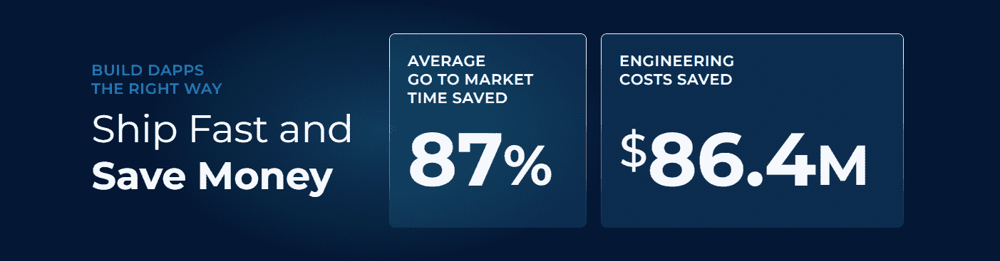
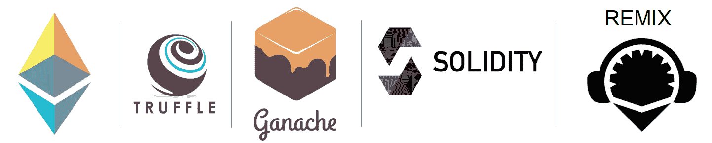

# 2022 年如何进入 Web3

> 原文：<https://moralis.io/how-to-get-into-web3-in-2022/>

随着 Web3 的出现，包括 DeFi、可编程区块链上的智能合约、GameFi、NFTs 等的快速增长。–许多人在问“如何进入 Web3？”。这实际上比你想象的要容易得多，尤其是如果你有最基本的程序员经验的话。使用正确的工具，即使是想涉足 Web3 的完全初学者也有机会进入这个领域，只要他们有学习的动力。现在，你有机会从“底层”进入 Web3。没有适合所有人的单一“如何进入 Web3”路径。然而，你将在这篇文章中学到的指导方针和技巧将是任何想在 2022 年进入 Web3 的人的一个极好的起点。

在这篇进入 Web3 的指南中，你将向你展示 [Web3 技术栈](https://moralis.io/exploring-the-web3-tech-stack-full-guide/)的基础知识。这让你对区块链王国有一个清晰的了解。我们还将向您展示使用 Moralis 开始制作您自己的 Web3 项目是多么容易。另外，你会发现如何开始开发 dApps ( [去中心化应用](https://moralis.io/decentralized-applications-explained-what-are-dapps/))，并构建像 [Web3 钱包](https://moralis.io/what-is-a-web3-wallet-web3-wallets-explained/)这样的东西。此外，如果你想在 Web3 行业找工作，你会得到所有你需要的技巧，让事情更上一层楼。此外，您将了解到[智能合同](https://moralis.io/smart-contracts-explained-what-are-smart-contracts/)以及如何创建和使用这些链上的软件。所以，事不宜迟，让我们仔细看看如何在 2022 年进入 Web3！

## 从 Web3 基础开始

无论你是想成为一名开发人员、营销人员、人才招聘人员，还是以任何其他方式进入 [Web3](https://moralis.io/the-ultimate-guide-to-web3-what-is-web3/) ，你都需要了解基础知识。必须清楚了解区块链技术和更广阔的 Web3 空间。首先，它帮助你决定你是否真的想成为这个颠覆性和不稳定行业的一部分。第二，它帮助你更好地看到它所呈现的不同选项。如果不了解智能合约、 [NFTs](https://moralis.io/non-fungible-tokens-explained-what-are-nfts/) 、 [DAOs](https://moralis.io/how-to-create-a-dao-in-10-minutes/) 、 [DeFi](https://moralis.io/how-to-create-a-defi-dashboard-in-5-steps/) 、[元宇宙](https://moralis.io/what-is-the-metaverse-full-guide/)以及密码领域的其他利基，你就无法确定自己想要关注哪一个。第三，它可以帮助你理解去中心化的概念，以及如何利用它让世界变得更美好。因此，它可能会为你未来所有的 Web3 努力提供一个强有力的 ***why*** 。

不过，要确保尽快从某个地方开始，然后随着你了解的越来越多，做出必要的改变。否则，你很容易陷入学习而不采取行动的陷阱。那么，作为开发者如何进入 Web3 呢？学习 Web3 基础知识，然后开始编码。如果你有自己的想法，试着去实现它们。如果没有，请使用现有的示例项目进行练习。此外，不要忘记在进步的同时学习。留心并注意你缺乏技能或知识的地方，并专注于弥补这些差距。

### 持续的区块链开发教育是关键

说到 Web3 基础，有无数的免费资源可以帮助你获得所有你需要的信息。然而，由于这也是一个相对较新的专业领域，有许多不可靠的来源利用你的经验不足。不幸的是，甚至一些流行的加密新闻网站也经常专注于传播 FUD。这也是我们创建[Moralis YouTube 频道](https://www.youtube.com/c/MoralisWeb3)和[Moralis 博客](https://moralis.io/blog/)的原因之一。因此，我们生产我们可以担保的内容。因此，你可以通过这两个途径免费学习所有的 Web3 基础知识。

除了获得各种区块链方面的清晰解释之外，这也是您可以跟踪大量示例项目的地方。因此，你可以轻松地[构建你的第一个 dApp](https://moralis.io/build-your-first-dapp-ethereum-tutorial/) 。此外，你可以更进一步，[推出一个白色标签的 NFT 市场](https://moralis.io/how-to-launch-a-white-label-nft-marketplace/)，打造一个 [Spotify Web3](https://moralis.io/how-to-build-a-web3-spotify-clone/) 克隆版，[打造一个 ERC-721 NFT](https://moralis.io/how-to-create-an-erc-721-nft/) ，甚至打造一个 [Web3 亚马逊市场](https://moralis.io/how-to-build-a-web3-amazon-marketplace/)。

然而，为了更快地获得更多的信心，我们建议采取更专业的方法。许多人已经利用他们在 Moralis 学院的注册作为跳板来获得非凡的网络 3 工作。此外，高质量的 [Web3 课程](https://academy.moralis.io/all-courses)似乎是这个在线区块链发展学院最重要的部分。虽然，事实上，他们只是其中的一小部分。更大的价值在于个性化的学习路径、先进的社区和专家指导。“如何进入 Web3”谜题的这些元素消除了所有的猜测。此外，与社区和专家导师的接触能让你得到所有问题的答案。

## 如何在 2022 年以最小的阻力进入 Web3

一旦你掌握了 Web3 基础知识，并致力于继续区块链教育，你就准备好充分利用它了。如上所述，Web3 正处于起步阶段，提供了无数的机会。这也意味着作为开发人员有很多方式可以参与进来。然而，有些路线可能相当长，极具挑战性。因此，我们希望专注于如何以最小的阻力进入 Web3。事实上，你将要发现的这条路是如此之短，它无愧于“进入 Web3 的终极捷径”的称号。

诀窍在于使用正确的工具。因此，您必须避免许多构建在[以太坊 RPC 节点](https://moralis.io/ethereum-rpc-nodes-what-they-are-and-why-you-shouldnt-use-them/)之上的开发人员的常见错误。RPC 节点的[限制实在太多了。相反，最好专注于当前 Web3 技术的顶峰。后者在底部有可编程的区块链，然后是节点和](https://moralis.io/exploring-the-limitations-of-rpc-nodes-and-the-solution-to-them/)[节点提供者](https://moralis.io/infura-alternatives-and-blockchain-node-providers/)、[区块链 API](https://moralis.io/alchemy-alternatives-top-blockchain-apis/)和平台，结果是 dApps:

[Moralis](https://moralis.io/) ，也被称为“ [Firebase for crypto](https://moralis.io/firebase-for-crypto-the-best-blockchain-firebase-alternative/) ”，是“如何进入 Web3？”的答案。它是满足您所有区块链相关后端需求的一站式解决方案。因此，这是[最好的 Web3 后端平台](https://moralis.io/exploring-the-best-web3-backend-platform/)，它使你能够通过从 [Moralis 文档](https://docs.moralis.io/)中复制简短的代码片段来覆盖后端功能。此外，后者是最整洁的文档之一。它还带有清晰的例子，甚至最大限度地简化视频说明。此外， [Moralis 的 SDK](https://moralis.io/exploring-moralis-sdk-the-ultimate-web3-sdk/) 包括一个令人印象深刻的 [Web3 API](https://docs.moralis.io/moralis-server/web3-sdk/intro) ，包括[终极 NFT API](https://moralis.io/ultimate-nft-api-exploring-moralis-nft-api/) 。因此，你可以毫不费力地[创建一个 OpenSea 克隆体](https://moralis.io/create-an-opensea-clone-build-an-nft-marketplace-like-opensea/)。这只是你可以用 Moralis 做什么的开始。

## 如何用 JavaScript 和元掩码进入 Web3

当谈到选择最有用的编程语言时，有相当大的讨论空间。然而，在我们看来，当你想获得最大的回报时， [JavaScript](https://moralis.io/javascript-explained-what-is-javascript/) (JS)是无可匹敌的。它的普及性和简单性也是 Moralis 专注于 JS 的原因。因此，精通 JavaScript 并知道如何使用[元掩码](https://moralis.io/metamask-explained-what-is-metamask/)的任何人都可以使用 Moralis 的力量。结合 Web3 基础，这些是开始的唯一[先决条件](https://docs.moralis.io/introduction/pre-requisites)。

而且，万一你是一个完全的初学者，我们建议学习 JavaScript 你不会后悔的。还是那句话，你可以使用无数的免费资源，或者走一条更直接的路。作为后者，我们推荐 Moralis Academy 的“[区块链开发者 JavaScript 编程](https://academy.moralis.io/courses/javascript-programming-for-blockchain-developers)课程。至于 MetaMask，你可以通过上面的“MetaMask”链接学习基础知识。然后，您的下一步应该是阅读“[开发人员元掩码](https://moralis.io/metamask-for-developers-how-to-launch-web3-apps-with-metamask/)”文章。

除了 JS，我们还想指出 TypeScript (TS)。这种编码语言也非常强大，并且有广泛的使用案例。这在使用 [React](https://moralis.io/react-explained-what-is-react/) 时特别有用。因此，你的目标应该是尽快真正擅长使用 JS 和 TS。然而，要开始用 Moralis 创建相当惊人的 dApps，这两种语言中的任何一种的基础知识都是你所需要的。

尽管如此，如果你了解 Unity，如何进入 Web3 会变得非常简单。有了 [Moralis 的元宇宙 SDK](https://moralis.io/metaverse/) ，你就可以把 Unity 变成一台“ [Unity Web3](https://moralis.io/unity-web3-beginners-guide-to-unity-web3-programming/) 机器”。后者可以帮助你制作各种区块链游戏。例如，你可以创建一个 [Web3 MMORPG](https://moralis.io/build-a-web3-mmorpg-with-unity-in-10-minutes/) 或[中世纪元宇宙游戏](https://moralis.io/how-to-build-a-medieval-metaverse-game/)。此外，使用 Moralis，您还可以使用 Unity 执行[区块链游戏事务。](https://moralis.io/how-to-do-blockchain-game-transactions-with-unity/)

## 如何通过快速展示切实成果进入 Web3

你可能知道人们喜欢切实的结果，对吗？因此，创建一个优秀的 Web3 UI 往往是关键。此外，凭借您的 JS 和 TS 知识，您将能够轻松实现这一目标。然而，当你把它和 Moralis 的 SDK 结合起来时，你也能得到所有的后端功能。因此，你可以快速向你的同事、潜在雇主或客户展示一个外观整洁、功能齐全的产品。这给了你一个优势，一个不可替代的优势。此外，根据超过 65，000 个区块链项目，Moralis 帮助缩短了 87%的平均上市时间。除了节省时间，这也意味着你可以在其他地方使用你的资源。

你想知道这些数字怎么可能吗？好吧，让我们来看看 Moralis 帮助你轻松解决的一些最紧迫的 Web3 问题。这些是 [Web3 认证](https://moralis.io/web3-authentication-the-full-guide/)，分散文件存储，以及一种[索引区块链](https://moralis.io/how-to-index-the-blockchain-the-ultimate-guide/)的方法。

### 最紧迫的 Web3 方面

*   **Web3 认证**–web 2 已经让我们习惯于注册不同的网站和移动应用程序。然而，虽然许多 Web2 应用程序无需注册即可使用，但 Web3 有点不同。如果不对用户进行身份验证，他们就无法与区块链交互。幸运的是，Moralis 让你通过 MetaMask 和 [WalletConnect](https://moralis.io/what-is-walletconnect-the-ultimate-walletconnect-guide/) 集成进行[认证。因此，你可以为网络和移动用户提供用户友好的解决方案。此外，通过电子邮件](https://moralis.io/how-to-authenticate-with-metamask/)实施 [Web3 认证或提供](https://moralis.io/how-to-do-web3-authentication-via-email/) [Web3 社交登录](https://moralis.io/web3-social-login-sign-in-dapp-users-with-google-email-or-twitter/)，Moralis 使您能够进一步[提高 Web3 用户登录](https://moralis.io/how-to-boost-web3-user-onboarding-success-rates/)的成功率。
*   **分散式文件存储**——与 [IPFS](https://moralis.io/what-is-ipfs-interplanetary-file-system/) 集成，Moralis 为您提供[上传文件到 IPFS](https://moralis.io/full-guide-how-to-upload-to-ipfs/) 。此外，为了节省时间，你甚至可以[上传文件夹到 IPFS](https://moralis.io/how-to-upload-folders-to-ipfs/) 。当你想批量生产 NFTs 时，后者是非常实用的。
*   **索引区块链**——一旦你[创建了你的免费 Moralis 账户](https://admin.moralis.io/register)和[一个 Moralis 服务器](https://docs.moralis.io/moralis-server/getting-started/create-a-moralis-server)，你就可以访问你的 Moralis 仪表盘和 Moralis 的“同步”功能。这两个工具的组合就是您同步和索引智能合约事件所需的全部内容。

## 更深入地研究 Web3

Web3 的基础知识、JavaScript 熟练程度、使用元掩码的能力以及 Moralis 的力量足以进入 Web3。有了这个工具集，你可以做的不仅仅是涉足 Web3 开发。你可以制作出一些非凡的 dApps。然而，当您接手更大范围的项目时，您会遇到更紧密地使用智能合同的需求。此外，由于 EVM 支持的区块链覆盖了相当大的范围，学习 T2 的稳固性可能是下一个合乎逻辑的步骤。此外，通过充分利用 [OpenZeppelin](https://moralis.io/what-is-openzeppelin-the-ultimate-guide/) 和 [Remix](https://moralis.io/remix-explained-what-is-remix/) ，Solidity basics 可以让你走得很远。此外，在推进您的区块链开发游戏时，您应该掌握一些其他优秀的工具。这些是块菌[和](https://moralis.io/truffle-explained-what-is-the-truffle-suite/) [Ganache](https://moralis.io/ganache-explained-what-is-ganache-blockchain/) ，它们都是块菌生态系统的组成部分。所有这些工具将帮助你[成为一名拥有相当技能的区块链开发者](https://moralis.io/how-to-become-a-blockchain-developer/)。

## 2022 年如何进入网络 3——概述

至此，你已经具备了在 2022 年[成为 Web3 开发者](https://moralis.io/how-to-become-a-web3-developer-full-guide/)所需的所有信息。你知道你必须从网络 3 基础开始，并致力于持续的区块链教育。幸运的是，有无数的免费和付费选项供您选择。此外，您还了解了最好的编程语言是 JavaScript 和 TypeScript。此外，您现在了解了如何使用 JS 和 MetaMask 进入 Web3。尽管如此，你也有机会发现 Moralis 提供了什么捷径。特别是对于 Web3 认证、区块链索引和分散式文件存储。

有了这些信息，你就可以使用 Moralis 博客和 Moralis YouTube 频道继续你的免费加密教育了。或者，选择一条更直接的道路，报名参加 Moralis 学院。此外，请记住，您应该尽快尝试构建 dApps。此外，请记住，你不必等待你独特的想法来找你。相反，您可以使用示例项目。此外，您可以使用 GitHub 上为您准备的样板文件，让事情变得更加简单。以太坊 dApp 样板及其分支用于 web dApps，[以太坊移动样板](https://moralis.io/ethereum-mobile-boilerplate-full-guide-to-ethereum-for-mobile/)及其分支用于移动 dApp。

凭借你的技能和强大的工具，你将能够轻松地找到一份 Web3 工作或开始自己的事业。关于前者，你需要联系声誉好的网络 3 公司。大多数网站的主页菜单上都有“职业”或“工作”或类似的栏目。而且加入他们的不和谐频道也是获取人脉的好地方。尽管如此，你可以从查看 [Moralis 的职位空缺](https://talent.moralis.io/)开始。