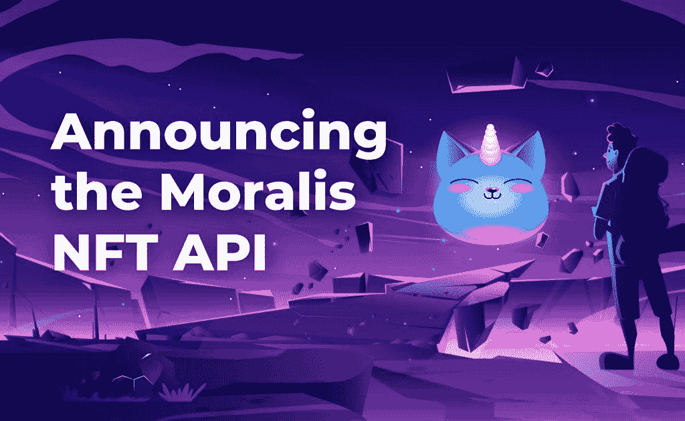
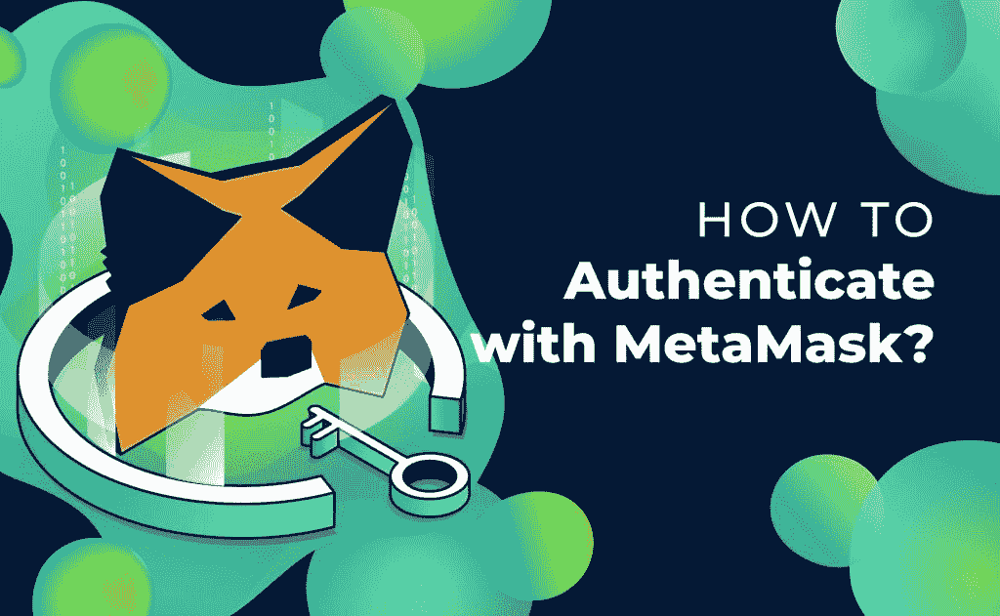
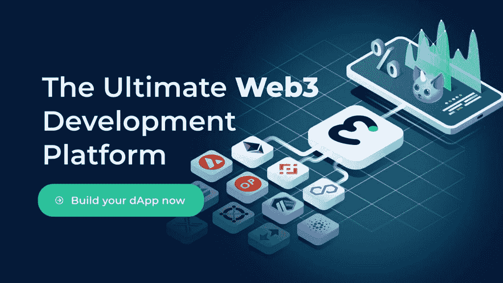

# 如何在 3 个步骤中获得 NFT 和 ERC-20 代币余额

> 原文：<https://moralis.io/how-to-get-nft-and-erc-20-token-balances-in-3-steps/>

对于许多 dApp 开发者来说，轻松检索 NFT 和 ERC-20 代币余额的能力至关重要。为什么？在 Web3 应用程序中，用户可以根据他们拥有的特定 NFT 和令牌余额来执行某些操作。因此，学习如何获得 NFT 和 ERC-20 代币余额绝对应该是你和其他开发者优先考虑的事情。幸运的是，下一代 [**Web3 开发平台**](https://moralis.io/)**Moralis 包含了所有你需要轻松管理 dApps 的最重要的后端工具。此外，使用 Moralis，检索 NFT 和 ERC-20 代币余额的解决方案只需三个简单的步骤。**

在我们进一步了解如何使用 Moralis 通过三个步骤获得 NFT 和 ERC-20 代币余额之前，我们需要确保您了解基础知识。因此，你需要问自己几个问题。首先，你知道 [什么是 dapp](https://moralis.io/decentralized-applications-explained-what-are-dapps/)吗？此外，你知道什么是 ERC 20 代币吗？NFTs 怎么样？如果是这样，请随意浏览这一介绍部分。但是，如果这些术语和概念对您来说是新的，请确保先做一些了解。了解这些基础知识将使使用 Moralis 成为一个毫不费力的过程。

此外，尽管 Moralis 家消除了了解的需要，但如果你精通[JavaScript](https://moralis.io/web3-and-javascript-what-is-javascript-and-web3-js/)(JS)，你会发现这要容易得多。如果你不知道这种相对简单且高度通用的编码语言，不要担心。你可以 [在伊凡科技学院](https://academy.ivanontech.com/courses/javascript-programming-for-blockchain-developers) 快速学习 JavaScript 或者雇佣一个有经验的 JavaScript 前端开发者。

### 如何获得 NFT 和 ERC-20 代币余额

如前所述，在我们深入了解如何最轻松地获得 NFT 和 ERC-20 代币余额的细节之前，让我们先了解一些基础知识。在下一节中，你会找到一些基本术语的简明扼要的解释。此外，各种术语将链接到涵盖相关主题的特定文章。如果你想获得更深的理解，一定要阅读那些文章。

## “如何获得 NFT 和 ERC-20 代币余额”——先决条件

尽管区块链科技已经声名远扬，但它仍然相对较新。因此，与这个颠覆性和革命性行业相关的术语还不太为人所知。因此，我们将概述一些你应该理解的基本概念，以充分利用 Moralis。随着你在 Web3 世界中继续前进，你会熟悉许多术语。你可以在下面找到列表。

*   **dApp**–dApp 或 Web3 apps 都是去中心化的应用。这意味着它们在区块链上起作用。虽然有许多类型的区块链可以主持 dApps，以太坊仍然是最受欢迎的一个。正是以太坊网络首次引入了智能合约。
*   [**智能合约**](https://moralis.io/smart-contracts-explained-what-are-smart-contracts/)–智能合约是具有特定预定条件的代码片段。当满足这些条件时，智能合约将执行。智能合同确保在互联网上安全、忠实地执行协议条款。
*   [**web 3**](https://moralis.io/the-ultimate-guide-to-web3-what-is-web3/)–web 3 是互联网的下一个大时代，它利用了区块链技术。除了包含 Web2 的所有特性，它还是去中心化的。最重要的是，它内置了使用加密货币的支付交易功能。
*   **ERC-20 代币**–ERC-20 是用于在 [以太坊](https://moralis.io/evm-explained-what-is-ethereum-virtual-machine/) 上创建和发行智能合约的标准。代币通常指特定区块链本地的加密货币。此外，令牌通常构建在令牌的相关区块链之上。
*   [**NFT**](https://moralis.io/non-fungible-tokens-explained-what-are-nfts/)–NFT，或不可替代的代币，是在区块链上创建的唯一资产。这涉及到不可替代性或唯一性的概念。例如，如果你有两个以太网令牌，它们是可以互换的。另一方面，每个 NFT 都是独一无二的，即使一个特定的 NFT 可能有多个副本。虽然 NFT 用例是以在区块链上“放置”图像的形式开始的，但是它们提供了极其广泛的用例。在未来，NFTs 可能被用于所有种类的所有权证明。从本质上讲，NFT 起到了连接实物资产和数字所有权的作用。
*   [**meta mask**](https://moralis.io/metamask-explained-what-is-metamask/)–meta mask 是最受欢迎的加密货币钱包之一。除了充当钱包，元掩码还充当访问 dApps 的网关，使 web 应用程序能够更容易地与区块链通信。

这些基础知识对于帮助你理解如何通过 Moralis 的三个步骤获得 NFT 和 ERC-20 代币余额非常重要。然而，如果你对扩展你的区块链和加密知识感兴趣，我们强烈推荐你去看看 Moralis 博客。Moralis 博客是完全免费的，每天都有深入的更新，从 [如何在六个步骤中创建 Arbitrum 令牌](https://moralis.io/how-to-create-an-arbitrum-token-in-6-steps/) 到 [如何使用 Moralis 使用元掩码](https://moralis.io/how-to-authenticate-with-metamask/) 验证用户！

## 为什么获得 NFT 和 ERC-20 平衡对 dApp 开发者很重要

Web3 的主要优势是去中心化。这样，就没有一个实体拥有服务器，从而完全控制内容和个人数据。此外，这还消除了单点故障的问题。虽然这些品质可能令人印象深刻，但如果用户不能与 dApps 互动，它们就没有多大价值。

这就是获得 NFT 和 ERC 20 代币余额的重要性。后者决定了用户是否能够执行某些操作。无论我们考虑赌注，交易，购买，铸造，借款，或任何其他“分散”的行动，了解用户的平衡是至关重要的。换句话说，用户的余额是决定具体行动是否可行的重要变量。

虽然大多数非功能性交易和所有 ERC-20 代币都在以太坊区块链上，但在其他区块链上获得代币和非功能性交易的平衡也同样重要。但是，由于以太坊是最受欢迎的连锁店，我们将重点放在后者。一定要检查完整的[Moralis NFT API](https://moralis.io/announcing-the-moralis-nft-api/) ，它已经被像[超级农场](https://medium.com/superfarm/superfarm-announces-moralis-nft-api-integration-7469775dc9ed)这样的高调项目使用！

## 【Moralis 如何让获得 NFT 和 ERC-20 代币余额变得非常容易

虽然 dApps 的后端编程相当棘手，而且非常耗时，但使用 Moralis 让事情变得简单多了。通过了解 JavaScript 和区块链的基础知识，比如如何使用元掩码，你就拥有了开始开发 dApps 所需的一切。

有了 Moralis，你所有的后端编码都可以通过复制和粘贴简单的代码行来完成。下面，我们将详细介绍如何使用 [Moralis 文档](https://docs.moralis.io/) 获得 NFT 和 ERC-20 代币余额。

为了在开始构建能够让您获得 NFT 和 ERC-20 天平的函数之前进行适当的设置，请务必观看下面的视频。我们强烈推荐你 [马上创建你的免费 Moralis 账户](https://admin.moralis.io/register) ，这样你就可以尽快将这个理论付诸实践了！

1.  ### Use meta mask to enable login

在继续介绍启用余额检索的功能之前，我们需要设置一些东西，以便用户可以通过身份验证。您可以在“加密钱包登录”类别的 Moralis 文档中找到必要的代码。然后简单地复制并粘贴如下所示的代码行。

***Moralis 家。Web3.authenticate()。然后(功能(用户){***

***【console . log(user . get(' ethAddress ')】***

***})***

然后，使用您的 JavaScript 知识围绕 Moralis 代码构建函数。上面的代码将使用户能够使用他们的元掩码登录。它基本上捕获了用户在 MetaMask 中使用的以太坊地址。

让用户登录是获取特定以太坊地址余额的第一步。一旦设置好登录选项，您就可以进入下两个步骤。这两个步骤将告诉你如何获得 NFT 和 ERC-20 代币余额。

1.  ### shows the balance of ERC-20 tokens

正如所承诺的，使用 Moralis 规范时事情很简单。正如上一步一样，我们将让 Moralis 文档为我们服务。这次我们将进入“代币余额”部分。谈到 ERC-20 代币余额，你有两个选择。您可以使用简单的单行代码:

***常数余额=等待 Moralis。web 3 . getallerc0()；*T3】**

如果您想要指定一个链(如果您想要从除以太坊之外的另一个链中获取余额)和一个特定的地址，代码稍微长一点:

***const options = { chain:' BSC '，address: "0x…" }***

***常数余额=等待 Moralis。Web3.getAllERC20(选项)；*T3】**

如你所见，Moralis 家的事情非常简单。使用上面的代码行完成所有繁重的工作。很神奇，对吧？让我们继续讨论 NFT 天平。

1.  ### shows NFT balance

猜猜看？至于 ERC-20 代币天平，Moralis 文档也为 NFT 天平提供了一个简单的解决方案。为此，您需要进入“NFT 天平”部分。在那里你会发现几个选项(如下所示)。

*//获取 Mainnet 上当前用户的 NFTs*

***const userEthNFTs = await Moralis。web 3 . get nfts()；*T3】**

*//为用户* 获取 testnet NFTs

***const testnetNFTs = await Moralis。web 3 . get nfts({ chain:' ropsten ' })；*T3】**

*//获取多边形 NFTs 的地址*

***常量选项= { chain: 'matic '，地址:' 0x…' }；*T3】**

***const polygon FTS = await Moralis。Web3.getNFTs(选项)；*T3】**

使用适合您项目的选项。除了从当前用户或地址获得所有的 NFT，您还可以获得 NFT 的总数。为此，您需要使用下面一行简单的代码:

***constr NFT count = await Moralis 家。web 3 . getnftscount()：***

我们刚刚介绍了如何使用 Moralis 获得 NFT 和 ERC-20 代币余额的基础知识。本质上，您需要的只是三行代码。我们不知道你怎么想，但是我们相信它是如此的简单。

如果您想了解以上代码实现的更详细的分步说明，请务必观看下面的视频。

[https://www.youtube.com/embed/AYUv9rOrxJk?feature=oembed](https://www.youtube.com/embed/AYUv9rOrxJk?feature=oembed)

## 如何通过 3 个步骤获得 NFT 和 ERC 的 20 个代币余额——总结&关键要点

至此，你已经知道如何通过三个简单的步骤获得 NFT 和 ERC-20 代币余额。这种简单性之所以成为可能，要感谢最令人惊叹的 Web3 开发平台 Moralis。它只需要几行简单的代码！

此外，你现在也知道如何获得 NFT 和 ERC-20 令牌对 dApps 的功能极其重要。正是这个特性使用户能够采取进一步的行动，并与分散的应用程序进行充分的交互。这意味着当您使用 Moralis 时，您可以毫不费力地获得 NFT 天平和 ERC-20 天平！

我们也提供一些基本的术语和解释来帮助那些不熟悉区块链世界的人。除此之外，我们还强烈建议查看我们的其他博客帖子。在那里你可以找到关于区块链发展的可靠和非常有用的信息。以此为资源，你可以学习自信地迈出下一步所需的所有基础知识。

### 开发 dApps 的后续步骤

因此，如果你想通过主要关注前端来开发出色的 dApps，有两条最合理的途径:

*   如果你已经知道 JavaScript，知道如何使用 MetaMask，那你基本上就万事俱备了。今天就创建你的免费帐户，让 Moralis 家为你做繁重的工作。然后使用 Moralis 文档和 [Moralis YouTube 频道](https://www.youtube.com/channel/UCgWS9Q3P5AxCWyQLT2kQhBw) 来完全熟悉这个令人惊叹的平台。

*   如果你还不知道 JavaScript，我们建议你集中精力学习它。感谢 Ivan on Tech Academy，你可以报名参加一个名为“区块链开发者 Javascript 编程”的特别课程。这样，你将学习这种高度实用的编码语言，同时，加快自己在尖端行业中使用它的速度。当然，还有许多其他令人惊叹的课程可以让你立刻成为区块链专家。这样的话，你可以尽快成为全职的加密员。如果你需要一些灵感，一定要去 [看看我们学生拥有的一些惊人的成功案例](https://academy.ivanontech.com/success-stories) 。

现在该是你采取行动的时候了，开始轻松打造令人惊叹的 dApps 吧！