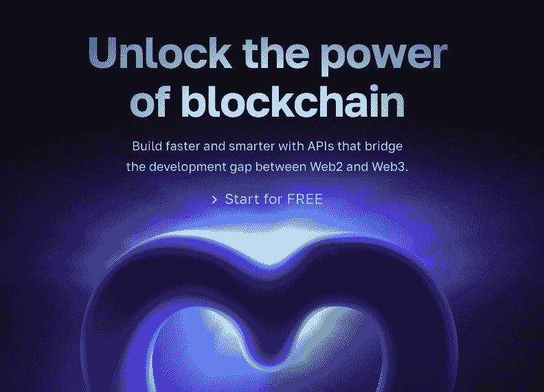
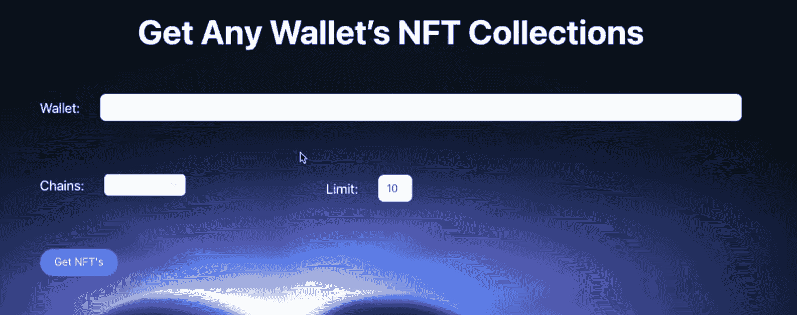
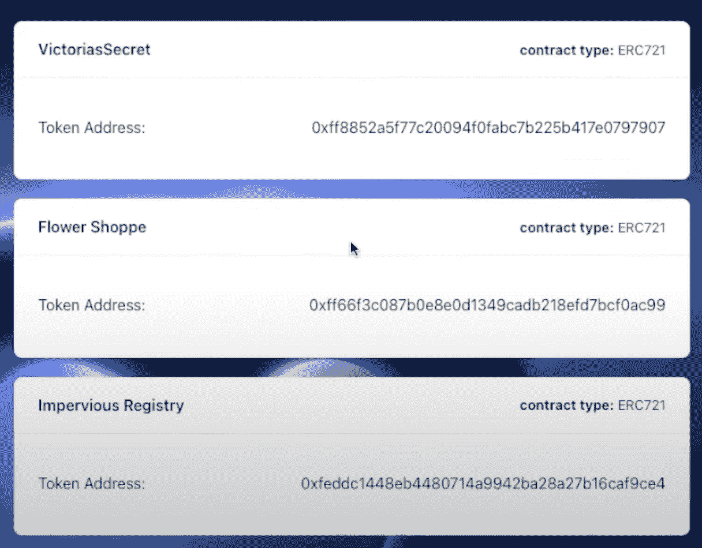
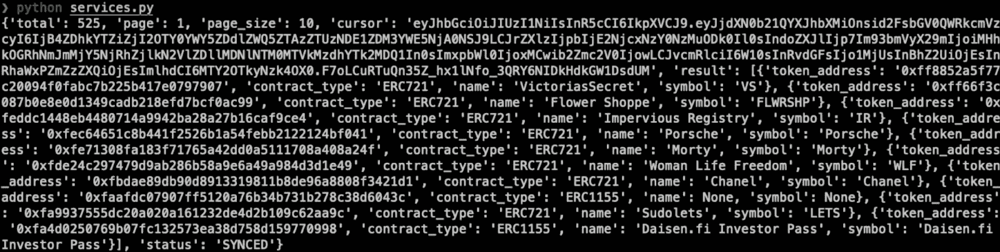

# 如何使用 Python 和 React 获取 NFT 集合

> 原文：<https://moralis.io/how-to-get-nft-collections-using-python-and-react/>

您是否正在寻找一种使用 Python 获取 NFT 作品集的便捷方式？如果是这样，你应该熟悉 Moralis 的 NFT API 和 Python SDK。使用这些工具，您可以通过两个简单的步骤轻松查询特定 Web3 钱包的所有 NFT 收藏:

1.  安装 Moralis 标准:

```js
pip install moralis
```

2.  进行 Moralis API 调用以获取 NFT 集合:

```js
from moralis import evm_api

api_key = ""
params = {
    "address": "",
    "chain": "eth",
    "limit": 0,
    "cursor": "",
}

result = evm_api.nft.get_wallet_nft_collections(
    api_key=api_key,
    params=params,
)

print(result)
```

当您运行代码时，它将自动返回由指定的钱包持有的 NFT 集合。如你所见，多亏了 Moralis，你只需要几行简短的代码就可以使用 Python 获得所有的 NFT 集合。另外，查看 Moralis 的官方[get collections by wallet NFT API 端点文档](https://docs.moralis.io/reference/getwalletnftcollections)以获得关于 API 如何工作的更多信息！

[**Sign Up with Moralis**](https://admin.moralis.io/register)

### 概观

获取链上数据是 Web3 开发的核心，因为分散式应用程序(dapps)依赖于这些信息。因此，区块链开发人员需要简单的方法来查询和访问存储在各种分散网络上的数据。例如，如果您对不可替代的令牌(NFT)开发感兴趣，可以参考 NFT 收藏。幸运的是，这是我们在本文中将关注的地方。因此，本教程将向您展示如何使用 Python 和 [Moralis](https://moralis.io) 获得 Web3 钱包的所有 NFT 集合！

多亏了 Python SDK 和 NFT API，你可以轻松获得指定钱包的所有 NFT 收藏。更重要的是，您只需几行代码就可以做到这一点。所以，如果你想了解更多这方面的知识，请跟随我们向你展示的方法！除了向您展示如何获取这些数据，本文还演示了如何设置一个简单的 Python 和 React 应用程序，用户可以在其中输入钱包地址来查询其 NFT 集合。

此外，NFT API 只是你应该探索的 Moralis 的各种 Web3 APIs 之一。其他突出的例子有 [EVM API](https://moralis.io/evm-api/) 、[索拉纳 API](https://moralis.io/solana-api/) 、[令牌 API](https://moralis.io/token-api/) 、[流 API](https://moralis.io/streams/) 等。这些都是有助于更无缝的开发者体验的工具，也是为什么 Moralis 展示了构建 Web3 应用的最快方式！

因此，无论你想从事什么样的区块链发展事业，请立即与 Moralis 签约。有了帐户，您就可以访问上述所有工具，并充分利用区块链的力量。更重要的是，你可以免费创建你的帐户，所以你没有什么损失！



## 如何使用 Python 从钱包中获取所有 NFT 收藏

以下部分将向您展示如何使用 Python 获取特定 Web3 钱包的 NFT 集合。为了尽可能地方便使用，我们将使用 Moralis 的集合 [NFT API](https://moralis.io/nft-api/) 端点和 Python SDK。通过这些工具，您只需几行简短的代码就可以获得特定钱包的收藏！


结合向您展示如何使用 Python 获取 NFT 集合，本教程还简要说明了如何设置一个完整的项目来实现此功能。为了方便起见，我们将使用一个已经开发的项目，并向您展示如何添加所需的配置以使其可操作。

该项目包含一个前端 React 应用程序和一个处理应用程序逻辑的 Django Python 后端服务器。使用 React 应用程序，用户可以输入钱包地址并选择一个链来查询钱包的 NFT 收藏。

为了尽可能简单明了，我们将本教程分为以下两个部分:

*   如何使用 Moralis 的集合 NFT API 端点获取所有 NFT 集合
*   如何设置完整的应用程序

然而，在开始学习本教程之前，下一节将展示一个应用程序演示，向您展示最终项目是如何工作的。通过介绍这一点，您将更好地理解您正在努力的方向，以及将来如何将这一功能实现到您自己的项目中！

### 应用程序演示–使用 Python 获取 NFT 集合

在开始学习本教程之前，本节提供了一个应用程序演示来说明您的目标，并为您提供最终产品的概述。然而，在下面，您会发现应用程序登录页面的截图:



该应用程序有三个输入字段:“钱包”、“链”和“限制”。这些元素相对来说是不言自明的；然而，让我们为了它而覆盖它们。在“钱包”字段中，您可以输入任何想要使用 Python 获取 NFT 收藏的钱包地址。“链”输入字段具有一个下拉菜单，其中有几个 EVM 兼容链可供选择。最后，在“Limit”字段中指定的数字限制了返回到前端的集合的数量。

一旦我们在所有输入字段中输入了信息，剩下的就是点击“Get NFTs”按钮，它将提供一个类似如下所示的响应:



如上图所示，应用程序返回指定 Web3 wallet 持有的最多十个 NFT 收藏。然而，这涵盖了整个应用程序！现在，让我们进入教程，并向您展示如何创建这个应用程序，从中您可以使用 Python 获得 NFT 集合！

### 如何使用 Moralis 的集合 NFT API 端点获取所有 NFT 集合

本教程的中心部分是向您展示如何使用 Python 来获得 NFT 集合，本节将向您展示如何使用 Moralis 的集合 NFT API 端点来实现。一旦您熟悉了端点，下一节将简要介绍如何设置上面显示的应用程序。现在，我们将关注如何使用 Python 来获得 NFT 集合！

也就是说，您需要处理两个先决条件:安装 Django 和 Rest 框架，这可以通过打开一个新的终端并运行以下两个命令来完成:

```js
pip install django
```

```js
pip install djangorestframwork django-cors-header
```

从那里，通过使用 Django 建立一个新项目来取得进展。有了一个项目，创建一个名为“services.py”的新文件。从这里，将以下代码从 Moralis collections NFT API 端点文档复制并粘贴到您刚刚创建的文件中:

```js
from moralis import evm_api

api_key = ""
params = {
    "address": "",
    "chain": "eth",
    "limit": 0,
    "cursor": "",
}

result = evm_api.nft.get_wallet_nft_collections(
    api_key=api_key,
    params=params,
)

print(result)
```

通过进一步检查上面的代码，您可以看到，您需要添加一些参数。首先，您必须添加您的 Moralis API 密钥。所以，如果你还需要的话，现在就去 Moralis 学院注册吧。从那里登录，导航到“Web3 APIs”选项卡，复制密钥，并将其粘贴到您的代码中:


除了添加 Moralis API 键之外，您还需要指定想要从中获取 NFT 集合的钱包地址、链和限制。对于本教程，我们将添加一个随机的钱包地址，将链设置为“ *eth* ”，将限制设置为“ *10* ”。我们现在可以让“*光标*为空。相应地，您的“services.py”现在应该看起来像这样:

```js
from moralis import evm_api

api_key = "JnJn0MW…"
params = {
    "address": "0xd06Ffc91…",
    "chain": "eth",
    "limit": 10,
    "cursor": "",
}

result = evm_api.nft.get_wallet_nft_collections(
    api_key=api_key,
    params=params,
)

print(result)
```

那就涵盖了代码！在接下来的小节中，我们将向您展示如何进行试验以及反应是什么样的！

#### 运行代码

为了运行代码，打开一个新的终端，使用以下终端输入安装 Moralis:

```js
pip install moralis
```

从那里，确保您将 *cd* 放入包含该文件的文件夹的正确位置。然后，在终端中运行以下命令:

```js
python services.py
```

一旦您运行此命令，它应该返回一个终端响应，其中最多包含指定 wallet 持有的十个 NFT 集合，它应该类似于以下内容:



就是这样！这就是使用 Python 和 Moralis 获得 NFT 集合是多么简单。不过从回应中可以看出，有点乱，不好解读。因此，我们将仔细查看之前在下面的“*应用程序演示-使用 Python 获得 NFT 收藏”部分中展示的完整应用程序！*

### 如何设置完整的应用程序

现在，您已经知道如何使用 Python 获得 NFT 集合，并且由于 Moralis 的集合 NFT API 端点的可访问性，让我们更仔细地看看您如何应用相同的基本原则来创建一个完整的应用程序。为了让事情尽可能简单，我们将使用一个开发的项目，其中包括 Python 后端服务器应用程序和 React 前端应用程序。您可以在下面的 GitHub 资源库中找到整个项目的代码:

**使用 Python 文档完成获取 NFT 收藏-**[**https://github . com/moralis web 3/YouTube-tutorials/tree/main/NFT-Collections-django-react**](https://github.com/MoralisWeb3/youtube-tutorials/tree/main/nft-collections-django-react)

**首先，打开上面的 GitHub 库，将整个项目克隆到您的本地目录。有了完整的代码，您现在需要安装 Django、Rest 框架、Moralis、“ *python-dotenv* ”和“ *axios* ”。为此，请打开一个新的终端，并按顺序运行以下命令:**

```js
pip install django
```

```js
pip install djangorestframework django-cors-headers
```

```js
pip install moralis
```

```js
pip install python-detenv
```

```js
npm install axios
```

**接下来，您需要安装所需的依赖项。因此，将 *cd* 放到项目的前端文件夹中，并运行下面的命令:**

```js
npm install
```

**从那里，创造一个新的”。env”文件，并添加您的 Moralis API 密钥。**

**现在就是这样！如果您已经完成了这一步，那么现在您已经在本地目录中拥有了整个项目，并且已经完成了所有必需的配置。因此，剩下的就是运行 Django Python 服务器和 React 前端应用程序了！**

#### **运行应用程序**

**要运行这个应用程序，首先需要使用以下终端命令在后端启动 Python 服务器:**

```js
python manage.py runserver
```

**从那里，您可以" *cd* "到项目的前端文件夹，并通过输入以下内容并按 enter 键来运行 React 应用程序:**

```js
npm start 
```

**运行这个命令应该会启动应用程序，允许您测试它的功能。因此，您现在应该能够输入一个地址，选择一个链，设置一个限制，并获得该特定钱包的 NFT 收藏。**

**这就是关于如何使用 Python 和 React 获得 NFT 集合的教程！如果您对端点有任何疑问，请查看 Moralis 的官方 [NFT API 集合端点文档](https://docs.moralis.io/reference/getwalletnftcollections)页面。**

**更重要的是，如果你正在寻找整个项目的完整分解，请查看来自 [Moralis 的 YouTube](https://www.youtube.com/@MoralisWeb3) 频道的以下剪辑。在下面的视频中，Moralis 的一位才华横溢的工程师将带您浏览整个代码。此外，工程师还向您详细展示了如何设置后端和前端:**

 **[https://www.youtube.com/embed/Zq-eoO-mTbc?feature=oembed](https://www.youtube.com/embed/Zq-eoO-mTbc?feature=oembed)

*你对 [Python 和 Web3](https://moralis.io/python-and-web3-a-web3-and-python-tutorial-for-blockchain-development/) 有进一步的兴趣吗？如果是这样，请查看我们的以太坊 Python 开发指南，并学习如何构建一个 [Web3 以太坊 Python](https://moralis.io/python-for-ethereum-development-build-a-web3-ethereum-python-app/) 应用。此外，请阅读 Moralis 的完整 [Web3 Python SDK 文档](https://docs.moralis.io/docs/your-first-dapp-python)！*

## 摘要–使用 Python 获取 NFT 集合

在本文中，您了解了如何使用 Python 获取 NFT 集合。多亏了 Moralis，您只需几行代码就可以实现这一功能。结合如何获取 NFT 集合的教学，本文还展示了如何设置一个简单的 Python 和 React 应用程序。在这款应用中，用户可以输入一个钱包地址，然后收到它的 NFT 收藏。如果您已经遵循了这一步，那么您现在可以在未来的任何 Web3 开发工作中使用相同的基本原则来实现类似的功能！

也就是说，如果你觉得这篇文章有帮助，可以考虑看看 Web3 博客上的其他内容。如果你对 Python 开发特别感兴趣，我们强烈推荐关于如何[设置自动化 Web3 通知电子邮件](https://moralis.io/how-to-set-up-automated-web3-notification-emails-with-python/)的指南。或者，如果你想让 [Python Web3 开发变得简单](https://moralis.io/web3-python-python-web3-development-made-easy/)，请查看链接文章。此外，还有其他有趣的文章，你可能会觉得激动人心。例如，了解更多关于[区块链基础设施公司](https://moralis.io/blockchain-infrastructure-companies-how-to-choose-the-right-provider/)或探索 [ethers.js vs Web3 streams](https://moralis.io/ethers-js-vs-web3-streams-the-best-option-for-blockchain-developers/) ！

此外，如果你想成为一名更熟练的 Web3 开发者，可以考虑报名参加 Moralis 学院。该学院为新手和有经验的开发人员提供了一些最好的区块链开发课程。无论你目前的技能水平如何，你都很可能会发现课程对你有吸引力。例如，如果你是区块链开发的新手，可以去看看[以太坊基础](https://academy.moralis.io/courses/ethereum-101)的课程。


尽管如此，如果您想使用 Python 获得所有 NFT 集合或者开发其他 dapps，这并不重要；[现在就向 Moralis](https://admin.moralis.io/register) 报名吧！你可以免费创建一个账户，只需要几秒钟。有了帐户，你就可以立即使用各种 Moralis 工具。这使您能够充分利用区块链技术的力量！**