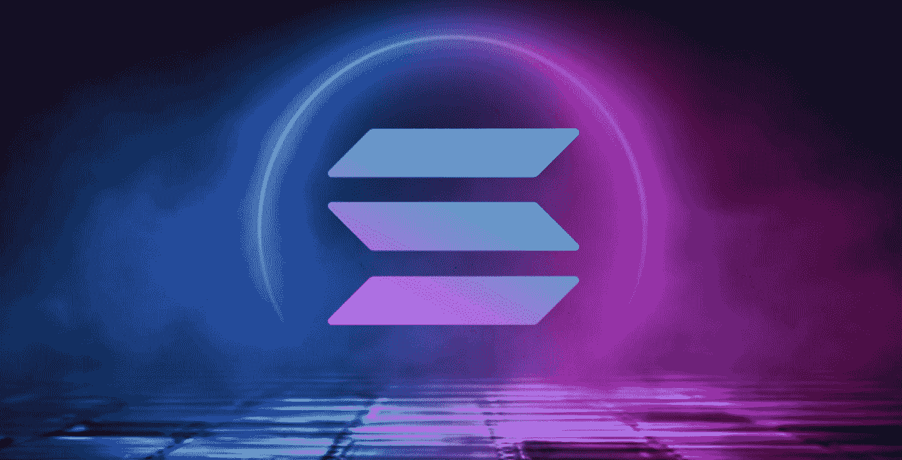
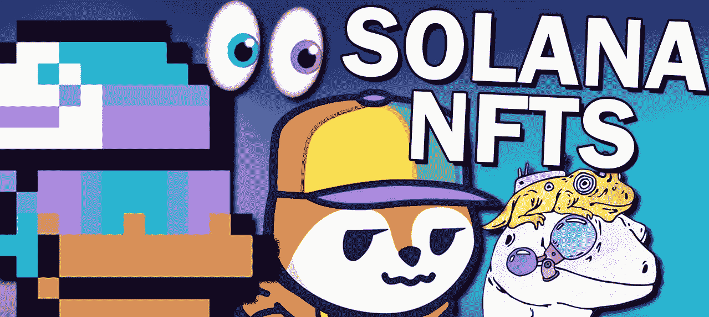
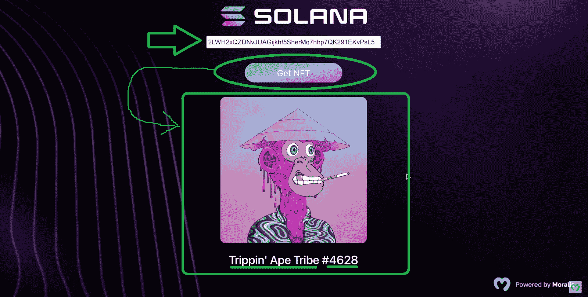
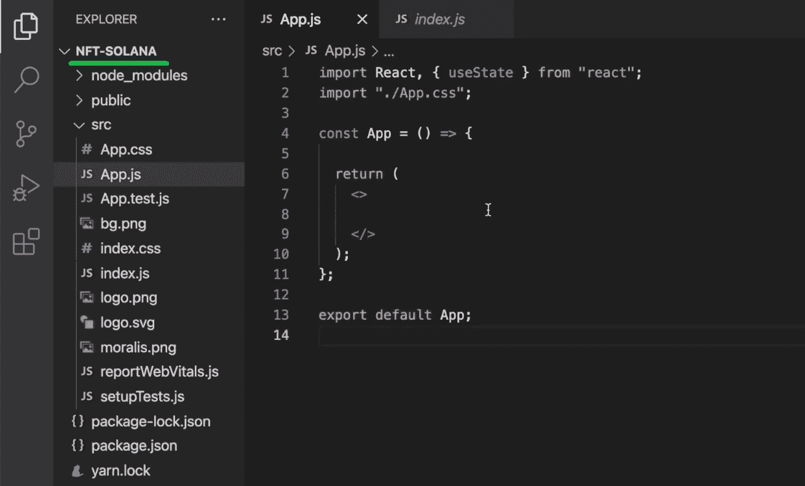
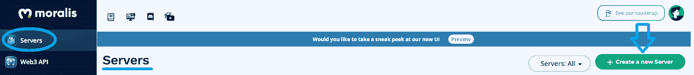
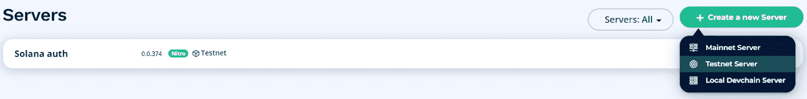
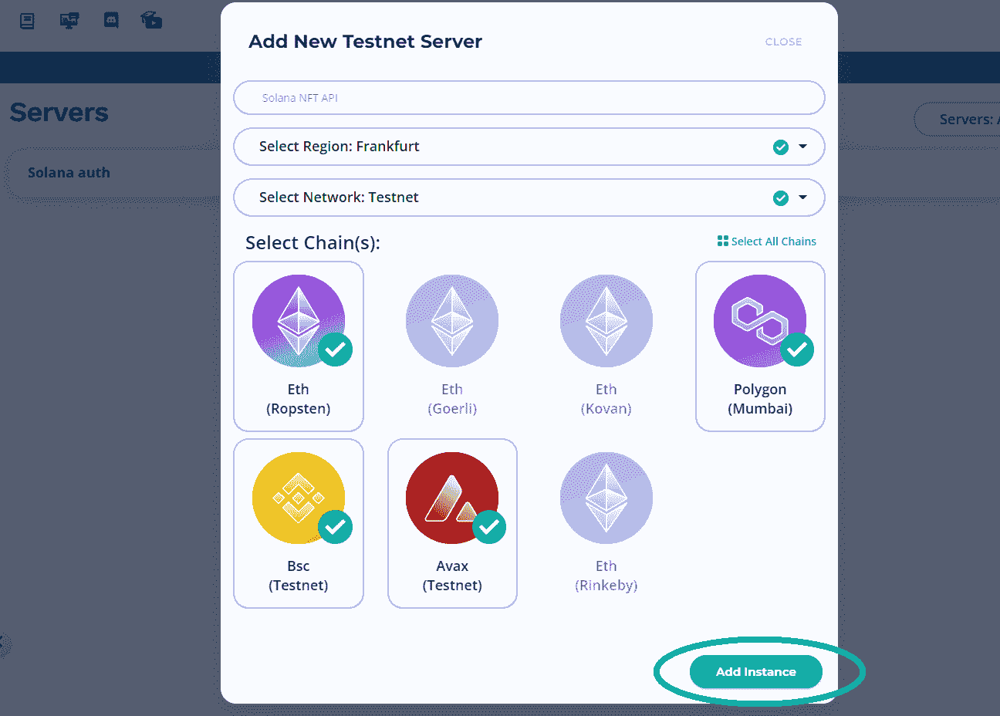
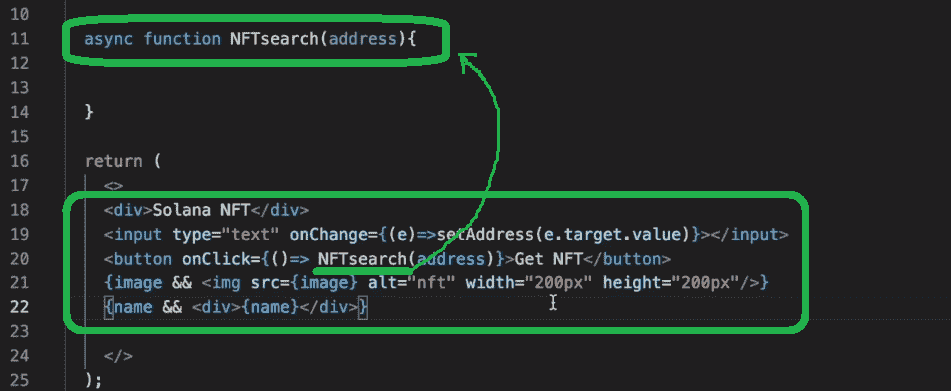
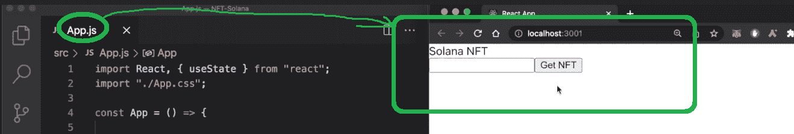
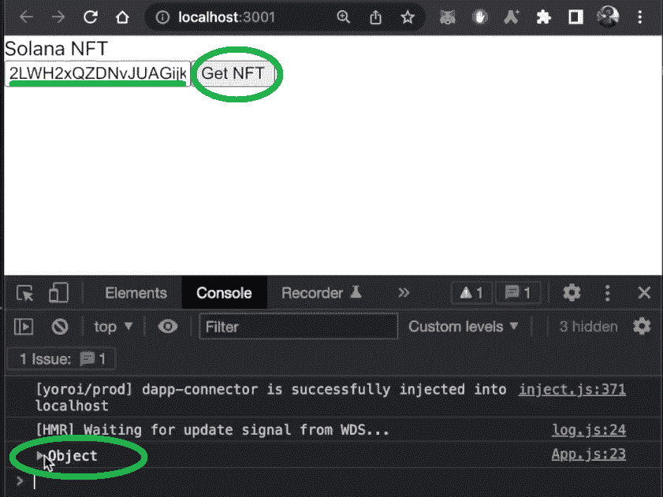

# 如何获得索拉纳 NFT 元数据

> 原文：<https://moralis.io/how-to-get-solana-nft-metadata/>

毫无疑问，索拉纳是最活跃的网络社区之一。因此，Solana 社区对功能强大的 Web3 开发工具的需求越来越大。例如，想要在索拉纳 NFT 市场上发布 NFT 作品或关注 NFT 发展的创作者需要获得索拉纳 NFT 元数据。虽然在没有合适工具的情况下，获得 Solana 的 NFT 元数据可能具有挑战性，但只需点击几次鼠标，就可以获得正确的 [**Web3 技术堆栈**](https://moralis.io/exploring-the-web3-tech-stack-full-guide/) **。此外，有了 Moralis 强大的** [**索拉纳 NFT API**](https://moralis.io/solana-nft-api-exploring-the-ultimate-nft-api-for-solana/) **，你马上就能获得索拉纳 NFT 元数据！**

Moralis(又名“ [Firebase for crypto](https://moralis.io/firebase-for-crypto-the-best-blockchain-firebase-alternative/) ”)提供了一个强大的 Solana API，可以毫不费力地满足你所有与区块链相关的后端需求。在本文中，我们将集中使用我们的 [JavaScript](https://moralis.io/javascript-explained-what-is-javascript/) ( [React](https://moralis.io/react-explained-what-is-react/) )技能来创建一个简单的 dapp(去中心化应用程序)。在这个过程中，您将学习如何完成初始的 Moralis 设置，以及如何导入 Solana API。有了这个设置，用一行代码就可以简单地获得索拉纳·NFT 元数据。然而，在我们专注于构建之前，我们需要确保你们都知道基础知识。因此，我们将首先回答“什么是索拉纳 NFT 元数据？”问题。然后，我们将添加我们的例子索拉纳 NFT dapp 的演示上下文。尽管如此，请确保[创建您的免费 Moralis 账户](https://admin.moralis.io/register)以便能够跟进。



## 什么是索拉纳 NFT 元数据？

除非你一直生活在岩石下，否则你知道 NFT 是最流行的区块链用例之一。当然，在许多情况下，NFT 不过是保存在区块链上的毫无意义的图像。然而，也有很多著名的 NFT 项目，包括索拉纳链。这些项目中的大多数都提供了某种平台，NFT 所有者可以利用他们独特的令牌。此外，这也是 NFT 元数据发挥重要作用的地方。毕竟，NFTs 和元数据是相辅相成的。尽管如此，没有元数据(提供其他数据信息的数据)就不能创建 NFT。

此外，元数据通常以“.JSON”文件，它包含了关于 NFTs 的所有细节。这也包括图像的 URIs，这些图像是非功能性测试最常见的视觉表现。也就是说，索拉纳 NFT 元数据指的是在索拉纳链上创建的 NFT 的元数据。



### 存储和访问 NFT 元数据

您必须注意，为了创建 NFT，您需要拥有它们的详细信息(元数据)和文件(图像、视频、gif、pdf 等)。)存放在某处。但这正是许多项目通过使用集中存储解决方案来“作弊”的地方。可悲的是，这损害了权力下放的整体目标。

因此，关注以分散方式存储 NFTs 文件和元数据的项目是很重要的。说到 Moralis，我们用 IPFS。因此，你的文件和元数据可以毫不费力地上传到 IPFS。你甚至可以[上传文件夹到 IPFS](https://moralis.io/how-to-upload-folders-to-ipfs/) ，这在[批量铸造 NFT](https://moralis.io/how-to-bulk-mint-nfts-batch-minting-guide/)时会非常有用。这样，您的项目就可以达到适当的分散化水平。

另一方面，一个合适的索拉纳 NFT API 也能让你访问和利用现有的索拉纳 NFT。这就是这篇文章的内容。为此，我们需要获取索拉纳·NFT 的元数据。一旦你知道如何去做，你就可以围绕索拉纳 NFTs 创建各种 dapps。例如，你可以整洁地展示索拉纳 NFT，创建一个先进的索拉纳 NFT 搜索引擎，甚至[推出一个 NFT 市场](https://moralis.io/how-to-launch-an-nft-marketplace/)。最后，下面几节将向您展示如何开始索拉纳 NFT 编程。同样值得记住的是，Moralis 家 [NFT API](https://moralis.io/nft-api/) 是跨链兼容的，所以它也是最好的以太坊 NFT API、币安 NFT API 等等！

## 获取索拉纳 NFT 元数据-我们的索拉纳 NFT Dapp 演示

如前所述，让我们看看我们的例子索拉纳 NFT dapp 的演示，你将学习创建前进。正如你在下面的截图中看到的，我们保持事情简单:



上图显示了我们的示例 dapp 的要点。在顶部，就在 Solana 标志的下面，有一个输入框。用户可以在这里输入任何索拉纳·NFT 的地址。要用输入的令牌地址做一些事情，用户需要点击“获取 NFT”。通过这样做，我们的代码行获得索拉纳 NFT 元数据。因此，我们的 dapp 访问与搜索到的地址相关的详细信息。

因为我们决定保持简单，我们的索拉纳 dapp 只显示基本的。其中包括相关 NFT 的图像、集合的名称和令牌 ID。然而，我们还可以处理许多其他数据。当然，用户可以重复搜索其他 Solana NFTs。以下是我们 dapp 的另外两个实例:

*   “Okay Bear”NFT 之一的搜索结果:


*   其中一个“索拉纳猴子业务(SMB)”NFT 的搜索结果:


## 如何用 React 和 Moralis 获取索拉纳 NFT 元数据

现在是卷起袖子跟随我们的时候了。您有两个选择:您可以从头开始构建自己的索拉纳 NFT dapp 实例，或者使用我们的代码。我们的代码很容易在这个 [GitHub](https://github.com/MoralisWeb3/youtube-tutorials/tree/main/Solana-NFT) 库中找到。该文件夹包括您在上面的演示中看到的所有资产(徽标、背景等。).但是，正如您可以想象的，如果您按照我们的指导自己实现代码，您将从本教程中获得最大的收益。

首先，让我们看看“NFT-索拉纳”项目的结构:



正如你在上面的截图中看到的，我们从一个基本的 React 应用程序模板开始。此时，我们的应用程序与 Web3 还没有任何关系。为了实现这种转变，您必须将您的代码与包括 Solana API 在内的 [Moralis SDK](https://moralis.io/exploring-moralis-sdk-the-ultimate-web3-sdk/) 连接起来。因此，您需要完成一些初始的 Moralis 设置步骤，以便能够[创建一个 Moralis dapp](https://docs.moralis.io/moralis-dapp/getting-started/create-a-moralis-dapp#2.-create-a-moralis-server) 。然后，您将能够获得该服务器的详细信息，并将它们粘贴到“index.js”文件中:


### Moralis 入门

要获得索拉纳·NFT 元数据，您需要完成初始的 Moralis 设置。幸运的是，开始使用 Moralis 非常简单。它包括以下六个步骤:

1.  使用本文开头提到的“创建你的免费 Moralis 账户”链接。但是，如果您已经有一个活动帐户，请确保[登录](https://admin.moralis.io/login):


2.  进入 Moralis 管理区域后，点击“创建新服务器”按钮(位于“服务器”选项卡内):



3.  选择适当的服务器类型:



4.  输入您的服务器名称，并选择离您最近的城市。此外，选择您感兴趣的链。当使用 Solana API 获取元数据时，可以使用任何链*。*最后，点击“添加实例”运行您的服务器:



5.  单击“查看详细信息”访问您的服务器 URL 和应用程序 ID，并复制它们:


6.  将上面复制的详细信息粘贴到“index.js”文件的指定区域。*见上一节最后一张图片。*

### 从一个简单的 React 应用开始

有了 Moralis 设置，您就可以开始构建您的索拉纳 NFT dapp，它将获得索拉纳 NFT 元数据。您应该从一个简单的 React 应用程序开始。因此，打开“App.js”并在“const App”中定义一些状态变量:


上面的截图向您展示了这些变量将用于存储我们的 dapp 的关键参数。这些包括输入的地址和 NFT 的名字和图像。有了这些变量，您就可以专注于添加将形成用户界面(UI)的代码行了。您可以从标题开始，然后是地址输入字段。此外，确保添加将触发 NFT 搜索的按钮:



接下来，我们建议您运行 dapp 来检查一切是否运行顺利:



上面的截图显示了你在这个阶段应该看到的内容。因此，你应该有一个“裸体”版的索拉纳·NFT·戴普。后者包括标题(“索拉纳·NFT”)、输入字段和“获取 NFT”按钮。我们还不想让你担心造型问题。到目前为止，我们还没有实现任何 Web3 功能；因此，我们的 dapp 还没有发挥作用。为了让它工作，我们需要导入 Moralis 提供的 Solana API。

## 使用索拉纳 NFT API 获取令牌的元数据

在“App.js”文件(位于顶部)中，添加:

```js
import { useMoralisSolanaApi } from "react-moralis";
```

上面的代码行将导入 Solana API。但是，您还需要安装“react-moralis”来使其工作。您可以使用“ *npm i react-moralis* ”或“ *yarn add react-moralis* ”命令来完成此操作。然后，您可以调用上面导入的“useMoralisSolanaApi”钩子:

```js
 const SolanaApi = useMoralisSolanaApi();
```

然后，重点编写“NFTsearch”函数:


*注:* *对于“mainnet”，如上所述，我们主要关注位于 Solana mainnet 上的 NFT。然而，如果你想关注 Solana testnet，你可以输入“devnet”。*

定义网络后，您需要确保“NFT 搜索”获得与搜索到的地址相匹配的 NFT。感谢 Moralis Solana API，您可以使用“getNFTMetadata”的强大功能。因此，一行代码就能完成任务:

```js
const nftResult = await SolanaApi.nft.getNFTMetadata(options);
```

是的,“getNFTMetadata”是使您能够获得索拉纳·NFT 元数据的关键。此外，确保通过添加“c *onsole.log(nftResults)* 来记录结果。后者将让您使用浏览器的控制台(“inspect”选项)来查看结果。

通过添加上面的代码行，您的 dapp 应该已经在后端执行繁重的工作了。您可以通过运行它并输入索拉纳·NFT 的令牌 ID 来进行检查。*此外，您可以使用 OpenSea 来获取令牌 id:*


只需复制令牌 ID 并将其粘贴到 dapp 的输入字段中。此外，请确保打开浏览器的控制台:



上面的截图显示，当点击“获取 NFT”按钮时，你的 dapp 已经获取了一个对象。此外，该对象包含与搜索到的令牌 ID 相关的所有详细信息:


搜索到的 NFT 图像的路径(以及其他详细信息)在元数据中:


### 获取索拉纳 NFT 元数据-图像 URI 和收藏名称

你可以在上面的截图中看到，你现在有一种方法来获得索拉纳 NFT 元数据和其他细节。因此，你有你需要的一切来填充你的索拉纳 NFT dapp。这样，您就可以实现显示任何索拉纳 NFT 的图像、集合名称和令牌 id 的能力了:

对于集合名称和令牌 id,“set name”可以解决这个问题:

```js
setName(nftResult.name);
```

另一方面，显示图像有点棘手。毕竟，它们的 URL 被打包在 NFTs 的元数据中。因此，您需要使用正确提取这些细节的代码:

```js
    let uri = nftResult.metaplex.metadataUri;

    try {
      await fetch(uri)
        .then((response) => response.json())
        .then((data) => {
          setImage(data.image);
        });
    } catch {
      console.log("couldnt get image");
    }
```

您现在可以再次运行 dapp 了。如果您正确遵循了我们的指导，它应该像演示中演示的那样工作:


如果您了解 CSS 的基础知识，您将很容易添加将上述内容转换为以下内容所需的样式:


*注意* *:我们的代码(上面的“GitHub”链接)包含了所有的样式代码/文件。*

*此外，这里还有一个内部 Moralis 专家完成上述项目的视频教程:*

https://www.youtube.com/watch?v=Ln0GEUsvcFM

## 如何获取索拉纳 NFT 元数据-摘要

在本文中，您有机会学习如何用一行代码获得索拉纳·NFT 元数据。您现在知道“getNFTMetadata”方法可以实现这个目的。另外，你知道为了使用这个钩子，你需要正确地设置 Moralis。随着 Moralis 服务器的启动和运行，您可以安装“moralis-react”并导入 Solana API。此外，我们鼓励您通过实现其他功能来进一步利用上述示例。此外，如果你对 Solana 编程很认真，你应该学习如何使用 Phantom wallet 对 Solana 用户进行身份验证。最重要的是，你可能还想[创建一个索拉纳令牌](https://moralis.io/how-to-create-a-solana-token-in-5-steps/)和建立一个[索拉纳令牌仪表板](https://moralis.io/how-to-build-a-solana-token-dashboard/)。然而，如果你还不熟悉 Solana 令牌标准，请务必查看一下 [SPL 与 ERC20 令牌](https://moralis.io/spl-vs-erc20-tokens-comparing-solana-and-ethereum-tokens/)的对比。

另一方面，您可能想要探索其他区块链开发主题并处理其他示例项目。如果是这样的话，Moralis 网 3 博客正是你要找的地方。一些最新的话题展示了[上传 Web3 Unity 元数据](https://moralis.io/uploading-web3-unity-metadata/)，如何创建 NFT [的链上库存系统](https://moralis.io/create-an-nft-on-chain-inventory-system-for-gaming/)，构建[去中心化 Twitter](https://moralis.io/2022-guide-to-building-a-decentralized-twitter/) ，你需要知道的关于 [Web3 前端](https://moralis.io/web3-frontend-everything-you-need-to-learn-about-building-dapp-frontends/)和 [dapp 开发](https://moralis.io/dapp-development-tutorial-full-guide-to-building-a-dapp/)的一切。最终，Moralis 拥有成为 Web3 开发者所需的一切。如果你正在寻找成为区块链开发者的职业道路，Moralis 学院是最好的选择！