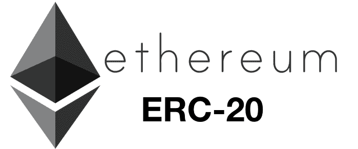
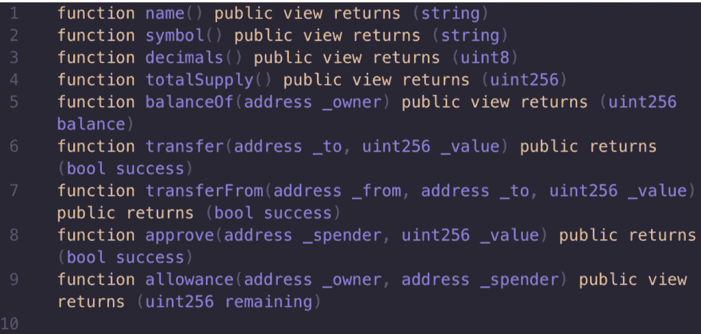
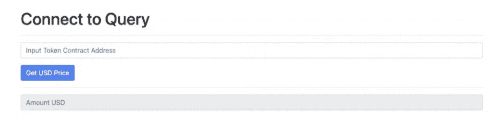
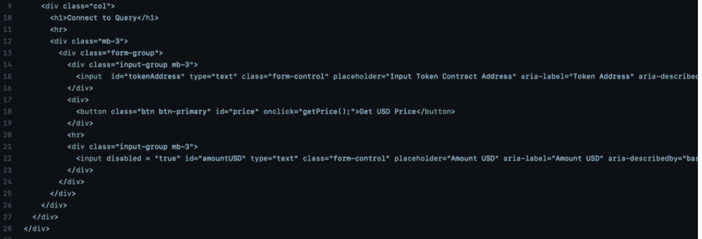
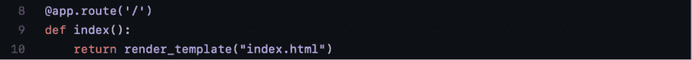
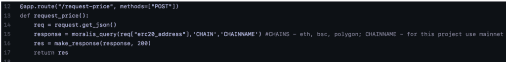
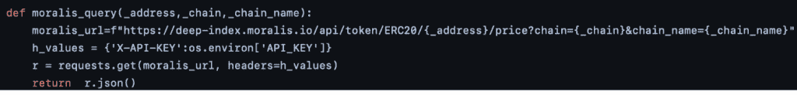
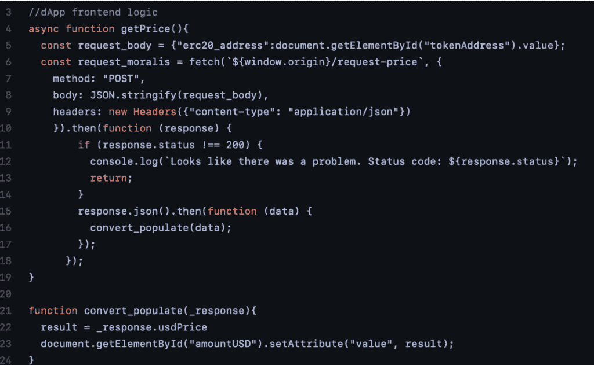

# 如何通过 3 个步骤获得任何以太币的价格

> 原文：<https://moralis.io/how-to-get-the-price-of-any-ethereum-token-in-3-steps/>

**以太坊在** [**dApp**](https://moralis.io/decentralized-applications-explained-what-are-dapps/) **(去中心化应用)和 token 开发方面无疑是最大的区块链。事实上，该连锁店是一个庞大的 dApps 生态系统的所在地，每天都有新的代币产生。** **随着数量惊人的新代币不断被构建，跟踪不同代币的价格可能是一项繁琐的任务，尤其是当您需要实现诸如将任何以太坊代币的价格写入您的代码** **之类的功能时。** **因此，开发人员自然会选择利用 Moralis 及其方便的平台，在这里您可以轻松实现这一功能。这就是我们现在要关注的，并展示如何通过三个简单的步骤获得任何以太币的价格。**

[web 3 开发](https://moralis.io/how-to-build-decentralized-apps-dapps-quickly-and-easily/) 从传统的角度来看，space 一直缺乏基本的开发工具和平台。然而，有了 Moralis 及其强大的平台，情况就不再是这样了。该平台为其用户提供了巨大的竞争优势，使得显著缩短所有区块链项目的上市时间成为可能。因此，该平台允许用户快速高效地开发 dApps 和令牌，使公司和开发者能够降低成本。

Moralis 提供了一系列优秀的开发工具，如[Moralis Speedy Nodes](https://moralis.io/speedy-nodes/)、[Moralis NFT API](https://moralis.io/announcing-the-moralis-nft-api/)、实时警报等。再者，Moralis 还提供了[Moralis web 3 API](https://docs.moralis.io/moralis-web3-rest/deep-index-api)。在本文中，我们将使用 Moralis Web3 API 工具，向您展示如何获取以太币的价格。Moralis Web3 API 以前被称为 Moralis 深度索引 API。我们仍然使用 Moralis 深度索引 API URL 来初始化 Moralis Web3 API，如本文后面的示例所示。

因此，如果你想成为一名 dApp 或令牌开发者，我们建议你现在就注册 Moralis。平台的可能性是无限的，在整个开发过程中可以节省大量的时间和资源。

### 什么是以太坊 ERC 20 代币？

在深入了解如何获得以太坊代币的价格之前，我们先绕一小段路，以便更好地理解什么是以太坊 ERC-20 代币。代币是以太坊生态系统的一个强大而重要的特性，它们被广泛使用。此外，随着创建令牌变得越来越容易，每天都在创建新的令牌。

ERC 20 代币能够虚拟地代表各种事物。因此，它们的用例范围从表示法定货币到游戏中的技能点。这意味着这些令牌的机会是无限的，并且在许多不同的场景中也是可行的。

由于它们是以太坊生态系统如此显著的特征，拥有一个监管标准是非常有益的。这正是 ERC-20 令牌标准发挥作用的地方。该标准确保所有令牌具有相同的特征和属性。因此，遵循标准的标记具有相同的值和类型，这使得它们可以互换。这使得这些代币不同于 [NFTs](https://moralis.io/non-fungible-tokens-explained-what-are-nfts/) (不可替换代币)，是可替换的。这反过来意味着我们可以很容易地测量一个代币对另一个代币的价值。

此外，ERC-20 标准与以太坊区块链密切相关。但是，该标准也适用于其他链条。所有使用[【EVM】](https://moralis.io/evm-explained-what-is-ethereum-virtual-machine/)(以太坊虚拟机)的链都兼容使用该标准的令牌。

该标准还为带有智能合约的令牌实现了一个 API。这意味着该标准实现了一些功能，例如设置总供应量、将令牌从一个帐户转移到另一个帐户，以及获取特定帐户的令牌余额。此外，所有 ERC-20 令牌必须实现以下事件和方法:

# 如何获得任何以太坊代币价格

获得以太币价格的过程并不一定很难。事实上，有了 Moralis，这变得相当容易。Moralis 平台提供了所有必要的工具，并为用户提供了开箱即用的命令。为了展示 Moralis 的威力，我们将在本文中制作一个简单的应用程序，用户可以在其中查询以太币的价格。

我们将要创建的应用程序将有三个不同的元素:一个输入字段、一个按钮和另一个显示 ttt 结果的字段。要获取代币的美元价格，用户需要提供代币地址，然后按“获取美元价格”按钮。因此，这是应用程序完成后的样子:

这个简单的应用程序由三个主要文件组成，我们将在本指南中详细介绍这三个文件。除了这些文件，还有一些其他文件，比如启动整个应用程序的“run.py”文件。然而，关于这些文件没有太多要分析的，这就是为什么它们没有包含在本教程中。如果你想仔细看看，你可以在 [GitHub 库](https://github.com/DanielMoralisSamples/AnyTokenPrice) 中找到完整的应用。

由于应用程序由三个文件组成，我们将如何获得任何以太币令牌价格的过程分解为三个简单的步骤:

1.  创建一个 HTML 索引文件。
2.  建立一个视图文件。
3.  写前端逻辑。

所有这些步骤都非常简单，但是为了使这个过程更加方便，我们将从创建 HTML 索引文件开始，逐一介绍每个步骤。然而，如果你更喜欢看解释这一过程的视频教程，那么从 [Moralis YouTube 频道](https://www.youtube.com/channel/UCgWS9Q3P5AxCWyQLT2kQhBw) : 看看这个吧

[https://www.youtube.com/embed/ilMsx24c8k4?start=213&feature=oembed](https://www.youtube.com/embed/ilMsx24c8k4?start=213&feature=oembed)

## 步骤 1:如何获得任何以太币的价格——创建一个 HTML 索引文件

制作一个 HTML 索引文件是创建我们自己的 dApp 来查询任何以太币的美元价格的第一步。该文件包含所有的 HTML 代码，这些代码实现了我们的 UI(用户界面)的字段和按钮。因此，这是部分代码的样子:

你可能已经注意到了，上面的图像并不完整。这样做的原因是图片放不下整个代码。但是，仔细看看，你可以在 [GitHub 资源库](https://github.com/DanielMoralisSamples/AnyTokenPrice/blob/master/app/templates/index.html) 中找到剩下的代码。

此外，从分析代码中，我们可以看到它包含三个元素。首先，我们有一个用户可以输入令牌地址的字段。其次，我们有“获取美元价格”按钮。该按钮包含一个“onclick”事件，触发[JavaScript](https://moralis.io/javascript-explained-what-is-javascript/)中的“getPrice()”函数。因此，当用户单击此按钮时，他们将收到令牌的美元价格。他们会在第三个元素中呈现价格，这也是一个字段。但是，您可以默认禁用该字段，因为用户从不与该元素交互。

建立了所有字段和按钮后，我们可以继续前进，仔细查看目录中的下一个文件，这将是“views.py”文件。

## 步骤 2:如何获得任何以太币的价格——建立一个视图文件

我们已经完成了第一步，我们可以继续创建应用程序的一些逻辑。该文件包含加载我们的 dApp 模板的代码。这意味着这段代码负责加载我们在上一步中创建的 HTML 文件。这是它的样子:

此外，我们还决定在这个文件中包含一些逻辑。一个例子是，我们用一个路由和一个函数为 Moralis API 创建了包装器。我们首先创建路由，这就是我们所说的前端的“请求-价格”请求。然后，我们创建一个名为“moralis_query()”的函数，它有三个参数:地址、链和名称。这个函数也是包装对 Moralis API 调用的逻辑的一部分。所以，我们先从路线开始分析这两个要素。

从上面你可以看到完整的路由，我们在代码中做的第一件事是确定路由将接受哪种类型的请求以及针对哪个端点。这是通过下面一行代码“methods=["POST"]”完成的，它只支持 POST 请求。这意味着，如果我们发送 GET 请求，端点不会接受调用，应用程序也不会像预期的那样工作。

下面一行代码创建了一个新变量，解析传入的数据并将其返回，然后调用“moralis_query()”函数。该函数将返回一个 [JSON](https://moralis.io/json-explained-what-is-json-javascript-object-notation/) 变量，该变量将用于下一行，最终返回“res”变量。

### “Moralis _ 查询()”函数

接下来，我们有“moralis_query()”函数，它创建了两个不同的变量:一个我们想要查询的 URL 和一个标题字段。URL 变量由四个不同的元素组成:用于 API 的更广泛的 URL，后面是地址、链和链名，使得 URL 更特定于令牌类型。头字段的变量是来自 Moralis 的授权密钥的值。下一行代码以变量作为参数执行 GET 请求。最后，该函数返回 JSON 格式的变量“r”。

## 第三步:如何获得任何以太币的价格——编写前端逻辑

一旦我们建立了 HTML 文件和包装 Moralis API 的逻辑，我们就可以继续创建应用程序的前端逻辑。前端相当简单，由两个基本函数组成:“getPrice()”和“convert_populate(_response)”。整体而言，前端看起来像这样:

让我们从“getPrice()”开始，分解这两个函数，以便更好地理解它们是如何工作的。

在这段代码中，我们做的第一件事是用用户提供的地址创建一个新对象。一旦我们有了 address 对象，我们就可以使用之前创建的路由调用我们自己的服务器。我们发出一个“request-price”请求，其中定义了方法、主体和头。如果请求返回 200 响应代码，代码将执行“convert_populate”函数，这是代码的第二部分。如果请求返回的不是 200，那么将显示一条错误消息。

“convert _ populate”函数简单地创建一个变量，其中包含用户提供地址的令牌的美元价格，并将 HTML 文件中的“amountUSD”元素设置为“result”值。

## 如何获得任何以太币的价格—摘要

获取以太币的价格并不是一件困难的事情。使用正确的工具，可以设计一个简单的应用程序，允许用户通过提供令牌的地址来连续查询以太坊令牌的价格。一般来说，完成这项任务和 Web3 开发的最佳工具是 Moralis。

Moralis 提供全面管理的后端基础设施，让用户节省宝贵的时间和资源。除此之外，Moralis 还提供了一些工具和特性，例如对 [【元掩码】](https://moralis.io/how-to-authenticate-with-metamask/)[【IPFS】](https://moralis.io/what-is-ipfs-interplanetary-file-system/)【的原生支持、实时警报、令牌余额以及 Moralis Web3 API，我们需要这些来使我们的应用程序正常工作。

要创建一个允许我们获取任何以太币价格的应用程序，我们需要做的就是遵循以下三个步骤:

1.  创建一个 HTML 索引文件。
2.  创建一个“views.py”文件，其中包含包装对 Moralis API 调用的逻辑。
3.  编写 dApp 的前端逻辑。

有了 Moralis，我们可以创建这个简单的应用程序，使用平台的工具在几分钟内获得以太币的价格。再者，用 Moralis 可以创建各种 dapp，有兴趣的话还有关于 [如何构建 BSC dapp](https://moralis.io/how-to-build-bsc-dapps-easily/)和 [如何构建 ETH dapp](https://moralis.io/how-to-build-eth-dapps-quickly/)的优秀指南。此外， [Moralis 博客](https://moralis.io/blog/) 提供了大量可供选择的文章，让您扩展自己的 Web3 开发技能。

因此，如果你想成为一名 Web3 开发者，我们强烈推荐你立即注册 Moralis 家的。加入该平台是完全免费的，用户可以立即使用该平台的所有工具。