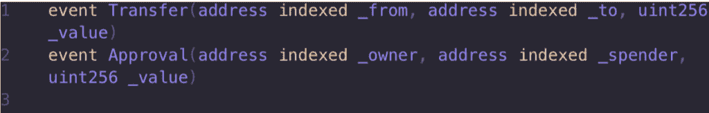
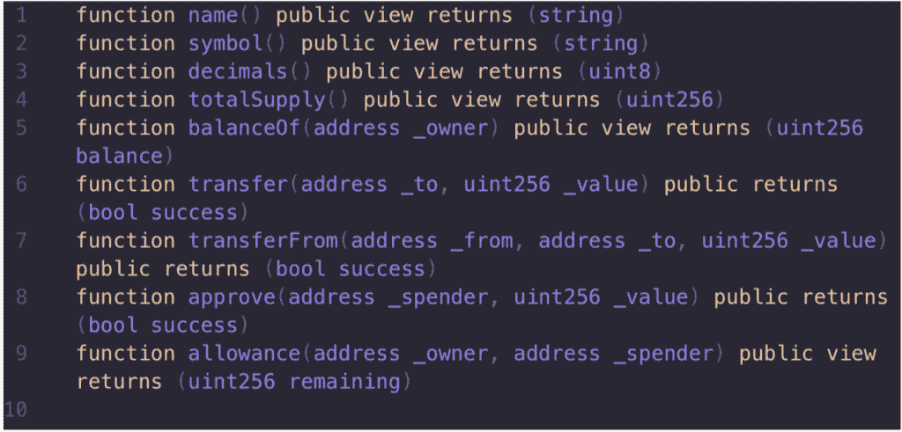
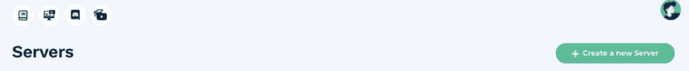
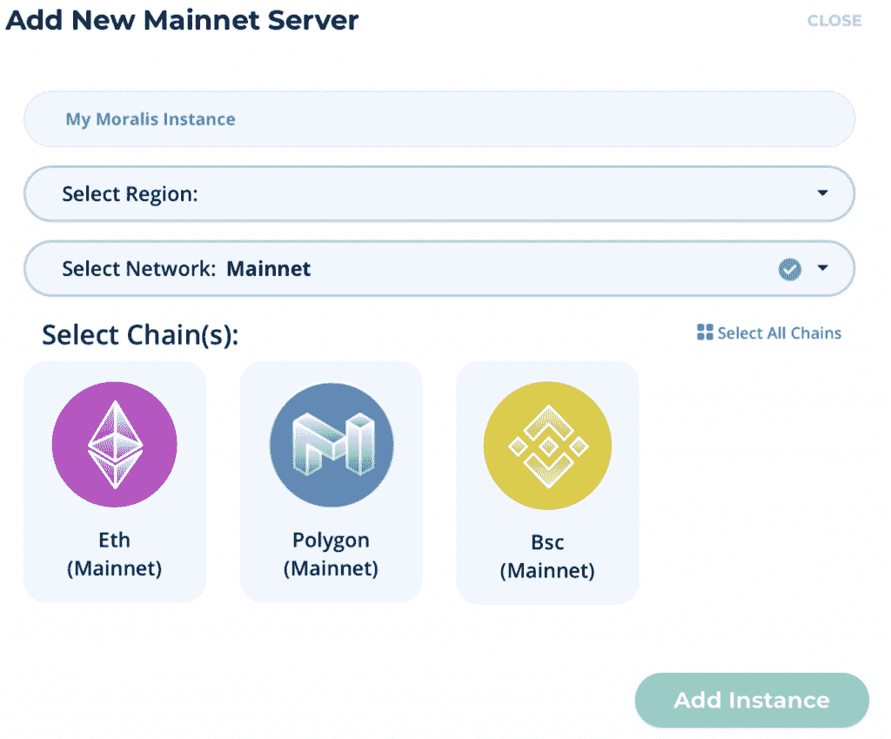
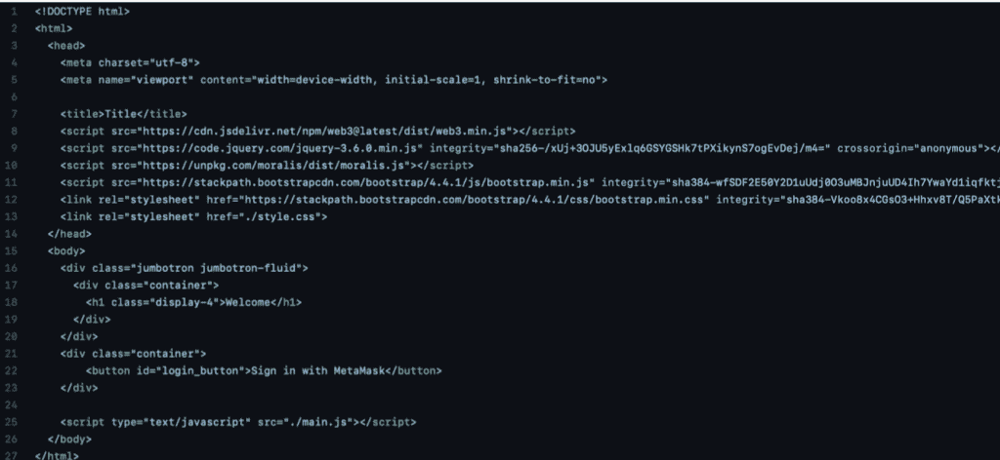
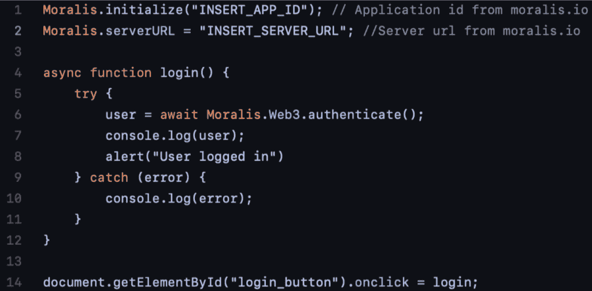
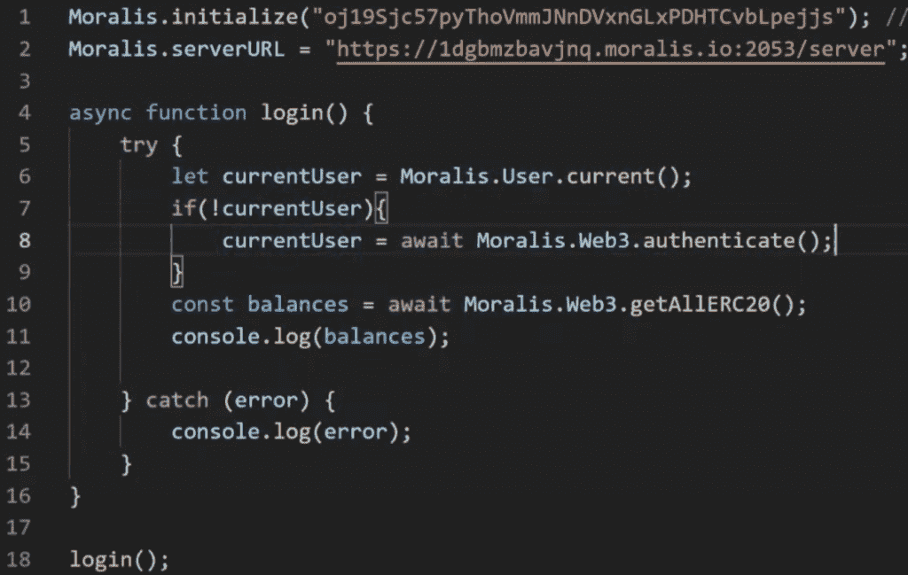
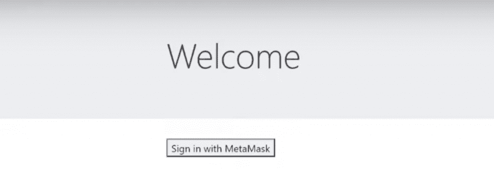
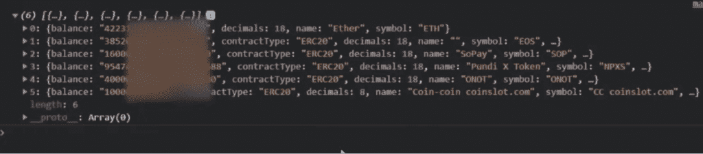
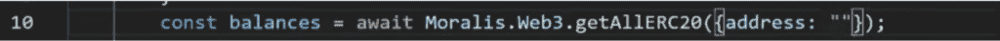

# 如何在 4 个步骤中获得用户 ERC-20 代币

> 原文：<https://moralis.io/how-to-get-user-erc-20-tokens-in-4-steps/>

**在开发** [**dApps**](https://moralis.io/decentralized-applications-explained-what-are-dapps/) **的时候，经常需要用户的余额信息，比如 ERC-20 代币** **。例如，开发人员在创建税收计算或投资组合跟踪 dApps 时需要这些信息。然而，如果没有合适的工具和资源，获取这样的信息可能是一项非常麻烦的任务。解决这件事的完美平台是** [**Moralis 家**](https://moralis.io/?utm_source=blog&utm_medium=post&utm_campaign=Want%2520the%2520Latest%2520in%2520%253Cspan%253EBlockchain%2520Development%253F%253C%252Fspan%253E) **。** **因此，在本文中，我们将进一步了解如何使用 Moralis 平台获得用户 ERC-20 令牌的过程。**

Moralis 是最强大的 [Web3](https://moralis.io/the-ultimate-guide-to-web3-what-is-web3/) 开发平台，借助 Moralis 的工具和资源，我们可以在几分钟内获取用户令牌余额。这是可能的，因为为用户提供了完全受管的后端基础设施。因此，在 Moralis 平台上开发 dApps 时，我们可以卸下大部分繁重的工作。

此外，该平台提供了大量有用的开发工具，如 [Moralis 快速节点](https://moralis.io/speedy-nodes/)[价格 API](https://moralis.io/introducing-the-moralis-price-api/)[NFT API](https://moralis.io/announcing-the-moralis-nft-api/)，以及对的原生支持。然而，这些只是 Moralis 提供的一些工具和好处。因此，该平台可以提供更多功能。

此外，我们将在本教程中广泛使用 Moralis，这也是我们强烈建议注册的原因。加入该平台是免费的，它将为您提供对该平台所有工具的即时访问。该平台使您能够显著缩短所有未来区块链项目的上市时间，从而节省宝贵的时间和资源！

### 什么是 ERC 20 代币？

与 [智能合约](https://moralis.io/smart-contracts-explained-what-are-smart-contracts/) 一样，可替换代币是以太坊区块链最有力的特征之一。这些代币几乎可以代表任何东西，从游戏中角色的技能到法定货币。这意味着以太币的用例是大量的，因此被广泛使用。因此，有必要用 ERC-20 标准来规范这些代币。但是，这个标准到底是什么，对于代币又意味着什么呢？

首先，该标准确保令牌具有相同的属性，比如它们的值和类型。由于令牌共享相同的属性，不可能将一个令牌更改为另一种类型的令牌，从而使它们可以互换。然而，我们可以把一个以太换成另一个以太，因为它们具有相同的值和类型。

再者，这个标准最初是在以太坊链条上实现的；然而，它并不局限于这个区块链。所有使用[【EVM】](https://moralis.io/evm-explained-what-is-ethereum-virtual-machine/)(以太坊虚拟机)的连锁店一般都将 ERC-20 标准应用于自己的网络。一些例子是 Polygon 和 BSC(币安智能链),它们是市场上一些最重要的开发链，仅次于以太坊。

ERC-20 标准也为带有智能合约的令牌实现了一个 API。这提供了一些功能，例如将代币从一个帐户转移到另一个帐户，设置总供应量，以及从帐户中获取代币余额，这是我们将在本文中进一步探讨的。

此外，为了被认为是 ERC-20 令牌，该令牌必须实现以下事件和方法:

 

# 如何通过 4 个步骤获得用户 ERC-20 代币

在开发 dApps 时，获得用户 ERC-20 代币在很多情况下是非常有益的，例如，为了显示他们的全部余额。但是，查询这些信息可能会很困难，而且非常耗时。这并不理想，因为我们不希望这部分成为我们开发过程中的瓶颈。

这里的一个根本问题是开发 dApp 时的后端基础设施。我们需要一个全功能的后端基础设施来为我们的 dApp 提供获取用户 ERC-20 令牌的能力，从头开始设置一个令牌可能会很麻烦。然而，如果我们利用 Moralis，这个过程变得快速和容易！

作为 [Web3 开发](https://moralis.io/how-to-build-decentralized-apps-dapps-quickly-and-easily/) 的最佳中间件和首选，我们可以利用 Moralis 平台通过四个快速简单的步骤获得用户 ERC-20 令牌。这些步骤如下:

1.  创建一个 Moralis 服务器。
2.  初始化一个 index.html 文件。
3.  创建一个 main.js 文件。
4.  使用网络服务器测试应用程序。

因此，为了开始这个过程，我们将从仔细研究如何通过简单的点击来设置自己的 Moralis 服务器开始。

然而，如果你更想看一段解释整个过程的视频，那么看看下面这段来自 [Moralis 网 YouTube 频道](https://www.youtube.com/channel/UCgWS9Q3P5AxCWyQLT2kQhBw) : 的视频

[https://www.youtube.com/embed/UiLI9WlNBGQ?feature=oembed](https://www.youtube.com/embed/UiLI9WlNBGQ?feature=oembed)

## 第一步:创建一个 Moralis 服务器

正如我们在简介中提到的，我们将在本教程中使用 Moralis。我们要做的第一件事就是报名。注册该平台是完全免费的，它提供了对所有 Moralis 工具的访问。

一旦您注册并登录，我们就可以创建我们的第一台 Moralis 服务器。第一步是单击 Moralis 用户界面右上角的“+创建新服务器”按钮，让服务器开始运行。

点击此按钮，我们将看到一个小的下拉菜单，其中有三个不同的选项:“Mainnet 服务器”、“Testnet 服务器”和“本地 Devchain 服务器”。对于本教程，您选择哪个选项并不重要；然而，我们将使用 mainnet 服务器。这个决定应该基于您计划将来在哪里部署 dApp。

但是，如果选择了其中一个选项，您将会看到一个新窗口，您需要在其中输入名称、选择地区并选择网络。因为 Moralis 支持跨链兼容性，所以在这一步可以选择几个网络。完成选项后，单击“添加实例”按钮启动服务器。

此外，如果您对构建 dApps 感兴趣，我们使用相同的过程来设置服务器，例如， [创建以太坊 dApps](https://moralis.io/how-to-create-ethereum-dapps/) 或 [构建 BSC dApps](https://moralis.io/how-to-build-bsc-dapps-easily/) 。

启动服务器可能需要一段时间，但不要担心；您将在几分钟内启动并运行您的服务器。当我们等待服务器完成时，我们可以在第二步创建我们的项目。

## 第二步:创建一个 index.html 文件

在这个例子中，我们将从头开始创建一个项目，制作一个简单的应用程序来获取用户账户的余额。因此，我们可以从创建一个全新的项目开始，我们要添加的第一个文件是“index.html”。

这个文件将包含我们应用程序的所有 HTML 代码，比如一个“登录”按钮。首先，我们只复制一些样板代码，你可以在 [Moralis GitHub 页面](https://github.com/MoralisWeb3/demo-apps/tree/main/moralis-sign-in-boilerplate) 上找到，它看起来像这样:

## 第三步:创建一个 main.js 文件

设置好“index.html”文件后，我们可以继续创建“main.js”文件。这是一个[JavaScript](https://moralis.io/web3-and-javascript-what-is-javascript-and-web3-js/)文件，和前面的文件一样，我们可以从同一个 GitHub 页面获取一些样板代码。默认情况下，这段代码看起来像这样，但是我们要做一些调整:

首先，我们将从您在第一步中创建的服务器获取应用程序 ID 和服务器 URL。要获取这些信息，我们需要找到返回 Moralis 管理面板的方法，并转到“服务器”选项卡。然后，我们需要做的就是单击“View Details”按钮，这将为我们提供包含应用程序 ID 和服务器 URL 的必要信息。所以，我们需要做的就是将这两个元素复制并粘贴到我们的代码中。

此外，我们将对代码做一些额外的修改。首先，在登录函数的“try”和“catch”语句之间，我们将在“try”下面添加一行，以检查当前是否有用户登录。在此之下，我们添加了一个“if”语句来检查用户是否没有登录。如果是这种情况，代码将触发“authenticate()”函数。

在“if”语句下面，一旦我们知道有人登录，我们就通过调用“getAllERC20()”函数来获取余额。就在这一行下面，我们将变量“balances”记录到控制台，控制台只为我们提供用户余额。

最后，我们将删除代码底部的“onclick ”,并简单地调用“login()”函数。这将为我们提供以下修改后的代码:

## 第四步: 用网络服务器测试应用

现在，有了合适的代码，我们需要做的就是测试应用程序是否正常工作。为此，我们需要一台网络服务器。有很多方法可以获得 web 服务器，但是我们使用的是 Visual Studio 代码插件。然而，你也可以在谷歌上搜索“Python Web 服务器”，你将能够很容易地设置一个。

由于我们正在使用 IDE(集成开发环境)的插件，我们可以简单地点击“上线”来测试应用程序。我们刚刚创建的应用程序看起来会像这样:

一旦我们启动应用程序，如果我们还没有通过 [元掩码](https://moralis.io/metamask-explained-what-is-metamask/) 的认证，我们将需要使用钱包登录。如果是这种情况，浏览器的右上角会出现一个小的弹出窗口，允许您使用该扩展进行身份验证。

您可能还记得上一步，我们移除了“onclick”事件，这意味着 UI 中的按钮不做任何事情。但是，我们可以通过右键单击应用程序并单击“Inspect”来检查发生了什么。一旦我们通过身份验证，我们可以查看控制台，它将显示钱包中包含的所有 ERC-20 令牌。可能是这样的:

这就是我们获取登录地址的令牌所需要做的一切。但是，我们也可以检查任何其他地址的余额。为此，我们只需要对我们的代码做一点小小的修改。然后，我们只是将一个地址作为参数添加到“getAllERC20()”函数中，它看起来会像这样:

## 如何获得用户 ERC-20 代币—摘要

在开发 dApps 时，我们经常需要访问应用程序用户的平衡。然而，如果没有适当的底层基础设施，获取这些信息可能是一项繁琐的任务。然而，通过使用 Moralis，这项任务将变得轻而易举，因此 Moralis 成为最好的 Web3 开发平台。

Moralis 是领先的 Web3 开发中间件，它为用户提供了开发和部署 dApps 所需的一切。一个例子是，我们可以利用 Moralis 平台让用户 ERC-20 令牌查看余额。借助 Moralis 的力量，我们可以在几分钟内完成这项工作。事实上，我们可以通过以下四个步骤获得用户余额:

1.  生成一个 Moralis 服务器。
2.  初始化一个 index.html 文件。
3.  创建一个 main.js 文件。
4.  使用网络服务器测试应用程序。

在本文中，我们从头创建了一个新项目来演示使用 Moralis 是多么容易。然而，也可以将本教程中的逻辑实现到现有的 dApp 中。

此外，这仅仅触及了 Moralis 的表面。该平台还提供了其他一些优秀的工具和功能。例如，您会在 [上找到出色的指南，了解如何创建自己的 ERC-20 令牌](https://moralis.io/how-to-create-your-own-erc-20-token-in-10-minutes/) 以及 [如何通过 WalletConnect](https://moralis.io/how-to-connect-users-with-walletconnect/) 上的 [Moralis 博客](https://moralis.io/blog/) 验证用户。仔细看看这个博客也会让你更好地理解 Moralis 平台的潜力。

所以，如果你想成为一名 dApp 或令牌开发者，第一步就是 [注册 Moralis 平台](https://admin.moralis.io/register) 。注册是完全免费的，只需要几秒钟。注册后，您将可以使用该平台的所有工具和已经托管的后端基础设施。从今天开始，让 Moralis 帮助您从头到尾启动您的项目！