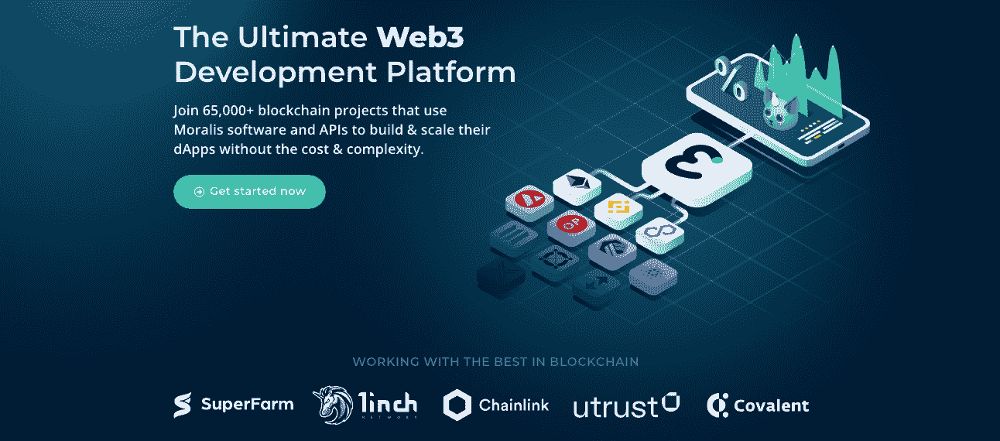
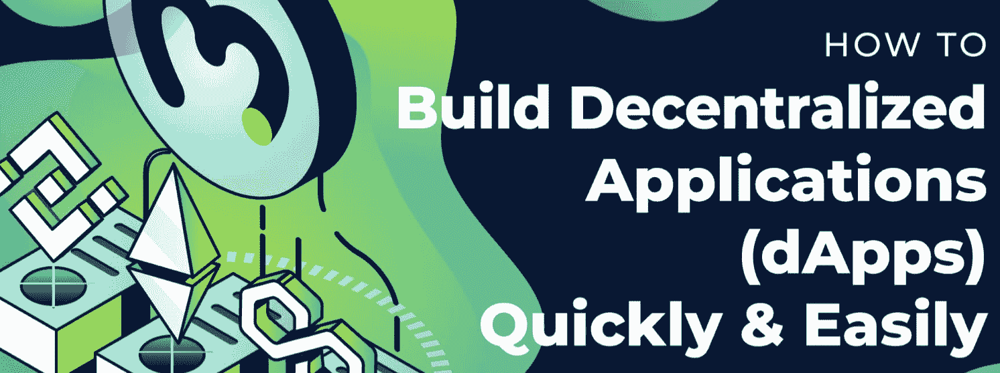
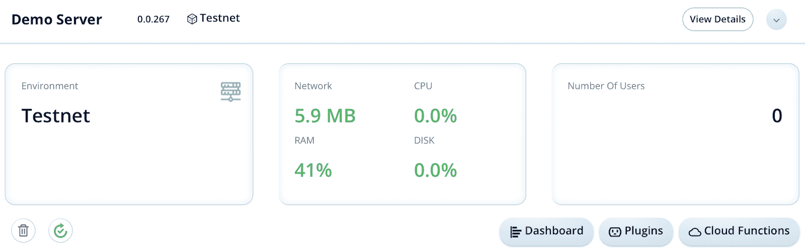
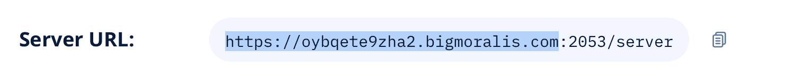

# 如何主办 dApp–dApp 主办说明

> 原文：<https://moralis.io/how-to-host-a-dapp-dapp-hosting-explained/>

**如果一个** [**区块链开发者**](https://moralis.io/how-to-become-a-blockchain-developer/) **想要他们的 dApp 的内容对用户可用，开发者需要托管他们的 dApp。事实上，如果程序员不考虑托管部分，用户将无法与他们的 Web3 应用程序交互。所以我们意识到，对于任何想要** [**构建去中心化 app(dApp)**](https://moralis.io/how-to-build-decentralized-apps-dapps-quickly-and-easily/)**的程序员来说，dApp 托管都是必不可少的。如果你不熟悉这个过程，并希望有 dApp 托管解释，继续阅读，因为我们将深入探讨托管 dApp 需要什么，并教你如何以一种简化的方式托管 dApp。**

Moralis 是排名第一的 [Web3](https://moralis.io/the-ultimate-guide-to-web3-what-is-web3/) 操作系统，当与 Moralis 合作时，dApp 托管成为一项简单的任务。此外，在后端开发方面，Moralis 承担了大部分繁重的工作。这意味着我们需要做的就是部署我们的 [dApps](https://moralis.io/decentralized-applications-explained-what-are-dapps/) (分散式应用程序)的前端。因此，只需几个简单的命令就可以托管一个 dApp。



由于我们将在本教程中使用 Moralis，我们强烈建议您注册该平台。加入是完全免费的，只需要几秒钟。此外，这样做将允许您访问完全托管的后端基础设施和平台的工具！

## 什么是托管？

托管是一种在线服务，它本质上允许开发者将他们的 web 应用程序或 dApps 的文件发布到互联网上。因此，这意味着托管使网站/应用程序的内容，如代码和图像，对每个人都可用。这为任何人提供了访问互联网的能力，与您的 dApps 互动。此外，这进一步意味着你曾经访问过的每个网站都托管在一个服务器上。


创建 dApp 时，dApp 通常位于本地测试服务器上。然而，一旦我们知道应用程序如预期的那样工作，我们就需要将 dApp 公之于众。因此，我们需要一个主机提供商，在这种情况下是 Moralis。这意味着我们将使用自己的 Moralis 服务器来部署 dApp，并使其可用于互联网。这样做时，用户唯一需要的是正确的 URL，然后他们就可以访问 dApp。因此，如果没有主机，这不是不可能的。

然而，在进入用 Moralis 托管 dApps 的过程之前，我们需要了解 Moralis 是什么。

### 什么是 Moralis？

Moralis 是最终的 Web3 开发操作系统，Moralis 的软件和 API 目前支持超过 65，000 个区块链项目。这些项目不仅使用 Moralis 来构建他们的 dApps，而且该软件提供了出色的可伸缩性机会，而没有复杂性。


此外，Moralis 提供了令人难以置信的开发工具，可用于开发各种不同的区块链项目。例如，Moralis 提供的工具有 [Moralis Speedy Nodes](https://moralis.io/speedy-nodes/?utm_source=blog&utm_medium=post&utm_campaign=Decentralized%2520Applications%2520Explained%2520%25E2%2580%2593%2520What%2520are%2520dApps%253F) 、 [NFT API](https://moralis.io/ultimate-nft-api-exploring-moralis-nft-api/) 、 [Price API](https://moralis.io/introducing-the-moralis-price-api/) 等等。

此外，该平台还提供了已经被管理的后端基础设施，允许开发者节省宝贵的时间和资源。从服务器、数据库到一个 [SDK](https://moralis.io/exploring-moralis-sdk-the-ultimate-web3-sdk/) (软件开发工具包)的一切对所有用户都是可用的，这意味着 Moralis 在 dApp 和令牌开发方面做了大部分繁重的工作。

除了后端基础设施和平台工具之外，Moralis 还拥有对解决方案的本地支持，如[元掩码](https://moralis.io/metamask-explained-what-is-metamask/)和 [IPFS](https://moralis.io/what-is-ipfs-interplanetary-file-system/) (星际文件系统)以及跨链兼容性。因此，除了许多其他功能之外，用一行代码就可以用元掩码对用户进行[认证。也可以很容易地将文件和对象保存到 IPFS。此外，跨链兼容性允许您为多个链开发 dApps。此外，Moralis 支持](https://moralis.io/how-to-authenticate-with-metamask/)[以太坊](https://moralis.io/full-guide-what-is-ethereum/)、雪崩、Fantom、BSC(币安智能链)、Polygon 和 Arbitrum。

所以，如果你想让[成为区块链开发者](https://moralis.io/how-to-become-a-blockchain-developer/)，第一步就是和 Moralis 签约。加入该平台可以立即获得 Moralis 的所有好处。这可以让你节省大量的时间和资源。

## 如何主持一个 Moralis 的 dApp

现在，对什么是 Moralis 以及为什么您应该加入 65，000+项目有了稍微好一点的理解，我们可以继续下一部分关于 dApp 托管的内容。一旦我们完成了 dApps 的开发，我们需要一种方法来部署它们，以便用户可以通过他们的浏览器直接评估它们。由于我们使用的是 Moralis，这个过程非常简单，只需要在代码编辑器的终端中输入几个简单的命令。

然而，在部署 dApp 之前，我们需要一些东西。首先，需要一个开发的 dApp，因为我们需要部署一些东西。其次，我们还需要一个 Moralis 服务器和数据库。因此，我们将简要地为您提供一些关于 dApp 开发以及如何获得您自己的服务器和数据库的信息。

如果您已经知道如何做到这一点，那么我们建议您跳过下面的两个部分，向下滚动到关于流程本身的部分。你也可以从 [Moralis YouTube 频道](https://www.youtube.com/channel/UCgWS9Q3P5AxCWyQLT2kQhBw)查看以下视频。在这里，你可以在 7 分钟内找到关于 dApp 托管与 Moralis 的深入解释:

https://www.youtube.com/watch?v=RiH0ADGPleg

### 如何与 Moralis 一起主持 dApp-dApp 开发

Moralis 为您提供了开发、部署和扩展 dApps 所需的一切。所有的工具和后端基础设施使 Moralis 成为快速进入市场的重要工具，从而节省了资源和时间。有了 Moralis 提供的这些工具，几乎不需要预先开发技能。然而，了解什么是智能合约以及对区块链编程语言的基本理解是非常有益的，比如 T2、T4 和 T5。



我们不会深入讨论开发 dApps 的细节，因为在 Moralis 博客上有很好的教程来解释这个过程。因此，我们只是给你留下一些灵感，指引你到博客上的一些以前的文章。例如，你可以查看教程[如何在以太坊上构建 dapp](https://moralis.io/how-to-build-dapps-on-ethereum/)、[如何创建 BSC dapp](https://moralis.io/how-to-create-bsc-dapps-quickly/)、[开发自己的 NFT 市场](https://moralis.io/develop-your-own-nft-marketplace-step-by-step-guide/)等。

收听这些文章将为您提供一个关于 dApp 开发的良好基础，并有望激励您创建下一个项目。然而，所有这些例子的一个普遍因素是需要一个 Moralis 服务器和数据库。因此，下面的部分将致力于这两个元素的创建。

### 如何托管 dApp–创建 Moralis 服务器

在托管 dApp 之前，我们需要启动并运行一个 Moralis 服务器。要开始，你需要做的就是登录你的 Moralis 账户，点击管理面板右上角的“+创建一个新服务器”。这将提供一个小的下拉菜单，有三个不同的选择。您在这里的选择应该取决于您想要部署 dApp 的位置。例如，选择“Testnet Server”选项可能是有益的，因为您的 dApp 可能不适合部署在 mainnet 网络上。

单击任一选项后，将出现另一个窗口，您需要在其中输入名称，选择区域，最后选择网络。正如前面提到的，Moralis 支持跨链兼容性。这意味着在此步骤中可以选择多个网络。


完成所有选择后，剩下的工作就是单击“添加实例”按钮来启动服务器。然而，这可能需要一段时间，但是不要担心；它很快就会启动并运行。

一旦服务器启动并运行，您还将获得一个数据库。您可以通过单击相关服务器的“Dashboard”按钮来访问该数据库。在这里，您可以找到关于您的 dApp 用户的信息，这允许您获取必要的信息，如令牌余额等。



就是这样，用 Moralis 创建一个服务器和数据库是多么容易，而且只需要几分钟。而且是完全免费的，所以没什么损失！

## 主持 dApps 与 Moralis 解释

有了如何构建 dApp 和如何启动 Moralis 服务器的概念，我们可以继续讨论本文的核心部分，即如何用 Moralis 托管 dApp。因此，有了 dApp 和服务器，下一部分就从您选择的代码编辑器开始了。在这个例子中，我们将使用 Visual Studio 代码，因为这是我们更喜欢的，因为我们可以很容易地访问终端。

### dApp 主机的终端输入

该过程的第一部分是安装 Moralis CLI。为此，您需要在终端中输入以下命令:

*NPM install-g moralis-admin-CLI*

正如你所看到的，这是一个 npm 包，我们正在全球范围内安装它，以便它可以用于所有项目。安装了 Moralis CLI 后，我们可以通过以下命令继续部署 dApp:

*moralis-admin-cli 部署*

一旦您执行了这个命令，终端将询问您一个 Moralis API 密钥。您可以通过导航回 Moralis 管理面板并单击“服务器”选项卡来找到此密钥。然后，您需要单击相关服务器的“查看详细信息”按钮，并复制 CLI API 密钥。然后，您可以输入这些信息并执行命令。


随着命令的执行，您将再次被询问一些信息。这一次，您应该从同一个地方获取 CLI API secret，输入该信息，然后执行该命令。执行完命令后，您需要选择想要连接的服务器。如果你有多台服务器，你会得到一个列表，你需要输入相应的数字来选择正确的服务器。一旦您选择了有效的数字，您只需单击 enter，部署将完成。

### 启动和解除部署 dApp

部署服务器后，可以通过服务器 URL 访问 dApp，您可以在相关服务器的“查看详细信息”部分找到该服务器。您只需复制 URL(不包括端口)，如下所示，并将其输入到浏览器中:



这就是部署 dApp 的方法；然而，如果您想要取消部署 dApp，您可以基本上遵循相同的过程，但是使用“取消部署”命令。因此，您需要输入以下内容:

```js
moralis-admin-cli undeploy
```

这将触发终端查询 CLI API 密钥和 CLI API 机密，您可以通过与前面相同的方式获得它们。然后，剩下的就是选择正确的服务器，最后执行命令。

本教程到此为止；我们可以用几个简单的终端命令部署 dApp，允许我们通过浏览器直接访问 dApp。此外，在取消部署 dApp 时，流程也同样简单。

## 如何主持 dApp–dApp 主持讲解–总结

Moralis 使得 dApp 的开发变得更加容易，并且可以节省时间和资源。因此，成为社区的一员对任何区块链开发者来说都是理所当然的。此外，dApp 的开发过程变得更加简单，但 dApp 托管过程也是如此。

在本文中，我们展示了只需几个命令就可以托管一个 dApp 是多么容易。所有需要做的就是安装 Moralis CLI，然后执行“moralis-admin-cli deploy”命令并按照说明进行操作。此外，取消部署 dApp 的过程几乎完全相同。但是，我们没有使用“deploy”命令，而是使用了“moralis-admin-cli undeploy”。

本教程进一步展示了使用 Moralis 的力量。然而，这个平台有更多的功能，你不仅仅局限于创建 dApps。例如，您可以将不可替换的令牌变成可替换的令牌。为了进一步展示这种潜力，您可以查看 Moralis 博客上的文章:如何创建一个 BSC 令牌(T1)，如何创建自己的 NFT(T3)，如何创建多边形令牌(T5)。

所以，如果你想成为一名区块链开发者，那么,[马上和 Moralis](https://admin.moralis.io/register) 签约。只需几秒钟就可以加入，您将能够缩短所有未来区块链项目的开发时间。此外，您将立即获得该平台的所有工具！