# 如何识别元掩码上哪个网络是活动的？

> 原文：<https://moralis.io/how-to-identify-which-network-is-active-on-metamask/>

以太坊的区块链是当今 [**dApp**](https://moralis.io/decentralized-applications-explained-what-are-dapps/) **开发者的主要关注领域之一。然而，许多其他著名的解决方案，如多边形，索拉纳，卡尔达诺，雪崩等。，引起了很多关注。这使得开发者和用户对各种链的使用更加均衡。由于这些链有自己的 mainnet 和 testnet，您的** [**Web3**](https://moralis.io/the-ultimate-guide-to-web3-what-is-web3/) **应用程序应该包含这些网络的特定功能，其中之一就是网络跟踪。因此，我们将看看如何对网络跟踪进行编程，并确定哪个网络当前处于活动状态。因此，您的 dApp 将能够根据有问题的链正常工作，或者至少在特定链不受支持时通知用户。此外，由于区块链和加密领域的大多数用户使用** [**元掩码**](https://moralis.io/metamask-explained-what-is-metamask/) **，我们将探索这种数字钱包执行网络识别的能力。**

许多 dApps 需要特定于链的代码才能顺利正确地运行。因此，能够识别哪个网络在 MetaMask 上是活动的至关重要。幸运的是，当使用最终的 Web3 开发平台 [Moralis](https://moralis.io/) 时，我们可以快速轻松地完成这一点。Moralis 旨在使区块链开发轻而易举，并使您的开发过程明显更快。此外，该平台为前端开发人员提供了一个将资源投入到创建高质量用户体验的机会，而不是浪费宝贵的时间和金钱。如果这是你第一次听说 Moralis，我们推荐你观看链接视频，更详细地解释[什么是 Moralis](https://www.youtube.com/watch?v=txHnWDRB728&t=1236s)。

在接下来的小节中，您将学习如何创建一个简单的“listener”事件，该事件将识别哪个网络在 MetaMask 上是活动的。然而，在我们开始一个将教您如何执行网络识别和基本网络跟踪的示例项目之前，让我们先了解一些基础知识。

## 什么是 MetaMask？

MetaMask 是市场上最成熟和最受欢迎的加密货币钱包之一。事实上，MetaMask 已经为全球超过 100 万用户提供服务。因此，这是一个在加密行业起步的好方法。它与分散式交易所(dex)的兼容性使得它在希望避开中央集权的用户中也很受欢迎。

除了作为一个加密钱包，元掩码连接到广泛的区块链，包括主网和测试网。因此，这允许用户通过多个网络访问多个生态系统。有了这个功能，这个流行的钱包也可以用来[验证 Web3 用户](https://moralis.io/how-to-authenticate-with-metamask/)。如果你有兴趣了解更多关于元掩码的细节，一定要看看下面这篇来自 Moralis 博客的文章:“[元掩码解释——什么是元掩码？](https://moralis.io/metamask-explained-what-is-metamask/)”。

# 如何识别元掩码上哪个网络是活动的？–示例项目

如果你一直在关注 [Moralis 的博客](https://moralis.io/blog/)上的指南，你会知道我们相信通过承担简单的示例项目来学习，我们在这里也会遵循这种做法。为了更好地向您展示如何在 MetaMask 上识别哪个网络是活动的，我们将使用一些 HTML 和 [JavaScript](https://moralis.io/javascript-explained-what-is-javascript/) 代码创建一个简单的 dApp。此外，与区块链相关的后端将由 Moralis 全面覆盖；我们只需要连接到我们的 Moralis 服务器，并插入一些代码片段来建立一个正确的连接。

此外，在我们能够识别哪个网络在元掩码上是活动的之前，用户必须安装元掩码。因此，我们还需要为用户尚未安装元掩码的情况做好准备。因此，我们应该对 dApp 的网络标识部分进行编程，以便它首先检查是否找到元掩码。如果安装了 MetaMask，它应该继续进行网络识别，并返回显示该网络名称的消息。但是，如果它没有找到元掩码，我们希望 dApp 返回一条消息，指示用户安装元掩码以继续。

虽然这听起来像是大量的工作，但你会看到，通过使用 [Moralis 的 Web3 SDK](https://moralis.io/exploring-moralis-sdk-the-ultimate-web3-sdk) ，我们可以毫不费力地完成它。

### 设置 Moralis 和其他网络识别工具

出于这个例子的目的，我们将使用 Visual Studio 代码(VSC)，MetaMask 的浏览器扩展，当然，还有 Moralis。如果您需要获得和设置前两个工具的帮助，请查看我们的"[以太坊初学者开发](https://moralis.io/ethereum-development-for-beginners)"指南。至于 Moralis 的设置，我们将在下面的分步说明中介绍。

## 如何设置网络身份认证的 Moralis 标准

1.  [**创建您的 Moralis 家账户**](https://admin.moralis.io/register)——如果您还没有 Moralis 家账户，请确保创建一个。完全免费。只需点击链接(或[点击此处](https://admin.moralis.io/login)，输入您的电子邮件地址，并设置您的密码。然后通过确认您的电子邮件地址来完成您的 Moralis 帐户创建(您将收到一封带有确认链接的电子邮件)。如果您已经有一个有效的 Moralis 帐户，只需[登录](https://admin.moralis.io/login)。
2.  **创建新服务器**–进入新的 Moralis 账户后，您将需要创建一个新服务器。您可以通过点击右上角的“+创建新服务器”按钮来完成此操作。接下来，从出现的下拉菜单中单击一个选项(见下图)。

然后输入所有必需的详细信息。这包括服务器名称(可以是您想要的任何名称)、区域、网络、链，然后单击“添加实例”按钮。

3.  **访问服务器详细信息**–一旦您创建了服务器，您将需要获得它的一些详细信息(在我们的内部使用)。js”文件。要访问服务器详细信息，请单击服务器名称旁边的“查看详细信息”按钮。接下来，将出现一个包含所有详细信息的弹出窗口。*如果你以前用过 Moralis，你可能已经安装了一两台服务器。在那种情况下，你可以使用任何一台服务器。*

4.  **初始化 Moralis-**通过填充。js”文件，我们就获得了所需的后端功能。对于我们的例子，我们将使用“logic.js”文件，在这里我们将进行所有的 JavaScript 编码。在该文件的顶部，我们插入在上一步中获得的应用程序 ID 和服务器 URL:

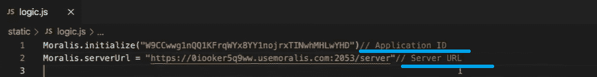

*注意:请确保您使用的是您的服务器的详细信息，而不是复制我们示例中的详细信息。*

## 编程以识别哪个网络在元掩码上是活动的

在这一部分中，我们将向您展示如何识别哪个网络在元掩码上处于活动状态。因此，我们将坚持基本的 HTML 和 JavaScript (JS)编程。我们将使用“index.html”和“logic.js”文件，我们将在 Visual Studio 代码中编辑它们。此外，我们将主要关注 JavaScript，因为这是所有逻辑的来源。HTML 部分基本上只是一个框架，使我们能够在浏览器中显示我们的 dApp。

以下是我们在示例中使用的 HTML 代码:

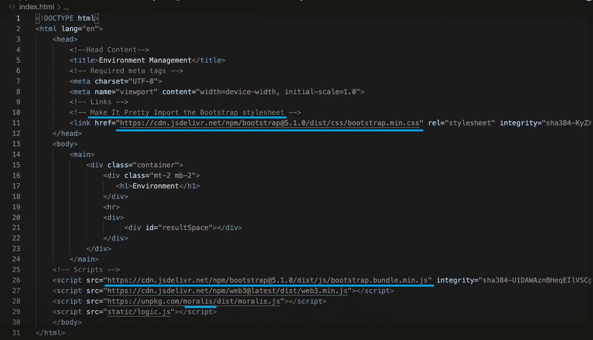

*注意:您可以在* [*GitHub*](https://github.com/DanielMoralisSamples/22_Monitor_Networks) *中访问用于我们示例的完整代码。*

如您所见，代码很简单。为了帮助我们设计风格，我们使用 Bootstrap(这是完全可选的)。脚本是我们代码的重要组成部分，我们在其中导入“moralis.js”和“logic.js”。

使用 Visual Studio 代码顶部菜单栏中的“Terminal > New Terminal”选项，我们创建一个新的工作文件夹和“logic.js”文件。是的，这是我们用来插入您的 Moralis 服务器详细信息的文件，如前一部分(步骤 4)所述。接下来，我们添加代码来处理我们希望 dApp 向用户显示的消息。为此，我们创建了“显示消息”函数:

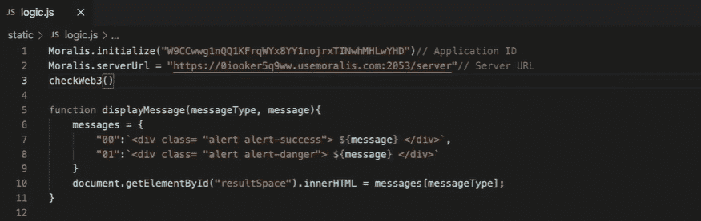

为了我们的网络跟踪目标，我们创建了两个消息实例。一个用于在我们成功识别哪个网络在元掩码上处于活动状态后显示网络名称(“alert alert-success”)，第二个消息用于防止用户没有安装元掩码(“alert alert-danger”)。此外，我们实现了一个部分，它将确保消息由我们的 HTML 代码显示。为此，我们使用“document . getelementbyid . innerhtml”代码片段。

### 网络跟踪–检查元掩码安装状态

因为我们计划使用 MetaMask 进行网络识别，所以我们必须首先确保有兴趣使用我们的 dApp 的用户安装了这个有用的工具。因此，我们需要创建一个函数作为逻辑，检查是否安装了元掩码，并相应地采取行动。如果安装了 MetaMask，我们 dApp 的网络跟踪部分将自动进行网络识别，我们将在下一节中进行设置。但是，如果没有安装元掩码，我们希望我们的 Web3 应用程序指示用户安装元掩码。我们通过确保我们的分散式应用程序显示正确的消息来实现后者。

下面是我们用来检查元掩码是否已经存在的代码:

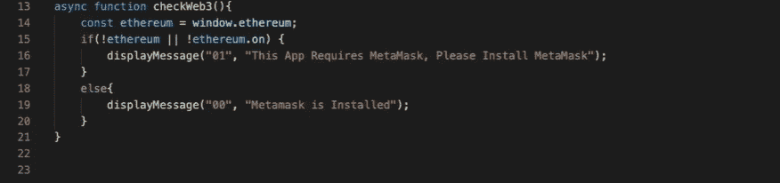

查看上面的代码，您会发现一个简单的“if”语句就足够了。如果没有检测到元掩码，它会显示“此应用程序需要元掩码，请安装元掩码”消息。如果已经安装了元掩码，将显示“元掩码已安装”消息。下图显示了如果上述代码在没有元掩码的情况下执行，我们的 dApp 是如何工作的:

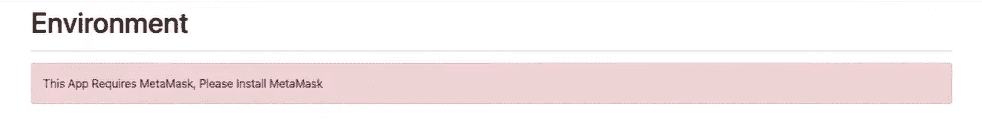

现在，我们已经完成了关于未安装元掩码的实例的讨论。但是，如果您还记得，我们希望我们的 dApp 在安装 MetaMask 时自动转向网络识别。具体来说，这不是显示“元掩码已安装”消息。因此，我们需要进一步完善我们的代码。

### 网络识别–识别哪个网络在元掩码上处于活动状态

如上所述，网络识别在确认 MetaMask 的安装后进行。因此，我们在“checkWeb3()”函数的“else”语句下更改必要的代码行。本质上，我们将“displayMessage”转换成一个注释，并添加“setWeb3Environment()”:

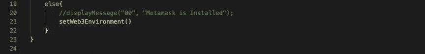

然后我们在“if”语句之外定义“setWeb3Environment()”函数。在其中，我们使用“getNetwork()”来识别元掩码上哪个网络是活动的，并使用“monitorNetwork()”函数来检测用户是否切换到其元掩码内的另一个网络:

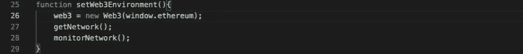

此外，您可以看到我们在上面显示的函数中使用了“web3”对象。这意味着我们需要定义它。为此，我们将这段代码添加到“logic.js”文件的顶部:

此外，我们需要添加代码行来确保“getNetwork()”和“monitorNetwork()”函数完成我们希望它们做的事情。对于“getNetwork()”函数，我们需要定义链的 id。此外，我们希望确保在确定哪个网络处于活动状态后，会显示正确的消息。下面是涵盖网络标识部分的代码行:

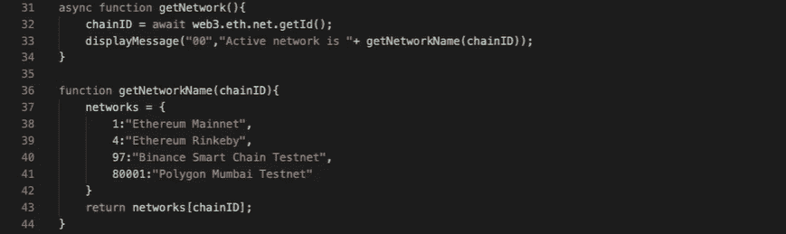

至于“monitorNetwork()”功能，我们依赖 Moralis 为我们提供网络跟踪功能。本质上，我们希望 Moralis 在用户换到另一个网络时通知我们的 dApp。这些代码行涵盖了这一方面:

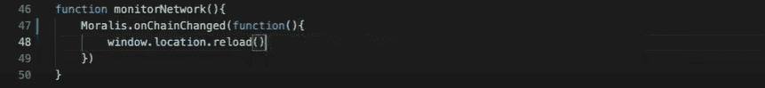

有了它，我们的 dApp 就能覆盖这两种情况。如果元掩码尚未安装，则为；如果元掩码已经安装，则为。此外，在我们代码的所有组件识别哪个网络在元掩码上是活动的之后，它返回一条消息。由于我们(在“getNetworkName”函数中)定义了“以太坊主网”、“以太坊林克比”、“币安智能链测试网”和“多边形孟买测试网”，dApp 能够识别这些链。您可以在以下图像中看到这一点:

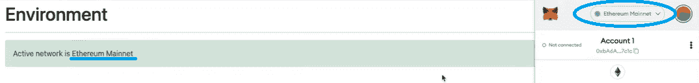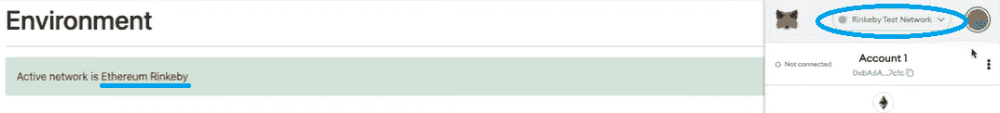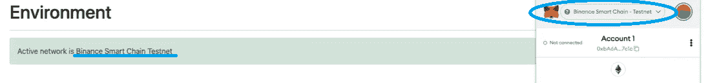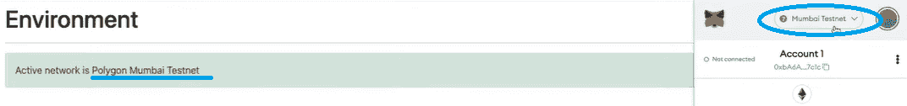

## 如何识别元掩码上哪个网络是活动的？–总结

至此，您知道每个区块链网络可能都有一些特定的代码要求。因此，能够执行网络识别非常重要，这样您的 Web3 应用程序才能正确响应。幸运的是，有一些强大的工具可以使网络识别成为一个简单直接的过程。当结合 MetaMask 和 Moralis 的功能时，您可以用不到四十行代码编写 dApps 来识别哪个网络在 MetaMask 上是活动的，这正是我们上面展示的。

我们希望您已经了解了如何设置基本的网络跟踪。如果您喜欢看视频而不是阅读，我们建议您查看我们的“[网络跟踪，为您的 dApp 编写几行代码(使用 Moralis Web3 函数)](https://www.youtube.com/watch?v=yjBaaJemA4M)”视频。

此外，我们还鼓励你订阅 [Moralis 的 YouTube 频道](https://www.youtube.com/channel/UCgWS9Q3P5AxCWyQLT2kQhBw)，在那里你可以找到大量有价值的内容。我们不断上传新的视频，在视频中，我们要么解释区块链发展的某些方面，要么承担简单的示例项目。因此，您将学会结合 Moralis 充分利用您的 JavaScript 技能。无论你想学习如何[建立一个加密钱包](https://moralis.io/how-to-build-a-crypto-wallet-in-4-steps/)，[创造自己的 ERC-20 代币](https://moralis.io/how-to-create-your-own-erc-20-token-in-10-minutes/)，还是[创造自己的 NFT](https://moralis.io/how-to-create-your-own-nft-in-5-steps/) ，Moralis 都会支持你。

此外，如果您渴望将您的区块链开发提升到一个新的水平，并开始快速部署多个 Web3 应用程序，我们建议您深入研究 [Moralis 的文档](https://docs.moralis.io/)。这是业内最整洁、组织良好的文档之一，创建它是为了让 Moralis 的 SDK 更容易使用。

