# 如何索引区块链——终极指南

> 原文：<https://moralis.io/how-to-index-the-blockchain-the-ultimate-guide/>

**区块链正在改变各个部门和行业，包括货币、金融、银行、游戏、艺术、房地产和许多其他行业。熟悉区块链技术的人都明白它在** [**加密货币**](https://moralis.io/moralis-magazine-9-launch-a-cryptocurrency-with-moralis/) **、dApps、** [**Web3**](https://moralis.io/the-ultimate-guide-to-web3-what-is-web3/) **、DeFi 等趋势中的基础性作用。此外，区块链在**[**NFTs**](https://moralis.io/non-fungible-tokens-explained-what-are-nfts/)**和去中心化游戏等文化现象中的作用也不可低估。因此，如果你想加入这些行业并创造新的******【dApps】，你必须学会如何指数化区块链。****

**区块链是分布式账本技术的一种形式——网络中共享的、不可变的交易记录。此外，它消除了交易中对人类信任的需要。因此，它让协议实现自动信任的规则。**

**由于区块链包含数据，开发人员需要理解数据需要索引，以使其在任何 Web3 构建中都有用。任何新的或有抱负的[区块链开发者](https://moralis.io/how-to-become-a-blockchain-developer/)都应该记住，知道如何索引区块链是驾驭其力量的关键。**

**即使对于那些精通区块链开发最佳语言的人来说，比如 JavaScript、Solidity、Rust 等等，索引区块链也是一个相当复杂的过程。它涉及许多步骤，包括启动您的节点——这可以通过使用 IaaS ( [基础设施即服务](https://moralis.io/iaas-explained-what-is-infrastructure-as-a-service/))产品，如 [Moralis Speedy Nodes](https://moralis.io/speedy-nodes/) 来简化。**

**本指南将向您展示在探索如何索引区块链时可以使用的工具。您可以使用多个平台从头开始。你也可以使用节点提供者，比如 Infura 或者 [Infura 替代品](https://moralis.io/infura-alternatives-and-blockchain-node-providers/)。或者，您可以减少复杂性，使用 Moralis 来处理复杂的后端。因此，使用 Moralis 将节省你宝贵的时间和精力。此外，它让您的 dApp 拥有率先上市的优势！**

## ****如何索引区块链——视频演练****

**如果你想直接了解如何对区块链进行指数化，主要集中在两个平台上:Graph 和 Moralis——查看以下来自 Moralis Web3 YouTube 频道的视频:**

**https://www.youtube.com/watch?v=zrtcXd5cSe4

## **什么是区块链索引？**

要理解如何指数化区块链，你需要先掌握技术。此外，你需要了解它的应用。此外，要想对这些应用有更广泛的了解，请阅读 Moralis 的博客文章“【Solidity Smart Contracts 的用例”。

### **什么是区块链？**

区块链是一个网络中的分布式共享账本。它以公开、透明和不变的方式记录事务并广播它们。此外，它允许您创建和跟踪网络中的数字资产(硬币或代币)，为无边界交易和价值交换铺平了道路。

为什么区块链与今天相关？区块链通过让协议做权威人物和机构的工作来促进去中心化。因此，它在脱媒过程中发挥作用。

区块链是由什么制成的？第一个组成部分是分布式账本本身，这意味着网络中的每个人都有一份副本。不变性的属性构成了第二个组成部分。加密哈希实现了不变性，因为这种哈希不能被逆向工程，至少在很长时间内不能，并且必须具有相当大的计算能力。

第三个组成部分是智能合约。[然而，什么是智能合约](https://moralis.io/smart-contracts-explained-what-are-smart-contracts/)？智能合约决定了区块链协议中的规则和功能。此外，它们是用 [Solidity](https://moralis.io/solidity-explained-what-is-solidity/) 或类似的高级语言编写的。

## **为什么要学习如何索引区块链？**

拥有分布式和不可变的数据是一回事，让它对试图构建新平台或[创建以太坊 dApp](https://moralis.io/how-to-create-an-ethereum-dapp-instantly/) 的开发者有用是另一回事。因此，您需要学习如何索引区块链。

面对大量可用的数据，区块链倾向于以“分散”的方式存储，你需要一个系统来过滤或定位你的平台所需的数据。换句话说，您需要能够查询在 dApp 中使用的区块链数据。

## **区块链索引替代方案**

在探索如何索引区块链时，您会发现两种流行的替代方法:图表和 Moralis。本指南分析了两者之间的差异。因此，它介绍了在导航如何索引区块链时使用任一平台需要经历的过程。

此外，在比较教您如何索引区块链的各种工具时，您需要考虑以下几点:

*   开发 dApp、平台或产品的时间框架。
*   你的技能组合，包括你对如何创建智能合同的理解。
*   为了实现正确的索引，您愿意经历的复杂程度。
*   项目类型和所需的功能。
*   您在运行 Web3 后端基础设施方面的经验水平。

Graph 和 Moralis 等区块链索引协议提供了查询数据的方法，否则很难直接从区块链查询数据。您需要这些工具来确保您的索引能力超越基本的读取操作。

了解如何对区块链进行索引可让您不仅仅是直接与合同进行交互。此外，它还允许您利用与复杂或高级操作相关的有价值的信息。像 Graph 和 Moralis 这样的工具使得搜索、聚合、关系或非平凡的过滤成为可能。

## **如何索引区块链——很难**

没有办法“掩盖”它——理解如何指数化区块链的过程相当具有挑战性。此外，即使对于高级开发人员来说，这也会变得复杂。它需要大量的时间、奉献和一丝不苟的努力来完成。

区块链的固有属性，如终结性、链重排和未调用块，是一把双刃剑:它们使得检索准确的查询结果变得困难。然而，简化区块链索引的工具，如 Graph 和 Moralis，可以缓解一些棘手问题。

## **如何使用图索引区块链**

该图表是一个流行的平台，它解决了如何索引区块链的问题。该图实现了一个索引协议，通过公共和开放的 API 来促进 dApps 的可访问性，它称之为“子图”。这个索引工具，就像任何传统数据库的索引工具一样，能够定位和检索以太坊上的数据。

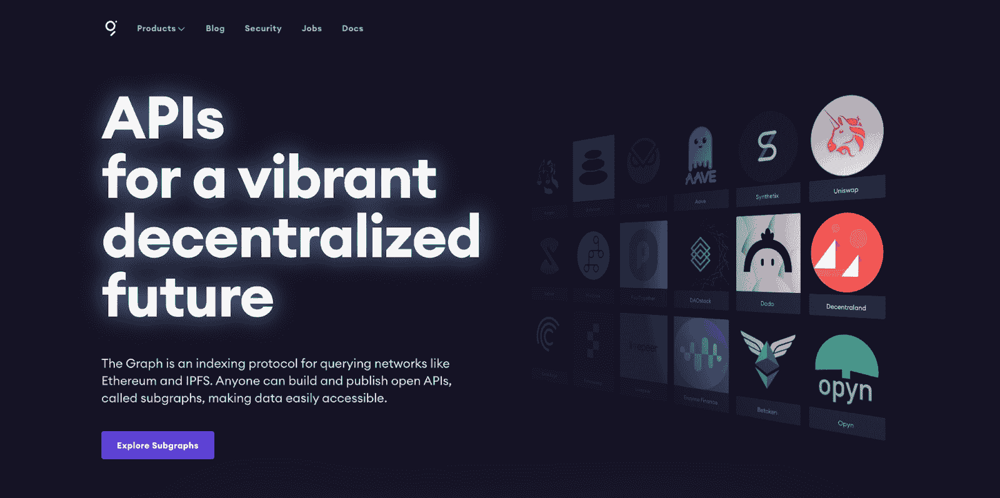

### **网络参与者和激励措施**

该图的网络有代理人，索引器和策展人。这些为 Web3 应用或 dApps 提供数据。此外，这些参与者还提供由 GRT 或图形令牌(ERC-20 令牌)支持的网络服务，作为激励和保护网络的手段。

### **子图清单**

当尝试使用图来索引区块链的过程时，您需要记住一个关键术语:子图清单。这是一组子图描述，引导协议学习如何索引以太坊上的区块链数据。

因此，子图清单将协议指向特定子图感兴趣的智能合同。此外，它还向图形传授了将事件数据与需要存储在其数据库中的数据进行映射的过程。

为了更好地了解子图清单在部署后如何引导数据流，您可以从图的站点查看此模式:

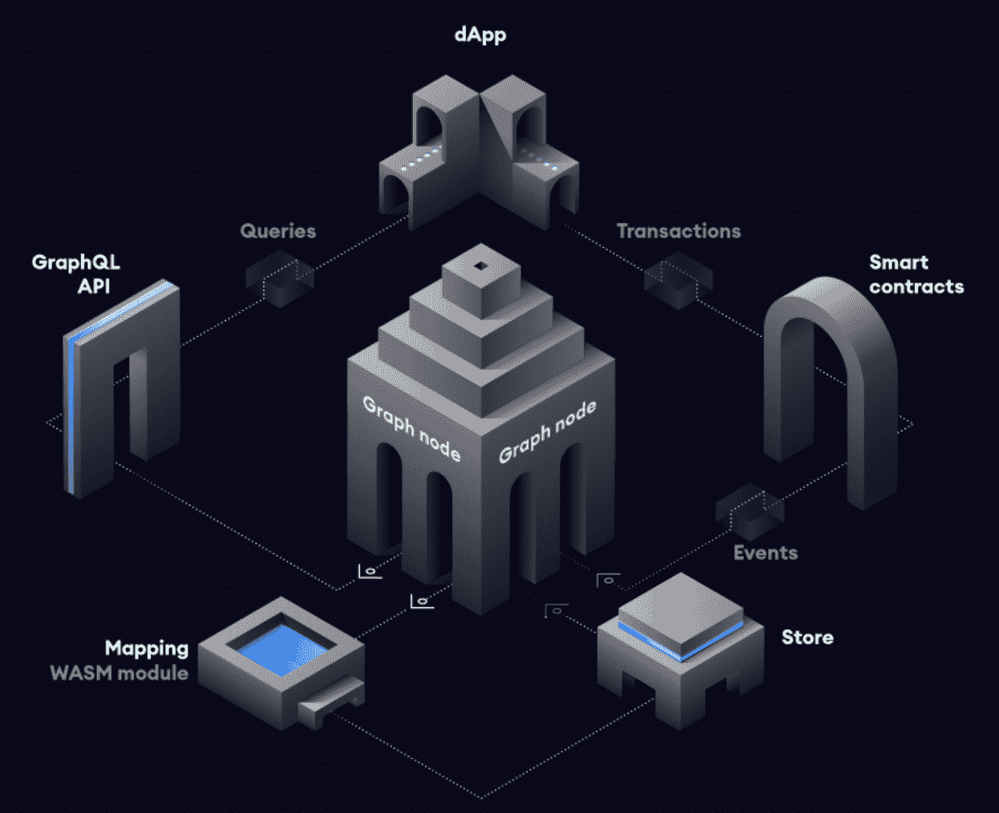

该样本流可总结如下:

*   dApp 使用智能合约交易将其数据贡献给以太坊协议。
*   在进行交易时，智能合约将生成一个或多个事件。
*   图中间的节点不断地扫描以太坊，寻找新的块和它们为子图提供的数据。
*   之后，图的节点在这些块中搜索与特定子图相关的事件。此外，它执行您先前指定的映射处理程序。
*   dApp 利用图的节点的 GraphQL 端点向节点查询从区块链索引的数据。图的节点将这些 GraphQL 查询转换为底层数据存储的 SQL 查询，以检索必要的数据。
*   此后，dApp 现在将数据呈现给最终用户。这是通过一个丰富的 UI 实现的，然后可以在协议中创建新的事务。
*   整个循环重复进行。

## **如何索引区块链演示**

要查看这些步骤是如何在一个实用而简单的轮盘赌赌博演示 dApp 中执行的，请务必查看上面的视频。从头开始适当的介绍。但是，如果您想立即使用该图，请转到 5:38 时间戳。

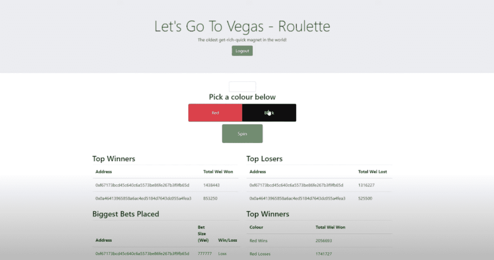

这个演示教你如何在图上创建一个子图。您将经历如何索引区块链的图表过程。这涉及到将智能合约作为简单游戏应用程序(在本例中是一个赌博游戏)的一部分进行部署。在以太坊的 Rinkeby testnet 上创建了一个子图(类似的过程适用于 Ganache 等本地开发链)。之后，您将部署和发布 Rinkeby 子图，并配置子图“yaml”文件、映射和模式。

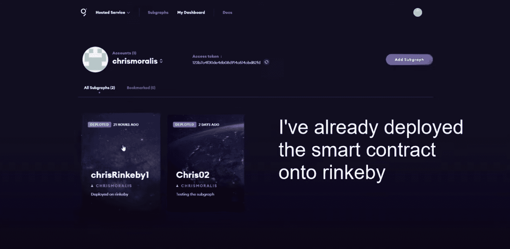

接下来，您将在操场上进行一些查询，以获取以前从智能合约中索引的各种数据。

通过这个演示，您可以对这个过程有一个整体的了解。你可以指出前进道路上的挑战。此外，你将了解到，要让事情完美地运行，需要多次尝试和调整。

### **索引区块链–输出**

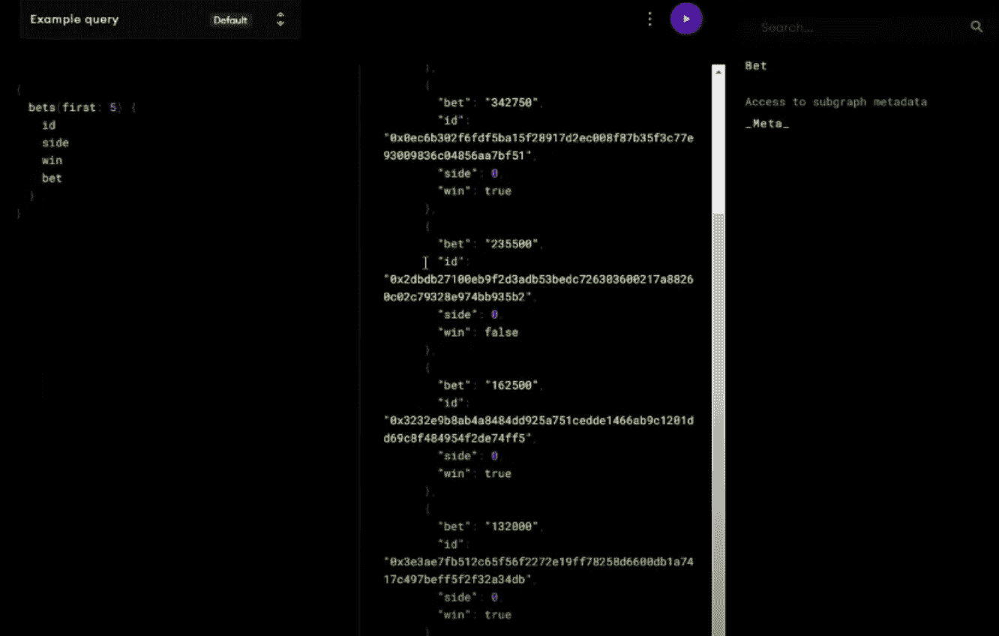

子图输出应类似于上图，其中您可以在区块链上查询智能合同，并从已部署的应用智能合同中获取最后五个结果。

### **将索引的数据拉到前端**

最终，我们的目标是将所有这些方面整合在一起——聚合数据并将它们拉到前端。此外，教程提醒你不断参考 Graph 的网站，以指导你通过细致的过程。此外，如果您想在本地区块链上这样做，步骤也非常相似，并且可以在图表网站上找到说明。

## **更快的索引协议替代方案——Moralis**

在研究如何编制区块链指数时，您可能需要一个更快、更简单的工具来完成工作。Moralis 制定了如何以更简单的格式索引区块链的相同过程，因为它在后端做了大部分繁重的工作。因此，Moralis 成为更快的区块链索引协议，并成为区块链开发者的首选。

#### **以下是利用 Moralis 的步骤:**

#### **步骤 1–在 Moralis 上创建账户**

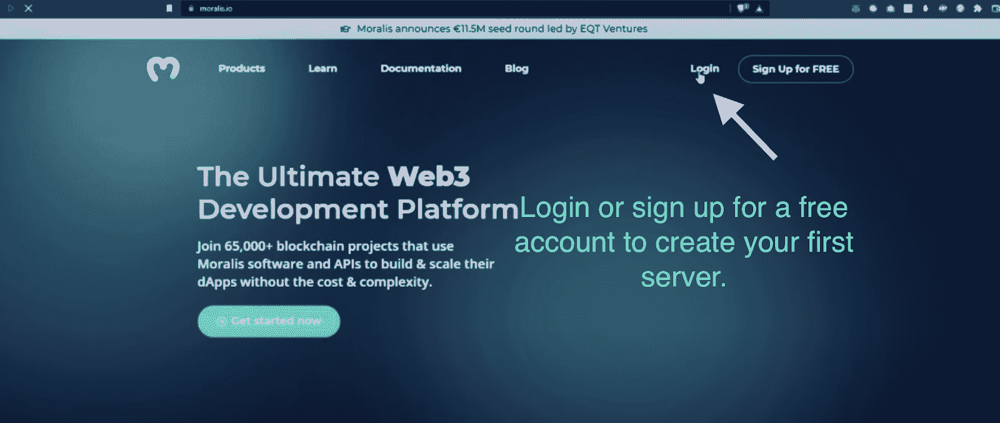

#### **步骤 2–创建新服务器**

注册后，添加一个 Moralis 实例。为此，点击右上角的“+创建新服务器”，并选择“Testnet 服务器”:

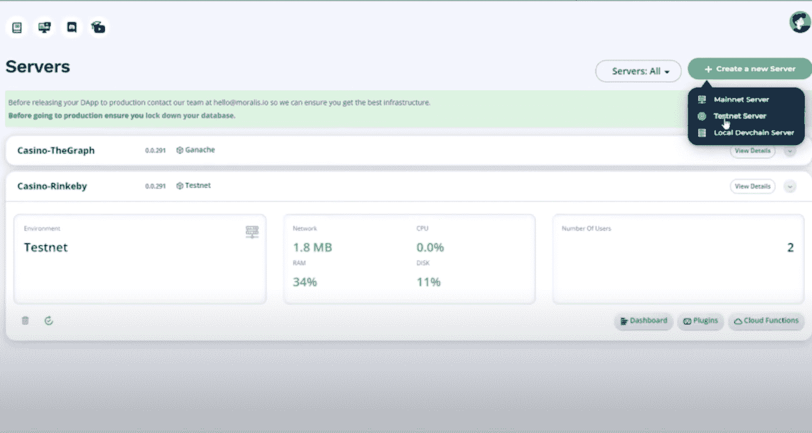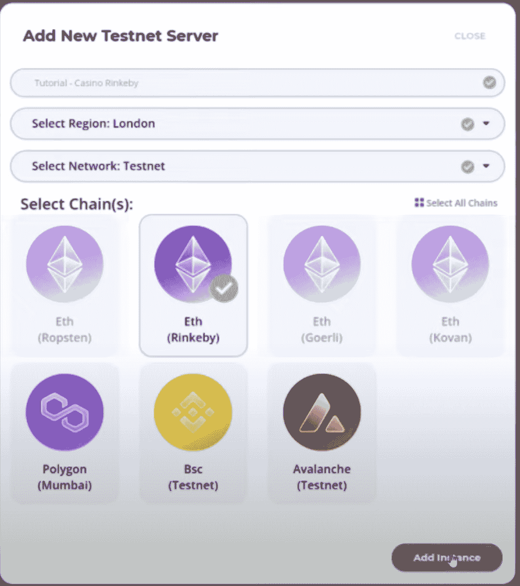

然后，选择“Eth (Rinkeby)”作为您的链，命名服务器，选择您的区域并单击“添加实例”。后者将启动服务器，这需要几分钟时间。

#### **第三步——获取信息**

现在，去 VSC (Visual Studio 代码)。您需要从智能合约中获取必要的信息，比如智能合约地址和“bet”事件。

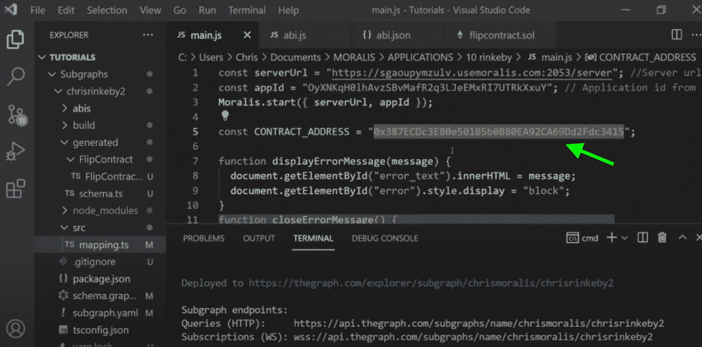

你会在视频的 27:13 找到详细的说明。该视频给出了保留什么信息(例如需要查询的数据类型)、丢弃什么信息以及如何调整代码的指导。用记事本或者类似的东西把代码整理一下，去掉不需要的东西。

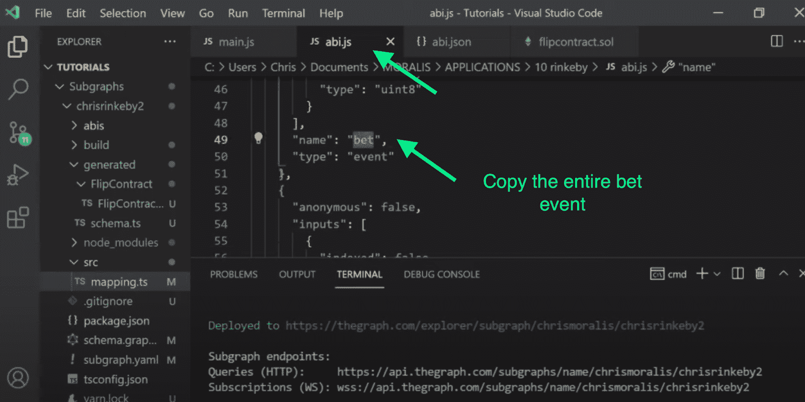

为您的 dApp 获得“下注”事件

接下来，您需要“bet”事件的 ABI。复制 ABI，如下图所示，并将其添加到您的记事本。

#### **第 4 步——回到您的 Moralis 服务器**

点击“查看详情”按钮。因此，您会发现一个包含您的服务器信息的弹出窗口。现在，点击“同步”，然后点击“同步并观看合同事件”:

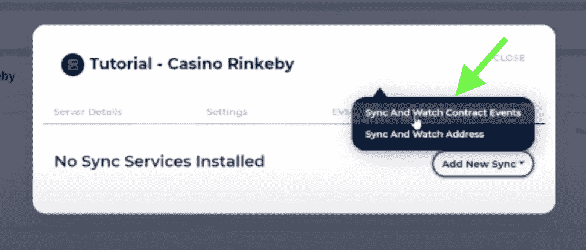

之后，会出现一个弹出窗口，要求您输入一些信息:

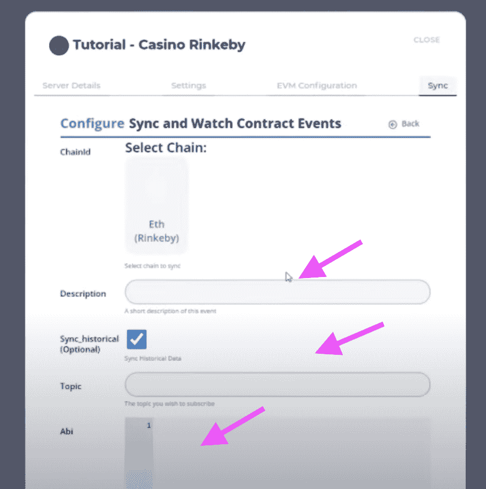

继续填写信息。输入您的描述并选中询问您是否应该同步历史数据的框(是，应该)。在题目下，输入“打赌”事件。粘贴“bet”事件的 ABI，然后添加智能合约地址。最后，向“TableName”部分添加一个名称。在本教程中，我们将“TableName”部分命名为“Spins”。完成后，点击“确认”。

关闭屏幕，转到您的 Moralis 仪表板，您可以通过单击服务器栏下部的“仪表板”按钮来访问该仪表板。

查看仪表盘后，您会发现“Spins”表。如果工作正常，你会发现 Moralis 已经把与你之前输入相关的数据拉进来了。在这种情况下，您会发现下注金额、边数、区块数、赢“布尔”和确认数据(区块是否被开采)。另外，在“用户字符串”一栏中可以找到进行旋转的用户的地址。

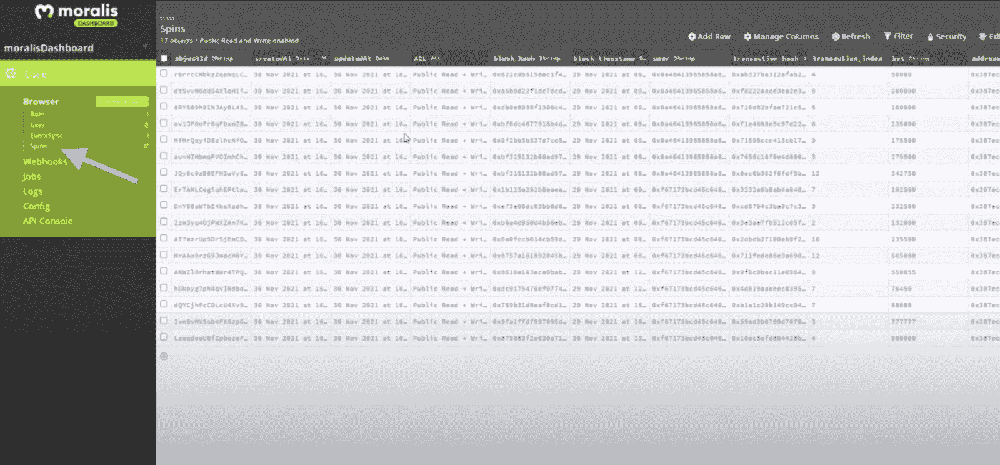

从这里，您可以开始查询数据库中的数据。您现在可以构建一个 dApp 来使用您的服务器的细节。您可以创建一个“index.html”文件，添加一些 JavaScript 来初始化 Moralis，然后使用如下所示的几行代码连接到 Moralis SDK:

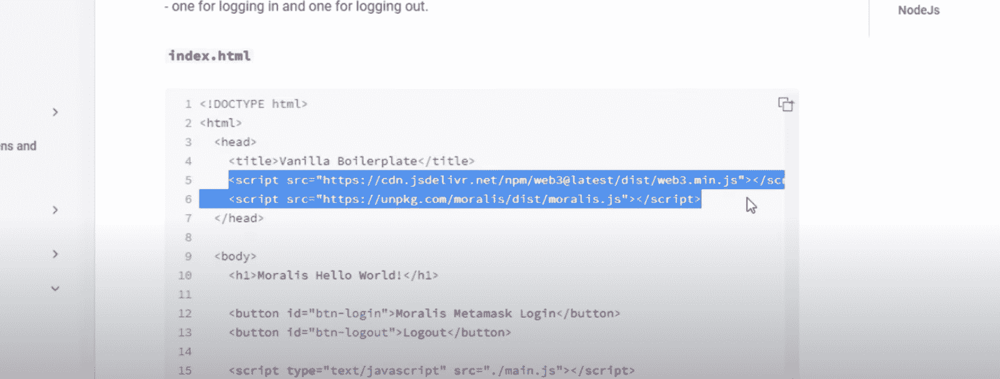

#### **Moralis SDK**

返回“查看详细信息”，获取服务器 URL 和应用程序 ID，并将其添加到您的“index.html”文件中。接下来，您将初始化 Moralis 并添加其功能。右键单击它，并使用 VSC 的实时服务器扩展运行它。视频的 30:43 概述了剩余的步骤，如用户验证和查询。

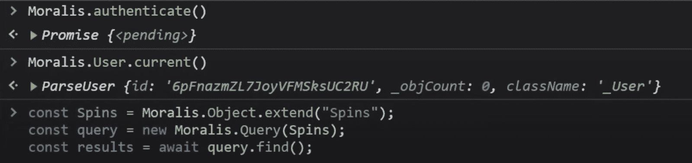

## **如何索引区块链——总结**

在权衡指数化区块链的备选方案时，您必须考虑多个因素。其中包括时间、技能、经验、便利性、dApp 的特性，以及您对智能合约和节点基础设施的熟悉程度。

该图是一个强大而流行的区块链索引平台。它有许多优秀的特性，并允许更多的高度配置和定制的途径。如果你想运行你的服务器和基础设施，它是合适的。然而，设置过程可能会变得相当复杂。此外，对于许多类型的项目来说，这可能是不切实际的。此外，您会发现这个设置对节点的影响非常大，这将导致您从一个节点提供者跳到另一个节点提供者。

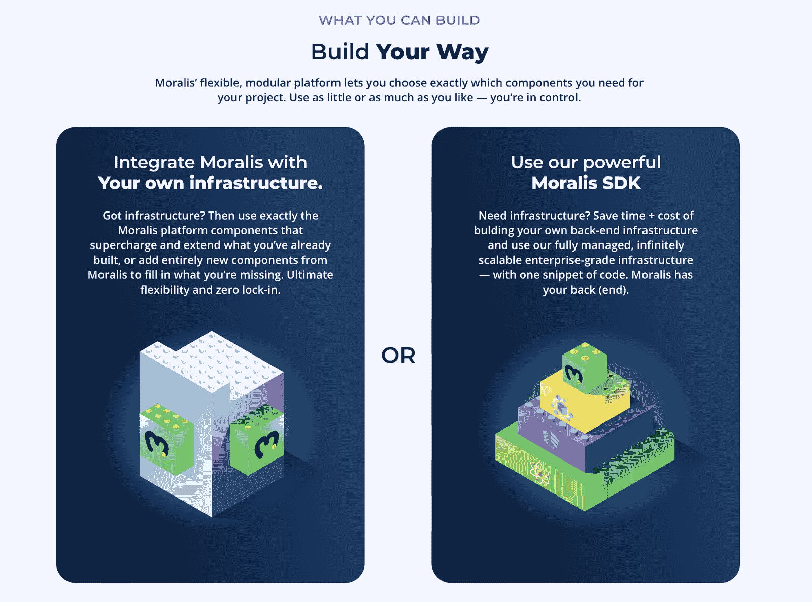

Moralis 是一个更简单、速度更快的替代软件，它拥有强大的 [Web3 SDK](https://moralis.io/exploring-moralis-sdk-the-ultimate-web3-sdk/) ，可以让你用最少的编码和努力做同样的事情。至少，你需要 [JavaScript](https://moralis.io/javascript-explained-what-is-javascript/) 技能。更何况，Moralis 默认是跨链的。它支持多个区块链，如以太坊、BSC(币安智能链)、Polygon、Avalanche 和 Arbitrum，并且它简化了通常需要用于[跨链 dApps](https://moralis.io/how-to-build-cross-chain-dapps/) 的复杂节点设置过程。

Moralis 是从 A 到 B 的最快路线，带领你在几天内从原型到成品。此外，作为最终的 Web3 平台，Moralis 拥有简化区块链索引所需的所有功能。因此，你可以专注于用户和市场相关的方面:建立一个漂亮的前端，并为你的 dApp 抓住先发优势。**