# 如何集成后端 Web3 认证功能

> 原文：<https://moralis.io/how-to-integrate-backend-web3-authentication-functionality/>

**所有** [**分散应用**](https://moralis.io/decentralized-applications-explained-what-are-dapps/) **(dapps)包含的一个必不可少的特性就是认证。因此，作为一名 Web3 开发人员，知道如何集成后端 Web3 认证是关键！此外，随着 Web2 用户体验到传统认证方法的缺点，毫不奇怪的是，MetaMask** **等 Web3 钱包提供商注意到活跃用户的巨大增长。但是，对于许多程序员来说，实现一个用户可以连接他们的** [**首选 Web3 钱包**](https://moralis.io/what-is-a-web3-wallet-web3-wallets-explained/) **并证明他们的** [**Web3 身份**](https://moralis.io/web3-identity-the-full-guide-to-authentication-identity-and-web3/) **的功能是相当具有挑战性的。然而，感谢 Moralis，现在不再是这样了！除了提供**[**Web3 syncs**](https://moralis.io/syncs/)**和不可思议的 Web3 APIs，Moralis 还能让开发者快速集成后端 web 3 认证。更重要的是，Moralis 允许你用单行代码实现 Web3 特性！**

接下来，我们将进行一个示例项目，在这个项目中，我们将使用 Next.js 创建一个简单的 dapp。当然，我们将使用 Moralis 来实现后端 Web3 认证功能。因此，在这一过程中，您将了解所有您需要了解的关于 Next.js 和 Moralis 的知识。然而，在我们动手之前，我们将介绍一些关于我们将在这里使用的工具的基础知识。我们还将看一下我们完成的 Next.js dapp 的快速演示。这样，你就会知道从本教程中可以期待什么，以及在我们前进的过程中你是否想卷起袖子。如果是这样，您还需要[创建您的免费 Moralis 帐户](https://admin.moralis.io/register)来访问 Moralis 的后端 Web3 认证功能。

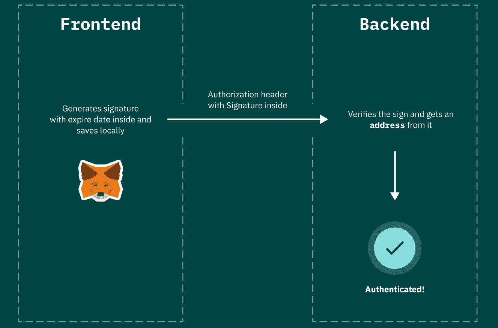

## Moralis 的后端 Web3 认证

那么，是什么让 Moralis 的后端 Web3 认证功能如此独特呢？首先，它在应用程序中统一了 Web3 钱包和 Web2 账户。此外，它使您能够拥有和控制所有用户数据，而不是将这些微妙的信息委托给第三方。此外，Moralis 是兼容任何技术栈。尽管如此，Moralis Web3 Auth API 与 OpenID、OAuth、DIDs 和其他标准兼容。此外，使用该工具只需获得您的 API 密钥。

Moralis 的后端 Web3 身份验证功能面向哪种类型的用户？好吧，它是为所有对用简单的方法构建新的 Web3 应用感兴趣的人准备的。它也适用于希望使用 Web3 身份验证连接现有 Web2 用户数据库的开发人员。此外，Moralis 的后端 Web3 身份验证使您能够将 Auth0 等聚合器用于您的企业 Web3 身份验证流。此外，这个简洁的解决方案还解决了大多数常见的 Web3 身份验证问题。因此，你不需要:

*   了解 Web3 认证流程
*   掌握不同的钱包标准
*   将用户重定向到第三方身份验证界面
*   了解钱包如何签署或验证信息
*   不断更新和维护认证解决方案
*   了解钱包如何在不同的区块链上工作
*   对身份验证解决方案的安全性负责

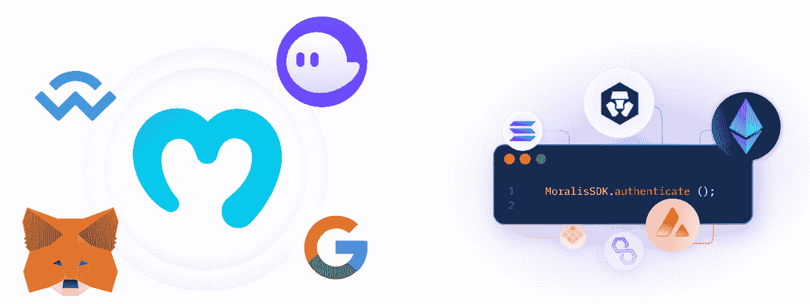

尽管如此，Moralis 也是跨链互操作的。因此，你的目标是所有领先的可编程区块链。因此，这给了你更多的接触和未来证明你的注册流程。所以，如果你想把几个月的工作变成复制粘贴一行代码这样简单的任务，试试 Moralis 的 Web3 认证。有了这个统一的 API，您将很容易涵盖所有的 Web3 身份验证方法。

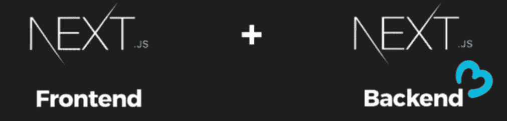

### 为什么要用 Next.js？

如果您以前使用过 JavaScript，您可能对 React 很熟悉。再者，Next.js 很像 React 但是，它使您能够在同一个存储库中创建后端。因此，您可以在一个地方轻松涵盖前端和后端。这意味着您可以将 Moralis 后端功能无缝集成到您的 Next.js 应用程序中。所以，我们要做的就是使用 Next.js 前端向 Next.js 后端发出 post 请求。当然，将由 Moralis 的后端 Web3 认证来处理 Web3 登录。

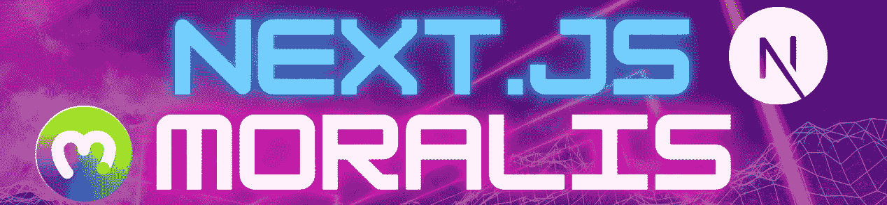

## 如何将后端 Web3 认证功能与 Next.js 和 Moralis 集成

在我们向您展示如何安装一个 starter Next.js 项目之前，让我们仔细看看我们完成的示例 dapp 的演示。看下面的截图，你可以看到我们把事情做得很简单。毕竟，本教程的目的是向您展示后端 Web3 认证功能。因此，要使用元掩码钱包进行身份验证，用户需要点击“通过元掩码进行身份验证”按钮:

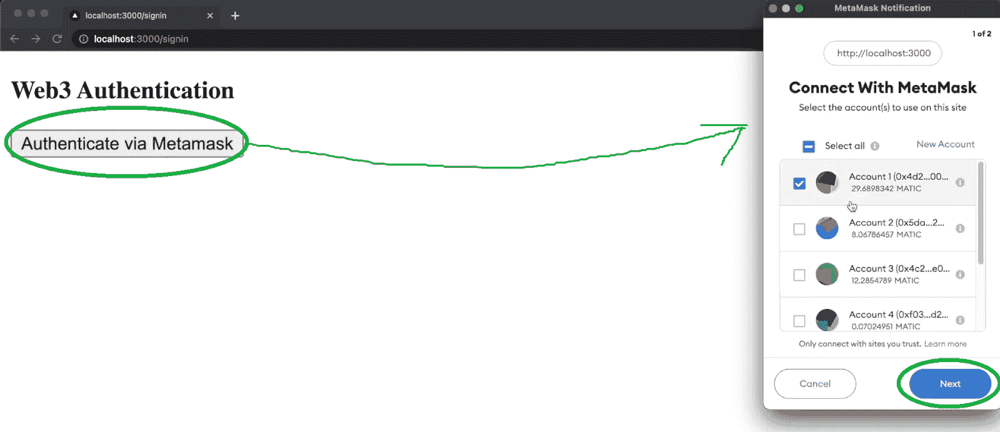

如上图所示，该按钮提示用户的元掩码扩展。首先，用户需要点击“下一步”按钮。第二步，他们需要点击“连接”:

点击“连接”按钮后，MetaMask 弹出一个签名请求。在这里，用户需要单击“Sign”按钮，并最终完成他们的 Web3 身份验证过程:

最后但同样重要的是，我们还编写了示例 dapp，以便在用户通过身份验证后显示某些细节:

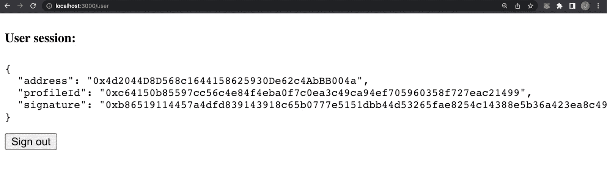

此外，一旦登录，用户可以看到“注销”按钮，使他们能够从我们的 dapp 断开他们的钱包。我们的 dapp 显示的细节包含用户的地址、个人资料 id 和签名散列。然而，重要的是要注意，使用 Moralis 的 SDK 可以让您毫不费力地包含任何链上数据，并进一步发展您的 dapp。

现在，您已经知道了我们将要构建的内容，让我们从头到尾详细介绍一下各个步骤。

### 创建新的 Next.js 项目

我们建议您跟随我们的脚步，打开 Visual Studio 代码(VSC)。在那里，创建“Moralis”文件夹并打开一个新的终端。然后，使用“ *npx create-next-app* ”命令，并将应用程序命名为:

接下来，使用“ *cd web3auth* ”命令导航到上面创建的项目。您还需要安装一些依赖项，所以使用"*NPM install moralis next-auth axios*"命令:

通过安装以上三个依赖项，您将可以访问:

*   Moralis 规范 SDK (" *Moralis 规范*")
*   Next.js 的认证包(" *next-auth* ")
*   从 Next.js 前端向 Next.js 后端发出请求(" *axios* ")

此外，您还需要一个 Web3 库来访问 Web3 功能，例如浏览器中的集成钱包。为此，我们可以使用“ *wagmi* ”和“*醚*”包:

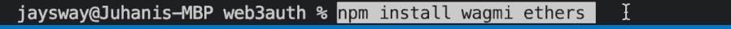

上面的命令还结束了我们的依赖项设置。因此，现在您可以查看上面创建的 Next.js 项目中的文件:

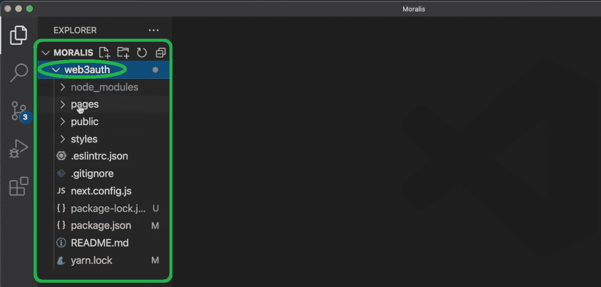

看上面的截图，你应该会看到“页面”文件夹。后者包含我们今后将重点关注的所有重要文件:

此外,“api”文件夹包含所有与后端相关的信息。另一方面，“_app.js”和“index.js”文件是应用程序的前端。

### Next.js 前端和后端之间的通信

要查看我们的 Next.js 前端如何与我们的 Next.js 后端通信，请打开“index.js”文件并删除除最外面的 div 之外的所有内容。然后，将“ *Get Name* 按钮添加到该 div:

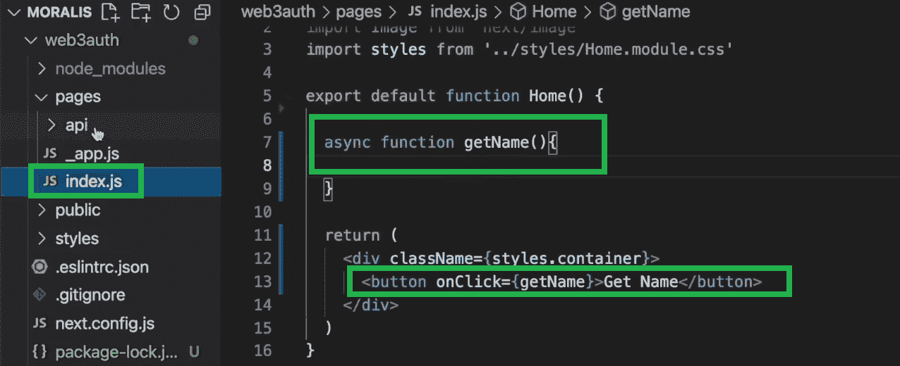

此外，还要确保添加“ *getName* ”异步函数。后者将调用“hello.js”文件并在控制台记录输出:

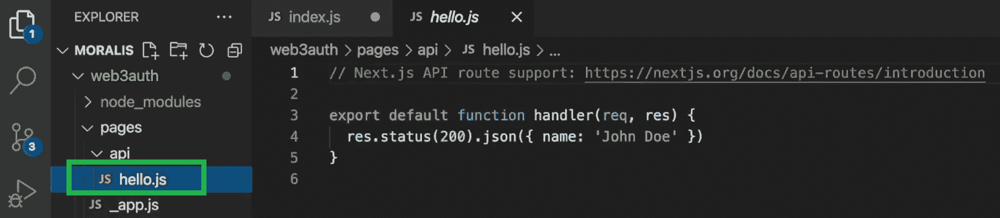

回到" index.js "文件中，通过添加'*从" axios"'* 行代码导入" *axios"* 。此外，还要确保定义响应并在控制台记录它:

要在您的“ *localhost:3000* ”中查看上面的代码，请使用“ *npm run dev* ”命令。*更多细节，请看下面的视频，从 4:49 开始。*现在你已经知道如何使用 Next.js，是时候创建上面给出的例子 dapp 了。因此，您将可以使用 Next.js 和 Moralis 的后端 Web3 认证功能。

## 简单的前端到后端 Web3 身份验证功能

在本节中，您将学习为我们的示例 dapp 创建简单的前端。为此，您将使用“_app.js”文件。此外，您将从 Moralis 文档中的“[使用元掩码](https://docs.moralis.io/docs/sign-in-with-metamask)登录”页面复制大部分代码。因此，首先用第四步中的代码替换“_app.js”文件中的现有内容。只需使用“复制”图标:

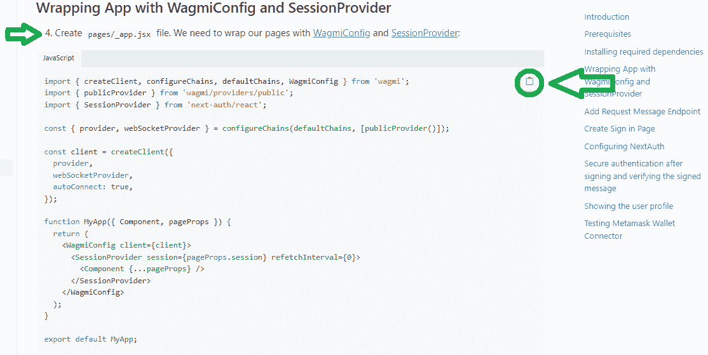

然后返回到“_app.js”文件，粘贴上面复制的代码:

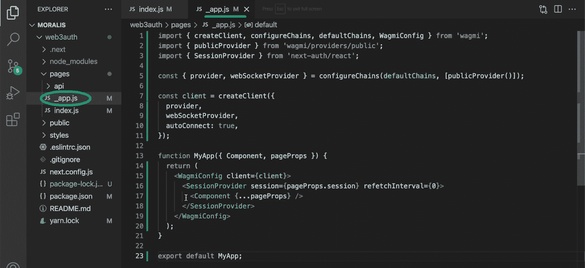

接下来，您将创建另外两个页面。首先，创建“登录”页面，这将是允许用户登录的页面。粘贴上述文档页面中的代码，步骤七:

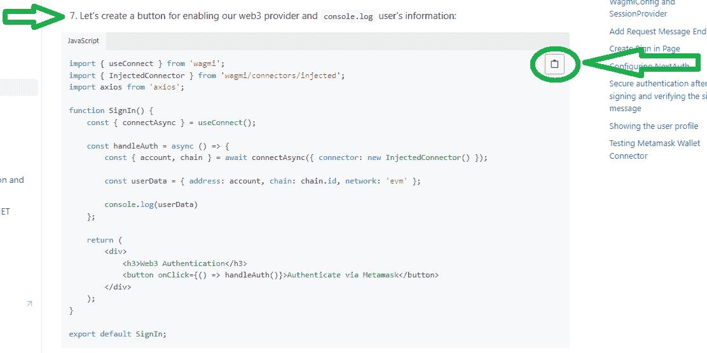

我们前端的另一个页面是“用户”页面。这是用户登录后将被重定向到的页面。再次使用上面链接的 Moralis 文档页面，复制步骤 11 中的代码:

*注意* *:要获得更详细的代码演练，请使用本文末尾的视频，从 5:50 开始。*

## 实现后端 Web3 身份验证功能

有了简单的前端页面，是时候构建一个合适的后端逻辑了。本质上，我们需要请求 Moralis 向我们发送一个登录消息。然后，在用户签署消息后，我们还需要使用 Moralis 来验证该登录消息。此外，在成功验证之后，我们的后端需要创建一个经过身份验证的用户，其详细信息将显示在“用户”页面上。

首先转到 Visual Studio 代码中的“api”文件夹，删除“hello.js”文件。然后，在“api”文件夹中创建一个名为“auth”的新文件夹。另外，确保在“web3auth”文件夹中创建“. env.local”文件:

有关环境变量的更多详细信息，请使用上述文档页面上的第三步。查看上面的变量，您可以看到这是您需要粘贴 Moralis Web3 API 密钥的地方。要获得它，你需要创建你的免费 Moralis 帐户。然后，点击 Moralis 管理区右上角的个人资料图标(下图中的“1”)。接下来，点击“账户设置”。进入“帐户设置”页面后，选择“密钥”选项卡，在这里您可以复制您的 Web3 API 密钥:

最后，不要忘记将 API 密匙粘贴到“. evn.local”文件的指定行中。

### 创建我们的后端文件

现在，导航到上面创建的“auth”文件，并创建“request-message.js”文件。同样，不需要键入代码；只需使用上面的文档页面并复制第五步中的代码:

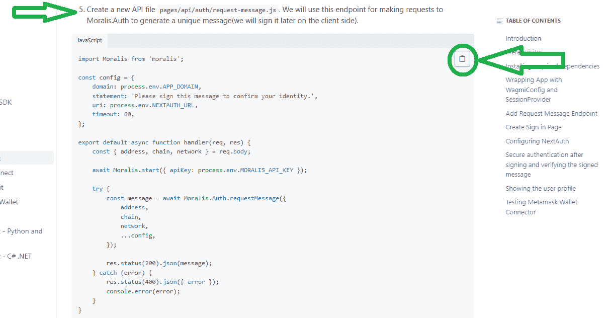

为了匹配我们演示中的消息，请更改“请签署此消息以确认您的身份。”对“web3 auth”的声明:

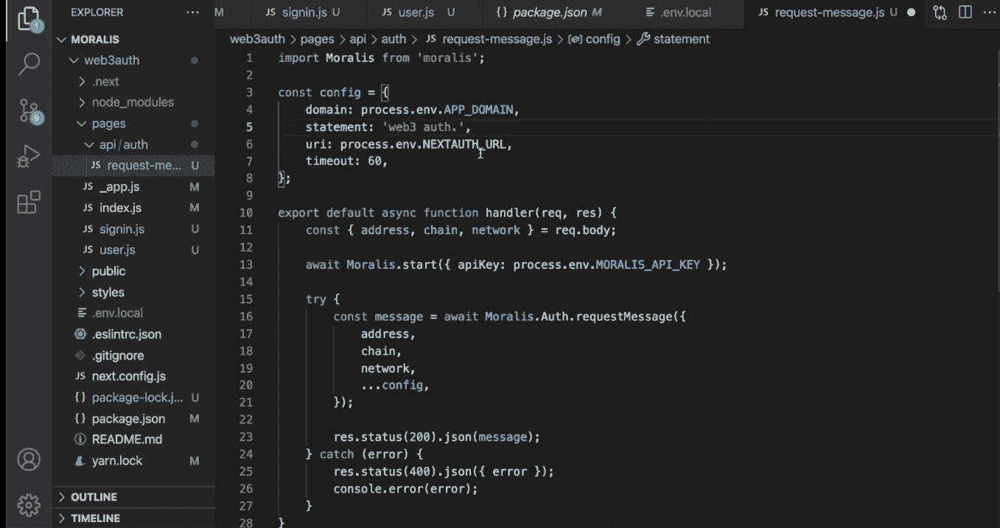

*注意* *:要获得详细的代码演练，请使用下面的视频，从 11:00 开始。*

尽管如此，我们需要创建另一个端点，在用户签署初始消息后对用户进行身份验证。为此，创建“[…nextauth]。js”文件，并粘贴来自同一个 Moralis 文档页面的代码(第九步):

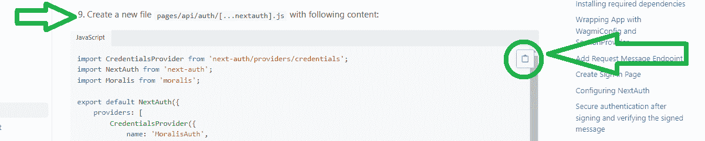

最后，您需要返回到“signin.js”文件，并添加对上面创建的端点的调用，这是我们后端 Web3 身份验证功能的重要部分。为了尽可能简单明了，选择整个内容，并用文档页面中的代码行替换它(步骤十):

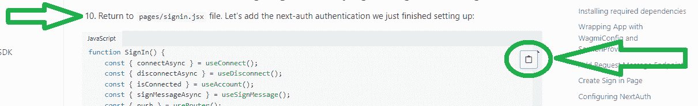

有了这最后一部分，您就可以运行我们的示例 dapp 的实例了，它应该像上面介绍的那样工作。最后但同样重要的是，这是我们在整篇文章中引用的视频教程:

https://www.youtube.com/watch?v=hhkWQPorBKQ

## 如何集成后端 Web3 身份验证功能—总结

今天，您有机会学习如何使用开源 web 开发框架 Next.js 来创建一个简单的 dapp。多亏了 Next.js，您能够为应用程序的前端和后端使用同一个存储库。您还了解了如何毫不费力地集成后端 Web3 身份验证功能。多亏了免费的 Moralis Web3 Auth API，后者才成为可能。你所需要做的就是创建你的免费 Moralis 账户并获得你的 Web3 API 密匙。当然，你也学会了怎么做。最终，您学会了如何创建一个简单的 dapp，它可以作为进入 Web3 领域的网关。现在，由您来添加更高级的 Web3 功能。

然而，如果你还没有自己的想法，我们鼓励你通过完成其他示例项目来建立你的技能和信心。你可以在[Moralis 博客](https://moralis.io/blog/)和[Moralis YouTube 频道](https://www.youtube.com/c/MoralisWeb3)上找到大量精彩的教程。此外，这两个渠道可以作为您的免费持续区块链发展教育。不过，如果你渴望以专业的方式将你的后端 Web3 认证技能提升到另一个水平，那么报名参加[Moralis 学院](https://academy.moralis.io/)可能是适合你的正确途径。除了个性化的学习路径和顶级加密课程，这是加入最令人难以置信的加密社区之一的地方。当然，这也是成为区块链认证和全职加密早不宜迟的地方。

