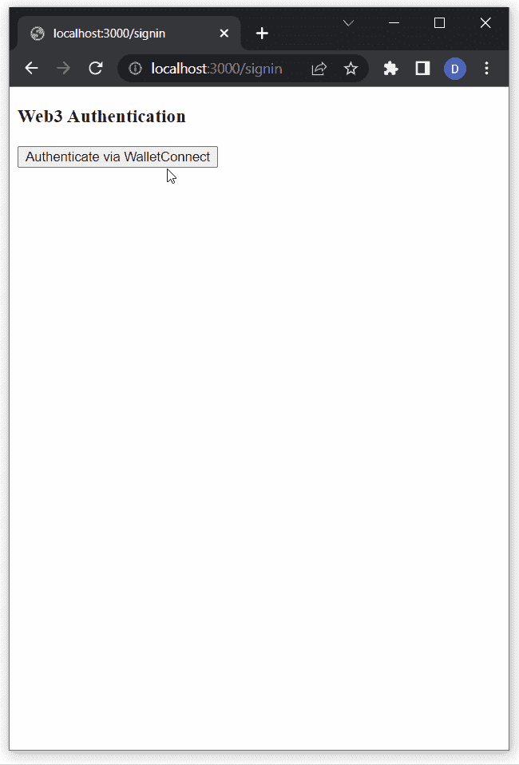
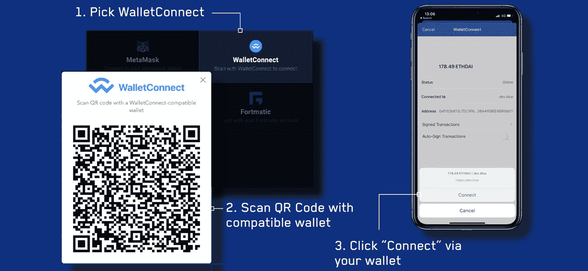
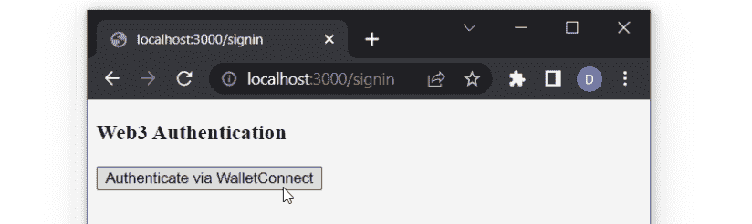
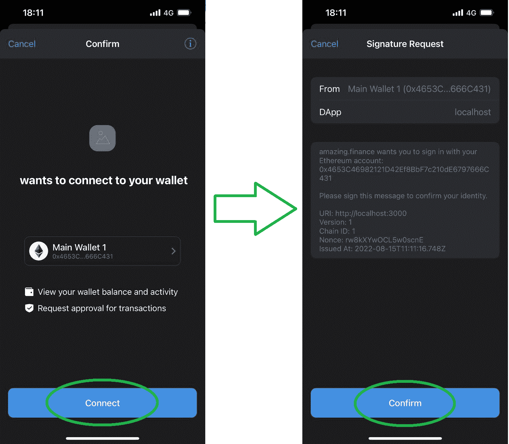
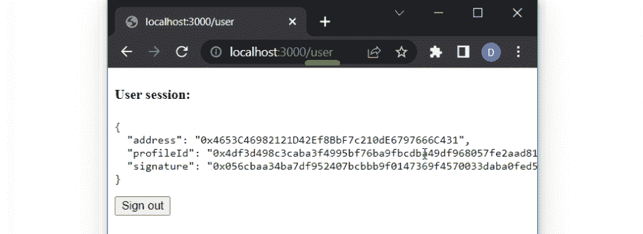
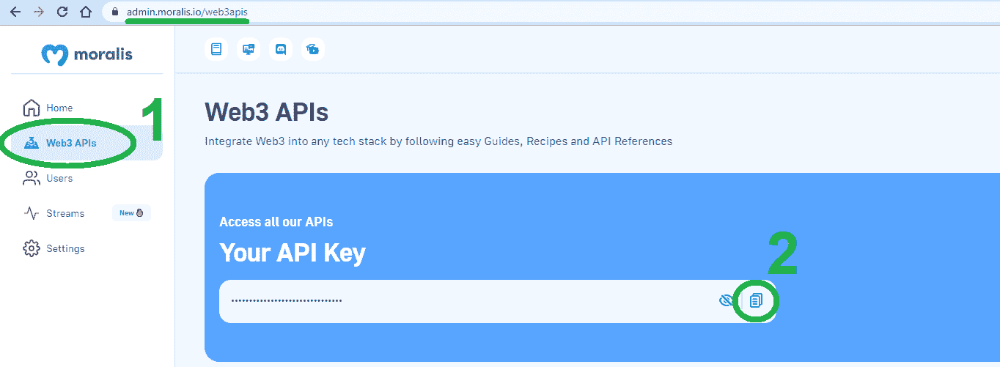
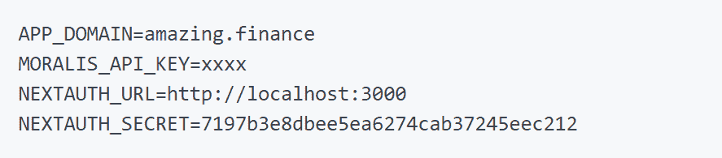

# 如何整合 WalletConnect 模态和二维码

> 原文：<https://moralis.io/how-to-integrate-the-walletconnect-modal-and-qr-code/>

在本文中，我们将使用 NextJS 和 Moralis 的 Web3 Auth API 来集成 WalletConnect 模态和二维码。遵循本文中的步骤，您可以在 dapp 上运行以下身份验证序列:



对于那些已经熟悉 NextJS 和 Moralis 的 API 的人来说，可以随意访问文档页面立即开始。尽管如此，如果你想要一个免费的教程来指导你完成这个过程，并学习如何集成 WalletConnect 二维码模式，请继续阅读！

[**Documentation to Sign In with WalletConnect**](https://docs.moralis.io/docs/sign-in-with-walletconnect)

### 概观

从用户的角度来看，当一个网站或应用程序提供使用简单的二维码扫描登录的能力时，这是非常方便的。由于这种便利吸引了许多用户，所以看到越来越多的网站和应用程序集成二维码功能就不足为奇了。此外，这种类型的认证不仅在传统应用中很流行，在分散应用(dapps)中也很流行。要将这种类型的 [Web3 身份验证](https://moralis.io/authentication/)添加到您的 dapps 中，您应该关注 WalletConnect。幸运的是，这正是本文所关注的。更具体地说，本文探讨了如何集成 WalletConnect 模态和二维码！

接下来，你将有机会跟随我们的领导，使用 NextJS 和 [Moralis](https://moralis.io/) 创建一个简单的 dapp。毕竟，正是 Moralis Web3 Auth API 使您能够毫不费力地将 WalletConnect 模型集成到任何 dapp 中。虽然我们在这里将重点关注使用 NextJS 框架，但值得指出的是，Moralis 是完全跨平台互操作的。因此，您可以使用各种遗留开发平台和编程语言，使用 WalletConnect QR code 模式创建 dapps。因此，Moralis 有助于弥合 Web2 和 Web3 之间的发展差距。除了终极的 Web3 认证 API，Moralis 还提供了最好的 EVM 和索拉纳 API。其中包括 [NFT API](https://moralis.io/nft-api/) 、[令牌 API](https://moralis.io/token-api/) 和[流 API](https://moralis.io/streams/) 。此外，您可以在所有领先的区块链网络上使用这些优秀的工具。

然而，在我们向您展示如何构建一个包含 WalletConnect 模型的简单 NextJS dapp 之前，我们需要让您了解一下速度。因此，我们将首先探索 WalletConnect 的开源协议，并看看它的用途。也就是说，现在就创建你的[免费 Moralis 账户](https://admin.moralis.io/register)，确保为今天文章的行动部分做好准备。


## 探索 WalletConnect 的开源协议

你仍然可以听到人们说 WalletConnect 是一个加密钱包。然而，这并不完全准确。WalletConnect 是一种开源协议，在加密钱包和分散应用程序(dapps)之间建立安全连接。这种开源协议通过两个对等体之间的共享密钥使用对称加密，这使它成为最安全的 Web3 身份验证方法之一。

你也可以认为 WalletConnect 是一个分散的 Web3 消息层，是连接区块链钱包和 dapps 的标准。此外，值得指出的是，WalletConnect 的团队努力不断扩展该协议的互操作性。因此，我们可以期待 WalletConnect 未来的高质量和可靠性。作为一名 dapp 开发者，你不会想忽视 WalletConnect 支持的 Web3 钱包和 dapp 的关键基础设施。它通过确保正确实施以下核心概念来实现这一目标:

*   **不可知链**–wallet connect 相信加密领域的多链未来。因此，WalletConnect 团队专注于支持所有领先的连锁店。这些包括以太坊，索拉纳，以及其他许多。为了确保采用与连锁无关的方法，WalletConnect 致力于不断增加对新兴知名连锁的支持。

*   **多链**–wallet connect 的用户可以将任何支持的钱包同时连接到多个链。

*   **平台不可知**–除了支持不同的链，WalletConnect 还支持不同的平台。因此，WalletConnect 模式服务于 web、桌面、移动和游戏 dapps。



### WalletConnect 是用来做什么的？

上面的解释应该阐明 WalletConnect 模式在 Web3 钱包和 dapps 之间建立了安全连接。因此，让我们来探索这个过程是什么样子的。首先，值得指出的是，WalletConnect 为用户提供了两种建立连接的方式。一方面，用户可以通过用他们的移动 Web3 钱包扫描二维码来做到这一点——这是一种更加用户友好的方法，并且是默认提供的。另一方面，用户也可以使用深度链接，这对于没有手机钱包的用户来说特别方便。

然而，这两种方法都让一个对等体(dapp)发出一个代码或链接。然后，由对方(加密钱包)来扫描或批准连接。通过这种方法，包含 WalletConnect 模式和 QR 码的 dapps 使用户能够轻松建立安全可靠的 Web3 连接。

此外，WalletConnect 令人印象深刻的钱包支持范围使这一协议非常实用。毕竟，几乎不可能找到不支持的钱包。此外，WalletConnect 官方网站目前表示，他们的解决方案适用于 170 多个加密钱包。如果你想了解 Web3 钱包 WalletConnect 支持什么，请访问 WalletConnect 的官方网站，向下滚动到“寻找钱包？”部分，并点击“查看所有钱包”按钮:


以上按钮将带您进入“探索”页面。在那里，您可以看到所有支持的钱包:


值得指出的是，有十六页(整整十五页)，每页十五个钱包(见上面的截图)。因此，如果我们做简单的计算，很明显 WalletConnect 已经支持超过 225 个 Web3 钱包。

## WalletConnect 模式–如何集成 WalletConnect 二维码模式

有了这些基础知识，是时候用 WalletConnect 二维码模型构建一个简单的 dapp 了。如果你记得，我们将使用 NextJS 和 Moralis 来完成今天的壮举。因此，Moralis 的 Auth API 的强大功能使得集成 WalletConnect 模型变得非常简单。接下来，我们将带您完成在您的本地服务器上完成一个简单的 dapp 所需的所有步骤。


此外，我们将为您提供所有代码行。因此，您可以简单地将内容复制并粘贴到所需脚本的实例中。如果你决定完成今天的挑战，以下是你需要创建的文件列表:

*   "**. env . local**"–在这个文件中，您将存储所有的本地变量，包括您的 Moralis Web3 API 密钥。
*   "**_ app . jsx**"–您将使用这个文件用" *WagmiConfig* "和" *SessionProvider* "来包装您的应用程序。
*   "**request-message . js**"–这个文件将作为一个端点，用于请求生成一个唯一的消息。
*   "**sign in . jsx**"–您将使用该文件创建“登录”页面。因此，该文件将包含连接器，该连接器将使用户能够使用 WalletConnect QR code 模式验证自己。
*   " **[…nextauth]。js**"–这是您将用来配置 NextAuth 的文件。
*   "**user . jsx**"–您将使用该文件创建“用户”页面，成功通过身份验证的用户将登录该页面。出于本教程的考虑，它将包含一些基本的用户信息。

然而，在您动手之前，我们也想确保您确切地知道您将构建什么。因此，让我们快速演示一下我们的示例 dapp。

### 我们的示例 NextJS Dapp 演示

以下截图显示了客户端“签名”页面的要点:



如你所见，有“Web3 认证”标题和“通过 WalletConnect 认证”按钮。因此，对于用户来说，点击将触发 WalletConnect 模式的按钮是非常直观的:


用户可以使用他们的移动钱包扫描上述二维码，并在移动设备上确认他们的身份验证:



上图显示的是信任钱包上的确认；然而，其他加密钱包的过程是相似的。

最后，一旦用户将他们的钱包连接到我们的 dapp，他们就会进入“用户”页面。后者显示与连接的配置文件相关的一些基本数据:



### 入门——next js Dapp 的先决条件和初始设置

在完成初始设置之前，请确保做好以下准备:

*   创建你的 Moralis 账户。
*   安装和设置 Visual Studio 代码(VSC)。
*   创建一个 NextJS 应用程序。使用 NextJS 文档中的“创建下一个应用程序”页面，或者如果您在该步骤中需要帮助，请完成我们的“[使用 NextJS](https://docs.moralis.io/docs/nextjs-dapp) ”教程。

具备了上述先决条件，您就可以安装所需的依赖项了。因此，您可以使用以下命令之一(取决于您的软件包管理器)来安装 Moralis、NextAuth 和 Axios:

```js
npm install moralis next-auth axios
```

```js
yarn add moralis next-auth axios
```

```js
pnpm add moralis next-auth axios
```

此外，您还需要使用以下命令之一安装 wagmi Web3 库:

```js
npm install wagmi ethers
```

```js
yarn add wagmi ethers
```

```js
pnpm add wagmi ethers
```

接下来，在应用程序的根目录下创建一个“. env.local”文件，并用所需的环境变量填充它:

*   "**APP _ DOMAIN**"–请求签名的 RFC 4501 DNS 机构。
*   "**MORALIS _ API _ KEY**"-您使用 MORALIS 的途径。您可以在 Moralis 管理区获得 API 密钥:



*   "**next auth _ URL**"–您的应用地址。在开发阶段，你要用“ *http://localhost:3000* 或者类似的。
*   "**next auth _ SECRET**"–将加密用户的 JWT 令牌的变量。您可以在这里使用任何值，或者在“【https://generate-secret.now.sh/32】T3”生成一个值。

尽管如此，看一下这个例子，它将帮助您更好地理解上述环境变量:



*注意* *:请记住，无论何时修改“. env.local”文件，都需要重新启动 dapp。*

#### 覆盖 next js“App”组件

NextJS 使用“App”组件来初始化页面，您可以覆盖它来控制页面初始化。为此，用“ *WagmiConfig* ”和“ *SessionProvider* ”来包装您的页面。因此，在“pages”文件夹中创建“_app.jsx”文件。然后，使用以下代码行填充该文件:

```js
import { createClient, configureChains, defaultChains, WagmiConfig } from 'wagmi';
import { publicProvider } from 'wagmi/providers/public';
import { SessionProvider } from 'next-auth/react';

const { provider, webSocketProvider } = configureChains(defaultChains, [publicProvider()]);

const client = createClient({
  provider,
  webSocketProvider,
  autoConnect: true,
});

function MyApp({ Component, pageProps }) {
  return (
    <WagmiConfig client={client}>
      <SessionProvider session={pageProps.session} refetchInterval={0}>
        <Component {...pageProps} />
      </SessionProvider>
    </WagmiConfig>
  );
}

export default MyApp;
```

#### 创建“*请求消息*”端点

通过创建一个新的 API 文件并将其命名为“request-message.js”来开始这一步。确保在“auth”文件夹中创建该文件。后者应该在“pages/api”里面。此外，该端点将向" *Moralis 发出请求。Auth* ”来生成唯一的消息。稍后，您需要在客户端对该消息进行签名。下面是您需要复制粘贴到“request-message.js”中的代码行:

```js
import Moralis from 'moralis';

const config = {
    domain: process.env.APP_DOMAIN,
    statement: 'Please sign this message to confirm your identity.',
    uri: process.env.NEXTAUTH_URL,
    timeout: 60,
};

export default async function handler(req, res) {
    const { address, chain, network } = req.body;

    await Moralis.start({ apiKey: process.env.MORALIS_API_KEY });

    try {
        const message = await Moralis.Auth.requestMessage({
            address,
            chain,
            network,
            ...config,
        });

        res.status(200).json(message);
    } catch (error) {
        res.status(400).json({ error });
        console.error(error);
    }
}
```

### 使用 WalletConnect 模式创建登录页面

完成初始设置并准备好“_app.jsx”和“request-message.js”文件后，就可以集成 WalletConnect 了。首先在“pages”文件夹中创建“signin.jsx”文件。一旦您按照我们的说明填充该文件，它将作为一个新页面。首先，输入以下内容:

```js
function SignIn() {
    return (
        <div>
            <h3>Web3 Authentication</h3>
        </div>
    );
}

export default SignIn;
```

继续，您需要创建“通过 WalletConnect 验证”按钮，如上面的演示所示。而且，就目前而言，还有“ *console.log* ”用户的详细资料。您将通过更新您的“signin.jsx”文件来实现这两个目标，如下所示:

```js
import { useConnect } from 'wagmi';
import { InjectedConnector } from 'wagmi/connectors/injected';
import axios from 'axios';

function SignIn() {
    const { connectAsync } = useConnect();

    const handleAuth = async () => {
        const { account, chain } = await connectAsync({ connector: new InjectedConnector() });

        const userData = { address: account, chain: chain.id, network: 'evm' };

        console.log(userData)
    };

    return (
        <div>
            <h3>Web3 Authentication</h3>
            <button onClick={() => handleAuth()}>Authenticate via WalletConnect</button>
        </div>
    );
}

export default SignIn;
```

#### 扩展“ *handleAuth* ”功能

有了上面几行代码，您已经拥有了 Web3 身份验证页面的外观。因此，是时候添加实际的 Web3 功能了。因此，从扩展“ *handleAuth* ”功能开始。您将使用后者来调用之前创建的“ *requestMessage* ”端点。因此，更新“signin.jsx”脚本以匹配下面的代码行:

```js
import { useAccount, useConnect, useSignMessage, useDisconnect } from 'wagmi';
import { InjectedConnector } from 'wagmi/connectors/injected';
import axios from 'axios';

function SignIn() {
    const { connectAsync } = useConnect();
    const { disconnectAsync } = useDisconnect();
    const { isConnected } = useAccount();
    const { signMessageAsync } = useSignMessage();

    const handleAuth = async () => {
        // Disconnects the Web3 provider if it's already active
        if (isConnected) {
            await disconnectAsync();
        }
        // Enabling WalletConnect
               const { account, chain } = await connectAsync({
            connector: new WalletConnectConnector({
                options: {
                    qrcode: true,
                },
            }),
        });

        const userData = { address: account, chain: chain.id, network: 'evm' };
        // Making a post request to our 'request-message' endpoint
        const { data } = await axios.post('/api/auth/request-message', userData, {
            headers: {
                'Content-Type': 'application/json',
            },
        });
        const message = data.message;
        const signature = await signMessageAsync({ message });

        console.log(signature)
    };

    return (
        <div>
            <h3>Web3 Authentication</h3>
            <button onClick={() => handleAuth()}>Authenticate via WalletConnect</button>
        </div>
    );
}

export default SignIn;
```

#### 配置 NextAuth

为了正确配置 NextAuth，请创建“[…nextauth]。js”文件。另外，确保该文件位于“auth”文件夹中(路径:“pages/api/auth/”)。然后，将以下代码添加到该文件中:

```js
import CredentialsProvider from 'next-auth/providers/credentials';
import NextAuth from 'next-auth';
import Moralis from 'moralis';

export default NextAuth({
    providers: [
        CredentialsProvider({
            name: 'MoralisAuth',
            credentials: {
                message: {
                    label: 'Message',
                    type: 'text',
                    placeholder: '0x0',
                },
                signature: {
                    label: 'Signature',
                    type: 'text',
                    placeholder: '0x0',
                },
            },
              async authorize(credentials) {
                try {
                  // "message" and "signature" are needed for authorization
                  // We described them in "credentials" above
                  const { message, signature } = credentials;

                  await Moralis.start({ apiKey: process.env.MORALIS_API_KEY });

                  const { address, profileId } = (
                    await Moralis.Auth.verify({ message, signature, network: 'evm' })
                  ).raw;

                  const user = { address, profileId, signature };
                  // Returning the user object and creating  a session
                  return user;
                } catch (e) {
                  console.error(e);
                  return null;
                }
              },
        }),
    ],
    // Adding user info to the user session object
    callbacks: {
        async jwt({ token, user }) {
            user && (token.user = user);
            return token;
        },
        async session({ session, token }) {
            session.user = token.user;
            return session;
        },
    },
});
```

#### 使用 WalletConnect 进行安全认证

至于对“signin.jsx”文件的最后调整，您需要为它配备 NextAuth 身份验证。此外，您还将从 wagmi 导入“ *WalletConnectConnector* ，从 Next 导入“ *useRouter* ”。此外，下面几行代码也将适当扩展“*签到*功能:

```js
import { signIn } from 'next-auth/react';
import { useAccount, useConnect, useSignMessage, useDisconnect } from 'wagmi';
import { useRouter } from 'next/router';
import axios from 'axios';
import { WalletConnectConnector } from 'wagmi/connectors/walletConnect';

function SignIn() {
    const { connectAsync } = useConnect();
    const { disconnectAsync } = useDisconnect();
    const { isConnected } = useAccount();
    const { signMessageAsync } = useSignMessage();
    const { push } = useRouter();

    const handleAuth = async () => {
        if (isConnected) {
            await disconnectAsync();
        }
        // Added WalletConnectConnector
        const { account, chain } = await connectAsync({
            connector: new WalletConnectConnector({
                options: {
                    qrcode: true,
                },
            }),
        });

        const userData = { address: account, chain: chain.id, network: 'evm' };

        const { data } = await axios.post('/api/auth/request-message', userData, {
            headers: {
                'Content-Type': 'application/json',
            },
        });

        const message = data.message;

        const signature = await signMessageAsync({ message });

        // Redirect user after success authentication to '/user' page
        const { url } = await signIn('credentials', { message, signature, redirect: false, callbackUrl: '/user' });
        /**
         * instead of using signIn(..., redirect: "/user")
         * we get the url from callback and push it to the router to avoid page refreshing
         */
        push(url);
    };

    return (
        <div>
            <h3>Web3 Authentication</h3>
            <button onClick={() => handleAuth()}>Authenticate via WalletConnect</button>
        </div>
    );
}

export default SignIn;
```

### 添加用户页面

在上面的步骤中，您已经完成了“登录”页面。然而，如果您还记得上面的演示，我们的示例 dapp 也有“用户”页面。因此，重新访问“pages”文件夹并创建一个新文件——“user . jsx”。使用以下代码行确保该页面显示一些基本的用户信息，并提供“注销”按钮:

```js
import { getSession, signOut } from 'next-auth/react';

// Gets a prop from getServerSideProps
function User({ user }) {
    return (
        <div>
            <h4>User session:</h4>
            <pre>{JSON.stringify(user, null, 2)}</pre>
            <button onClick={() => signOut({ redirect: '/signin' })}>Sign out</button>
        </div>
    );
}

export async function getServerSideProps(context) {
    const session = await getSession(context);

    // Redirect if not authenticated
    if (!session) {
        return {
            redirect: {
                destination: '/signin',
                permanent: false,
            },
        };
    }

    return {
        props: { user: session.user },
    };
}

export default User;
```

“用户”页面是今天谜题的最后一块。因此，您现在已经成功地用 WalletConnect QR code 模型创建了一个简单的 NextJS dapp。既然您能够简单地复制我们的代码，那么一切都应该是有序的。但是，我们仍然鼓励您测试您的 dapp。

### 测试 WalletConnect 二维码模式

假设您对“ *NEXTAUTH_URL* ”变量使用了“ *3000* ”端口(按照指示)，使用您的浏览器转到“*http://localhost:3000/sign in*”。这样，您将进入 dapp 的“登录”页面，在这里您可以测试身份验证过程。基本上，您需要完成上面演示中的所有步骤。因此，首先点击“通过 WalletConnect 进行身份验证”:


尽管如此，如果 WalletConnect 二维码模式运行正常，您应该进入“用户”页面(“*http://localhost:3000/user*”)。但是，如果您无法验证自己，上述代码会将您重定向回“签名”页面。如果发生这种情况，请确保重新检查上述步骤。

## 如何整合 WalletConnect 模式和二维码–总结

你现在知道 WalletConnect 是一个开源协议，旨在建立 Web3 钱包和 dapps 之间的安全连接。在本文中，您还了解到它支持多个连锁店的 225 个以上的钱包。此外，您有机会跟随我们的领导，使用 WalletConnect 模型创建自己的 NextJS dapp。为了使这个过程尽可能顺利，我们为您提供了完成这个挑战所需的所有脚本。因此，您创建了以下六个文件，其中包含所有必需的代码行:

*   " . env.local "
*   " _app.jsx "
*   " request-message.js "
*   " signin.jsx "
*   “[…nextauth]。js "
*   " user.jsx "

展望未来，我们鼓励您通过添加额外的 Web3 功能来处理今天的示例 dapp。这样，你会更好地了解 Moralis 的 Web3 API 的强大功能，反过来，也会建立起处理其他项目的信心。作为学习过程的一部分，我们建议您浏览 [Moralis 文档](https://docs.moralis.io/)中的其他操作指南和教程。此外，确保使用 [Moralis YouTube 频道](https://www.youtube.com/c/MoralisWeb3)和 [Moralis 博客](https://moralis.io/blog/)来拓展你在区块链的发展视野。例如，在我们的一些最新文章中，我们专注于为区块链开发者提供的 [Web3 JS 教程](https://moralis.io/web3-js-tutorial-for-blockchain-developers/)，构建一个 Unity [Web3 多人游戏](https://moralis.io/how-to-build-a-web3-multiplayer-game-using-unity-multiplayer/)，解释 [Dogechain](https://moralis.io/build-with-dogecoin-on-evm-what-is-dogechain/) ， [Aptos](https://moralis.io/what-is-aptos-full-guide-to-the-aptos-blockchain/) 和 [Sui](https://moralis.io/what-is-sui-blockchain-the-ultimate-guide/) chains，终极[区块链科技栈](https://moralis.io/the-ultimate-blockchain-tech-stack-guide/)等等。

另一方面，你可能渴望尽快成为全职加密员。如果是这样的话，你应该报名参加[Moralis 学院](https://academy.moralis.io/)并获得区块链认证。这将大大提高你获得梦想中的加密工作的机会。有许多课程可供选择；然而，我们建议从[区块链和比特币基本面](https://academy.moralis.io/courses/blockchain-bitcoin-101)开始。