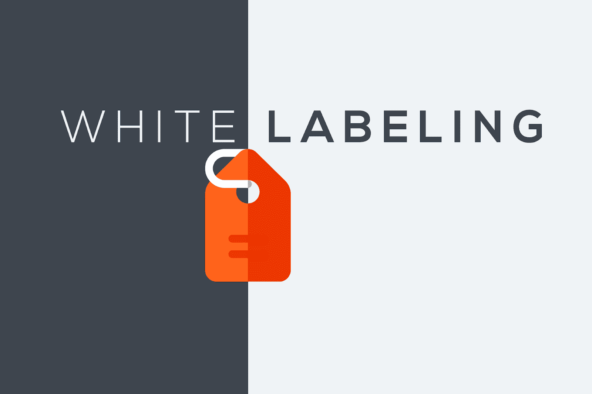
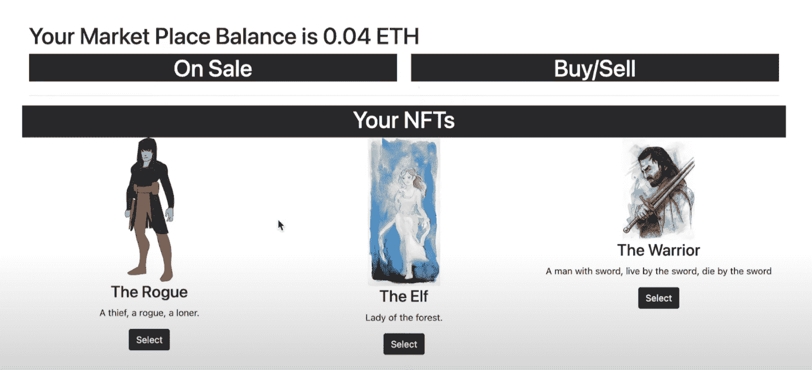
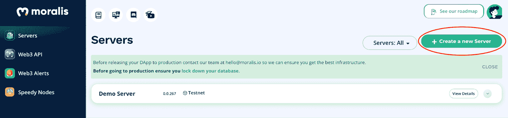
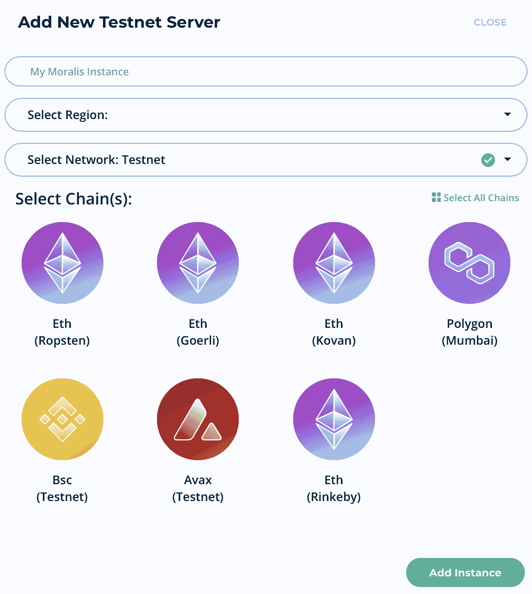
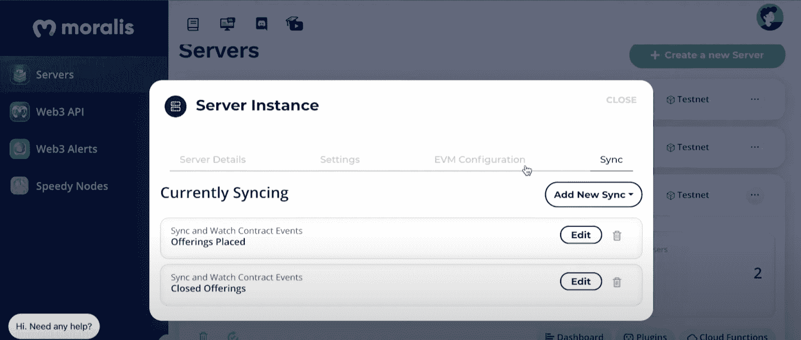
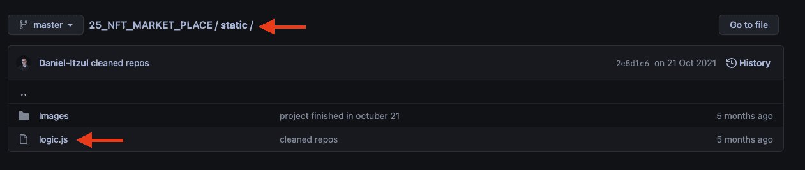

# 如何推出白色标签的 NFT 市场

> 原文：<https://moralis.io/how-to-launch-a-white-label-nft-marketplace/>

在本文中，我们将向您展示如何推出您自己的白色标签 NFT 市场。但是，如果您愿意，您可以跳过教程，通过访问下面的 GitHub 库直接进入代码:

**完整的白牌 NFT 市场文档:**[](https://github.com/DanielMoralisSamples/25_NFT_MARKET_PLACE)

****随着对 [NFTs](https://moralis.io/non-fungible-tokens-explained-what-are-nfts/) (不可替代代币)的日益关注，现在比以往任何时候都更有必要深入研究 NFT 市场，了解更多关于它们所包含的内容。NFT 市场是数字艺术家和开发者向大众展示他们作品的地方。此外，随着平台在市场上积累和展示艺术品，潜在买家更容易接触到它。因此，由于 NFT 趋势比以往任何时候都更热，我们将在此与 [Moralis](https://moralis.io/) 一起深入探讨推出白色标签 NFT 市场的过程。****

****如果没有合适的工具，创建一个白色标签的 NFT 市场——或者任何一个 [Web3](https://moralis.io/the-ultimate-guide-to-web3-what-is-web3/) 应用程序——可能是一个相对乏味的任务，尤其是如果你是区块链开发领域的新手。然而，如果你使用 Moralis，你将能够以高达 87%的平均效率削减所有未来区块链项目的开发过程！****

****[Moralis Speedy Nodes](https://moralis.io/speedy-nodes/) 、 [NFT API](https://moralis.io/ultimate-nft-api-exploring-moralis-nft-api/) 和 [Price API](https://moralis.io/introducing-the-moralis-price-api/) 只是可以帮助你开发的工具的几个例子。此外，广泛的 Moralis 工具包与平台的后端基础设施相结合，为您提供了市场上最好的开发人员体验。事实上，随着操作系统的使用，我们将能够立即推出一个白色标签的 NFT 市场！****

****所以，如果你是一个有抱负的区块链开发者，马上注册 Moralis 吧！加入该平台是免费的，您将立即获得该平台所有有用的开发工具。****

## ****什么是白标 NFT 市场？****

****在深入研究启动白牌 NFT 市场的过程之前，我们应该仔细看看白牌 NFT 市场需要什么。为了充分理解这一点，一个好的起点是定义和解开“白标”产品/服务的概念。那么,“白色标签”这个术语到底是什么意思呢？****

****

术语“白标”表示产品/服务是通用的，意味着它们没有品牌或公司名称。因此，任何人都可以将他们的标识应用到产品/服务中，并以他们的名义销售。因此，白标产品/服务是由第三方生产并销售给没有任何品牌的企业。反过来，这家企业也以自己的名义品牌化和销售产品/服务。通过这个简单的解释，你有望知道什么是白标产品/服务。现在，让我们仔细看看 NFT 的市场。

NFT 市场的含义可以有很大的不同。这是因为人们可以列出、出售和购买 NFT 的任何应用程序或平台都可以被视为 NFT 市场。为此，市场上有许多不同的变体。因此，在启动你的市场时，你可以发挥你的创造力，并根据你的喜好调整平台。

现在，随着对术语“白标”和什么是 NFT 市场有了更好的理解，我们可以结合这些概念来理解什么是 NFT 白标市场。简而言之，它们本质上是通用平台，任何人都可以用自己的公司名称/品牌发布。

### 白色标签 NFT 市场的优势

白标 NFT 市场的主要优势是在开发过程中的可及性。由于这些乍一看完全是通用平台，它们变得容易开发，并且您将能够在几分钟内完成。此外，有了 Moralis，这个过程变得更加容易，因为您可以利用已经开发的后端基础设施。因此，您可以避免“重新发明轮子”,因为平台会处理大部分繁重的工作。


此外，即使白标产品是通用的，它们也是进一步定制的良好基础。通过快速简单的开发过程，您可以减轻大部分工作量，这将使您更加重视设计引人注目的用户界面(UI)和用户体验(UX)。如果你想了解更多关于 Web3 UI 设计的知识，一定要看看我们关于 [Moralis 的 Web3UI 工具包](https://moralis.io/web3ui-kit-the-ultimate-web3-user-interface-kit/)的文章。

推出白标 NFT 市场也提供了高度的灵活性，尤其是在与 Moralis 合作时。利用操作系统的工具，您可以轻松定制和实现新功能。因此，您可以确保该平台适合您的目标市场，并包含您需要的功能，同时排除不必要的噱头。

最后，白标软件产品是经过良好测试的。反过来，在启动白标 NFT 市场时，你也不需要担心程序错误和其他开发问题。

随着对什么是白牌 NFT 市场以及推出这样一个平台的优势有了更好的理解，我们可以继续本文的主要部分，围绕推出 NFT 市场。

## 如何推出白色标签的 NFT 市场

这是本文的中心部分，我们将向您展示如何启动一个白色标签的 NFT 市场。然而，在我们开始这个过程的实际编码部分之前，我们想向您展示一个应用程序的例子，让您了解我们正在努力的方向。因此，这就是 NFT 市场最终确定后的样子:



从上面的截图可以看出，这里有三个不同的部分:“出售”、“购买/出售”和“您的 NFTs”。“出售”部分将显示市场上所有可供购买的非功能性食物。但是，在这种情况下，没有待售的商品。

“购买/出售”部分将显示用户选择的 NFT。如果选择了一个项目，它将转移到此字段，这将允许用户购买或出售令牌。最后，最后一部分是“您的 NFTs”，它只是显示用户的 NFTs。这意味着该平台具备直接通过市场展示、选择、销售和购买非功能性食品的功能。

所以，现在我们知道我们的目标是什么，我们可以继续前进，仔细看看这个过程。此外，我们将把流程分为以下三个部分:

1.  设置 Moralis 服务器
2.  创建智能合同
3.  创建 dApp

按照上面提到的步骤，你将能够在几分钟内启动一个白色标签的 NFT 市场。然而，如果你更愿意观看视频指南，更详细地解释整个过程，请查看以下来自 [Moralis YouTube](https://www.youtube.com/channel/UCgWS9Q3P5AxCWyQLT2kQhBw) 频道的教程:

https://www.youtube.com/watch?v=EMOYpgl5S1w

尽管如此，让我们从仔细研究如何设置 Moralis 服务器开始本教程吧！

## 第 1 部分:设置 Moralis 服务器

你必须做的第一件事是注册 Moralis。创建一个账户是完全免费的，只需要几秒钟。有了您的帐户，您可以通过点击 Moralis 管理面板顶部的“+创建新服务器”来创建 Moralis 服务器。这将为您提供一个包含三个选项的下拉菜单。在这种情况下，因为这是一个教程，我们选择了一个 testnet 服务器。



一旦你点击了 testnet 选项，你需要命名实例，选择一个区域，并选择链。完成所有字段后，您可以通过单击右下角的“Add Instance”按钮来启动服务器。服务器启动可能需要一段时间；不过，不用担心，服务器会很快启动。



随着服务器的启动和运行，Moralis 允许您采取几种不同的行动。例如，您可以添加同步事件，这将在本教程中进行。这些事件将是注册特定智能合约事件的两个侦听器。其中一个同步事件监听新报价何时发出，另一个事件检测报价何时关闭。这些侦听器持续活跃，确保 dApp 知道何时有人出售令牌或何时有人购买 NFT。



创建 Moralis 服务器时，还会提供一个保存用户详细信息的数据库。您可以通过单击相关服务器的“Dashboard”按钮来访问数据库。控制面板显示的信息包括令牌余额、交易历史记录、NFT 等。此外，服务器的监听器也填充这些数据，确保数据库的信息是最新的。

## 第 2 部分:创建智能合同

启动白标 NFT 市场的下一步是创建一份智能合同。如果你对[智能合同](https://moralis.io/smart-contracts-explained-what-are-smart-contracts/)不熟悉，我们推荐你阅读我们关于[如何创建智能合同](https://moralis.io/how-to-create-smart-contracts/)的文章中的这个主题。然而，在本教程中，我们将利用这个项目的 GitHub 资源库中已经准备好的名为“[市场](https://github.com/DanielMoralisSamples/25_NFT_MARKET_PLACE/blob/master/contracts/market_place.sol)”的智能契约。这意味着你并不真的需要太多聪明的合同经验，但是一些[扎实](https://moralis.io/solidity-explained-what-is-solidity/)的技能会有帮助。


为了理解智能合约，我们需要更仔细地研究代码中包含的事件。该契约由四个事件组成:“OfferingPlaced()”、“OfferingClosed()”、“balance retracted()”和“OperatorChanged()”。因此，合同代码看起来是这样的:

```js
contract MarketPlace{
    event OfferingPlaced(bytes32 indexed offeringId, address indexed hostContract, address indexed offerer, uint tokenId, uint price, string uri);
    event OfferingClosed(bytes32 indexed offeringId, address indexed buyer);
    event BalanceWithdrawn (address indexed beneficiary, uint amount);
    event OperatorChanged (address previousOperator, address newOperator);
}
```

代码的其他部分确保这些事件被充分覆盖。因此，这确保了用户只能出售他们拥有的 NFT，而买家只能购买待售的物品。

由于我们为您提供了合同的完整代码，您可以从存储库中复制粘贴该合同，并将其用于您自己的 NFT 白标市场。

现在我们有了一个智能合约，它涵盖了允许 dApp 代表用户进行 NFT 交易的基本功能，我们可以继续对实际的市场进行编码了。

## 第 3 部分:创建 dApp

在教程的这一部分，我们将仔细看看三个主要文件:“ [logic.js](https://github.com/DanielMoralisSamples/25_NFT_MARKET_PLACE/blob/master/static/logic.js) ”、“ [cloudCode.js](https://github.com/DanielMoralisSamples/25_NFT_MARKET_PLACE/blob/master/moralis_cloud_code/cloudCode.js) ”和“【index.html】T4”，它们都可以在 GitHub 资源库中找到。“index.html”文件包含用于构建市场内容的 html 代码。在这里您可以找到按钮、字段等的代码。我们不会深入研究这个文件，因为代码可以在 GitHub 上找到，如何设计 UI 应该取决于您的偏好。

dApp 的主要文件是“logic.js”，我们将把大部分注意力放在这个文件上。该文件确保市场配备了用户与应用程序交互所需的必要功能。而且，这是一个 [JavaScript](https://moralis.io/javascript-explained-what-is-javascript/) 文件。因此，如果您精通 JavaScript，分析代码就不会有问题。



然而，如果你想了解更多关于区块链开发和重要编程语言的知识，请查看我们的“[区块链开发最佳语言](https://moralis.io/best-languages-for-blockchain-development-full-tutorial/)”文章。

尽管如此，我们在“logic.js”文件中需要注意的第一件事是初始化 Moralis。为此，您需要从服务器获取应用程序 ID 和服务器 URL。您可以通过单击服务器上的“查看详细信息”按钮来获取这些信息。然后，您可以将它复制粘贴到文件中，看起来应该是这样的:

```js
Moralis.initialize(""); // Application ID from moralis.io
Moralis.serverURL = ""; // Server URL from moralis.io
```

### Moralis 认证()

接下来，我们有一个名为“Moralis.authenticate()”的基本函数。您可以看到下面的函数，这确保了当用户验证他们自己时，所有正确的函数都被执行:

```js
Moralis.authenticate().then(function(){
    populateNFTs();
    populateOfferings();
    populateBalance();
    subscribeOfferings();
    subscribeBuys();
    subscribeUpdateNFTs();
});
```

剩下的代码确保所有的“填充”和“订阅”函数获得正确的数据。除此之外，代码还确保所有数据都整齐地显示给用户。最后，Moralis 通过从 Moralis 仪表板获取数据的代码片段来处理所有繁重的后端工作。这些代码片段包括以下内容:

```js
Moralis.Query(“PlacedOfferings”)
Moralis.Query(“ClosedOfferings”)
Moralis.Query(“PolygonNFTOwners”)
Moralis.Cloud.run(“getBalance”, params)
Moralis.Units.FromWei(presentBalance)
Moralis.Cloud.run(“placeOffering”, params)
Moralis.Units.ETH(offering.price)
```

### Moralis。Cloud.run("placeOffering "，params)

上面提到的最重要的功能之一是“Moralis”。Cloud.run("placeOffering "，params)"。该函数具有一些额外的意义，因此值得特别关注，因为该函数确保 dApp 在后台签署事务并保护所有私钥。而且，这也是“云”的所在。Code.js”文件进入等式。在这个文件中，您需要添加对应于您正在使用的以太坊地址的私钥。

现在，这基本上是本教程如何启动一个白色标签 NFT 市场！

但是，如果您正在寻找更详细的代码分解，请仔细查看我们在本文前面链接的视频。您可以跳到 6:35，这是代码演练开始的地方。

此外，如果您对 NFTs 有进一步的兴趣，您可能会对开发自己的令牌感兴趣。如果是这样的话，一定要仔细看看我们关于如何创建自己的 NFT 的指南！

## 如何启动白标 NFT 市场–总结

通过遵循本文中的上述步骤，您将能够轻松快速地启动一个白色标签的 NFT 市场。你所需要做的就是创建一个 Moralis 服务器，编写一个智能契约，并创建 [dApp](https://moralis.io/decentralized-applications-explained-what-are-dapps/) 本身。此外，一旦你有了白牌 NFT 市场，你就可以随心所欲地给它打上品牌。您还可以根据自己的喜好对通用产品进行快速调整以进行定制，从而在市场中获得竞争优势。

由于 Moralis 操作系统的工具和后端基础设施，这一切都是可能的。您真正需要的是精通 JavaScript 来完成前端开发，剩下的就交给 Moralis 了。此外，出于这个原因，Moralis 不仅适用于推出白牌 NFT 市场，也适用于其他类似的区块链项目。

因此，如果你有雄心加快你的 [Web3 开发](https://moralis.io/how-to-build-decentralized-apps-dapps-quickly-and-easily/)游戏，查看[Moralis 博客](https://moralis.io/blog/)获得更多令人难以置信的内容。在这里，你可以阅读[如何建立一个 Web3 MMORPG](https://moralis.io/build-a-web3-mmorpg-with-unity-in-10-minutes/) 、[如何建立一个 Web3 亚马逊市场](https://moralis.io/how-to-build-a-web3-amazon-marketplace/)、[如何建立一个中世纪的元宇宙游戏](https://moralis.io/how-to-build-a-medieval-metaverse-game/)等等。

因此，如果你对区块链发展感兴趣，请务必今天就[向 Moralis 家](https://admin.moralis.io/register)报名！创建一个帐户只需要几秒钟，你就可以立即使用该平台的所有工具。因此，加入 Moralis 将为您未来所有的区块链项目提供更便捷的开发流程！****