# 如何启动 NFT 市场

> 原文：<https://moralis.io/how-to-launch-an-nft-marketplace/>

不可替代的代币，对于任何对在区块链建造 dApps 的人来说都是一个热门话题。具体来说，学习如何创建和启动 NFT 市场应该会让那些想开始学习 NFT 令牌开发的人感兴趣。此外，由于我们几乎没有触及这一新区块链运动的表面，所以现在是探索 NFT 及其区块链用例的最佳时机。因此，任何有抱负的 [**区块链开发者**](https://moralis.io/how-to-become-a-blockchain-developer/) **都应该通过学习 NFTs 的基础知识立即开始。但是，假设你已经知道了基础知识，包括** [**如何生成不可替代令牌**](https://moralis.io/nft-generate-and-mint-how-to-generate-non-fungible-tokens/) **。在这种情况下，你会更加欣赏这个指南，因为我们将探索如何推出一个 Moralis NFT 市场。**

NFT 市场为数字艺术创造了曝光率。此外，它们与大品牌和大公司相关。几个世界顶级的 NFT 市场已经推出了独家品牌和公司所有的内容。因此，掌握如何启动 NFT 市场或 NFT 商店是一项非常重要的 Web3 技能，可以促进你作为开发人员的职业生涯。借助当今市场上最全面的 [Web3](https://moralis.io/the-ultimate-guide-to-web3-what-is-web3/?utm_source=blog&utm_medium=post&utm_campaign=How%2520to%2520Create%2520an%2520NFT%2520Marketplace) 开发工具 Moralis，学习如何[创建一个 NFT 市场](https://moralis.io/how-to-create-an-nft-marketplace/)成为一个简化且明显更快的过程。

尽管目前 NFT 市场价值数十亿美元，但这仍为时尚早。鉴于 NFT 的许多应用扩展到游戏、其他类型的房地产、艺术和金融产品，那些在[区块链发展](https://moralis.io/best-languages-for-blockchain-development-full-tutorial/)工作的人仍然可以利用他们的 NFT 技能。此外，一个巨大的机会正等待着新的 [NFT 游戏](https://moralis.io/what-are-nft-games-and-how-to-make-nft-games/)的创作者或那些推出 NFT 市场以吸引新观众的人。

# 启动 NFT 市场-初始步骤

要学习如何在 NFT 市场或 NFT 开店，你需要了解非正规商店的基本原理。此外，你必须掌握当今以太坊使用的领先的 NFT 标准， [ERC-721](https://moralis.io/erc-721-token-standard-how-to-transfer-erc721-tokens/?utm_source=blog&utm_medium=post&utm_campaign=NFT%2520Generate%2520and%2520Mint%2520%25E2%2580%2593%2520How%2520to%2520Generate%2520Non-Fungible%2520Tokens) 和 [ERC-1155](https://moralis.io/erc1155-exploring-the-erc-1155-token-standard/?utm_source=blog&utm_medium=post&utm_campaign=NFT%2520Generate%2520and%2520Mint%2520%25E2%2580%2593%2520How%2520to%2520Generate%2520Non-Fungible%2520Tokens) 。我们不打算深入研究这里提到的这些标准。然而，在 Moralis 的博客上，我们有涵盖这些主题的优秀指南。

那么，[什么是 NFT 呢？](https://moralis.io/non-fungible-tokens-explained-what-are-nfts/?utm_source=blog&utm_medium=post&utm_campaign=How%2520to%2520Create%2520an%2520NFT%2520Marketplace)NFT 或不可替代令牌是代表唯一值或项目的区块链令牌。因此，它们是独立的，不能像传统货币那样与其他非金融货币自由互换。与可替代代币不同——以 ERC-20 标准下创造的代币为代表——它们不能被视为货币。虽然在相同的可替换令牌标准中，一个单位可以与另一个单位交换，但 NFT 具有唯一的标识符，这使得它们不适合作为货币。因此，每个 NFT 作为携带特定值的独特数字制品是可区分的。

## 什么是 NFT 市场或 NFT 商店？

NFT 市场是任何允许你买卖非功能性交易的 Web3 应用程序。大多数 NFT 市场的主要目的是让用户创建 NFT，然后作为收藏品出售。

然而，一些 NFT 市场控制着 NFT 的列表，并可能将它们限制在特定的创作者或品牌。其他人对出售的商品有监管权。因此，在这种情况下，用户不会简单地创建并列出他们自己的 NFT。市场也可以销售不一定是艺术品或创意作品的产品。你将会了解到，如果你决定推出一个 NFT 市场，定制的空间是绰绰有余的。因此，NFT 市场可以像任何其他在线集市一样进行定制和处理，具有针对业务目标的独特功能。

在这方面，最终的 Web3 开发平台 Moralis 为任何想建立 NFT 市场的人提供了最好的选择。使用 [Moralis Speedy Nodes](https://moralis.io/speedy-nodes/) ，任何人都可以连接到各种区块链。此外，Moralis 允许你[连接以太坊节点](https://moralis.io/how-to-connect-to-ethereum-nodes/)。它还支持[多边形节点](https://moralis.io/how-to-connect-to-polygon-nodes/)和[仲裁节点](https://moralis.io/announcing-moralis-speedy-nodes-support-of-arbitrum-nodes/)。最近，Moralis 刚刚宣布其[完全支持雪崩](https://moralis.io/moralis-announces-full-support-for-avalanche/)节点。因此，您可以轻松启动具有跨链功能的 NFT 市场，允许在一家 NFT 商店中使用来自多个区块链的代币。更重要的是，通过强大的[Moralis NFT API](https://moralis.io/announcing-the-moralis-nft-api/?utm_source=blog&utm_medium=post&utm_campaign=Moralis%2520Announces%2520Full%2520Support%2520for%2520Avalanche) ，你可以获得关于 NFT 的元数据，获得集合中的所有 NFT，并且只需一行代码就可以增强你的 NFT 构建。

## 启动 NFT 市场–演示

为了进一步研究如何启动 NFT 市场，让我们看一个预先构建的示例。这里，我们有一个简单的 NFT 市场，其特点如下:

*   显示属于用户的本地令牌余额或 ETH。
*   显示展示当前可供销售的产品的部分。
*   购买和销售部分，显示用户可以对其采取特定操作的 NFTs，例如将其作为销售项目提供。
*   允许用户查看他们的 NFT 收藏。

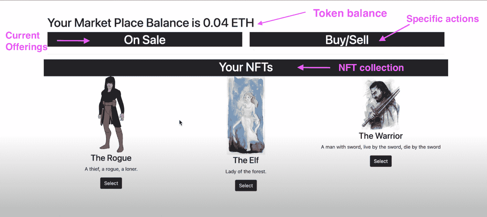

有了这些特征，我们现在有了启动 NFT 市场所需的想法。Moralis 的 SDK 将让一切变得更加顺畅和高效，为你的 Web3 项目提供终极工具包。我们还使用了 Moralis NFT API，它可以让你与各种软件进行交互，并获得你的 NFTs 所需的信息。

### NFT 商场的基本动作

在这里，我们演示了用户可以在 NFT 商店中执行的基本操作。当您启动 NFT 市场时，您可以为用户提供基本的功能，例如列出和购买 NFT。

#### 在 NFT 的商店里列出非功能性食物

用户应该能够快速上传他们的 NFTs，并轻松输入所需的令牌信息。之后，NFT 应该准备好列出。在这个例子中，用户从集合中选择一个 NFT。它最初出现在“买入/卖出”部分。

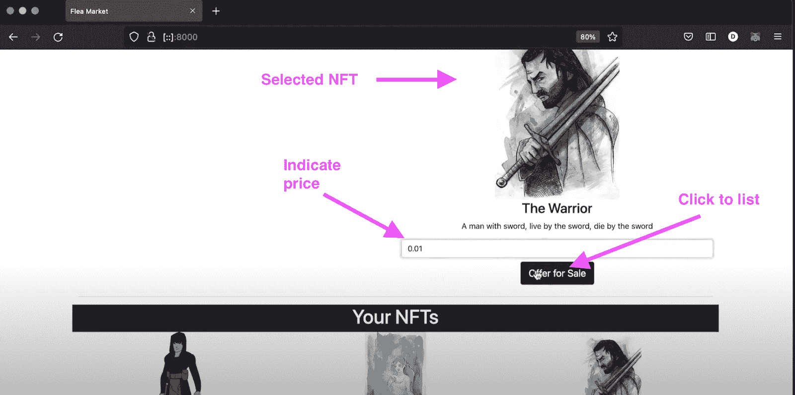

用户可以选择输入期望的 NFT 价格。之后，用户点击“待售”按钮。

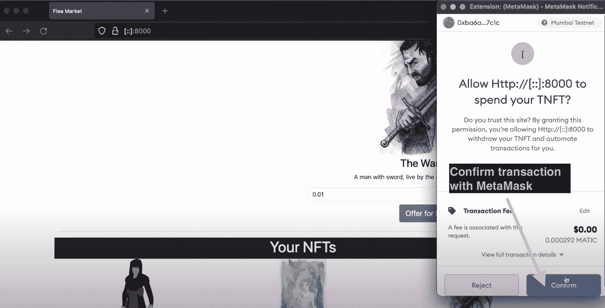

然后，此操作会提示一个 MetaMask 弹出窗口，其中有一个按钮用于确认交易。确认后，NFT 应该出现在“出售”部分，表明它现在上市出售，其他人可以购买或出价。

#### 在 NFT 商店购买非功能性食物

接下来，我们演示如何在 NFT 市场购买 NFT。您需要另一个帐户登录，因为用户不能购买自己的 NFTs。使用一个单独的帐户，我们可以看到任何人如何用加密钱包和足够的货币或代币购买 NFT。

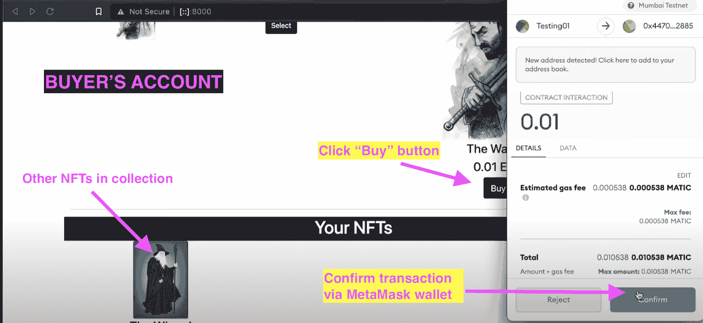

单独的用户通过点击“选择”按钮在“打折”部分选择他们想要购买的 NFT。决定后，用户点击“购买”，这将 NFT 移动到“购买/出售”部分。系统提示用户通过元掩码确认交易。

#### 成功购买 NFT

如果购买成功，NFT 将出现在用户的收藏中。作为新的 NFT 所有者，用户可以以他们认为合适的任何价格转售 NFT。

## 如何启动 NFT 市场

使用 Moralis，建立一个具有上述特征的 NFT 市场的过程变得简单了。如果您选择在[以太坊 RPC 节点](https://moralis.io/ethereum-rpc-nodes-what-they-are-and-why-you-shouldnt-use-them/?utm_source=blog&utm_medium=post&utm_campaign=How%2520to%2520Create%2520an%2520NFT%2520Marketplace)之上构建一个，后端基础设施的开发将变得更加复杂。然而，使用 Moralis 作为您的 Web3 后端基础设施平台，您可以将繁重的工作留给可靠的 IaaS 或“[基础设施即服务](https://moralis.io/iaas-explained-what-is-infrastructure-as-a-service/)”提供商。

因此，有了 Moralis 设备齐全的开发工具包，您的后端可以无缝处理，让您可以直接致力于用户体验。

## 与 Moralis 家一起启动 NFT 市场

要用 Moralis 启动 NFT 市场，我们需要记住某些后端功能。如演示所示，这些组件是:

1.  允许您登录 dApp 的用户验证功能。对于大多数 dApps 来说，最简单的方法是用元掩码对[进行认证。](https://moralis.io/how-to-authenticate-with-metamask/)
2.  实时跟踪用户余额。
3.  能够在 dApp 中发生智能合同事件时对其进行跟踪。

记住[智能合约](https://moralis.io/smart-contracts-explained-what-are-smart-contracts/)构成了 NFT 市场的逻辑，是其设计的基础。智能合约是市场的运营支柱。此外，NFT 市场 dApp 需要与许多其他合同进行交互来管理 NFT，这取决于它们的来源。

如上所述，使用 RPC 节点实现上述后端功能是细致而耗时的。然而，Moralis 通过提供一整套 Web3 工具，将区块链开发者从这一繁琐的过程中解放出来。支持包括广泛的 [Moralis 文档](https://docs.moralis.io/introduction/readme)来帮助你的后端，允许你用最少的努力在 Web3 上创建大多数项目。

### 从后端开始

1.  注册一个免费的 Moralis 帐户，并创建一个新的服务器

通过在 Moralis 上注册，您可以为您的项目创建一个新的服务器，并以“免费层”级别免费访问许多优秀的 Web3 工具。有了 Moralis，你可以[快速创建移动以太坊 dapp](https://moralis.io/create-mobile-ethereum-dapp-with-react-native-template/)，使用[以太坊 API](https://moralis.io/ethereum-api-develop-ethereum-dapps-with-moralis/?utm_source=blog&utm_medium=post&utm_campaign=How%2520to%2520Create%2520an%2520NFT%2520Marketplace) 在坚实的基础设施上建立 NFT 市场，等等！

注册后，点击右上角的按钮创建一个新的服务器，如下图所示:

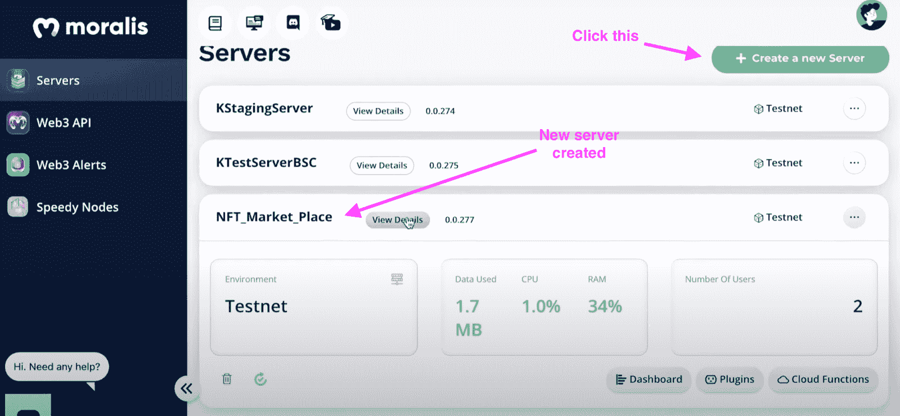

2.  继续同步事件

如前所述，NFT 市场需要在 dApp 中跟踪智能合同事件的能力。在本例中，我们将创建两个侦听器来检测我们想要跟踪的特定智能合约事件。有两种侦听器:一种用于检测 NFT 何时被拍卖(出售)，另一种用于检测报价的结束(购买)。

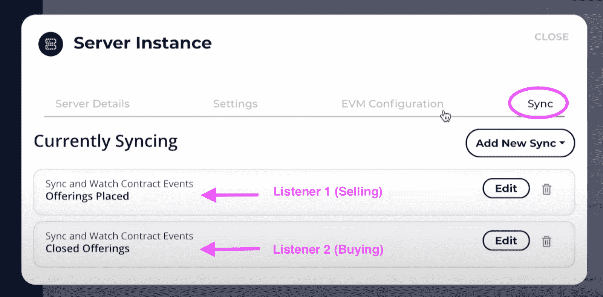

手动构建这种同步事件通常是一个困难的过程，但 Moralis 大大简化了这一过程。有了 Moralis，你只需要提供智能合约的 ABI，它就会完成它的工作。点击“编辑”进行查看和修改。

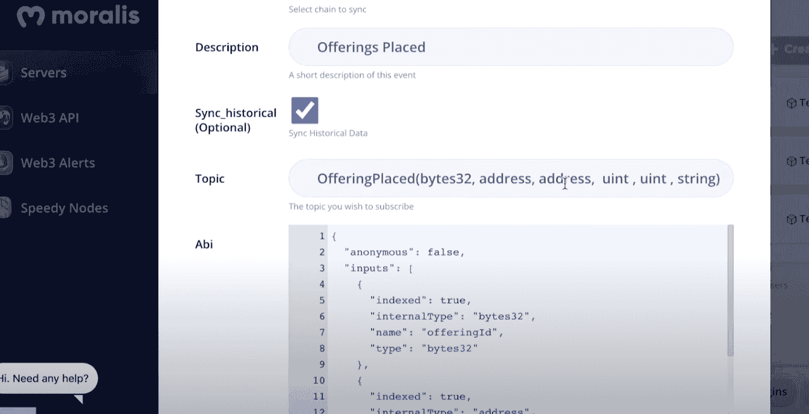

#### 数据库ˌ资料库

如果您查看 Moralis 仪表板，您会看到为您提供了一个完整的实时数据库。所创建的侦听器就是现在填充仪表板的侦听器。该数据库包含的信息，如未决余额，未决 NFT 所有者，交易历史，转让，关闭产品，等等。

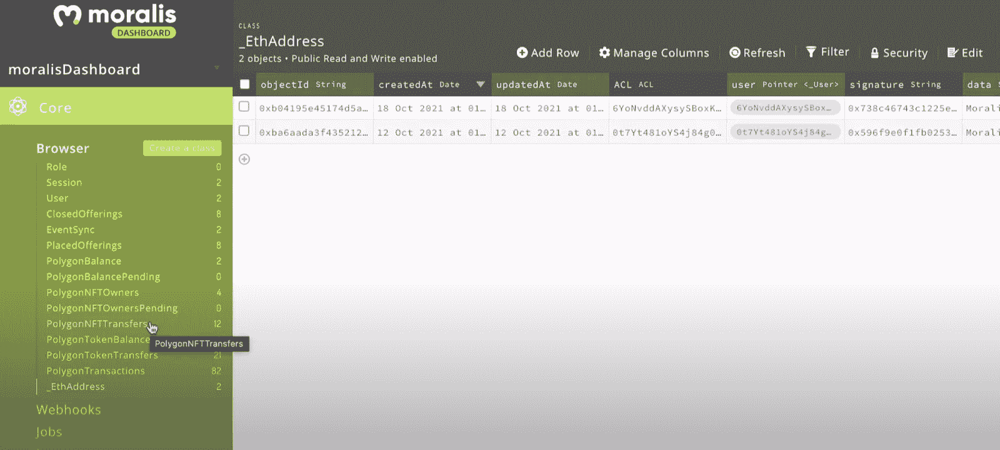

有了实时信息和链上数据，您现在可以应用相应的 Moralis 片段。这允许您正确使用数据。

## 启动 NFT 市场的合同

以下是作为样本 NFT 市场或 NFT 商店的经营者的合同截图:

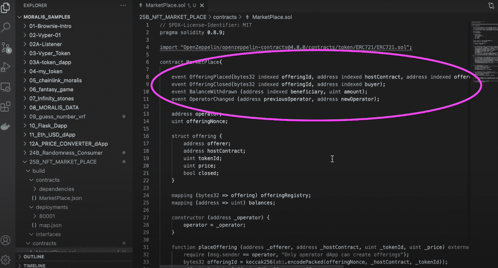

```js
contract MarketPlace{

event OfferingPlaced(bytes32 indexed offeringId, address indexed hostContract, address indexed offerer,  uint tokenId, uint price, string uri);
event OfferingClosed(bytes32 indexed offeringId, address indexed buyer);
event BalanceWithdrawn (address indexed beneficiary, uint amount);
event OperatorChanged (address previousOperator, address newOperator);
```

上面突出显示的代码显示了以下事件:

*   每当投放新商品时触发的事件。
*   每当既定课程关闭时的另一个事件。
*   提取余额时的事件。
*   当操作员的地址改变时的另一个事件。

### 获取完整的代码

要获得完整的代码，请查看这个 [NFT 市场](https://github.com/DanielMoralisSamples/25_NFT_MARKET_PLACE/blob/master/contracts/market_place.sol)项目的 GitHub 资源库。通过查看整个代码，您将理解智能合约的其余部分如何包含支持上述事件的函数。此外，任何 [Solidity](https://moralis.io/solidity-explained-what-is-solidity/) 的开发者都会理解这样的功能是如何保持 NFT 所有权的完整性并管理用户的买卖行为的。此外，该准则还描述了如何代表您管理 NFT 市场。

## 启动 NFT 市场-建立 dApp

我们已经完成了前半部分，也就是说，创建一个简单的合同来代表您管理市场——我们继续构建 dApp。

dApp 有三个组成部分，即:

1.  “index.html”文件，dApp 的一个简单框架。
2.  一个“cloudCode.js”文件。
3.  一个“logic.js”文件。

我们将强调“logic.js”文件的某些部分，因为它负责 dApp 的主要功能。

### 初始化 Moralis

“logic.js”文件首先使用以下代码初始化 Moralis:

```js
Moralis.initialize(""); // Application ID from moralis.io
Moralis.serverURL = ""; // Server URL from moralis.io
```

### 用户认证

这部分代码包含使用 Moralis 的用户身份验证，展示了 Moralis 只用一行代码就能执行身份验证的强大功能。

```js
Moralis.authenticate().then(function(){
     populateNFTs();
     populateOfferings();
     populateBalance();
     subscribeOfferings();
     subscribeBuys();
     subscribeUpdateNFTs();
});
```

此外，这将填充经过身份验证的用户的 NFTs。它还填充可能存在的产品，以及用户的余额。此外，它显示您正在订阅某些功能，如“优惠”、“购买”和“更新”功能。

您还会发现，这段代码与智能合约密切相关。智能合约和 dApp 的关系可以通过以下事实来说明:由您的 Moralis 服务器获取的实时信息对应于放置在您的 Moralis 数据库或“moralisDashboard”上的所有实时产品。

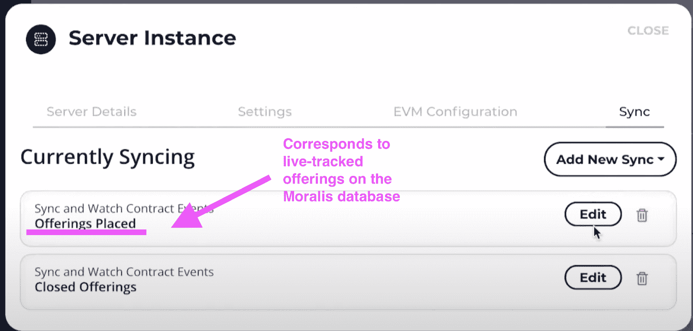

### Moralis 片段

在整个代码中，您会发现使用了各种 Moralis 规范片段，例如:

*   Moralis。查询(" PlacedOfferings ")
*   Moralis。查询(" ClosedOfferings ")
*   Moralis。查询("多边形所有者")
*   Moralis。Cloud.run("getBalance "，params)
*   Moralis。单位. FromWei(当前余额)
*   Moralis。Cloud.run("placeOffering "，params)
*   Moralis。Units.ETH(报价.价格)

这证明了 Moralis 是多么强大。它使你能够通过为你做所有的后台工作来创建一个完整的 NFT 市场 dApp。只需几段代码，您就可以利用来自 Moralis 数据库的数据，并将其包含在 dApp 中。

## 启动 NFT 市场-完整教程

要深入了解讨论的所有内容，以及对代码的进一步解释，请查看 Moralis 的 YouTube 频道上的这段精彩视频:

https://www.youtube.com/watch?v=EMOYpgl5S1w&feature=emb_title

## 如何启动 NFT 市场——总结

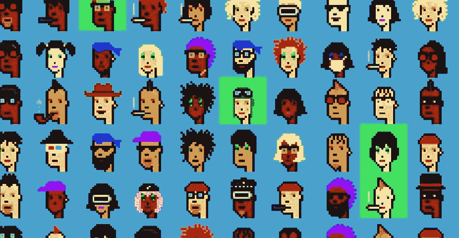

目前存在许多 NFT 市场。然而，建设一个 NFT 市场或 NFT 商店的各种要素将对任何区块链开发商构成挑战。从头开始创建您的后端，您传统上需要使用以太坊 RPC 节点，这可能是一个麻烦的处理。然而，Moralis 通过其强大的 Web3 解决方案解决了这一问题，让您可以创建“[无服务器](https://moralis.io/serverless-explained-what-is-serverless-computing/)”dapp，并通过 Moralis Speedy Nodes 在几分钟内运行一个区块链节点。此外，您可以构建一个支持您的 NFT 商店的数据库，并使用强大的 Moralis 片段来帮助您进一步加快构建速度。

这里的演示使用 ERC-721 标准。然而，如果你想探索如何使用 ERC-1155 标准批量制造 NFT，你可以很容易地做到，因为 Moralis 让你使用 ERC-1155 标准在 IPFS 支持下批量制造 NFT。此外，Moralis 使您能够[将文件夹上传到 IPFS](https://moralis.io/how-to-upload-folders-to-ipfs/) ，同时提供分散存储解决方案和批量铸造解决方案。

因此，有了所有这些优势，你可以专注于建设你的 NFT 商店 dApp 的前端，使其尽可能方便用户。要启动 NFT 市场并探索最伟大的 Web3 开发平台所能提供的前所未有的好处，只需[在 Moralis](https://admin.moralis.io/register) 上注册！