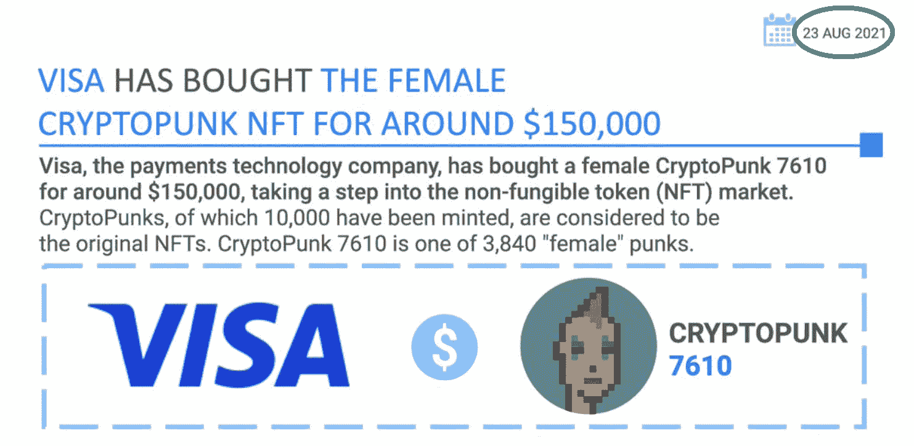
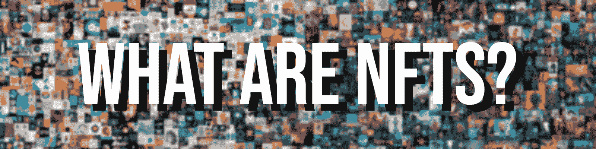
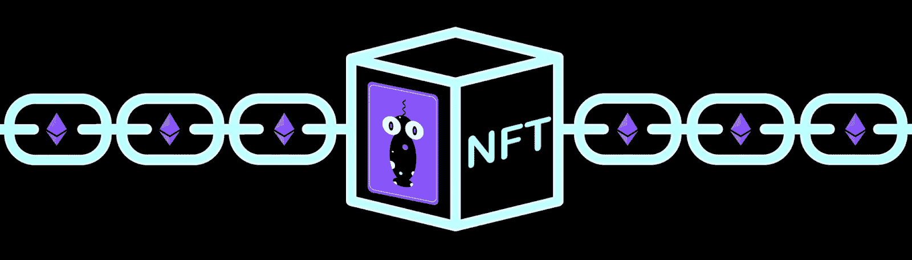
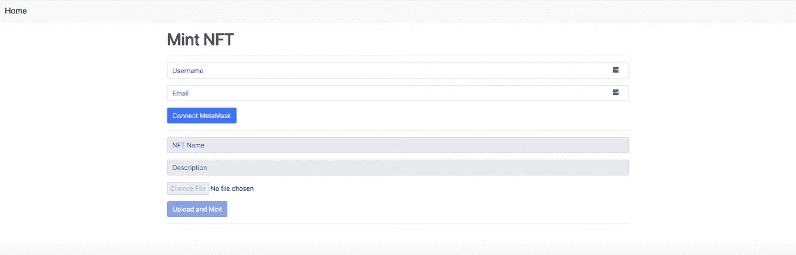
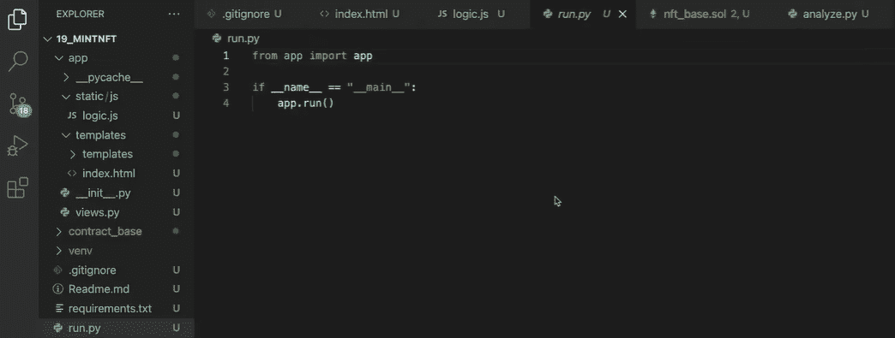
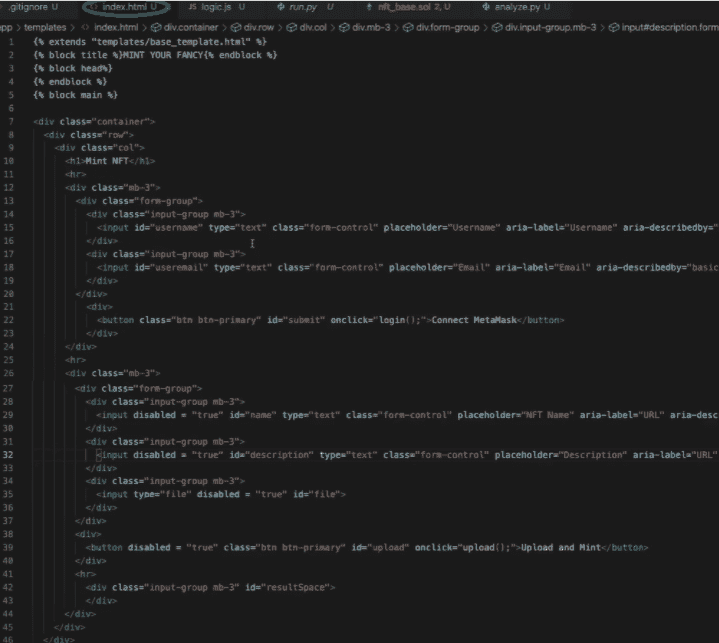
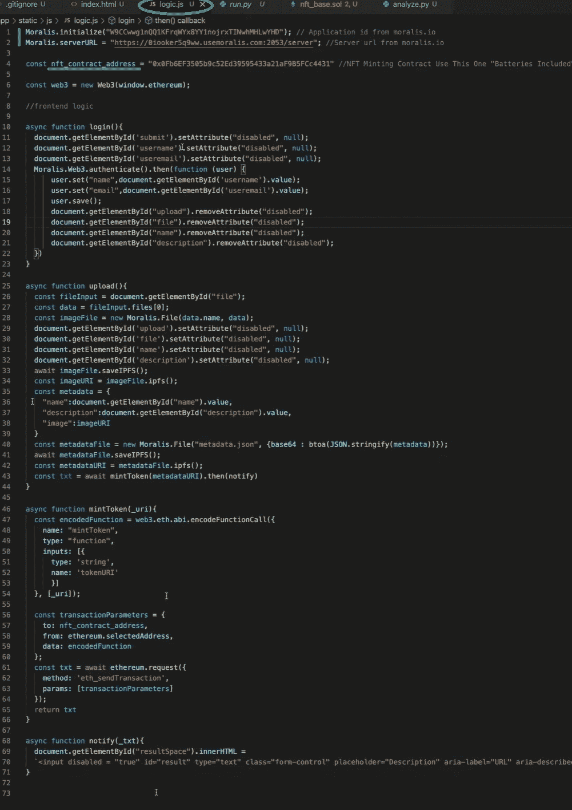
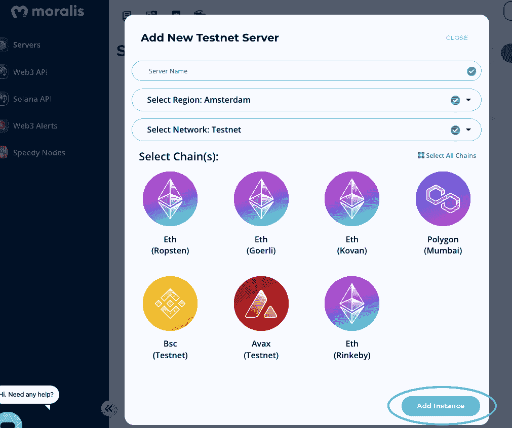
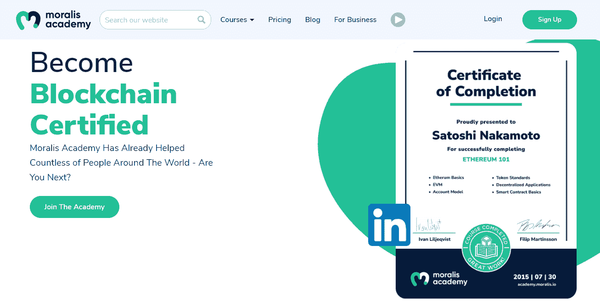

# 如何启动 NFT 铸造网页-完整演练

> 原文：<https://moralis.io/how-to-launch-an-nft-minting-page-full-walkthrough/>

随着 OpenSea 等 NFT 市场的交易额达到数十亿美元，以及 Visa 等大牌公司收购 NFT，我们都同意 [**不可替代的代币**](https://moralis.io/non-fungible-tokens-explained-what-are-nfts/) **将在 2021 年崭露头角。现在，从 2022 年 NFTs 的持续受欢迎程度来看，这是学习 NFT 发展的最佳时机。其中包括创建 NFT 造币网站的过程。虽然这个过程听起来有点令人生畏，但事实并非如此。事实上，有了正确的工具和适当的指导，你可以学习如何轻松地推出一个 NFT 造币网页。此外，通过简单的演练，比如我们将在这里介绍的，你可以在创纪录的时间内创建自己的铸造网站。**

接下来，你将学习如何使用终极的 [Web3](https://moralis.io/the-ultimate-guide-to-web3-what-is-web3/) 开发平台 [Moralis](https://moralis.io/) ，来创建你自己的铸造网站。此外，Moralis(又名 [Firebase for crypto](https://moralis.io/firebase-for-crypto-the-best-blockchain-firebase-alternative/) )让你可以使用它的[NFT API](https://moralis.io/ultimate-nft-api-exploring-moralis-nft-api/)——最好的 [OpenSea API 替代品](https://moralis.io/opensea-api-alternative-list-nfts-with-this-opensea-plugin/)。反过来，您可以复制和粘贴简短的代码片段，以满足您所有的后端需求。更重要的是，与 Moralis，你的“如何启动 NFT 造币网页”的追求成为一个快速而简单的过程。此外，这个 [Web3 后端平台](https://moralis.io/exploring-the-best-web3-backend-platform/)是跨链互操作的，支持最流行的可编程区块链。因此，你可以在多个连锁店创建自己的铸造网站。这意味着你可以瞄准更广泛的受众，而无需额外的工作。此外，Moralis 的跨链互操作性可以让您的工作经得起未来考验。也就是说，让我们邀请你加入我们创建一个铸造网站的例子。如果这听起来很有趣，请确保现在就[创建你的免费 Moralis 账户](https://admin.moralis.io/register)。

## 什么是 NFT？

你们当中可能有一些完全的初学者；因此，在我们教你如何创建 NFT 造币页面之前，我们需要先了解一些基础知识。因此，让我们从回答“什么是 NFT”开始。NFT 是独特的加密资产，用“不可替代”一词明确表示。因此，没有两个或两个以上的非功能性测试是相同的。即使 NFT 是它们所代表的同一项的副本，它们也有独特的属性。因此，NFT 是数字收藏品和数字艺术品的绝佳选择。此外，它们还提供了广泛的现实世界用例。例如，NFT 可以代表所有种类的证书和所有权，并有助于整体的透明性。

此外，当涉及到数字艺术和收藏品时，NFT 的核心在某些情况下是 JPEG 文件。然而，这些不是普通的图像。特定区块链上的铸造过程将常规数字文件转换成 NFT。当铸造发生时，它分配所有权和许多其他财产，可以进一步利用。在其他选项中，NFT 可以分配有佣金或小费属性。因此，原始所有者自动接收该 NFT 的任何未来购买的预定义部分。因此，艺术家可以因为他们的作品随着时间的推移增值而获得回报。此外，NFTs 还提供了许多其他优秀的功能。因此，您可以看到 NFTs 可以提高所有权和透明度。此外，它可以消除对不诚实中介的需求。

### NFT 铸造的是什么？

现在你知道什么是 NFT，我们可以把重点放在 NFT 铸币，这也是重要的是要了解当你想学习如何推出一个 NFT 铸币网页。那么，NFT 铸造的是什么？让我们首先指出，没有铸币，就不会有 NFTs。因此，铸造是 NFTs 的一个关键方面。此外，它的造币需要一个文件(JPEG，PNG，MP3，MP4，PDF 等。)和一组具体的细节(描述、属性等。)并将它们转换成不可替换的令牌。

同样值得注意的是,“铸造”一词是从政府铸造金属硬币的概念中借用来的。然而，在加密令牌(可替换和不可替换)的情况下，铸造指的是区块链交易的执行。当一个相关的智能合同开始工作时，它通过在区块链上保存令牌的详细信息来创建令牌。一旦 NFT 的详细信息出现在区块链上，它们就被称为元数据。此外，就像可替换的令牌一样，NFT 可以在各种可编程链上铸造。例如，有[雪崩](https://moralis.io/how-to-connect-to-avalanche-nodes/)、[多边形](https://moralis.io/how-to-connect-to-polygon-nodes/)、 [BSC](https://moralis.io/bsc-programming-guide-intro-to-binance-smart-chain-development-in-10-minutes/) (现在的 [BNB 链](https://www.binance.com/en/support/announcement/854415cf3d214371a7b60cf01ead0918))、索拉纳、凡托姆等等。然而，尽管费用高昂，[以太坊](https://moralis.io/full-guide-what-is-ethereum/)仍然是首选。这就是为什么以太坊的 NFT 标准 [ERC-721](https://moralis.io/erc-721-token-standard-how-to-transfer-erc721-tokens/) 和 [ERC-1155](https://moralis.io/erc1155-exploring-the-erc-1155-token-standard/) 是你最常听说的。

*注意:在铸造 NFT 时，对 NFT 标准的基本理解是至关重要的，尤其是当你想创建自己的铸造网站时。因此，请务必查看以上链接。*

尽管如此，记住以上内容，你已经可以看到，学习如何启动一个 NFT 造币页面将需要至少两个部分。一方面，你需要某种接口([去中心化应用](https://moralis.io/decentralized-applications-explained-what-are-dapps/)【dApps】)。另一方面，您需要在后端与智能合约进行交互，以创建 NFT。

## 如何启动一个 NFT 铸造网页-一个例子项目

在文章的这一部分，我们将向您展示如何从头开始构建 NFT·明特 dApp。当然，您可以使用相同的原理将 mint 功能添加到现有的界面中。因此，我们将构建一个 Web3 应用程序，它将使您能够创建 NFT。在这个过程中，您将看到各种 Moralis 工具如何简化开发过程。以分散的方式铸造最重要的工具是 Moralis 的 IPFS 整合。现在，请记住，您可以避免使用领先的分散存储解决方案(IPFS)。然而，这样做会限制你一个更集中的铸造方法。此外，由于我们不想暴露于单点故障风险，我们将关注这个项目的分散方式。现在，在探索如何启动 NFT 造币页面之前，让我们对 dApp 做一个简单的预览。

### 如何启动 NFT 造币页面-预览

这是我们完成的 dApp 界面的外观:

这一切都是为了简单而不减少功能。看上面的截图，你可以看到我们的 minter dApp 将允许用户使用用户名和电子邮件地址登录。此外，他们还将[使用元掩码](https://moralis.io/how-to-authenticate-with-metamask/)进行认证。登录后，用户可以命名 NFT，添加描述，选择文件，最后上传文件并创建 NFT。正确完成所有步骤后，用户将在 dApp 底部看到以下消息:

#### 创建自己的铸造网站

有几种不同的方法可以用来创建上面提到的 minter dApp。然而，我们决定创建一个 [Python](https://moralis.io/python-explained-what-is-python/) flask 应用。该应用程序将触发相关代码。此外，我们代码的主要部分是“index.html”和“logic.js”文件。因此，我们将在这里集中讨论这两个文件。

*注意* *:按照我们的示例项目并创建您自己的铸造网站的最简单方法是使用我们的代码。为了方便您，我们在* [*GitHub*](https://github.com/DanielMoralisSamples/19_MINTNFT) *上提供了它。*

### 创建自己的铸造网站-代码演练

当谈到我们的示例 dApp 的外观和结构时，“index.html”文件就是负责这一部分的文件。本质上,“index.html”文件提供了所有使用户能够与我们的分散式应用程序和 mint NFTs 进行交互的元素。然而，我们需要能确保一切顺利进行的东西。这就是“logic.js”出现的地方。此外，我们使用该文件中的代码来部署 Moralis 的功能。因此，我们只是简单地从 [Moralis 的文档](https://docs.moralis.io/)中复制简短的代码片段。

这里是我们的“[index.html](https://github.com/DanielMoralisSamples/19_MINTNFT/blob/master/app/templates/index.html)”文件的预览:

下面是 ["logic.js](https://github.com/DanielMoralisSamples/19_MINTNFT/blob/master/app/static/js/logic.js) "文件的预览:

正如你在上面看到的，我们只用了 71 行代码就能得到 dApp 的逻辑。多亏了 Moralis 的 SDK 和它的 NFT API，这才成为可能。此外，让我们指出“logic.js”文件的前两行。这些是至关重要的，因为它们使您能够通过连接到您的 Moralis 服务器来使用 Moralis。此外，我们不应跳过这些初步步骤，因为它们是必不可少的。因此，我们需要更详细地介绍它们(参见下面的小节)。

让我们再重复一遍，铸造是通过与智能合约的交互来完成的。此外，创建自己的智能合同可能会很棘手。因此，我们决定使用一个快捷方式(第四行的代码)来涵盖这个方面。因此，您可以将注意力集中在使用 Moralis 的 API 来制造 NFT 上。

#### 创建自己的铸造网站-初始 Moralis 设置

此时，您知道需要获得您创建的 Moralis 服务器 URL 和应用程序 ID。这个信息是至关重要的，当你想推出一个 NFT 铸造网页。因此，让我们来看一下将为您提供这些细节的步骤:

1.  **创建您的 Moralis 帐户**–如果您还没有 Moralis 帐户，现在就创建一个。您可以使用本文开头的链接来访问注册页面。在那里，输入您的电子邮件地址，创建您的密码，并点击确认链接(检查您的电子邮件收件箱)。另一方面，如果你已经有了一个有效的 Moralis 账户，只需[登录](https://admin.moralis.io/login)。

2.  [**创建新服务器**](https://docs.moralis.io/moralis-server/getting-started/create-a-moralis-server)——成功登录您的 Moralis 管理区后，就该创建新服务器了。因此，单击“Servers”选项卡右上角的“+ Create a new Server”按钮。然后，从下拉列表中选择一个服务器类型选项(见下图)。*在处理示例项目时，最好使用“Testnet 服务器”选项。*

选择服务器类型后，将会出现一个新窗口。在那里，您需要输入您的服务器名称(这可以是您想要的任何名称)，选择您的区域、网络、链，然后单击“添加实例”。

3.  **访问服务器详细信息**–服务器启动并运行后，您可以访问其详细信息(以填充您的”。js”文件)。因此，单击您的服务器名称旁边的“查看详细信息”。将出现一个包含所有详细信息的弹出窗口。

4.  **初始化 Moralis**–现在，使用上述详细信息，并将其粘贴到您的”。js”文件来获得所需的后端功能:

*注意* *:确保你使用了你特定服务器的详细信息。做* *而不是* *从上面的图片中复制服务器细节。*

### 视频解释如何启动 NFT 铸造网页

如果您想了解我们的示例项目中代码的更多细节，我们推荐您观看视频，该视频讲述了如何创建您自己的 NFT 造币应用程序(以上步骤更详细)。因此，你会发现如何推出一个 NFT 铸造网页快速，轻松地与 Moralis。

https://www.youtube.com/watch?v=WdQHnb_5m5Q

### 让您的 NFT 发展更进一步

使用上面的教程，你现在应该能够创建自己的铸造网站。多亏了 Moralis 和它的选项[通过你的网站](https://www.youtube.com/watch?v=7TKqLJd_aYI)与智能合约互动，你可以轻松地创建一个强大的 NFT 造币页面。此外，我们建议您学习如何使用 Moralis 实现其他优秀的 NFT 特性。比如，你可以加入[懒铸币](https://moralis.io/how-to-lazy-mint-nfts/)。这是上市时的 NFTs 铸币厂在购买时。因此，只有当 NFT 卖出时，与铸造交易相关的费用才变得相关。此外，通过懒惰铸造，铸造费用可以由 NFT 创作者，买家或 NFT 平台支付。

#### 懒人造币教程:

https://youtu.be/n6rPr0sStTI

此外，当可收集的 NFT(例如，无聊猿游艇俱乐部)有问题时，NFT 稀有性开始发挥作用。幸运的是，你可以很容易地将 [NFT 稀有度排名](https://moralis.io/how-to-develop-an-nft-rarity-ranking-dapp/)和稀有度过滤整合到你的 NFT 平台中。在下面的教程中，跟随一位 Moralis 专家的指导就可以了。

#### NFT 稀罕物教程:

https://youtu.be/TXpfRRHwjak

尽管如此，学习*创建和启动你自己的 NFTs* 的细节也是有意义的。为此，请使用本教程:

https://youtu.be/tBMk1iZa85Y

## 如何启动 nft 挖掘页面–完整演练–总结

在这篇文章中，我们已经涉及了相当多的内容。此时，你知道如何启动一个 NFT 铸造网页。此外，你知道当使用 Moralis 时，你可以利用你的 [JavaScript](https://moralis.io/javascript-explained-what-is-javascript/) 熟练程度和[元掩码](https://moralis.io/metamask-explained-what-is-metamask/)创建你自己的铸造网站。此外，我们也希望你已经加入了我们，因为我们采取了上述一个例子项目。如果是这样的话，你现在已经有了自己的简单的 NFT 造币页面。现在，是时候让你的 NFT 发展更上一层楼了。

你想进一步加深你的 NFT 知识或了解加密世界的其他方面吗？如果是这样的话，[Moralis 博客](https://moralis.io/blog/)和[Moralis YouTube 频道](https://www.youtube.com/c/MoralisWeb3)是值得一去的地方。这两个网站都提供了大量有价值的内容，包括许多示例项目。这些也可以作为一些独特想法的灵感。例如，一些最新的主题涵盖了 [Web3 用户入职](https://moralis.io/how-to-boost-web3-user-onboarding-success-rates/)、 [Web3 社交登录](https://moralis.io/web3-social-login-sign-in-dapp-users-with-google-email-or-twitter/)、[通过电子邮件进行 Web3 认证](https://moralis.io/how-to-do-web3-authentication-via-email/)、 [BSC 钱包](https://moralis.io/bsc-wallet-guide-how-to-set-up-a-binance-smart-chain-wallet/)、[治理令牌](https://moralis.io/what-are-governance-tokens-full-guide/)、[可重入智能合约示例](https://moralis.io/what-is-reentrancy-reentrancy-smart-contract-example/)、[什么是元宇宙](https://moralis.io/what-is-the-metaverse-full-guide/)、 [React Native Web3](https://moralis.io/react-native-web3-full-react-native-web3-dev-guide/) 等等。

另一方面，如果你渴望尽快成为全职加密员，我们建议你采取更专业的方法。因此，你可以考虑报名参加 Moralis 学院。因此，你将获得个性化的加密教育途径和顶级的[区块链课程](https://academy.moralis.io/all-courses)。然而，真正的财富在于最先进和支持区块链发展社区之一，并获得专家指导。毫无疑问，如果你想[成为一名区块链开发者](https://moralis.io/how-to-become-a-blockchain-developer/)，Moralis 学院是最佳途径！

