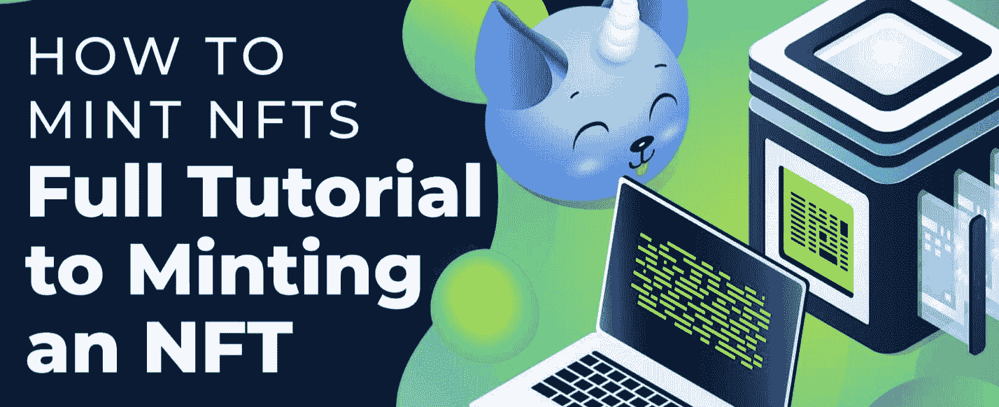
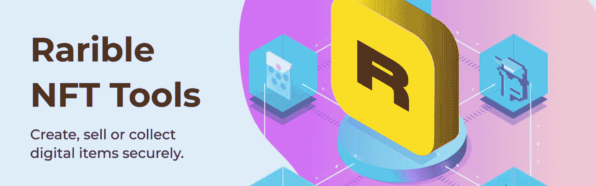

# 如何偷懒造币厂

> 原文：<https://moralis.io/how-to-lazy-mint-nfts/>

[**【NFTs】**](https://moralis.io/non-fungible-tokens-explained-what-are-nfts/)**，或者不可替代的代币，或者无疑是区块链业界最知名的领域之一。在过去的几年中，NFT 越来越受欢迎，它们能够表示从物理资产到虚拟资产的任何东西。这些代币让世界各地的艺术家能够将他们的作品推向市场，并获得前所未有的资金支持。然而，随着区块链网络拥堵问题的出现，**[**minting NFTs**](https://moralis.io/how-to-mint-nfts-full-tutorial-to-minting-an-nft/)**的燃气费变得不可预测且高昂，这导致了市场进入壁垒。因此，为了解决这个问题，引入了“懒人造币”的概念。因此，艺术家们可以在不支付任何燃气费的情况下列出非功能性燃气。这怎么可能呢？那么，我们将在这篇文章中仔细看看它是什么，以及如何懒惰薄荷 NFT。**

没有合适的工具，懒惰的造币厂 NFT 会很麻烦；然而，在本教程中，我们将使用排名第一的 [Web3](https://moralis.io/the-ultimate-guide-to-web3-what-is-web3/) 操作系统——[Moralis](https://moralis.io/?utm_source=blog&utm_medium=post&utm_campaign=The%2520Ultimate%2520Guide%2520to%2520Web3%2520%25E2%2580%2593%2520What%2520is%2520Web3%253F)。Moralis 不仅使制造 NFT 成为一项更容易完成的任务，而且该平台可以用于众多不同的区块链项目。Moralis 为所有用户提供了无限可扩展的后端基础设施，这反过来又消除了开发后端的一些麻烦。此外，操作系统还提供了额外的开发工具，如 [Moralis Speedy Nodes](https://moralis.io/speedy-nodes/) 、 [Price API](https://moralis.io/introducing-the-moralis-price-api/) 、 [NFT API](https://moralis.io/ultimate-nft-api-exploring-moralis-nft-api/) 等等。

所以，如果你有成为一名更好的区块链开发者的雄心，马上和 Moralis 签约吧。创建一个帐户是完全免费的，你将立即获得所有的好处 Moralis！

## 什么是懒造币？

在我们更深入地研究懒惰制造 NFT 的过程之前，我们需要对什么是懒惰制造做一个简单的介绍。要回答这个问题，一个很好的起点是为什么首先需要它。区块链行业的一个普遍问题是网络拥挤——随着越来越多的人在区块链上进行交易，对天然气的需求增加，从而推高了价格。因此，制造非功能性食品变得越来越昂贵。如前所述，正因为如此，才引入了懒人造币。


当懒惰铸造 NFT，铸造过程不会发生，直到购买的时候。这使得 NFT 的艺术家和开发者可以免费创建代币，因为当有人购买代币时，代币就会出现。因此，铸造的责任落在了买家身上，而不是 NFT 的创造者身上。

此外，这将创建点移动到区块链的较后部分，并且减少了不必要的计算能力的使用，因为只有售出的 NFT 将被铸造。因此，未售出的 NFT 将不需要任何计算能力，因为该过程被推到购买时。

# 如何在三个步骤中偷懒

惰性铸造是一种理论上可行且有益的工艺，它为 NFT 铸造工艺提供了许多优点。懒惰造币不仅降低了艺术家的成本，也减轻了网络的压力。



在这一部分中，我们将仔细看看懒惰铸造是如何工作的实际过程。为了演示，我们将创建一个懒惰的 NFT [dApp](https://moralis.io/decentralized-applications-explained-what-are-dapps/) (分散式应用程序)。因为我们使用了 Moralis，所以我们只需要三个简单的步骤就可以创建这个 dApp:

1.  创建一个 Moralis 服务器并安装 Rarible 插件。
2.  创建 HTML 文件。
3.  添加应用程序逻辑。

dApp 的用户将能够通过输入名称、描述和图像来不断地偷懒。此外，这只需要一行代码就可以完成，因为我们将使用 Moralis 的 Rarible 插件，所有数据都将存储在 IPFS 上。所以，如果你想了解更多关于如何懒惰制造 NFT 的知识，我们建议你跟随我们完成整个过程！

此外，如果你更想看一段来自 YouTube 频道的视频，更详细地解释这个过程，那么看看下面的视频:

https://www.youtube.com/watch?v=n6rPr0sStTI

## 步骤 1:如何创建新的 NFTs 创建一个 Moralis 服务器并安装 Rarible 插件

创建这个懒惰的 NFT dApp 的必需品是一个 Moralis 服务器。因此，第一步(如果你还没有)是[注册 Moralis](https://admin.moralis.io/register) 。一旦你手头有一个帐户，你会发现“+创建一个新的服务器”按钮在 Moralis 管理面板的顶部。单击此按钮将启动该过程，要创建服务器，您需要输入一个名称，选择一个地区，然后选择网络。对于这个演示 dApp，你选择哪个网络并不重要；然而，这应该基于你希望你的 dApp 运行在什么样的链上。


完成选择后，您可以点击界面右下角的“添加实例”按钮。这将启动启动服务器的过程；但是，这可能需要几分钟时间。

实例启动后，您可以点击相关服务器的“Plugins”选项卡，并转到 Moralis [插件商店](https://moralis.io/plugins/)。进入商店后，您可以导航到“[稀有 NFT 工具](https://moralis.io/plugins/rarible-nft-tools/)”插件页面，并为您刚刚创建的服务器安装该插件。要安装这个插件，你必须有一个用于[以太坊](https://moralis.io/full-guide-what-is-ethereum/)主网和 Rinkeby 测试网的区块链节点。由于您是 Moralis 用户，您可以在 Moralis 管理面板左侧导航栏中的“Speedy Nodes”选项卡下访问这些节点。



现在，服务器已经启动并运行，Rarible NFT 插件也已安装，我们可以进入流程的第二步，围绕着用 HTML 代码构建 dApp 的内容。

## 步骤 2:如何创建一个 HTML 文件

创建 NFT 懒惰制造 dApp 的第二步是创建一个 HTML 文件来构建内容。因此，您可以导航到您喜欢的开发环境并创建一个“index.html”文件。接下来，我们将从 Moralis GitHub 页面复制 [Moralis vanilla 样板代码](https://github.com/MoralisWeb3/demo-apps/tree/main/moralis-vanilla-boilerplate)。我们将使用这个样板文件，删除“< body >标签中的所有内容，并将其添加到 dApp 的“index.html”文件中。

HTML 代码和 dApp 的结构完全取决于开发人员的偏好。然而，为了举例说明像这样的潜在 dApp 可能看起来像什么以及它的 HTML 代码，我们将使用视频中的演示 dApp。这就是懒铸币 dApp 的样子:


正如您所看到的，页面顶部有一个标题，后面是一个容器，其中有三个输入字段和一个提交按钮。标题、字段和按钮的代码如下所示:

```js
<body>
        <div class="container">
            <div class="row">
                <div class="title">NFT Minter</div>
                <div id="app" class="col-md-6 offset-md-3">
                    <div id="success_message">

                    </div>
                    <div class="form_element">
                    <input class="form-control type="text" id="input_name" name="name" placeholder="Token name">
                    </div>
                    <div class="form_element">
                    <input class="form-control type="text" id="input_description" name="description" placeholder="Description">
                    </div>
                    <div class="form_element">
                    <input class="form-control" type="file" id="input_image" name="image" accept="image/png, image/jpeg">
                    </div>
                    <div class="form_element">
                    <button class="btn btn-primary btn-lg btn-block" id="submit_button">Submit</button>
                    </div>
                </div>
            </div>
        </div>
    <script type="text/javascript" src="./main.js"></script>
  </body>
```

此外，如果您仔细查看 GitHub 页面中“[index.html](https://github.com/MoralisWeb3/youtube-tutorials/blob/main/nft-minter/index.html)”文件的文档，您会发现该文件包含一些额外的代码。这段代码用于引入一个引导 CDN，我们将它添加到 head 脚本中。但是，这是可选的，因为您可以根据自己的喜好来构建内容和样式。

## 步骤 3:如何创建 NFTs 添加应用程序逻辑

将 HTML 元素添加到代码中后，下一步是添加提供必要功能的逻辑，允许用户创建新的 NFT。为此，我们可以创建一个“[main . js](https://github.com/MoralisWeb3/youtube-tutorials/blob/main/nft-minter/main.js)”[JavaScript](https://moralis.io/javascript-explained-what-is-javascript/)文件，该文件将包含三个不同的函数:“login()”、“initApp()”和“submit()”。

然而，在我们深入研究 dApp 的功能之前，我们必须首先启动 Moralis。为此，您需要返回到 Moralis 管理面板，并导航到“服务器”选项卡。在这里，您需要单击相关服务器的“View Details”按钮，并检索服务器 URL 和应用程序 ID。有了这些信息，您可以按以下方式输入:

const SERVER URL = " INSERT SERVER _ URL "；

const appId = " INSERT APP _ ID

随着 Moralis 的启动，我们可以更深入地研究 dApp 的第一个功能。

### **登录()**

“main.js”文件的第一个函数是“login()”，它检查是否有当前的 [MetaMask](https://moralis.io/metamask-explained-what-is-metamask/) 用户。如果找不到，那么该函数调用“Moralis.authenticate()”和“initApp()”函数。如果有一个现有用户，那么这个函数只需调用“initApp()”。尽管如此，这是完整函数的样子:

```js
async function login() {
  if (!user) {
   try {
      user = await Moralis.authenticate({ signingMessage: "Hello World!" })
      initApp();
   } catch(error) {
     console.log(error)
   }
  }
  else{
    Moralis.enableWeb3();
    initApp();
  }
}
```

### **initApp()**

接下来，我们有“initApp()”函数，它非常简单。首先，该函数向用户显示 dApp 的界面。其次，它还增加了通过 onclick 事件提交惰性制造 NFT 所需信息的选项。因此，这是完整的功能:

```js
function initApp(){
    document.querySelector("#app").style.display = "block";
    document.querySelector("#submit_button").onclick = submit;
}
```

### **提交()**

最后，我们有“submit()”函数，在这里可以找到大部分的铸造逻辑。这是完整功能的样子，它由几个不同的部分组成:

```js
async function submit(){
    const input = document.querySelector('#input_image');
    let data = input.files[0]
    const imageFile = new Moralis.File(data.name, data)
    await imageFile.saveIPFS();
    let imageHash = imageFile.hash();

    let metadata = {
        name: document.querySelector('#input_name').value,
        description: document.querySelector('#input_description').value,
        image: "/ipfs/" + imageHash
    }
    console.log(metadata);
    const jsonFile = new Moralis.File("metadata.json", {base64 : btoa(JSON.stringify(metadata))});
    await jsonFile.saveIPFS();

    let metadataHash = jsonFile.hash();
    console.log(jsonFile.ipfs())
    let res = await Moralis.Plugins.rarible.lazyMint({
        chain: 'rinkeby',
        userAddress: user.get('ethAddress'),
        tokenType: 'ERC721',
        tokenUri: 'ipfs://' + metadataHash,
        royaltiesAmount: 5, // 0.05% royalty. Optional
    })
    console.log(res);
    document.querySelector('#success_message').innerHTML = 
        `NFT minted. <a href="https://rinkeby.rarible.com/token/${res.data.result.tokenAddress}:${res.data.result.tokenId}">View NFT`;
    document.querySelector('#success_message').style.display = "block";
    setTimeout(() => {
        document.querySelector('#success_message').style.display = "none";
    }, 5000)
}
```

首先，该函数从用户通过 UI 上传的文件中获取图像数据。这些信息随后被用于通过 Moralis 的本地集成将图像上传到 [IPFS](https://moralis.io/what-is-ipfs-interplanetary-file-system/) 。图像上传到 IPFS 后，我们获取图像哈希并保存到一个变量中。

然后，我们获取名称、描述和图像散列来创建一个元数据对象，然后将它字符串化为 [JSON](https://moralis.io/json-explained-what-is-json-javascript-object-notation/) 格式，然后通过 Moralis 的“saveIPFS()”函数将它再次上传到 IPFS。

最后，我们获取 IPFS 文件的散列，并在调用“Moralis”时使用它。Plugins.rarible.lazyMint()"函数。在这个函数中，我们包括区块链、用户地址、令牌类型和令牌 URI。此外，我们还可以指定令牌售出时的版税金额。

接下来，我们通过向用户显示一条成功消息以及一个到 NFT 的链接来结束一切，如果一切都按预期运行的话。就是这样；当与 Moralis 家一起工作时，它不必比那更复杂！

多亏了 Rarible 插件和 Moralis 对 IPFS 的本地支持，我们只需要几行代码就可以轻松制作一个 NFT，然后[上传到 IPFS](https://moralis.io/full-guide-how-to-upload-to-ipfs/) 。然而，如果你有兴趣仔细查看完整的 dApp，那么查看一下 [Moralis GitHub 页面](https://github.com/MoralisWeb3/youtube-tutorials/tree/main/nft-minter)，在那里你会找到完整的“index.html”和“main.js”文件。

## 如何偷懒造币厂-总结

作为一名[区块链开发商](https://moralis.io/how-to-become-a-blockchain-developer/)，你有能力[铸造 NFT](https://moralis.io/best-api-to-mint-nfts-full-guide/)，这是区块链产业非常有活力的象征，它们允许各种创新的解决方案。然而，随着各种区块链的天然气价格的上涨，制造 NFT 变得更加昂贵。为了解决这个问题，我们引入了懒惰铸造的概念。惰性铸造 NFT 意味着铸造过程被向前推进，直到有人实际购买代币。因此，这意味着直接的铸造成本从 NFTs 的创建者处移除，并转移到购买点。

这不仅有利于艺术家和 NFT 的开发商，而且有利于整个社区，因为只有出售的 NFT 才被铸造，这消除了区块链上不必要的高能耗交易。此外，当与 Moralis 一起工作时，懒惰制造 NFT 的过程变得相对简单，并且你并不真正需要任何[区块链语言](https://moralis.io/best-languages-for-blockchain-development-full-tutorial/)的广泛知识。实际上，只需要三个简单的步骤就可以创建一个 NFT 懒人造币 dApp:

1.  创建一个 Moralis 服务器并安装 Rarible 插件。
2.  创建 HTML 文件。
3.  添加应用程序逻辑。

然而，这并不是 Moralis 的全部，因为它的 Web3 操作系统可以用于各种区块链项目。因此，您能够以显著更快的速度[开发 dApps](https://moralis.io/how-to-build-decentralized-apps-dapps-quickly-and-easily/) ,并且该过程变得更加易于使用该平台的工具。

Moralis 的可能性是无穷无尽的，例如，你可以[推出一个 NFT 市场](https://moralis.io/how-to-launch-an-nft-marketplace/)，[开发以太坊 dApps](https://moralis.io/ethereum-api-develop-ethereum-dapps-with-moralis/) ，[创建一个 BEP20 令牌](https://moralis.io/bep20-testnet-create-a-bep20-token-in-15-mins/)，等等。所以，如果你正在努力成为一名区块链开发者，那么现在就注册 Moralis 吧。只需要几秒钟，而且完全免费！