# 如何实时收听智能合约交易

> 原文：<https://moralis.io/how-to-listen-to-smart-contract-transactions-in-real-time/>

**你很可能知道，** [**智能合约**](https://moralis.io/smart-contracts-explained-what-are-smart-contracts/) **是可编程区块链功能的重要组成部分。在其他事件中，Web3 合同确保代币铸造和交易按照标准运行。当然，您可以创建自己的智能契约，并使用一些 Solidity 基础来部署它们。但是，您也可以收听已经直播的智能合约交易和事件。事实上，您可以围绕现有的智能合约构建各种各样的 explorer dapps。然而，许多对索引区块链感兴趣的开发者采用了一种过时的方法。因此，他们通常会花费数周甚至数月的时间来构建基础架构，以正确侦听智能合同事件。幸运的是，有一种更简单快捷的方法可以做到这一点。多亏了 Moralis，你可以在几分钟内找到区块链。只需要一些快速的初始设置和合同地址。**

接下来，我们将处理一个示例项目，在该项目中，您将学习如何监听智能合约事件。您将看到 Moralis 如何使您能够为 ERC20、ERC1155、ERC721 和自定义智能合同事件做到这一点。为了亲身体验 [Moralis 的 Web3 Syncs](https://moralis.io/syncs/) 的威力，我们鼓励您跟随我们的脚步，采取行动。因此，你首先需要[创建你的免费 Moralis 账户](https://admin.moralis.io/register)，然后创建我们的 Moralis dapp。这是一个非常简单快捷的过程。但是，为了让事情尽可能简单，我们将一步一步地指导您完成这一部分。有了初始的 Moralis 设置，我们将能够专注于使用 Web3 同步。因此，我们还将看一下 Moralis 仪表板，在那里您可以看到 Web3 合同事件的整齐索引。

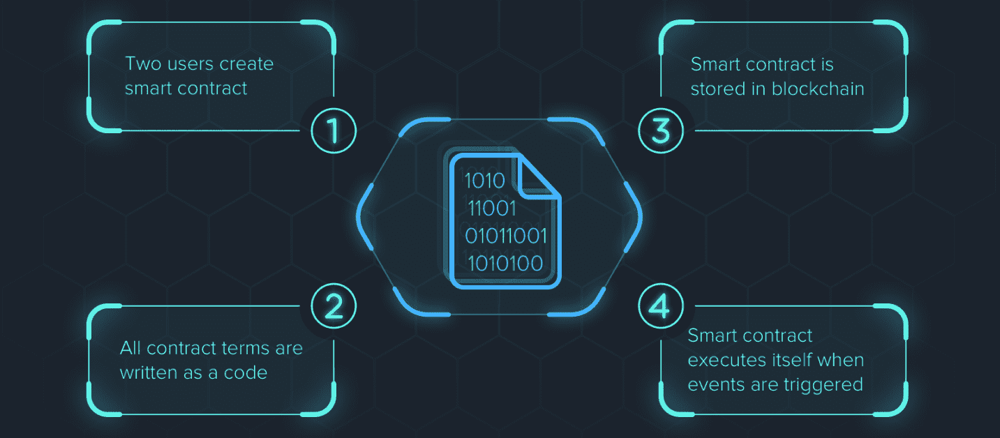

## 听取和同步智能合约交易的好处

在你生活中所做的事情背后有一个强烈的“为什么”是非常重要的。而且，虽然这是你必须自己决定的事情，但了解监听和同步智能合约交易的好处可以帮助你理解为什么它如此重要。因此，在我们动手之前，让我们仔细看看 Web3 同步的好处。

如简介中所述，监听和同步智能合约交易使您能够索引区块链。这是获取实时交易和历史链上数据的方法。有了事务细节，你就可以创建各种各样又酷又有用的 dapps(去中心化应用程序)。此外，通过同步 Web3 合同事件，您可以确保您的 dapps 与区块链互动。无论是在只听模式下还是通过实际触发智能合约中的特定功能。从本质上来说，Web3 同步是一座桥梁，使你能够确保你的用户界面和链上数据协同工作。此外，能够监听智能合约交易和事件是 Web3 同步的起点。

总而言之，通过监听和同步智能合约交易和事件，您可以知道您感兴趣的链上变化何时发生。当然，由你来决定你想关注哪些交易和事件。然而，本质上天空是无限的。当然，每个可编程区块链都有自己的智能合约。不过，由于 Moralis 的跨链互操作性，您可以在一个地方听到所有领先链的智能合同。这包括以太坊、多边形、BNB、链、雪崩等链的测试网和主网。

考虑到倾听和同步 Web3 合同的好处，现在我们来关注一下今天的示例项目。

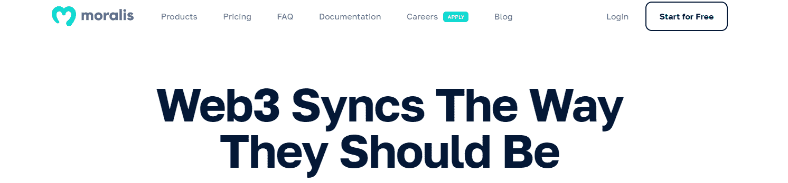

# 利用 Moralis 的 Web3 Syncs 聆听智能合约交易–示例项目

正如简介中所承诺的，我们将首先通过引导您完成初始的 Moralis 设置来帮助您开始。后者也是你进入 Moralis 的 Web3 Syncs 的门票，我们将使用它继续前进。而且，我们会听两个项目的智能合约交易。首先，我们将关注孟买链接令牌的 ERC20 合同(Polygon 的 testnet)。其次，我们将向您展示如何收听自定义智能合约。在这种情况下，我们将关注孟买网络上的示例“捐赠”合同。所以，一定要准备好你的 MetaMask，把孟买和一些 test MATIC 加到你的钱包里。

### 初始 Moralis 设置

按照下面的步骤，让你的 Moralis dapp 启动和运行。这是访问我们的 Moralis Web3 同步功能的先决条件:

1.  使用简介中的“创建您的免费 Moralis 帐户”链接或访问 [moralis.io](https://moralis.io/) 并点击“免费开始”按钮。*如果您已经有一个活动帐户，请使用您的凭据登录:*

2.  在您的 Moralis 管理区，点击“创建新的 Dapp”:

3.  上述步骤启动了三阶段 dapp 设置。正如你在下面的截图中看到的，你首先需要选择环境。如上所述，我们将重点关注 Polygon 的 testnet 因此，选择“测试网”。*但是，当您准备好接触您的用户时，您需要关注“Mainnet”*:

4.  接下来，您需要选择您想要关注的链。同样，如果你想跟随我们的领导，选择“多边形孟买”。*尽管如此，您也可以选择其他链，因为 Moralis 是跨链互操作的*。选择链后，点击“继续”按钮继续:

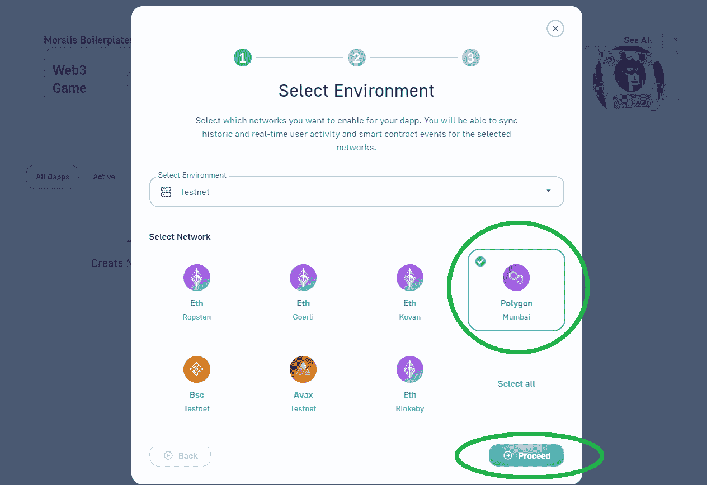

5.  您的 dapp 设置的第二阶段围绕您所在的地区展开。这是你需要选择离你的物理位置最近的城市的地方。简单，用下拉菜单。再次使用“继续”按钮前进:

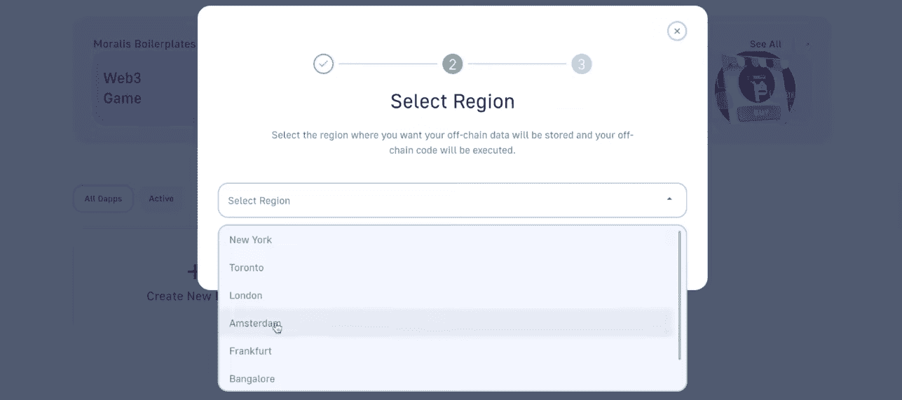

6.  dapp 设置的第三个也是最后一个阶段需要您命名它。这可以是你想要的任何东西；但是，不要过多考虑这一步，因为它没有什么重要作用。将您的 dapp 命名后，点击“创建您的 Dapp”按钮:

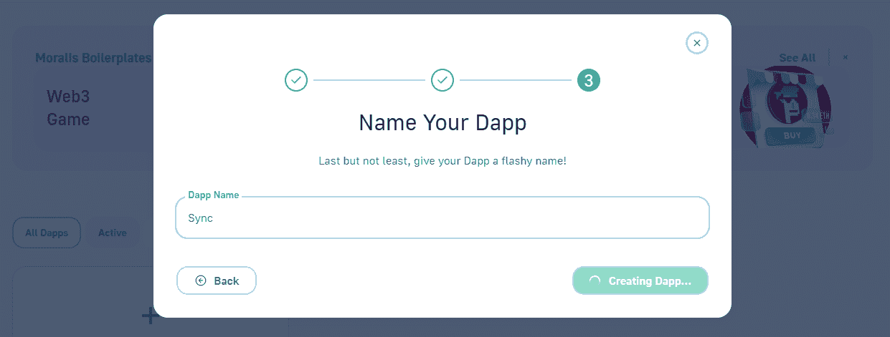

完成以上六个步骤后，你的 dapp 马上就好了。然后，您可以通过“设置”按钮访问所有设置和功能:

最后，您需要选择“Syncs”选项卡，这是我们的工作重点:

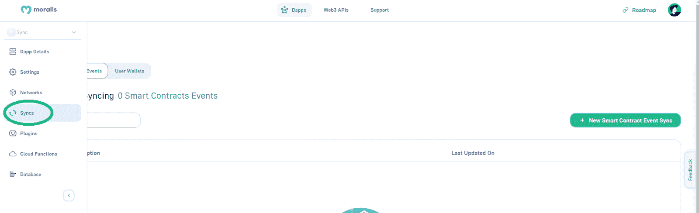

## 如何收听 ERC20 智能合约交易

确保你在你的 Moralis dapp 设置的“同步”标签上(见上面的截图)。接下来，选择“智能合约事件”选项，并使用“新智能合约事件同步”按钮:

接下来，您有四种不同的事件类型可供选择:NFT ERC-1155 事件、NFT ERC-721 事件、令牌 ERC-20 事件和自定义智能合约事件。如前所述，我们将首先关注孟买的链接令牌。因此，确保选择“令牌 ERC-20”事件类型并点击“继续”:

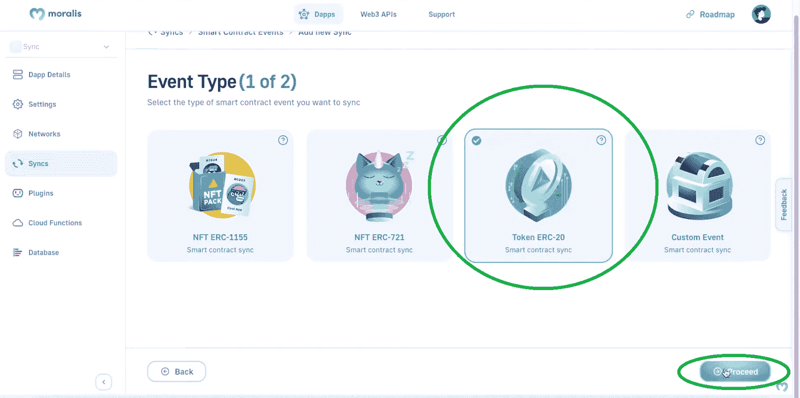

### ERC20 同步设置

接下来，您需要完成同步设置。顶部是最重要的部分，这是您输入智能合同地址的地方:

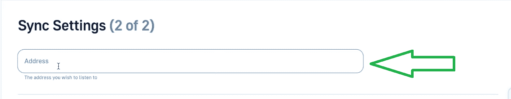

该地址对于监听智能合约交易和事件至关重要。幸运的是，你可以使用区块链探索者获得所有地址，如以太扫描、多边形扫描、BSC 扫描等。在我们的例子中，我们将使用 Polygonscan (Mumbai)来复制链接令牌地址:

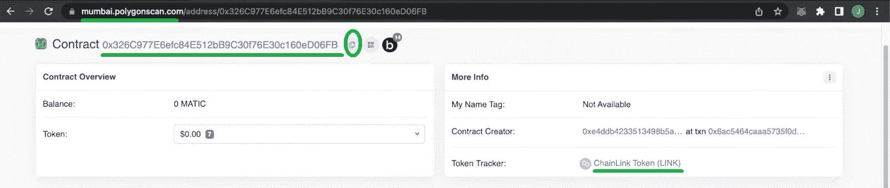

使用上面复制的地址，您需要返回“同步设置”并将其粘贴到指定的输入字段:

然后，你需要选择主题。对于 ERC20 合同，您可以在“批准”和“转让”之间进行选择。但是，既然我们想关注转移，就选择相应的主题:

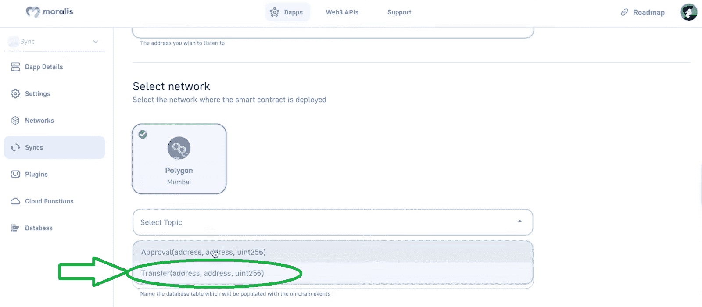

接下来，您必须命名将表示该契约的同步的表。您还需要输入此同步的描述:

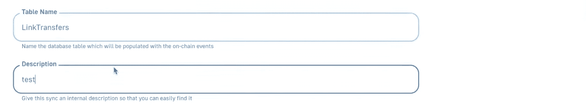

此外，您还可以选择包含历史事件。*所以，如果你需要历史转账或其他已经发生的事件，你需要启用这个选项。此外，您还可以输入想要同步的记录数量*。为了这个例子，让我们启用历史事件，假设我们想要包括三个过去的历史事件。此外，由于我们需要所有的交易，我们将不使用任何过滤器。因此，单击“继续”按钮完成设置:

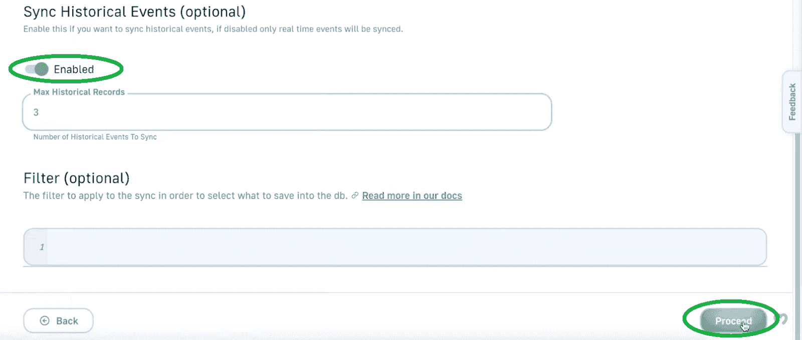

回到“Syncs”选项卡，您现在可以看到上面创建的“LinkTransfers”同步:

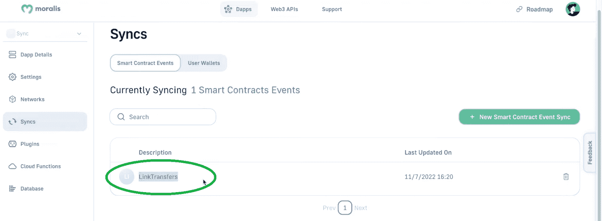

#### Moralis 数据库

当您监听智能合约事件时，您的 Moralis 数据库会进行索引。要访问您的数据库，请转到“数据库”选项卡，然后单击“访问数据库”按钮:

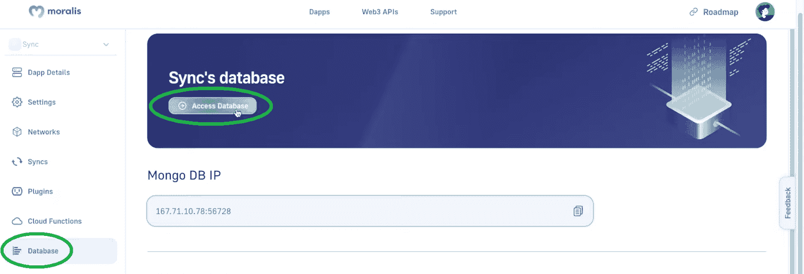

查看数据库中的类，您可以看到“链接转移”。这是我们在上述同步设置中输入的表名。因此，如果选择此类，您应该能够看到自创建此同步以来发生的三次历史传输和所有正在进行的传输:

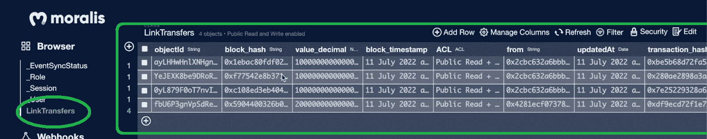

如果您稍等几分钟，您会看到所有新的转接都记录在您的仪表板中。在我们的例子中，在大约 30 分钟内发生了另外 47 次传输，它们都在我们的“LinkTransfers”类中进行了索引:

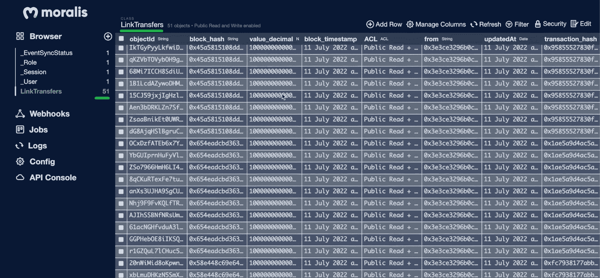

此外，如您所见，该表为我们提供了与同步事件相关的其他有用的详细信息。因此，您可以轻松地将这些细节实现到您的 dapps 中。

## 如何侦听自定义智能合约事件

现在让我们看一个定制事件的同步例子。因此，回到你的 Moralis dapp 设置的“同步”标签。在那里，选择“自定义事件”选项，然后单击“继续”:

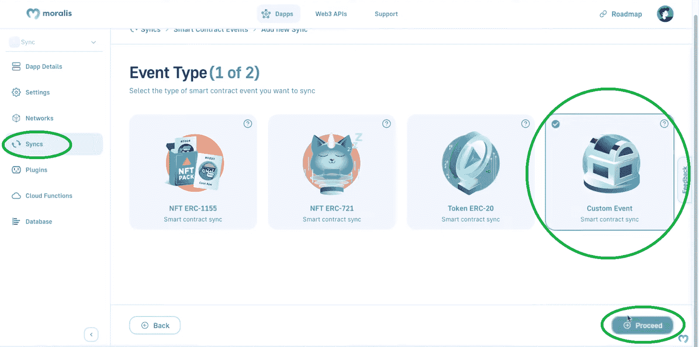

与“ERC20”同步一样，您将再次需要完成设置，从自定义智能合约的地址开始:

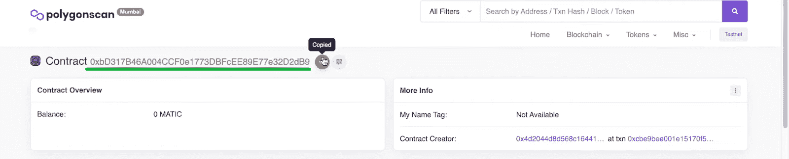

*注* *:由于你很可能没有自己的合同，我们建议你使用我们的合同范本。这份合同允许在孟买进行简单的捐赠。您可以在文章底部的视频中了解有关这一特定智能合约的更多信息，从 5:40 开始。此外，Moralis 家的博客和 YouTube 可以教你如何编译、部署和验证智能合约。*

返回同步设置，将上面复制的地址粘贴到“地址”输入字段:

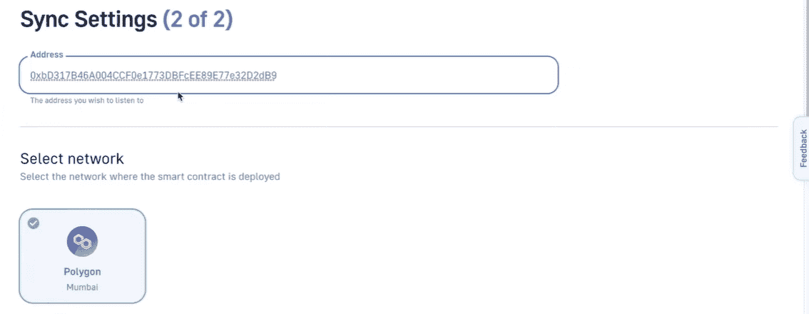

此外，如果你记得我们只在孟买推出 Moralis dapp 因此，会自动选择该网络。接下来，自定义事件同步请求一个[智能合约 ABI](https://moralis.io/what-is-a-smart-contract-abi-full-guide/) :

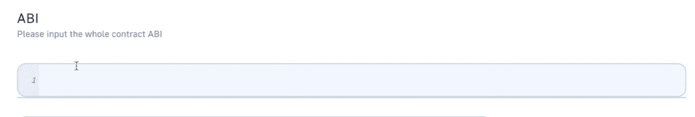

幸运的是，这也是你可以在区块链探险者上找到的经过验证的合同。您只需向下滚动智能合同页面一点点(确保您选择了“代码”选项卡):

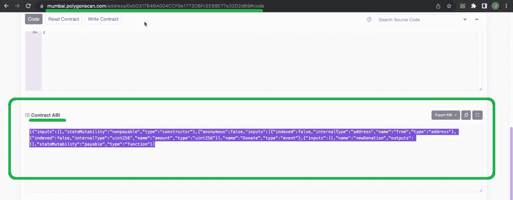

然后，您只需复制您的 Web3 合同的 ABI，并将其粘贴到同步设置内的设计条目字段中:

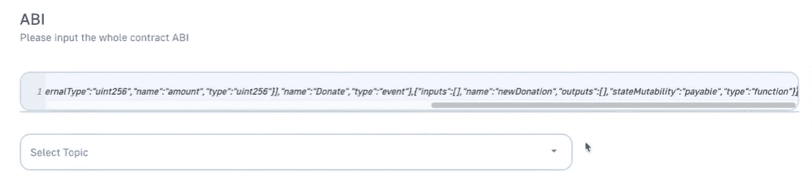

感谢 Moralis' UI，它可以读取输入的 ABI，你可以再次选择主题。对于这个示例捐赠智能合同，只有一个主题:

其余设置遵循 ERC20 示例，因此请确保命名该表并添加描述:

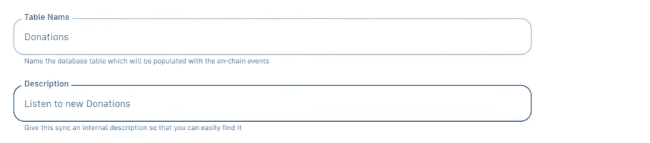

然而，在这个例子中，我们将不包括历史事件。此外，我们也不会使用任何过滤器:

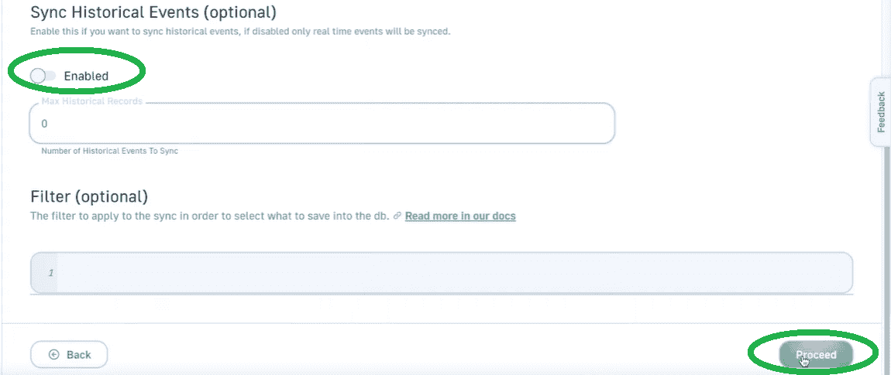

如果我们现在返回到“Syncs”选项卡，这里有两个同步:

我们的 Moralis 数据库也反映了这一点:

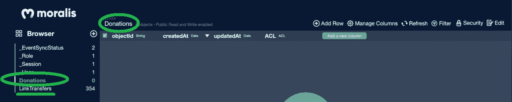

#### 探索我们的捐赠智能合同活动

正如您在上面的截图中看到的，虽然我们确实在捐赠契约中侦听智能契约事件，但是相应的类是空的。这是因为我们禁用了历史事件，并且自从我们开始收听那个智能合约以来，没有执行任何捐赠。然而，一旦我们执行了一个捐赠(下面 7:44 的视频)，一个新的事件被索引到“捐赠”类中:

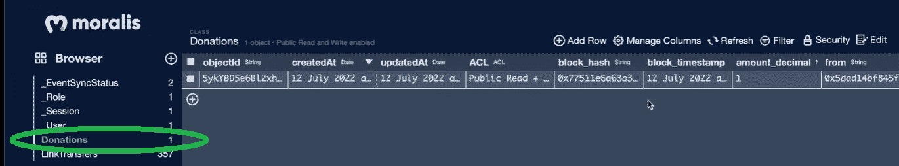

*尽管如此，这是我们在整篇文章中引用的视频:*

https://www.youtube.com/watch?v=-zWqwVutMD4

## 如何实时收听智能合约交易–摘要

今天，您第一次有机会了解听取和同步智能合约事件的好处。然后，我们引导您完成了一个示例项目，您首先学习了如何完成初始的 Moralis 设置。随着 Moralis dapp 的启动和运行，您可以访问 Moralis 的 Web3 同步。这是我们向您展示如何收听智能合约事件的地方。因此，您有机会设置 ERC20 和自定义事件同步。就 NFT 智能合约而言，其步骤与 ERC20 示例大致相同。此外，你也有机会看到 Moralis 的仪表板的力量，它整齐地索引你的同步。

有了这里获得的知识和技能，你就可以将你的 Web3 开发推向下一步了。如果你有自己的智能合约或者其他你想听的现有合约，你现在知道怎么做了。另一方面，你也知道你可以在 [Moralis 的 YouTube 频道](https://www.youtube.com/c/MoralisWeb3)和 [Moralis 的博客](https://moralis.io/blog/)上了解更多关于智能合约的信息。这些渠道还为您提供了无数的范例项目，使您能够将理论付诸实践。本质上，这两个途径可以让你[免费成为一名 Web3 开发者](https://moralis.io/how-to-become-a-web3-developer-full-guide/)。

然而，如果你想尽快成为全职加密员，你应该考虑更专业的方法。如果这能引起你的共鸣，[Moralis 学院](https://academy.moralis.io/)可能就是你要去的地方。除了获得区块链认证，这是你获得个性化学习路径和专家指导的地方。最后但同样重要的是，这也是成为行业中最先进的社区之一的一员的地方。