# 如何用 Ethers.js 听区块链

> 原文：<https://moralis.io/how-to-listen-to-the-blockchain-with-ethers-js/>

使用 ethers.js 等工具监听链上事件的能力是 Web3 开发的重要部分，我们将在本文中进一步探讨！具体来说，我们将说明如何用 ethers.js 听区块链；但是，请注意，开发人员在处理链上事件时可以使用一种更加有效和高效的方法——Moralis 的 [Streams API](https://moralis.io/streams/) 。此外，由于 Moralis 的 Streams API，您不需要收听 ethers.js 的区块链。尽管如此，我们将检查以下两个选项，以便您可以决定哪个选项最适合您的项目需求！

接下来，我们将关注以太坊上的一个区块链演讲示例。首先，我们将使用 ethers.js 监听区块链。然后，我们将处理相同的链上事件，但使用 Moralis Streams API。因此，您将看到如何通过实现一些简单的代码片段来使用这个优秀的工具。此外，我们还将向您展示如何通过简洁的 UI 使用 ethers.js 和 Streams API 来收听区块链。

最后，本文将帮助您开始有效地利用链上事件。此外，它将扩大你的区块链发展视野，让你熟悉 Moralis。因此，你将准备好开始创建各种 dapps，进而加入 Web3 革命。因此，只需[创建您的免费 Moralis 账户](https://admin.moralis.io/register)并跟随我们的脚步！

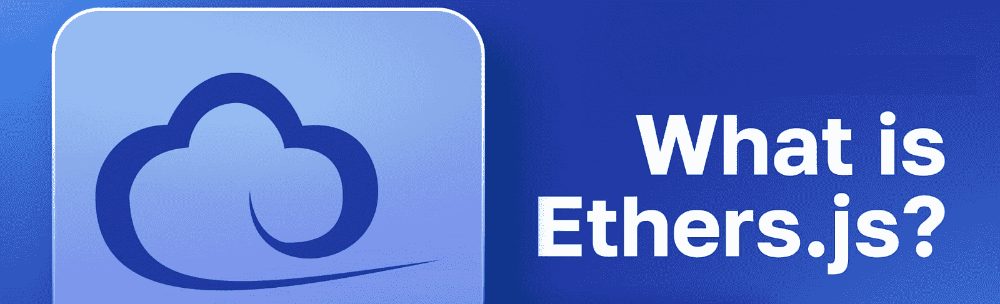

### 什么是 Ethers.js？

那么，[什么是 ethers.js](https://moralis.io/full-guide-what-is-ethers-js/) ？正如“JS”所暗示的，ethers.js 是一个 JavaScript (JS)库。它旨在为希望与以太坊链交互的开发者提供一个完整而简洁的解决方案。这个 JS 库也支持其他 EVM 兼容的可编程区块链。此外，除了 JavaScript 支持，该库还包括 TypeScript (TS)中的实用函数。

最终，ethers.js 库旨在通过提供许多有用的特性来实现其目标。它的一个特性使您能够使用 JSON-RPC、Etherscan、MetaMask、Infura、Alchemy 或 Cloudflare 连接到以太坊节点。此外，当您想用 ethers.js 听区块链时，与节点的连接至关重要

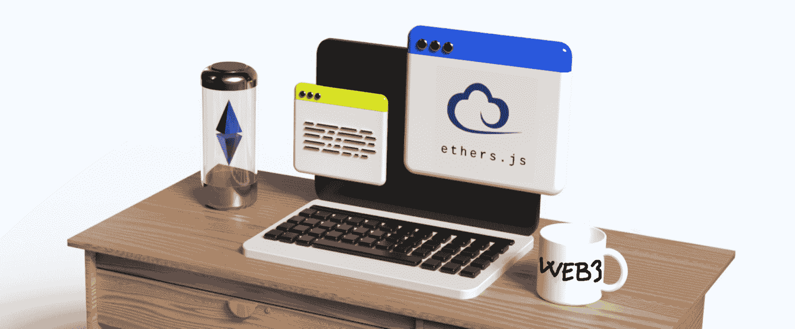

此外，这个 JS 库还提供了许多其他特性:

*   将您的私钥安全地保存在您的客户端中。
*   导入和导出 JSON 钱包(例如 Geth 和奇偶校验)。
*   用元类从任何契约 ABI 创建 JavaScript 对象，包括 ABIv2 和 ethers 的人类可读 ABI。
*   导入和导出多种语言的 BIP 39 助记短语(12 字备份短语)和高清钱包。
*   使用 ENS 名称作为一等公民(他们可以在任何可以使用以太坊地址的地方使用)。
*   最小尺寸。
*   为您的所有以太坊需求提供完整的功能。
*   附带大量文档。
*   包括大量维护的测试用例。
*   Ethers.js 完全支持 TypeScript 它包括定义文件和完整的 TS 源代码。
*   附带包含所有依赖项的开源 MIT 许可证。

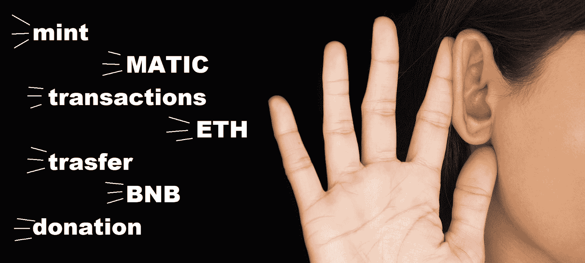

## 为什么要听区块链？

在这一点上，所有的技术专家都认为区块链是未来。它将继续存在，并将彻底改变世界的运作方式。毕竟，以这样或那样的方式，它将成为大多数领先行业的重要组成部分。也就是说，就目前而言，以下四个原因仍然是开发人员应该听取链上事件的主要动机:

*   **创建鲸鱼警报**–可以设置自动触发器，在特定加密货币的数量增加时执行。
*   **构建自动化机器人**–开发人员可以使用链上事件来触发机器人(例如，不和谐机器人)并发布与实时链上变化相关的消息。
*   **监控 NFT 集合**–不可替代令牌(NFT)仍然是最受欢迎的区块链用例之一。
*   **Web3 游戏通知**–web 3 游戏刚刚起步，链上事件将在玩家拥有的游戏未来中发挥重要作用。

因此，无论使用 ethers.js 或其他工具监听区块链的主要目的是什么，您的目标都是在特定链上事件发生时自动执行操作。因此，你用来听区块链的工具必须是有效和高效的。理想情况下，它还应该提供高级选项，比如过滤。因此，您应该确定 ethers.js 是否是适合您的工具。

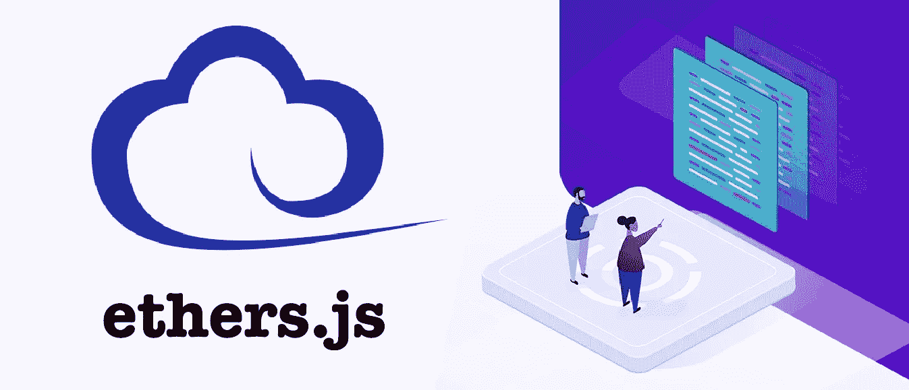

## 用 Ethers.js 听区块链–示例

下面，您可以看到我们的示例“index.js”脚本的完整代码，该脚本使我们能够通过 ethers.js 监听区块链。我们使用最上面一行来确保该 NodeJS 文件使用 ethers.js。接下来，我们导入应用程序二进制接口(ABI)。也就是说，“ *getTransfer* ”异步函数完成了监听区块链的主要工作。后者侧重于 USDC 合同地址。在函数内部，我们使用 ethers.js 库的“ *WebSocketProvider* 端点。这个端点使我们能够定义我们将使用哪个节点提供者。当然，我们需要获得提供者密钥来实际使用它。此外，正如你在下面看到的，我们在这个例子中使用了炼金术。我们还将我们的炼金术密钥存储在”。env "文件下的" *ALCHEMY_KEY* 变量。

*注意* *:如果您决定收听 Ethers.js 的区块链，请确保您选择了支持您想要关注的链的节点提供者。*

在“ *getTransfer* ”函数中，我们还定义了要使用哪个合同、ABI 和提供者。最后，我们设置监听传输事件的监听器。侦听器还将控制台记录传输的详细信息。后者包括从、*到*、*值*、*事件数据*。不幸的是，ethers.js 没有解析数据的能力。

### 我们的示例脚本及其结果

以下是我们的示例脚本，您可以使用 ethers.js 收听区块链:

```js
const ethers = require("ethers");
const ABI = require("./abi.json");
require("dotenv").config();

async function getTransfer(){
    const usdcAddress = "0xA0b86991c6218b36c1d19D4a2e9Eb0cE3606eB48"; ///USDC Contract
    const provider = new ethers.providers.WebSocketProvider(
        `wss://eth-mainnet.g.alchemy.com/v2/${process.env.ALCHEMY_KEY}`
    );

    const contract = new ethers.Contract(usdcAddress, ABI, provider);

    contract.on("Transfer", (from, to, value, event)=>{

        let transferEvent ={
            from: from,
            to: to,
            value: value,
            eventData: event,
        }

        console.log(JSON.stringify(transferEvent, null, 4))

    })
}

getTransfer()
```

我们使用“ *node index.js* ”命令运行上面的脚本。然后，我们可以在终端中看到结果，就像这样:

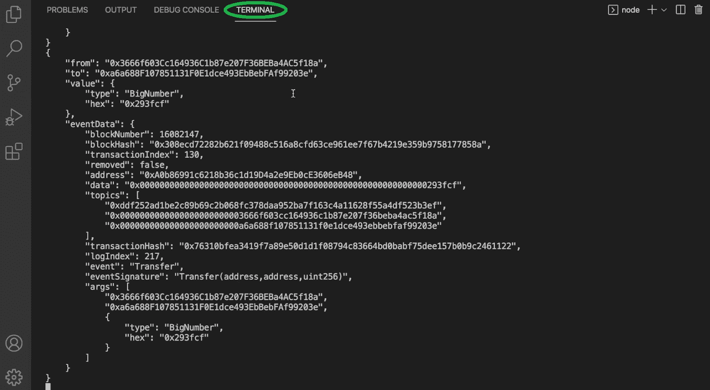

如果你看看上面的数据，你会发现它包含了相当多的信息。然而，虽然上面是一个很好的开始，但是数据没有被解析。因此，您需要投入相当多的时间和精力来正确处理它。幸运的是，有一个可靠的替代方法可以让你监听链上事件的任务简单很多。

## Ethers.js 监听链上事件的替代方法

在上一节中，您可以看到 ethers.js 在运行。当您使用 ethers.js 收听区块链时，您可以获得实时事件，还可以覆盖多个链。因此，可以肯定地说，这个库是收听区块链的一个不错的开源解决方案。然而，ethers.js 有几个限制，这会阻碍您创建 dapps。

首先，它不能为您提供 100%的可靠性，因为您需要提供单独的节点提供者。那些节点提供者可能只支持您想要关注的一些链。此外，您需要确保这些节点保持活动状态。Ethers.js 也不允许过滤事件，也不允许使用多个地址。相反，您必须为所有协定创建单独的侦听器。另外，ethers.js 不提供监听钱包地址的选项。最后，正如上面指出的，当您使用 ethers.js 收听区块链时，您收到的数据不会被解析。

话虽如此，你必须承认，如果有一个替代方案涵盖所有这些额外的选项，那就太好了。毕竟，这将使收听链上事件变得更加用户友好。


幸运的是，Moralis 的 Streams API 填补了 ethers.js 留给你的所有空白。因此，除了跨多个链的实时事件之外，Moralis 确保了 100%的可靠性，因为您不需要担心节点提供商。此外，Moralis 允许您过滤事件，将多个地址汇集到一个流中，并监听钱包地址。Moralis 甚至为您解析数据。因此，您不需要处理额外的数据处理。

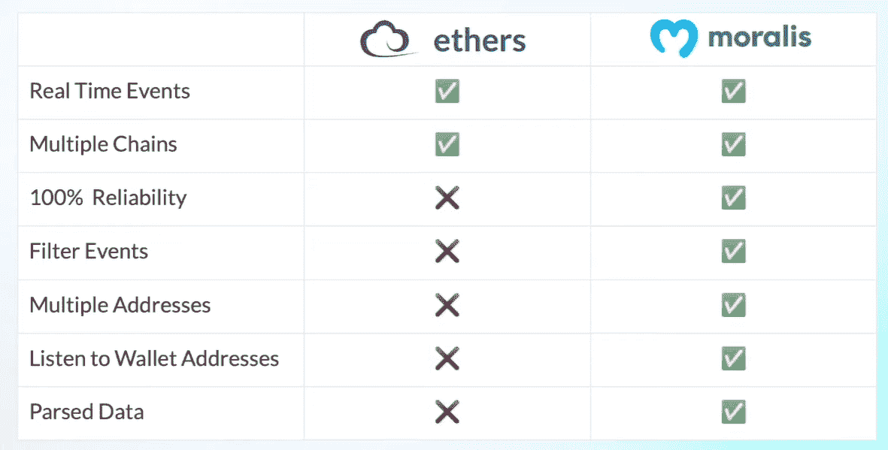

## 使用 Moralis 的 Streams API 聆听区块链–示例

在这一节中，我们将集中讨论同样的事件——以太坊上的任何 USDC 转会——如上。但是，我们将使用 Moralis 的 Streams API，而不是使用 ether.js。因此，我们创建另一个“index.js”文件来导入 Moralis 及其实用程序:

```js
const Moralis = require("moralis").default;
const Chains = require("@moralisweb3/common-evm-utils");
const EvmChain = Chains.EvmChain;
const ABI = require("./abi.json");
require("dotenv").config();

const options = {
  chains: [EvmChain.ETHEREUM],
  description: "USDC Transfers 100k",
  tag: "usdcTransfers100k",
  includeContractLogs: true,
  abi: ABI,
  topic0: ["Transfer(address,address,uint256)"],
  webhookUrl: "https://22be-2001-2003-f58b-b400-f167-f427-d7a8-f84e.ngrok.io/webhook",
  advancedOptions: [
    {
        topic0: "Transfer(address,address,uint256)",
        filter: {
            gt : ["value", "100000"+"".padEnd(6,"0")]
        }
    }
]

};

Moralis.start({
  apiKey: process.env.MORALIS_KEY ,
}).then(async () => {
  const stream = await Moralis.Streams.add(options);
  const { id } = stream.toJSON();

  await Moralis.Streams.addAddress({
      id: id,
      address: ["0xA0b86991c6218b36c1d19D4a2e9Eb0cE3606eB48"]
  })
});
```

上面的脚本使用了相同的 ABI。此外，您可以看到 Streams API 提供的选项。首先，它允许您选择一个或多个支持的区块链。毕竟，Moralis 是关于跨链互操作性的，并且支持所有领先的链。

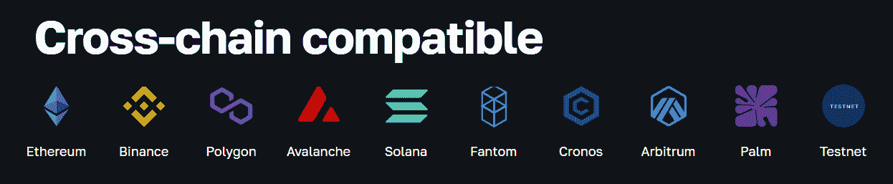

然而，正如你所看到的，对于这个例子，我们主要关注以太坊。除了" *chains* "选项，我们还需要定义一个描述、一个标签、一个 ABI、一个主题和一个 webhook URL。关于后者，您可以在开发时使用 ngrok 为您的本地主机创建一个隧道。

继续我们的示例脚本，我们需要初始化 Moralis。这就是我们需要使用 Moralis Web3 API 密钥的地方。我们通过创建一个免费的 Moralis 账户来访问我们的管理区。从那里，我们开始分两步复制我们的 Web3 API，如下图所示:

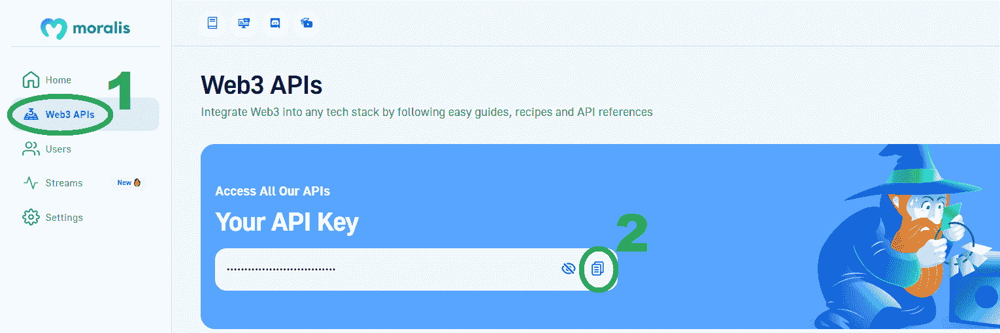

我们将我们的 Moralis Web3 API 密钥粘贴到。env "文件旁边的" *MORALIS_KEY* "变量。然后，我们用上述选项创建我们的流。尽管如此，我们可以使用“*addaddaddress*”端点简单地添加我们想要监听的所有地址。在我们的示例脚本中，我们只关注 USDC 合同地址。但是，我们也可以添加其他地址(同时监听 USDC 和 USDT 的传输):

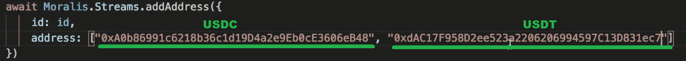

最后，为了查看结果，我们运行“ *node index.js* ”命令。

### 探索 Moralis 之流

运行上述脚本后，我们可以在 Moralis 仪表板中看到" *usdcTransfers* "流:

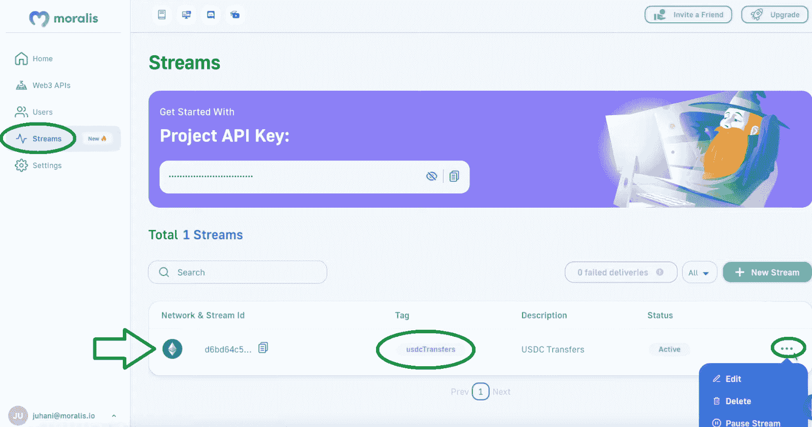

这也是我们可以暂停编辑流的地方。尽管如此，如上图中的“新建流”按钮所示，我们也可以使用管理 UI 创建流。现在，让我们也在控制台中探索我们的流的结果:

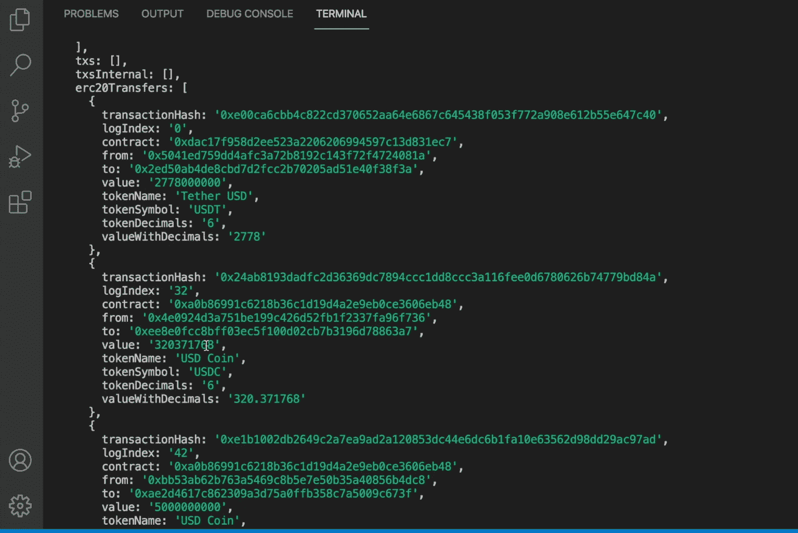

看上面的截图，你可以看到我们已经解析了数据。此外，除了交易散列和“从”和“到”地址，我们的结果为我们提供了转移的价值。

为了进一步探索我们的示例流的结果，请看下面的视频，从 8:43 开始。在该视频中，您将看到 API 提供的事件过滤器的强大功能(11:51)。最后但同样重要的是，请务必使用 [*Moralis 的 Web3 Streams API 文档*](https://docs.moralis.io/docs/streams-api) *来了解关于这个强大的 Web3 API 的更多信息。*

[https://www.youtube.com/embed/e3k8MaJG1OA?feature=oembed](https://www.youtube.com/embed/e3k8MaJG1OA?feature=oembed)

## 如何用 Ethers.js 听区块链——总结

在今天的文章中，你有机会学习如何用 ethers.js 听区块链。我们首先确保你知道 ethers.js 是什么。然后，您能够跟随我们的领导，创建一个示例 NodeJS 脚本来使用这个 JS 库获取链上数据。因此，您发现您需要使用一个支持您想要关注的链的节点提供者。接下来，我们看了一个 ethers 替代品，您发现了是什么让 Moralis 的 Streams API 如此有价值。最后但同样重要的是，您有机会看到了一个运行中的示例流，并且您还学习了如何获得您的 Moralis Web3 API 密钥，以及如何使用 Moralis admin UI 来编辑、暂停和创建新的流。

根据本文中获得的知识，您现在可以开始使用链上事件作为 dapps 的各种触发器了。除了 Streams API，Moralis 还为您提供了终极的 [NFT API](https://moralis.io/nft-api/) 、[令牌 API](https://moralis.io/token-api/) 和 [Web3 认证 API](https://moralis.io/authentication/) 。因此，您拥有处理各种 dapp 开发项目所需的所有工具。如需更多指导和练习，请使用 Moralis 文档和 [Moralis YouTube 频道](https://www.youtube.com/c/MoralisWeb3)。如果你想探索区块链发展的其他话题，Moralis 的博客[是个好去处。一些最新的文章关注于](https://moralis.io/blog/) [Web3 存储](https://moralis.io/web3-storage-how-web3-data-storage-works/)、 [ethers.js vs Web3 流](https://moralis.io/ethers-js-vs-web3-streams-the-best-option-for-blockchain-developers/)、 [Palm NFT 工作室](https://moralis.io/exploring-the-palm-network-what-is-palm-nft-studio/)等等。另外，如果您对以太坊的开发最感兴趣，请务必阅读我们的文章，探索 [Goerli ETH](https://moralis.io/goerli-eth-what-is-the-goerli-testnet/) 和[se polia testnet](https://moralis.io/sepolia-testnet-guide-what-is-the-sepolia-testnet/)！

此外，你应该考虑通过注册[Moralis 学院](https://academy.moralis.io/)来采取更专业的方式来接受你的加密教育。在那里，你会找到大量令人惊叹的区块链发展课程，我们建议你从[区块链和比特币基础](https://academy.moralis.io/courses/blockchain-bitcoin-101)开始。