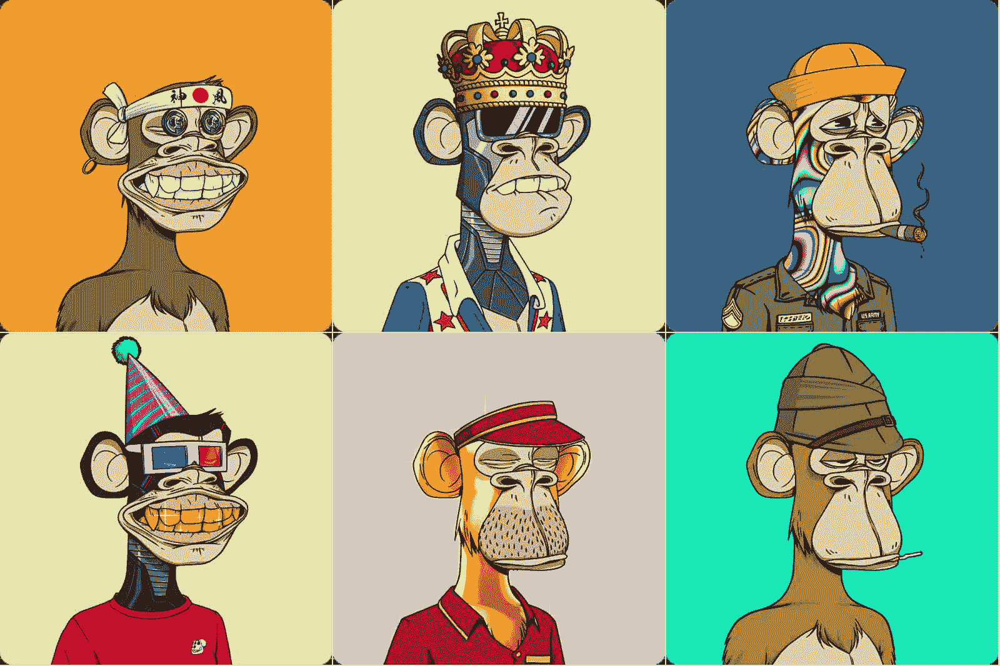
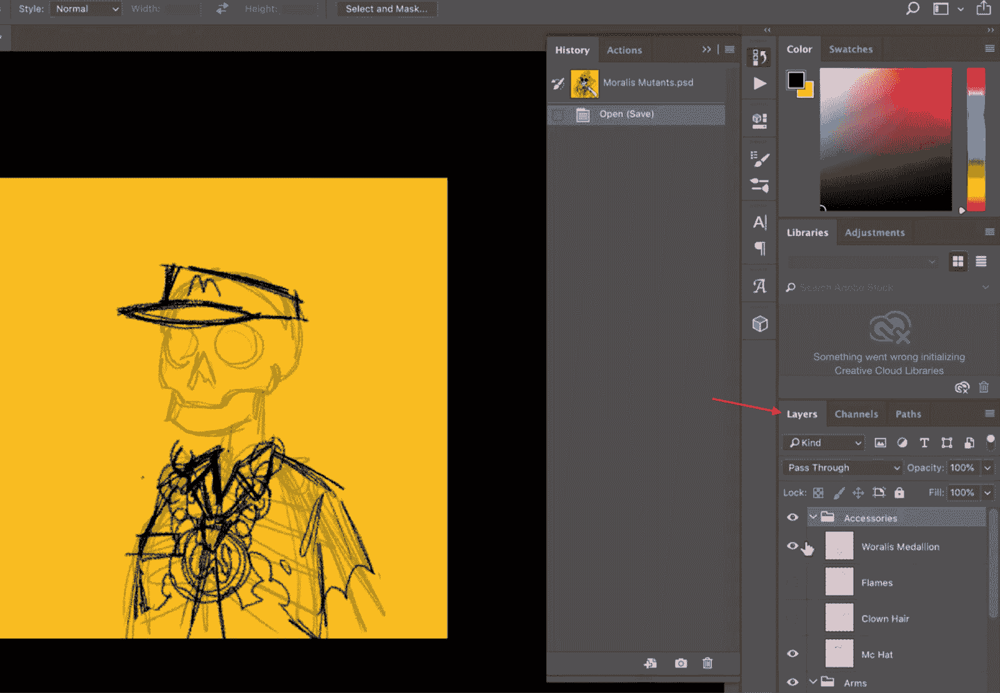
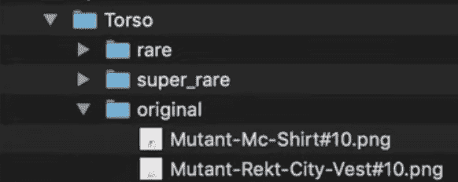
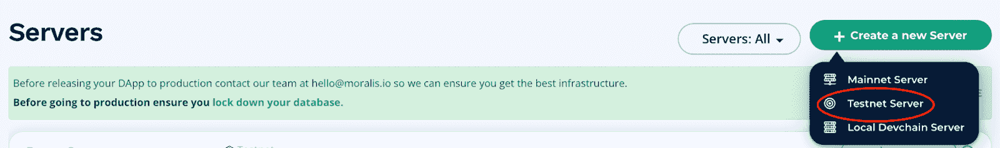
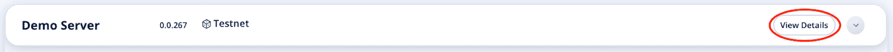
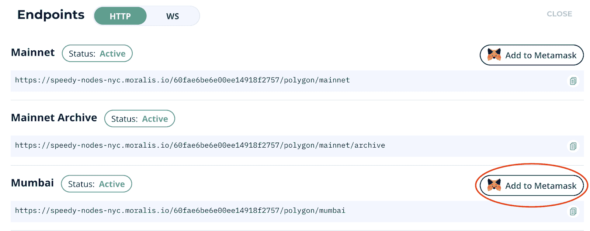
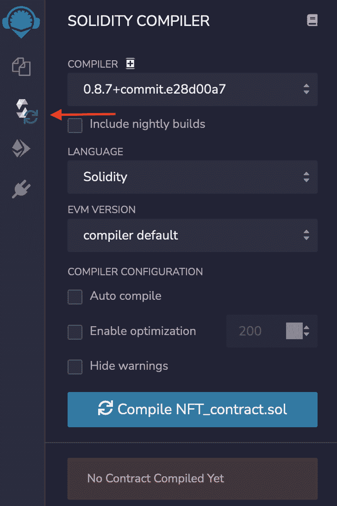
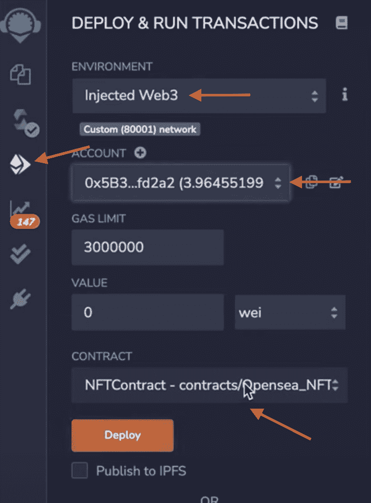

# 如何铸造 10，000 个 NFT–完整演练

> 原文：<https://moralis.io/how-to-mint-10000-nfts-full-walkthrough/>

在这篇文章中，我们将分解如何铸造 10，000 个 NFT 的过程。为了使教程更容易理解，我们将使用一个已经准备好的 NFT 铸造引擎的 Moralis 模板。因此，如果您想跳过教程，立即仔细查看 GitHub 库，请查看以下链接:

**全 https://github.com/ashbeech/moralis-mutants-nft-engine 发动机文档——**[](https://github.com/ashbeech/moralis-mutants-nft-engine)

****NFT(不可替代的令牌)是 [Web3 开发](https://moralis.io/how-to-build-decentralized-apps-dapps-quickly-and-easily/)中最激动人心的特性之一，利用这些令牌产生了许多创新的想法。加密领域最热门的趋势之一是数字收藏品。这些是批量生成的 NFT，用于创建包含数千个令牌的集合。两个最突出的例子是[无聊猿游艇俱乐部](https://opensea.io/collection/boredapeyachtclub)和[隐朋克](https://opensea.io/collection/cryptopunks)。这些收藏品包含了大约 10，000 件完全独特的 NFT，其中一些卖出了天文数字的价格。由于这一领域令人难以置信的成功，我们将仔细看看如何铸造 10，000 枚 NFT，并用[Moralis](https://moralis.io/)创造你自己的一系列代币。****

****在下面的教程中，我们将利用 Moralis 操作系统来创建一个 NFT 集合。作为 Moralis 的用户，我们可以接入平台的后端基础设施，立即创建我们自己的收藏！****

****此外，除了已经开发的 Moralis 后端基础设施，该平台还提供了宝贵的开发工具，如 [Moralis Speedy Nodes](https://moralis.io/speedy-nodes/) ，对 [IPFS](https://moralis.io/what-is-ipfs-interplanetary-file-system/) 的本地支持， [NFT API](https://moralis.io/ultimate-nft-api-exploring-moralis-nft-api/) ，[价格 API](https://moralis.io/introducing-the-moralis-price-api/) 等等。****

****所以，如果你想成为一名区块链开发者，你旅程的下一步就是注册 Moralis。加入该平台将允许您显著减少所有未来区块链项目的开发时间！****

## ****如何在 3 个步骤中创造 10，000 个非功能性食物****

****在本教程中，我们将分解创建 10，000 个 NFT 集合的过程。因此，如果您还没有，我们建议您在继续之前熟悉 NFTs。您可以从下面的文章中获得这些令牌的完整分类:“[什么是 NFT？](https://moralis.io/non-fungible-tokens-explained-what-are-nfts/)”。然而，如果你对你的 NFT 知识感到满意，那么跟随我们带你完成整个过程！****

****

为了使本教程更容易理解，我们将把这个过程分成以下三个步骤:

1.  创建艺术层
2.  生成艺术
3.  铸造 10，000 NFT

我们将使用已经准备好的 Moralis 模板和已经开发的 NFT 生成引擎来节省时间和资源。所以，没有进一步的麻烦，让我们进入这个过程，开始创建艺术层，我们可以直接进入 NFT 引擎！

然而，如果你更想看解释整个过程的视频，那么就看下面来自 [Moralis YouTube 频道](https://www.youtube.com/channel/UCgWS9Q3P5AxCWyQLT2kQhBw)的三个片段:

**第一部分:**

https://www.youtube.com/watch?v=KBV4FrCv4ps

**第二部分:**

https://www.youtube.com/watch?v=FcH7qXnOgzs

**第三部分:**

https://www.youtube.com/watch?v=32LHYSyv6Ko

## 第一步:如何铸造 10，000 个 NFTs 创建艺术层

这些 NFT 收藏中的艺术品是由电脑生成的作品，由不同的艺术层组合而成。根据你的收藏意图，这些层次会有所不同；然而，仅举几个例子，它们可以是背景、服装、眼睛、鼻子、配饰等。因此，我们流程的第一步是创建这些图层，我们可以使用它们来生成独特的数字艺术作品。

要启动这个过程，我们首先需要访问 GitHub 页面，并将所有文件克隆到我们的本地目录。在这一步中，我们将重点关注" [Moralis Mutants.psd](https://github.com/ashbeech/moralis-mutants-nft-engine/blob/main/Moralis%20Mutants.psd) "文件，它包含了我们应该如何构建层的模板。因此，您可以通过在首选编辑软件中打开文件来继续。在我们的例子中，我们将使用 Photoshop。



该文件已经包含一些层，如配件，眼睛，手臂等。然而，我们对现有的层并不感兴趣；我们想要文件的结构。这是因为这些层应该完全取决于你对最终产品的看法。因此，在设计各层之前，在头脑中有一个清晰的画面和 NFTs 的最终主题是至关重要的。

此外，在创建图层时，您应该记住想要创建的唯一 NFT 的数量。例如，如果你的目标是生产 10，000 件艺术品，你将需要比你单独开始创建 10 个更大数量的独特层。

### 导出文件

一旦你设计好了所有的图层，这个初始步骤的下一步就是将每个图层导出到单独的文件中。我们需要所有层分开，在单独的文件，因为这将允许我们的引擎结合这些，并生成独特的艺术作品。

导出文件相对简单，如果你也使用 Photoshop，你需要做的就是点击界面顶部的“文件”按钮。接下来，导航到“导出”并点击“层到文件”。

这将把你所有的层导出到单独的文件中。现在，第一步要做的就是将它们分类到不同的文件夹中。我们将为每个不同的层类别准备一个。比如，一个是“鼻子”，一个是“配件”，等等。



反过来，文件夹也应该具有特定的结构。每个文件夹应包含三个附加文件夹:“原始”、“稀有”和“超级稀有”。然后，由你根据你希望它们有多稀有来对每一层进行分类。

## 第二步:如何铸造 10，000 个 NFTs 生成艺术

在第二步中，我们实际上是要生成艺术，在第三步中，将用于铸造 10，000 个 NFT。然而，在真正创作艺术之前，我们需要提前做两件事。首先，我们需要创建一个 Moralis 服务器。一个服务器将提供我们需要的所有必要的工具来创建艺术作品并将文件上传到 IPFS。其次，我们还必须对将生成艺术的 NFT 引擎进行一些配置

### 如何创建 Moralis 服务器

你要做的第一件事是注册 Moralis。这是完全免费的，只要您登录您的帐户，我们就可以开始了。

要启动一个实例，可以单击 Moralis 界面顶部的“+ Create a new Server”按钮。按下这个按钮将打开一个下拉菜单，有三种不同的选择。在这种情况下，由于这是一个教程，我们将选择一个 testnet 服务器。这是有益的，因为它允许我们创建 NFT 而不用支付任何天然气费用，这将为我们提供在投入 mainnet 之前把事情做好的奢侈。



一旦选择了所需的服务器类型，将会打开一个额外的窗口，您需要在其中进行一些选择。在我们的例子中，我们选择了 Polygons 的 Mumbai testnet，如果你想跟随，我们建议你也这样做。


输入完所有信息后，剩下的工作就是点击“Add Instance”按钮让服务器开始运行。

### 输入配置

现在，有了我们可以支配的服务器，我们可以继续对引擎进行一些配置，以生成艺术作品。首先，如果你还没有，你可以从 GitHub 中克隆代码，并将其添加到你的 IDE(集成开发环境)中。

有了代码的本地副本，下一步是导航到“ [config.js](https://github.com/ashbeech/moralis-mutants-nft-engine/blob/main/input/config.js) ”文件，您可以在“input”文件夹中找到它。进入该文件后，您可以向下滚动到“开始收集配置”部分。

您应该仔细检查这些元素，确保它们符合您的开发需求。然而，我们需要关注的三个最重要的部分是更改“baseImageUri”、“editionSize”和“layers”常量。

“baseImageUri”应该等于您的 Moralis 服务器 URL。要找到这些信息，您需要做的就是单击有问题的服务器的“View Details”按钮，并将它复制粘贴到代码中。此外，您还想更改“editionSize”。如果您想要创建 10，000 个 NFT，这个常量应该设置为这个数量。

### 层

最后，您还需要确保“层”常量的结构是正确的。最初，“层”看起来是这样的:

*常量层= [*

*addLayer("Background "，{ x: 0，y: 0 }，{ width: width，height: height })，*

*添加层("基础躯干")，*

*addLayer("Base Head ")，*

*添加层("躯干")，*

*addLayer("Arms ")，*

*addLayer("嘴巴")，*

*addLayer("眼睛")，*

*addLayer("配件")，*

*添加层("鼻子")，*

*]；*

该常量的元素应该与您在本教程的第一步中创建的层相对应。此外，离你的艺术作品最远的“后面”层应该在列表的顶部。正如你从上面的例子中看到的，我们从“背景”开始，然后在上面添加更多的层。如果“背景”在代码的底部，它将覆盖其余的层。

### 发动机配置

完成对“config.js”文件的正确配置后，我们可以继续对 NFT 引擎进行最后的更改。为此，您需要导航到" [index.js](https://github.com/ashbeech/moralis-mutants-nft-engine/blob/main/index.js) "文件，该文件是代码的核心部分。这部分编译一切，包括层，并创建 [JSON](https://moralis.io/json-explained-what-is-json-javascript-object-notation/) 文件。除此之外，它还把所有东西上传到 IPFS 和你的 Moralis 服务器上。然而，我们不会更深入地研究实际的引擎是如何工作的，而是仔细看看我们需要注意的必要配置。

我们可以继续向下滚动到“//Moralis 信用”部分:

```js
// Moralis creds
const serverUrl = process.env.SERVER_URL;
const appId = process.env.APP_ID;
const masterKey = process.env.MASTER_KEY;
const apiUrl = process.env.API_URL;
// xAPIKey available here: https://deep-index.moralis.io/api-docs/#/storage/uploadFolder
const apiKey = process.env.API_KEY;
```

我们需要在这里做一些改动。首先，您可以添加服务器 URL、应用程序 ID 和主密钥。同样，可以通过导航回 Moralis 并单击相关服务器的“查看详细信息”按钮来找到此信息:



最后，您还需要添加一个 API URL 和密钥，这可以从我们在本节前面给出的代码中的地址获取。

### 生成艺术作品

对“config.js”和“index.js”文件的所有配置完成后，我们可以简单地继续并开始生成艺术品。这相对简单，您只需在终端中输入以下内容:

```js
node index.js
```

一旦你按下回车键，代码将运行并生成指定数量的艺术作品。然而，如果你正在生成 10，000 件艺术品，上传到 IPFS 可能需要一段时间。但是不用担心；它们将很快被最终确定。一旦一切完成，我们就可以继续铸造实际的 NFT。

## 第三步:如何铸造 10，000 个 NFT——铸造 10，000 个 NFT

随着我们的艺术生成，本教程的第三部分，也是最后一部分，是铸造实际的 NFTs。然而，要创建 NFT，我们需要几样东西。我们要做的第一件事是创建一个 MetaMask 帐户，更改网络，并在钱包中添加一些“play”MATIC。所以，让我们先来仔细看看[元掩码](https://moralis.io/metamask-explained-what-is-metamask/)。


### 设置元掩码

如果您没有，那么您需要做的第一件事就是创建一个元掩码帐户。这非常简单，您需要做的就是按照扩展提供的步骤操作。一旦你有一个帐户，下一步是改变元掩码网络。在我们的例子中，我们想切换到 Mumbai testnet，因为这是我们在创建服务器时选择的网络。

然而，孟买不会是 MetaMask 的默认网络之一，这意味着我们需要将它添加到我们的钱包中。当与 Moralis 家一起工作时，这变得非常容易。你所需要做的就是导航到 Moralis 管理面板中的“Speedy Nodes”选项卡，点击多边形网络的“Endpoints”按钮，最后点击 testnet 的“Add to MetaMask”按钮。然后，剩下的就是确保在 MetaMask 中选择它。



因此，在选择了当前网络的情况下，我们还需要在钱包中添加一些 MATIC。因为我们正在使用一个测试网，所以有可能通过一个[多边形龙头](https://faucet.polygon.technology/)来实现。你所需要做的就是输入你的钱包地址，然后收到一些“假”邮件作为回报。然而，重要的是要注意，这些只适用于 testnet，而不是真正的 MATIC。

### 创建智能合同

接下来，我们需要一个智能合同，我们可以用它来创建非功能性交易。在这种情况下，我们将利用一个已经开发好的契约:“ [NFTcontract.sol](https://github.com/ashbeech/moralis-mutants-nft-engine/blob/main/NFTContract.sol) ”。我们将利用 [Remix](https://remix.ethereum.org/#optimize=false&runs=200&evmVersion=null) 来创建这个合同，因为这使得合同的编译和部署更加容易。完整的合同看起来是这样的:

```js
// SPDX-License-Identifier: MIT
pragma solidity ^0.8.0;

//import 1155 token contract from Openzeppelin
import "https://github.com/OpenZeppelin/openzeppelin-contracts/blob/master/contracts/token/ERC1155/ERC1155.sol";
import "https://github.com/OpenZeppelin/openzeppelin-contracts/blob/master/contracts/utils/math/SafeMath.sol";
import "https://github.com/OpenZeppelin/openzeppelin-contracts/blob/master/contracts/access/Ownable.sol";

// Example contract to be deployed via https://remix.ethereum.org/ for testing purposes.

contract NFTContract is ERC1155, Ownable {
    using SafeMath for uint256;

    constructor()
        ERC1155(
            "ipfs://INSERT_YOUR_CID_METAHASH/metadata/{id}.json" // You can get this saved in dashboard of your Moralis server instance.
        )
    {
        // account, token_id, number
        _mint(msg.sender, 1, 1, "");
        _mint(msg.sender, 2, 1, "");
        _mint(msg.sender, 3, 1, "");
    }
```

但是，在编译和部署合同之前，我们必须进行一些调整。如您所见，我们首先需要的是文件的“CID”。您可以通过访问 Moralis 服务器的仪表板找到此 CID。要访问仪表板，您只需单击服务器的“仪表板”按钮。从这里，您可以简单地复制 CID 并用 CID 替换“INSERT_YOUR_CID_METAHASH”。

最后，从上面的代码中可以看出，这仅适用于铸造三个 NFT。因此，您需要创建一个包含所有 PNG 和 JSON 文件的循环。所以，如果你有 10，000 件独特的艺术品，你的循环需要把它们都包括进去。

### 编译和部署

随着对[智能契约](https://moralis.io/smart-contracts-explained-what-are-smart-contracts/)的修改，我们必须编译和部署它。那么，让我们从起草合同开始吧。我们可以很容易地用几个简单的点击来编译合同，因为我们正在与 Remix 合作。首先，让我们导航到 Remix 界面最左边的“Solidity 编译器”标签。从这里你需要做的就是选择正确版本的 Solidity，正确的合同，然后点击“编译”按钮。



合同完成后，下一步是将其部署到区块链。为此，点击“Solidity 编译器”下面的“部署”选项卡。然后，选择“注入的 Web3”，右边的合同，并点击“部署”。



部署完成后，您将收到一个合同地址，您可以利用它在 testnet 版本的 [OpenSea](https://testnets.opensea.io/get-listed) 上查看 NFTs。

关于如何铸造 10，000 个 NFT 的教程到此结束！这涵盖了如何在测试网上创建 NFTs 然而，对于 mainnet 来说，这个过程完全相同。因此，一旦你对结果感到满意，你就拥有了所有的知识去更上一层楼！

## 如何创造 10，000 个 NFT–总结

在本文中，我们介绍了如何通过三个简单的步骤铸造 10，000 个 NFT 的过程:

1.  创建艺术层
2.  生成艺术
3.  铸造 10，000 NFT

我们能够创建层，然后使用这些层来生成数千个独特的艺术作品，我们后来用它们来铸造 10，000 个 NFT。此外，由于使用了 Moralis 操作系统，我们能够轻松地做到这一点。如果你想了解更多关于制造 NFT 的知识，我们建议你仔细看看关于[如何偷懒制造 NFT](https://moralis.io/how-to-lazy-mint-nfts/)的文章，让你不用付任何油费就能制造 NFT。此外，要更深入地了解这些令牌，请阅读更多有关 ERC721 合同标准的信息。

然而，这远远不是 Moralis 的极限，如果你想了解更多关于这个平台的信息，请查看 Moralis 的博客以获得更多精彩的内容。例如，在这里，你可以阅读更多关于[如何创建一个伟大的 dApp UI](https://moralis.io/web3-ui-how-to-create-a-great-dapp-ui/) 、 [Web3 认证](https://moralis.io/web3-authentication-the-full-guide/)、[以太坊气费](https://moralis.io/ethereum-gas-fees-the-ultimate-2022-guide/)等等！

所以，[马上和 Moralis](https://admin.moralis.io/register) 签约，[成为区块链开发者](https://moralis.io/how-to-become-a-blockchain-developer/)！加入这个社区是免费的，只需要几秒钟，所以你不会有任何损失。****