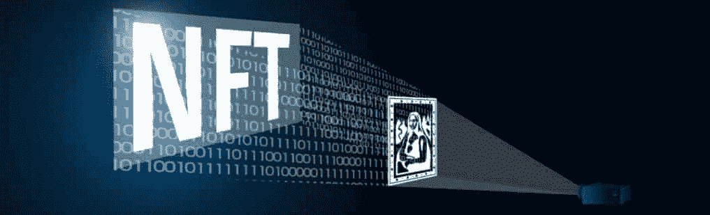
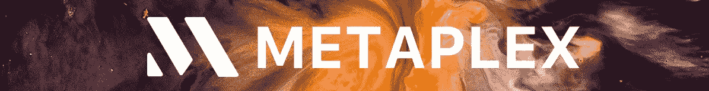
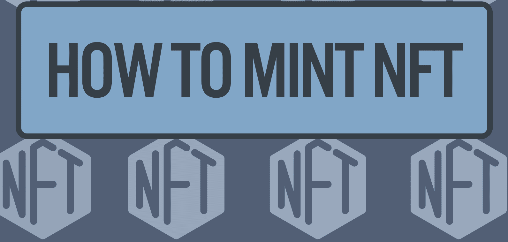
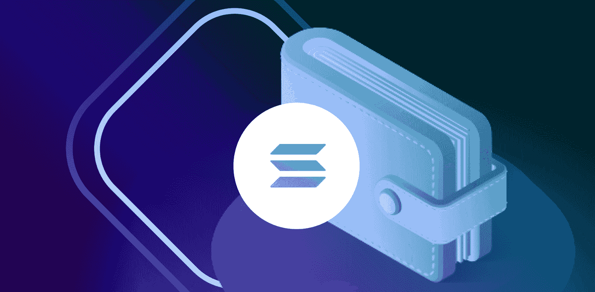
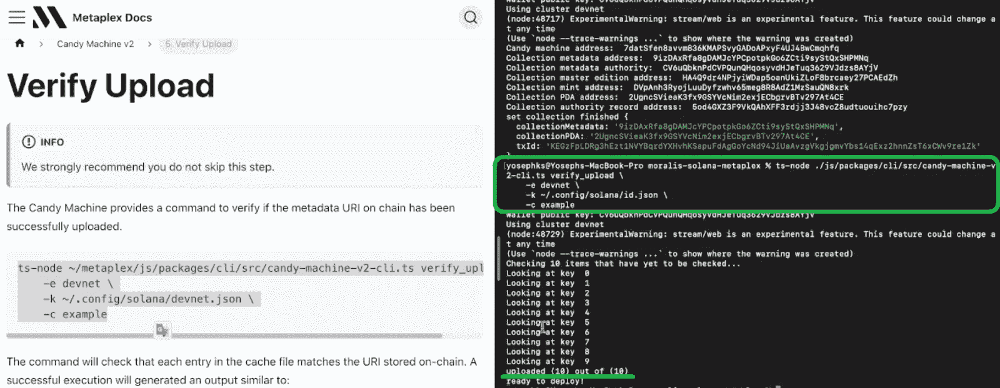
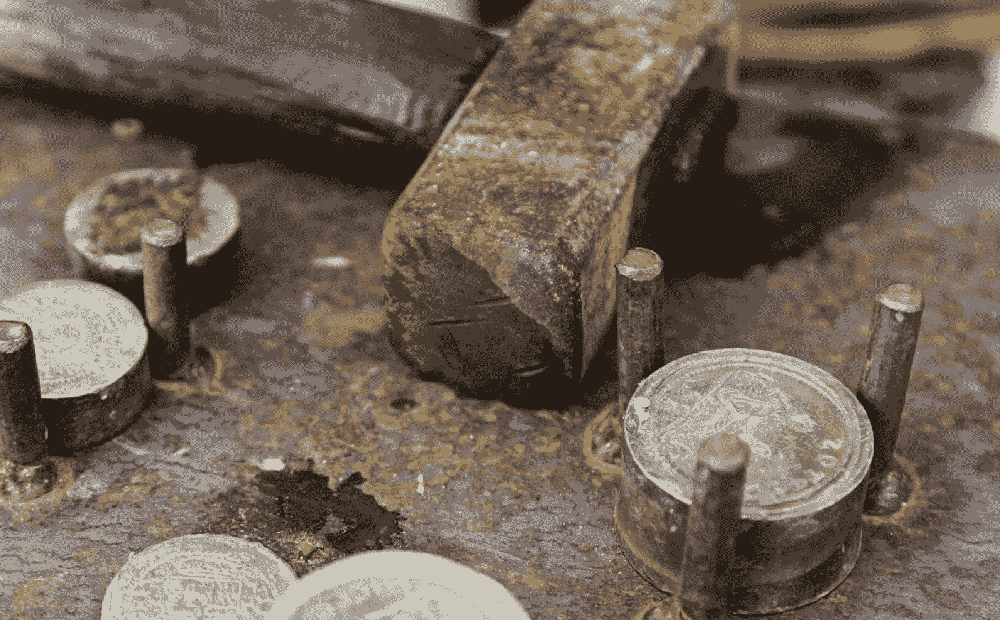

# 如何薄荷与 Metaplex 的索拉纳 NFT

> 原文：<https://moralis.io/how-to-mint-a-solana-nft-with-metaplex/>

想铸造索拉纳 NFT 代币吗？这仍然不是铸造 [**以太坊**](https://moralis.io/full-guide-what-is-ethereum/) **NFTs 那么简单，你可以在你的浏览器中使用** [**Remix**](https://moralis.io/remix-explained-what-is-remix/) **来完成。然而，多亏了 Metaplex，你可以毫不费力地铸造索拉纳 NFT 代币。这正是我们将在本文的示例项目中向您展示的内容。接下来，我们将首先解释一些基础知识，帮助大家快速掌握。在回答了“什么是索拉纳 NFT？”以及“什么是 Metaplex？”我们会给你一个卷起袖子的机会。因此，我们将指导您使用 Metaplex 创建一些 Solana NFTs 示例(** [**不可替换令牌**](https://moralis.io/non-fungible-tokens-explained-what-are-nfts/) **)。而且，你还将学习如何使用终极的 Web3 开发平台，** [**【Moralis】**](https://moralis.io/) **，来创建一个简单的 dapp (** [**去中心化应用**](https://moralis.io/decentralized-applications-explained-what-are-dapps/) **)。后者将能够验证用户并显示来自用户的** [**Web3 钱包**](https://moralis.io/what-is-a-web3-wallet-web3-wallets-explained/) **的 Solana NFTs。**

此外，以下是我们将在今天的示例项目中涵盖的阶段:

*   糖果机 v2 的初始设置
*   在本地计算机上创建一个 Solana 钱包
*   糖果机 v2 配置
*   准备资产(图像和元数据)
*   创建糖果机并将资产上传到 Arweave
*   生产糖果机系列
*   验证资产上传
*   薄荷索拉纳 NFT 代币

这些也是糖果机 v2 的 Metaplex 文档带您经历的阶段。此外，我们还将了解如何批量铸造索拉纳 NFT 代币([批量铸造](https://moralis.io/how-to-bulk-mint-nfts-batch-minting-guide/))。最后但同样重要的是，我们将帮助您完成初始 Moralis 设置，并向您展示一个示例 [Solana 令牌仪表板](https://moralis.io/how-to-build-a-solana-token-dashboard/)的快速演示。使用我们的视频教程，您将有机会创建自己的 dapp 实例。因此，请务必[创建您的免费 Moralis 账户](https://admin.moralis.io/register)，跟随我们的脚步。

## 什么是索拉纳 NFT？

如果你想铸造索拉纳 NFT 代币，它只是适合你知道什么是索拉纳 NFT。因此，你需要知道什么是 Solana，什么是 NFT。嗯，索拉纳是一个受欢迎的可编程区块链。然而，与许多其他连锁店不同，它与 EVM 不兼容，这意味着它与以太坊不兼容。因此，它利用自己的工具，如加密钱包。此外，索拉纳也有自己的(某种)类似于[的智能合约](https://moralis.io/smart-contracts-explained-what-are-smart-contracts/)，这是一个链上程序。它们确保事情按照预先定义的规则自动运行。这些索拉纳程序是我们用来铸造索拉纳 NFT 令牌。此外，索拉纳也有自己的令牌标准(SPL)。我们鼓励你更深入地了解“[什么是索拉纳](https://moralis.io/what-is-solana-the-full-2022-guide/)？”话题。此外，您可以通过查看 [SPL 与 ERC20 令牌](https://moralis.io/spl-vs-erc20-tokens-comparing-solana-and-ethereum-tokens/)的比较来了解更多关于 Solana 令牌标准的信息。

另一方面，NFT 或不可替换令牌是特殊类型的加密资产，具有一组独特的属性。因此， [NFT 公用事业](https://moralis.io/nft-utility-exploring-nft-use-cases-in-2022/)在数字和现实世界中提供了许多应用。这些类型的资产非常适合所有权表示、证书、票务、收藏品、数字艺术、Web3 游戏等等。*如果你想了解更多关于 NFTs 的知识，请确保使用简介中的“不可替换令牌”链接。*

我们现在可以把一和二结合起来。因此，什么是索拉纳·NFT 是显而易见的——在索拉纳网络上铸造的 NFT。至此，我们可以专注于如何铸造索拉纳 NFT 代币。这就是 Metaplex 与众不同的地方。

## 什么是 Metaplex？

根据 Metaplex 的官方网站，Metaplex 是市场、游戏、艺术和收藏品方面最快、最实惠的 NFT 生态系统。Metaplex 协议提供了许多项目使用的标准和工具。使用 Metaplex 标准时，您可以拥有自己的 NFT 店面，无需额外费用和中间商。因此，Metaplex 使您能够以分散的方式创建 NFT。此外，还有许多名人支持这个项目，包括伟大的迈克尔·乔丹。

基本上，Metaplex 是一个工具和智能契约的集合，旨在简化创建和启动 NFT 的过程。这是目前通过两个主要项目提供的:Metaplex 店面和糖果机 v2。前者是一个通用的 NFT 销售标准，后者是一个 NFT 造币工具。如上所述，我们将集中使用糖果机 v2 来铸造索拉纳 NFT 令牌。

# 薄荷索拉纳 NFT 代币与 Metaplex

有了这些基础知识，你就可以开始着手今天的示例项目了。正如上面所承诺的，我们将集中在每个阶段，所以即使这个话题对你来说是新的，你也能跟上。我们将首先完成 Candy Machine v2 的初始设置，在这里你可以克隆我们的代码，这些代码将在 [GitHub](https://github.com/YosephKS/moralis-solana-metaplex) 上等待你。然后，我们将帮助您在本地机器上设置一个 Solana 钱包。接下来，我们将浏览糖果机 v2 配置。之后，我们将准备资产，然后创建糖果机，并将这些资产上传到 Arweave。此外，我们还将向您展示如何创建糖果机集合以及如何验证上传。最后，你将学习如何铸造索拉纳 NFT 代币；一次一个令牌和多个令牌。

此外，虽然我们会尽可能地清晰，但有些步骤在观看视频教程时会更清晰。因此，随着我们的继续，我们将经常参考位于文章底部的视频。

### 糖果机 v2 的初始设置

使用糖果机 v2 需要的工具有:

*   git–用于克隆存储库
*   节点—[JavaScript](https://moralis.io/javascript-explained-what-is-javascript/)运行时
*   yarn——安装所需依赖项的包管理器
*   TS 节点–类型脚本执行环境

*注意* *:如果你使用的是苹果 M1 芯片，需要安装一些额外的依赖项(“brew install pkg-config cairo pango libpng JPEG gif lib librsvg”)。*

准备好上述工具后，就可以克隆和安装 Metaplex 了。然而，我们建议使用我们的代码，而不是使用 Metaplex 文档提供的 URL。后者用一些 Moralis 代码进行了修改，将使您能够轻松地理解本教程。因此，使用上面的“GitHub”链接，克隆我们的代码:

### 打造 Solana 钱包

至此，您已经知道糖果机在索拉纳区块链上运行。因此，你需要一个有足够资金(SOL)的 Solana 钱包来创建和部署这个程序。幸运的是，Solana 收费套件使得创建本地钱包变得非常容易。

*注意* *:本地钱包不是很安全，因此请确保仅将它们用于开发目的，而不是在上面存储更多资金。*

要创建您的本地 Solana 钱包，请使用您的终端并输入“Solana-version”。接下来，输入“索拉纳地址”命令。最后输入“索拉纳平衡”。如果你还没有你的 Solana 地址，使用 Metaplex 文档来设置你的新 devnet 钱包。

而且，你的钱包里也需要有一些 SOL。幸运的是，Solana 使得在 Solana devnet 环境中这样做变得非常简单。本质上，你只需使用“solana airdrop 2”命令来获得 2 SOL。

*注* *:在使用 Solana mainnet 时，你需要获得一些真实的 SOL。因此，你需要在一个著名的集中交易所购买，并把它转移到你的钱包里。*

### 糖果机 v2 配置

首先打开上面克隆的项目。为了更容易跟上我们的步伐，我们建议使用 Visual Studio 代码(VSC)。该配置位于“example-candy-machine-upload-config . JSON”文件中:

正如你在上面的截图中看到的，我们将使用 Arweave 来存储我们的资产。但是，您可以探索其他选项。*有关糖果机 v2 配置的更多详细指导，请使用下面的视频，从 4:39 开始。*

## 准备铸造索拉纳 NFT 代币的资产

就 NFTs 而言，无论在哪个区块链上，它们都由两部分组成——文件和元数据。最常见的文件类型是图像，而元数据以 JSON 文件的形式出现。此外，为了本教程，我们为您准备了[示例资产](https://github.com/YosephKS/moralis-solana-metaplex/tree/main/js/packages/cli/example-assets)。它们成对出现在 PNG 和 JSON 文件中:

正如你在上面的图片中看到的，我们准备了十对文件，这意味着我们可以铸造十个索拉纳 NFT 代币。此外，上图的右边部分显示了我们的 JSON 文件包含的细节。如需更详细的指导，请观看下面的视频(7:52)。这也是您将学习如何核实资产的地方，这是一件聪明的事情。

### 创建糖果机并将资产上传到 Arweave

在进行这个阶段之前，确保你的钱包里有一些溶胶。从下面视频的 12:27 开始，你将学习如何执行“上传”命令。基本上，您只需复制 Metaplex 文档提供的命令:

此外，确保编辑路径以匹配我们的项目。如你所见，我们将在 Solana devnet 上部署糖果机。一旦你应用了所有的调整，只需点击“回车”，代码就会上传所有的资产并创建你的糖果机程序。

### 生产糖果机系列

现在，您已经成功上传了您的资产并创建了您的糖果机程序，是时候创建糖果机集合了(15:35)。这一阶段遵循与上一阶段非常相似的路径。因此，您可以从 Metaplex 文档中复制命令，并应用必要的调整来匹配您的文件路径:

通过运行这个命令，您将为您的资产创建一个链上集合。这个集合可以在铸造过程中设定，我们稍后会处理。

#### 验证资产上传

就像验证资产一样，验证资产上传也是一个可选步骤。但是，我们鼓励您这样做，以确保您的所有资产都已正确上传(在我们的案例中是上传到 Arweave):

*有关此步骤的详细说明，请从 17:23 开始观看下面的视频，或访问 Metaplex 文档。*

## 薄荷索拉纳 NFT 代币

最后，我们已经做好了一切准备，根据上面上传的示例资产铸造索拉纳·NFT 代币(18:18)。就像上面所有的步骤一样，用 Metaplex 铸造 Solana NFTs 将非常简单。同样，我们可以从 Metaplex 文档中复制命令，并进行必要的调整以匹配我们的文件路径。此外，你有两种选择——你可以一个接一个或分批铸造索拉纳 NFT 代币。

一旦您成功地创建了您的 NFT，您就可以使用 Solana Explorer 来查看 NFT 及其详细信息。只要确保切换到 devnet:

### 进一步探索“薄荷索拉纳 NFT”

正如本文开头所承诺的，我们想向您展示如何使用最好的 [Web3 后端平台](https://moralis.io/exploring-the-best-web3-backend-platform/)轻松创建索拉纳·NFT 投资组合跟踪 dapp:

这就是一旦您使用 Phantom wallet 对 Solana 用户进行身份验证后，dapp 显示 NFTs 的方式:

多亏了 [Moralis 的 SDK](https://moralis.io/exploring-moralis-sdk-the-ultimate-web3-sdk/) ，你将能够使用[索拉纳 NFT API](https://moralis.io/solana-nft-api-exploring-the-ultimate-nft-api-for-solana/) 并获取用户的 NFT。然而，要将这个 [Firebase 用于 crypto](https://moralis.io/firebase-for-crypto-the-best-blockchain-firebase-alternative/) ，您需要从初始的 Moralis 设置开始。因此，确保使用下面的视频教程(24:50)首先[创建一个 Moralis dapp](https://docs.moralis.io/moralis-dapp/getting-started/create-a-moralis-dapp) 。然后，在我们内部专家的带领下，创建你自己的上述索拉纳·NFT 投资组合追踪器实例。

*最后，这是我们在整篇文章中引用的视频教程:*

https://www.youtube.com/watch?v=BPQXek6lMUE

## 如何用 Metaplex 制造索拉纳 NFT–总结

在今天的文章中，你有机会学习如何用 Metaplex 铸造索拉纳 NFT 代币。首先，您学习了关于 Solana NFTs 和 Metaplex 的基础知识。然后，你有机会通过承担我们的示例项目来弄脏你的手。当然，我们给你提供了我们的代码和详细的指令，因此你不需要流汗。本质上，这些是你一路走来完成的阶段:

*   糖果机 v2 的初始设置
*   在本地计算机上创建一个 Solana 钱包
*   糖果机 v2 配置
*   准备资产
*   创建糖果机并将资产上传到 airweave
*   生产糖果机系列
*   验证资产上传
*   薄荷索拉纳 NFT 代币
*   创建自己的索拉纳 NFT 投资组合跟踪。

因此，你现在知道如何轻松地铸造索拉纳 NFTs，也知道如何与 Moralis 工作，在几分钟内创造杀手 dapps。

如果你喜欢今天的教程，一定要访问[Moralis 的博客](https://moralis.io/blog/)和[Moralis 的 YouTube 频道](https://www.youtube.com/c/MoralisWeb3)。这些渠道提供了大量的价值，可以满足您持续的加密教育需求。例如，一些最新的主题包括 [Web3 同步](https://moralis.io/web3-syncing-how-to-sync-smart-contract-web3-events/)、 [Web3 webhooks](https://moralis.io/web3-webhooks-the-ultimate-guide-to-blockchain-webhooks/) 、如何[快速构建 Web3](https://moralis.io/how-to-build-on-web3-in-minutes/) 、[全栈 Web3 开发](https://moralis.io/full-stack-web3-development-the-ultimate-guide-to-building-web3-projects/)、创建一个 [AR 元宇宙 NFT](https://moralis.io/how-to-create-an-ar-metaverse-nft-mystery-box/) 、构建一个 [Web3 增强现实](https://moralis.io/how-to-build-a-web3-augmented-reality-nft-loot-box/)等等。另一方面，如果你想快速自信地成为一名 Web3 开发者，你可以考虑报名参加 Moralis 学院。