# 如何铸造团结 NFT-2022 年指南全文

> 原文：<https://moralis.io/how-to-mint-a-unity-nft/>

你可能知道 Unity 是领先的跨平台游戏引擎之一，支持各种桌面、移动、主机和 VR 平台。然而，你可能没有意识到，多亏了 Moralis，你可以在你的 [**Web3 游戏设计**](https://moralis.io/web3-game-design-explaining-the-web3-game-design-process/) **和区块链游戏开发中使用 Unity。通过在您的 Unity 项目中使用 Moralis，您可以很容易地合并许多 Web3 元素，比如 NFT。例如，您只需复制并粘贴 Moralis 提供的简短代码片段，就可以在几分钟内启动并运行一个简单的 Unity NFT minter dapp(**[](https://moralis.io/decentralized-applications-explained-what-are-dapps/)****)。如果您想使用这个"**[**Firebase for crypto**](https://moralis.io/firebase-for-crypto-the-best-blockchain-firebase-alternative/)**"平台来快速轻松地打造一个 Unity NFT，请跟随本文内容并密切关注本文末尾的视频！****

**如果你是第一次接触 [Unity Web3 编程](https://moralis.io/unity-web3-beginners-guide-to-unity-web3-programming/)，不用担心；当我们前进时，你将有机会跟随我们的领导。在此，我们说明了您需要完成的确切步骤，以获得此 Unity NFT minter dapp 的完整功能。此外，我们将带您浏览最重要的脚本，让您正确理解 dapp 是如何工作的。在这个过程中，你还将了解是什么让 Moralis 成为[最好的 Web3 后端平台](https://moralis.io/exploring-the-best-web3-backend-platform/)。但是，在我们向您展示如何创建您自己的 Unity NFT minter 之前，我们将快速演示一下这个 Unity dapp。因此，你会对未来会发生什么有一个正确的理解，以及你是否真的想使用它。所以，如果你想开始建立这个团结 NFT minter dapp，[创建你的免费 Moralis 账户](https://admin.moralis.io/register)并跟随我们的领导！**

**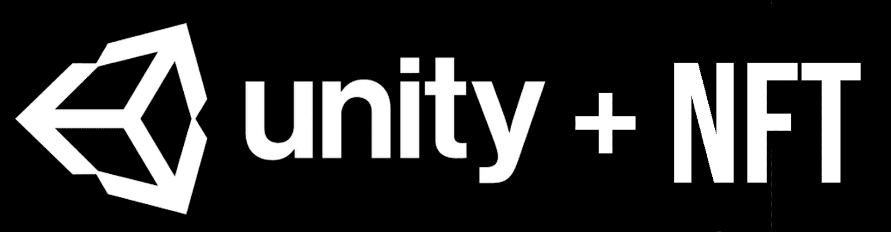

## 团结 NFT 明特演示

如上所述，让我们快速演示一下我们的 Unity NFT minter dapp。通过查看下面的截图，您可以看到我们的 dapp 从 [Web3 认证](https://moralis.io/web3-authentication-the-full-guide/)开始:

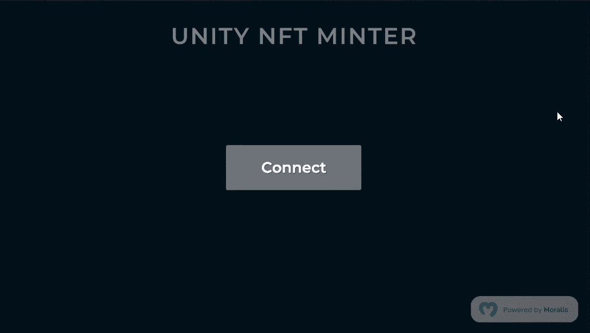

为了使用这个 dapp，你需要点击“连接”按钮，这将初始化 [Web3 登录](https://moralis.io/how-to-build-a-web3-login-in-5-steps/)过程。因此，您可以使用您的手机 [Web3 钱包](https://moralis.io/what-is-a-web3-wallet-web3-wallets-explained/)(例如 [MetaMask](https://moralis.io/metamask-explained-what-is-metamask/) )扫描二维码并确认登录您的钱包。登录后，您会看到以下屏幕:

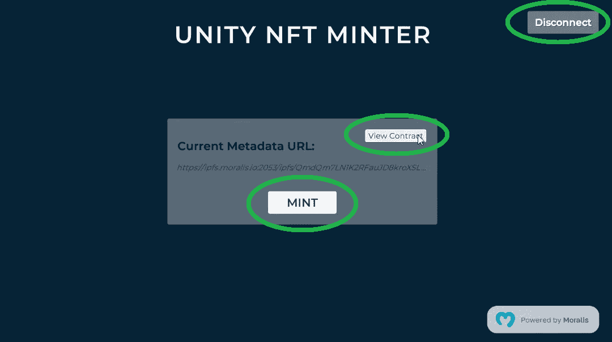

如上图所示，我们的 Unity NFT minter dapp 有三个按钮。在右上角，我们有“断开”按钮，它可以断开连接的 Web3 钱包。然后是“查看合同”按钮，打开当前在链浏览器中使用的智能合同(在我们的例子中是 PolygonScan)。最后但并非最不重要的是，有一个“薄荷”按钮，这是一个触发铸造过程。所以，当你点击“mint”按钮时，这个 Unity dapp 获取你的元数据链接(一个目前在 Unity 中提供的 URL)并执行 mint 交易。当然，您需要在连接的钱包中确认交易:

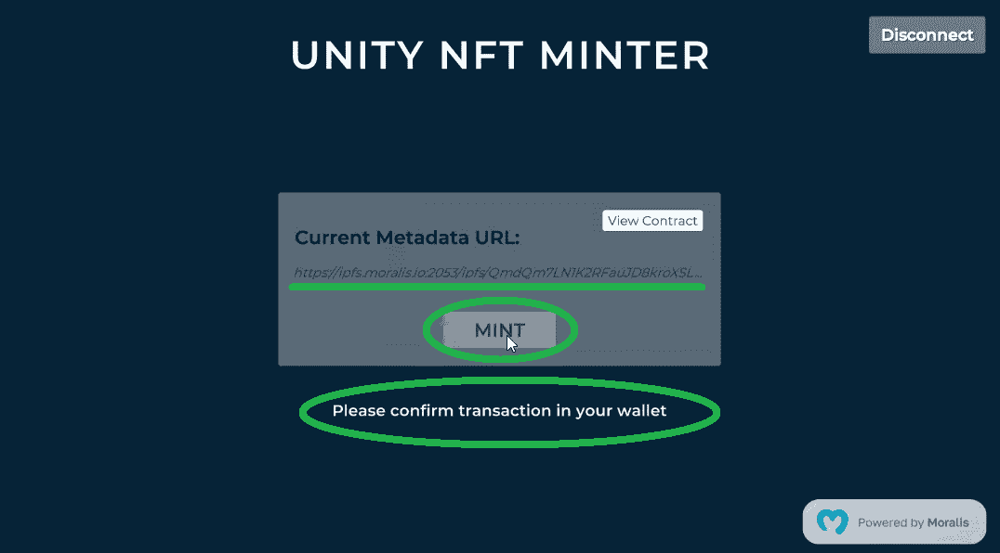

一旦你确认了交易，智能合约就会铸造一个 NFT。此外，一旦 NFT 铸造完成，dapp 还会显示“查看公海”按钮:

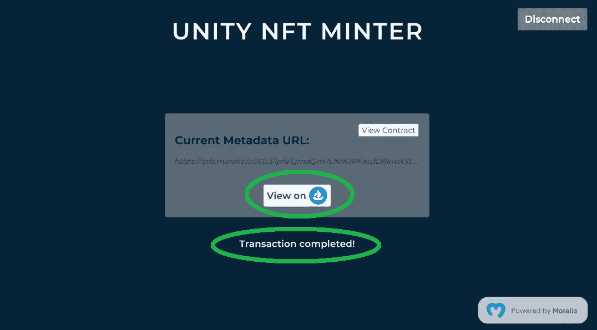

所以，如果你点击“查看 OpenSea”按钮，你就可以在这个受欢迎的 [NFT 市场](https://moralis.io/how-to-launch-an-nft-marketplace/)上看到上面的 NFT:

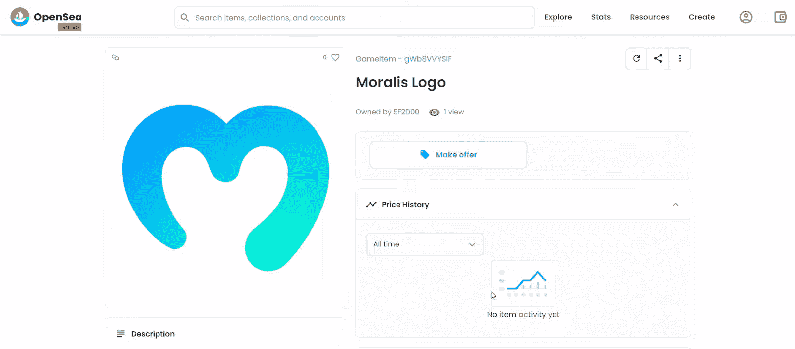

## Moralis 驱动的统一 NFT 铸币厂

正如简介中提到的，正如你在上面的演示中看到的“Powered by Moralis”图标所示，这个终极的 Web3 开发平台是使用 Unity 进行 Web3 开发的关键。因此，我们应该告诉你更多关于 Moralis 的事情。


### 遇见 Moralis 家

Moralis 为构建高性能 dapps 提供了单一的 Web3 工作流。它使你能够使用 JavaScript 或 Unity experience 轻松创建 Web3 应用程序。首先，Moralis 使您能够涵盖多种类型的 Web3 身份验证。相应的，你可以[用 MetaMask](https://moralis.io/how-to-authenticate-with-metamask/) 、 [WalletConnect](https://moralis.io/what-is-walletconnect-the-ultimate-walletconnect-guide/) 认证，甚至可以通过 email 和 [Web3 社交登录](https://moralis.io/web3-social-login-sign-in-dapp-users-with-google-email-or-twitter/)关注 [Web3 认证。后两个选项对于促进](https://moralis.io/how-to-do-web3-authentication-via-email/) [Web3 用户加入](https://moralis.io/how-to-boost-web3-user-onboarding-success-rates/)特别有效。此外，Moralis 在身份和会话管理方面实现了最大的灵活性。此外，由于 Moralis monitoring，您可以获得所有关于用户转账、交易、造币、烧伤和其他与您的 dapp 相关的行为的数据。本质上，您可以[索引区块链](https://moralis.io/how-to-index-the-blockchain-the-ultimate-guide/)，而无需处理 RPC 节点的[限制。](https://moralis.io/exploring-the-limitations-of-rpc-nodes-and-the-solution-to-them/)

此外， [Moralis SDK](https://moralis.io/exploring-moralis-sdk-the-ultimate-web3-sdk/) 是跨平台、可互操作的，并且包括一个 web SDK、一个游戏 SDK 和一个后端 SDK。因此，你可以在一个地方覆盖[web 3 前端](https://moralis.io/web3-frontend-everything-you-need-to-learn-about-building-dapp-frontends/) ( [web3uikit](https://moralis.io/web3ui-kit-the-ultimate-web3-user-interface-kit/) )和后端。您还应该注意到，Moralis 完全是关于跨链互操作性的。因此，您永远不会被任何特定的区块链所束缚，因为您可以对多个网络使用相同的代码。因此，你的工作是面向未来的。最后，Moralis 提供了与[插件](https://moralis.io/plugins/)生态系统的无限集成。

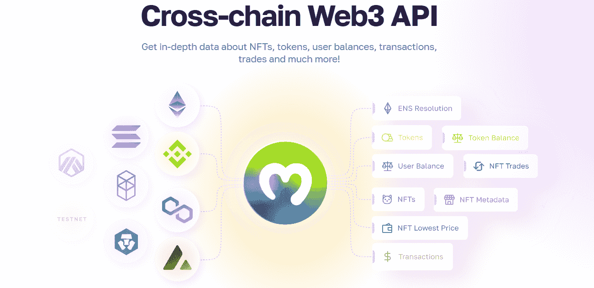

此外，Moralis 通过加入 Moralis 的每周 [Web3 项目](https://moralis.io/projects/)，为开发人员提供社区支持。由于 Moralis 有一个免费计划，每个人都有机会[成为 Web3 开发者](https://moralis.io/how-to-become-a-web3-developer-full-guide/)。所以，剩下的唯一问题是，你是否想让[成为一名区块链开发商](https://moralis.io/how-to-become-a-blockchain-developer/)。

## 如何在几分钟内铸造一个团结 NFT

首先从 [GitHub](https://github.com/MoralisWeb3/unity-web3-nft-minter) 下载我们的项目，并在 Unity 中打开它。这是您应该看到的屏幕:

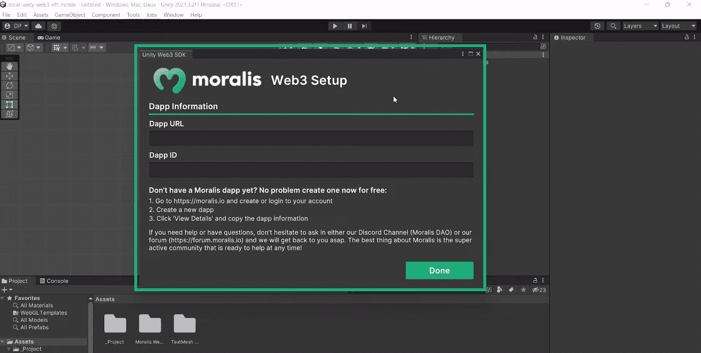

*注意* *:如果您关闭了上述窗口，请务必再次打开:*


“Moralis Web3 设置”窗口提示您输入 dapp 信息:确切地说是 dapp URl 和 ID。正如两个输入字段下面的说明所示，您需要使用 Moralis 来获取这些详细信息。这里有详细的说明，可以帮助你做到这一点:

1.  现在，你可能已经准备好了你的 Moralis 账户。因此，只需[登录](https://admin.moralis.io/login)。另一方面，如果您没有帐户，请确保创建您的免费 Moralis 帐户:


2.  进入 Moralis 管理区后，点击“创建新 Dapp”按钮:


3.  接下来，选择“Testnet”环境:


4.  然后，点击“多边形孟买”并使用“继续”按钮前进:


5.  确保选择离你最近的城市。然后，再次单击“继续”按钮进入下一步:


6.  这是您需要命名 dapp 的地方。这可以是你想要的任何东西。最后，点击“创建您的 dapp”按钮运行您的 Moralis dapp:


7.  dapp 启动并运行后，您可以通过“设置”按钮访问其详细信息:


8.  复制您的 dapp 凭据:


9.  返回 Unity，将上面复制的详细信息粘贴到指定的输入字段中。要在 Unity 中完成 Moralis Web3 设置，请点击“完成”:


完成上述设置后，进入“资产”>“_ 项目”>“场景”，在这里您需要打开“主”场景:

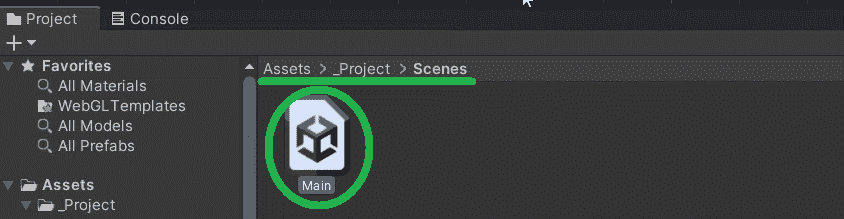

*注意* *:默认情况下，Unity NFT 铸币厂使用我们的智能合约和元数据，这意味着您将铸造 Moralis 标志。因此，我们需要向您展示如何将 Unity NFT minter 用于其他智能合约和元数据。*

### 使用您的智能合约和元数据 URL 铸造统一 NFT 令牌

铸造小组代表了我们的核心团结 NFT 明特。后者会在您连接钱包后立即激活，如演示所示:

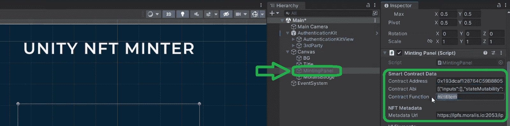

查看上面的屏幕截图，您可以看到智能合约的数据和 NFT 元数据字段。您需要用您的智能合同和元数据详细信息填充这些字段，以便使用这个 dapp 来创建您想要的任何 NFT。所以，这些是你需要的细节:

*   对于智能合同:地址、ABI 和合同功能
*   元数据 URL

幸运的是，您可以轻松获得这些详细信息。每个可编程区块链都有自己的浏览器，这就是上面所有关于所有已部署的 Web3 合同的详细信息等待您的地方。在我们的例子中，我们使用 Polygon 的 testnet，Mumbai。因此，PolygonScan(孟买)是我们需要利用的探索者。

另一方面，就元数据 URL 而言，有各种各样的方法。为了以分散的方式做到这一点，我们建议使用分散的云存储服务。同样，有几个著名的选项可用；但是，我们建议使用 [IPFS](https://moralis.io/what-is-ipfs-interplanetary-file-system/) 。此外，Moralis 还集成了 IPFS，这意味着您可以无缝地使用该存储解决方案。一旦你[将 Unity 资产上传到 IPFS](https://moralis.io/how-to-upload-unity-assets-to-ipfs/) ，你就会得到你的元数据 URL。

### 铸造面板脚本演练

有关详细的代码演练，请观看本文底部的视频，从 9:41 开始。但是，我们想简要地看一下我们的 minter dapp 的主要函数，“MintNft()”，它是由“mint”按钮调用的:

```js
   public async void MintNft()
        {
            if (contractAddress == string.Empty || contractAbi == string.Empty || contractFunction == string.Empty)
            {
                Debug.LogError("Contract data is not fully set");
                return;
            }

            if (metadataUrl == string.Empty)
            {
                Debug.LogError("Metadata URL is empty");
                return;
            }

            statusText.text = "Please confirm transaction in your wallet";
            mintButton.interactable = false;

            var result = await ExecuteMinting(metadataUrl);

            if (result is null)
            {
                statusText.text = "Transaction failed";
                mintButton.interactable = true;
                return;
            }

            // We tell the GameManager what we minted the item successfully
            statusText.text = "Transaction completed!";
            Debug.Log($"Token Contract Address: {contractAddress}");
            Debug.Log($"Token ID: {_currentTokenId}");

            // Activate OpenSea button
            mintButton.gameObject.SetActive(false);
            openSeaButton.gameObject.SetActive(true);
        }
```

上面的代码检查您是否提供了来自智能合约的详细信息和元数据 URL。如果缺少任何细节，该函数将记录相应的错误。但是，如果提供了所有详细信息，“MintNft”函数将返回“请确认您钱包中的交易”消息，并触发造币操作。后者是通过“执行”功能完成的，这是我们使用 Moralis 力量的地方。

#### Moralis 的“执行”功能和力量

下面是“执行”功能:

```js
        private async UniTask<string> ExecuteMinting(string tokenUrl)
        {
            // Dummy TokenId based on current time.
            long currentTime = DateTime.Now.Ticks;
            _currentTokenId = new BigInteger(currentTime);

            // These are the parameters that the contract function expects
            object[] parameters = {
                _currentTokenId.ToString("x"), // This is the format the contract expects
                tokenUrl
            };

            // Set gas configuration. If you set it at 0, your wallet will use its default gas configuration
            HexBigInteger value = new HexBigInteger(0);
            HexBigInteger gas = new HexBigInteger(0);
            HexBigInteger gasPrice = new HexBigInteger(0);

            string resp = await Moralis.ExecuteContractFunction(contractAddress, contractAbi, contractFunction, parameters, value, gas, gasPrice);

            return resp;
        }
```

正如您在上面看到的，该函数接收提供的元数据 URL，现在称为“tokenURL”。然后，该函数创建一个令牌 ID。接下来，它使用该 ID 来创建智能协定期望的令牌参数。

*注* *:我们用了一架* [*ERC-721 合同*](https://moralis.io/erc721-contract-exploring-erc721-smart-contracts/) *(更多详情，请使用下面 12:50 的视频)。如果你要使用一个*[*ERC-1155*](https://moralis.io/erc1155-exploring-the-erc-1155-token-standard/)*契约，你需要调整代码。*

接下来,“执行”功能设置气体配置。最后，多亏了 Moralis，一行代码就可以通过“ExecuteContractFunction”函数完成铸造。

### 使用多边形扫描获取智能合约的详细信息

从下面视频中的 12:50 开始，你可以在 PolygonScan 上看到我们的智能合约。这是一个非常简单的合同，基于一个经过验证的 [OpenZeppelin](https://moralis.io/what-is-openzeppelin-the-ultimate-guide/) 模板。在 13:42，您可以看到在哪里获取您的合同地址，您需要将该地址粘贴到 Unity minter 中。接下来，该视频还将向您展示如何获得合同的 ABI:

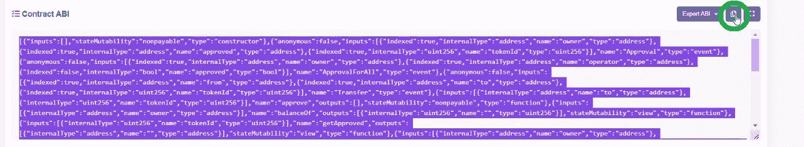

此外，还要确保更改您的智能合约功能的名称(14:13):

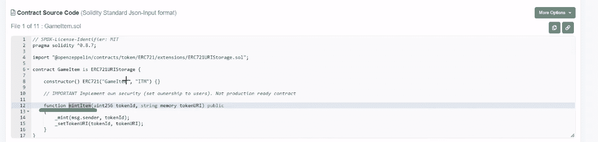

*注* *:使用 Remix 或 Hardhat 等工具部署智能合约时，部署一次就会得到智能合约。然而，如上所示，您可以随时在区块链浏览器中访问这些详细信息。*

这是我们上面提到的视频教程。它包括您需要的关于我们 Unity NFT minter dapp 的所有详细信息:

https://www.youtube.com/watch?v=dFf6Ml30NbM

## 如何打造统一的 NFT——总结

即使这篇文章是你第一次接触 Web3 编程，你现在知道你可以很容易地用 Unity 创建 dapps。感谢 Moralis 的游戏 SDK，你可以使用 Unity 进行 Web3 开发。此外，您还学习了如何使用我们的 Unity NFT minter dapp。在此过程中，您还有机会完成初始的 Moralis 设置。因此，您现在知道了如何创建一个 Moralis dapp 并访问它的凭证。此外，您还学习了如何使用 PolygonScan 获取智能合同的详细信息。

如果你喜欢这个主题，我们鼓励你更深入地学习 Unity Web3 编程。例如，你可以探索如何[与来自 Unity 的 Web3 数据库](https://moralis.io/how-to-communicate-with-a-web3-database-from-unity/)通信，[存储离线数据](https://moralis.io/how-to-store-off-chain-data-unity-web3-database/)，进行[区块链游戏交易](https://moralis.io/how-to-do-blockchain-game-transactions-with-unity/)，以及将 [Unity 游戏与 Web3 登录](https://moralis.io/connecting-a-unity-game-with-web3-login/)连接。你也可以[开始生成 NFT](https://nftcoders.com/begin-generating-nfts-in-15-minutes/)或者[创建一个 NFT 造币网站](https://nftcoders.com/create-an-nft-minting-website-in-5-steps/)！

然而，如果你对创作 [DeFi](https://moralis.io/what-is-defi-the-full-decentralized-finance-guide/) 或 [DAO](https://moralis.io/how-to-build-a-decentralized-autonomous-organization-dao/) dapps 更感兴趣，我们鼓励你探索 [Moralis 博客](https://moralis.io/blog/)和 [Moralis YouTube 频道](https://www.youtube.com/c/MoralisWeb3)。在那里，您会找到大量的解释和示例项目。一些最新的话题集中在 [Web3 同步](https://moralis.io/web3-syncing-how-to-sync-smart-contract-web3-events/)、 [Web3 webhooks](https://moralis.io/web3-webhooks-the-ultimate-guide-to-blockchain-webhooks/) 、如何[在 Web3](https://moralis.io/how-to-build-on-web3-in-minutes/) 上快速构建、[全栈 Web3 开发](https://moralis.io/full-stack-web3-development-the-ultimate-guide-to-building-web3-projects/)、AR 元宇宙 NFT 和 [Web3 增强现实](https://moralis.io/how-to-build-a-web3-augmented-reality-nft-loot-box/)。因此，这两个出口可以作为你正在进行的密码教育。但是，采取更专业的方法往往会带来更好的结果。因此，你应该考虑报名参加 T21 Moralis 学院。除了顶级的[区块链发展课程](https://academy.moralis.io/all-courses/)，这里也是获得个性化学习路径和专家指导的地方。然而，最大的价值正以 Moralis 社区的形式等待着你。

**