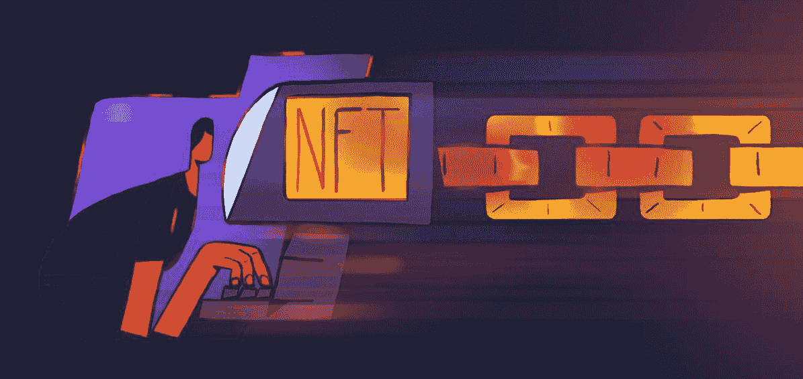
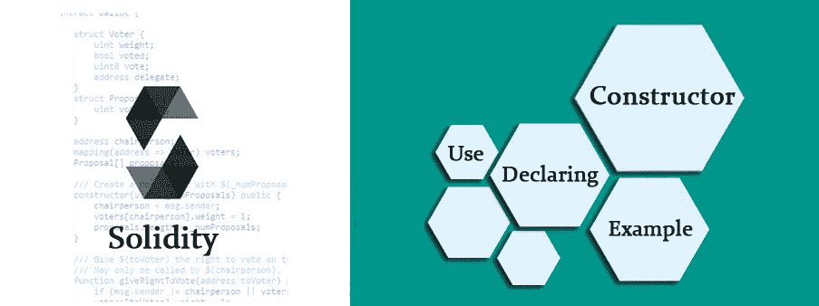
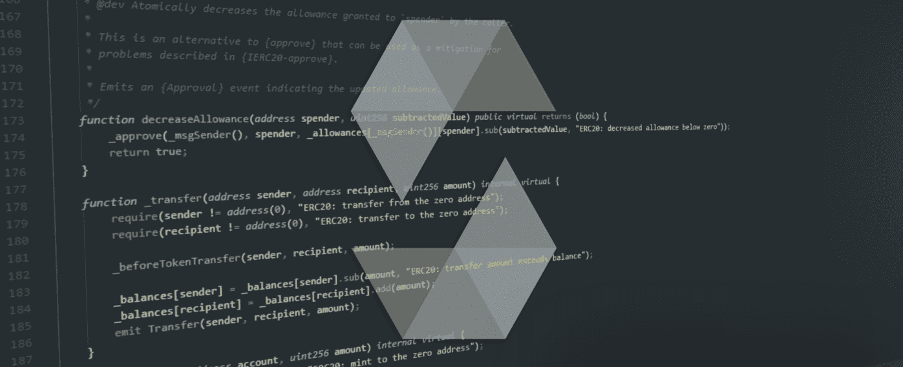
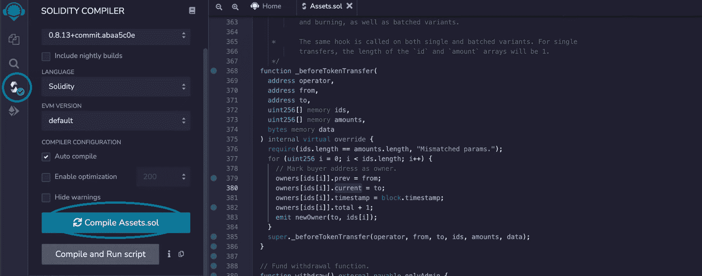
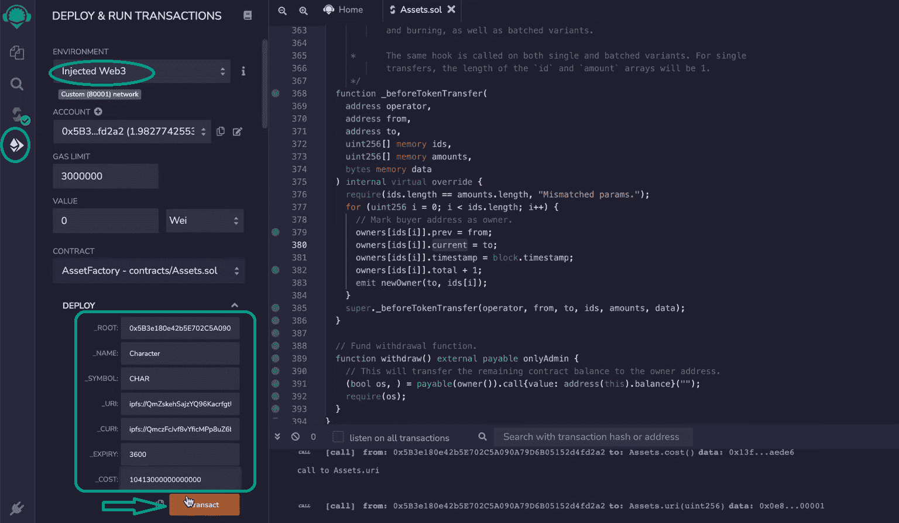

# 如何将游戏资产铸造成 NFT

> 原文：<https://moralis.io/how-to-mint-game-assets-as-nfts/>

**当我们允许一个可申领的游戏内物品被铸造成 NFT 时，我们增强了 Web3 游戏** **的** [**优势。例如，通过将游戏资产铸造成 NFT，它们可以在 OpenSea 等市场上交易。允许用户将游戏资产铸造为 NFT 的另一个好处是玩家可以真正拥有他们的游戏内资产。如果您想知道如何将游戏资产铸造成 NFT，本文包括完成这项任务所需的必要步骤。和任何 Web3 项目一样，后端对很多人来说都很有挑战性。然而，有了 Moralis，你所有的后端工作都变成了一个简单的过程。因此，您不能错过让这个**](https://moralis.io/benefits-of-web3-gaming-full-breakdown/) [**ultimate Web3 后端平台**](https://moralis.io/exploring-the-best-web3-backend-platform/) **处理您的开发需求。所以，想学习如何铸造游戏资产作为非功能性游戏？现在就开始通过** [**创建你的 Moralis 账户**](https://admin.moralis.io/register) **！**

Moralis 配备了令人印象深刻的 Web3 SDK 和 T2 的 Moralis 元宇宙 SDK。因此，你可以快速构建一个 [2D Web3 游戏](https://moralis.io/how-to-build-a-2d-web3-game-full-guide%ef%bf%bc/)。此外， [Unity Web3 编程](https://moralis.io/unity-web3-beginners-guide-to-unity-web3-programming/)和创建一个 3D [即玩即赚(P2E)游戏](https://moralis.io/how-to-build-a-play-to-earn-p2e-game/)将感觉轻而易举。然而，要将游戏资产打造为 NFT 并使 [GameFi](https://moralis.io/gamefi-tutorial-how-to-create-a-gamefi-game/) 成为可能，[智能合约](https://moralis.io/smart-contracts-explained-what-are-smart-contracts/)是其中一个关键方面。因此，我们将关注一个特殊的[元宇宙智能合同](https://moralis.io/metaverse-smart-contract-how-to-build-a-metaverse-game-smart-contract/)—“资产工厂”。该合同旨在使 Web3 游戏开发者能够将游戏资产打造为 NFT。接下来，我们将带您了解这份智能合同。因此，你会发现你不需要成为一个[坚实度](https://moralis.io/solidity-explained-what-is-solidity/)专家来实现 NFT 铸造特性。此外，像 [Remix](https://moralis.io/remix-explained-what-is-remix/) 和 [OpenZeppelin](https://moralis.io/what-is-openzeppelin-the-ultimate-guide/) 这样的工具使这个过程变得简单。在此演练之后，您将能够使用 Moralis 和 Unity 开始创建 Web3 游戏。现在，让我们来探索如何将游戏资产铸造成 NFT！



## 将游戏资产作为 NFT–“资产工厂”代码演练

*注:您可以在 GitHub 上访问“* [*资产工厂*](https://github.com/ashbeech/moralis-nft-game/blob/main/contracts/AssetFactory.sol) *”智能合约代码。此外，我们鼓励你使用混音，粘贴代码，并遵循我们的领导。这样，您将能够部署合同并测试 mint 一些潜在的 NFT。*

如前所述，我们将在此指导您使用我们有用的智能合同的代码。所以，让我们从顶部开始，这里有一行杂注:

```js
// SPDX-License-Identifier: MIT
pragma solidity ^0.8.0;
```

以下是我们需要导入的 OpenZeppelin 合同。这样，我们就可以使用这些经过验证的合同的细节来简化我们的工作。因此，我们在不牺牲安全性的情况下节省了时间。

```js
import "@openzeppelin/contracts/token/ERC1155/ERC1155.sol";
import "@openzeppelin/contracts/utils/math/SafeMath.sol";
import "@openzeppelin/contracts/utils/Strings.sol";
import "@openzeppelin/contracts/access/AccessControl.sol";
import "@openzeppelin/contracts/access/Ownable.sol";
```

我们合同的实际代码从以下内容开始:

```js
contract AssetFactory is ERC1155, AccessControl, Ownable {
```

这一行包含我们的智能合约的名称，并定义我们将关注 [ERC-1155 令牌标准](https://moralis.io/erc1155-exploring-the-erc-1155-token-standard/)。接下来，我们定义将在智能合约中使用的所有变量:

```js
  string public name; // Token name
  string public symbol; // Token symbol
  string public contractURI; // Token uri
  uint256 public circulation; // Total circulating supply
  uint256 public cost; // Per token cost
  uint256 public expiry; // Whitelist expiry time i.e. 3600
  bool public paused = false; // Pause critical funcs
```

通过查看上面代码行旁边的注释，您可以看到我们为令牌名称、令牌符号、令牌 URI、总流通供应量和每个令牌的成本定义了一个变量。此外，我们定义了“到期”和“暂停”变量，我们将使用它们来定义白名单到期和暂停关键功能。


### 安全功能-“白名单”和“所有者”结构

我们的智能契约包含两个结构，使我们能够跟踪契约中的数据:

```js
  // Whitelist data storage
  struct Whitelist {
    address buyer;
    uint256 timestamp;
    bool listed;
  }
  // Owner data storage
  struct Owners {
    address prev;
    address current;
    uint256 timestamp;
    uint256 total;
  }
```

“白名单”结构不是传统的“NFT 丢弃”意义上的白名单，这意味着我们不使用它来允许特定的地址早期创建集合。相反，我们使用这个结构来确保玩家的顺利加入体验。通过包含玩家的地址(“买家”)，我们的白名单确保玩家可以认领角色，而没有这些角色从下面“变得粗糙”的风险。从这个意义上来说，白名单基本上是一种象征性的闸门。因此，玩家的选择是安全的，直到玩家实际完成购买。此外,“Owners”结构确保特定地址拥有的资产不超过特定类型资产的最大数量。因此，我们可以在任何给定的时间为每个访问游戏的地址创建一个公平的游戏场地。

此外，我们然后将上述两个结构中的每一个映射到一个令牌 ID 的索引:

```js
  // Mapping each user to corresponding whitelist data
  mapping(uint256 => Whitelist) public whitelist;
  // Token owners
  mapping(uint256 => Owners) public owners;
  // Create role identifier for whitelisting
  bytes32 public constant WHITELISTER_ROLE = keccak256("WHITELISTER_ROLE");
```

我们的智能契约有两个明确声明的角色:默认管理员和“白名单角色”(见上文)。出于“白名单”角色的操作安全性考虑，我们创建了这个单独的角色。简而言之，白名单的角色将是一组云功能。这些云功能将以编程方式签署白名单角色负责的事务。因此，这些功能必须是非关键的，并且仅限于此角色。



### 将游戏资产铸造成 NFT 的构造者

我们构建了“AssetsFactory.sol”智能契约的构造器，它与我们正在部署的资产类型无关。这允许我们在设置所有关键描述性变量的同时创建新资产:

```js
  constructor(
    address _root,
    string memory _name,
    string memory _symbol,
    string memory _uri,
    string memory _cURI,
    uint256 _expiry,
    uint256 _cost
  ) ERC1155(_uri) {
    _setupRole(DEFAULT_ADMIN_ROLE, _root);
    _setupRole(WHITELISTER_ROLE, _root);

    name = _name;
    symbol = _symbol;
    cost = _cost;
    expiry = _expiry;
    circulation = 0;
    contractURI = _cURI;
  }
```

查看上面的代码行，可以看到构造函数覆盖了 admin wallet 的地址名称(" _root ")和资产的所有细节(名称、符号等)。)如前所述。然后，代码设置上面解释的两个角色——白名单角色和默认管理员角色。此外，以下也是我们的单函数修饰符的代码行:

```js
  modifier onlyAdmin() {
    require(isRole(DEFAULT_ADMIN_ROLE, msg.sender), "Restricted to admins.");
    _;
  }
```

每当调用一个需要检查调用它的地址是否是管理员帐户的函数时，就会使用上面的修饰符。

### 角色的灵活性

因为我们希望这个智能契约拥有围绕角色的灵活性，所以这是“addAdmin”、“addToRole”、“renounceAdmin”和“isRole”函数所允许的:

```js
  function addAdmin(bytes32 roleId, bytes32 adminRoleId) external onlyAdmin {
    _setRoleAdmin(roleId, adminRoleId);
    //emit AdminRoleSet(roleId, adminRoleId);
  }

  function addToRole(bytes32 roleId, address account) external onlyAdmin {
    grantRole(roleId, account);
  }

   function renounceAdmin() external {
    renounceRole(DEFAULT_ADMIN_ROLE, msg.sender);
  }

  function isRole(bytes32 roleId, address account) public view returns (bool) {
    return hasRole(roleId, account);
  }
```

上述功能基于从导入的 OpenZeppelin 契约中引入继承的访问控制功能。这些功能赋予管理员帐户向特定帐户地址授予和放弃角色的权利。此外，它在契约部署后支持角色的灵活性。

### 只读函数

接下来，我们有只读函数，当你想把游戏资产做成 NFT 时，这些函数也需要完成它们的工作:

```js
  function getContractURI() public view returns (string memory) {
    return contractURI; // Contract-level metadata
  }

  function isWhitelisted(address _address, uint256 _tokenId)
    public
    view
    returns (bool)
  {
    bool userIsWhitelisted = false;
    if (whitelist[_tokenId].buyer == _address) {
      userIsWhitelisted = whitelist[_tokenId].listed;
    }
    return userIsWhitelisted;
  }

  function getCost() external view returns (uint256) {
    return cost;
  }
```

“getContractURI”函数获取合同级元数据。因此，这使得市场能够获得关于资产的描述性信息。此外，“isWhitelisted”确保游戏可以在任何给定时间跟踪谁被列入白名单。它通过接收用户的地址和令牌 id 并返回“真”或“假”来实现这一点。尽管如此,“getCost”函数返回资产的成本。



## 编写函数将游戏资产作为 NFT 创建

我们示例智能契约的重要写函数可以由管理员或白名单调用。使用这个智能合约的游戏工作室决定实施[批量铸币](https://moralis.io/how-to-bulk-mint-nfts-batch-minting-guide/)。此外，该团队还希望在游戏发布日期之前，游戏的资产可以在 OpenSea 上看到。因此，我们创建了一个智能合同，可以批量预制所有需要的资产。此外，这也使得 ERC-1155 非常适合这个项目。这样，每当游戏工作室想要创造新的资产时，单个交易就有可能铸造数千个代币。当然，这种预制伴随着一些要求。因此，我们需要预先上传与资产令牌相对应的所有元数据和文件资产。我们还需要确保数据的完整性。因此，我们使用 [IPFS](https://moralis.io/what-is-ipfs-interplanetary-file-system/) 来托管元数据和相应的文件。

这是我们的“batchMint”函数:

```js
  function batchMint(
    address _to,
    uint256[] memory _tokenIds,
    uint256[] memory _amounts
  ) external onlyAdmin {
    _mintBatch(_to, _tokenIds, _amounts, "");

    if (_tokenIds.length > 0) {
      for (uint256 i = 0; i < _tokenIds.length; i++) {
        uint256 tokenId = _tokenIds[i];
        owners[tokenId] = Owners(
          address(0), // prev
          address(this), // current
          block.timestamp, // timestamp
          0 // number of owners
        );
        circulation += _amounts[i]; // if amount is larger than 1 we need to make sure circulation is correctly incremented
      }
    }
  }
```

### 动态设置变量

尽管如此，我们也希望能够动态地设置某些资产变量。因此，我们包括了一种设置 URIs、白名单过期时间、关键功能暂停和资产成本的方法:

```js
  function setURI(string memory _uri) public onlyAdmin {
    _setURI(_uri);
  }

  function setExpiry(uint256 _expiry) external onlyAdmin {
    expiry = _expiry;
  }

  function setCost(uint256 _newCost) external onlyAdmin {
    cost = _newCost;
  }

  function setPaused(bool _paused) external onlyAdmin {
    paused = _paused;
  }
```

特别有趣的是“setCost”函数，其中我们还确保成本与一种熟悉的货币挂钩。因此，我们使用“成本”变量将资产价格与美元挂钩。我们通过云函数以编程方式实现这一点。

此外，如果您还记得，我们提到过白名单角色是一个编程角色。本质上，它将是一个机器人，使用“addToWhitelist”函数:

```js
  function addToWhitelist(uint256 _tokenId, address _address)
    external
    onlyRole(WHITELISTER_ROLE)
  {
    // Buyer address must not already own.
    require(
      owners[_tokenId].current != _address,
      "Address already owns this token."
    );
    // Listing created/updated against address.
    whitelist[_tokenId] = Whitelist(_address, block.timestamp, true);
    emit Whitelisted(_tokenId, _address, block.timestamp);
  }
```

上述功能起着重要的作用，因为它是玩家通过玩游戏获得资产的唯一途径。

### 购买功能

一旦玩家被列入白名单，购买功能就开始发挥作用。因此，该功能主要检查地址是否在白名单中。它还检查玩家是否遵守游戏设计的特定规范。只有满足这些条件，资产才能转移到玩家的 [Web3 钱包](https://moralis.io/what-is-a-web3-wallet-web3-wallets-explained/)中。同时，购买功能也将可支付的消息交换到游戏工作室的钱包中。

这是购买功能:

```js
 function buy(
    uint256 _tokenId,
    address _buyer,
    uint256 _amount,
    bytes memory _data
  ) external payable {
    require(!paused, "Contract is currently paused.");

    address owner = owner();
    uint256 available = balanceOf(owner, _tokenId);

    // Must be tokens remaining in owner balance.
    require(available >= _amount, "No tokens remaining.");

    if (isRole(DEFAULT_ADMIN_ROLE, _buyer) == true) {
      // Bypass payment if buyer is on excluded list.
      _safeTransferFrom(owner, _buyer, _tokenId, _amount, _data);
      return;
    }
    // Buyer address must not already own.
    require(
      owners[_tokenId].current != _buyer,
      "Address already owns this token."
    );
    // Buyer must be whitelisted for token id.
    require(
      whitelist[_tokenId].buyer == _buyer,
      "Address is not listed for this token."
    );
    // Buyer must be whitelisted.
    require(whitelist[_tokenId].listed, "Address is not on the list.");
    // Whitelist entry must not have expired.
    require(
      block.timestamp <= (whitelist[_tokenId].timestamp + expiry),
      "Whitelist entry expired."
    );
    // Amount paid must meet token value.
    require(msg.value == cost, "Value is not correct.");
    // Commence transfer.
    _safeTransferFrom(owner, _buyer, _tokenId, _amount, _data);
    // Transfer amount paid into previous token owner's address.
    payable(owner).transfer(msg.value);
  }
```


### 超越 Unity 的前端

通过以上所有功能，玩家可以将游戏资产铸造成 NFT，并获得这些资产的所有权。然而，我们也想追踪游戏 Unity 前端之外的所有权。这意味着我们需要让所有权能够被二级市场追踪，比如 OpenSea。我们通过“_beforeTokenTransfer”函数实现了这一点:

```js
  function _beforeTokenTransfer(
    address operator,
    address from,
    address to,
    uint256[] memory ids,
    uint256[] memory amounts,
    bytes memory data
  ) internal virtual override {
    require(ids.length == amounts.length, "Mismatched params.");
    for (uint256 i = 0; i < ids.length; i++) {
      // Mark buyer address as owner.
      owners[ids[i]].prev = from;
      owners[ids[i]].current = to;
      owners[ids[i]].timestamp = block.timestamp;
      owners[ids[i]].total + 1;
      emit newOwner(to, ids[i]);
    }
    super._beforeTokenTransfer(operator, from, to, ids, amounts, data);
  }
```

## 将游戏资产打造为 NFT–部署我们的智能合约

以上函数总结了我们的智能合约的功能。然而，要将游戏资产铸造成 NFT，您需要部署这个智能契约。幸运的是，你可以用 Remix 轻松做到这一点。首先，您需要编译上述契约的实例:



一旦智能合约被编译，您就可以部署它了。为了这个教程，我们将使用多边形的测试网(孟买)。因此，请确保将您的[元掩码](https://moralis.io/metamask-explained-what-is-metamask/)连接到该网络。你还需要一些“play”MATIC，你可以从[孟买测试网的水龙头](https://moralis.io/mumbai-testnet-faucet-how-to-get-free-testnet-matic-tokens/)那里得到。

*注意* *:如果这是你第一次使用 MetaMask，我们鼓励你去看看*[*meta mask for developers*](https://moralis.io/metamask-for-developers-how-to-launch-web3-apps-with-metamask/)*是如何工作的。*

最后，下面的屏幕截图将帮助您部署智能合同:



如果你想更详细地了解整个代码，可以看下面的视频。跳到 8:16，了解关于部署合同的详细指导。在 9:09，您还将有机会学习如何使用 Remix 来批量制作示例 NFT。

https://www.youtube.com/watch?v=lJv749F3RyE

## 如何将游戏资产打造为非功能性游戏–总结

假设您已经了解了以上部分，您知道如何将游戏资产铸造为 NFT。嗯，至少智能合约部分——使这一功能成为可能的引擎。本质上，您有机会检查整个代码，甚至部署您自己的契约实例。然而，为了充分利用这个智能契约，您需要一个游戏来实现该契约。为此，您有两个选择。你可以等待我们为这个合同设计的游戏的教程，或者你可以承担一些我们现有的 Unity Web3 示例项目。

由于我们坚信通过行动学习，我们鼓励你学习如何[与 Unity 的 Web3 数据库](https://moralis.io/how-to-communicate-with-a-web3-database-from-unity/)通信，如何使用 Unity 进行[区块链游戏交易](https://moralis.io/how-to-do-blockchain-game-transactions-with-unity/)，以及如何[将 Unity 游戏与 Web3 登录](https://moralis.io/connecting-a-unity-game-with-web3-login/)连接。完成这些教程后，你将准备好构建一个 [Web3 MMORPG](https://moralis.io/build-a-web3-mmorpg-with-unity-in-10-minutes/) ，一个[元宇宙 dapp](https://moralis.io/how-to-create-a-metaverse-dapp-with-unity/) ，或者一个[中世纪元宇宙游戏](https://moralis.io/how-to-build-a-medieval-metaverse-game/)。

另一方面，您可能渴望探索加密领域的其他方面。如果是这样，一定要访问[Moralis 博客](https://moralis.io/blog/)和[Moralis YouTube 频道](https://www.youtube.com/c/MoralisWeb3)。这两个渠道都提供大量高质量的内容，作为你的免费持续加密教育。例如，一些最新的文章涵盖了如何构建一个 [Web3 Twitter 克隆](https://moralis.io/how-to-build-a-web3-twitter-clone/)或[去中心化自治组织(DAO)](https://moralis.io/how-to-build-a-decentralized-autonomous-organization-dao/) ， [SPL 与 ERC20 令牌](https://moralis.io/spl-vs-erc20-tokens-comparing-solana-and-ethereum-tokens/)比较，如何构建一个[索拉纳令牌仪表板](https://moralis.io/how-to-build-a-solana-token-dashboard/)，如何[创建你自己的元宇宙](https://moralis.io/how-to-create-your-own-metaverse/)，如何[创建一个 BNB NFT](https://moralis.io/how-to-create-a-bnb-nft/) ，[分数 NFT](https://moralis.io/what-are-fractional-nfts-the-ultimate-2022-f-nft-guide/)，[动态 NFT](https://moralis.io/what-are-dynamic-nfts-the-ultimate-2022-guide/)，以及尽管如此，如果你想采取更专业的方法，可以考虑报名参加 Moralis 学院。