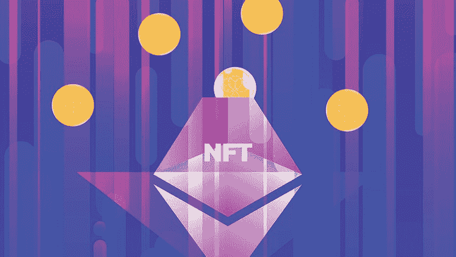
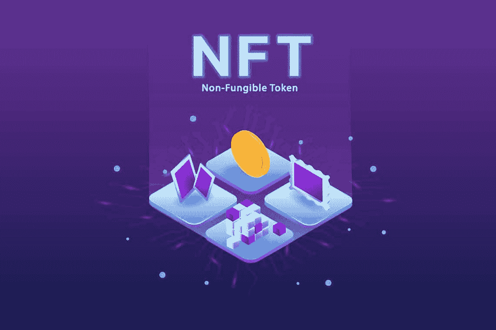
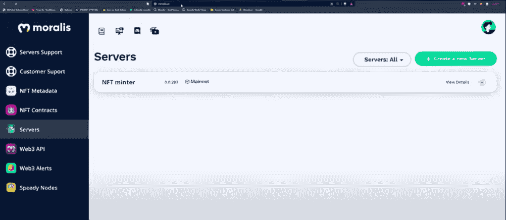
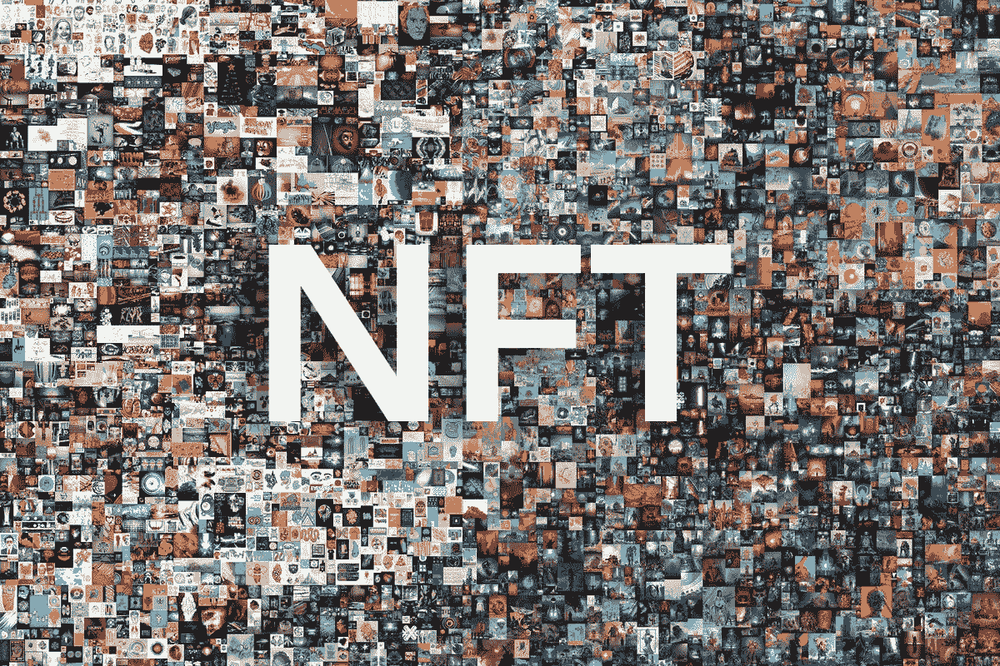
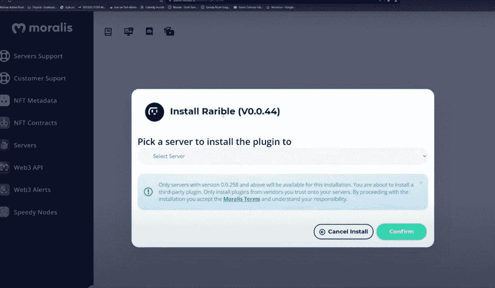
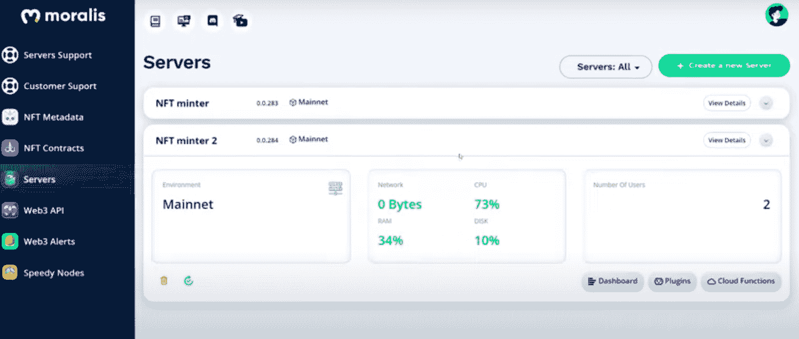
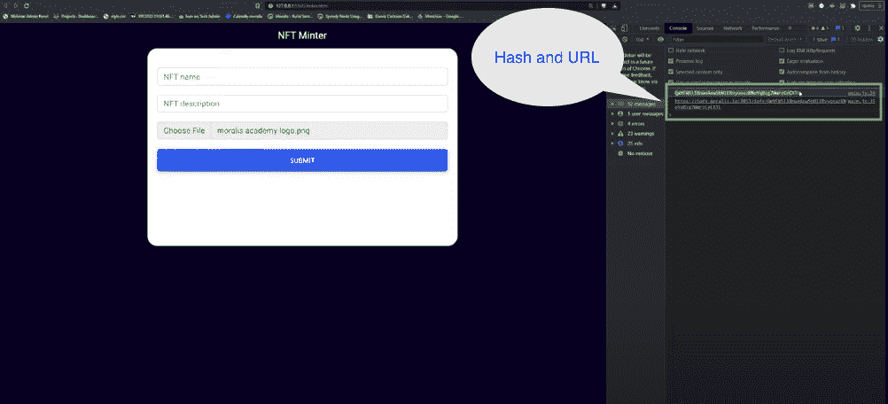
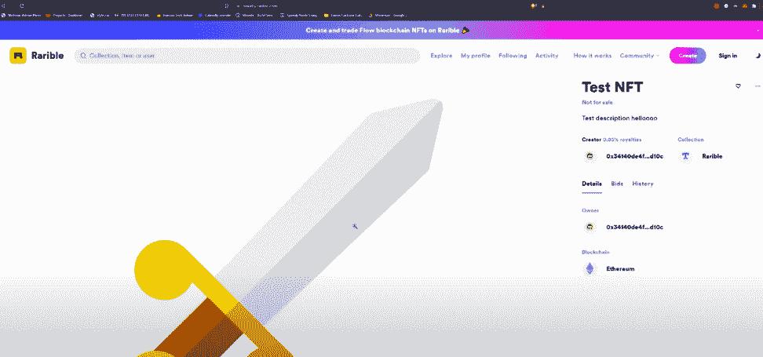

# 如何免费铸造 NFT 而不用付汽油费

> 原文：<https://moralis.io/how-to-mint-nfts-for-free-without-paying-gas-fees/>

大多数开发商和 NFT 艺术家现在都知道，铸造 NFT 绝不便宜。事实上，随着网络变得拥挤，以太坊的煤气费一直在上涨。反过来，NFT 的创造者也多次将打造他们的非专利技术视为无利可图。然而，程序员发现了一种绕过支付汽油费的方法。此外，作为区块链项目的先驱，Moralis 已经找到了一个解决方案，让开发人员实现一行代码，使创作者能够铸造他们的令牌，而无需支付这些高昂的费用。因此，通过 Moralis 的 Rarible 插件，免费制造 NFT 而不支付汽油费是完全可能的，我们将在本文中探讨这一点。

通常，当您想要创建 NFT 时，您需要完成几个步骤。在许多情况下，这些都是冗长的步骤，很难完成。此外，在某些情况下，你需要写一个智能合同。然后，每当你卖掉你的 NFT，一定比例的钱作为佣金进入市场。然而，多亏了 Moralis 创造的奇妙平台，你既不用花油费，也不用写智能合同。通过利用简短的代码行和使用由 Moralis 提供的[稀有插件](https://moralis.io/plugins/rarible-nft-tools/)，你可以使用被称为“懒惰铸造”的概念免费铸造 NFT。在深入本文的主题之前，我们想向您解释一些常用的术语和短语。这样，你会有一个更好的基础，在这个基础上你可以继续学习如何免费铸造非酒精饮料，而不必支付汽油费。

## 无需支付汽油费就能制造 NFT——NFT 和铸造说明

不可替代代币的受欢迎程度与日俱增，NFTs 交易量不断刷新纪录。仅在 2021 年第三季度， [NFT 市场就创造了 106.7 亿美元的收入](https://dune.xyz/sophieqgu/NFT-Marketplaces)，与上一季度相比增长了 700%以上。在数字世界中，不可替代的代币，通常被称为 NFT，是你可以买卖的独特资产，就像物理属性一样。这些数据是不可互换的，这意味着它们没有自己的有形形式。换句话说，你可以将这些区块链代币视为资产和商品所有权的证明。此外，一个图像、GIF、视频，甚至一段音乐都是 NFTs 的例子。此外，NFT 也可以表示物理资产。目前，各种区块链支持 NFTs，包括以太坊、BSC、Trone、EOS 等。，以以太坊为最受欢迎。



然而，mint NFTs 意味着什么，为什么您通常要向“mint”付费？在这里，mint 或 minting 指的是在以太坊等各种区块链上将数字文件转换为资产的过程。通过铸造 NFT，你可以将代币永久保存在数字账簿上，没有人可以编辑或删除它们。这样，NFT 就成了区块链的一部分，你把它们像真硬币一样投入流通。此外，NFT 所有者也可以决定他们的版税。这意味着，每当买家卖出一幅 NFT，原主人都会收到佣金。铸造 NFT 的常见过程是下载以太坊钱包(如 MetaMask ),然后将您的数字内容上传到市场进行铸造。用这种方法，你不能免费制造 NFT，你必须为此付费！然而，跟随学习如何跳过这个昂贵的过程。

### 不用付油费就能生产 NFTs 什么是 NFT 市场？

大多数关于 NFT 的交易发生在 NFT 市场，这相当于易贝或亚马逊，但代币是不可替代的。NFT 有几十个市场，其中最受欢迎的是 OpenSea 和 Rarible。如前所述，您必须获得 ETH(以太坊的本地加密货币，持续波动)才能铸造 NFT。在 [Rarible](https://rarible.com/) 上，成本略高，它向双方收取每笔交易 2.5%的服务费。然而，卖方可以支付相当于最终价格 5%的全部费用。



Moralis 是一个托管、上传和自动化 dApps 的参考，它可以让你通过其稀有的插件制作 NFT 而不用支付汽油费。铸造一辆 NFT 而不付汽油费的过程也被称为“偷工减料”。我们将在本文的后面简要地讨论这个话题。

## **不用付煤气费就能生产 NFTs 开始吧！**

此外，只需按照下面的步骤，免费造币 NFTs。因此，你需要一个 Moralis 帐户，Moralis 服务器，文本编辑器，Moralis 的样板文件，加密钱包(最好是元掩码)，并安装 Moralis 的稀有插件。如前所述，您可以使用 [ERC-721](https://moralis.io/erc-721-token-standard-how-to-transfer-erc721-tokens/) 和 [ERC-1155](https://moralis.io/erc1155-exploring-the-erc-1155-token-standard/) 令牌标准为您的 NFT 设置版税。

按照以下步骤，免费铸造无营养食品:

*   注册一个免费的 Moralis 账户，创建一个 Moralis 服务器。
*   下载您选择的代码编辑器(如 Atom 或 Visual Studio Code [VSC])。
*   在 GitHub 上使用 Moralis 的样板文件。
*   Download [MetaMask](https://moralis.io/metamask-explained-what-is-metamask/) .
*   安装 Moralis 的稀有插件。

请注意，以下小节中的许多代码片段已经在 GitHub 上的 Moralis 样板文件中实现了。

### 创建一个 Moralis 帐户和一个 Moralis 服务器

要将 NFTs 的铸造功能添加到 dApps 中，您需要一个来自 Moralis 的服务器 URL 和应用程序 ID。要获得这些，只需访问 [Moralis](https://moralis.io/) 并免费创建您的帐户。登录到您的帐户后，您必须创建一个新的服务器。为此，只需点击屏幕右上角的绿色按钮(“+创建新服务器”)，并选择 mainnet 服务器。在“我的 Moralis 即时”字段中，输入您想要的服务器名称。然后，设置您的地区并选择您选择的区块链。完成后，单击“添加实例”启动服务器。此外，服务器启动需要一些时间，所以请耐心等待。服务器运行后，单击 view details 按钮，然后复制服务器 URL 和应用程序 ID。然后，将它们粘贴到“main.js”文件中。

```js
const serverUrl = “INSERT SERVER_URL”;
const appId = “INSERT APP_ID”;
```



记住，你不需要网络服务器来打开你的文件。相反，你可以在你的终端上运行 Python 的网络服务器，或者从 VSC 下载“实时服务器”插件。



### 利用您喜欢的代码编辑器

现在，打开你选择的编辑器。根据你的操作系统，你可以使用 Atom，Visual Studio 代码，Oxygen 等。此外，通过右键单击左侧的目录，添加两个文件:一个“index.html”和一个“main.js”文件。然后，转到 [Moralis GitHub](https://github.com/MoralisWeb3/demo-apps/tree/main/moralis-vanilla-boilerplate) 页面获取样板文件(可重用的代码片段)。只需复制 HTML 和 JavaScript 代码，并将其粘贴到编辑器中的附属文件中。样板文件将帮助您创建一个可工作的 UI 和创建 NFT 所需的功能。最后，您可以将该功能集成到 dApps 中。观看我们的 [YouTube 频道](https://www.youtube.com/watch?v=n6rPr0sStTI&t=20s)上的教程视频，学习如何调整 HTML 和 JavaScript 代码。

### 从 GitHub 下载 Moralis 的样板文件

如果您想以简单的方式创建 dApp，您可以利用我们的样板文件作为快捷方式。这个样板文件包含了 NFT 明特 dApp 入门的所有必要代码。因此，您可以获取必要的文件和完整的代码，然后将其导入到代码编辑器中。为此，请查看我们的 [GitHub 页面](https://github.com/MoralisWeb3/youtube-tutorials/tree/main/nft-minter)。*由于样板文件包含一些无用的功能和元素，你可以继续删除它们。*

### 下载元掩码并实现加密登录

如前所述，您需要一个加密钱包来验证 dApps 中的用户并证明 NFTs 的所有权。

为了使您的 dApps 用户能够使用 MetaMask 进行身份验证，您需要实现 [Moralis 文档](https://docs.moralis.io/moralis-server/users/crypto-login)中提供的必要代码。下面是代码的一部分:

```js
Moralis.authenticate().then(function (user) {
    console.log(user.get('ethAddress'))
})
```

这将把[连接到 MetaMask](https://metamask.io/) 并请求签名(不需要气体！).关于如何实现元掩码认证的更详细的解释，请参见我们的[文档](https://docs.moralis.io/moralis-server/users/crypto-login)。

#### 使用 Moralis API 来制造 NFT 而不用支付汽油费

[Moralis 的 API](https://docs.moralis.io/moralis-server/web3-sdk) 可让您获得用户的详细信息(如代币和 NFT 余额、NFT 所有权、交易历史等)。).这个来自 Moralis 的 API 非常有益，因为它允许您在 dApp 中实现特定的功能。例如，您可以为您的 dApp 实现一个 DEX，这将使您的 dApp 在竞争中脱颖而出。

此外，为了给 HTML 文件添加样式，您可以到 [MDBootstrap](https://mdbootstrap.com/) 库获取一个简洁的 CSS 文件。然后，复制 [CSS 文件](https://mdbootstrap.com/docs/standard/getting-started/installation/)，并将其粘贴到 HTML 代码的 head 元素中。

通过 CDN 安装可能是从 Bootstrap 实现套件的最简单方式。关于如何做到这一点的更多信息，请查看 [*MDBootstrap.com 的解释*](https://mdbootstrap.com/docs/standard/getting-started/installation/) *。*

### 安装 Moralis 的稀有插件

在微调你的 dApp 的 UI 和切换 JavaScript 功能后，安装 Moralis 的 Rarible 插件。因此，它将使安全地创建、销售或收集数字物品成为可能。此外，Moralis 的 Rarible 插件可以让你[懒惰地制造 NFT](https://moralis.io/how-to-lazy-mint-nfts/)，这意味着你可以制造 NFT 而不用支付汽油费。在这种方法中，只有 NFTs 的第一个购买者必须支付燃气费。一般来说，要创造新的非功能性交易，你必须通过汽油费来支付创造智能合同和非功能性交易的费用。然而，通过使用 Moralis 的 Rarible 插件，你可以免费创建 NFT。



要获得插件，前往[Moralis.io/plugins](https://moralis.io/plugins/)，点击“稀有 NFT 工具”插件，然后点击“安装插件”。然后，您在 Moralis 中的帐户的管理界面将会打开。在弹出窗口中选择您的服务器(如上图所示),然后单击确认按钮。然后，Rarible 插件的配置页面将会打开。在这里，您应该添加 mainnet 和 Rinkeby 网络的 [Moralis Speedy Nodes](https://moralis.io/speedy-nodes/) 端点信息(这可能会有所不同，取决于您在启动服务器时选择的网络)。然而，有一个更新的方式，很快，你将不再需要手动复制和粘贴 Moralis 的快速节点信息。

## **不用支付汽油费就能制造 NFT——构建逻辑**

现在是时候添加一些逻辑了。我们必须通过调整“main.js”文件来添加将图像上传到网页的功能。为了添加这个功能，我们需要添加一个“submit()”函数。但是，下面的代码片段只是一个简化的解释。因此，我们建议在 YouTube 上查看我们的[NFT·明特编程教程](https://www.youtube.com/watch?v=n6rPr0sStTI&t=20s)视频，该视频解释了如何实现、调整和添加更多代码到以下代码中:



```js
async function submit(){
    const input = document.querySelector('#input_image');
    let data = input.files[0]
    const imageFile = new Moralis.File(data.name, data)
    await imageFile.saveIPFS();
    let imageHash = imageFile.hash();
```

接下来，无论何时上传图片，你都将拥有 IPFS 网址和它的加密散列。IPFS，代表“星际文件系统”，是一个对等网络，用于在分布式文件系统上存储和共享数据。如果你的电脑上有[“Brave browser](https://brave.com/)”，在它的地址栏中输入“ipfs://”并粘贴哈希值。通过点击“输入”按钮，IPFS 网络将获取图像。



关于使用 Moralis 的 Rarible 插件免费创建 NFT 的详细信息可以在我们的[文档](https://moralis.io/plugins/rarible-nft-tools/)中找到。此外，下面的代码片段应该添加到您的“main.js”文件中:

```js
await Moralis.Plugins.rarible.lazyMint({
  chain: 'rinkeby',
  userAddress: '0x7f64041298CC2C045FE5eb0e897ab7b5D4BdB4F3',
  tokenType: 'ERC1155',
  tokenUri: '/ipfs/QmWLsBu6nS4ovaHbGAXprD1qEssJu4r5taQfB74sCG51tp',
  supply: 100,
  royaltiesAmount: 5, // 0.05% royalty. Optional
})
```

您可以编辑以上所有内容的输入。例如，您可以从 Rinkeby 更改为 mainnet，或者将“TokenType”从“ERC1155”更改为“ERC721”。“tokenURl”将是您的元数据，“supply”显示您想要的“mints”的数量。如前所述，您也可以为令牌指定版税。这样，在你卖掉你的 NFT 后，你可以从用那个 NFT 购买的商品中得到一定比例的佣金。因此，您可以随意将上述值更改为您希望的任何值。此外，如果您想出售您的 NFT，您可以在代码片段中包含以下行:

```js
 list: true, // only if lazy listing
  listTokenAmount: 3, // only if lazy listing
  listTokenValue: 10 ** 18, // only if lazy listing
  listAssetClass: 'ETH', // only if lazy listing || optional
```

## **免费制作 NFT——如何在 Rinkeby 网络上找到您的 NFT？**

一旦你上传了图像，如果一切顺利，你将会收到一个 200 成功的信息。“令牌 ID”和“令牌地址”也将显示在元数据中。若要检查您的 NFT，请前往 ["Rinkeby。Rarible.com](https://rinkeby.rarible.com/)网站。点击网站上的一个标记，找出 URL 的结构。令牌地址(或合同地址)后面应该跟有令牌 ID。按照这个结构，您可以在“main.js”文件中构建您的地址:

```js
//https://rinkeby.rarible.com/token/TOKEN_ADDRESS: TOKEN_ID
```

接下来，您应该按照上面的顺序添加您的输入，并将结果 URL 粘贴到地址栏中。现在你应该看到你的令牌如下。请记住，从 IPFS 获取图像需要一些时间。通过登录您的帐户，您可以控制您的 NFT，例如，将它出售。



要了解更多关于 Moralis 的基础设施能力，请查看我们的网站和文档。在那里，您将了解如何将 Moralis 的 API 集成到您的 dApps 中，并使用最简单的编程技巧构建您自己的区块链项目。

#### 视频教程，教你如何在不支付汽油费的情况下免费制作 NFT

如前所述，要想更详细、更深入地了解这里解释的代码，请查看我们的 GitHub 页面，或者观看下面的 YouTube 视频。在那里，来自 Moralis 的 Filip 讲述了如何利用 Moralis 的稀有插件构建 dApp:

https://www.youtube.com/watch?v=n6rPr0sStTI&t=20s

## **总结如何在不支付燃气费的情况下制造 NFTs】**

NFT 市场的人气正在快速增长，每天都有更多的人参与进来。然而，在使用传统方法时，铸造 NFTs 不是免费的。换句话说，你必须花钱出售你的数字艺术收藏。但是 Moralis，作为构建 dApps 的后台基础设施的先驱提供商，已经让它免费成为可能。使用 Moralis 的 Rarible 插件和预制代码，您可以免费创建 NFT 并将这一功能集成到您的项目中。Moralis 提供的奇妙的 API 将使你把你的数字艺术变成数字资产成为可能。此外，在你学会了如何免费制作 NFT 之后，你可以使用我们的代码片段来出售它们。只需阅读我们的文档，阅读说明，并开始免费铸造 NFT！