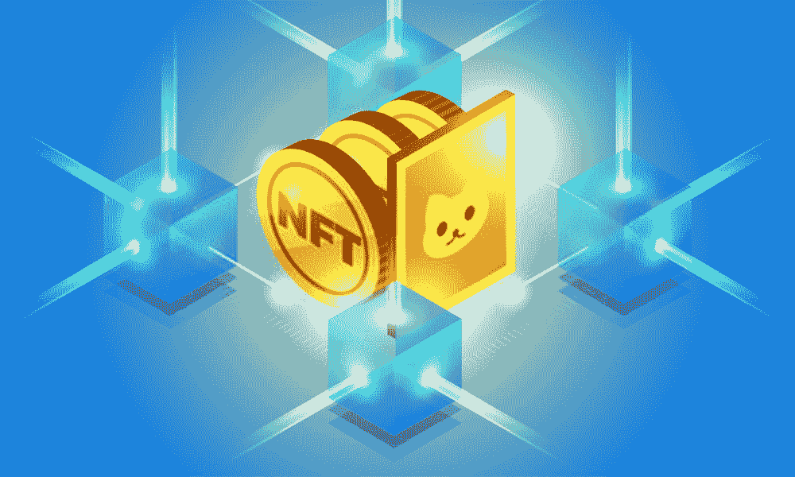
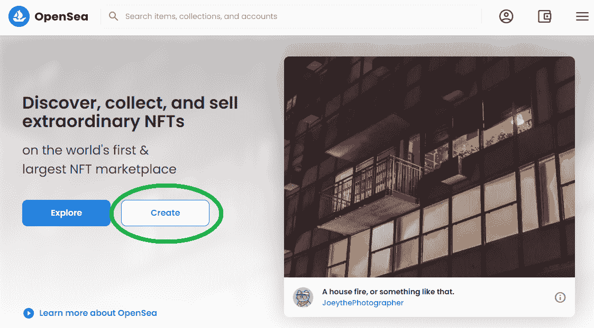
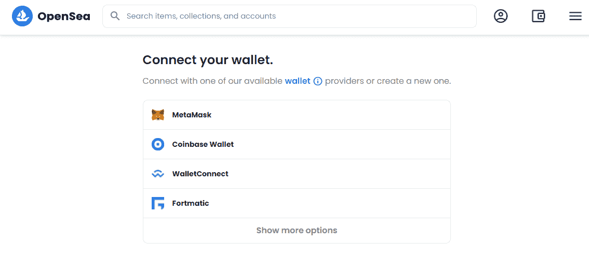
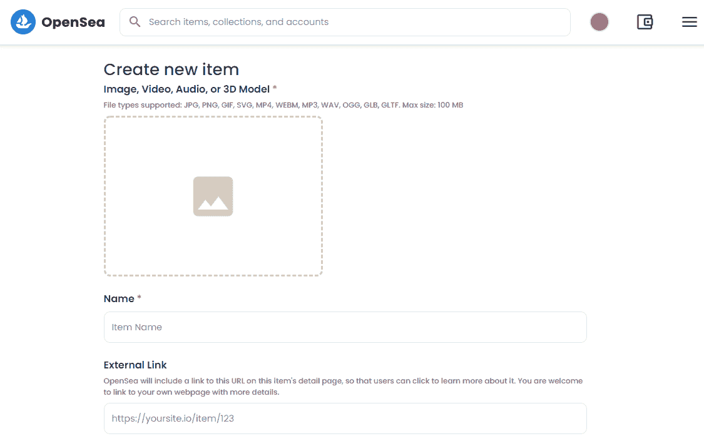
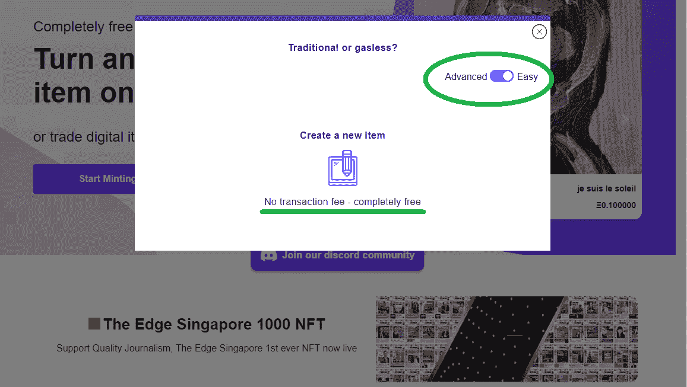

# 如何铸造 NFTs 铸造 NFT 的完整教程

> 原文：<https://moralis.io/how-to-mint-nfts-full-tutorial-to-minting-an-nft/>

**随着不可替代令牌(**[**【NFT】**](https://moralis.io/non-fungible-tokens-explained-what-are-nfts/)**)如** [**ERC721 令牌**](https://moralis.io/erc-721-token-standard-how-to-transfer-erc721-tokens/) **标准的不断采用，很明显 NFT 是一种流行的区块链技术用例。此外，随着普通人听到所有关于数字艺术和收藏品的消息，NFT 越来越受欢迎是有道理的。此外，随着开发人员发现更多的 NFT 用例，以及 NFT 如何用于游戏、虚拟事件、数字所有权、会员证明等。很明显，为什么个人想知道如何制造非功能性食品。因此，我们将在这篇“铸造 NFT 的完整教程”文章中解释铸造 NFT 意味着什么以及如何铸造非功能晶体管。此外，我们还将展示制造 NFT 的各种方法。因此，你可以决定哪里是铸造 NFT 最好的地方。**

我们将从介绍一些基础知识开始这篇文章，这将有助于您理解什么是 NFT。我们也会确保你知道“铸造 NFT”意味着什么。此外，虽然 NFT 市场或 NFT 平台可能是普通人铸造 NFT 的最简单的解决方案，但这些解决方案并没有真正分散。因此，我们将向您展示另一种简单的方法，使您能够以完全分散的方式创建 NFT。此外，在我们看来，后者是为每个开发人员打造 NFT 的最佳方式，主要是因为你不需要担心后端编码，这可以完全由[Moralis](https://moralis.io/)——终极 [Web3](https://moralis.io/the-ultimate-guide-to-web3-what-is-web3/) 开发平台涵盖。通过与 Moralis 签约，您可以完全使用 Moralis 强大的 [NFT API](https://moralis.io/ultimate-nft-api-exploring-moralis-nft-api/) 进行强大的 [NFT 令牌开发](https://moralis.io/nft-token-development-the-ultimate-guide/)，这意味着您可以在创纪录的时间内建立并运行自己的 NFT 铸造平台。

## 如何创造非功能性食物的基础——什么是非功能性食物？

如前所述，在我们仔细研究如何创建 NFT 之前，我们首先要确保您已经掌握了最新的知识。因此，让我们从一开始就回答什么是 NFT？”。不可替换令牌(NFT)是一种特殊的加密资产。正如“不可替代”一词所暗示的，每个 NFT 都是独一无二的。因此，即使当两个 NFT 表示相同的数字文件或者本质上是相同 NFT 的副本时，它们也具有唯一的链上属性。考虑到这一点，数字艺术和收藏品是这种令牌最明显的用例就不足为奇了。

此外，从区块链的角度来看，NFT 本质上是具有特定元数据的事务。然而，由于我们可以将任何数字文件分配给该事务，因此我们可以将 JPEGs、MP3、pdf 和其他数字文件转换为加密资产。因此，当我们谈论如何创建 NFT 时，可能会有些混乱。它是指那个数字文件的创建吗？它是指交易的执行，还是指以独特的加密资产结束的整个过程？嗯，这取决于你问谁。

数字艺术家会说 JPEG 或音频文件的创建是关键部分。另一边，开发者可能会告诉你，是交易的执行。因此，考虑整个过程可能是正确的中间立场。然而，由于在将数字文件分配给存储在区块链上的特定事务之前，它与 NFTs 没有任何关系，所以我们相信开发人员可能有一个好的观点。此外，“铸造 NFT”一词解决了这一困惑。

### 铸造 NFT——这意味着什么？

动词“mint”主要指政府发行的冲压金属硬币。然而，加密社区在涉及 NFTs 时使用了相同的术语。因此，“铸造”或“铸造”NFT 指的是执行前面提到的交易的过程。通过这样做，我们将特定的数字文件和我们确定的其他参数分配给 NFT。所有这些数据都被写入区块链总账的一个特定块中，从而成为元数据。

## **如何铸造 NFT**

现在你已经知道了基础知识，包括理解什么是铸造，你已经准备好学习如何铸造 NFT。如前所述，创建 NFT 有不同的方法。因此，你需要知道你的喜好。例如，如果你想在尽可能短的时间内铸造一个 NFT，你不知道如何编码，你可以看看过去的集中方面，你可能想使用一个有信誉的 NFT 市场。

另一方面，如果你精通 [JavaScript](https://moralis.io/javascript-explained-what-is-javascript/) ，对 Web3 有基本的了解，并且是去中心化的真正倡导者，使用 Moralis 来创建你自己的铸造 [dApp](https://moralis.io/decentralized-applications-explained-what-are-dapps/) 可能是正确的方式。

此外，请注意，我们将在这里重点关注非功能性测试的铸造方面。这意味着我们假设您已经准备好要转换成 NFT 的数字文件。此外，您应该能够确定希望分配给 NFT 的属性类型。此外，您还需要明确您希望 NFT 具备的功能(如果有的话)。清楚这些方面也将帮助你确定你是否能够在一个已知的 NFT 市场满足你的 NFT 需求和期望，或者你是否需要卷起袖子自己打造一个造币 dApp。

## **如何集中铸造非专利产品**

有几个相对知名的 NFT 平台或 NFT 市场可供任何有加密钱包的人使用。包括 Rarible，SuperRare，OpenSea，Mintable，Nifty Gateway 等。此外，一些主要的集中交易所，如 FTX 和币安，最近也开设了自己的 NFT 市场。

此外，由于 OpenSea 仍然是最受欢迎的选择，我们将把一些注意力放在这个特殊的 NFT 市场上。因此，我们将仔细看看如何在 OpenSea 上铸造 NFT。然而，我们必须指出，这是一种集中铸造 NFT 的方式。所以不是我们推荐给精通或者编码功底扎实的人。然而，这是迄今为止最快、最简单的铸造 NFT 的方法。

你还应该记住，铸造 NFT 并不局限于[以太坊](https://moralis.io/full-guide-what-is-ethereum/)。当然，以太坊仍然是最受欢迎的推出代币的区块链，无论是可替代的还是不可替代的，但也有其他声誉良好的链可用(如雪崩、[币安智能链](https://moralis.io/what-is-bep20-full-binance-smart-chain-token-guide/) (BSC)、Polygon、Solana 等)。).然而，大多数领先的 NFT 市场只关注以太坊。

### 如何在 OpenSea 上创建 NFT

如果你想在 OpenSea 上制作一个 NFT，你可以使用 Moralis 的 OpenSea 插件。否则，你可以从访问 [OpenSea](https://opensea.io/) 的官方网站开始。在那里，您需要点击“创建”按钮:

在下一步中，将要求您连接您的钱包。你会有多种选择(见下图)；然而，我们认为[元掩码](https://moralis.io/metamask-explained-what-is-metamask/)是最好的选择。MetaMask 也是你未来 dApp 中[以太坊认证](https://moralis.io/ethereum-authentication-full-tutorial-to-ethereum-login-programming/)最简单的方式。因此，我们将使用这种类型的加密钱包。

点击您选择的钱包并登录后，您将进入一个页面，在此您可以铸造您的 NFT:

在顶部，您可以添加一个想要转换为 NFT 的文件。你只需点击图像图标，然后从你的电脑中选择文件。

*在这一点上，你可能会看到第一组局限性。仅支持某些文件类型(JPG、PNG、GIF、SVG、MP4、WEBM、MP3、WAV、OGG、GLB、GLTF)，并且文件不能大于 100MB。*

上传文件后，你可以给你的 NFT 命名。这可以是任何内容，但不能留空。所有其他功能都是可选的。一旦你上传了文件并给你的 NFT 命名，激活页面底部的“创建”按钮。通过点击它，你可以铸造你的 NFT。

此时，请确保将您的元掩码连接到以太坊的 mainnet。此外，请记住，在以太坊区块链铸造一个 NFT 可能会在汽油费方面非常昂贵。因此，你的钱包里需要有足够的 ETH 来支付交易费用。一旦你铸造了你的 NFT，你可以卖掉它或者把它转移到另一个地址。

### 上市 vs 铸造 NFT

在我们仔细研究如何用 Moralis 铸造 NFT 之前，我们想告诉你，一些平台(如“Mintable”[见下图])给你一个机会来列出你的 NFT，而不是实际铸造它们。这意味着您将经历一个类似的过程，如前一节所述，但不是通过在区块链上实际铸造一个 NFT 来完成，而是将信息存储到您在该平台上的帐户中。这意味着 NFT 实际上不是铸造的，也不存在于区块链。相反，它正在等待一个潜在的买家购买它，并铸造它。当然，你也可以稍后自己制作。

这种选择使你可以避免支付交易费用，因为你把铸币权交给了潜在的买家。但是，请记住，您是在委托一个集中的平台来保存您的文件和所有与 NFT 相关的信息。

此外，“上市”也指拍卖或出售你现有的非上市公司。这意味着你拥有一个 NFT 或者多个非功能性物品，并且正在使用 NFT 的一个市场来展示和出售它们。

## **如何以分散的方式制造 NFTs】**

如前所述，这就是铸造 NFT 的方式。此外，这种 NFT 造币法仍然使你能够使用一些集中的方面或者采用完全分散的方法。对于后者，我们指的是您的数字文件(将被转换为 NFT 的文件)存储解决方案。您可以将文件放在任何一种集中式云存储选项中。或者您可以使用与 [Moralis 的 SDK](https://moralis.io/exploring-moralis-sdk-the-ultimate-web3-sdk/) 完全兼容的 [IPFS](https://moralis.io/what-is-ipfs-interplanetary-file-system/) 分散存储解决方案。同样，我们更喜欢关注分散的解决方案。

当以分散的方式铸造 NFT 时，诸如运行自己的[节点](https://moralis.io/node-js-explained-what-is-node-js/)和精通[可靠性](https://moralis.io/solidity-explained-what-is-solidity/)之类的事情可能看起来很麻烦。然而，当你使用 Moralis，你不必担心这些事情。此外，一旦你创建了免费的 Moralis 家账户，你就可以使用[Moralis 家快捷节点](https://moralis.io/speedy-nodes/)。此外，使用 Moralis 的 SDK 及其先进的 [Web3 API](https://docs.moralis.io/moralis-server/web3-sdk/intro) ，你将能够用你的 JavaScript 知识覆盖所有的编程。此外，您将拥有加密行业中最好的[文档之一](https://docs.moralis.io/)，在整个过程中为您提供帮助。因此，您将通过复制和粘贴简短的代码片段来涵盖所有后端编码。

要创建您自己的 NFT 铸币 dApp，请遵循以下视频中提供的说明。在这里，你将有机会跟随 Moralis 的专家解释整个过程。但是，在观看视频之前，请确保完成设置 Moralis 服务器的过程。我们将在本文的下一节解释所有的步骤。

https://youtu.be/WdQHnb_5m5Q

### 用 Moralis 铸造 with 设置

设置 Moralis 非常简单，只需以下四个步骤:

1.  [**创建你的 Moralis 家账户**](https://admin.moralis.io/register)——如果你还没有创建你的 Moralis 家账户，确保现在就创建。该链接会将您带到注册页面，在这里您可以输入您的电子邮件地址并创建您的密码。接下来，您通过点击发送到您的电子邮件地址的确认链接来确认您的电子邮件地址。如果你已经有了一个有效的 Moralis 账户，只需[登录](https://admin.moralis.io/login)。

2.  **创建新服务器**–登录您的 Moralis 账户后，您可以创建新服务器；只需点击 Moralis 管理页面右上角的“+创建新服务器”按钮。接下来，从出现的下拉菜单中单击给定的选项之一(见下图)。

输入所需的详细信息:服务器名称(可以是您想要的任何名称)，选择区域、网络、链(您可以选择一个或多个选项)，然后单击“添加实例”:

3.  **获取服务器详细信息**–一旦您的服务器准备就绪，您需要获取详细信息以在您的”中使用。html“或”。js”文件。单击服务器名称旁边的“查看详细信息”按钮(见下图)。弹出窗口出现后，您将看到您需要的所有信息(您感兴趣的是“服务器 URL”和“应用程序 ID”信息)。*如果你以前用过 Moralis，你可能已经设置了一个或多个服务器。在那种情况下，你可以使用任何一个。*

4.  **初始化 Moralis**–要完成 Moralis 设置，您需要填充。html“或”。js”文件，其中包含服务器 URL 和应用程序 ID 信息，这些信息是您在上一步中获得的:

*注* *:上图中的服务器细节与我们的服务器相关。您应该使用特定服务器的详细信息。*

## 如何铸造 NFTs 铸造 NFT 的完整教程-摘要

当铸造一个 NFT 时，你基本上是在一个特定的链上创建一个交易。这意味着您可以将相关信息存储在特定的块中。此外，如果你已经读完这篇文章，你知道有几种方法可以铸造一个 NFT。如果你不介意集中的平台和有限的选择，你可以通过使用一个流行的 NFT 市场来完成这个过程，比如 OpenSea。然而，为了以完全分散的方式制造 NFT，您需要进行一些编程。幸运的是，有一个名为 Moralis 的强大平台可以让这个过程变得简单很多。它为您提供了 Moralis Speedy 节点、服务器和最终的 Web3 SDK，以覆盖与区块链相关的后端编码。因此，利用您的 JavaScript 技能，您可以轻松完成“如何制造 NFT”的任务。

能够铸造 NFT 是一项非常有用的技能；然而，如果 Moralis 站在你这边，你还可以做更多的事情。得益于 Moralis 的跨链互操作性，您的 dApps 能够适应未来。此外，您可以在所有主要的区块链上部署 Web3 应用程序。因此，如果您想在 BSC 或 [Avalanche](https://moralis.io/how-to-build-avalanche-dapps-in-minutes/) 上开发，您不需要处理 RPC 节点的[限制，因为 Moralis Speedy 节点是 BSC 的最佳](https://moralis.io/exploring-the-limitations-of-rpc-nodes-and-the-solution-to-them/)[Infura](https://moralis.io/infura-bsc-alternatives-the-best-alternative-to-infura-for-bsc/)和 Avalanche 的最佳[Infura](https://moralis.io/infura-for-avalanche-exploring-infura-avalanche-alternatives/)替代品。

此外，请务必查看 [Moralis 的 YouTube 频道](https://www.youtube.com/c/MoralisWeb3)和 [Moralis 的博客](https://moralis.io/blog/)以获取更多深入的文章和示例项目。例如，学习如何使用 Moralis 的[以太坊 API](https://moralis.io/ethereum-api-develop-ethereum-dapps-with-moralis/) ，一个示例 [React dApp 模板](https://moralis.io/react-dapp-template-how-to-build-a-react-dapp/)，或者[区块链开发的最佳语言](https://moralis.io/best-languages-for-blockchain-development-full-tutorial/)——仅举几个例子。因此，通过让 Moralis 从头到尾指导你的开发过程来解决你独特的项目！