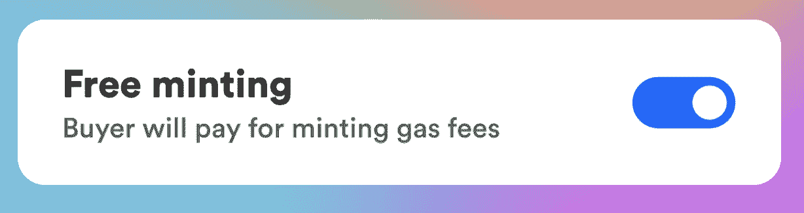
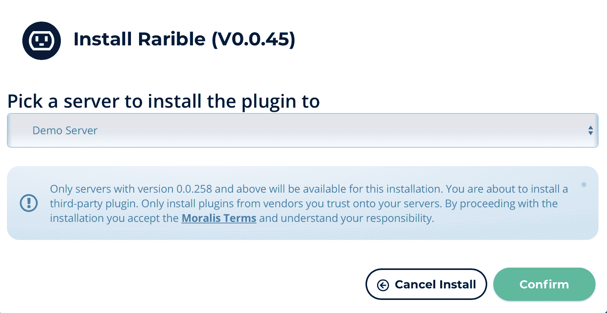
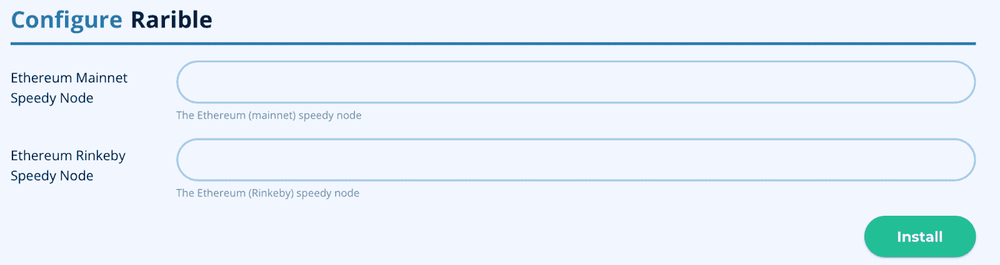
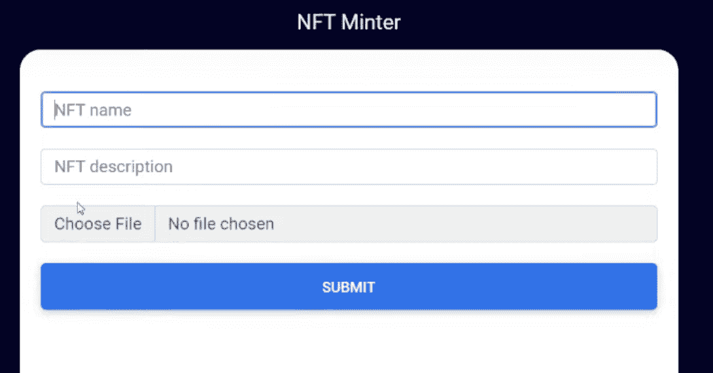
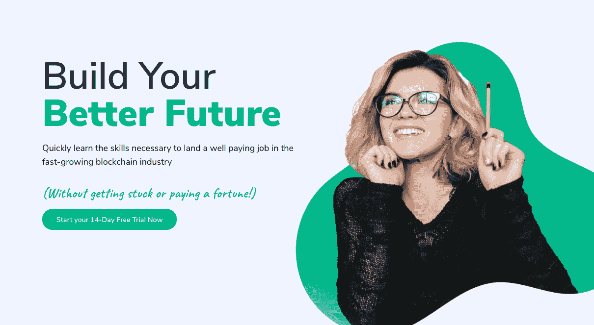
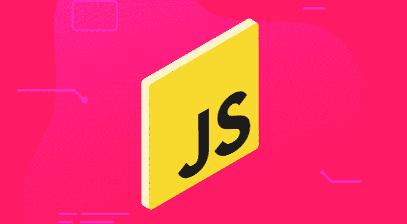

# 如何在没有汽油费的情况下制造 NFT

> 原文：<https://moralis.io/how-to-mint-nfts-without-gas-fees/>

造币[](https://moralis.io/non-fungible-tokens-explained-what-are-nfts/)****从传统的角度来看，由于网络拥堵，艺术家和创作者需要支付昂贵的煤气费。这反过来又阻碍了 NFT 艺术家进入区块链空间，因为这些费用使得制造非功能性艺术作品的过程无利可图。然而，由于不可替换的令牌是加密行业最突出的特征之一，开发者已经探索出一种无需支付任何汽油费就能制造 NFT 的方法。因此，引入了惰性铸造的概念，解决了这个问题。因此，让我们更深入地探讨一下什么是 NFT 这个话题，然后看看人们如何在没有汽油费的情况下制造 NFT 的过程。然后，你将很好地配备了适当的工具来快速铸造 NFT，同时，以经济高效的方式铸造 NFT。****

**随着网络变得拥挤，天然气价格飙升，使得与各种网络互动在经济上不可行。反过来，制作 NFT 变得昂贵，这给艺术家带来了经济压力。然而，通过利用惰性铸造，有可能将费用向前推，直到卖出一个 NFT。此外，当使用排名第一的 [Web3](https://moralis.io/the-ultimate-guide-to-web3-what-is-web3/?utm_source=blog&utm_medium=post&utm_campaign=How%2520to%2520Lazy%2520Mint%2520NFTs) 操作系统——[Moralis](https://moralis.io/)时，懒惰铸造变成了一项简单的任务。有了这个平台，只需四个步骤就可以创建一个 dApp(去中心化应用程序)来制造 NFTs，而不需要支付汽油费！**

**这是可能的，因为 Moralis 提供了优秀的开发工具，如 [Moralis Speedy Nodes](https://moralis.io/speedy-nodes/?utm_source=blog&utm_medium=post&utm_campaign=How%2520to%2520Lazy%2520Mint%2520NFTs) 、Moralis 的 [NFT API](https://moralis.io/ultimate-nft-api-exploring-moralis-nft-api/?utm_source=blog&utm_medium=post&utm_campaign=How%2520to%2520Lazy%2520Mint%2520NFTs) 和 [Price API](https://moralis.io/introducing-the-moralis-price-api/?utm_source=blog&utm_medium=post&utm_campaign=How%2520to%2520Lazy%2520Mint%2520NFTs) ，更重要的是，还有一个完全托管的后端基础设施。这不仅为非功能性测试，也为所有未来的区块链项目提供了一个更容易使用的开发过程。**

**出于这些原因，如果你正在寻找参与区块链行业的扩散，第一步是注册与 Moralis！**

### **什么是 NFT？**

**在仔细研究如何在没有汽油费的情况下制造 NFT 之前，让我们先来看看什么是 NFT。 [NFT](https://moralis.io/non-fungible-tokens-explained-what-are-nfts/) 是不可替换令牌的缩写，在实际术语中可以找到它们是什么的线索。**

**

“可替代的”这个词是一个传统的经济术语，指的是可互换的资产。这意味着用一个单位的可替代资产交换另一个单位是可行的，因为它们具有相同的类型和价值。在传统经济学中，任何货币都被视为可替代资产。此外，比特币是可互换的代币，这意味着一个比特币等于另一个比特币，使它们可以互换。

由于可替代资产是可互换的，这表明不可替代资产是不可互换的。因此，不可替代资产的类型和价值不同。这意味着一个 NFT 不能直接与另一个互换，因为它们的特性不同。此外，更传统的不可替代资产可以是财产。房子通常是独一无二的，因为它们设计不同，位于不同的地方。这意味着一所房子的价值并不总是等于另一所房子的价值。因此，它们是不可互换的。

此外，由于其唯一性，NFT 是不可互换的令牌。这种独特性使得 NFTs 非常适合表示独特资产的所有权。他们可以代表从数字到物理资产的所有东西的所有权。然而，当我们谈到被认为是“懒惰铸造”的 NFT 时，重要的是要知道 NFT 只代表资产的所有权。这意味着实际的资产在铸造之前并不存在于区块链上。令牌只是指向特定资产的所有者。这可能会令人困惑，但它的工作方式类似于房契。房契本身并不包含财产，但指向了所有者。

## 什么是懒造币？

区块链工业的一个重要问题是拥挤的网络。其主要影响是天然气价格的上涨和波动。因此，在[以太坊](https://moralis.io/full-guide-what-is-ethereum/?utm_source=blog&utm_medium=post&utm_campaign=How%2520to%2520Lazy%2520Mint%2520NFTs)上进行交易是一个非常昂贵的过程。此外，这也意味着铸造代币的过程可能相对昂贵。由于高昂的油价，数字艺术家受到了限制，因为制作 NFT 在经济上已经不可行。



这个问题的答案是懒惰的铸造。惰性铸造允许延迟铸造过程。因此，现在可以将实际的铸造推到购买点。这意味着创造点被移到了区块链的后半部分，铸造的重担被移交给了 NFT 的买家。有了惰性铸造，艺术家和开发人员可以自由地创建无初始成本的 NFT，因为这只有在有人实际购买 NFT 时才变得相关。

此外，这不仅有利于艺术家，也有利于整个区块链社会。当铸造过程被推到购买点时，只有购买的 NFT 被铸造。这减少了网络上的交易数量，消除了一些压力。

## 如何在没有汽油费的情况下制造 NFT

如果没有合适的工具，懒惰制造 NFT 可能是一项相当复杂的工作。因此，我们将在整个教程中使用 Moralis，因为这使得这个过程更容易理解。在这种情况下，我们将创建我们自己的懒惰铸币 NFT dApp。这种 dApp 将允许我们连续铸造 NFT，而不必支付任何天然气费用。因为我们要使用 Moralis，这个过程可以通过四个简单的步骤实现:

1.  创建一个 Moralis 服务器。
2.  从 Moralis 添加“稀有 NFT 工具”插件。
3.  创建一个 HTML 文件。
4.  加上 dApp 的逻辑。

Moralis 的众多特性之一是[插件商店](https://moralis.io/plugins/)。在这里我们会找到“[稀有 NFT 工具](https://moralis.io/plugins/rarible-nft-tools/)”插件，每个拥有 Moralis 账户的人都可以使用。这个插件使我们能够用一行代码轻松创建 NFT。这与已经管理的后端基础设施相结合，使得创建这个 dApp 变得轻而易举。因此，没有任何进一步的麻烦，让我们进入如何薄荷无油费的过程！

### 第一步:如何在没有汽油费的情况下制造 NFTs 创建一个 Moralis 服务器

如果您还没有，本教程的第一部分是创建一个 Moralis 帐户。这只需要几秒钟，而且完全免费！登录后，您可以通过点击界面右上角的“+创建新服务器”来创建新的 Moralis 服务器。这将提供三种选择；然而，对于本教程，选择哪一个并不重要。

一旦选择了任何一个选项，您需要添加一个服务器名称，选择一个区域，最后选择网络。由于 Moralis 支持跨链兼容性，因此可以选择多个网络。您对网络的选择应基于您希望在哪里启动 dApp。添加完所有选项后，您可以点击“Add Instance”按钮启动服务器。


完成服务器的创建可能需要几分钟的时间，但是它很快就会启动并运行，所以没什么好担心的。现在，有了 Moralis 服务器，我们就可以进入流程的第二步了。

### 第二步:如何在没有汽油费的情况下制作 NFTs 添加来自 Moralis 的“稀有 NFT 工具”插件

这个过程的第二步是添加“稀有 NFT 工具”插件。为此，您需要单击刚刚创建的服务器右侧的向下箭头按钮。然后，点击“插件”按钮，最后导航到插件商店。

有各种插件；然而，在这种情况下，我们想点击“阅读更多”按钮的“Rarible NFT 工具”插件。这将把你带到插件的页面，在那里你会找到关于如何使用插件的更多信息。尽管如此，要安装插件，你只需要点击页面右上角的“安装插件”按钮。



一旦点击，你需要选择正确的服务器，然后配置 Rarible。要配置 Rarible，您需要为以太坊 mainnet 和 Rinkeby testnet 添加 Moralis Speedy 节点。因为你是 Moralis 用户，你可以在 Moralis 管理面板的“快速节点”标签下找到这些。



添加了 Moralis Speedy 节点后，只需点击右下角的“安装”按钮。添加插件可能需要一段时间；但是，它会很快完全发挥作用。

### 第三步:如何在没有汽油费的情况下制作 NFTs 创建一个 HTML 文件

服务器启动并运行，安装了适当的插件后，下一步是使用 HTML 代码构建网站的内容。为此，我们需要做的第一件事是打开首选的 IDE(集成开发环境)并创建一个名为“index.html”的新文件。

构建 dApp 的内容应该根据你自己的喜好来完成，这取决于你想要的 UI(用户界面)的外观。然而，为了让你了解一个懒惰的铸造 dApp 可能是什么样子，我们从 Moralis YouTube 频道中选取了一个例子:



如您所见，该应用程序有一个标题、三个输入字段和一个提交按钮。因此，有必要为这些元素添加 HTML 代码。这方面的代码非常简单，您可以轻松地添加自己的想法。然而，如果你有兴趣仔细查看 HTML 文件中的完整代码，你可以在 Moralis GitHub 库的“[index.html](https://github.com/MoralisWeb3/youtube-tutorials/blob/main/nft-minter/index.html)”下找到它。

由于代码是不言而喻的，这是一个关于如何在没有汽油费的情况下制造 NFT 的教程，我们将不会进入代码的任何细节。此外，由于内容的结构取决于 dApp 的开发者，这很可能会根据您自己的偏好而变化。

### 第四步:如何在没有汽油费的情况下制造 NFTs 加入 dApp 的逻辑

本教程的最后一部分围绕着使用户能够在不连续支付任何汽油费的情况下制造 NFT 所需的逻辑。此外，dApp 包含三种不同的功能；然而，我们将把重点放在“submit()”函数上，因为它负责惰性生成 NFT 的逻辑。

在仔细查看“submit()”函数之前，我们将初始化 Moralis。为此，我们需要返回到管理面板，并转到“服务器”标签。接下来，我们需要单击相关服务器的“View Details”按钮，并复制服务器 URL 和应用程序 ID。有了这些信息，我们需要在逻辑的 [JavaScript](https://moralis.io/javascript-explained-what-is-javascript/?utm_source=blog&utm_medium=post&utm_campaign=How%2520to%2520Lazy%2520Mint%2520NFTs) 文件顶部输入以下内容:

```js
const serverUrl = “INSERT SERVER_URL”;
const appId = “INSERT APP_ID”;
```

另外两个函数是“login()”和“initApp()”。第一个是登录功能，用于通过[元掩码](https://moralis.io/metamask-explained-what-is-metamask/?utm_source=blog&utm_medium=post&utm_campaign=How%2520to%2520Lazy%2520Mint%2520NFTs)认证用户。因为我们使用的是 Moralis，所以只用几行代码就可以实现。此外，一旦 dApp 验证了用户，他们会立即保存到您的服务器的数据库中。这使您可以访问余额等重要信息。

“initApp()”函数只是呈现应用程序的界面，并从 HTML 代码向按钮添加一个 onclick 事件。然而，让我们继续深入了解一下[铸造无汽油费的 NFTs](https://moralis.io/how-to-mint-nfts-full-tutorial-to-minting-an-nft/?utm_source=blog&utm_medium=post&utm_campaign=How%2520to%2520Lazy%2520Mint%2520NFTs) 的代码。

#### “submit()”函数

“submit()”函数包含了应用程序的大部分逻辑，它可以被分解成几个不同的部分。为了简化解释，我们将浏览每个主要部分，让您更好地了解惰性铸造是如何工作的。因此，函数的第一部分如下所示:

```js
async function submit(){
    const input = document.querySelector('#input_image');
    let data = input.files[0]
    const imageFile = new Moralis.File(data.name, data)
    await imageFile.saveIPFS();
    let imageHash = imageFile.hash();
```

这里，该函数只是从 dApp 用户上传的图像中获取数据，并创建一个 Moralis 对象。有了这个对象，就可以调用 Moralis 的“saveIPFS()”函数，允许我们用一行代码将文件[保存到 IPFS](https://moralis.io/full-guide-how-to-upload-to-ipfs/) 。一旦上传到 [IPFS](https://moralis.io/what-is-ipfs-interplanetary-file-system/) ，图像散列被提取并保存为一个变量。

```js
let metadata = {
        name: document.querySelector('#input_name').value,
        description: document.querySelector('#input_description').value,
        image: "/ipfs/" + imageHash
    }
    console.log(metadata);
    const jsonFile = new Moralis.File("metadata.json", {base64 : btoa(JSON.stringify(metadata))});
    await jsonFile.saveIPFS();
```

在上面的代码中，您可以看到函数的第二部分，我们使用用户输入的名称和描述以及图像散列来构造一个新的元数据对象。然后，该函数将对象字符串化为 [JSON](https://moralis.io/json-explained-what-is-json-javascript-object-notation/?utm_source=blog&utm_medium=post&utm_campaign=How%2520to%2520Lazy%2520Mint%2520NFTs) 格式，并再次上传到 IPFS。

```js
let metadataHash = jsonFile.hash();
    console.log(jsonFile.ipfs())
    let res = await Moralis.Plugins.rarible.lazyMint({
        chain: 'rinkeby',
        userAddress: user.get('ethAddress'),
        tokenType: 'ERC721',
        tokenUri: 'ipfs://' + metadataHash,
        royaltiesAmount: 5, // 0.05% royalty. Optional
    })
```

随着元数据对象上传到 IPFS，该函数通过调用“Moralis”继续。Plugins.rarible.lazyMint()"函数。这一行代码允许我们偷工减料，以避免最初的天然气价格。当调用时，我们包括网络、用户地址、令牌类型、令牌 URI 和版税金额。

```js
console.log(res);
    document.querySelector('#success_message').innerHTML = 
        `NFT minted. <a href="https://rinkeby.rarible.com/token/${res.data.result.tokenAddress}:${res.data.result.tokenId}">View NFT`;
    document.querySelector('#success_message').style.display = "block";
    setTimeout(() => {
        document.querySelector('#success_message').style.display = "none";
    }, 5000)
}
```

最后，如果函数按预期运行，将显示一条成功消息，其中包含一个链接，用户可以在该链接中找到他们刚刚创建的 NFT。

这一小段教程就到此为止！然而，如果你想查看完整的代码，你可以在 [Moralis GitHub 页面](https://github.com/MoralisWeb3/youtube-tutorials/tree/main/nft-minter)上找到。此外，如果你更喜欢观看解释这一过程的视频剪辑，那么我们建议仔细看看来自 Moralis 的 YouTube 频道的以下视频:

https://www.youtube.com/watch?v=n6rPr0sStTI

## 不含汽油费的 mint NFT–总结

非功能性交易是区块链产业强有力的突出特征。不幸的是，由于汽油价格高且不稳定，铸造代币变得相当昂贵。这对艺术家造成了损害，因为他们被迫付出代价。然而，这个问题现在已经通过懒惰铸造的概念解决了。

懒惰铸造消除了艺术家和开发商的经济压力，因为 NFT 的实际铸造过程转移到了购买的时候。此外，由于只有出售的非功能性食品是铸造的，区块链网络的一些压力被消除了。

然而，惰性制造 NFT 可能是一项相对复杂的工作。幸运的是，有解决这些问题的方法，其中之一就是 Moralis。Moralis 是 Web3 开发的头号操作系统，有了这个平台，用一行代码就可以轻松地创建 NFT。

然而，这远不是 Moralis 家的极限，你可以随时收听 Moralis 家的博客获取更多内容。在这里你可以找到一些指南，例如，[如何建立以太坊 dApps](https://moralis.io/ultimate-guide-how-to-build-ethereum-dapps/) ，[如何创建 BSC 令牌](https://moralis.io/how-to-create-a-bsc-token-in-5-steps/)，[如何开发你自己的 NFT 市场](https://moralis.io/develop-your-own-nft-marketplace-step-by-step-guide/)，等等。



此外，如果你想提高你的发展技能，那么一定要去看看 Moralis 学院。在 Moralis 学院，我们教区块链从零开始发展。因此，如果有兴趣，请查看我们的 [2021 区块链开发者 JavaScript 编程](https://academy.moralis.io/courses/javascript-programming-for-blockchain-developers)课程。在那里，您将学习开始编程之旅所需的一切。完成后，你将能够继续在 Moralis 学院的其他课程！

**